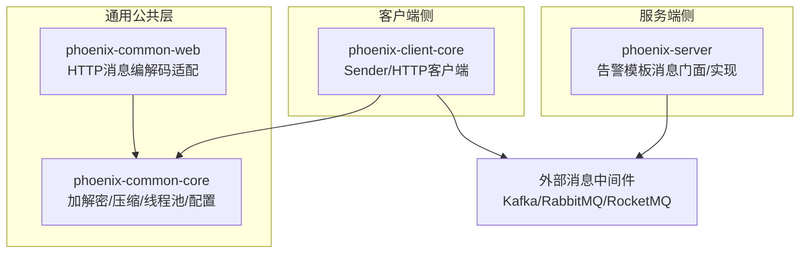
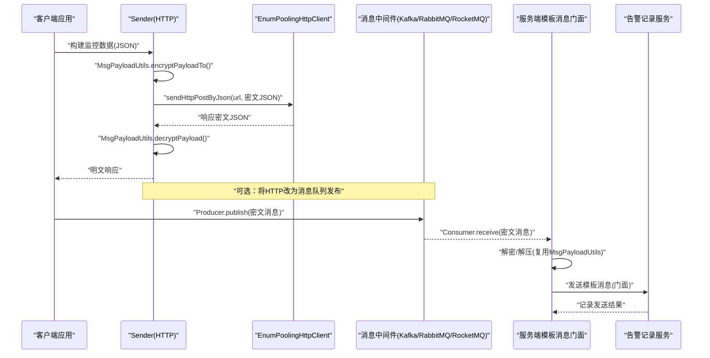
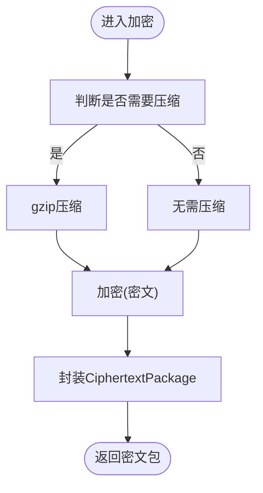
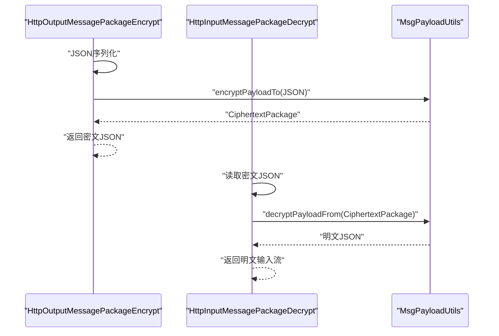
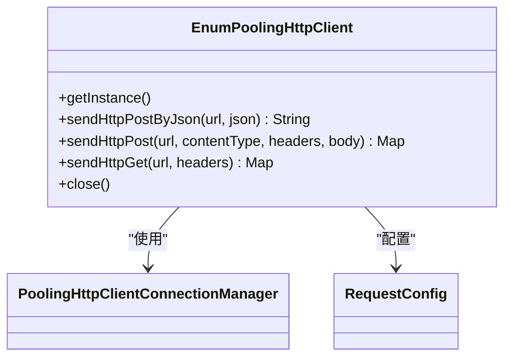
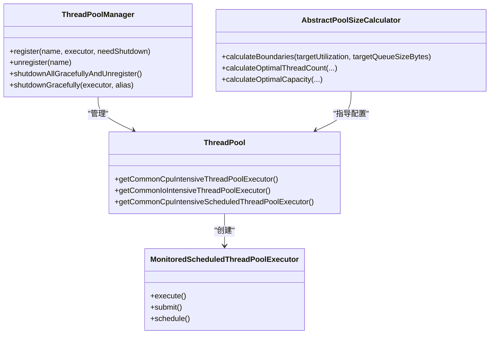
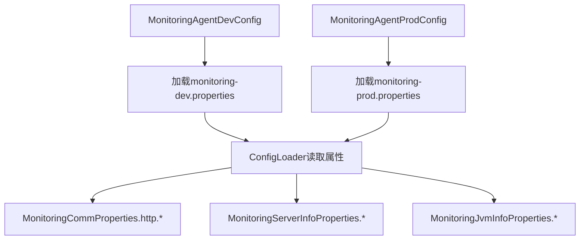
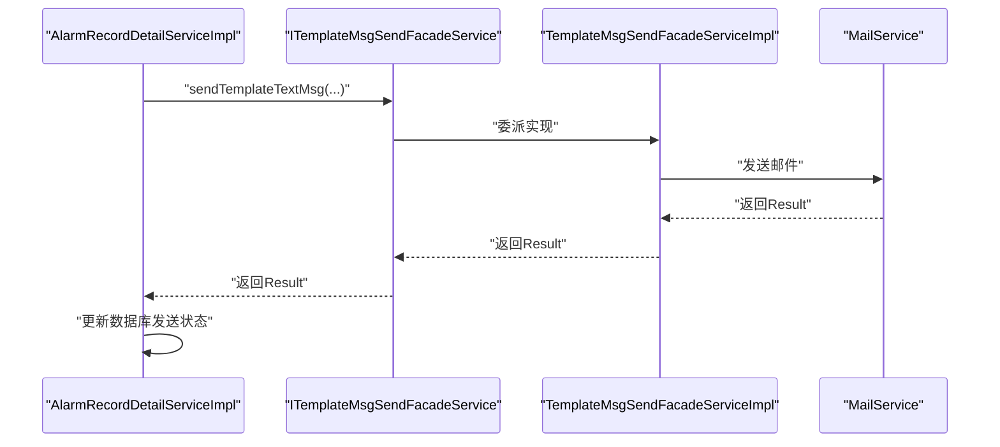
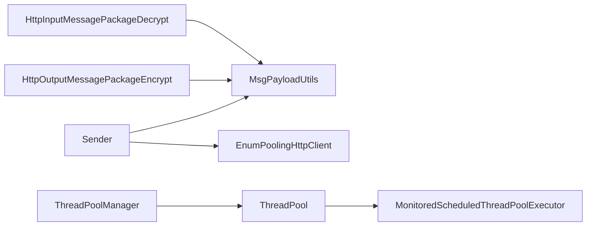

# 消息队列集成

<cite>
**本文引用的文件**
- [Sender.java](file://phoenix-client\phoenix-client-core\src\main\java\com\gitee\pifeng\monitoring\plug\core\Sender.java)
- [EnumPoolingHttpClient.java](file://phoenix-client\phoenix-client-core\src\main\java\com\gitee\pifeng\monitoring\plug\core\EnumPoolingHttpClient.java)
- [MsgPayloadUtils.java](file://phoenix-common\phoenix-common-core\src\main\java\com\gitee\pifeng\monitoring\common\util\MsgPayloadUtils.java)
- [ZipUtils.java](file://phoenix-common\phoenix-common-core\src\main\java\com\gitee\pifeng\monitoring\common\util\ZipUtils.java)
- [CiphertextPackage.java](file://phoenix-common\phoenix-common-core\src\main\java\com\gitee\pifeng\monitoring\common\dto\CiphertextPackage.java)
- [HttpOutputMessagePackageEncrypt.java](file://phoenix-common\phoenix-common-web\src\main\java\com\gitee\pifeng\monitoring\common\web\core\http\HttpOutputMessagePackageEncrypt.java)
- [HttpInputMessagePackageDecrypt.java](file://phoenix-common\phoenix-common-web\src\main\java\com\gitee\pifeng\monitoring\common\web\core\http\HttpInputMessagePackageDecrypt.java)
- [SecureUtils.java](file://phoenix-common\phoenix-common-core\src\main\java\com\gitee\pifeng\monitoring\common\util\secure\SecureUtils.java)
- [AesEncryptUtils.java](file://phoenix-common\phoenix-common-core\src\main\java\com\gitee\pifeng\monitoring\common\util\secure\AesEncryptUtils.java)
- [ISecurer.java](file://phoenix-common\phoenix-common-core\src\main\java\com\gitee\pifeng\monitoring\common\inf\ISecurer.java)
- [ThreadPool.java](file://phoenix-common\phoenix-common-core\src\main\java\com\gitee\pifeng\monitoring\common\threadpool\ThreadPool.java)
- [MonitoredScheduledThreadPoolExecutor.java](file://phoenix-common\phoenix-common-core\src\main\java\com\gitee\pifeng\monitoring\common\threadpool\MonitoredScheduledThreadPoolExecutor.java)
- [ThreadPoolManager.java](file://phoenix-common\phoenix-common-core\src\main\java\com\gitee\pifeng\monitoring\common\threadpool\ThreadPoolManager.java)
- [AbstractPoolSizeCalculator.java](file://phoenix-common\phoenix-common-core\src\main\java\com\gitee\pifeng\monitoring\common\abs\AbstractPoolSizeCalculator.java)
- [MonitoringCommProperties.java](file://phoenix-common\phoenix-common-core\src\main\java\com\gitee\pifeng\monitoring\common\property\client\MonitoringCommProperties.java)
- [MonitoringProperties.java](file://phoenix-common\phoenix-common-core\src\main\java\com\gitee\pifeng\monitoring\common\property\client\MonitoringProperties.java)
- [MonitoringServerInfoProperties.java](file://phoenix-common\phoenix-common-core\src\main\java\com\gitee\pifeng\monitoring\common\property\client\MonitoringServerInfoProperties.java)
- [MonitoringJvmInfoProperties.java](file://phoenix-common\phoenix-common-core\src\main\java\com\gitee\pifeng\monitoring\common\property\client\MonitoringJvmInfoProperties.java)
- [MonitoringNetworkProperties.java](file://phoenix-common\phoenix-common-core\src\main\java\com\gitee\pifeng\monitoring\common\property\server\MonitoringNetworkProperties.java)
- [MonitoringAgentDevConfig.java](file://phoenix-agent\src\main\java\com\gitee\pifeng\monitoring\agent\config\MonitoringAgentDevConfig.java)
- [MonitoringAgentProdConfig.java](file://phoenix-agent\src\main\java\com\gitee\pifeng\monitoring\agent\config\MonitoringAgentProdConfig.java)
- [ConfigLoader.java](file://phoenix-client\phoenix-client-core\src\main\java\com\gitee\pifeng\monitoring\plug\core\ConfigLoader.java)
- [ITemplateMsgSendFacadeService.java](file://phoenix-server\src\main\java\com\gitee\pifeng\monitoring\server\business\server\service\ITemplateMsgSendFacadeService.java)
- [TemplateMsgSendFacadeServiceImpl.java](file://phoenix-server\src\main\java\com\gitee\pifeng\monitoring\server\business\server\service\impl\TemplateMsgSendFacadeServiceImpl.java)
- [AlarmRecordDetailServiceImpl.java](file://phoenix-server\src\main\java\com\gitee\pifeng\monitoring\server\business\server\service\impl\AlarmRecordDetailServiceImpl.java)
</cite>

## 目录
1. [简介](#简介)
2. [项目结构](#项目结构)
3. [核心组件](#核心组件)
4. [架构总览](#架构总览)
5. [详细组件分析](#详细组件分析)
6. [依赖分析](#依赖分析)
7. [性能考量](#性能考量)
8. [故障排查指南](#故障排查指南)
9. [结论](#结论)
10. [附录](#附录)

## 简介
本文件面向Phoenix监控系统的消息队列集成功能，系统性阐述与Kafka、RabbitMQ、RocketMQ等主流消息中间件的对接思路与实现要点，涵盖消息序列化/反序列化、消息路由、异步数据处理、可靠性保障、流量控制与背压、分区与负载均衡、消息持久化与备份、高可用策略，以及性能优化（批量发送、压缩传输、连接池管理）等关键技术路径。由于仓库中未发现直接的消息队列客户端集成代码，本文基于现有HTTP通信、加解密与压缩、线程池与调度、配置加载等基础设施，给出可落地的工程化集成方案与最佳实践。

## 项目结构
Phoenix监控系统采用多模块分层架构：
- 客户端插件模块（phoenix-client-core）：负责采集与发送监控数据，内置HTTP连接池与请求封装。
- 通用公共模块（phoenix-common-core/web）：提供加解密、压缩、DTO、线程池与调度、配置加载等通用能力。
- 服务端模块（phoenix-server）：提供告警模板消息发送门面与实现，支撑邮件等告警通道。
- Agent模块（phoenix-agent）：提供开发/生产环境的监控配置加载入口。
- UI模块（phoenix-ui）：前端展示与配置界面（本文件不涉及）。

**图表来源**
- [Sender.java:42-59](file://phoenix-client\phoenix-client-core\src\main\java\com\gitee\pifeng\monitoring\plug\core\Sender.java#L42-L59)
- [EnumPoolingHttpClient.java:124-200](file://phoenix-client\phoenix-client-core\src\main\java\com\gitee\pifeng\monitoring\plug\core\EnumPoolingHttpClient.java#L124-L200)
- [MsgPayloadUtils.java:42-73](file://phoenix-common\phoenix-common-core\src\main\java\com\gitee\pifeng\monitoring\common\util\MsgPayloadUtils.java#L42-L73)
- [HttpOutputMessagePackageEncrypt.java:29-38](file://phoenix-common\phoenix-common-web\src\main\java\com\gitee\pifeng\monitoring\common\web\core\http\HttpOutputMessagePackageEncrypt.java#L29-L38)
- [HttpInputMessagePackageDecrypt.java:72-84](file://phoenix-common\phoenix-common-web\src\main\java\com\gitee\pifeng\monitoring\common\web\core\http\HttpInputMessagePackageDecrypt.java#L72-L84)
- [ITemplateMsgSendFacadeService.java:17-34](file://phoenix-server\src\main\java\com\gitee\pifeng\monitoring\server\business\server\service\ITemplateMsgSendFacadeService.java#L17-L34)

**章节来源**
- [Sender.java:1-61](file://phoenix-client\phoenix-client-core\src\main\java\com\gitee\pifeng\monitoring\plug\core\Sender.java#L1-L61)
- [EnumPoolingHttpClient.java:1-442](file://phoenix-client\phoenix-client-core\src\main\java\com\gitee\pifeng\monitoring\plug\core\EnumPoolingHttpClient.java#L1-L442)
- [MsgPayloadUtils.java:1-120](file://phoenix-common\phoenix-common-core\src\main\java\com\gitee\pifeng\monitoring\common\util\MsgPayloadUtils.java#L1-L120)
- [HttpOutputMessagePackageEncrypt.java:1-40](file://phoenix-common\phoenix-common-web\src\main\java\com\gitee\pifeng\monitoring\common\web\core\http\HttpOutputMessagePackageEncrypt.java#L1-L40)
- [HttpInputMessagePackageDecrypt.java:1-102](file://phoenix-common\phoenix-common-web\src\main\java\com\gitee\pifeng\monitoring\common\web\core\http\HttpInputMessagePackageDecrypt.java#L1-L102)
- [ITemplateMsgSendFacadeService.java:1-34](file://phoenix-server\src\main\java\com\gitee\pifeng\monitoring\server\business\server\service\ITemplateMsgSendFacadeService.java#L1-L34)

## 核心组件
- HTTP发送与连接池
  - Sender：对明文JSON进行加密封装后通过HTTP POST发送，接收端再解密返回结果。
  - EnumPoolingHttpClient：基于Apache HttpClient的连接池客户端，支持超时、重试、长连接回收、SSL配置等。
- 消息编解码与压缩
  - MsgPayloadUtils：统一封装加密与压缩流程，自动判断是否启用gzip压缩。
  - CiphertextPackage：密文数据包载体，携带密文与压缩标记。
  - ZipUtils：按阈值判断是否压缩（默认64KB）。
  - SecureUtils/AES/接口ISecurer：提供多种加解密实现与统一接口。
- HTTP消息编解码适配
  - HttpOutputMessagePackageEncrypt：输出响应时加密。
  - HttpInputMessagePackageDecrypt：输入请求时解密。
- 线程池与调度
  - ThreadPool：提供CPU密集型与IO密集型线程池，含命名与守护线程策略。
  - MonitoredScheduledThreadPoolExecutor：带拒绝策略监控的调度线程池。
  - ThreadPoolManager：统一注册/注销与优雅关闭线程池。
  - AbstractPoolSizeCalculator：计算最优线程数与队列容量。
- 配置与属性
  - MonitoringProperties/MonitoringCommProperties等：集中管理通信、心跳、服务器信息、JVM信息等属性。
  - ConfigLoader：加载配置并注入到客户端发送逻辑。
- 告警消息发送
  - ITemplateMsgSendFacadeService：告警模板消息发送门面接口。
  - TemplateMsgSendFacadeServiceImpl：具体实现（示例为邮件）。
  - AlarmRecordDetailServiceImpl：调用门面发送并记录结果。

**章节来源**
- [Sender.java:42-59](file://phoenix-client\phoenix-client-core\src\main\java\com\gitee\pifeng\monitoring\plug\core\Sender.java#L42-L59)
- [EnumPoolingHttpClient.java:124-200](file://phoenix-client\phoenix-client-core\src\main\java\com\gitee\pifeng\monitoring\plug\core\EnumPoolingHttpClient.java#L124-L200)
- [MsgPayloadUtils.java:42-118](file://phoenix-common\phoenix-common-core\src\main\java\com\gitee\pifeng\monitoring\common\util\MsgPayloadUtils.java#L42-L118)
- [CiphertextPackage.java:1-33](file://phoenix-common\phoenix-common-core\src\main\java\com\gitee\pifeng\monitoring\common\dto\CiphertextPackage.java#L1-L33)
- [ZipUtils.java:39-52](file://phoenix-common\phoenix-common-core\src\main\java\com\gitee\pifeng\monitoring\common\util\ZipUtils.java#L39-L52)
- [SecureUtils.java:34-40](file://phoenix-common\phoenix-common-core\src\main\java\com\gitee\pifeng\monitoring\common\util\secure\SecureUtils.java#L34-L40)
- [AesEncryptUtils.java:30-48](file://phoenix-common\phoenix-common-core\src\main\java\com\gitee\pifeng\monitoring\common\util\secure\AesEncryptUtils.java#L30-L48)
- [ISecurer.java:1-65](file://phoenix-common\phoenix-common-core\src\main\java\com\gitee\pifeng\monitoring\common\inf\ISecurer.java#L1-L65)
- [HttpOutputMessagePackageEncrypt.java:29-38](file://phoenix-common\phoenix-common-web\src\main\java\com\gitee\pifeng\monitoring\common\web\core\http\HttpOutputMessagePackageEncrypt.java#L29-L38)
- [HttpInputMessagePackageDecrypt.java:72-84](file://phoenix-common\phoenix-common-web\src\main\java\com\gitee\pifeng\monitoring\common\web\core\http\HttpInputMessagePackageDecrypt.java#L72-L84)
- [ThreadPool.java:102-172](file://phoenix-common\phoenix-common-core\src\main\java\com\gitee\pifeng\monitoring\common\threadpool\ThreadPool.java#L102-L172)
- [MonitoredScheduledThreadPoolExecutor.java:95-146](file://phoenix-common\phoenix-common-core\src\main\java\com\gitee\pifeng\monitoring\common\threadpool\MonitoredScheduledThreadPoolExecutor.java#L95-L146)
- [ThreadPoolManager.java:45-128](file://phoenix-common\phoenix-common-core\src\main\java\com\gitee\pifeng\monitoring\common\threadpool\ThreadPoolManager.java#L45-L128)
- [AbstractPoolSizeCalculator.java:46-91](file://phoenix-common\phoenix-common-core\src\main\java\com\gitee\pifeng\monitoring\common\abs\AbstractPoolSizeCalculator.java#L46-L91)
- [MonitoringProperties.java:18-55](file://phoenix-common\phoenix-common-core\src\main\java\com\gitee\pifeng\monitoring\common\property\client\MonitoringProperties.java#L18-L55)
- [MonitoringCommProperties.java:16-27](file://phoenix-common\phoenix-common-core\src\main\java\com\gitee\pifeng\monitoring\common\property\client\MonitoringCommProperties.java#L16-L27)
- [MonitoringServerInfoProperties.java:16-42](file://phoenix-common\phoenix-common-core\src\main\java\com\gitee\pifeng\monitoring\common\property\client\MonitoringServerInfoProperties.java#L16-L42)
- [MonitoringJvmInfoProperties.java:16-32](file://phoenix-common\phoenix-common-core\src\main\java\com\gitee\pifeng\monitoring\common\property\client\MonitoringJvmInfoProperties.java#L16-L32)
- [MonitoringNetworkProperties.java:14-31](file://phoenix-common\phoenix-common-core\src\main\java\com\gitee\pifeng\monitoring\common\property\server\MonitoringNetworkProperties.java#L14-L31)
- [ConfigLoader.java:545-559](file://phoenix-client\phoenix-client-core\src\main\java\com\gitee\pifeng\monitoring\plug\core\ConfigLoader.java#L545-L559)
- [ITemplateMsgSendFacadeService.java:17-34](file://phoenix-server\src\main\java\com\gitee\pifeng\monitoring\server\business\server\service\ITemplateMsgSendFacadeService.java#L17-L34)
- [TemplateMsgSendFacadeServiceImpl.java:69-85](file://phoenix-server\src\main\java\com\gitee\pifeng\monitoring\server\business\server\service\impl\TemplateMsgSendFacadeServiceImpl.java#L69-L85)
- [AlarmRecordDetailServiceImpl.java:168-198](file://phoenix-server\src\main\java\com\gitee\pifeng\monitoring\server\business\server\service\impl\AlarmRecordDetailServiceImpl.java#L168-L198)

## 架构总览
下图展示了Phoenix监控系统在消息队列集成场景下的典型数据流：客户端采集数据经HTTP发送至服务端，服务端通过门面统一发送模板消息（如邮件）。若需接入消息队列，可在客户端侧或服务端侧引入相应客户端，将HTTP改为消息队列发布/订阅，同时复用现有的加解密与压缩能力。

**图表来源**
- [Sender.java:42-59](file://phoenix-client\phoenix-client-core\src\main\java\com\gitee\pifeng\monitoring\plug\core\Sender.java#L42-L59)
- [EnumPoolingHttpClient.java:233-266](file://phoenix-client\phoenix-client-core\src\main\java\com\gitee\pifeng\monitoring\plug\core\EnumPoolingHttpClient.java#L233-L266)
- [MsgPayloadUtils.java:42-118](file://phoenix-common\phoenix-common-core\src\main\java\com\gitee\pifeng\monitoring\common\util\MsgPayloadUtils.java#L42-L118)
- [ITemplateMsgSendFacadeService.java:17-34](file://phoenix-server\src\main\java\com\gitee\pifeng\monitoring\server\business\server\service\ITemplateMsgSendFacadeService.java#L17-L34)
- [TemplateMsgSendFacadeServiceImpl.java:69-85](file://phoenix-server\src\main\java\com\gitee\pifeng\monitoring\server\business\server\service\impl\TemplateMsgSendFacadeServiceImpl.java#L69-L85)

## 详细组件分析

### 组件A：消息序列化与压缩（MsgPayloadUtils）
- 功能要点
  - 自动判断是否压缩：超过阈值（默认64KB）启用gzip压缩。
  - 统一加密：对压缩后/前的字节进行对称加密，生成密文数据包。
  - 解密与解压：根据密文包标记决定是否解压后再解密。
- 关键流程

**图表来源**
- [MsgPayloadUtils.java:42-59](file://phoenix-common\phoenix-common-core\src\main\java\com\gitee\pifeng\monitoring\common\util\MsgPayloadUtils.java#L42-L59)
- [ZipUtils.java:39-52](file://phoenix-common\phoenix-common-core\src\main\java\com\gitee\pifeng\monitoring\common\util\ZipUtils.java#L39-L52)
- [CiphertextPackage.java:21-33](file://phoenix-common\phoenix-common-core\src\main\java\com\gitee\pifeng\monitoring\common\dto\CiphertextPackage.java#L21-L33)

**章节来源**
- [MsgPayloadUtils.java:42-118](file://phoenix-common\phoenix-common-core\src\main\java\com\gitee\pifeng\monitoring\common\util\MsgPayloadUtils.java#L42-L118)
- [ZipUtils.java:39-52](file://phoenix-common\phoenix-common-core\src\main\java\com\gitee\pifeng\monitoring\common\util\ZipUtils.java#L39-L52)
- [CiphertextPackage.java:1-33](file://phoenix-common\phoenix-common-core\src\main\java\com\gitee\pifeng\monitoring\common\dto\CiphertextPackage.java#L1-L33)

### 组件B：HTTP消息编解码适配（Web层）
- 输出加密：将响应对象转JSON后，调用MsgPayloadUtils加密，返回密文数据包。
- 输入解密：读取密文数据包，调用MsgPayloadUtils解密，还原明文请求体。

**图表来源**
- [HttpOutputMessagePackageEncrypt.java:29-38](file://phoenix-common\phoenix-common-web\src\main\java\com\gitee\pifeng\monitoring\common\web\core\http\HttpOutputMessagePackageEncrypt.java#L29-L38)
- [HttpInputMessagePackageDecrypt.java:72-84](file://phoenix-common\phoenix-common-web\src\main\java\com\gitee\pifeng\monitoring\common\web\core\http\HttpInputMessagePackageDecrypt.java#L72-L84)
- [MsgPayloadUtils.java:85-118](file://phoenix-common\phoenix-common-core\src\main\java\com\gitee\pifeng\monitoring\common\util\MsgPayloadUtils.java#L85-L118)

**章节来源**
- [HttpOutputMessagePackageEncrypt.java:1-40](file://phoenix-common\phoenix-common-web\src\main\java\com\gitee\pifeng\monitoring\common\web\core\http\HttpOutputMessagePackageEncrypt.java#L1-L40)
- [HttpInputMessagePackageDecrypt.java:1-102](file://phoenix-common\phoenix-common-web\src\main\java\com\gitee\pifeng\monitoring\common\web\core\http\HttpInputMessagePackageDecrypt.java#L1-L102)
- [MsgPayloadUtils.java:85-118](file://phoenix-common\phoenix-common-core\src\main\java\com\gitee\pifeng\monitoring\common\util\MsgPayloadUtils.java#L85-L118)

### 组件C：HTTP客户端与连接池（EnumPoolingHttpClient）
- 连接池配置：最大连接数、每路由最大连接、空闲回收、连接存活时间、超时参数等。
- 请求封装：支持JSON与表单两种内容类型，自动设置字符集与媒体类型。
- 重试与健壮性：默认重试3次，禁用自动重定向，确保可控的失败处理。

**图表来源**
- [EnumPoolingHttpClient.java:124-200](file://phoenix-client\phoenix-client-core\src\main\java\com\gitee\pifeng\monitoring\plug\core\EnumPoolingHttpClient.java#L124-L200)
- [EnumPoolingHttpClient.java:233-266](file://phoenix-client\phoenix-client-core\src\main\java\com\gitee\pifeng\monitoring\plug\core\EnumPoolingHttpClient.java#L233-L266)

**章节来源**
- [EnumPoolingHttpClient.java:124-200](file://phoenix-client\phoenix-client-core\src\main\java\com\gitee\pifeng\monitoring\plug\core\EnumPoolingHttpClient.java#L124-L200)
- [EnumPoolingHttpClient.java:233-266](file://phoenix-client\phoenix-client-core\src\main\java\com\gitee\pifeng\monitoring\plug\core\EnumPoolingHttpClient.java#L233-L266)

### 组件D：线程池与调度（ThreadPool/Executor/Manager）
- 线程池策略：CPU密集型与IO密集型分别配置，守护线程命名，拒绝策略监控。
- 优雅关闭：统一注册线程池，支持超时中断与日志提示。
- 边界计算：提供计算最优线程数与队列容量的工具类。

**图表来源**
- [ThreadPool.java:102-172](file://phoenix-common\phoenix-common-core\src\main\java\com\gitee\pifeng\monitoring\common\threadpool\ThreadPool.java#L102-L172)
- [MonitoredScheduledThreadPoolExecutor.java:95-146](file://phoenix-common\phoenix-common-core\src\main\java\com\gitee\pifeng\monitoring\common\threadpool\MonitoredScheduledThreadPoolExecutor.java#L95-L146)
- [ThreadPoolManager.java:45-128](file://phoenix-common\phoenix-common-core\src\main\java\com\gitee\pifeng\monitoring\common\threadpool\ThreadPoolManager.java#L45-L128)
- [AbstractPoolSizeCalculator.java:46-91](file://phoenix-common\phoenix-common-core\src\main\java\com\gitee\pifeng\monitoring\common\abs\AbstractPoolSizeCalculator.java#L46-L91)

**章节来源**
- [ThreadPool.java:102-172](file://phoenix-common\phoenix-common-core\src\main\java\com\gitee\pifeng\monitoring\common\threadpool\ThreadPool.java#L102-L172)
- [MonitoredScheduledThreadPoolExecutor.java:95-146](file://phoenix-common\phoenix-common-core\src\main\java\com\gitee\pifeng\monitoring\common\threadpool\MonitoredScheduledThreadPoolExecutor.java#L95-L146)
- [ThreadPoolManager.java:45-128](file://phoenix-common\phoenix-common-core\src\main\java\com\gitee\pifeng\monitoring\common\threadpool\ThreadPoolManager.java#L45-L128)
- [AbstractPoolSizeCalculator.java:46-91](file://phoenix-common\phoenix-common-core\src\main\java\com\gitee\pifeng\monitoring\common\abs\AbstractPoolSizeCalculator.java#L46-L91)

### 组件E：配置与属性（MonitoringProperties/ConfigLoader）
- 属性模型：集中管理安全、通信、心跳、服务器信息、JVM信息、网络等配置。
- 加载入口：Agent配置在不同环境加载不同属性文件，ConfigLoader读取并注入到客户端发送逻辑。

**图表来源**
- [MonitoringAgentDevConfig.java:31-35](file://phoenix-agent\src\main\java\com\gitee\pifeng\monitoring\agent\config\MonitoringAgentDevConfig.java#L31-L35)
- [MonitoringAgentProdConfig.java:31-35](file://phoenix-agent\src\main\java\com\gitee\pifeng\monitoring\agent\config\MonitoringAgentProdConfig.java#L31-L35)
- [MonitoringProperties.java:18-55](file://phoenix-common\phoenix-common-core\src\main\java\com\gitee\pifeng\monitoring\common\property\client\MonitoringProperties.java#L18-L55)
- [MonitoringCommProperties.java:16-27](file://phoenix-common\phoenix-common-core\src\main\java\com\gitee\pifeng\monitoring\common\property\client\MonitoringCommProperties.java#L16-L27)
- [MonitoringServerInfoProperties.java:16-42](file://phoenix-common\phoenix-common-core\src\main\java\com\gitee\pifeng\monitoring\common\property\client\MonitoringServerInfoProperties.java#L16-L42)
- [MonitoringJvmInfoProperties.java:16-32](file://phoenix-common\phoenix-common-core\src\main\java\com\gitee\pifeng\monitoring\common\property\client\MonitoringJvmInfoProperties.java#L16-L32)
- [ConfigLoader.java:545-559](file://phoenix-client\phoenix-client-core\src\main\java\com\gitee\pifeng\monitoring\plug\core\ConfigLoader.java#L545-L559)

**章节来源**
- [MonitoringAgentDevConfig.java:1-37](file://phoenix-agent\src\main\java\com\gitee\pifeng\monitoring\agent\config\MonitoringAgentDevConfig.java#L1-L37)
- [MonitoringAgentProdConfig.java:1-37](file://phoenix-agent\src\main\java\com\gitee\pifeng\monitoring\agent\config\MonitoringAgentProdConfig.java#L1-L37)
- [MonitoringProperties.java:18-55](file://phoenix-common\phoenix-common-core\src\main\java\com\gitee\pifeng\monitoring\common\property\client\MonitoringProperties.java#L18-L55)
- [MonitoringCommProperties.java:16-27](file://phoenix-common\phoenix-common-core\src\main\java\com\gitee\pifeng\monitoring\common\property\client\MonitoringCommProperties.java#L16-L27)
- [MonitoringServerInfoProperties.java:16-42](file://phoenix-common\phoenix-common-core\src\main\java\com\gitee\pifeng\monitoring\common\property\client\MonitoringServerInfoProperties.java#L16-L42)
- [MonitoringJvmInfoProperties.java:16-32](file://phoenix-common\phoenix-common-core\src\main\java\com\gitee\pifeng\monitoring\common\property\client\MonitoringJvmInfoProperties.java#L16-L32)
- [ConfigLoader.java:545-559](file://phoenix-client\phoenix-client-core\src\main\java\com\gitee\pifeng\monitoring\plug\core\ConfigLoader.java#L545-L559)

### 组件F：告警模板消息门面（服务端）
- 门面接口：ITemplateMsgSendFacadeService定义统一发送模板文本消息的入口。
- 具体实现：TemplateMsgSendFacadeServiceImpl根据告警方式（如邮件）调用对应服务发送。
- 结果记录：AlarmRecordDetailServiceImpl调用门面发送并记录结果。

**图表来源**
- [ITemplateMsgSendFacadeService.java:17-34](file://phoenix-server\src\main\java\com\gitee\pifeng\monitoring\server\business\server\service\ITemplateMsgSendFacadeService.java#L17-L34)
- [TemplateMsgSendFacadeServiceImpl.java:69-85](file://phoenix-server\src\main\java\com\gitee\pifeng\monitoring\server\business\server\service\impl\TemplateMsgSendFacadeServiceImpl.java#L69-L85)
- [AlarmRecordDetailServiceImpl.java:168-198](file://phoenix-server\src\main\java\com\gitee\pifeng\monitoring\server\business\server\service\impl\AlarmRecordDetailServiceImpl.java#L168-L198)

**章节来源**
- [ITemplateMsgSendFacadeService.java:1-34](file://phoenix-server\src\main\java\com\gitee\pifeng\monitoring\server\business\server\service\ITemplateMsgSendFacadeService.java#L1-L34)
- [TemplateMsgSendFacadeServiceImpl.java:69-85](file://phoenix-server\src\main\java\com\gitee\pifeng\monitoring\server\business\server\service\impl\TemplateMsgSendFacadeServiceImpl.java#L69-L85)
- [AlarmRecordDetailServiceImpl.java:168-198](file://phoenix-server\src\main\java\com\gitee\pifeng\monitoring\server\business\server\service\impl\AlarmRecordDetailServiceImpl.java#L168-L198)

## 依赖分析
- 组件耦合
  - Sender依赖MsgPayloadUtils与EnumPoolingHttpClient，形成“加密封装+HTTP发送”的闭环。
  - Web层的编解码适配依赖MsgPayloadUtils，确保服务端/客户端一致性。
  - 线程池与调度组件为异步处理提供基础，避免阻塞主线程。
- 外部依赖
  - Apache HttpClient用于HTTP连接池与请求封装。
  - Hutool用于压缩、编码与工具函数。
  - Spring Web用于HTTP消息编解码适配（Web层）。

**图表来源**
- [Sender.java:42-59](file://phoenix-client\phoenix-client-core\src\main\java\com\gitee\pifeng\monitoring\plug\core\Sender.java#L42-L59)
- [EnumPoolingHttpClient.java:124-200](file://phoenix-client\phoenix-client-core\src\main\java\com\gitee\pifeng\monitoring\plug\core\EnumPoolingHttpClient.java#L124-L200)
- [MsgPayloadUtils.java:42-118](file://phoenix-common\phoenix-common-core\src\main\java\com\gitee\pifeng\monitoring\common\util\MsgPayloadUtils.java#L42-L118)
- [HttpOutputMessagePackageEncrypt.java:29-38](file://phoenix-common\phoenix-common-web\src\main\java\com\gitee\pifeng\monitoring\common\web\core\http\HttpOutputMessagePackageEncrypt.java#L29-L38)
- [HttpInputMessagePackageDecrypt.java:72-84](file://phoenix-common\phoenix-common-web\src\main\java\com\gitee\pifeng\monitoring\common\web\core\http\HttpInputMessagePackageDecrypt.java#L72-L84)
- [ThreadPool.java:102-172](file://phoenix-common\phoenix-common-core\src\main\java\com\gitee\pifeng\monitoring\common\threadpool\ThreadPool.java#L102-L172)
- [MonitoredScheduledThreadPoolExecutor.java:95-146](file://phoenix-common\phoenix-common-core\src\main\java\com\gitee\pifeng\monitoring\common\threadpool\MonitoredScheduledThreadPoolExecutor.java#L95-L146)
- [ThreadPoolManager.java:45-128](file://phoenix-common\phoenix-common-core\src\main\java\com\gitee\pifeng\monitoring\common\threadpool\ThreadPoolManager.java#L45-L128)

**章节来源**
- [Sender.java:1-61](file://phoenix-client\phoenix-client-core\src\main\java\com\gitee\pifeng\monitoring\plug\core\Sender.java#L1-L61)
- [EnumPoolingHttpClient.java:1-442](file://phoenix-client\phoenix-client-core\src\main\java\com\gitee\pifeng\monitoring\plug\core\EnumPoolingHttpClient.java#L1-L442)
- [MsgPayloadUtils.java:1-120](file://phoenix-common\phoenix-common-core\src\main\java\com\gitee\pifeng\monitoring\common\util\MsgPayloadUtils.java#L1-L120)
- [HttpOutputMessagePackageEncrypt.java:1-40](file://phoenix-common\phoenix-common-web\src\main\java\com\gitee\pifeng\monitoring\common\web\core\http\HttpOutputMessagePackageEncrypt.java#L1-L40)
- [HttpInputMessagePackageDecrypt.java:1-102](file://phoenix-common\phoenix-common-web\src\main\java\com\gitee\pifeng\monitoring\common\web\core\http\HttpInputMessagePackageDecrypt.java#L1-L102)
- [ThreadPool.java:102-172](file://phoenix-common\phoenix-common-core\src\main\java\com\gitee\pifeng\monitoring\common\threadpool\ThreadPool.java#L102-L172)
- [MonitoredScheduledThreadPoolExecutor.java:95-146](file://phoenix-common\phoenix-common-core\src\main\java\com\gitee\pifeng\monitoring\common\threadpool\MonitoredScheduledThreadPoolExecutor.java#L95-L146)
- [ThreadPoolManager.java:1-131](file://phoenix-common\phoenix-common-core\src\main\java\com\gitee\pifeng\monitoring\common\threadpool\ThreadPoolManager.java#L1-L131)

## 性能考量
- 批量发送与压缩传输
  - 压缩阈值：默认64KB以上启用gzip，减少网络带宽与序列化开销。
  - 批量策略：建议将多个监控事件合并为批次消息，降低RT与吞吐压力。
- 连接池管理
  - 合理设置最大连接数与每路由上限，避免连接池耗尽引发等待超时。
  - 启用空闲连接回收与过期连接清理，维持连接池健康。
- 线程池与背压
  - 使用IO密集型线程池处理网络I/O；CPU密集型线程池处理本地计算。
  - 通过AbstractPoolSizeCalculator评估最优线程数与队列容量，避免过度排队。
  - 配置拒绝策略与监控，及时发现并处理背压。
- 加解密与序列化
  - 优先使用对称加密（AES/SM4），结合gzip压缩，平衡安全性与性能。
  - 避免频繁创建加密实例，复用工具类静态方法。

**章节来源**
- [ZipUtils.java:39-52](file://phoenix-common\phoenix-common-core\src\main\java\com\gitee\pifeng\monitoring\common\util\ZipUtils.java#L39-L52)
- [MsgPayloadUtils.java:42-118](file://phoenix-common\phoenix-common-core\src\main\java\com\gitee\pifeng\monitoring\common\util\MsgPayloadUtils.java#L42-L118)
- [EnumPoolingHttpClient.java:154-198](file://phoenix-client\phoenix-client-core\src\main\java\com\gitee\pifeng\monitoring\plug\core\EnumPoolingHttpClient.java#L154-L198)
- [ThreadPool.java:102-172](file://phoenix-common\phoenix-common-core\src\main\java\com\gitee\pifeng\monitoring\common\threadpool\ThreadPool.java#L102-L172)
- [AbstractPoolSizeCalculator.java:46-91](file://phoenix-common\phoenix-common-core\src\main\java\com\gitee\pifeng\monitoring\common\abs\AbstractPoolSizeCalculator.java#L46-L91)

## 故障排查指南
- HTTP连接池异常
  - 症状：获取连接超时、连接池耗尽。
  - 排查：检查最大连接数与每路由上限配置，确认空闲/过期连接回收策略生效。
- 加解密失败
  - 症状：请求/响应解密异常。
  - 排查：确认密钥类型与密钥配置一致，检查密文包压缩标记与实际数据匹配。
- 告警发送失败
  - 症状：模板消息发送结果失败。
  - 排查：查看门面实现与对应通道（如邮件）配置，核对发送状态记录。
- 线程池拒绝
  - 症状：任务被拒绝或队列积压严重。
  - 排查：评估线程数与队列容量，调整拒绝策略与监控告警阈值。

**章节来源**
- [EnumPoolingHttpClient.java:154-198](file://phoenix-client\phoenix-client-core\src\main\java\com\gitee\pifeng\monitoring\plug\core\EnumPoolingHttpClient.java#L154-L198)
- [HttpInputMessagePackageDecrypt.java:81-84](file://phoenix-common\phoenix-common-web\src\main\java\com\gitee\pifeng\monitoring\common\web\core\http\HttpInputMessagePackageDecrypt.java#L81-L84)
- [ITemplateMsgSendFacadeService.java:17-34](file://phoenix-server\src\main\java\com\gitee\pifeng\monitoring\server\business\server\service\ITemplateMsgSendFacadeService.java#L17-L34)
- [TemplateMsgSendFacadeServiceImpl.java:69-85](file://phoenix-server\src\main\java\com\gitee\pifeng\monitoring\server\business\server\service\impl\TemplateMsgSendFacadeServiceImpl.java#L69-L85)
- [MonitoredScheduledThreadPoolExecutor.java:95-146](file://phoenix-common\phoenix-common-core\src\main\java\com\gitee\pifeng\monitoring\common\threadpool\MonitoredScheduledThreadPoolExecutor.java#L95-L146)

## 结论
Phoenix监控系统已具备完善的HTTP通信、加解密与压缩、线程池与调度、配置加载等基础设施，能够满足非阻塞数据采集与可靠传输的基本要求。针对消息队列集成，建议在客户端或服务端引入相应中间件客户端，将HTTP改为消息发布/订阅，同时复用现有MsgPayloadUtils与线程池策略，确保在高并发与复杂网络环境下仍能保持稳定与高性能。

## 附录
- Kafka集成要点
  - Producer：启用压缩（snappy/lz4/zstd）与批处理，合理设置acks与retries。
  - Consumer：使用分区与消费者组实现水平扩展，注意幂等与偏移量提交。
- RabbitMQ集成要点
  - Exchange/Queue/Binding：按主题/路由键组织消息，启用持久化与镜像队列提升可用性。
  - QoS：设置prefetch count，避免消费者过载。
- RocketMQ集成要点
  - Namesrv与Broker：合理部署与副本策略，启用刷盘与同步复制。
  - 消费模型：顺序消息与广播/集群消费的选择，ACK与重试策略。