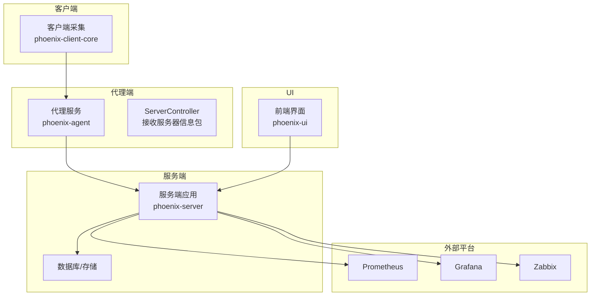
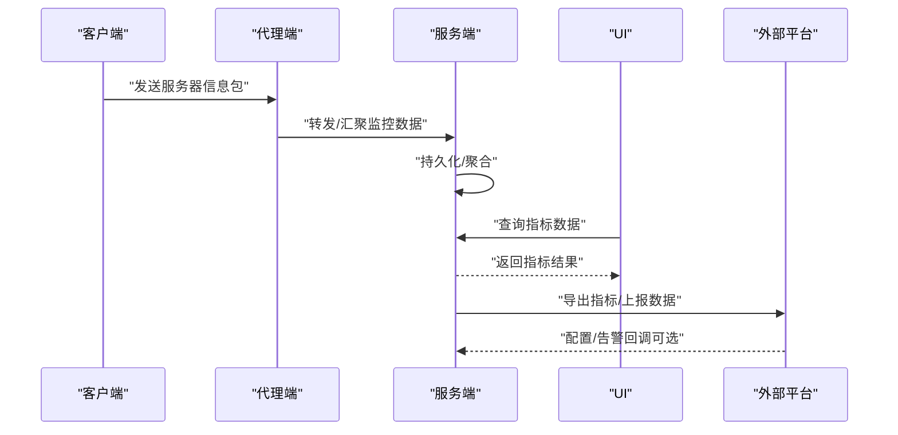
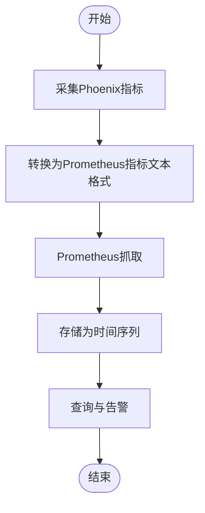
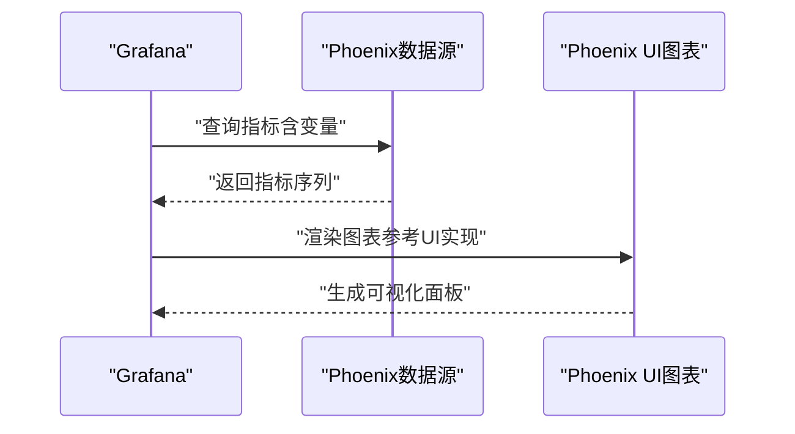
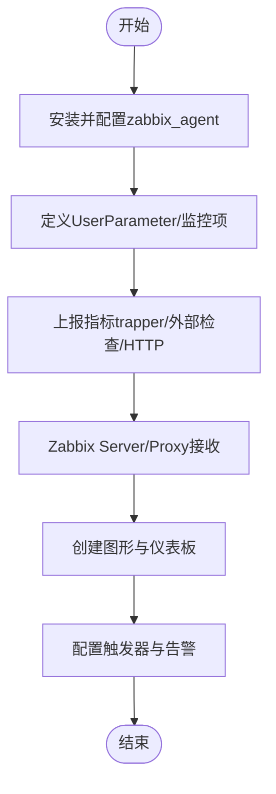
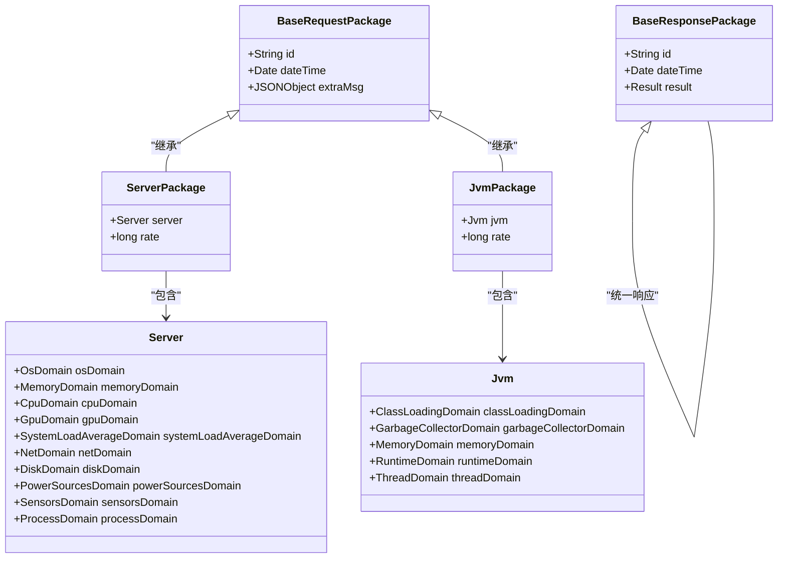
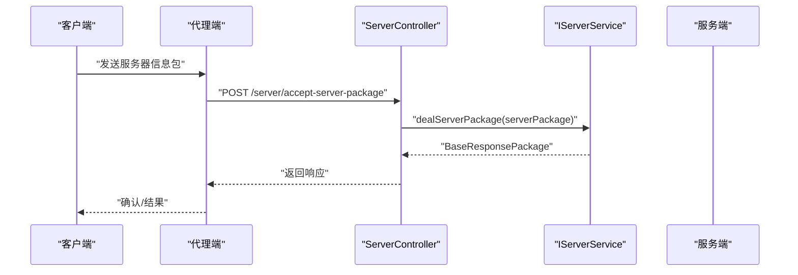
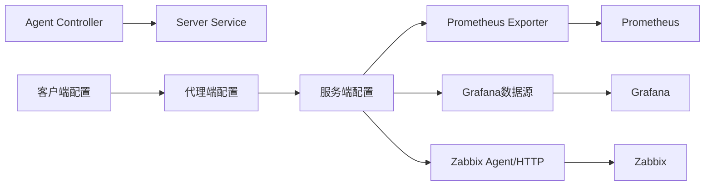

# 监控平台集成

<cite>
**本文引用的文件**
- [ServerController.java](file://phoenix-agent/src/main/java/com/gitee/pifeng/monitoring/agent/business/client/controller/ServerController.java)
- [JvmPackage.java](file://phoenix-common/phoenix-common-core/src/main/java/com/gitee/pifeng/monitoring/common/dto/JvmPackage.java)
- [BaseRequestPackage.java](file://phoenix-common/phoenix-common-core/src/main/java/com/gitee/pifeng/monitoring/common/dto/BaseRequestPackage.java)
- [BaseResponsePackage.java](file://phoenix-common/phoenix-common-core/src/main/java/com/gitee/pifeng/monitoring/common/dto/BaseResponsePackage.java)
- [Server.java](file://phoenix-common/phoenix-common-core/src/main/java/com/gitee/pifeng/monitoring/common/domain/Server.java)
- [Jvm.java](file://phoenix-common/phoenix-common-core/src/main/java/com/gitee/pifeng/monitoring/common/domain/Jvm.java)
- [monitoring.properties（客户端）](file://phoenix-client/phoenix-client-core/src/main/resources/monitoring.properties)
- [monitoring.properties（代理端）](file://phoenix-agent/src/main/resources/monitoring.properties)
- [monitoring.properties（服务端）](file://phoenix-server/src/main/resources/monitoring.properties)
- [monitoring.properties（UI端）](file://phoenix-ui/src/main/resources/monitoring.properties)
- [spring-configuration-metadata.json](file://phoenix-client/phoenix-client-spring-boot-starter/src/main/resources/META-INF/spring-configuration-metadata.json)
- [serverDetail.js](file://phoenix-ui/src/main/resources/static/modules/server/serverDetail.js)
</cite>

## 目录
1. [简介](#简介)
2. [项目结构](#项目结构)
3. [核心组件](#核心组件)
4. [架构总览](#架构总览)
5. [详细组件分析](#详细组件分析)
6. [依赖关系分析](#依赖关系分析)
7. [性能考虑](#性能考虑)
8. [故障排除指南](#故障排除指南)
9. [结论](#结论)
10. [附录](#附录)

## 简介
本文件面向Phoenix监控系统的监控平台集成场景，围绕与Prometheus、Grafana、Zabbix等主流监控平台的对接展开，重点覆盖以下方面：
- 数据导出与格式转换：如何将Phoenix内部监控数据转换为外部平台可消费的格式（如Prometheus指标文本格式、Grafana数据源格式、Zabbix主动/被动上报协议）。
- 指标采集配置：如何通过Phoenix客户端、代理端、服务端的配置参数控制采集频率、采集范围与传输行为。
- 双向数据同步机制：如何实现从Phoenix到外部平台的数据推送，以及在必要时从外部平台拉取或下发配置。
- Prometheus Exporter实现要点：如何将Phoenix指标映射为Prometheus指标、如何配置scrape目标、如何处理时间序列数据。
- Grafana仪表板集成：如何配置数据源、如何设计图表模板、如何利用变量替换机制。
- Zabbix集成步骤：如何配置zabbix_agent、如何创建自定义监控项、如何实现数据上报。
- 性能优化策略与故障排除方法。

## 项目结构
Phoenix采用多模块分层架构，监控数据在客户端采集后经由代理端汇聚，最终由服务端统一存储与对外展示；UI负责可视化呈现。与外部平台的集成主要通过服务端或代理端扩展实现，结合配置文件与HTTP接口完成数据导出与同步。

**图表来源**
- [ServerController.java:1-55](file://phoenix-agent/src/main/java/com/gitee/pifeng/monitoring/agent/business/client/controller/ServerController.java#L1-55)
- [monitoring.properties（客户端）:25-41](file://phoenix-client/phoenix-client-core/src/main/resources/monitoring.properties#L25-L41)
- [monitoring.properties（代理端）:25-41](file://phoenix-agent/src/main/resources/monitoring.properties#L25-L41)
- [monitoring.properties（服务端）:25-41](file://phoenix-server/src/main/resources/monitoring.properties#L25-L41)
- [monitoring.properties（UI端）:25-41](file://phoenix-ui/src/main/resources/monitoring.properties#L25-L41)

**章节来源**
- [ServerController.java:1-55](file://phoenix-agent/src/main/java/com/gitee/pifeng/monitoring/agent/business/client/controller/ServerController.java#L1-L55)
- [monitoring.properties（客户端）:25-41](file://phoenix-client/phoenix-client-core/src/main/resources/monitoring.properties#L25-L41)
- [monitoring.properties（代理端）:25-41](file://phoenix-agent/src/main/resources/monitoring.properties#L25-L41)
- [monitoring.properties（服务端）:25-41](file://phoenix-server/src/main/resources/monitoring.properties#L25-L41)
- [monitoring.properties（UI端）:25-41](file://phoenix-ui/src/main/resources/monitoring.properties#L25-L41)

## 核心组件
- 数据包模型
  - 请求基础包：用于承载监控数据的通用字段（标识、时间戳、附加信息）。
  - 响应基础包：用于服务端对请求的统一响应封装。
  - 服务器信息包：承载服务器维度的监控数据。
  - JVM信息包：承载JVM维度的监控数据。
- 领域模型
  - 服务器领域对象：聚合CPU、内存、磁盘、网络、进程等多维指标。
  - JVM领域对象：聚合类加载、GC、内存、线程等指标。
- 配置体系
  - 客户端/代理端/服务端/UI端的监控配置文件，分别定义采集开关、采集频率、IP等参数。
  - Spring Boot配置元数据，提供IDE提示与配置校验。

**章节来源**
- [BaseRequestPackage.java:1-42](file://phoenix-common/phoenix-common-core/src/main/java/com/gitee/pifeng/monitoring/common/dto/BaseRequestPackage.java#L1-L42)
- [BaseResponsePackage.java:1-42](file://phoenix-common/phoenix-common-core/src/main/java/com/gitee/pifeng/monitoring/common/dto/BaseResponsePackage.java#L1-L42)
- [Server.java:1-76](file://phoenix-common/phoenix-common-core/src/main/java/com/gitee/pifeng/monitoring/common/domain/Server.java#L1-L76)
- [Jvm.java:1-51](file://phoenix-common/phoenix-common-core/src/main/java/com/gitee/pifeng/monitoring/common/domain/Jvm.java#L1-L51)
- [monitoring.properties（客户端）:25-41](file://phoenix-client/phoenix-client-core/src/main/resources/monitoring.properties#L25-L41)
- [monitoring.properties（代理端）:25-41](file://phoenix-agent/src/main/resources/monitoring.properties#L25-L41)
- [monitoring.properties（服务端）:25-41](file://phoenix-server/src/main/resources/monitoring.properties#L25-L41)
- [monitoring.properties（UI端）:25-41](file://phoenix-ui/src/main/resources/monitoring.properties#L25-L41)
- [spring-configuration-metadata.json:1-182](file://phoenix-client/phoenix-client-spring-boot-starter/src/main/resources/META-INF/spring-configuration-metadata.json#L1-L182)

## 架构总览
Phoenix监控数据流从客户端采集开始，经代理端汇总，到达服务端持久化与对外输出；UI通过服务端查询数据并渲染图表。与外部平台的集成通常通过服务端扩展实现，将Phoenix指标转换为外部平台所需的格式或协议。

**图表来源**
- [ServerController.java:47-53](file://phoenix-agent/src/main/java/com/gitee/pifeng/monitoring/agent/business/client/controller/ServerController.java#L47-L53)
- [BaseRequestPackage.java:24-41](file://phoenix-common/phoenix-common-core/src/main/java/com/gitee/pifeng/monitoring/common/dto/BaseRequestPackage.java#L24-L41)
- [BaseResponsePackage.java:24-41](file://phoenix-common/phoenix-common-core/src/main/java/com/gitee/pifeng/monitoring/common/dto/BaseResponsePackage.java#L24-L41)

## 详细组件分析

### Prometheus Exporter 实现方案
目标：将Phoenix监控数据转换为Prometheus指标文本格式，供Prometheus scrape抓取。

- 指标映射策略
  - 将服务器维度指标映射为Prometheus指标，例如CPU使用率、内存使用量、磁盘IO等。
  - 将JVM维度指标映射为Prometheus指标，例如堆内存使用、GC次数、线程数等。
  - 使用标签（labels）表达实例、主机、应用等维度信息。
- Exporter实现路径
  - 在服务端新增一个HTTP端点，按Prometheus文本协议格式输出指标。
  - 对于时间序列数据，确保时间戳与抓取间隔一致，避免重复或缺失。
- scrape目标配置
  - 在Prometheus配置中添加job，指向服务端的Exporter端点。
  - 设置抓取间隔、超时与重试策略，保证稳定性。
- 处理要点
  - 指标命名遵循Prometheus命名规范，避免特殊字符。
  - 标签键值需规范化，避免过多高基数标签导致存储压力。
  - 对于瞬时速率类指标，建议在Exporter侧计算，减少Prometheus端计算负担。

[本图为概念性流程图，不直接对应具体源码文件]

### Grafana 仪表板集成方案
目标：在Grafana中以Phoenix服务端为数据源，构建可视化仪表板。

- 数据源配置
  - 在Grafana中添加Phoenix服务端作为数据源，配置URL与鉴权方式。
  - 若服务端提供GraphQL或REST接口，可在Grafana中选择相应类型。
- 图表模板设计
  - 使用ECharts等可视化库在UI中已有图表模板基础上，抽象为Grafana面板。
  - 通过变量（如实例、主机、应用）实现动态切换与过滤。
- 变量替换机制
  - 利用Grafana变量实现“实例”“主机名”“应用名”等维度的动态替换。
  - 结合Phoenix的查询接口，支持多实例聚合与对比分析。
- UI参考
  - Phoenix UI中已存在基于ECharts的图表实现，可作为Grafana面板设计的参考。

**图表来源**
- [serverDetail.js:2213-2390](file://phoenix-ui/src/main/resources/static/modules/server/serverDetail.js#L2213-L2390)

**章节来源**
- [serverDetail.js:2213-2390](file://phoenix-ui/src/main/resources/static/modules/server/serverDetail.js#L2213-L2390)

### Zabbix 集成步骤
目标：通过zabbix_agent与Zabbix Server/Proxy对接，实现Phoenix监控数据的上报与展示。

- zabbix_agent配置
  - 在被监控主机安装并启动zabbix_agent。
  - 配置UserParameter，将Phoenix指标查询脚本或HTTP接口暴露为Zabbix监控项。
- 自定义监控项
  - 创建Zabbix监控项，指定键值（key）、类型（如Zabbix trapper、外部检查）、更新间隔与历史数据保留。
  - 对于实时指标，可使用Zabbix trapper或外部检查方式上报。
- 数据上报
  - 通过Zabbix trapper或zabbix_sender将指标上报至Zabbix Server/Proxy。
  - 或者在Zabbix中配置Web场景，直接调用Phoenix服务端接口获取数据。
- 展示与告警
  - 在Zabbix中创建图形与仪表板，配置触发器与告警动作。

[本图为概念性流程图，不直接对应具体源码文件]

### 关键数据模型与数据包
- 请求基础包：包含id、dateTime、extraMsg等通用字段，用于承载各类监控数据包。
- 响应基础包：包含id、dateTime、result等字段，用于统一响应封装。
- 服务器信息包：承载服务器维度的指标集合，如CPU、内存、磁盘、网络等。
- JVM信息包：承载JVM维度的指标集合，如类加载、GC、内存、线程等。

**图表来源**
- [BaseRequestPackage.java:24-41](file://phoenix-common/phoenix-common-core/src/main/java/com/gitee/pifeng/monitoring/common/dto/BaseRequestPackage.java#L24-L41)
- [BaseResponsePackage.java:24-41](file://phoenix-common/phoenix-common-core/src/main/java/com/gitee/pifeng/monitoring/common/dto/BaseResponsePackage.java#L24-L41)
- [Server.java:23-75](file://phoenix-common/phoenix-common-core/src/main/java/com/gitee/pifeng/monitoring/common/domain/Server.java#L23-L75)
- [Jvm.java:23-50](file://phoenix-common/phoenix-common-core/src/main/java/com/gitee/pifeng/monitoring/common/domain/Jvm.java#L23-L50)
- [JvmPackage.java:21-33](file://phoenix-common/phoenix-common-core/src/main/java/com/gitee/pifeng/monitoring/common/dto/JvmPackage.java#L21-L33)

**章节来源**
- [BaseRequestPackage.java:1-42](file://phoenix-common/phoenix-common-core/src/main/java/com/gitee/pifeng/monitoring/common/dto/BaseRequestPackage.java#L1-L42)
- [BaseResponsePackage.java:1-42](file://phoenix-common/phoenix-common-core/src/main/java/com/gitee/pifeng/monitoring/common/dto/BaseResponsePackage.java#L1-L42)
- [Server.java:1-76](file://phoenix-common/phoenix-common-core/src/main/java/com/gitee/pifeng/monitoring/common/domain/Server.java#L1-L76)
- [Jvm.java:1-51](file://phoenix-common/phoenix-common-core/src/main/java/com/gitee/pifeng/monitoring/common/domain/Jvm.java#L1-L51)
- [JvmPackage.java:1-33](file://phoenix-common/phoenix-common-core/src/main/java/com/gitee/pifeng/monitoring/common/dto/JvmPackage.java#L1-L33)

### 采集配置与控制流
- 客户端/代理端/服务端/UI端的监控配置文件分别定义采集开关、采集频率、IP等参数。
- Spring Boot配置元数据提供IDE提示与配置校验，确保参数合法。
- 代理端控制器接收来自客户端的服务器信息包，进行处理与响应。

**图表来源**
- [ServerController.java:47-53](file://phoenix-agent/src/main/java/com/gitee/pifeng/monitoring/agent/business/client/controller/ServerController.java#L47-L53)

**章节来源**
- [ServerController.java:1-55](file://phoenix-agent/src/main/java/com/gitee/pifeng/monitoring/agent/business/client/controller/ServerController.java#L1-L55)
- [monitoring.properties（客户端）:25-41](file://phoenix-client/phoenix-client-core/src/main/resources/monitoring.properties#L25-L41)
- [monitoring.properties（代理端）:25-41](file://phoenix-agent/src/main/resources/monitoring.properties#L25-L41)
- [monitoring.properties（服务端）:25-41](file://phoenix-server/src/main/resources/monitoring.properties#L25-L41)
- [monitoring.properties（UI端）:25-41](file://phoenix-ui/src/main/resources/monitoring.properties#L25-L41)
- [spring-configuration-metadata.json:1-182](file://phoenix-client/phoenix-client-spring-boot-starter/src/main/resources/META-INF/spring-configuration-metadata.json#L1-L182)

## 依赖关系分析
- 组件耦合
  - 代理端控制器依赖服务端服务接口，实现请求处理与响应封装。
  - 数据包模型在公共模块定义，被客户端、代理端、服务端共享。
- 外部依赖
  - Prometheus：通过HTTP端点暴露指标，Prometheus定期抓取。
  - Grafana：通过数据源访问Phoenix服务端接口，渲染图表。
  - Zabbix：通过zabbix_agent或HTTP接口与Zabbix Server交互。

[本图为概念性依赖图，不直接对应具体源码文件]

## 性能考虑
- 采集频率与批量上报
  - 合理设置采集频率，避免过密导致资源消耗过大；对于高频指标，可采用批量上报策略。
- 指标数量与标签基数
  - 控制标签数量与取值范围，避免高基数标签引发存储与查询压力。
- 缓存与压缩
  - 在Exporter端缓存热点指标，启用压缩传输，降低带宽占用。
- 并发与限流
  - 对Prometheus抓取与Zabbix上报进行并发控制与限流，防止抖动。
- 存储与索引
  - 对时间序列进行合理分区与索引，提升查询效率。

[本节为通用性能建议，不直接分析具体文件]

## 故障排除指南
- 采集失败
  - 检查客户端/代理端/服务端配置文件中的采集开关与频率设置。
  - 确认网络连通性与端口开放情况。
- 数据不一致
  - 对比不同端点的时间戳与数据内容，排查传输链路异常。
- 导出异常
  - 验证Prometheus Exporter端点可达性与指标格式正确性。
  - 检查标签命名与指标命名是否符合规范。
- UI图表异常
  - 查看浏览器控制台与网络请求，确认数据源配置与接口返回格式。
  - 参考Phoenix UI中现有图表实现，定位变量与查询逻辑问题。

**章节来源**
- [monitoring.properties（客户端）:25-41](file://phoenix-client/phoenix-client-core/src/main/resources/monitoring.properties#L25-L41)
- [monitoring.properties（代理端）:25-41](file://phoenix-agent/src/main/resources/monitoring.properties#L25-L41)
- [monitoring.properties（服务端）:25-41](file://phoenix-server/src/main/resources/monitoring.properties#L25-L41)
- [monitoring.properties（UI端）:25-41](file://phoenix-ui/src/main/resources/monitoring.properties#L25-L41)

## 结论
Phoenix监控系统通过清晰的数据包模型与分层架构，为与Prometheus、Grafana、Zabbix等外部平台的集成提供了坚实基础。通过合理的指标映射、Exporter实现、数据源配置与变量替换机制，可以高效地实现指标采集、可视化与告警闭环。同时，结合性能优化与故障排除策略，能够保障在生产环境中的稳定运行。

[本节为总结性内容，不直接分析具体文件]

## 附录
- 配置参数速查
  - 采集开关与频率：heartbeat.rate、server-info.enable、server-info.rate、jvm-info.enable、jvm-info.rate。
  - 主机IP与采集器选择：server-info.ip、user-sigar-enable。
- 参考实现位置
  - 数据包模型与领域模型位于公共模块。
  - 代理端控制器用于接收客户端数据包并返回响应。
  - UI中的图表实现可作为Grafana面板设计的参考。

**章节来源**
- [BaseRequestPackage.java:1-42](file://phoenix-common/phoenix-common-core/src/main/java/com/gitee/pifeng/monitoring/common/dto/BaseRequestPackage.java#L1-L42)
- [BaseResponsePackage.java:1-42](file://phoenix-common/phoenix-common-core/src/main/java/com/gitee/pifeng/monitoring/common/dto/BaseResponsePackage.java#L1-L42)
- [ServerController.java:1-55](file://phoenix-agent/src/main/java/com/gitee/pifeng/monitoring/agent/business/client/controller/ServerController.java#L1-L55)
- [serverDetail.js:2213-2390](file://phoenix-ui/src/main/resources/static/modules/server/serverDetail.js#L2213-L2390)