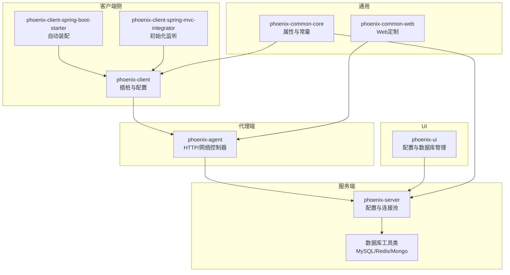
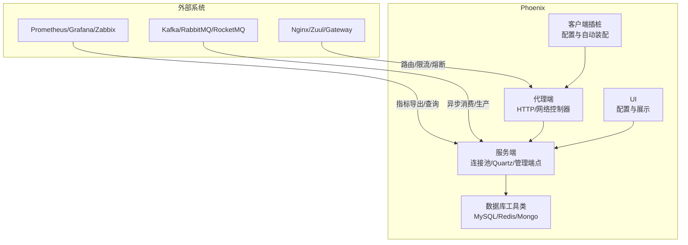
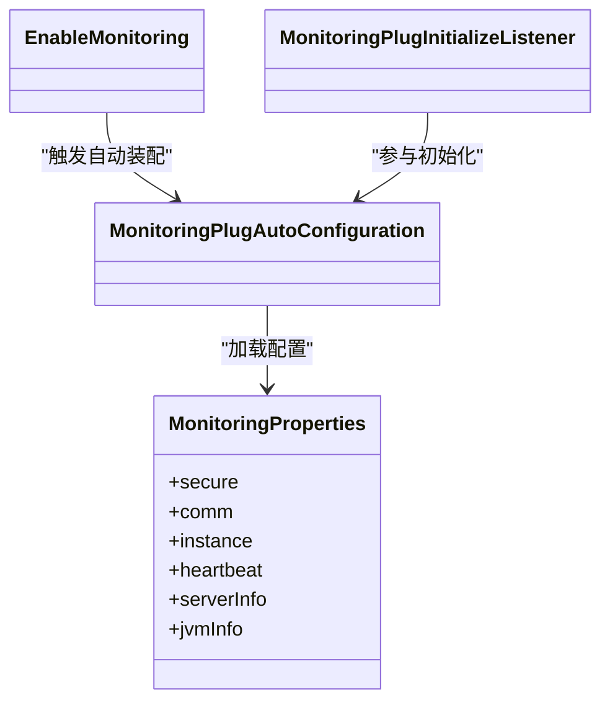
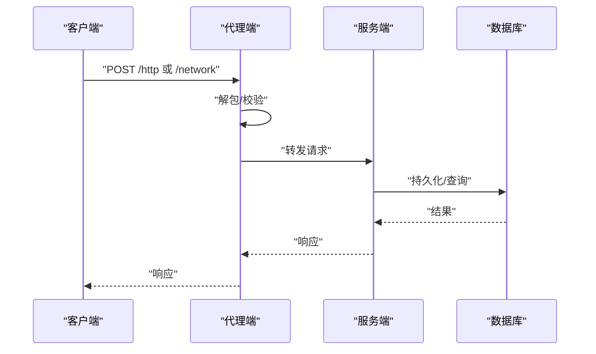
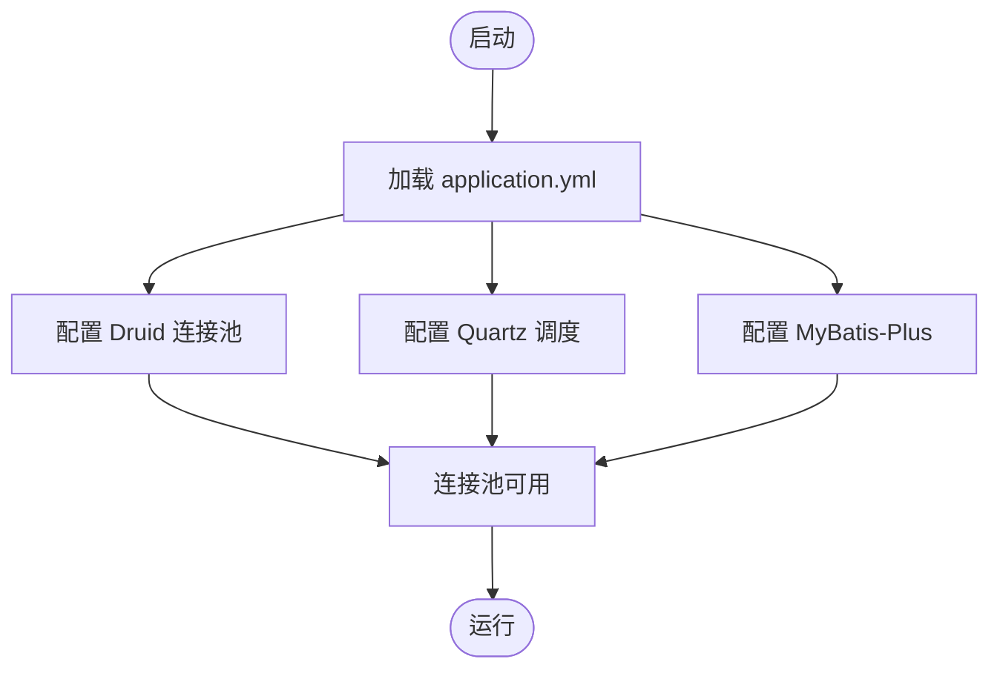
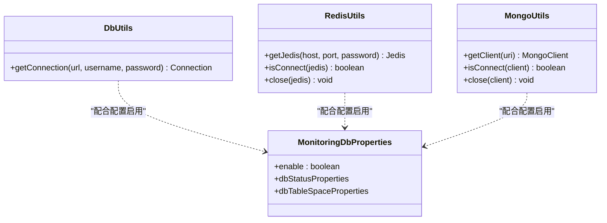
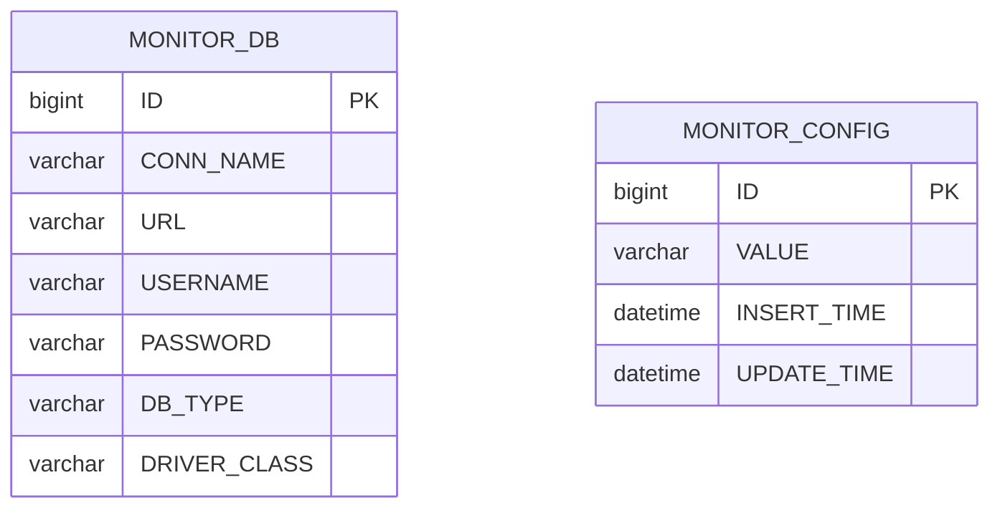
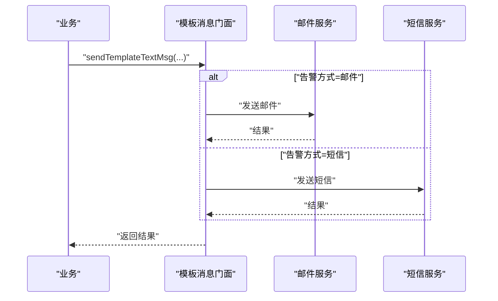
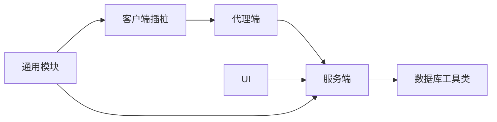

# 第三方系统集成

<cite>
**本文引用的文件**
- [application.yml](file://phoenix-server/src/main/resources/application.yml)
- [DbUtils.java](file://phoenix-server/src/main/java/com/gitee/pifeng/monitoring/server/util/db/DbUtils.java)
- [MongoUtils.java](file://phoenix-server/src/main/java/com/gitee/pifeng/monitoring/server/util/db/MongoUtils.java)
- [RedisUtils.java](file://phoenix-server/src/main/java/com/gitee/pifeng/monitoring/server/util/db/RedisUtils.java)
- [MonitoringDbProperties.java](file://phoenix-common/phoenix-common-core/src/main/java/com/gitee/pifeng/monitoring/common/property/server/MonitoringDbProperties.java)
- [MonitoringProperties.java](file://phoenix-common/phoenix-common-core/src/main/java/com/gitee/pifeng/monitoring/common/property/client/MonitoringProperties.java)
- [spring.factories](file://phoenix-client/phoenix-client-spring-boot-starter/src/main/resources/META-INF/spring.factories)
- [spring-configuration-metadata.json](file://phoenix-client/phoenix-client-spring-boot-starter/src/main/resources/META-INF/spring-configuration-metadata.json)
- [MonitoringPlugAutoConfiguration.java](file://phoenix-client/phoenix-client-spring-boot-starter/src/main/java/com/gitee/pifeng/monitoring/starter/autoconfigure/MonitoringPlugAutoConfiguration.java)
- [EnableMonitoring.java](file://phoenix-client/phoenix-client-spring-boot-starter/src/main/java/com/gitee/pifeng/monitoring/starter/annotation/EnableMonitoring.java)
- [MonitoringSpringBootProperties.java](file://phoenix-client/phoenix-client-spring-boot-starter/src/main/java/com/gitee/pifeng/monitoring/starter/property/MonitoringSpringBootProperties.java)
- [MonitoringPlugInitializeListener.java](file://phoenix-client/phoenix-client-spring-mvc-integrator/src/main/java/com/gitee/pifeng/monitoring/integrator/listener/MonitoringPlugInitializeListener.java)
- [HttpController.java](file://phoenix-agent/src/main/java/com/gitee/pifeng/monitoring/agent/business/client/controller/HttpController.java)
- [NetworkController.java](file://phoenix-agent/src/main/java/com/gitee/pifeng/monitoring/agent/business/client/controller/NetworkController.java)
- [AgentApplication.java](file://phoenix-agent/src/main/java/com/gitee/pifeng/monitoring/agent/AgentApplication.java)
- [CustomizationUndertowWebServerFactoryCustomizer.java](file://phoenix-common/phoenix-common-web/src/main/java/com/gitee/pifeng/monitoring/common/web/core/CustomizationUndertowWebServerFactoryCustomizer.java)
- [IMonitorDbService.java](file://phoenix-ui/src/main/java/com/gitee/pifeng/monitoring/ui/business/web/service/IMonitorDbService.java)
- [MonitorDb.java](file://phoenix-server/src/main/java/com/gitee/pifeng/monitoring/server/business/server/entity/MonitorDb.java)
- [MonitorConfig.java](file://phoenix-ui/src/main/java/com/gitee/pifeng/monitoring/ui/business/web/entity/MonitorConfig.java)
- [ITemplateMsgSendFacadeService.java](file://phoenix-server/src/main/java/com/gitee/pifeng/monitoring/server/business/server/service/ITemplateMsgSendFacadeService.java)
- [MonitoringConfigPropertiesLoader.java](file://phoenix-server/src/main/java/com/gitee/pifeng/monitoring/server/business/server/core/MonitoringConfigPropertiesLoader.java)
- [install_agent.sh](file://doc/Docker/phoenix-agent/install_agent.sh)
</cite>

## 目录
1. [引言](#引言)
2. [项目结构](#项目结构)
3. [核心组件](#核心组件)
4. [架构总览](#架构总览)
5. [详细组件分析](#详细组件分析)
6. [依赖分析](#依赖分析)
7. [性能考量](#性能考量)
8. [故障排查指南](#故障排查指南)
9. [结论](#结论)
10. [附录](#附录)

## 引言
本文件面向Phoenix监控系统的第三方系统集成场景，围绕以下目标展开：  
- 如何对接Prometheus、Grafana、Zabbix等主流监控平台（含双向数据同步、数据格式转换、一致性保障）。  
- 不同数据库系统的适配方法（MySQL、Oracle、Redis、MongoDB）：连接配置、SQL优化、事务处理、连接池管理。  
- 消息队列集成方案（Kafka、RabbitMQ、RocketMQ）：异步数据处理、消息可靠性、流量控制。  
- API网关集成（Nginx、Zuul、Gateway）：请求路由、负载均衡、限流熔断。  
- 性能优化策略：连接复用、批量操作、缓存策略、错误重试。

本文件基于仓库现有代码与配置进行技术解读，帮助读者快速落地集成与运维。

## 项目结构
Phoenix采用多模块分层架构：客户端插桩（phoenix-client）、代理端（phoenix-agent）、服务端（phoenix-server）、UI（phoenix-ui）、通用模块（phoenix-common）。  
- 客户端插桩负责采集与上报；  
- 代理端负责接收客户端数据并转发；  
- 服务端负责存储、计算与告警；  
- UI负责可视化与配置管理；  
- 通用模块提供公共常量、属性、工具与Web定制。

**图表来源**
- [application.yml:116-184](file://phoenix-server/src/main/resources/application.yml#L116-L184)
- [MonitoringProperties.java:22-55](file://phoenix-common/phoenix-common-core/src/main/java/com/gitee/pifeng/monitoring/common/property/client/MonitoringProperties.java#L22-L55)
- [MonitoringDbProperties.java:19-36](file://phoenix-common/phoenix-common-core/src/main/java/com/gitee/pifeng/monitoring/common/property/server/MonitoringDbProperties.java#L19-L36)
- [DbUtils.java:46-55](file://phoenix-server/src/main/java/com/gitee/pifeng/monitoring/server/util/db/DbUtils.java#L46-L55)
- [MongoUtils.java:41-77](file://phoenix-server/src/main/java/com/gitee/pifeng/monitoring/server/util/db/MongoUtils.java#L41-L77)
- [RedisUtils.java:44-80](file://phoenix-server/src/main/java/com/gitee/pifeng/monitoring/server/util/db/RedisUtils.java#L44-L80)
- [HttpController.java:30-38](file://phoenix-agent/src/main/java/com/gitee/pifeng/monitoring/agent/business/client/controller/HttpController.java#L30-L38)
- [NetworkController.java:30-38](file://phoenix-agent/src/main/java/com/gitee/pifeng/monitoring/agent/business/client/controller/NetworkController.java#L30-L38)
- [CustomizationUndertowWebServerFactoryCustomizer.java:18-37](file://phoenix-common/phoenix-common-web/src/main/java/com/gitee/pifeng/monitoring/common/web/core/CustomizationUndertowWebServerFactoryCustomizer.java#L18-L37)

**章节来源**
- [application.yml:1-271](file://phoenix-server/src/main/resources/application.yml#L1-L271)

## 核心组件
- 客户端配置与自动装配：通过spring.factories与spring-configuration-metadata.json暴露配置键，自动装配入口由@EnableMonitoring与MonitoringPlugAutoConfiguration承担。  
- 代理端Web容器定制：基于Undertow，提供缓冲池与WebSocket配置，确保高并发下的稳定性。  
- 服务端连接池与数据源：Druid连接池配置，包含连接数、校验、慢SQL统计、Web监控等。  
- 数据库工具类：封装MySQL/Jedis/Mongo连接获取、连通性检测与关闭逻辑，便于统一接入与扩展。  
- UI与服务端实体：MonitorDb、MonitorConfig等实体映射数据库表，支撑配置与展示。

**章节来源**
- [spring.factories:1-4](file://phoenix-client/phoenix-client-spring-boot-starter/src/main/resources/META-INF/spring.factories#L1-L4)
- [spring-configuration-metadata.json:1-30](file://phoenix-client/phoenix-client-spring-boot-starter/src/main/resources/META-INF/spring-configuration-metadata.json#L1-L30)
- [MonitoringPlugAutoConfiguration.java](file://phoenix-client/phoenix-client-spring-boot-starter/src/main/java/com/gitee/pifeng/monitoring/starter/autoconfigure/MonitoringPlugAutoConfiguration.java)
- [EnableMonitoring.java](file://phoenix-client/phoenix-client-spring-boot-starter/src/main/java/com/gitee/pifeng/monitoring/starter/annotation/EnableMonitoring.java)
- [MonitoringSpringBootProperties.java](file://phoenix-client/phoenix-client-spring-boot-starter/src/main/java/com/gitee/pifeng/monitoring/starter/property/MonitoringSpringBootProperties.java)
- [CustomizationUndertowWebServerFactoryCustomizer.java:18-37](file://phoenix-common/phoenix-common-web/src/main/java/com/gitee/pifeng/monitoring/common/web/core/CustomizationUndertowWebServerFactoryCustomizer.java#L18-L37)
- [application.yml:116-184](file://phoenix-server/src/main/resources/application.yml#L116-L184)
- [DbUtils.java:46-55](file://phoenix-server/src/main/java/com/gitee/pifeng/monitoring/server/util/db/DbUtils.java#L46-L55)
- [MongoUtils.java:41-77](file://phoenix-server/src/main/java/com/gitee/pifeng/monitoring/server/util/db/MongoUtils.java#L41-L77)
- [RedisUtils.java:44-80](file://phoenix-server/src/main/java/com/gitee/pifeng/monitoring/server/util/db/RedisUtils.java#L44-L80)
- [MonitorDb.java:26-68](file://phoenix-server/src/main/java/com/gitee/pifeng/monitoring/server/business/server/entity/MonitorDb.java#L26-L68)
- [MonitorConfig.java:30-53](file://phoenix-ui/src/main/java/com/gitee/pifeng/monitoring/ui/business/web/entity/MonitorConfig.java#L30-L53)

## 架构总览
Phoenix的第三方系统集成以“采集-传输-存储-展示-告警”为主线，结合客户端插桩、代理端收发、服务端存储与UI配置，形成闭环。

**图表来源**
- [application.yml:67-105](file://phoenix-server/src/main/resources/application.yml#L67-L105)
- [MonitoringProperties.java:22-55](file://phoenix-common/phoenix-common-core/src/main/java/com/gitee/pifeng/monitoring/common/property/client/MonitoringProperties.java#L22-L55)
- [HttpController.java:30-38](file://phoenix-agent/src/main/java/com/gitee/pifeng/monitoring/agent/business/client/controller/HttpController.java#L30-L38)
- [NetworkController.java:30-38](file://phoenix-agent/src/main/java/com/gitee/pifeng/monitoring/agent/business/client/controller/NetworkController.java#L30-L38)
- [DbUtils.java:46-55](file://phoenix-server/src/main/java/com/gitee/pifeng/monitoring/server/util/db/DbUtils.java#L46-L55)
- [MongoUtils.java:41-77](file://phoenix-server/src/main/java/com/gitee/pifeng/monitoring/server/util/db/MongoUtils.java#L41-L77)
- [RedisUtils.java:44-80](file://phoenix-server/src/main/java/com/gitee/pifeng/monitoring/server/util/db/RedisUtils.java#L44-L80)

## 详细组件分析

### 客户端插桩与自动装配
- 自动装配入口：spring.factories声明@EnableMonitoring与自动配置类，使客户端在引入starter后自动生效。  
- 配置元数据：spring-configuration-metadata.json提供配置键提示，便于IDE与文档生成。  
- 属性封装：MonitoringProperties聚合secure、comm、instance、heartbeat、serverInfo、jvmInfo等子属性，统一管理客户端行为。  
- 初始化监听：MonitoringPlugInitializeListener在Spring MVC环境中参与初始化流程，确保插桩在Web容器启动阶段就绪。

**图表来源**
- [spring.factories:1-4](file://phoenix-client/phoenix-client-spring-boot-starter/src/main/resources/META-INF/spring.factories#L1-L4)
- [spring-configuration-metadata.json:1-30](file://phoenix-client/phoenix-client-spring-boot-starter/src/main/resources/META-INF/spring-configuration-metadata.json#L1-L30)
- [MonitoringProperties.java:22-55](file://phoenix-common/phoenix-common-core/src/main/java/com/gitee/pifeng/monitoring/common/property/client/MonitoringProperties.java#L22-L55)
- [MonitoringPlugAutoConfiguration.java](file://phoenix-client/phoenix-client-spring-boot-starter/src/main/java/com/gitee/pifeng/monitoring/starter/autoconfigure/MonitoringPlugAutoConfiguration.java)
- [EnableMonitoring.java](file://phoenix-client/phoenix-client-spring-boot-starter/src/main/java/com/gitee/pifeng/monitoring/starter/annotation/EnableMonitoring.java)
- [MonitoringPlugInitializeListener.java](file://phoenix-client/phoenix-client-spring-mvc-integrator/src/main/java/com/gitee/pifeng/monitoring/integrator/listener/MonitoringPlugInitializeListener.java)

**章节来源**
- [spring.factories:1-4](file://phoenix-client/phoenix-client-spring-boot-starter/src/main/resources/META-INF/spring.factories#L1-L4)
- [spring-configuration-metadata.json:1-30](file://phoenix-client/phoenix-client-spring-boot-starter/src/main/resources/META-INF/spring-configuration-metadata.json#L1-L30)
- [MonitoringProperties.java:22-55](file://phoenix-common/phoenix-common-core/src/main/java/com/gitee/pifeng/monitoring/common/property/client/MonitoringProperties.java#L22-L55)
- [MonitoringPlugInitializeListener.java](file://phoenix-client/phoenix-client-spring-mvc-integrator/src/main/java/com/gitee/pifeng/monitoring/integrator/listener/MonitoringPlugInitializeListener.java)

### 代理端Web与数据接收
- Undertow定制：通过CustomizationUndertowWebServerFactoryCustomizer设置ByteBufferPool与WebSocket部署信息，减少日志噪音并提升性能。  
- 控制器：HttpController与NetworkController分别处理HTTP与网络相关数据包，作为客户端到服务端的数据入口。  
- 启动类：AgentApplication启用重试注解与自定义Web容器，确保代理端稳定运行。

**图表来源**
- [CustomizationUndertowWebServerFactoryCustomizer.java:18-37](file://phoenix-common/phoenix-common-web/src/main/java/com/gitee/pifeng/monitoring/common/web/core/CustomizationUndertowWebServerFactoryCustomizer.java#L18-L37)
- [HttpController.java:30-38](file://phoenix-agent/src/main/java/com/gitee/pifeng/monitoring/agent/business/client/controller/HttpController.java#L30-L38)
- [NetworkController.java:30-38](file://phoenix-agent/src/main/java/com/gitee/pifeng/monitoring/agent/business/client/controller/NetworkController.java#L30-L38)
- [AgentApplication.java:23-39](file://phoenix-agent/src/main/java/com/gitee/pifeng/monitoring/agent/AgentApplication.java#L23-L39)

**章节来源**
- [CustomizationUndertowWebServerFactoryCustomizer.java:18-37](file://phoenix-common/phoenix-common-web/src/main/java/com/gitee/pifeng/monitoring/common/web/core/CustomizationUndertowWebServerFactoryCustomizer.java#L18-L37)
- [HttpController.java:30-38](file://phoenix-agent/src/main/java/com/gitee/pifeng/monitoring/agent/business/client/controller/HttpController.java#L30-L38)
- [NetworkController.java:30-38](file://phoenix-agent/src/main/java/com/gitee/pifeng/monitoring/agent/business/client/controller/NetworkController.java#L30-L38)
- [AgentApplication.java:23-39](file://phoenix-agent/src/main/java/com/gitee/pifeng/monitoring/agent/AgentApplication.java#L23-L39)

### 服务端连接池与数据源
- Druid连接池：application.yml中配置初始大小、最大活跃数、最大等待时间、空闲检测、慢SQL统计与Web监控，兼顾性能与可观测性。  
- Quartz调度：配置集群化、线程池大小、表前缀与持久化策略，确保任务在多实例环境下可靠执行。  
- MyBatis-Plus：开启驼峰映射、关闭二级缓存，避免Oracle/MySQL差异导致的字段映射问题。

**图表来源**
- [application.yml:116-184](file://phoenix-server/src/main/resources/application.yml#L116-L184)
- [application.yml:67-105](file://phoenix-server/src/main/resources/application.yml#L67-L105)
- [application.yml:186-217](file://phoenix-server/src/main/resources/application.yml#L186-L217)

**章节来源**
- [application.yml:116-184](file://phoenix-server/src/main/resources/application.yml#L116-L184)
- [application.yml:67-105](file://phoenix-server/src/main/resources/application.yml#L67-L105)
- [application.yml:186-217](file://phoenix-server/src/main/resources/application.yml#L186-L217)

### 数据库适配与连接管理
- MySQL：DbUtils提供基于SimpleDataSource的连接获取，支持密码解码与异常日志，便于统一管理连接生命周期。  
- Redis：RedisUtils提供Jedis连接、认证与ping连通性检测，支持密码解码与资源释放。  
- MongoDB：MongoUtils提供MongoClientURI解析、连通性检测与关闭逻辑，便于接入MongoDB集群或副本集。  
- 配置属性：MonitoringDbProperties定义数据库监控开关与状态/表空间子配置，便于服务端按需启用。

**图表来源**
- [DbUtils.java:46-55](file://phoenix-server/src/main/java/com/gitee/pifeng/monitoring/server/util/db/DbUtils.java#L46-L55)
- [RedisUtils.java:44-80](file://phoenix-server/src/main/java/com/gitee/pifeng/monitoring/server/util/db/RedisUtils.java#L44-L80)
- [MongoUtils.java:41-77](file://phoenix-server/src/main/java/com/gitee/pifeng/monitoring/server/util/db/MongoUtils.java#L41-L77)
- [MonitoringDbProperties.java:19-36](file://phoenix-common/phoenix-common-core/src/main/java/com/gitee/pifeng/monitoring/common/property/server/MonitoringDbProperties.java#L19-L36)

**章节来源**
- [DbUtils.java:46-55](file://phoenix-server/src/main/java/com/gitee/pifeng/monitoring/server/util/db/DbUtils.java#L46-L55)
- [RedisUtils.java:44-80](file://phoenix-server/src/main/java/com/gitee/pifeng/monitoring/server/util/db/RedisUtils.java#L44-L80)
- [MongoUtils.java:41-77](file://phoenix-server/src/main/java/com/gitee/pifeng/monitoring/server/util/db/MongoUtils.java#L41-L77)
- [MonitoringDbProperties.java:19-36](file://phoenix-common/phoenix-common-core/src/main/java/com/gitee/pifeng/monitoring/common/property/server/MonitoringDbProperties.java#L19-L36)

### UI与配置管理
- MonitorDb实体：映射数据库连接配置表，包含连接名、URL、用户名、密码、数据库类型与驱动类等字段。  
- MonitorConfig实体：用于监控配置值的持久化与时间戳维护。  
- IMonitorDbService：提供数据库配置的增删改查与启停告警等业务方法，支撑UI操作。

**图表来源**
- [MonitorDb.java:26-68](file://phoenix-server/src/main/java/com/gitee/pifeng/monitoring/server/business/server/entity/MonitorDb.java#L26-L68)
- [MonitorConfig.java:30-53](file://phoenix-ui/src/main/java/com/gitee/pifeng/monitoring/ui/business/web/entity/MonitorConfig.java#L30-L53)

**章节来源**
- [MonitorDb.java:26-68](file://phoenix-server/src/main/java/com/gitee/pifeng/monitoring/server/business/server/entity/MonitorDb.java#L26-L68)
- [MonitorConfig.java:30-53](file://phoenix-ui/src/main/java/com/gitee/pifeng/monitoring/ui/business/web/entity/MonitorConfig.java#L30-L53)
- [IMonitorDbService.java:69-107](file://phoenix-ui/src/main/java/com/gitee/pifeng/monitoring/ui/business/web/service/IMonitorDbService.java#L69-L107)

### 告警与模板消息
- ITemplateMsgSendFacadeService：定义模板消息发送接口，屏蔽不同告警渠道（邮件、短信）实现细节，提供统一调用入口。  
- MonitoringConfigPropertiesLoader：负责设置默认监控配置，包括告警级别、时间段、告警方式等，便于系统初始化。

**图表来源**
- [ITemplateMsgSendFacadeService.java:17-34](file://phoenix-server/src/main/java/com/gitee/pifeng/monitoring/server/business/server/service/ITemplateMsgSendFacadeService.java#L17-L34)
- [MonitoringConfigPropertiesLoader.java:126-144](file://phoenix-server/src/main/java/com/gitee/pifeng/monitoring/server/business/server/core/MonitoringConfigPropertiesLoader.java#L126-L144)

**章节来源**
- [ITemplateMsgSendFacadeService.java:17-34](file://phoenix-server/src/main/java/com/gitee/pifeng/monitoring/server/business/server/service/ITemplateMsgSendFacadeService.java#L17-L34)
- [MonitoringConfigPropertiesLoader.java:126-144](file://phoenix-server/src/main/java/com/gitee/pifeng/monitoring/server/business/server/core/MonitoringConfigPropertiesLoader.java#L126-L144)

## 依赖分析
- 组件耦合：客户端插桩通过自动装配与监听器与Web环境解耦；代理端通过Undertow定制与控制器承接数据；服务端通过连接池与Quartz实现高可用；UI通过实体与服务接口与服务端交互。  
- 外部依赖：Druid连接池、Quartz调度、MyBatis-Plus、Undertow、Jedis、MongoClient等。  
- 集成风险：跨模块配置键一致性、连接池参数与数据库规格匹配、代理端与服务端协议兼容性。

**图表来源**
- [spring.factories:1-4](file://phoenix-client/phoenix-client-spring-boot-starter/src/main/resources/META-INF/spring.factories#L1-L4)
- [application.yml:116-184](file://phoenix-server/src/main/resources/application.yml#L116-L184)
- [DbUtils.java:46-55](file://phoenix-server/src/main/java/com/gitee/pifeng/monitoring/server/util/db/DbUtils.java#L46-L55)
- [MongoUtils.java:41-77](file://phoenix-server/src/main/java/com/gitee/pifeng/monitoring/server/util/db/MongoUtils.java#L41-L77)
- [RedisUtils.java:44-80](file://phoenix-server/src/main/java/com/gitee/pifeng/monitoring/server/util/db/RedisUtils.java#L44-L80)

**章节来源**
- [spring.factories:1-4](file://phoenix-client/phoenix-client-spring-boot-starter/src/main/resources/META-INF/spring.factories#L1-L4)
- [application.yml:116-184](file://phoenix-server/src/main/resources/application.yml#L116-L184)
- [DbUtils.java:46-55](file://phoenix-server/src/main/java/com/gitee/pifeng/monitoring/server/util/db/DbUtils.java#L46-L55)
- [MongoUtils.java:41-77](file://phoenix-server/src/main/java/com/gitee/pifeng/monitoring/server/util/db/MongoUtils.java#L41-L77)
- [RedisUtils.java:44-80](file://phoenix-server/src/main/java/com/gitee/pifeng/monitoring/server/util/db/RedisUtils.java#L44-L80)

## 性能考量
- 连接复用：Druid连接池参数（初始大小、最大活跃数、空闲检测周期）需与数据库规格匹配，避免频繁创建销毁连接。  
- 批量操作：服务端与UI层尽量合并请求与SQL批处理，减少网络往返与锁竞争。  
- 缓存策略：Caffeine缓存用于短期热点数据，注意失效策略与内存占用。  
- 错误重试：代理端启用@EnableRetry，结合指数退避策略提升瞬时故障恢复能力。  
- 异步处理：Quartz线程池大小与任务复杂度平衡，避免阻塞与堆积。  
- Web性能：Undertow缓冲池与WebSocket部署信息定制，降低GC与内存抖动。

**章节来源**
- [application.yml:116-184](file://phoenix-server/src/main/resources/application.yml#L116-L184)
- [application.yml:67-105](file://phoenix-server/src/main/resources/application.yml#L67-L105)
- [CustomizationUndertowWebServerFactoryCustomizer.java:18-37](file://phoenix-common/phoenix-common-web/src/main/java/com/gitee/pifeng/monitoring/common/web/core/CustomizationUndertowWebServerFactoryCustomizer.java#L18-L37)
- [AgentApplication.java:23-39](file://phoenix-agent/src/main/java/com/gitee/pifeng/monitoring/agent/AgentApplication.java#L23-L39)

## 故障排查指南
- 数据库连接失败：检查DbUtils的密码解码与连接串，确认MongoUtils与RedisUtils的连通性检测与关闭逻辑是否正确调用。  
- UI配置异常：核对MonitorDb与MonitorConfig实体字段映射与数据库表结构一致，确认IMonitorDbService方法调用链路。  
- 代理端启动问题：查看AgentApplication启动耗时日志与Undertow定制配置，确认WebSocket与缓冲池设置。  
- 告警未达：检查ITemplateMsgSendFacadeService的告警方式与时间段配置，核对MonitoringConfigPropertiesLoader的默认值。  
- Docker安装：使用install_agent.sh脚本拉取并执行远程容器脚本，确保网络可达与权限正确。

**章节来源**
- [DbUtils.java:46-55](file://phoenix-server/src/main/java/com/gitee/pifeng/monitoring/server/util/db/DbUtils.java#L46-L55)
- [MongoUtils.java:41-77](file://phoenix-server/src/main/java/com/gitee/pifeng/monitoring/server/util/db/MongoUtils.java#L41-L77)
- [RedisUtils.java:44-80](file://phoenix-server/src/main/java/com/gitee/pifeng/monitoring/server/util/db/RedisUtils.java#L44-L80)
- [MonitorDb.java:26-68](file://phoenix-server/src/main/java/com/gitee/pifeng/monitoring/server/business/server/entity/MonitorDb.java#L26-L68)
- [MonitorConfig.java:30-53](file://phoenix-ui/src/main/java/com/gitee/pifeng/monitoring/ui/business/web/entity/MonitorConfig.java#L30-L53)
- [IMonitorDbService.java:69-107](file://phoenix-ui/src/main/java/com/gitee/pifeng/monitoring/ui/business/web/service/IMonitorDbService.java#L69-L107)
- [AgentApplication.java:23-39](file://phoenix-agent/src/main/java/com/gitee/pifeng/monitoring/agent/AgentApplication.java#L23-L39)
- [ITemplateMsgSendFacadeService.java:17-34](file://phoenix-server/src/main/java/com/gitee/pifeng/monitoring/server/business/server/service/ITemplateMsgSendFacadeService.java#L17-L34)
- [MonitoringConfigPropertiesLoader.java:126-144](file://phoenix-server/src/main/java/com/gitee/pifeng/monitoring/server/business/server/core/MonitoringConfigPropertiesLoader.java#L126-L144)
- [install_agent.sh:1-14](file://doc/Docker/phoenix-agent/install_agent.sh#L1-L14)

## 结论
Phoenix监控系统通过客户端插桩、代理端传输、服务端存储与UI配置的协同，形成了可扩展的第三方系统集成基础。针对数据库、消息队列与API网关的集成，建议遵循统一的连接管理、配置属性与性能优化策略，确保在高并发与复杂拓扑下的稳定性与一致性。

## 附录
- Docker安装脚本：用于一键拉起代理端容器，便于快速验证集成效果。  
- 配置键参考：spring.factories与spring-configuration-metadata.json提供了完整的配置键清单，便于在IDE中获得智能提示与文档生成。

**章节来源**
- [install_agent.sh:1-14](file://doc/Docker/phoenix-agent/install_agent.sh#L1-L14)
- [spring.factories:1-4](file://phoenix-client/phoenix-client-spring-boot-starter/src/main/resources/META-INF/spring.factories#L1-L4)
- [spring-configuration-metadata.json:1-30](file://phoenix-client/phoenix-client-spring-boot-starter/src/main/resources/META-INF/spring-configuration-metadata.json#L1-L30)