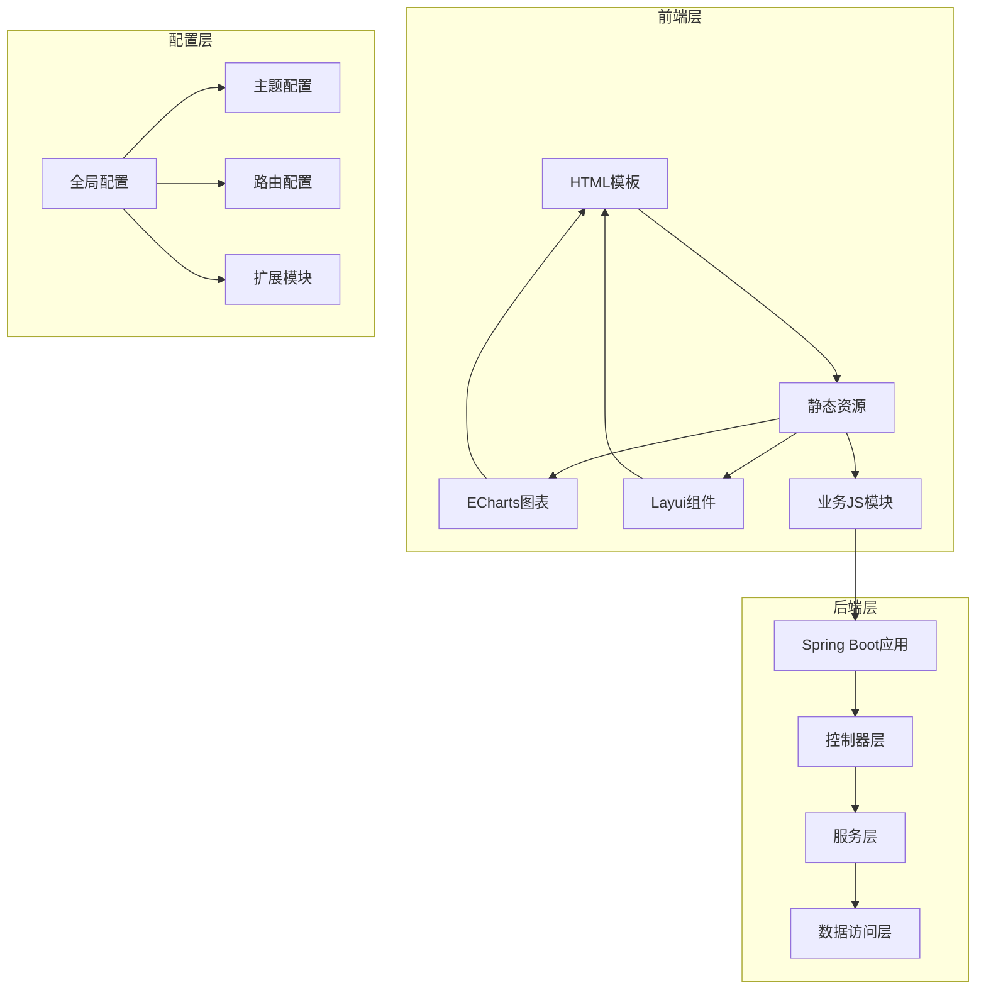
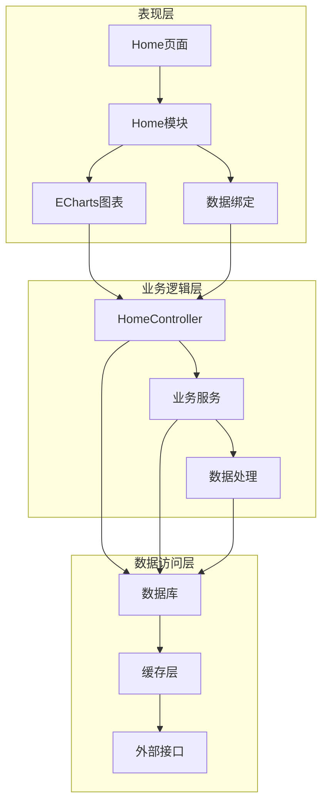
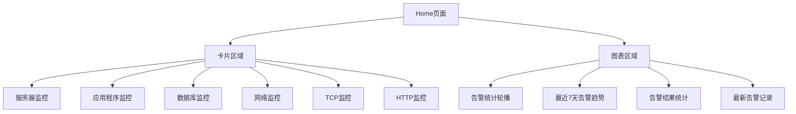
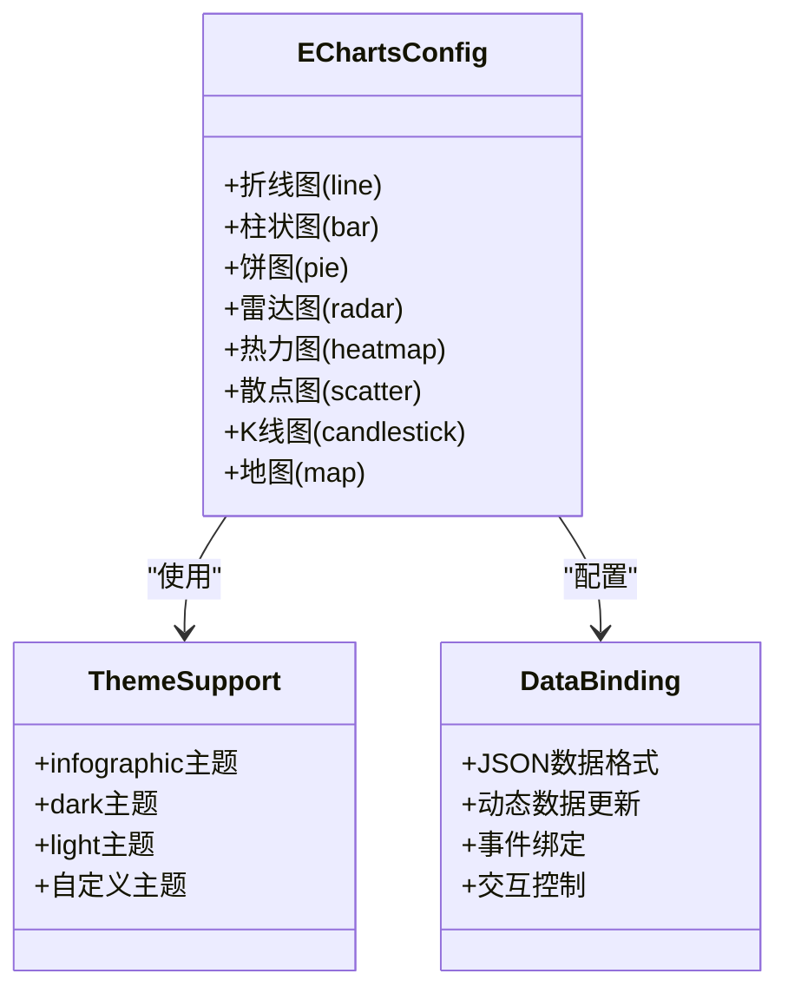
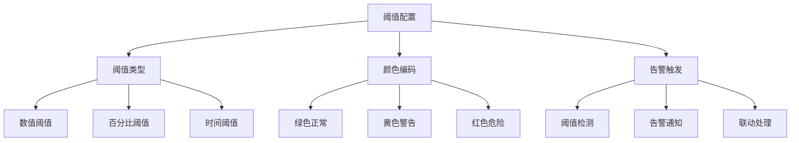
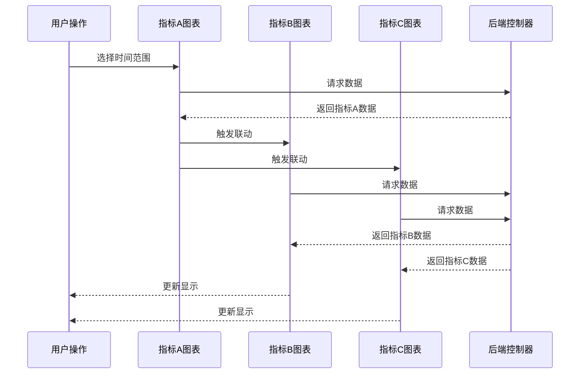
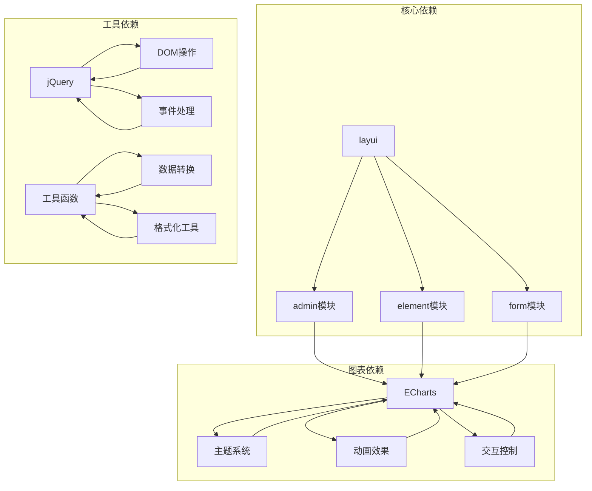
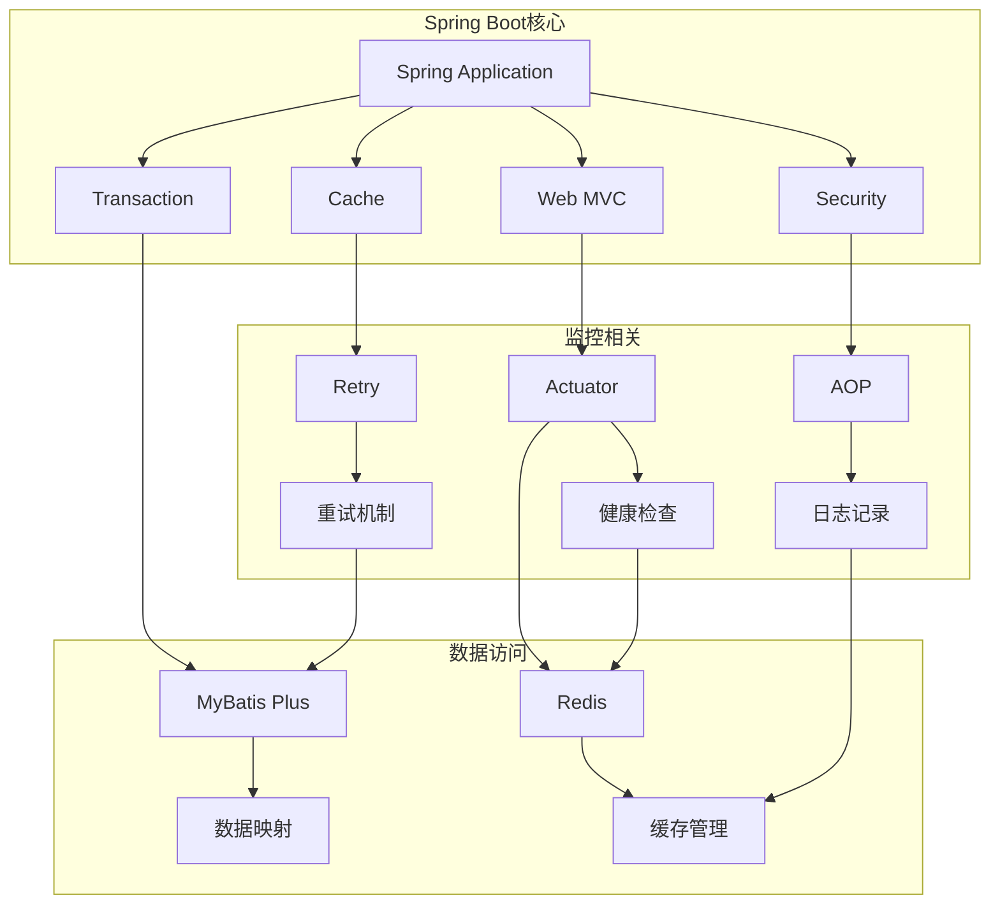

# UI展示配置

<cite>
**本文档引用的文件**
- [UiApplication.java](file://phoenix-ui/src/main/java/com/gitee/pifeng/monitoring/ui/UiApplication.java)
- [home.html](file://phoenix-ui/src/main/resources/templates/home.html)
- [home.js](file://phoenix-ui/src/main/resources/static/modules/home.js)
- [common.js](file://phoenix-ui/src/main/resources/static/js/common.js)
- [index.js](file://phoenix-ui/src/main/resources/static/lib/index.js)
- [view.js](file://phoenix-ui/src/main/resources/static/lib/view.js)
- [config.js](file://phoenix-ui/src/main/resources/static/config.js)
- [echarts.min.js](file://phoenix-ui/src/main/resources/static/js/echarts.min.js)
- [echarts.theme.infographic.js](file://phoenix-ui/src/main/resources/static/js/echarts.theme.infographic.js)
- [HomeController.java](file://phoenix-ui/src/main/java/com/gitee/pifeng/monitoring/ui/business/web/controller/HomeController.java)
</cite>

## 目录
1. [简介](#简介)
2. [项目结构](#项目结构)
3. [核心组件](#核心组件)
4. [架构概览](#架构概览)
5. [详细组件分析](#详细组件分析)
6. [依赖关系分析](#依赖关系分析)
7. [性能考虑](#性能考虑)
8. [故障排除指南](#故障排除指南)
9. [结论](#结论)
10. [附录](#附录)

## 简介
本指南面向Phoenix监控系统的UI开发人员，提供完整的自定义监控指标UI展示配置技术文档。内容涵盖前端页面创建、JavaScript逻辑编写、ECharts图表配置、数据绑定实现、阈值设置、指标联动等关键技术点，并提供从指标定义到界面展示的完整配置流程示例。

## 项目结构
Phoenix UI采用前后端分离架构，基于Spring Boot + Layui Admin + ECharts技术栈构建：

**图表来源**
- [UiApplication.java:37-46](file://phoenix-ui/src/main/java/com/gitee/pifeng/monitoring/ui/UiApplication.java#L37-L46)
- [config.js:11-47](file://phoenix-ui/src/main/resources/static/config.js#L11-L47)

**章节来源**
- [UiApplication.java:19-46](file://phoenix-ui/src/main/java/com/gitee/pifeng/monitoring/ui/UiApplication.java#L19-L46)
- [config.js:1-132](file://phoenix-ui/src/main/resources/static/config.js#L1-L132)

## 核心组件
Phoenix UI的核心组件包括：

### 1. 应用启动组件
- **UiApplication**: Spring Boot应用入口，启用缓存、事务管理、AOP代理等功能
- 支持 Undertow Web服务器定制化配置
- 集成多种监控相关的Spring特性

### 2. 视图渲染组件
- **index.js**: 主入口模块，负责标签页管理和路由跳转
- **view.js**: 视图渲染引擎，支持模板解析和异步数据加载
- **config.js**: 全局配置中心，定义请求参数、响应格式、主题配置等

### 3. 图表展示组件
- **ECharts集成**: 支持多种图表类型，包括折线图、饼图、柱状图等
- **主题系统**: 提供多种预设主题，支持自定义主题配置
- **响应式设计**: 自适应不同屏幕尺寸的图表显示

**章节来源**
- [UiApplication.java:37-46](file://phoenix-ui/src/main/java/com/gitee/pifeng/monitoring/ui/UiApplication.java#L37-L46)
- [index.js:1-21](file://phoenix-ui/src/main/resources/static/lib/index.js#L1-L21)
- [view.js:1-142](file://phoenix-ui/src/main/resources/static/lib/view.js#L1-L142)
- [config.js:11-129](file://phoenix-ui/src/main/resources/static/config.js#L11-L129)

## 架构概览
Phoenix UI采用三层架构设计，实现清晰的职责分离：

**图表来源**
- [home.html:1-360](file://phoenix-ui/src/main/resources/templates/home.html#L1-L360)
- [home.js:1-567](file://phoenix-ui/src/main/resources/static/modules/home.js#L1-L567)
- [HomeController.java](file://phoenix-ui/src/main/java/com/gitee/pifeng/monitoring/ui/business/web/controller/HomeController.java)

## 详细组件分析

### Home页面组件分析
Home页面是监控系统的主要展示界面，集成了多个监控图表：

#### 页面结构设计

**图表来源**
- [home.html:24-342](file://phoenix-ui/src/main/resources/templates/home.html#L24-L342)

#### 图表配置实现
Home模块实现了多种图表类型的配置：

**折线图配置**：
- 支持平滑曲线和面积填充效果
- 实现渐变色填充，增强视觉效果
- 配置坐标轴标签和网格线

**饼图配置**：
- 支持径向渐变填充
- 实现阴影效果和高亮状态
- 动态颜色映射

**数据绑定机制**：
- 通过AJAX请求获取实时数据
- 支持定时刷新机制（每30秒）
- 实现响应式布局适配

**章节来源**
- [home.js:27-190](file://phoenix-ui/src/main/resources/static/modules/home.js#L27-L190)
- [home.js:236-321](file://phoenix-ui/src/main/resources/static/modules/home.js#L236-L321)
- [home.js:544-564](file://phoenix-ui/src/main/resources/static/modules/home.js#L544-L564)

### ECharts集成分析
Phoenix UI深度集成了ECharts图表库，提供了丰富的图表配置能力：

#### 图表类型支持

**图表来源**
- [echarts.min.js:1-23](file://phoenix-ui/src/main/resources/static/js/echarts.min.js#L1-L23)
- [echarts.theme.infographic.js](file://phoenix-ui/src/main/resources/static/js/echarts.theme.infographic.js)

#### 数据格式转换
系统支持多种数据格式的转换和处理：

**时间序列数据处理**：
- 支持日期时间格式转换
- 实现时间轴的自动缩放
- 处理时区差异和格式标准化

**数值格式化**：
- 内存大小单位转换（B, KB, MB, GB）
- 时间毫秒转换为可读格式
- 百分比和小数格式化

**章节来源**
- [common.js:236-316](file://phoenix-ui/src/main/resources/static/js/common.js#L236-L316)

### 阈值配置系统
Phoenix UI提供了灵活的阈值配置机制：

#### 阈值规则定义

**图表来源**
- [home.js:68-189](file://phoenix-ui/src/main/resources/static/modules/home.js#L68-L189)

#### 颜色编码配置
系统实现了基于阈值的颜色编码机制：
- **正常状态**: 绿色渐变，表示指标处于正常范围
- **警告状态**: 橙色渐变，表示指标接近或轻微超出阈值
- **危险状态**: 红色渐变，表示指标严重超出阈值

**章节来源**
- [home.js:110-187](file://phoenix-ui/src/main/resources/static/modules/home.js#L110-L187)
- [home.js:287-303](file://phoenix-ui/src/main/resources/static/modules/home.js#L287-L303)

### 指标联动实现
Phoenix UI支持多指标间的关联展示和动态筛选：

#### 联动机制设计

**图表来源**
- [home.js:544-564](file://phoenix-ui/src/main/resources/static/modules/home.js#L544-L564)

#### 实时更新机制
系统实现了高效的实时数据更新：
- **定时刷新**: 默认每30秒自动刷新一次
- **事件驱动**: 支持用户手动刷新和事件触发
- **增量更新**: 只更新发生变化的数据部分

**章节来源**
- [home.js:552-564](file://phoenix-ui/src/main/resources/static/modules/home.js#L552-L564)

## 依赖关系分析

### 前端依赖关系

**图表来源**
- [config.js:42-47](file://phoenix-ui/src/main/resources/static/config.js#L42-L47)
- [index.js:17-20](file://phoenix-ui/src/main/resources/static/lib/index.js#L17-L20)

### 后端依赖关系
系统后端采用Spring Boot框架，集成了多种企业级特性：

**图表来源**
- [UiApplication.java:28-36](file://phoenix-ui/src/main/java/com/gitee/pifeng/monitoring/ui/UiApplication.java#L28-L36)

**章节来源**
- [UiApplication.java:19-46](file://phoenix-ui/src/main/java/com/gitee/pifeng/monitoring/ui/UiApplication.java#L19-L46)

## 性能考虑
Phoenix UI在性能优化方面采用了多项策略：

### 1. 图表性能优化
- **懒加载**: 图表按需加载，减少初始页面体积
- **数据压缩**: 使用ECharts的dataZoom功能实现大数据集的可视化
- **渲染优化**: 采用Canvas渲染，提升复杂图表的绘制性能

### 2. 缓存策略
- **浏览器缓存**: 静态资源设置合理的缓存策略
- **服务端缓存**: 使用Redis缓存热点数据
- **内存缓存**: Spring Cache注解实现方法级别的缓存

### 3. 网络优化
- **CDN加速**: 静态资源通过CDN分发
- **压缩传输**: 启用Gzip压缩减少传输体积
- **连接复用**: HTTP/2连接复用提升并发性能

## 故障排除指南

### 常见问题诊断
1. **图表不显示**
   - 检查ECharts库是否正确加载
   - 验证容器元素是否存在且有尺寸
   - 确认数据格式符合要求

2. **数据更新异常**
   - 检查AJAX请求是否成功
   - 验证CSRF令牌配置
   - 确认跨域设置

3. **样式显示问题**
   - 检查CSS文件加载情况
   - 验证主题配置
   - 确认响应式布局设置

### 调试工具使用
- **浏览器开发者工具**: 检查网络请求和JavaScript错误
- **ECharts调试**: 使用setOption的调试模式
- **日志分析**: 查看后端日志输出

**章节来源**
- [view.js:26-48](file://phoenix-ui/src/main/resources/static/lib/view.js#L26-L48)
- [common.js:323-333](file://phoenix-ui/src/main/resources/static/js/common.js#L323-L333)

## 结论
Phoenix监控系统的UI展示配置提供了完整的监控指标可视化解决方案。通过合理的设计架构、丰富的图表配置、灵活的阈值管理和高效的联动机制，系统能够满足复杂的监控需求。开发者可以根据具体业务场景，在现有基础上扩展新的监控视图和功能模块。

## 附录

### UI配置示例流程
以下是一个完整的监控指标配置示例：

1. **指标定义阶段**
   - 在后端定义监控指标数据模型
   - 配置数据采集和存储逻辑
   - 设定指标计算规则

2. **前端展示配置**
   - 创建HTML模板结构
   - 编写JavaScript逻辑处理数据
   - 配置ECharts图表参数
   - 实现数据绑定和事件处理

3. **阈值和联动设置**
   - 定义阈值规则和颜色编码
   - 配置告警触发机制
   - 实现多指标联动效果

4. **部署和测试**
   - 配置生产环境参数
   - 进行性能测试和优化
   - 验证功能完整性和稳定性

### 关键配置参数参考
- **图表尺寸**: 建议使用百分比单位实现响应式布局
- **刷新间隔**: 根据数据更新频率调整（建议30秒）
- **缓存策略**: 热点数据建议缓存1-5分钟
- **错误处理**: 实现友好的错误提示和重试机制