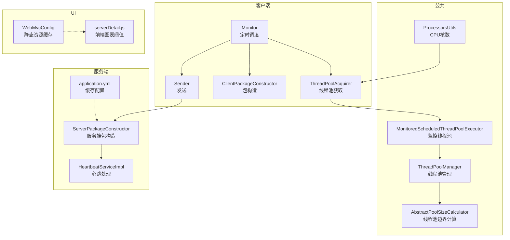
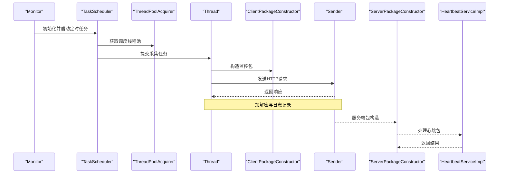
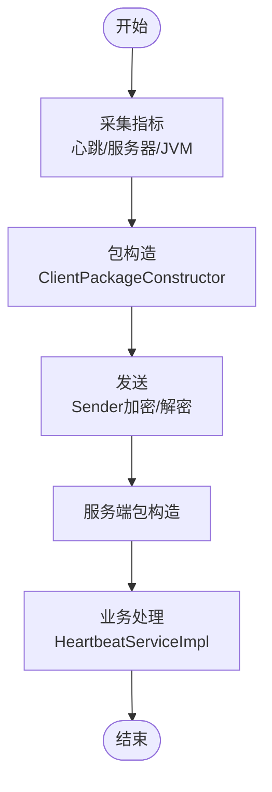
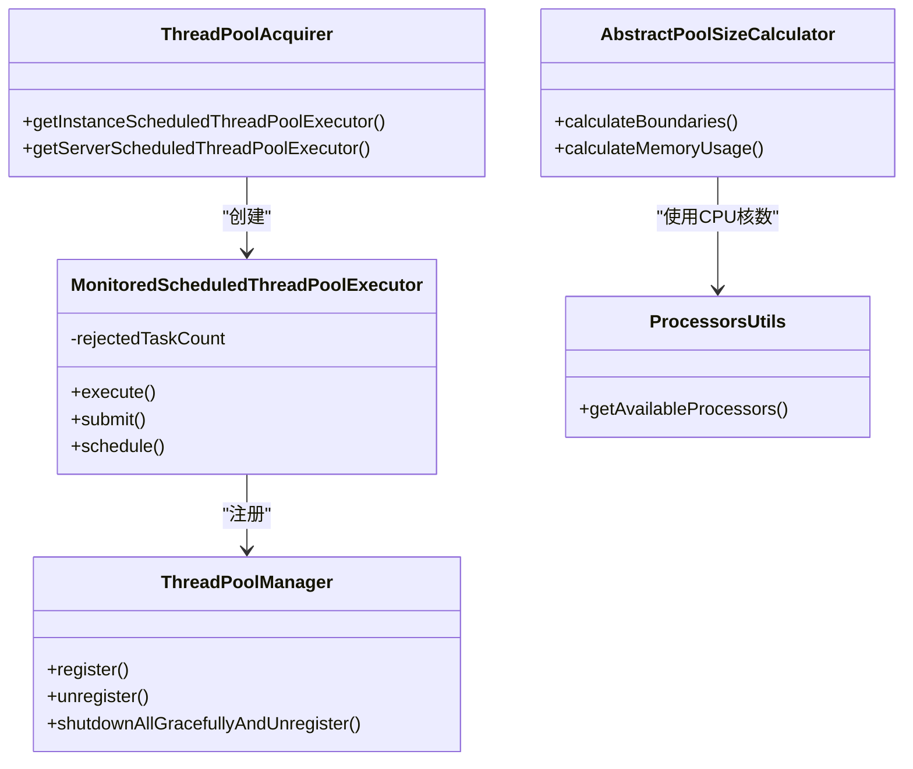
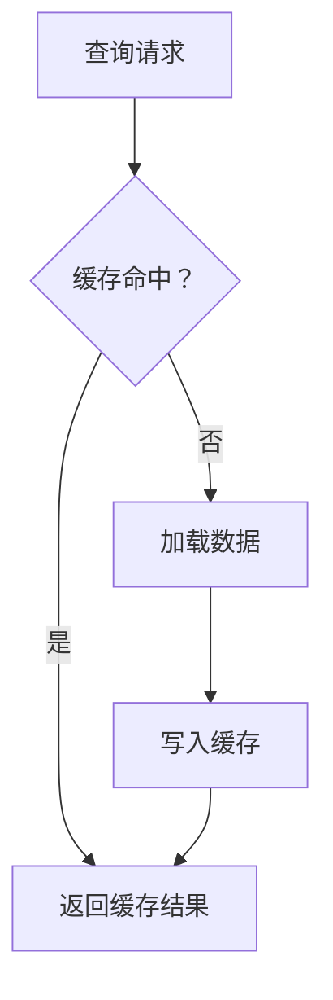
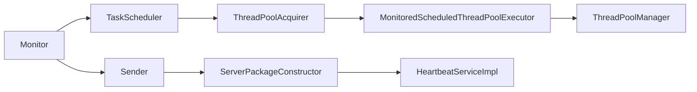

# 性能优化策略

<cite>
**本文引用的文件**
- [phoenix-client-core/Sender.java](file://phoenix-client/phoenix-client-core/src/main/java/com/gitee/pifeng/monitoring/plug/core/Sender.java)
- [phoenix-client-core/ClientPackageConstructor.java](file://phoenix-client/phoenix-client-core/src/main/java/com/gitee/pifeng/monitoring/plug/core/ClientPackageConstructor.java)
- [phoenix-client-core/ThreadPoolAcquirer.java](file://phoenix-client/phoenix-client-core/src/main/java/com/gitee/pifeng/monitoring/plug/core/ThreadPoolAcquirer.java)
- [phoenix-client-core/Monitor.java](file://phoenix-client/phoenix-client-core/src/main/java/com/gitee/pifeng/monitoring/plug/Monitor.java)
- [phoenix-client-core/HeartbeatTaskScheduler.java](file://phoenix-client/phoenix-client-core/src/main/java/com/gitee/pifeng/monitoring/plug/scheduler/HeartbeatTaskScheduler.java)
- [phoenix-client-core/ServerTaskScheduler.java](file://phoenix-client/phoenix-client-core/src/main/java/com/gitee/pifeng/monitoring/plug/scheduler/ServerTaskScheduler.java)
- [phoenix-client-core/JvmTaskScheduler.java](file://phoenix-client/phoenix-client-core/src/main/java/com/gitee/pifeng/monitoring/plug/scheduler/JvmTaskScheduler.java)
- [phoenix-common-core/MonitoredScheduledThreadPoolExecutor.java](file://phoenix-common/phoenix-common-core/src/main/java/com/gitee/pifeng/monitoring/common/threadpool/MonitoredScheduledThreadPoolExecutor.java)
- [phoenix-common-core/ThreadPoolManager.java](file://phoenix-common/phoenix-common-core/src/main/java/com/gitee/pifeng/monitoring/common/threadpool/ThreadPoolManager.java)
- [phoenix-common-core/AbstractPoolSizeCalculator.java](file://phoenix-common/phoenix-common-core/src/main/java/com/gitee/pifeng/monitoring/common/abs/AbstractPoolSizeCalculator.java)
- [phoenix-common-core/ProcessorsUtils.java](file://phoenix-common/phoenix-common-core/src/main/java/com/gitee/pifeng/monitoring/common/util/server/ProcessorsUtils.java)
- [phoenix-client-core/monitoring.properties](file://phoenix-client/phoenix-client-core/src/main/resources/monitoring.properties)
- [phoenix-server/application.yml](file://phoenix-server/src/main/resources/application.yml)
- [phoenix-ui/WebMvcConfig.java](file://phoenix-ui/src/main/java/com/gitee/pifeng/monitoring/ui/config/WebMvcConfig.java)
- [phoenix-server/business/server/core/ServerPackageConstructor.java](file://phoenix-server/src/main/java/com/gitee/pifeng/monitoring/server/business/server/core/ServerPackageConstructor.java)
- [phoenix-agent/business/server/service/IJvmService.java](file://phoenix-agent/src/main/java/com/gitee/pifeng/monitoring/agent/business/server/service/IJvmService.java)
- [phoenix-agent/business/server/service/IHeartbeatService.java](file://phoenix-agent/src/main/java/com/gitee/pifeng/monitoring/agent/business/server/service/IHeartbeatService.java)
- [phoenix-server/business/server/service/impl/HeartbeatServiceImpl.java](file://phoenix-server/src/main/java/com/gitee/pifeng/monitoring/server/business/server/service/impl/HeartbeatServiceImpl.java)
- [phoenix-ui/static/modules/server/serverDetail.js](file://phoenix-ui/src/main/resources/static/modules/server/serverDetail.js)
</cite>

## 目录
1. [简介](#简介)
2. [项目结构](#项目结构)
3. [核心组件](#核心组件)
4. [架构总览](#架构总览)
5. [详细组件分析](#详细组件分析)
6. [依赖分析](#依赖分析)
7. [性能考量](#性能考量)
8. [故障排查指南](#故障排查指南)
9. [结论](#结论)
10. [附录](#附录)

## 简介
本指南聚焦Phoenix监控系统在“自定义监控指标”场景下的性能优化，围绕以下关键主题展开：
- 批量处理：数据批量采集、批量上报、批量处理的实现策略与批大小优化配置
- 异步采集：线程池配置、异步任务调度、回调与监控
- 缓存机制：本地缓存使用、策略选择、失效与性能监控
- 内存管理：对象池、内存泄漏预防、GC优化、内存监控
- 实战案例：从性能瓶颈识别到优化落地的完整流程

## 项目结构
Phoenix采用多模块分层架构，客户端负责采集与上报，服务端负责接收与存储，UI负责可视化，公共模块提供通用能力（线程池、包构造、工具等）。与性能优化直接相关的关键模块如下：
- 客户端模块（phoenix-client）：定时采集、包构造、发送、线程池与调度
- 服务端模块（phoenix-server）：配置与缓存、异步处理、线程池管理
- 公共模块（phoenix-common）：线程池监控、包构造抽象、工具类
- UI模块（phoenix-ui）：静态资源缓存策略

**图表来源**
- [phoenix-client-core/Monitor.java:136-151](file://phoenix-client/phoenix-client-core/src/main/java/com/gitee/pifeng/monitoring/plug/Monitor.java#L136-L151)
- [phoenix-client-core/ThreadPoolAcquirer.java:48-94](file://phoenix-client/phoenix-client-core/src/main/java/com/gitee/pifeng/monitoring/plug/core/ThreadPoolAcquirer.java#L48-L94)
- [phoenix-common-core/MonitoredScheduledThreadPoolExecutor.java:18-146](file://phoenix-common/phoenix-common-core/src/main/java/com/gitee/pifeng/monitoring/common/threadpool/MonitoredScheduledThreadPoolExecutor.java#L18-L146)
- [phoenix-common-core/ThreadPoolManager.java:21-131](file://phoenix-common/phoenix-common-core/src/main/java/com/gitee/pifeng/monitoring/common/threadpool/ThreadPoolManager.java#L21-L131)
- [phoenix-common-core/AbstractPoolSizeCalculator.java:17-184](file://phoenix-common/phoenix-common-core/src/main/java/com/gitee/pifeng/monitoring/common/abs/AbstractPoolSizeCalculator.java#L17-L184)
- [phoenix-common-core/ProcessorsUtils.java:33-35](file://phoenix-common/phoenix-common-core/src/main/java/com/gitee/pifeng/monitoring/common/util/server/ProcessorsUtils.java#L33-L35)
- [phoenix-server/application.yml:38-43](file://phoenix-server/src/main/resources/application.yml#L38-L43)
- [phoenix-server/business/server/core/ServerPackageConstructor.java:64-97](file://phoenix-server/src/main/java/com/gitee/pifeng/monitoring/server/business/server/core/ServerPackageConstructor.java#L64-L97)
- [phoenix-server/business/server/service/impl/HeartbeatServiceImpl.java:20-47](file://phoenix-server/src/main/java/com/gitee/pifeng/monitoring/server/business/server/service/impl/HeartbeatServiceImpl.java#L20-L47)
- [phoenix-ui/WebMvcConfig.java:20-42](file://phoenix-ui/src/main/java/com/gitee/pifeng/monitoring/ui/config/WebMvcConfig.java#L20-L42)
- [phoenix-ui/static/modules/server/serverDetail.js:2188-2214](file://phoenix-ui/src/main/resources/static/modules/server/serverDetail.js#L2188-L2214)

**章节来源**
- [phoenix-client-core/Monitor.java:136-151](file://phoenix-client/phoenix-client-core/src/main/java/com/gitee/pifeng/monitoring/plug/Monitor.java#L136-L151)
- [phoenix-server/application.yml:38-43](file://phoenix-server/src/main/resources/application.yml#L38-L43)

## 核心组件
- 定时调度与采集
  - 心跳、服务器、JVM信息分别由独立调度器按配置频率定时采集与上报
  - 通过线程池获取器统一创建与复用调度线程池
- 包构造与发送
  - 客户端包构造器统一构造各类监控包，包含链路信息、实例标识、时间戳等
  - 发送器负责加解密与HTTP发送，并记录收发日志
- 线程池与管理
  - 监控线程池扩展拒绝统计与统一注册管理，支持优雅关闭
  - 线程池管理器集中注册/注销与优雅关闭，避免资源泄露
- 缓存与静态资源
  - 服务端启用Caffeine本地缓存，提升查询性能
  - UI侧对静态资源设置长期缓存策略，降低带宽占用

**章节来源**
- [phoenix-client-core/HeartbeatTaskScheduler.java:39-43](file://phoenix-client/phoenix-client-core/src/main/java/com/gitee/pifeng/monitoring/plug/scheduler/HeartbeatTaskScheduler.java#L39-L43)
- [phoenix-client-core/ServerTaskScheduler.java:40-47](file://phoenix-client/phoenix-client-core/src/main/java/com/gitee/pifeng/monitoring/plug/scheduler/ServerTaskScheduler.java#L40-L47)
- [phoenix-client-core/JvmTaskScheduler.java:40-47](file://phoenix-client/phoenix-client-core/src/main/java/com/gitee/pifeng/monitoring/plug/scheduler/JvmTaskScheduler.java#L40-L47)
- [phoenix-client-core/ThreadPoolAcquirer.java:48-94](file://phoenix-client/phoenix-client-core/src/main/java/com/gitee/pifeng/monitoring/plug/core/ThreadPoolAcquirer.java#L48-L94)
- [phoenix-client-core/ClientPackageConstructor.java:37-66](file://phoenix-client/phoenix-client-core/src/main/java/com/gitee/pifeng/monitoring/plug/core/ClientPackageConstructor.java#L37-L66)
- [phoenix-client-core/Sender.java:42-59](file://phoenix-client/phoenix-client-core/src/main/java/com/gitee/pifeng/monitoring/plug/core/Sender.java#L42-L59)
- [phoenix-common-core/MonitoredScheduledThreadPoolExecutor.java:18-146](file://phoenix-common/phoenix-common-core/src/main/java/com/gitee/pifeng/monitoring/common/threadpool/MonitoredScheduledThreadPoolExecutor.java#L18-L146)
- [phoenix-common-core/ThreadPoolManager.java:45-90](file://phoenix-common/phoenix-common-core/src/main/java/com/gitee/pifeng/monitoring/common/threadpool/ThreadPoolManager.java#L45-L90)
- [phoenix-server/application.yml:38-43](file://phoenix-server/src/main/resources/application.yml#L38-L43)
- [phoenix-ui/WebMvcConfig.java:34-42](file://phoenix-ui/src/main/java/com/gitee/pifeng/monitoring/ui/config/WebMvcConfig.java#L34-L42)

## 架构总览
客户端采集线程池驱动定时任务，生成监控包并通过发送器上报；服务端接收后进行处理与持久化；UI侧加载静态资源并渲染图表。

**图表来源**
- [phoenix-client-core/Monitor.java:136-151](file://phoenix-client/phoenix-client-core/src/main/java/com/gitee/pifeng/monitoring/plug/Monitor.java#L136-L151)
- [phoenix-client-core/HeartbeatTaskScheduler.java:39-43](file://phoenix-client/phoenix-client-core/src/main/java/com/gitee/pifeng/monitoring/plug/scheduler/HeartbeatTaskScheduler.java#L39-L43)
- [phoenix-client-core/ThreadPoolAcquirer.java:48-94](file://phoenix-client/phoenix-client-core/src/main/java/com/gitee/pifeng/monitoring/plug/core/ThreadPoolAcquirer.java#L48-L94)
- [phoenix-client-core/ClientPackageConstructor.java:206-214](file://phoenix-client/phoenix-client-core/src/main/java/com/gitee/pifeng/monitoring/plug/core/ClientPackageConstructor.java#L206-L214)
- [phoenix-client-core/Sender.java:42-59](file://phoenix-client/phoenix-client-core/src/main/java/com/gitee/pifeng/monitoring/plug/core/Sender.java#L42-L59)
- [phoenix-server/business/server/core/ServerPackageConstructor.java:64-97](file://phoenix-server/src/main/java/com/gitee/pifeng/monitoring/server/business/server/core/ServerPackageConstructor.java#L64-L97)
- [phoenix-server/business/server/service/impl/HeartbeatServiceImpl.java:40-45](file://phoenix-server/src/main/java/com/gitee/pifeng/monitoring/server/business/server/service/impl/HeartbeatServiceImpl.java#L40-L45)

## 详细组件分析

### 批量处理策略（采集、上报、处理）
- 批量采集
  - 客户端按配置频率定时采集心跳、服务器、JVM指标，每个指标独立调度，避免相互阻塞
  - 采集线程池通过线程池获取器统一创建，减少频繁创建销毁开销
- 批量上报
  - 发送器对请求体进行加密后再上报，减少明文传输风险；响应体解密后返回
  - 上报频率由配置文件控制，建议结合目标系统吞吐与网络状况调优
- 批量处理
  - 服务端接收后进行包构造与业务处理，心跳处理逻辑简单高效，便于横向扩展
  - 建议在服务端引入队列缓冲与批量入库策略，以应对突发流量

**图表来源**
- [phoenix-client-core/ClientPackageConstructor.java:206-214](file://phoenix-client/phoenix-client-core/src/main/java/com/gitee/pifeng/monitoring/plug/core/ClientPackageConstructor.java#L206-L214)
- [phoenix-client-core/Sender.java:42-59](file://phoenix-client/phoenix-client-core/src/main/java/com/gitee/pifeng/monitoring/plug/core/Sender.java#L42-L59)
- [phoenix-server/business/server/core/ServerPackageConstructor.java:64-97](file://phoenix-server/src/main/java/com/gitee/pifeng/monitoring/server/business/server/core/ServerPackageConstructor.java#L64-L97)
- [phoenix-server/business/server/service/impl/HeartbeatServiceImpl.java:40-45](file://phoenix-server/src/main/java/com/gitee/pifeng/monitoring/server/business/server/service/impl/HeartbeatServiceImpl.java#L40-L45)

**章节来源**
- [phoenix-client-core/HeartbeatTaskScheduler.java:39-43](file://phoenix-client/phoenix-client-core/src/main/java/com/gitee/pifeng/monitoring/plug/scheduler/HeartbeatTaskScheduler.java#L39-L43)
- [phoenix-client-core/ServerTaskScheduler.java:40-47](file://phoenix-client/phoenix-client-core/src/main/java/com/gitee/pifeng/monitoring/plug/scheduler/ServerTaskScheduler.java#L40-L47)
- [phoenix-client-core/JvmTaskScheduler.java:40-47](file://phoenix-client/phoenix-client-core/src/main/java/com/gitee/pifeng/monitoring/plug/scheduler/JvmTaskScheduler.java#L40-L47)
- [phoenix-client-core/Sender.java:42-59](file://phoenix-client/phoenix-client-core/src/main/java/com/gitee/pifeng/monitoring/plug/core/Sender.java#L42-L59)
- [phoenix-client-core/ClientPackageConstructor.java:206-214](file://phoenix-client/phoenix-client-core/src/main/java/com/gitee/pifeng/monitoring/plug/core/ClientPackageConstructor.java#L206-L214)
- [phoenix-server/business/server/service/impl/HeartbeatServiceImpl.java:40-45](file://phoenix-server/src/main/java/com/gitee/pifeng/monitoring/server/business/server/service/impl/HeartbeatServiceImpl.java#L40-L45)

### 异步采集优化（线程池、调度、回调、监控）
- 线程池配置
  - 通过线程池获取器创建调度线程池，核心线程数基于CPU核数与IO阻塞系数估算
  - 线程命名规范、守护线程设置，便于问题定位与资源回收
- 任务调度
  - 各类指标任务通过固定延迟调度，避免任务堆积导致抖动
  - 调度频率可配置，建议与业务峰值匹配，防止过载
- 回调与监控
  - 监控线程池扩展了拒绝计数与统一注册，便于发现过载风险
  - 线程池管理器支持优雅关闭，避免任务丢失
- 线程池边界计算
  - 提供通用的线程池边界计算器，基于CPU时间与等待时间推导最优线程数与队列容量

**图表来源**
- [phoenix-client-core/ThreadPoolAcquirer.java:48-94](file://phoenix-client/phoenix-client-core/src/main/java/com/gitee/pifeng/monitoring/plug/core/ThreadPoolAcquirer.java#L48-L94)
- [phoenix-common-core/MonitoredScheduledThreadPoolExecutor.java:18-146](file://phoenix-common/phoenix-common-core/src/main/java/com/gitee/pifeng/monitoring/common/threadpool/MonitoredScheduledThreadPoolExecutor.java#L18-L146)
- [phoenix-common-core/ThreadPoolManager.java:45-90](file://phoenix-common/phoenix-common-core/src/main/java/com/gitee/pifeng/monitoring/common/threadpool/ThreadPoolManager.java#L45-L90)
- [phoenix-common-core/AbstractPoolSizeCalculator.java:46-91](file://phoenix-common/phoenix-common-core/src/main/java/com/gitee/pifeng/monitoring/common/abs/AbstractPoolSizeCalculator.java#L46-L91)
- [phoenix-common-core/ProcessorsUtils.java:33-35](file://phoenix-common/phoenix-common-core/src/main/java/com/gitee/pifeng/monitoring/common/util/server/ProcessorsUtils.java#L33-L35)

**章节来源**
- [phoenix-client-core/ThreadPoolAcquirer.java:48-94](file://phoenix-client/phoenix-client-core/src/main/java/com/gitee/pifeng/monitoring/plug/core/ThreadPoolAcquirer.java#L48-L94)
- [phoenix-common-core/MonitoredScheduledThreadPoolExecutor.java:95-146](file://phoenix-common/phoenix-common-core/src/main/java/com/gitee/pifeng/monitoring/common/threadpool/MonitoredScheduledThreadPoolExecutor.java#L95-L146)
- [phoenix-common-core/ThreadPoolManager.java:80-128](file://phoenix-common/phoenix-common-core/src/main/java/com/gitee/pifeng/monitoring/common/threadpool/ThreadPoolManager.java#L80-L128)
- [phoenix-common-core/AbstractPoolSizeCalculator.java:46-91](file://phoenix-common/phoenix-common-core/src/main/java/com/gitee/pifeng/monitoring/common/abs/AbstractPoolSizeCalculator.java#L46-L91)

### 缓存机制设计（本地缓存、策略、失效、监控）
- 本地缓存
  - 服务端启用Caffeine本地缓存，设置最大条数与访问过期时间，降低热点查询压力
- 策略选择
  - 基于访问频次与时效性，合理设置过期策略，避免缓存污染
- 失效与监控
  - 结合业务读写比例调整过期与淘汰策略；可通过监控指标观察命中率与容量使用
- 静态资源缓存
  - UI侧对静态资源设置长期缓存，显著降低带宽与服务器压力

**图表来源**
- [phoenix-server/application.yml:38-43](file://phoenix-server/src/main/resources/application.yml#L38-L43)
- [phoenix-ui/WebMvcConfig.java:34-42](file://phoenix-ui/src/main/java/com/gitee/pifeng/monitoring/ui/config/WebMvcConfig.java#L34-L42)

**章节来源**
- [phoenix-server/application.yml:38-43](file://phoenix-server/src/main/resources/application.yml#L38-L43)
- [phoenix-ui/WebMvcConfig.java:34-42](file://phoenix-ui/src/main/java/com/gitee/pifeng/monitoring/ui/config/WebMvcConfig.java#L34-L42)

### 内存管理最佳实践（对象池、泄漏预防、GC优化、监控）
- 对象池与单例
  - 包构造器采用饿汉式单例，避免重复创建带来的分配与GC压力
- 线程池与队列
  - 通过线程池边界计算器估算队列容量与线程数，避免队列过长导致内存膨胀
- GC优化
  - 在内存测量阶段主动触发GC并清理临时队列，确保采样准确
- 监控与告警
  - 前端图表阈值参考CPU核数与利用率，辅助判断系统是否过载

**章节来源**
- [phoenix-client-core/ClientPackageConstructor.java:37-66](file://phoenix-client/phoenix-client-core/src/main/java/com/gitee/pifeng/monitoring/plug/core/ClientPackageConstructor.java#L37-L66)
- [phoenix-common-core/AbstractPoolSizeCalculator.java:142-159](file://phoenix-common/phoenix-common-core/src/main/java/com/gitee/pifeng/monitoring/common/abs/AbstractPoolSizeCalculator.java#L142-L159)
- [phoenix-ui/static/modules/server/serverDetail.js:2188-2214](file://phoenix-ui/src/main/resources/static/modules/server/serverDetail.js#L2188-L2214)

## 依赖分析
- 客户端到服务端
  - Monitor启动后，各调度器通过线程池提交采集任务，采集器构造包并通过Sender发送
  - 服务端接收后进行包构造与业务处理
- 线程池依赖
  - ThreadPoolAcquirer依赖ProcessorsUtils获取CPU核数，MonitoredScheduledThreadPoolExecutor扩展监控能力，ThreadPoolManager统一管理生命周期

**图表来源**
- [phoenix-client-core/Monitor.java:136-151](file://phoenix-client/phoenix-client-core/src/main/java/com/gitee/pifeng/monitoring/plug/Monitor.java#L136-L151)
- [phoenix-client-core/ThreadPoolAcquirer.java:48-94](file://phoenix-client/phoenix-client-core/src/main/java/com/gitee/pifeng/monitoring/plug/core/ThreadPoolAcquirer.java#L48-L94)
- [phoenix-common-core/MonitoredScheduledThreadPoolExecutor.java:18-146](file://phoenix-common/phoenix-common-core/src/main/java/com/gitee/pifeng/monitoring/common/threadpool/MonitoredScheduledThreadPoolExecutor.java#L18-L146)
- [phoenix-common-core/ThreadPoolManager.java:45-90](file://phoenix-common/phoenix-common-core/src/main/java/com/gitee/pifeng/monitoring/common/threadpool/ThreadPoolManager.java#L45-L90)
- [phoenix-client-core/Sender.java:42-59](file://phoenix-client/phoenix-client-core/src/main/java/com/gitee/pifeng/monitoring/plug/core/Sender.java#L42-L59)
- [phoenix-server/business/server/core/ServerPackageConstructor.java:64-97](file://phoenix-server/src/main/java/com/gitee/pifeng/monitoring/server/business/server/core/ServerPackageConstructor.java#L64-L97)
- [phoenix-server/business/server/service/impl/HeartbeatServiceImpl.java:40-45](file://phoenix-server/src/main/java/com/gitee/pifeng/monitoring/server/business/server/service/impl/HeartbeatServiceImpl.java#L40-L45)

**章节来源**
- [phoenix-client-core/Monitor.java:136-151](file://phoenix-client/phoenix-client-core/src/main/java/com/gitee/pifeng/monitoring/plug/Monitor.java#L136-L151)
- [phoenix-common-core/ThreadPoolManager.java:80-128](file://phoenix-common/phoenix-common-core/src/main/java/com/gitee/pifeng/monitoring/common/threadpool/ThreadPoolManager.java#L80-L128)

## 性能考量
- 批大小与频率
  - 采集频率应与下游处理能力匹配，避免批量过大导致堆积
  - 上报前可在客户端聚合小包，减少网络往返与服务端压力
- 线程池与队列
  - 基于CPU利用率与等待时间估算线程数，队列容量按内存预算与任务特征设定
- 缓存策略
  - 热点数据启用本地缓存，设置合理的过期与淘汰策略，关注命中率与内存占用
- 静态资源
  - 对静态资源设置长期缓存，减少重复下载与带宽消耗
- 监控与告警
  - 前端图表阈值参考CPU核数与利用率，及时发现过载风险

[本节为通用指导，不直接分析具体文件]

## 故障排查指南
- 线程池过载
  - 观察监控线程池拒绝计数与任务堆积情况，必要时增加线程数或调整任务频率
  - 使用线程池管理器优雅关闭，避免任务丢失
- 发送失败
  - 检查发送器日志与超时配置，确认网络连通性与服务端负载
- 缓存异常
  - 关注缓存命中率与容量使用，调整过期策略或清理异常条目
- UI资源加载慢
  - 检查静态资源缓存配置与浏览器缓存策略

**章节来源**
- [phoenix-common-core/MonitoredScheduledThreadPoolExecutor.java:95-146](file://phoenix-common/phoenix-common-core/src/main/java/com/gitee/pifeng/monitoring/common/threadpool/MonitoredScheduledThreadPoolExecutor.java#L95-L146)
- [phoenix-common-core/ThreadPoolManager.java:102-128](file://phoenix-common/phoenix-common-core/src/main/java/com/gitee/pifeng/monitoring/common/threadpool/ThreadPoolManager.java#L102-L128)
- [phoenix-client-core/Sender.java:42-59](file://phoenix-client/phoenix-client-core/src/main/java/com/gitee/pifeng/monitoring/plug/core/Sender.java#L42-L59)
- [phoenix-server/application.yml:38-43](file://phoenix-server/src/main/resources/application.yml#L38-L43)
- [phoenix-ui/WebMvcConfig.java:34-42](file://phoenix-ui/src/main/java/com/gitee/pifeng/monitoring/ui/config/WebMvcConfig.java#L34-L42)

## 结论
Phoenix监控系统通过“定时采集 + 包构造 + 发送 + 服务端处理”的链路实现了可观测性。性能优化的关键在于：
- 合理的批大小与频率
- 线程池边界与队列容量的科学配置
- 本地缓存与静态资源缓存策略
- 对象池与内存管理的细节把控
- 从监控到告警的闭环治理

## 附录
- 配置项参考
  - 客户端HTTP超时、心跳/服务器/JVM采集频率等
  - 服务端Caffeine缓存规格
- 接口与服务
  - 心跳服务接口与实现
  - JVM信息服务接口

**章节来源**
- [phoenix-client-core/monitoring.properties:10-41](file://phoenix-client/phoenix-client-core/src/main/resources/monitoring.properties#L10-L41)
- [phoenix-server/application.yml:38-43](file://phoenix-server/src/main/resources/application.yml#L38-L43)
- [phoenix-agent/business/server/service/IHeartbeatService.java:16-32](file://phoenix-agent/src/main/java/com/gitee/pifeng/monitoring/agent/business/server/service/IHeartbeatService.java#L16-L32)
- [phoenix-agent/business/server/service/IJvmService.java:16-32](file://phoenix-agent/src/main/java/com/gitee/pifeng/monitoring/agent/business/server/service/IJvmService.java#L16-L32)
- [phoenix-server/business/server/service/impl/HeartbeatServiceImpl.java:20-47](file://phoenix-server/src/main/java/com/gitee/pifeng/monitoring/server/business/server/service/impl/HeartbeatServiceImpl.java#L20-L47)