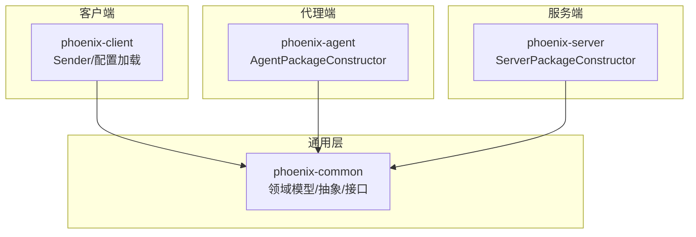
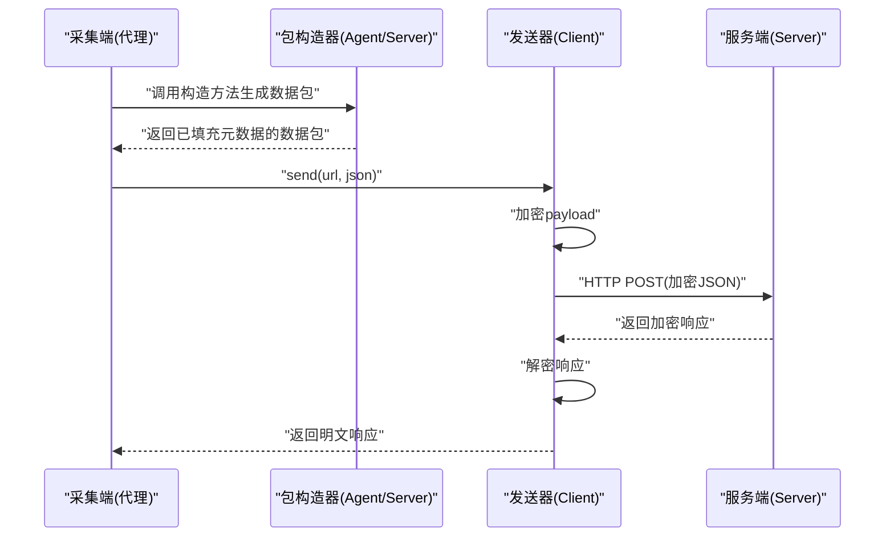
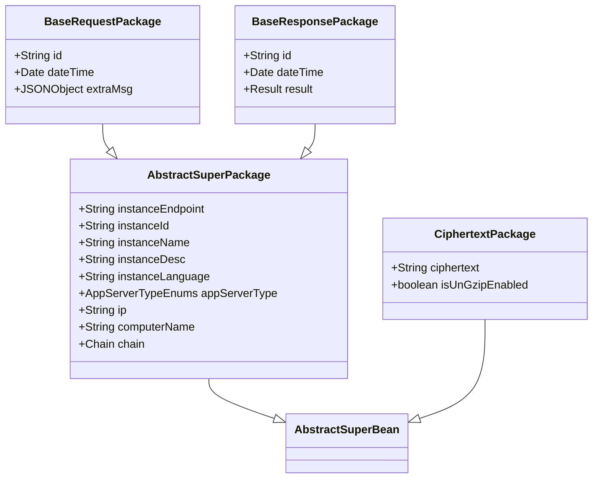
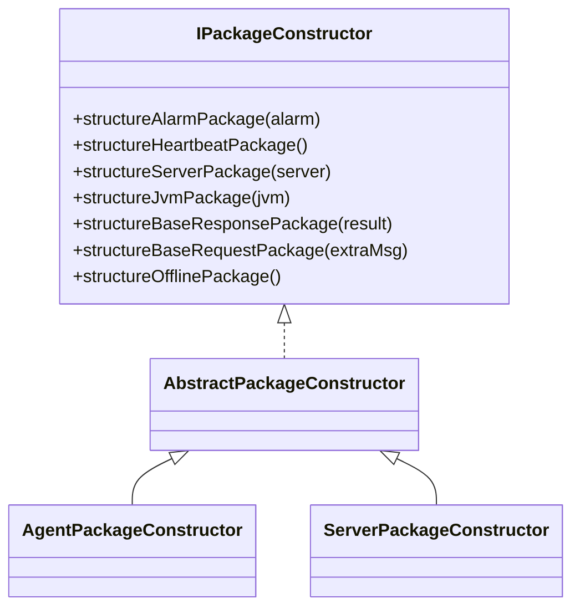
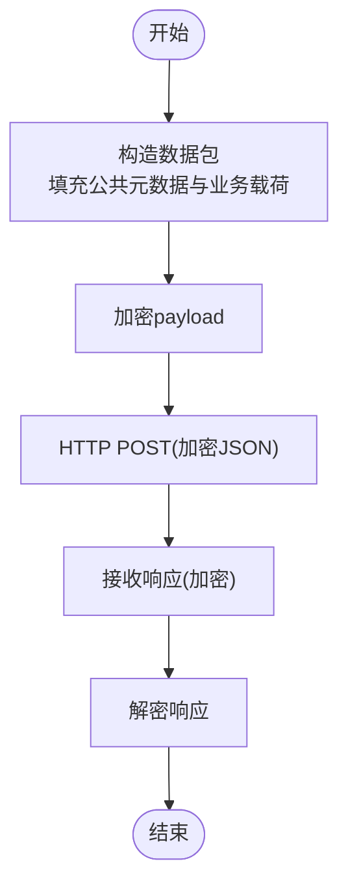
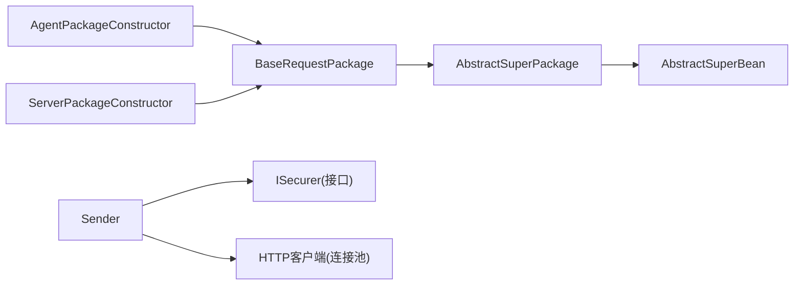

# 数据上报机制

<cite>
**本文引用的文件**
- [BaseRequestPackage.java](file://phoenix-common\phoenix-common-core\src\main\java\com\gitee\pifeng\monitoring\common\dto\BaseRequestPackage.java)
- [BaseResponsePackage.java](file://phoenix-common\phoenix-common-core\src\main\java\com\gitee\pifeng\monitoring\common\dto\BaseResponsePackage.java)
- [AbstractPackageConstructor.java](file://phoenix-common\phoenix-common-core\src\main\java\com\gitee\pifeng\monitoring\common\abs\AbstractPackageConstructor.java)
- [IPackageConstructor.java](file://phoenix-common\phoenix-common-core\src\main\java\com\gitee\pifeng\monitoring\common\inf\IPackageConstructor.java)
- [CiphertextPackage.java](file://phoenix-common\phoenix-common-core\src\main\java\com\gitee\pifeng\monitoring\common\dto\CiphertextPackage.java)
- [AbstractSuperPackage.java](file://phoenix-common\phoenix-common-core\src\main\java\com\gitee\pifeng\monitoring\common\abs\AbstractSuperPackage.java)
- [AbstractSuperBean.java](file://phoenix-common\phoenix-common-core\src\main\java\com\gitee\pifeng\monitoring\common\abs\AbstractSuperBean.java)
- [Result.java](file://phoenix-common\phoenix-common-core\src\main\java\com\gitee\pifeng\monitoring\common\domain\Result.java)
- [AgentPackageConstructor.java](file://phoenix-agent\src\main\java\com\gitee\pifeng\monitoring\agent\core\AgentPackageConstructor.java)
- [ServerPackageConstructor.java](file://phoenix-server\src\main\java\com\gitee\pifeng\monitoring\server\business\server\core\ServerPackageConstructor.java)
- [Sender.java](file://phoenix-client\phoenix-client-core\src\main\java\com\gitee\pifeng\monitoring\plug\core\Sender.java)
- [ISecurer.java](file://phoenix-common\phoenix-common-core\src\main\java\com\gitee\pifeng\monitoring\common\inf\ISecurer.java)
</cite>

## 目录
1. [引言](#引言)
2. [项目结构](#项目结构)
3. [核心组件](#核心组件)
4. [架构总览](#架构总览)
5. [详细组件分析](#详细组件分析)
6. [依赖分析](#依赖分析)
7. [性能考虑](#性能考虑)
8. [故障排查指南](#故障排查指南)
9. [结论](#结论)
10. [附录](#附录)

## 引言
本文件围绕Phoenix监控系统的自定义监控指标数据上报机制，系统性解析数据包构造、序列化与反序列化、加解密、网络传输、接收处理、可靠性保障与性能优化策略，并提供从数据采集到上报的完整实现路径与参考示例。

## 项目结构
Phoenix采用多模块分层设计：
- phoenix-common：通用领域模型、抽象基类、DTO、接口与工具
- phoenix-agent：监控代理端，负责采集与构造数据包
- phoenix-server：服务端，负责接收与处理数据包
- phoenix-client：客户端插件，封装发送逻辑与配置加载

图表来源
- [Sender.java:1-61](file://phoenix-client\phoenix-client-core\src\main\java\com\gitee\pifeng\monitoring\plug\core\Sender.java#L1-L61)
- [AgentPackageConstructor.java:1-202](file://phoenix-agent\src\main\java\com\gitee\pifeng\monitoring\agent\core\AgentPackageConstructor.java#L1-L202)
- [ServerPackageConstructor.java:1-212](file://phoenix-server\src\main\java\com\gitee\pifeng\monitoring\server\business\server\core\ServerPackageConstructor.java#L1-L212)

章节来源
- [Sender.java:1-61](file://phoenix-client\phoenix-client-core\src\main\java\com\gitee\pifeng\monitoring\plug\core\Sender.java#L1-L61)
- [AgentPackageConstructor.java:1-202](file://phoenix-agent\src\main\java\com\gitee\pifeng\monitoring\agent\core\AgentPackageConstructor.java#L1-L202)
- [ServerPackageConstructor.java:1-212](file://phoenix-server\src\main\java\com\gitee\pifeng\monitoring\server\business\server\core\ServerPackageConstructor.java#L1-L212)

## 核心组件
- 数据包基类与扩展
  - 抽象父包：统一承载实例端点、实例标识、应用服务器类型、IP、计算机名、链路信息等公共字段
  - 基础请求包：携带ID、时间戳、附加信息
  - 基础响应包：携带ID、时间戳、返回结果
  - 密文包：承载加密后的数据及是否需要解压标志
- 包构造器接口与抽象实现
  - 接口定义了多种数据包的构造方法（告警、心跳、服务器、JVM、基础请求/响应、下线）
  - 抽象实现提供默认空实现，具体端点按需覆盖
- 发送器
  - 负责将明文JSON加密后POST到目标URL，再将响应解密返回

章节来源
- [AbstractSuperPackage.java:1-72](file://phoenix-common\phoenix-common-core\src\main\java\com\gitee\pifeng\monitoring\common\abs\AbstractSuperPackage.java#L1-L72)
- [BaseRequestPackage.java:1-42](file://phoenix-common\phoenix-common-core\src\main\java\com\gitee\pifeng\monitoring\common\dto\BaseRequestPackage.java#L1-L42)
- [BaseResponsePackage.java:1-42](file://phoenix-common\phoenix-common-core\src\main\java\com\gitee\pifeng\monitoring\common\dto\BaseResponsePackage.java#L1-L42)
- [CiphertextPackage.java:1-34](file://phoenix-common\phoenix-common-core\src\main\java\com\gitee\pifeng\monitoring\common\dto\CiphertextPackage.java#L1-L34)
- [IPackageConstructor.java:1-114](file://phoenix-common\phoenix-common-core\src\main\java\com\gitee\pifeng\monitoring\common\inf\IPackageConstructor.java#L1-L114)
- [AbstractPackageConstructor.java:1-133](file://phoenix-common\phoenix-common-core\src\main\java\com\gitee\pifeng\monitoring\common\abs\AbstractPackageConstructor.java#L1-L133)
- [Sender.java:1-61](file://phoenix-client\phoenix-client-core\src\main\java\com\gitee\pifeng\monitoring\plug\core\Sender.java#L1-L61)

## 架构总览
Phoenix的数据上报遵循“采集端构造数据包 → 客户端加密发送 → 服务端解密接收 → 处理并返回响应”的闭环流程。不同端点通过各自的包构造器填充公共元数据与业务载荷，确保跨端一致性与可追踪性。

图表来源
- [AgentPackageConstructor.java:149-200](file://phoenix-agent\src\main\java\com\gitee\pifeng\monitoring\agent\core\AgentPackageConstructor.java#L149-L200)
- [ServerPackageConstructor.java:130-209](file://phoenix-server\src\main\java\com\gitee\pifeng\monitoring\server\business\server\core\ServerPackageConstructor.java#L130-L209)
- [Sender.java:42-59](file://phoenix-client\phoenix-client-core\src\main\java\com\gitee\pifeng\monitoring\plug\core\Sender.java#L42-L59)

## 详细组件分析

### 数据包与抽象基类
- 抽象父包统一承载实例端点、实例标识、应用服务器类型、IP、计算机名、链路信息等，保证跨端一致的上下文
- 基础请求/响应包在父包基础上扩展ID、时间戳与业务载荷（附加信息/返回结果）

图表来源
- [AbstractSuperBean.java:1-15](file://phoenix-common\phoenix-common-core\src\main\java\com\gitee\pifeng\monitoring\common\abs\AbstractSuperBean.java#L1-L15)
- [AbstractSuperPackage.java:1-72](file://phoenix-common\phoenix-common-core\src\main\java\com\gitee\pifeng\monitoring\common\abs\AbstractSuperPackage.java#L1-L72)
- [BaseRequestPackage.java:1-42](file://phoenix-common\phoenix-common-core\src\main\java\com\gitee\pifeng\monitoring\common\dto\BaseRequestPackage.java#L1-L42)
- [BaseResponsePackage.java:1-42](file://phoenix-common\phoenix-common-core\src\main\java\com\gitee\pifeng\monitoring\common\dto\BaseResponsePackage.java#L1-L42)
- [CiphertextPackage.java:1-34](file://phoenix-common\phoenix-common-core\src\main\java\com\gitee\pifeng\monitoring\common\dto\CiphertextPackage.java#L1-L34)

章节来源
- [AbstractSuperPackage.java:1-72](file://phoenix-common\phoenix-common-core\src\main\java\com\gitee\pifeng\monitoring\common\abs\AbstractSuperPackage.java#L1-L72)
- [BaseRequestPackage.java:1-42](file://phoenix-common\phoenix-common-core\src\main\java\com\gitee\pifeng\monitoring\common\dto\BaseRequestPackage.java#L1-L42)
- [BaseResponsePackage.java:1-42](file://phoenix-common\phoenix-common-core\src\main\java\com\gitee\pifeng\monitoring\common\dto\BaseResponsePackage.java#L1-L42)
- [CiphertextPackage.java:1-34](file://phoenix-common\phoenix-common-core\src\main\java\com\gitee\pifeng\monitoring\common\dto\CiphertextPackage.java#L1-L34)

### 包构造器抽象与端点实现
- 抽象构造器提供默认空实现，具体端点（代理/服务端）仅覆盖所需方法，避免重复代码
- 代理端与服务端均实现公共元数据填充（端点、实例ID/名称/描述、语言、服务器类型、IP、计算机名、链路），并支持链路追加与时间戳记录

图表来源
- [IPackageConstructor.java:1-114](file://phoenix-common\phoenix-common-core\src\main\java\com\gitee\pifeng\monitoring\common\inf\IPackageConstructor.java#L1-L114)
- [AbstractPackageConstructor.java:1-133](file://phoenix-common\phoenix-common-core\src\main\java\com\gitee\pifeng\monitoring\common\abs\AbstractPackageConstructor.java#L1-L133)
- [AgentPackageConstructor.java:1-202](file://phoenix-agent\src\main\java\com\gitee\pifeng\monitoring\agent\core\AgentPackageConstructor.java#L1-L202)
- [ServerPackageConstructor.java:1-212](file://phoenix-server\src\main\java\com\gitee\pifeng\monitoring\server\business\server\core\ServerPackageConstructor.java#L1-L212)

章节来源
- [IPackageConstructor.java:1-114](file://phoenix-common\phoenix-common-core\src\main\java\com\gitee\pifeng\monitoring\common\inf\IPackageConstructor.java#L1-L114)
- [AbstractPackageConstructor.java:1-133](file://phoenix-common\phoenix-common-core\src\main\java\com\gitee\pifeng\monitoring\common\abs\AbstractPackageConstructor.java#L1-L133)
- [AgentPackageConstructor.java:1-202](file://phoenix-agent\src\main\java\com\gitee\pifeng\monitoring\agent\core\AgentPackageConstructor.java#L1-L202)
- [ServerPackageConstructor.java:1-212](file://phoenix-server\src\main\java\com\gitee\pifeng\monitoring\server\business\server\core\ServerPackageConstructor.java#L1-L212)

### 序列化与反序列化机制
- 数据包以JSON形式承载，发送前由发送器进行加解密包装
- 响应返回后，发送器执行解密，便于上层以明文对象处理
- 密文包用于承载加密后的字符串以及是否需要解压的标记位

章节来源
- [Sender.java:42-59](file://phoenix-client\phoenix-client-core\src\main\java\com\gitee\pifeng\monitoring\plug\core\Sender.java#L42-L59)
- [CiphertextPackage.java:1-34](file://phoenix-common\phoenix-common-core\src\main\java\com\gitee\pifeng\monitoring\common\dto\CiphertextPackage.java#L1-L34)

### 数据上报流程
- 采集端（代理/服务端）通过各自包构造器生成数据包，填充公共元数据与业务载荷
- 客户端发送器将明文JSON加密后POST至目标URL
- 服务端接收后解密，处理业务逻辑并返回加密响应
- 客户端再次解密响应，返回给调用方

图表来源
- [AgentPackageConstructor.java:149-200](file://phoenix-agent\src\main\java\com\gitee\pifeng\monitoring\agent\core\AgentPackageConstructor.java#L149-L200)
- [ServerPackageConstructor.java:130-209](file://phoenix-server\src\main\java\com\gitee\pifeng\monitoring\server\business\server\core\ServerPackageConstructor.java#L130-L209)
- [Sender.java:42-59](file://phoenix-client\phoenix-client-core\src\main\java\com\gitee\pifeng\monitoring\plug\core\Sender.java#L42-L59)

章节来源
- [AgentPackageConstructor.java:149-200](file://phoenix-agent\src\main\java\com\gitee\pifeng\monitoring\agent\core\AgentPackageConstructor.java#L149-L200)
- [ServerPackageConstructor.java:130-209](file://phoenix-server\src\main\java\com\gitee\pifeng\monitoring\server\business\server\core\ServerPackageConstructor.java#L130-L209)
- [Sender.java:42-59](file://phoenix-client\phoenix-client-core\src\main\java\com\gitee\pifeng\monitoring\plug\core\Sender.java#L42-L59)

### 可靠性保障机制
- 重试机制：建议在发送器外层封装指数退避重试与最大重试次数控制
- 超时处理：在HTTP客户端配置连接/读取超时，超时即判定失败并触发重试或降级
- 断线重连：在网络异常时自动切换备用节点或延迟重试，避免阻塞主线程
- 数据校验：在发送前对关键字段进行校验，接收后验证签名/摘要，确保完整性
- 链路追踪：通过链路信息维护实例链路、网络链路与时间链路，便于问题定位

章节来源
- [AgentPackageConstructor.java:73-102](file://phoenix-agent\src\main\java\com\gitee\pifeng\monitoring\agent\core\AgentPackageConstructor.java#L73-L102)
- [ServerPackageConstructor.java:54-83](file://phoenix-server\src\main\java\com\gitee\pifeng\monitoring\server\business\server\core\ServerPackageConstructor.java#L54-L83)

### 性能优化策略
- 批量上报：将多个指标合并为一个数据包，减少网络往返与序列化开销
- 压缩传输：对大体量JSON进行压缩后再加密，降低带宽占用
- 连接复用：使用连接池与长连接，减少握手成本
- 异步处理：将发送操作放入线程池异步执行，避免阻塞业务线程
- 缓存与限流：对热点数据进行缓存，结合令牌桶/漏桶算法限流

章节来源
- [Sender.java:42-59](file://phoenix-client\phoenix-client-core\src\main\java\com\gitee\pifeng\monitoring\plug\core\Sender.java#L42-L59)

### 上报实现示例（从采集到上报）
- 采集阶段：在采集端（如代理）收集指标数据，组装业务载荷
- 构造数据包：调用对应包构造器生成基础请求包，填充公共元数据与业务载荷
- 加密发送：通过发送器将明文JSON加密后POST到目标URL
- 接收处理：服务端解密后处理业务逻辑并返回加密响应
- 结果解析：客户端解密响应，按需解析返回结果

章节来源
- [AgentPackageConstructor.java:149-200](file://phoenix-agent\src\main\java\com\gitee\pifeng\monitoring\agent\core\AgentPackageConstructor.java#L149-L200)
- [ServerPackageConstructor.java:130-209](file://phoenix-server\src\main\java\com\gitee\pifeng\monitoring\server\business\server\core\ServerPackageConstructor.java#L130-L209)
- [Sender.java:42-59](file://phoenix-client\phoenix-client-core\src\main\java\com\gitee\pifeng\monitoring\plug\core\Sender.java#L42-L59)

## 依赖分析
- 组件内聚与耦合
  - 包构造器与数据包强内聚，通过抽象接口解耦不同端点
  - 发送器仅依赖通用工具与HTTP客户端，保持低耦合
- 外部依赖
  - JSON序列化/反序列化（FastJSON）
  - HTTP客户端（连接池）
  - 加解密接口（ISecurer）

图表来源
- [AgentPackageConstructor.java:1-202](file://phoenix-agent\src\main\java\com\gitee\pifeng\monitoring\agent\core\AgentPackageConstructor.java#L1-L202)
- [ServerPackageConstructor.java:1-212](file://phoenix-server\src\main\java\com\gitee\pifeng\monitoring\server\business\server\core\ServerPackageConstructor.java#L1-L212)
- [Sender.java:1-61](file://phoenix-client\phoenix-client-core\src\main\java\com\gitee\pifeng\monitoring\plug\core\Sender.java#L1-L61)
- [BaseRequestPackage.java:1-42](file://phoenix-common\phoenix-common-core\src\main\java\com\gitee\pifeng\monitoring\common\dto\BaseRequestPackage.java#L1-L42)
- [AbstractSuperPackage.java:1-72](file://phoenix-common\phoenix-common-core\src\main\java\com\gitee\pifeng\monitoring\common\abs\AbstractSuperPackage.java#L1-L72)
- [AbstractSuperBean.java:1-15](file://phoenix-common\phoenix-common-core\src\main\java\com\gitee\pifeng\monitoring\common\abs\AbstractSuperBean.java#L1-L15)
- [ISecurer.java:1-66](file://phoenix-common\phoenix-common-core\src\main\java\com\gitee\pifeng\monitoring\common\inf\ISecurer.java#L1-L66)

章节来源
- [IPackageConstructor.java:1-114](file://phoenix-common\phoenix-common-core\src\main\java\com\gitee\pifeng\monitoring\common\inf\IPackageConstructor.java#L1-L114)
- [AbstractPackageConstructor.java:1-133](file://phoenix-common\phoenix-common-core\src\main\java\com\gitee\pifeng\monitoring\common\abs\AbstractPackageConstructor.java#L1-L133)
- [Sender.java:1-61](file://phoenix-client\phoenix-client-core\src\main\java\com\gitee\pifeng\monitoring\plug\core\Sender.java#L1-L61)

## 性能考虑
- 批量聚合：将多个小包合并为大包，减少网络请求次数
- 压缩策略：对大JSON进行Gzip压缩，配合密文包的解压标记位
- 连接池：启用HTTP连接池与长连接，降低握手与TLS开销
- 异步发送：使用线程池异步发送，避免阻塞业务线程
- 缓存与限流：对热点数据做本地缓存，结合限流策略防止雪崩

## 故障排查指南
- 加解密异常：检查密钥配置与字符集设置，确认加密/解密两端一致
- 网络超时：调整连接/读取超时参数，必要时开启重试与熔断
- 数据包缺失：核对链路信息与公共元数据是否正确填充
- 响应异常：查看服务端日志与状态码，确认业务处理是否抛出异常

章节来源
- [ISecurer.java:1-66](file://phoenix-common\phoenix-common-core\src\main\java\com\gitee\pifeng\monitoring\common\inf\ISecurer.java#L1-L66)
- [Sender.java:42-59](file://phoenix-client\phoenix-client-core\src\main\java\com\gitee\pifeng\monitoring\plug\core\Sender.java#L42-L59)

## 结论
Phoenix监控系统的数据上报机制以抽象包构造器为核心，通过统一的公共元数据与链路追踪，结合客户端的加解密与HTTP传输，形成高内聚、低耦合、可扩展的上报体系。通过批量、压缩、连接复用与异步处理等优化手段，可在保证可靠性的同时显著提升吞吐与稳定性。

## 附录
- 关键接口与类参考路径
  - [IPackageConstructor.java:1-114](file://phoenix-common\phoenix-common-core\src\main\java\com\gitee\pifeng\monitoring\common\inf\IPackageConstructor.java#L1-L114)
  - [AbstractPackageConstructor.java:1-133](file://phoenix-common\phoenix-common-core\src\main\java\com\gitee\pifeng\monitoring\common\abs\AbstractPackageConstructor.java#L1-L133)
  - [BaseRequestPackage.java:1-42](file://phoenix-common\phoenix-common-core\src\main\java\com\gitee\pifeng\monitoring\common\dto\BaseRequestPackage.java#L1-L42)
  - [BaseResponsePackage.java:1-42](file://phoenix-common\phoenix-common-core\src\main\java\com\gitee\pifeng\monitoring\common\dto\BaseResponsePackage.java#L1-L42)
  - [CiphertextPackage.java:1-34](file://phoenix-common\phoenix-common-core\src\main\java\com\gitee\pifeng\monitoring\common\dto\CiphertextPackage.java#L1-L34)
  - [AbstractSuperPackage.java:1-72](file://phoenix-common\phoenix-common-core\src\main\java\com\gitee\pifeng\monitoring\common\abs\AbstractSuperPackage.java#L1-L72)
  - [AbstractSuperBean.java:1-15](file://phoenix-common\phoenix-common-core\src\main\java\com\gitee\pifeng\monitoring\common\abs\AbstractSuperBean.java#L1-L15)
  - [Result.java:1-35](file://phoenix-common\phoenix-common-core\src\main\java\com\gitee\pifeng\monitoring\common\domain\Result.java#L1-L35)
  - [AgentPackageConstructor.java:1-202](file://phoenix-agent\src\main\java\com\gitee\pifeng\monitoring\agent\core\AgentPackageConstructor.java#L1-L202)
  - [ServerPackageConstructor.java:1-212](file://phoenix-server\src\main\java\com\gitee\pifeng\monitoring\server\business\server\core\ServerPackageConstructor.java#L1-L212)
  - [Sender.java:1-61](file://phoenix-client\phoenix-client-core\src\main\java\com\gitee\pifeng\monitoring\plug\core\Sender.java#L1-L61)
  - [ISecurer.java:1-66](file://phoenix-common\phoenix-common-core\src\main\java\com\gitee\pifeng\monitoring\common\inf\ISecurer.java#L1-L66)