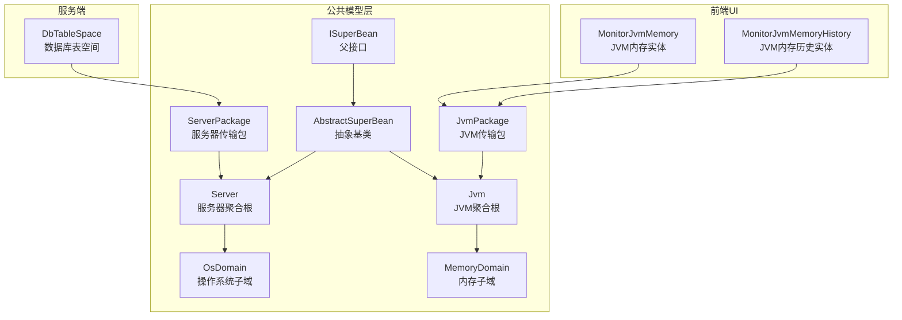
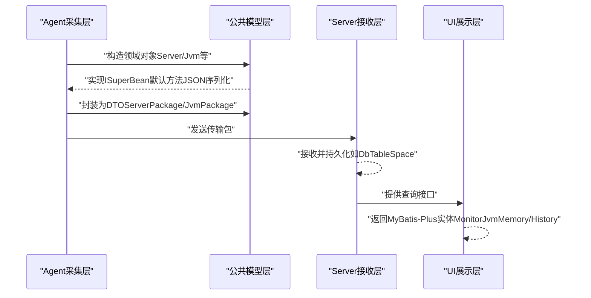
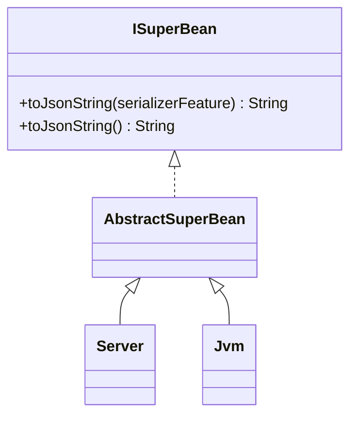
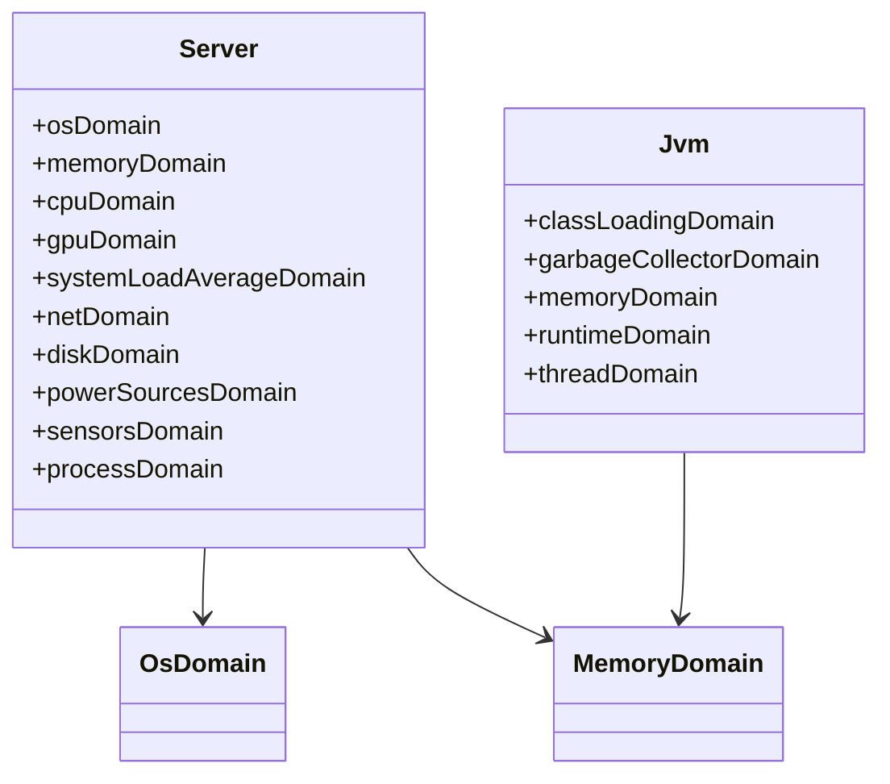
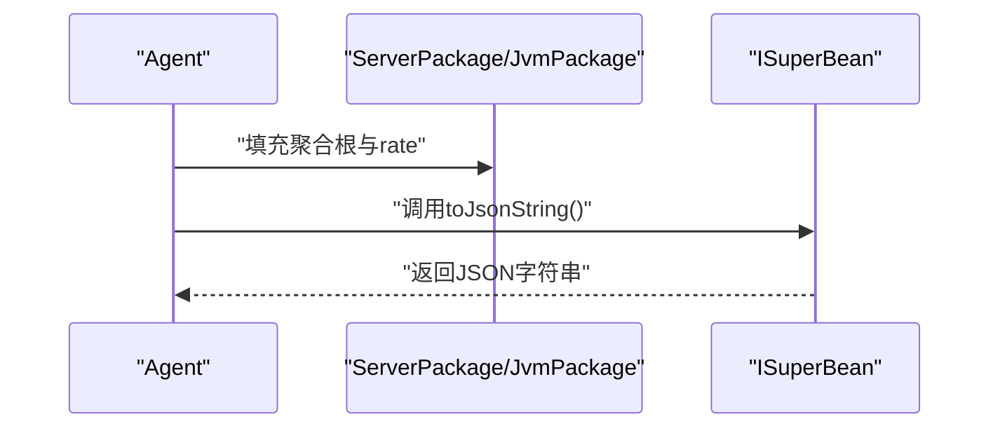
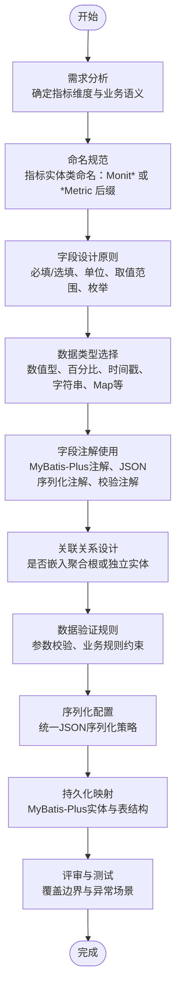
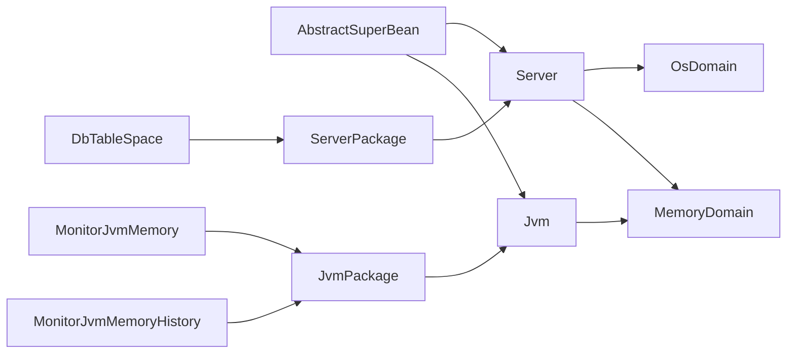

# 数据模型设计

<cite>
**本文引用的文件**   
- [AbstractSuperBean.java](file://phoenix-common/phoenix-common-core/src/main/java/com/gitee/pifeng/monitoring/common/abs/AbstractSuperBean.java)
- [ISuperBean.java](file://phoenix-common/phoenix-common-core/src/main/java/com/gitee/pifeng/monitoring/common/inf/ISuperBean.java)
- [Server.java](file://phoenix-common/phoenix-common-core/src/main/java/com/gitee/pifeng/monitoring/common/domain/Server.java)
- [Jvm.java](file://phoenix-common/phoenix-common-core/src/main/java/com/gitee/pifeng/monitoring/common/domain/Jvm.java)
- [OsDomain.java](file://phoenix-common/phoenix-common-core/src/main/java/com/gitee/pifeng/monitoring/common/domain/server/OsDomain.java)
- [MemoryDomain.java](file://phoenix-common/phoenix-common-core/src/main/java/com/gitee/pifeng/monitoring/common/domain/jvm/MemoryDomain.java)
- [ServerPackage.java](file://phoenix-common/phoenix-common-core/src/main/java/com/gitee/pifeng/monitoring/common/dto/ServerPackage.java)
- [JvmPackage.java](file://phoenix-common/phoenix-common-core/src/main/java/com/gitee/pifeng/monitoring/common/dto/JvmPackage.java)
- [DbTableSpace.java](file://phoenix-server/src/main/java/com/gitee/pifeng/monitoring/server/business/server/domain/DbTableSpace.java)
- [MonitorJvmMemory.java](file://phoenix-ui/src/main/java/com/gitee/pifeng/monitoring/ui/business/web/entity/MonitorJvmMemory.java)
- [MonitorJvmMemoryHistory.java](file://phoenix-ui/src/main/java/com/gitee/pifeng/monitoring/ui/business/web/entity/MonitorJvmMemoryHistory.java)
</cite>

## 目录
1. [引言](#引言)
2. [项目结构](#项目结构)
3. [核心组件](#核心组件)
4. [架构总览](#架构总览)
5. [详细组件分析](#详细组件分析)
6. [依赖分析](#依赖分析)
7. [性能考虑](#性能考虑)
8. [故障排查指南](#故障排查指南)
9. [结论](#结论)
10. [附录](#附录)

## 引言
本文件面向Phoenix监控系统的“自定义监控指标”数据模型设计，目标是帮助开发者在现有数据模型体系下，设计出可扩展、可维护、可序列化的监控指标实体类。文档将深入解析现有数据模型的设计理念，包括抽象基类AbstractSuperBean的作用、ISuperBean接口的设计原则、领域对象的继承体系；并给出新指标实体类的设计流程、命名规范、字段设计原则、数据类型选择、字段注解使用方式、与Server、Jvm等核心实体的关系，以及数据验证规则、业务规则与序列化配置等技术要点。

## 项目结构
Phoenix采用分层+模块化架构，监控数据模型主要集中在公共模块phoenix-common中，Agent侧负责采集与封装，Server侧负责接收与持久化，UI侧负责展示与查询。数据模型以领域对象为核心，配合DTO进行跨进程传输，同时在UI侧存在MyBatis-Plus实体用于数据库映射。

图表来源
- [AbstractSuperBean.java:1-15](file://phoenix-common/phoenix-common-core/src/main/java/com/gitee/pifeng/monitoring/common/abs/AbstractSuperBean.java#L1-L15)
- [ISuperBean.java:1-44](file://phoenix-common/phoenix-common-core/src/main/java/com/gitee/pifeng/monitoring/common/inf/ISuperBean.java#L1-L44)
- [Server.java:1-76](file://phoenix-common/phoenix-common-core/src/main/java/com/gitee/pifeng/monitoring/common/domain/Server.java#L1-L76)
- [Jvm.java:1-51](file://phoenix-common/phoenix-common-core/src/main/java/com/gitee/pifeng/monitoring/common/domain/Jvm.java#L1-L51)
- [ServerPackage.java:1-34](file://phoenix-common/phoenix-common-core/src/main/java/com/gitee/pifeng/monitoring/common/dto/ServerPackage.java#L1-L34)
- [JvmPackage.java:1-34](file://phoenix-common/phoenix-common-core/src/main/java/com/gitee/pifeng/monitoring/common/dto/JvmPackage.java#L1-L34)
- [OsDomain.java:1-56](file://phoenix-common/phoenix-common-core/src/main/java/com/gitee/pifeng/monitoring/common/domain/server/OsDomain.java#L1-L56)
- [MemoryDomain.java:1-66](file://phoenix-common/phoenix-common-core/src/main/java/com/gitee/pifeng/monitoring/common/domain/jvm/MemoryDomain.java#L1-L66)
- [DbTableSpace.java:1-54](file://phoenix-server/src/main/java/com/gitee/pifeng/monitoring/server/business/server/domain/DbTableSpace.java#L1-L54)
- [MonitorJvmMemory.java:1-46](file://phoenix-ui/src/main/java/com/gitee/pifeng/monitoring/ui/business/web/entity/MonitorJvmMemory.java#L1-L46)
- [MonitorJvmMemoryHistory.java:1-45](file://phoenix-ui/src/main/java/com/gitee/pifeng/monitoring/ui/business/web/entity/MonitorJvmMemoryHistory.java#L1-L45)

章节来源
- [AbstractSuperBean.java:1-15](file://phoenix-common/phoenix-common-core/src/main/java/com/gitee/pifeng/monitoring/common/abs/AbstractSuperBean.java#L1-L15)
- [ISuperBean.java:1-44](file://phoenix-common/phoenix-common-core/src/main/java/com/gitee/pifeng/monitoring/common/inf/ISuperBean.java#L1-L44)
- [Server.java:1-76](file://phoenix-common/phoenix-common-core/src/main/java/com/gitee/pifeng/monitoring/common/domain/Server.java#L1-L76)
- [Jvm.java:1-51](file://phoenix-common/phoenix-common-core/src/main/java/com/gitee/pifeng/monitoring/common/domain/Jvm.java#L1-L51)
- [ServerPackage.java:1-34](file://phoenix-common/phoenix-common-core/src/main/java/com/gitee/pifeng/monitoring/common/dto/ServerPackage.java#L1-L34)
- [JvmPackage.java:1-34](file://phoenix-common/phoenix-common-core/src/main/java/com/gitee/pifeng/monitoring/common/dto/JvmPackage.java#L1-L34)

## 核心组件
- 抽象基类AbstractSuperBean：统一实现ISuperBean接口，为所有领域对象提供通用能力（如toJsonString）。
- 接口ISuperBean：定义默认方法，提供JSON序列化能力，便于跨层传递与存储。
- 聚合根Server与Jvm：作为监控数据的聚合根，内部组合多个子域对象，形成完整的监控视图。
- DTO传输包ServerPackage/JvmPackage：承载聚合根与传输速率等元数据，用于网络传输。
- 子域对象：如OsDomain、MemoryDomain等，封装细粒度监控指标，便于复用与扩展。
- UI实体：MonitorJvmMemory、MonitorJvmMemoryHistory等，用于数据库持久化与查询展示。

章节来源
- [AbstractSuperBean.java:1-15](file://phoenix-common/phoenix-common-core/src/main/java/com/gitee/pifeng/monitoring/common/abs/AbstractSuperBean.java#L1-L15)
- [ISuperBean.java:1-44](file://phoenix-common/phoenix-common-core/src/main/java/com/gitee/pifeng/monitoring/common/inf/ISuperBean.java#L1-L44)
- [Server.java:1-76](file://phoenix-common/phoenix-common-core/src/main/java/com/gitee/pifeng/monitoring/common/domain/Server.java#L1-L76)
- [Jvm.java:1-51](file://phoenix-common/phoenix-common-core/src/main/java/com/gitee/pifeng/monitoring/common/domain/Jvm.java#L1-L51)
- [ServerPackage.java:1-34](file://phoenix-common/phoenix-common-core/src/main/java/com/gitee/pifeng/monitoring/common/dto/ServerPackage.java#L1-L34)
- [JvmPackage.java:1-34](file://phoenix-common/phoenix-common-core/src/main/java/com/gitee/pifeng/monitoring/common/dto/JvmPackage.java#L1-L34)

## 架构总览
下图展示了从Agent采集到UI展示的典型链路，以及数据模型在各层的对应关系：

图表来源
- [ServerPackage.java:1-34](file://phoenix-common/phoenix-common-core/src/main/java/com/gitee/pifeng/monitoring/common/dto/ServerPackage.java#L1-L34)
- [JvmPackage.java:1-34](file://phoenix-common/phoenix-common-core/src/main/java/com/gitee/pifeng/monitoring/common/dto/JvmPackage.java#L1-L34)
- [DbTableSpace.java:1-54](file://phoenix-server/src/main/java/com/gitee/pifeng/monitoring/server/business/server/domain/DbTableSpace.java#L1-L54)
- [MonitorJvmMemory.java:1-46](file://phoenix-ui/src/main/java/com/gitee/pifeng/monitoring/ui/business/web/entity/MonitorJvmMemory.java#L1-L46)
- [MonitorJvmMemoryHistory.java:1-45](file://phoenix-ui/src/main/java/com/gitee/pifeng/monitoring/ui/business/web/entity/MonitorJvmMemoryHistory.java#L1-L45)

## 详细组件分析

### 抽象基类与接口设计
- AbstractSuperBean：实现ISuperBean，使所有领域对象天然具备JSON序列化能力，减少重复代码。
- ISuperBean：提供toJsonString重载，默认写入空值，便于调试与存储。
- 设计原则：通过接口默认方法提供横切能力，避免在每个实体中重复实现；通过抽象基类统一行为，确保一致性。

图表来源
- [ISuperBean.java:1-44](file://phoenix-common/phoenix-common-core/src/main/java/com/gitee/pifeng/monitoring/common/inf/ISuperBean.java#L1-L44)
- [AbstractSuperBean.java:1-15](file://phoenix-common/phoenix-common-core/src/main/java/com/gitee/pifeng/monitoring/common/abs/AbstractSuperBean.java#L1-L15)
- [Server.java:1-76](file://phoenix-common/phoenix-common-core/src/main/java/com/gitee/pifeng/monitoring/common/domain/Server.java#L1-L76)
- [Jvm.java:1-51](file://phoenix-common/phoenix-common-core/src/main/java/com/gitee/pifeng/monitoring/common/domain/Jvm.java#L1-L51)

章节来源
- [ISuperBean.java:1-44](file://phoenix-common/phoenix-common-core/src/main/java/com/gitee/pifeng/monitoring/common/inf/ISuperBean.java#L1-L44)
- [AbstractSuperBean.java:1-15](file://phoenix-common/phoenix-common-core/src/main/java/com/gitee/pifeng/monitoring/common/abs/AbstractSuperBean.java#L1-L15)

### Server与Jvm聚合根
- Server：聚合了操作系统、内存、CPU、GPU、系统负载、网卡、磁盘、电源、传感器、进程等子域，形成完整的服务器视图。
- Jvm：聚合了类加载、垃圾回收、内存、运行时、线程等子域，形成完整的JVM视图。
- 设计要点：使用组合而非继承，子域对象独立演化；通过聚合根对外暴露统一的数据视图。

图表来源
- [Server.java:1-76](file://phoenix-common/phoenix-common-core/src/main/java/com/gitee/pifeng/monitoring/common/domain/Server.java#L1-L76)
- [Jvm.java:1-51](file://phoenix-common/phoenix-common-core/src/main/java/com/gitee/pifeng/monitoring/common/domain/Jvm.java#L1-L51)
- [OsDomain.java:1-56](file://phoenix-common/phoenix-common-core/src/main/java/com/gitee/pifeng/monitoring/common/domain/server/OsDomain.java#L1-L56)
- [MemoryDomain.java:1-66](file://phoenix-common/phoenix-common-core/src/main/java/com/gitee/pifeng/monitoring/common/domain/jvm/MemoryDomain.java#L1-L66)

章节来源
- [Server.java:1-76](file://phoenix-common/phoenix-common-core/src/main/java/com/gitee/pifeng/monitoring/common/domain/Server.java#L1-L76)
- [Jvm.java:1-51](file://phoenix-common/phoenix-common-core/src/main/java/com/gitee/pifeng/monitoring/common/domain/Jvm.java#L1-L51)
- [OsDomain.java:1-56](file://phoenix-common/phoenix-common-core/src/main/java/com/gitee/pifeng/monitoring/common/domain/server/OsDomain.java#L1-L56)
- [MemoryDomain.java:1-66](file://phoenix-common/phoenix-common-core/src/main/java/com/gitee/pifeng/monitoring/common/domain/jvm/MemoryDomain.java#L1-L66)

### DTO传输包与序列化
- ServerPackage/JvmPackage：在聚合根基础上附加传输速率等元数据，便于服务端按频率处理。
- 序列化策略：统一通过ISuperBean提供的toJsonString，默认输出空值，保证字段完整性与可读性。

图表来源
- [ServerPackage.java:1-34](file://phoenix-common/phoenix-common-core/src/main/java/com/gitee/pifeng/monitoring/common/dto/ServerPackage.java#L1-L34)
- [JvmPackage.java:1-34](file://phoenix-common/phoenix-common-core/src/main/java/com/gitee/pifeng/monitoring/common/dto/JvmPackage.java#L1-L34)
- [ISuperBean.java:1-44](file://phoenix-common/phoenix-common-core/src/main/java/com/gitee/pifeng/monitoring/common/inf/ISuperBean.java#L1-L44)

章节来源
- [ServerPackage.java:1-34](file://phoenix-common/phoenix-common-core/src/main/java/com/gitee/pifeng/monitoring/common/dto/ServerPackage.java#L1-L34)
- [JvmPackage.java:1-34](file://phoenix-common/phoenix-common-core/src/main/java/com/gitee/pifeng/monitoring/common/dto/JvmPackage.java#L1-L34)
- [ISuperBean.java:1-44](file://phoenix-common/phoenix-common-core/src/main/java/com/gitee/pifeng/monitoring/common/inf/ISuperBean.java#L1-L44)

### 新监控指标实体类设计流程
以下流程从需求分析到实体类实现，结合现有模型设计原则，给出可落地的步骤与注意事项。

说明
- 命名规范：建议采用Monit* 或 *Metric后缀，与现有领域对象风格一致。
- 字段设计：优先使用明确单位与取值范围，必要时引入枚举或Map结构。
- 注解使用：MyBatis-Plus注解用于表映射；JSON序列化注解用于输出格式控制；校验注解用于输入约束。
- 关联关系：若指标与Server/Jvm强相关，可作为子域嵌入；若相对独立，可作为独立实体并通过外键关联。
- 验证与序列化：沿用ISuperBean默认JSON策略，确保跨层一致性。
- 持久化映射：遵循MyBatis-Plus约定，使用@TableId、@TableField等注解，并与DTO/实体保持字段对齐。

## 依赖分析
- 继承关系：Server、Jvm继承AbstractSuperBean，间接实现ISuperBean，获得统一的JSON序列化能力。
- 聚合关系：Server聚合多个子域对象，Jvm聚合多个子域对象，形成完整的监控视图。
- 传输关系：ServerPackage/JvmPackage承载聚合根与元数据，贯穿Agent到Server的传输链路。
- 展示关系：UI层的MonitorJvmMemory/History等实体用于数据库持久化与查询展示。

图表来源
- [AbstractSuperBean.java:1-15](file://phoenix-common/phoenix-common-core/src/main/java/com/gitee/pifeng/monitoring/common/abs/AbstractSuperBean.java#L1-L15)
- [Server.java:1-76](file://phoenix-common/phoenix-common-core/src/main/java/com/gitee/pifeng/monitoring/common/domain/Server.java#L1-L76)
- [Jvm.java:1-51](file://phoenix-common/phoenix-common-core/src/main/java/com/gitee/pifeng/monitoring/common/domain/Jvm.java#L1-L51)
- [OsDomain.java:1-56](file://phoenix-common/phoenix-common-core/src/main/java/com/gitee/pifeng/monitoring/common/domain/server/OsDomain.java#L1-L56)
- [MemoryDomain.java:1-66](file://phoenix-common/phoenix-common-core/src/main/java/com/gitee/pifeng/monitoring/common/domain/jvm/MemoryDomain.java#L1-L66)
- [ServerPackage.java:1-34](file://phoenix-common/phoenix-common-core/src/main/java/com/gitee/pifeng/monitoring/common/dto/ServerPackage.java#L1-L34)
- [JvmPackage.java:1-34](file://phoenix-common/phoenix-common-core/src/main/java/com/gitee/pifeng/monitoring/common/dto/JvmPackage.java#L1-L34)
- [MonitorJvmMemory.java:1-46](file://phoenix-ui/src/main/java/com/gitee/pifeng/monitoring/ui/business/web/entity/MonitorJvmMemory.java#L1-L46)
- [MonitorJvmMemoryHistory.java:1-45](file://phoenix-ui/src/main/java/com/gitee/pifeng/monitoring/ui/business/web/entity/MonitorJvmMemoryHistory.java#L1-L45)
- [DbTableSpace.java:1-54](file://phoenix-server/src/main/java/com/gitee/pifeng/monitoring/server/business/server/domain/DbTableSpace.java#L1-L54)

章节来源
- [AbstractSuperBean.java:1-15](file://phoenix-common/phoenix-common-core/src/main/java/com/gitee/pifeng/monitoring/common/abs/AbstractSuperBean.java#L1-L15)
- [Server.java:1-76](file://phoenix-common/phoenix-common-core/src/main/java/com/gitee/pifeng/monitoring/common/domain/Server.java#L1-L76)
- [Jvm.java:1-51](file://phoenix-common/phoenix-common-core/src/main/java/com/gitee/pifeng/monitoring/common/domain/Jvm.java#L1-L51)
- [ServerPackage.java:1-34](file://phoenix-common/phoenix-common-core/src/main/java/com/gitee/pifeng/monitoring/common/dto/ServerPackage.java#L1-L34)
- [JvmPackage.java:1-34](file://phoenix-common/phoenix-common-core/src/main/java/com/gitee/pifeng/monitoring/common/dto/JvmPackage.java#L1-L34)

## 性能考虑
- 序列化开销：统一使用ISuperBean默认JSON策略，避免重复序列化逻辑；对大数据量场景建议分批序列化与传输。
- 对象体积：聚合根包含多个子域，注意字段数量与层级深度，避免过深嵌套导致序列化与反序列化成本上升。
- 持久化效率：MyBatis-Plus实体应合理拆分表结构，避免超宽表；索引设计需匹配查询模式。
- 缓存策略：对于高频读取的指标，可在服务端增加缓存层，降低数据库压力。

## 故障排查指南
- JSON序列化异常：检查字段类型与注解配置，确保与序列化器兼容；必要时自定义序列化策略。
- DTO与实体不一致：核对字段命名与类型映射，避免因大小写或命名差异导致的解析失败。
- 传输包缺失：确认ServerPackage/JvmPackage中的rate与聚合根是否正确填充。
- 数据库映射错误：检查MyBatis-Plus注解与数据库表结构是否一致，尤其是主键与字段名。

章节来源
- [ISuperBean.java:1-44](file://phoenix-common/phoenix-common-core/src/main/java/com/gitee/pifeng/monitoring/common/inf/ISuperBean.java#L1-L44)
- [ServerPackage.java:1-34](file://phoenix-common/phoenix-common-core/src/main/java/com/gitee/pifeng/monitoring/common/dto/ServerPackage.java#L1-L34)
- [JvmPackage.java:1-34](file://phoenix-common/phoenix-common-core/src/main/java/com/gitee/pifeng/monitoring/common/dto/JvmPackage.java#L1-L34)

## 结论
Phoenix监控系统的数据模型以AbstractSuperBean与ISuperBean为基础，通过聚合根与子域的组合，实现了清晰的职责划分与良好的扩展性。在设计新的监控指标实体类时，应遵循现有命名规范、字段设计原则、注解使用方式与序列化策略，并根据指标特性决定是否嵌入聚合根或独立建模。通过统一的DTO与持久化实体映射，可确保从采集、传输到存储、展示的全链路一致性与可维护性。

## 附录
- 命名规范建议
  - 指标实体类：Monit* 或 *Metric 后缀，与现有领域对象风格一致。
  - 字段命名：采用驼峰命名，明确单位与含义；百分比类字段建议使用Double或BigDecimal。
- 字段注解使用建议
  - MyBatis-Plus：@TableName、@TableId、@TableField等，确保与数据库表结构一致。
  - JSON序列化：@JsonSerialize等，控制输出格式；必要时与Jackson/Fastjson策略统一。
  - 校验注解：@NotNull、@Min、@Max等，确保输入数据符合业务规则。
- 关联关系建议
  - 与Server/Jvm强相关：作为子域嵌入聚合根，便于统一序列化与传输。
  - 相对独立：作为独立实体，通过外键关联聚合根或实例标识，便于扩展与查询。
- 数据验证与业务规则
  - 参数校验：在Agent侧进行基础校验，在Server侧进行业务规则校验。
  - 边界处理：对空值、负数、溢出等边界情况做明确处理与日志记录。
- 序列化配置
  - 统一使用ISuperBean默认JSON策略，确保跨层一致性；必要时在DTO层定制序列化特征。