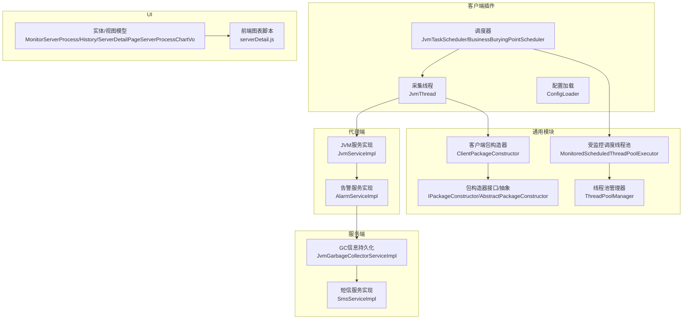
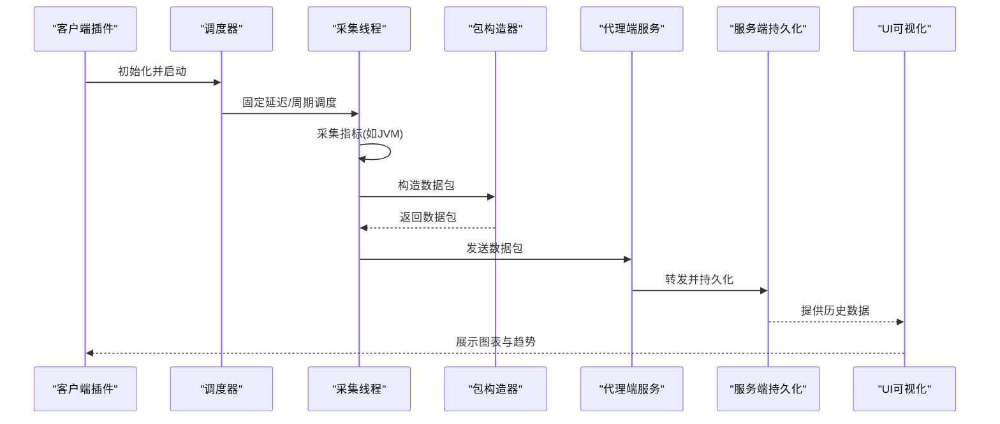
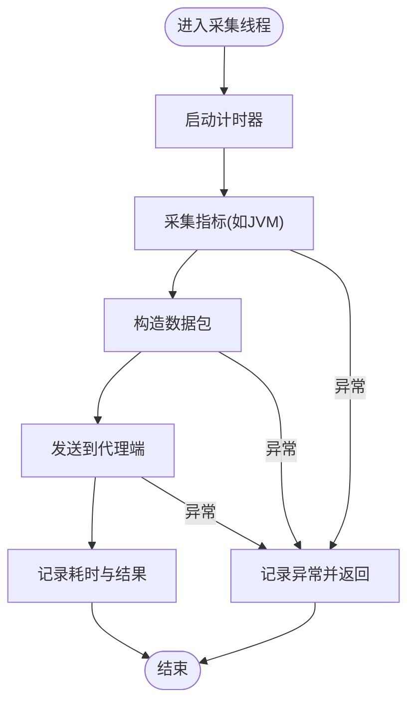
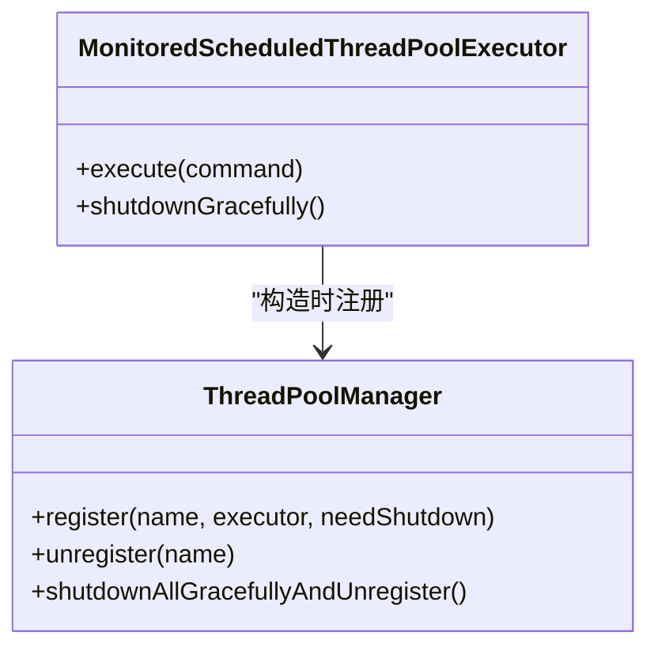
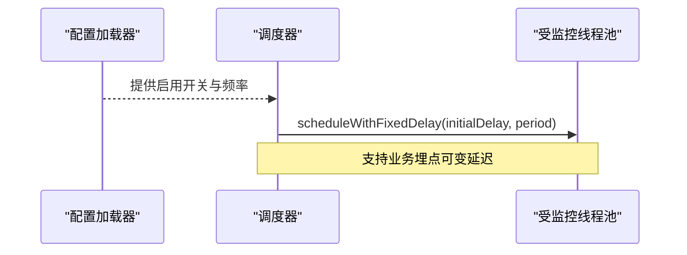
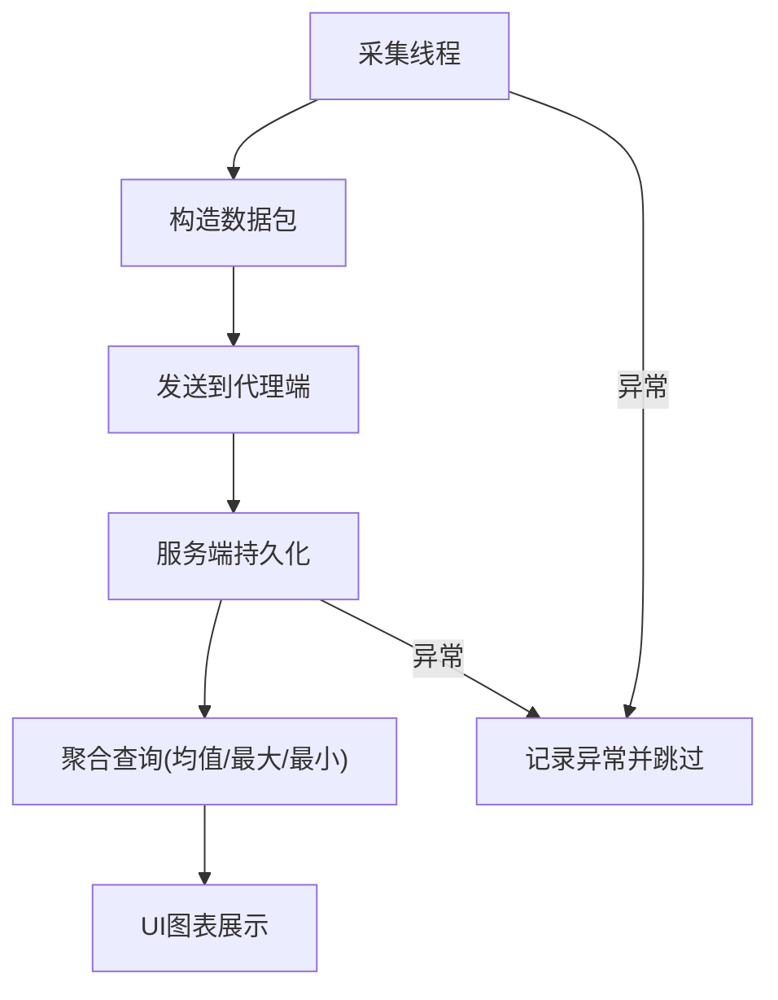
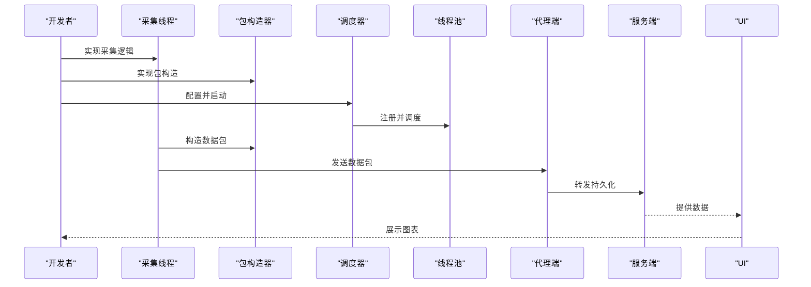
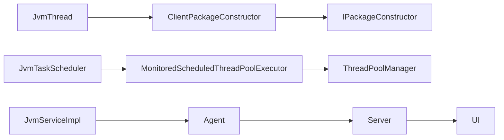

# 数据采集实现

<cite>
**本文引用的文件**
- [phoenix-client-core/JvmTaskScheduler.java](file://phoenix-client/phoenix-client-core/src/main/java/com/gitee/pifeng/monitoring/plug/scheduler/JvmTaskScheduler.java)
- [phoenix-client-core/JvmThread.java](file://phoenix-client/phoenix-client-core/src/main/java/com/gitee/pifeng/monitoring/plug/thread/JvmThread.java)
- [phoenix-client-core/BusinessBuryingPointScheduler.java](file://phoenix-client/phoenix-client-core/src/main/java/com/gitee/pifeng/monitoring/plug/scheduler/BusinessBuryingPointScheduler.java)
- [phoenix-client-core/Monitor.java](file://phoenix-client/phoenix-client-core/src/main/java/com/gitee/pifeng/monitoring/plug/Monitor.java)
- [phoenix-client-core/ConfigLoader.java](file://phoenix-client/phoenix-client-core/src/main/java/com/gitee/pifeng/monitoring/plug/core/ConfigLoader.java)
- [phoenix-common-core/IPackageConstructor.java](file://phoenix-common/phoenix-common-core/src/main/java/com/gitee/pifeng/monitoring/common/inf/IPackageConstructor.java)
- [phoenix-common-core/AbstractPackageConstructor.java](file://phoenix-common/phoenix-common-core/src/main/java/com/gitee/pifeng/monitoring/common/abs/AbstractPackageConstructor.java)
- [phoenix-common-core/ClientPackageConstructor.java](file://phoenix-client/phoenix-client-core/src/main/java/com/gitee/pifeng/monitoring/plug/core/ClientPackageConstructor.java)
- [phoenix-common-core/MonitoredScheduledThreadPoolExecutor.java](file://phoenix-common/phoenix-common-core/src/main/java/com/gitee/pifeng/monitoring/common/threadpool/MonitoredScheduledThreadPoolExecutor.java)
- [phoenix-common-core/ThreadPoolManager.java](file://phoenix-common/phoenix-common-core/src/main/java/com/gitee/pifeng/monitoring/common/threadpool/ThreadPoolManager.java)
- [phoenix-common-core/MonitoringUniversalException.java](file://phoenix-common/phoenix-common-core/src/main/java/com/gitee/pifeng/monitoring/common/exception/MonitoringUniversalException.java)
- [phoenix-common-core/Server.java](file://phoenix-common/phoenix-common-core/src/main/java/com/gitee/pifeng/monitoring/common/domain/Server.java)
- [phoenix-common-core/Jvm.java](file://phoenix-common/phoenix-common-core/src/main/java/com/gitee/pifeng/monitoring/common/domain/Jvm.java)
- [phoenix-agent/JvmServiceImpl.java](file://phoenix-agent/src/main/java/com/gitee/pifeng/monitoring/agent/business/client/service/impl/JvmServiceImpl.java)
- [phoenix-agent/AlarmServiceImpl.java](file://phoenix-agent/src/main/java/com/gitee/pifeng/monitoring/agent/business/client/service/impl/AlarmServiceImpl.java)
- [phoenix-server/JvmGarbageCollectorServiceImpl.java](file://phoenix-server/src/main/java/com/gitee/pifeng/monitoring/server/business/server/service/impl/JvmGarbageCollectorServiceImpl.java)
- [phoenix-server/SmsServiceImpl.java](file://phoenix-server/src/main/java/com/gitee/pifeng/monitoring/server/business/server/service/impl/SmsServiceImpl.java)
- [phoenix-ui/MonitorServerProcess.java](file://phoenix-ui/src/main/java/com/gitee/pifeng/monitoring/ui/business/web/entity/MonitorServerProcess.java)
- [phoenix-ui/MonitorServerProcessHistory.java](file://phoenix-ui/src/main/java/com/gitee/pifeng/monitoring/ui/business/web/entity/MonitorServerProcessHistory.java)
- [phoenix-ui/ServerDetailPageServerProcessChartVo.java](file://phoenix-ui/src/main/java/com/gitee/pifeng/monitoring/ui/business/web/vo/ServerDetailPageServerProcessChartVo.java)
- [phoenix-ui/serverDetail.js](file://phoenix-ui/src/main/resources/static/modules/server/serverDetail.js)
</cite>

## 目录
1. [简介](#简介)
2. [项目结构](#项目结构)
3. [核心组件](#核心组件)
4. [架构总览](#架构总览)
5. [详细组件分析](#详细组件分析)
6. [依赖分析](#依赖分析)
7. [性能考量](#性能考量)
8. [故障排查指南](#故障排查指南)
9. [结论](#结论)
10. [附录](#附录)

## 简介
本指南面向Phoenix监控系统中“自定义监控指标数据采集”的实现，围绕定时采集器的开发方法、采集器注册与生命周期管理、采集频率配置、并发控制、数据预处理策略以及从设计到部署运行的完整流程展开。文档结合现有代码结构，给出可操作的实现步骤与最佳实践，帮助开发者快速上手并稳定落地。

## 项目结构
Phoenix监控系统采用多模块分层架构：
- 客户端插件模块（phoenix-client-core）：负责采集与发送心跳、JVM、服务器等指标，提供调度器与线程池封装。
- 通用模块（phoenix-common-core）：提供包构造器抽象、线程池监控、异常体系、领域模型等基础能力。
- 代理端（phoenix-agent）：接收客户端/服务端数据，转发至服务端，并提供告警处理等服务。
- 服务端（phoenix-server）：接收并存储监控数据，提供业务处理与告警通知（如短信）。
- UI（phoenix-ui）：可视化展示监控数据，提供图表与报表。

**图示来源**
- [phoenix-client-core/JvmTaskScheduler.java:1-50](file://phoenix-client/phoenix-client-core/src/main/java/com/gitee/pifeng/monitoring/plug/scheduler/JvmTaskScheduler.java#L1-L50)
- [phoenix-client-core/JvmThread.java:1-76](file://phoenix-client/phoenix-client-core/src/main/java/com/gitee/pifeng/monitoring/plug/thread/JvmThread.java#L1-L76)
- [phoenix-client-core/BusinessBuryingPointScheduler.java:1-44](file://phoenix-client/phoenix-client-core/src/main/java/com/gitee/pifeng/monitoring/plug/scheduler/BusinessBuryingPointScheduler.java#L1-L44)
- [phoenix-client-core/ConfigLoader.java:1-637](file://phoenix-client/phoenix-client-core/src/main/java/com/gitee/pifeng/monitoring/plug/core/ConfigLoader.java#L1-L637)
- [phoenix-common-core/IPackageConstructor.java:1-42](file://phoenix-common/phoenix-common-core/src/main/java/com/gitee/pifeng/monitoring/common/inf/IPackageConstructor.java#L1-L42)
- [phoenix-common-core/AbstractPackageConstructor.java:1-46](file://phoenix-common/phoenix-common-core/src/main/java/com/gitee/pifeng/monitoring/common/abs/AbstractPackageConstructor.java#L1-L46)
- [phoenix-common-core/ClientPackageConstructor.java:24-135](file://phoenix-client/phoenix-client-core/src/main/java/com/gitee/pifeng/monitoring/plug/core/ClientPackageConstructor.java#L24-L135)
- [phoenix-common-core/MonitoredScheduledThreadPoolExecutor.java:1-97](file://phoenix-common/phoenix-common-core/src/main/java/com/gitee/pifeng/monitoring/common/threadpool/MonitoredScheduledThreadPoolExecutor.java#L1-L97)
- [phoenix-common-core/ThreadPoolManager.java:1-131](file://phoenix-common/phoenix-common-core/src/main/java/com/gitee/pifeng/monitoring/common/threadpool/ThreadPoolManager.java#L1-L131)
- [phoenix-agent/JvmServiceImpl.java:1-35](file://phoenix-agent/src/main/java/com/gitee/pifeng/monitoring/agent/business/client/service/impl/JvmServiceImpl.java#L1-L35)
- [phoenix-agent/AlarmServiceImpl.java:1-39](file://phoenix-agent/src/main/java/com/gitee/pifeng/monitoring/agent/business/client/service/impl/AlarmServiceImpl.java#L1-L39)
- [phoenix-server/JvmGarbageCollectorServiceImpl.java:58-76](file://phoenix-server/src/main/java/com/gitee/pifeng/monitoring/server/business/server/service/impl/JvmGarbageCollectorServiceImpl.java#L58-L76)
- [phoenix-server/SmsServiceImpl.java:1-71](file://phoenix-server/src/main/java/com/gitee/pifeng/monitoring/server/business/server/service/impl/SmsServiceImpl.java#L1-L71)
- [phoenix-ui/MonitorServerProcess.java:1-48](file://phoenix-ui/src/main/java/com/gitee/pifeng/monitoring/ui/business/web/entity/MonitorServerProcess.java#L1-L48)
- [phoenix-ui/MonitorServerProcessHistory.java:1-57](file://phoenix-ui/src/main/java/com/gitee/pifeng/monitoring/ui/business/web/entity/MonitorServerProcessHistory.java#L1-L57)
- [phoenix-ui/ServerDetailPageServerProcessChartVo.java:1-37](file://phoenix-ui/src/main/java/com/gitee/pifeng/monitoring/ui/business/web/vo/ServerDetailPageServerProcessChartVo.java#L1-L37)
- [phoenix-ui/serverDetail.js:1374-2238](file://phoenix-ui/src/main/resources/static/modules/server/serverDetail.js#L1374-L2238)

**章节来源**
- [phoenix-client-core/JvmTaskScheduler.java:1-50](file://phoenix-client/phoenix-client-core/src/main/java/com/gitee/pifeng/monitoring/plug/scheduler/JvmTaskScheduler.java#L1-L50)
- [phoenix-client-core/JvmThread.java:1-76](file://phoenix-client/phoenix-client-core/src/main/java/com/gitee/pifeng/monitoring/plug/thread/JvmThread.java#L1-L76)
- [phoenix-client-core/BusinessBuryingPointScheduler.java:1-44](file://phoenix-client/phoenix-client-core/src/main/java/com/gitee/pifeng/monitoring/plug/scheduler/BusinessBuryingPointScheduler.java#L1-L44)
- [phoenix-client-core/ConfigLoader.java:1-637](file://phoenix-client/phoenix-client-core/src/main/java/com/gitee/pifeng/monitoring/plug/core/ConfigLoader.java#L1-L637)
- [phoenix-common-core/IPackageConstructor.java:1-42](file://phoenix-common/phoenix-common-core/src/main/java/com/gitee/pifeng/monitoring/common/inf/IPackageConstructor.java#L1-L42)
- [phoenix-common-core/AbstractPackageConstructor.java:1-46](file://phoenix-common/phoenix-common-core/src/main/java/com/gitee/pifeng/monitoring/common/abs/AbstractPackageConstructor.java#L1-L46)
- [phoenix-common-core/ClientPackageConstructor.java:24-135](file://phoenix-client/phoenix-client-core/src/main/java/com/gitee/pifeng/monitoring/plug/core/ClientPackageConstructor.java#L24-L135)
- [phoenix-common-core/MonitoredScheduledThreadPoolExecutor.java:1-97](file://phoenix-common/phoenix-common-core/src/main/java/com/gitee/pifeng/monitoring/common/threadpool/MonitoredScheduledThreadPoolExecutor.java#L1-L97)
- [phoenix-common-core/ThreadPoolManager.java:1-131](file://phoenix-common/phoenix-common-core/src/main/java/com/gitee/pifeng/monitoring/common/threadpool/ThreadPoolManager.java#L1-L131)
- [phoenix-agent/JvmServiceImpl.java:1-35](file://phoenix-agent/src/main/java/com/gitee/pifeng/monitoring/agent/business/client/service/impl/JvmServiceImpl.java#L1-L35)
- [phoenix-agent/AlarmServiceImpl.java:1-39](file://phoenix-agent/src/main/java/com/gitee/pifeng/monitoring/agent/business/client/service/impl/AlarmServiceImpl.java#L1-L39)
- [phoenix-server/JvmGarbageCollectorServiceImpl.java:58-76](file://phoenix-server/src/main/java/com/gitee/pifeng/monitoring/server/business/server/service/impl/JvmGarbageCollectorServiceImpl.java#L58-L76)
- [phoenix-server/SmsServiceImpl.java:1-71](file://phoenix-server/src/main/java/com/gitee/pifeng/monitoring/server/business/server/service/impl/SmsServiceImpl.java#L1-L71)
- [phoenix-ui/MonitorServerProcess.java:1-48](file://phoenix-ui/src/main/java/com/gitee/pifeng/monitoring/ui/business/web/entity/MonitorServerProcess.java#L1-L48)
- [phoenix-ui/MonitorServerProcessHistory.java:1-57](file://phoenix-ui/src/main/java/com/gitee/pifeng/monitoring/ui/business/web/entity/MonitorServerProcessHistory.java#L1-L57)
- [phoenix-ui/ServerDetailPageServerProcessChartVo.java:1-37](file://phoenix-ui/src/main/java/com/gitee/pifeng/monitoring/ui/business/web/vo/ServerDetailPageServerProcessChartVo.java#L1-L37)
- [phoenix-ui/serverDetail.js:1374-2238](file://phoenix-ui/src/main/resources/static/modules/server/serverDetail.js#L1374-L2238)

## 核心组件
- 定时调度器：提供固定延迟与周期调度能力，支持业务埋点与JVM采集两类任务。
- 采集线程：封装具体采集逻辑（如JVM信息采集），统一异常处理与耗时统计。
- 配置加载器：集中解析与校验监控配置，提供采集频率、启用开关等参数。
- 包构造器：抽象出不同端点的数据包构造策略，确保数据格式一致性。
- 线程池与管理器：提供受监控的调度线程池与优雅关闭能力，避免资源泄漏。
- 代理端服务：接收并转发采集数据，承担告警处理与转发职责。
- 服务端持久化：将采集数据落库，支持聚合查询与历史趋势分析。
- UI可视化：提供图表与报表，支撑运维与监控分析。

**章节来源**
- [phoenix-client-core/JvmTaskScheduler.java:17-48](file://phoenix-client/phoenix-client-core/src/main/java/com/gitee/pifeng/monitoring/plug/scheduler/JvmTaskScheduler.java#L17-L48)
- [phoenix-client-core/JvmThread.java:25-73](file://phoenix-client/phoenix-client-core/src/main/java/com/gitee/pifeng/monitoring/plug/thread/JvmThread.java#L25-L73)
- [phoenix-client-core/ConfigLoader.java:57-154](file://phoenix-client/phoenix-client-core/src/main/java/com/gitee/pifeng/monitoring/plug/core/ConfigLoader.java#L57-L154)
- [phoenix-common-core/IPackageConstructor.java:22-42](file://phoenix-common/phoenix-common-core/src/main/java/com/gitee/pifeng/monitoring/common/inf/IPackageConstructor.java#L22-L42)
- [phoenix-common-core/AbstractPackageConstructor.java:20-46](file://phoenix-common/phoenix-common-core/src/main/java/com/gitee/pifeng/monitoring/common/abs/AbstractPackageConstructor.java#L20-L46)
- [phoenix-common-core/MonitoredScheduledThreadPoolExecutor.java:18-97](file://phoenix-common/phoenix-common-core/src/main/java/com/gitee/pifeng/monitoring/common/threadpool/MonitoredScheduledThreadPoolExecutor.java#L18-L97)
- [phoenix-common-core/ThreadPoolManager.java:22-131](file://phoenix-common/phoenix-common-core/src/main/java/com/gitee/pifeng/monitoring/common/threadpool/ThreadPoolManager.java#L22-L131)
- [phoenix-agent/JvmServiceImpl.java:17-35](file://phoenix-agent/src/main/java/com/gitee/pifeng/monitoring/agent/business/client/service/impl/JvmServiceImpl.java#L17-L35)
- [phoenix-server/JvmGarbageCollectorServiceImpl.java:58-76](file://phoenix-server/src/main/java/com/gitee/pifeng/monitoring/server/business/server/service/impl/JvmGarbageCollectorServiceImpl.java#L58-L76)

## 架构总览
下图展示了从采集到存储与可视化的整体流程，强调采集器的注册、调度、数据包构造与转发路径。

**图示来源**
- [phoenix-client-core/JvmTaskScheduler.java:40-48](file://phoenix-client/phoenix-client-core/src/main/java/com/gitee/pifeng/monitoring/plug/scheduler/JvmTaskScheduler.java#L40-L48)
- [phoenix-client-core/JvmThread.java:40-73](file://phoenix-client/phoenix-client-core/src/main/java/com/gitee/pifeng/monitoring/plug/thread/JvmThread.java#L40-L73)
- [phoenix-common-core/ClientPackageConstructor.java:122-135](file://phoenix-client/phoenix-client-core/src/main/java/com/gitee/pifeng/monitoring/plug/core/ClientPackageConstructor.java#L122-L135)
- [phoenix-agent/JvmServiceImpl.java:30-35](file://phoenix-agent/src/main/java/com/gitee/pifeng/monitoring/agent/business/client/service/impl/JvmServiceImpl.java#L30-L35)
- [phoenix-server/JvmGarbageCollectorServiceImpl.java:58-76](file://phoenix-server/src/main/java/com/gitee/pifeng/monitoring/server/business/server/service/impl/JvmGarbageCollectorServiceImpl.java#L58-L76)
- [phoenix-ui/serverDetail.js:1374-2238](file://phoenix-ui/src/main/resources/static/modules/server/serverDetail.js#L1374-L2238)

## 详细组件分析

### 定时采集器开发方法
- 继承与扩展：基于现有调度器（如JVM调度器）与业务埋点调度器，了解其初始化、延迟与周期参数、线程类型枚举等。
- 实现采集逻辑：在采集线程中封装采集方法（如JVM信息），并在finally中记录耗时，便于性能监控。
- 异常处理：捕获IO、网络与通用异常，避免任务中断；同时在包构造器与发送器处统一异常处理。
- 状态管理：通过配置加载器读取启用开关与频率参数，按需启动或停止采集任务。

**图示来源**
- [phoenix-client-core/JvmThread.java:40-73](file://phoenix-client/phoenix-client-core/src/main/java/com/gitee/pifeng/monitoring/plug/thread/JvmThread.java#L40-L73)

**章节来源**
- [phoenix-client-core/JvmTaskScheduler.java:17-48](file://phoenix-client/phoenix-client-core/src/main/java/com/gitee/pifeng/monitoring/plug/scheduler/JvmTaskScheduler.java#L17-L48)
- [phoenix-client-core/JvmThread.java:25-73](file://phoenix-client/phoenix-client-core/src/main/java/com/gitee/pifeng/monitoring/plug/thread/JvmThread.java#L25-L73)
- [phoenix-client-core/BusinessBuryingPointScheduler.java:17-44](file://phoenix-client/phoenix-client-core/src/main/java/com/gitee/pifeng/monitoring/plug/scheduler/BusinessBuryingPointScheduler.java#L17-L44)
- [phoenix-client-core/ConfigLoader.java:57-154](file://phoenix-client/phoenix-client-core/src/main/java/com/gitee/pifeng/monitoring/plug/core/ConfigLoader.java#L57-L154)

### 采集器注册机制与生命周期
- 注册：受监控调度线程池在构造时即向线程池管理器注册，支持命名与是否需要关闭的标记。
- 生命周期：通过管理器提供优雅关闭能力，确保任务在关闭前完成或中断，避免资源泄露。
- 动态注册与注销：管理器提供注册与取消注册方法，保证线程池唯一性与可回收性。

**图示来源**
- [phoenix-common-core/MonitoredScheduledThreadPoolExecutor.java:18-97](file://phoenix-common/phoenix-common-core/src/main/java/com/gitee/pifeng/monitoring/common/threadpool/MonitoredScheduledThreadPoolExecutor.java#L18-L97)
- [phoenix-common-core/ThreadPoolManager.java:22-131](file://phoenix-common/phoenix-common-core/src/main/java/com/gitee/pifeng/monitoring/common/threadpool/ThreadPoolManager.java#L22-L131)

**章节来源**
- [phoenix-common-core/MonitoredScheduledThreadPoolExecutor.java:18-97](file://phoenix-common/phoenix-common-core/src/main/java/com/gitee/pifeng/monitoring/common/threadpool/MonitoredScheduledThreadPoolExecutor.java#L18-L97)
- [phoenix-common-core/ThreadPoolManager.java:22-131](file://phoenix-common/phoenix-common-core/src/main/java/com/gitee/pifeng/monitoring/common/threadpool/ThreadPoolManager.java#L22-L131)

### 采集频率配置与并发控制
- 固定延迟调度：JVM调度器使用固定延迟与周期调度，首次延迟与周期由配置决定。
- 可变延迟调度：业务埋点调度器支持传入初始延迟与周期，适配不同场景。
- 并发控制：通过线程池管理器与受监控线程池，统一线程数量与拒绝策略，避免过载。

**图示来源**
- [phoenix-client-core/JvmTaskScheduler.java:40-48](file://phoenix-client/phoenix-client-core/src/main/java/com/gitee/pifeng/monitoring/plug/scheduler/JvmTaskScheduler.java#L40-L48)
- [phoenix-client-core/BusinessBuryingPointScheduler.java:44](file://phoenix-client/phoenix-client-core/src/main/java/com/gitee/pifeng/monitoring/plug/scheduler/BusinessBuryingPointScheduler.java#L44)
- [phoenix-client-core/ConfigLoader.java:57-154](file://phoenix-client/phoenix-client-core/src/main/java/com/gitee/pifeng/monitoring/plug/core/ConfigLoader.java#L57-L154)

**章节来源**
- [phoenix-client-core/JvmTaskScheduler.java:40-48](file://phoenix-client/phoenix-client-core/src/main/java/com/gitee/pifeng/monitoring/plug/scheduler/JvmTaskScheduler.java#L40-L48)
- [phoenix-client-core/BusinessBuryingPointScheduler.java:17-44](file://phoenix-client/phoenix-client-core/src/main/java/com/gitee/pifeng/monitoring/plug/scheduler/BusinessBuryingPointScheduler.java#L17-L44)
- [phoenix-client-core/ConfigLoader.java:57-154](file://phoenix-client/phoenix-client-core/src/main/java/com/gitee/pifeng/monitoring/plug/core/ConfigLoader.java#L57-L154)

### 数据预处理方案
- 数据清洗：在采集线程中对异常耗时进行告警输出，避免异常扩散影响任务队列。
- 数据转换：通过包构造器将领域对象转换为统一的数据包格式，确保跨端一致性。
- 数据聚合：服务端持久化时可按实例、时间维度进行聚合查询，UI侧提供均值、最大/最小等统计。
- 异常数据过滤：在采集线程与服务端持久化层均进行异常捕获与日志记录，避免脏数据入库。

**图示来源**
- [phoenix-client-core/JvmThread.java:54-73](file://phoenix-client/phoenix-client-core/src/main/java/com/gitee/pifeng/monitoring/plug/thread/JvmThread.java#L54-L73)
- [phoenix-common-core/ClientPackageConstructor.java:122-135](file://phoenix-client/phoenix-client-core/src/main/java/com/gitee/pifeng/monitoring/plug/core/ClientPackageConstructor.java#L122-L135)
- [phoenix-server/JvmGarbageCollectorServiceImpl.java:58-76](file://phoenix-server/src/main/java/com/gitee/pifeng/monitoring/server/business/server/service/impl/JvmGarbageCollectorServiceImpl.java#L58-L76)
- [phoenix-ui/serverDetail.js:1374-2238](file://phoenix-ui/src/main/resources/static/modules/server/serverDetail.js#L1374-L2238)

**章节来源**
- [phoenix-client-core/JvmThread.java:54-73](file://phoenix-client/phoenix-client-core/src/main/java/com/gitee/pifeng/monitoring/plug/thread/JvmThread.java#L54-L73)
- [phoenix-common-core/ClientPackageConstructor.java:122-135](file://phoenix-client/phoenix-client-core/src/main/java/com/gitee/pifeng/monitoring/plug/core/ClientPackageConstructor.java#L122-L135)
- [phoenix-server/JvmGarbageCollectorServiceImpl.java:58-76](file://phoenix-server/src/main/java/com/gitee/pifeng/monitoring/server/business/server/service/impl/JvmGarbageCollectorServiceImpl.java#L58-L76)
- [phoenix-ui/serverDetail.js:1374-2238](file://phoenix-ui/src/main/resources/static/modules/server/serverDetail.js#L1374-L2238)

### 采集器开发示例（从设计到部署）
- 设计阶段
  - 明确采集指标（如服务器进程数、内存使用率等），定义领域模型与数据包结构。
  - 选择合适的调度器（固定/可变延迟），确定线程类型（CPU密集/IO密集）。
- 开发阶段
  - 实现采集线程：封装采集逻辑、异常处理与耗时统计。
  - 实现包构造器：将领域对象转换为统一数据包。
  - 配置采集频率与启用开关：通过配置加载器读取参数。
- 集成阶段
  - 注册调度任务：使用调度器启动采集任务。
  - 注册线程池：受监控线程池自动注册，便于统一管理。
- 部署与运行
  - 启动客户端插件，观察采集日志与耗时。
  - 在UI侧查看图表与历史趋势，确认数据正常入库与展示。

**图示来源**
- [phoenix-client-core/JvmThread.java:25-73](file://phoenix-client/phoenix-client-core/src/main/java/com/gitee/pifeng/monitoring/plug/thread/JvmThread.java#L25-L73)
- [phoenix-common-core/ClientPackageConstructor.java:122-135](file://phoenix-client/phoenix-client-core/src/main/java/com/gitee/pifeng/monitoring/plug/core/ClientPackageConstructor.java#L122-L135)
- [phoenix-client-core/JvmTaskScheduler.java:40-48](file://phoenix-client/phoenix-client-core/src/main/java/com/gitee/pifeng/monitoring/plug/scheduler/JvmTaskScheduler.java#L40-L48)
- [phoenix-common-core/MonitoredScheduledThreadPoolExecutor.java:18-97](file://phoenix-common/phoenix-common-core/src/main/java/com/gitee/pifeng/monitoring/common/threadpool/MonitoredScheduledThreadPoolExecutor.java#L18-L97)
- [phoenix-agent/JvmServiceImpl.java:30-35](file://phoenix-agent/src/main/java/com/gitee/pifeng/monitoring/agent/business/client/service/impl/JvmServiceImpl.java#L30-L35)
- [phoenix-server/JvmGarbageCollectorServiceImpl.java:58-76](file://phoenix-server/src/main/java/com/gitee/pifeng/monitoring/server/business/server/service/impl/JvmGarbageCollectorServiceImpl.java#L58-L76)
- [phoenix-ui/serverDetail.js:1374-2238](file://phoenix-ui/src/main/resources/static/modules/server/serverDetail.js#L1374-L2238)

**章节来源**
- [phoenix-client-core/JvmThread.java:25-73](file://phoenix-client/phoenix-client-core/src/main/java/com/gitee/pifeng/monitoring/plug/thread/JvmThread.java#L25-L73)
- [phoenix-common-core/ClientPackageConstructor.java:122-135](file://phoenix-client/phoenix-client-core/src/main/java/com/gitee/pifeng/monitoring/plug/core/ClientPackageConstructor.java#L122-L135)
- [phoenix-client-core/JvmTaskScheduler.java:40-48](file://phoenix-client/phoenix-client-core/src/main/java/com/gitee/pifeng/monitoring/plug/scheduler/JvmTaskScheduler.java#L40-L48)
- [phoenix-common-core/MonitoredScheduledThreadPoolExecutor.java:18-97](file://phoenix-common/phoenix-common-core/src/main/java/com/gitee/pifeng/monitoring/common/threadpool/MonitoredScheduledThreadPoolExecutor.java#L18-L97)
- [phoenix-agent/JvmServiceImpl.java:30-35](file://phoenix-agent/src/main/java/com/gitee/pifeng/monitoring/agent/business/client/service/impl/JvmServiceImpl.java#L30-L35)
- [phoenix-server/JvmGarbageCollectorServiceImpl.java:58-76](file://phoenix-server/src/main/java/com/gitee/pifeng/monitoring/server/business/server/service/impl/JvmGarbageCollectorServiceImpl.java#L58-L76)
- [phoenix-ui/serverDetail.js:1374-2238](file://phoenix-ui/src/main/resources/static/modules/server/serverDetail.js#L1374-L2238)

## 依赖分析
- 组件耦合
  - 采集线程依赖包构造器与配置加载器，确保采集与发送流程可控。
  - 调度器依赖线程池管理器，实现统一注册与关闭。
  - 代理端服务依赖方法执行处理器，负责转发到服务端。
- 外部依赖
  - UI侧通过前端脚本对后端数据进行聚合与展示，形成闭环。

**图示来源**
- [phoenix-client-core/JvmThread.java:25-73](file://phoenix-client/phoenix-client-core/src/main/java/com/gitee/pifeng/monitoring/plug/thread/JvmThread.java#L25-L73)
- [phoenix-common-core/ClientPackageConstructor.java:122-135](file://phoenix-client/phoenix-client-core/src/main/java/com/gitee/pifeng/monitoring/plug/core/ClientPackageConstructor.java#L122-L135)
- [phoenix-common-core/IPackageConstructor.java:22-42](file://phoenix-common/phoenix-common-core/src/main/java/com/gitee/pifeng/monitoring/common/inf/IPackageConstructor.java#L22-L42)
- [phoenix-client-core/JvmTaskScheduler.java:40-48](file://phoenix-client/phoenix-client-core/src/main/java/com/gitee/pifeng/monitoring/plug/scheduler/JvmTaskScheduler.java#L40-L48)
- [phoenix-common-core/MonitoredScheduledThreadPoolExecutor.java:18-97](file://phoenix-common/phoenix-common-core/src/main/java/com/gitee/pifeng/monitoring/common/threadpool/MonitoredScheduledThreadPoolExecutor.java#L18-L97)
- [phoenix-common-core/ThreadPoolManager.java:22-131](file://phoenix-common/phoenix-common-core/src/main/java/com/gitee/pifeng/monitoring/common/threadpool/ThreadPoolManager.java#L22-L131)
- [phoenix-agent/JvmServiceImpl.java:30-35](file://phoenix-agent/src/main/java/com/gitee/pifeng/monitoring/agent/business/client/service/impl/JvmServiceImpl.java#L30-L35)

**章节来源**
- [phoenix-client-core/JvmThread.java:25-73](file://phoenix-client/phoenix-client-core/src/main/java/com/gitee/pifeng/monitoring/plug/thread/JvmThread.java#L25-L73)
- [phoenix-common-core/ClientPackageConstructor.java:122-135](file://phoenix-client/phoenix-client-core/src/main/java/com/gitee/pifeng/monitoring/plug/core/ClientPackageConstructor.java#L122-L135)
- [phoenix-common-core/IPackageConstructor.java:22-42](file://phoenix-common/phoenix-common-core/src/main/java/com/gitee/pifeng/monitoring/common/inf/IPackageConstructor.java#L22-L42)
- [phoenix-client-core/JvmTaskScheduler.java:40-48](file://phoenix-client/phoenix-client-core/src/main/java/com/gitee/pifeng/monitoring/plug/scheduler/JvmTaskScheduler.java#L40-L48)
- [phoenix-common-core/MonitoredScheduledThreadPoolExecutor.java:18-97](file://phoenix-common/phoenix-common-core/src/main/java/com/gitee/pifeng/monitoring/common/threadpool/MonitoredScheduledThreadPoolExecutor.java#L18-L97)
- [phoenix-common-core/ThreadPoolManager.java:22-131](file://phoenix-common/phoenix-common-core/src/main/java/com/gitee/pifeng/monitoring/common/threadpool/ThreadPoolManager.java#L22-L131)
- [phoenix-agent/JvmServiceImpl.java:30-35](file://phoenix-agent/src/main/java/com/gitee/pifeng/monitoring/agent/business/client/service/impl/JvmServiceImpl.java#L30-L35)

## 性能考量
- 采集频率与阈值：根据采集耗时与系统负载调整频率，避免超过临界值导致延迟放大。
- 线程池容量：合理设置核心线程数与拒绝策略，防止高并发下的任务堆积。
- 异常与降级：在采集线程中对异常进行快速失败与记录，必要时降级采集频率或关闭部分采集项。
- 可观测性：利用采集线程中的耗时统计与日志级别区分，辅助定位性能瓶颈。

[本节为通用指导，无需特定文件来源]

## 故障排查指南
- 采集异常
  - IO异常：检查网络连通性与目标URL配置。
  - 网络异常：检查包构造器与发送器的异常处理逻辑。
  - 通用异常：参考通用异常类，定位异常来源与堆栈。
- 线程池问题
  - 拒绝任务：检查线程池注册与容量配置，必要时增加核心线程数。
  - 关闭异常：使用管理器提供的优雅关闭方法，确保任务有序退出。
- 数据入库问题
  - 服务端持久化：检查实体映射与查询条件，确保数据正确入库。
  - UI展示异常：检查前端脚本的聚合逻辑与数据格式。

**章节来源**
- [phoenix-client-core/JvmThread.java:54-73](file://phoenix-client/phoenix-client-core/src/main/java/com/gitee/pifeng/monitoring/plug/thread/JvmThread.java#L54-L73)
- [phoenix-common-core/MonitoredScheduledThreadPoolExecutor.java:93-97](file://phoenix-common/phoenix-common-core/src/main/java/com/gitee/pifeng/monitoring/common/threadpool/MonitoredScheduledThreadPoolExecutor.java#L93-L97)
- [phoenix-common-core/ThreadPoolManager.java:80-128](file://phoenix-common/phoenix-common-core/src/main/java/com/gitee/pifeng/monitoring/common/threadpool/ThreadPoolManager.java#L80-L128)
- [phoenix-server/JvmGarbageCollectorServiceImpl.java:58-76](file://phoenix-server/src/main/java/com/gitee/pifeng/monitoring/server/business/server/service/impl/JvmGarbageCollectorServiceImpl.java#L58-L76)
- [phoenix-ui/serverDetail.js:1374-2238](file://phoenix-ui/src/main/resources/static/modules/server/serverDetail.js#L1374-L2238)

## 结论
Phoenix监控系统的数据采集实现以“可配置、可扩展、可观测”为核心，通过调度器、采集线程、包构造器与线程池管理器的协同，形成稳定的采集链路。结合本文提供的开发方法、注册机制、频率配置与预处理策略，开发者可以快速实现自定义监控指标采集，并在生产环境中保持高可用与高性能。

[本节为总结性内容，无需特定文件来源]

## 附录
- 领域模型参考
  - 服务器信息模型：包含操作系统、内存、CPU、GPU、系统负载、网卡、磁盘、电源、传感器、进程等子域。
  - JVM信息模型：包含类加载、GC、内存、运行时、线程等子域。

**章节来源**
- [phoenix-common-core/Server.java:16-76](file://phoenix-common/phoenix-common-core/src/main/java/com/gitee/pifeng/monitoring/common/domain/Server.java#L16-L76)
- [phoenix-common-core/Jvm.java:16-51](file://phoenix-common/phoenix-common-core/src/main/java/com/gitee/pifeng/monitoring/common/domain/Jvm.java#L16-L51)