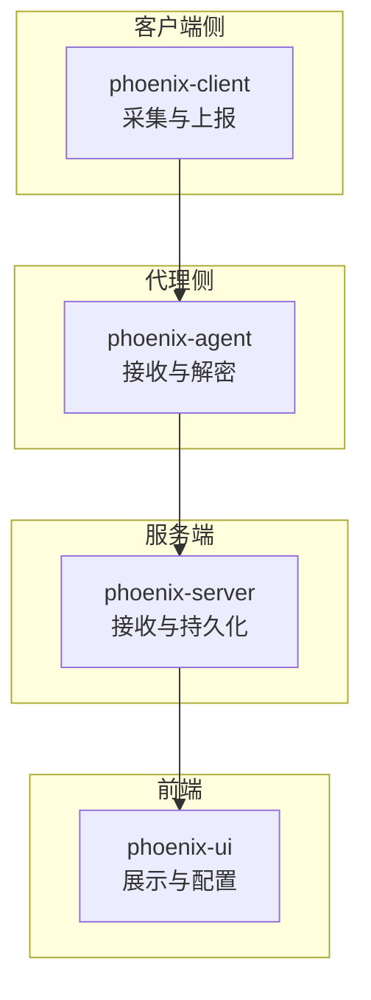
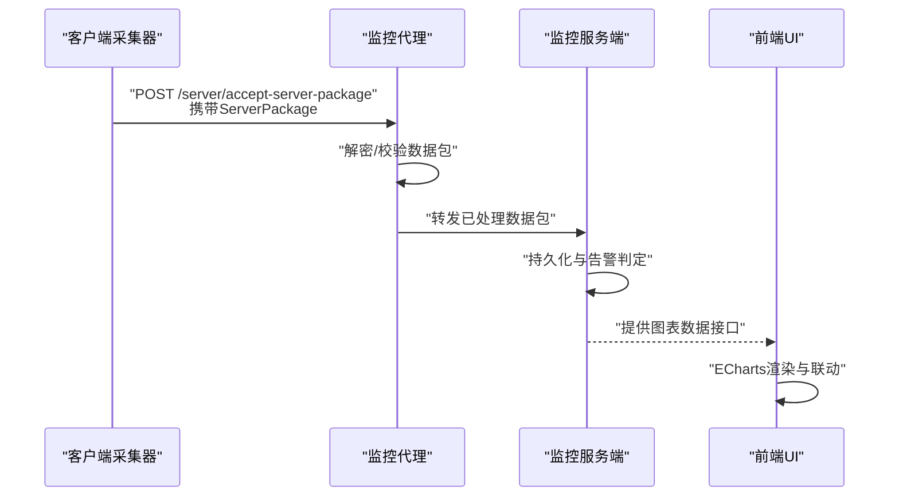
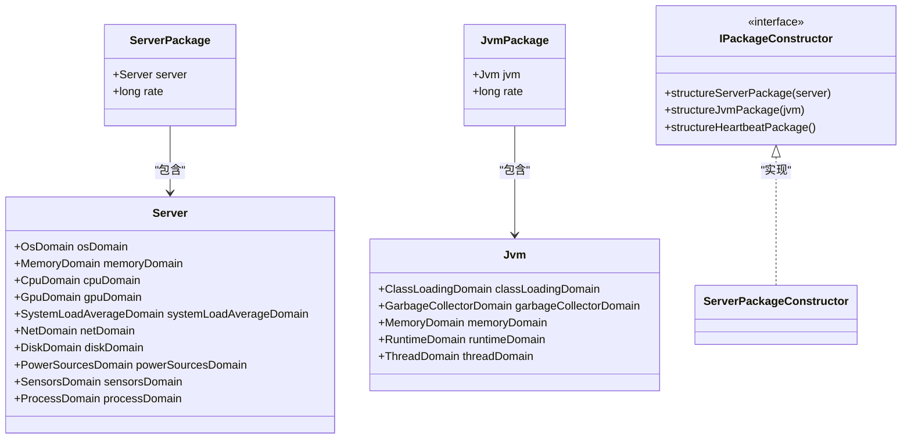
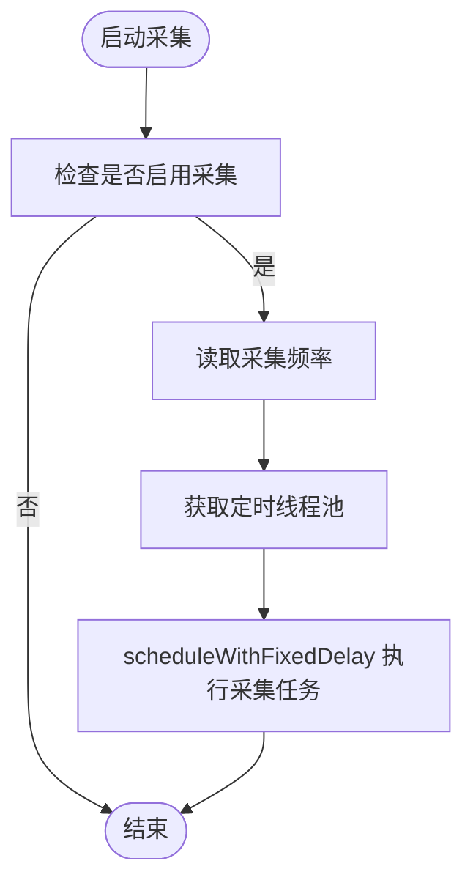
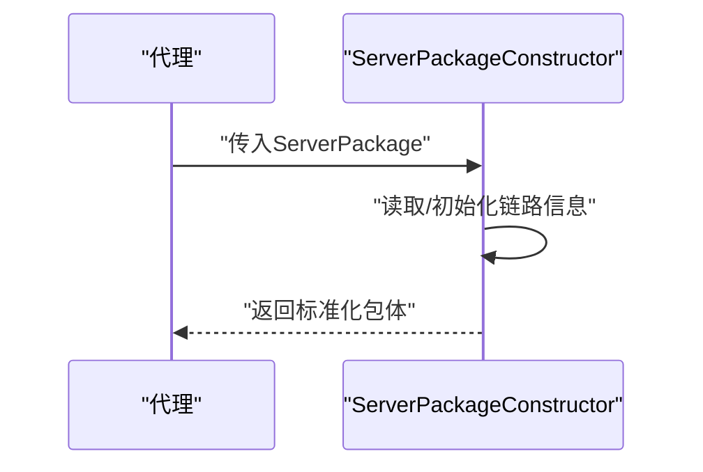
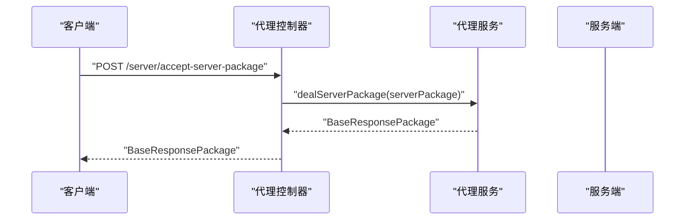
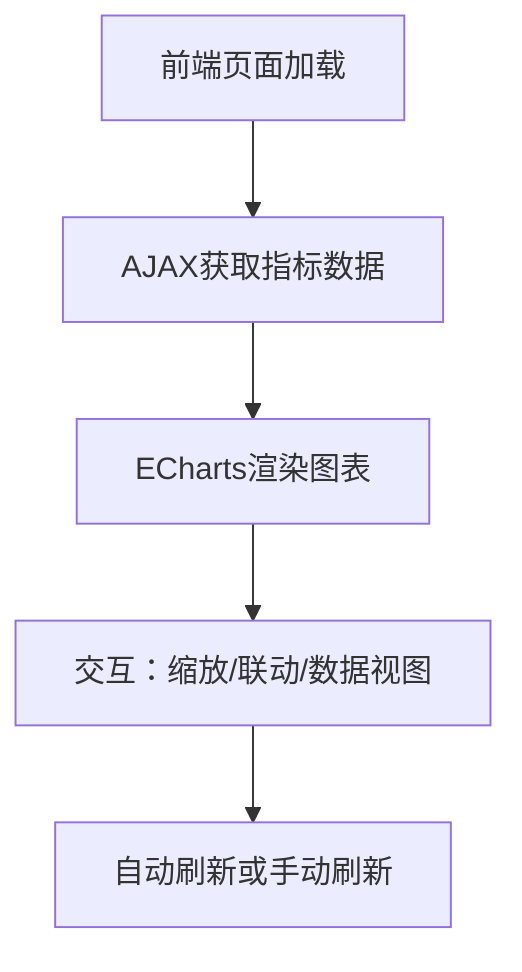
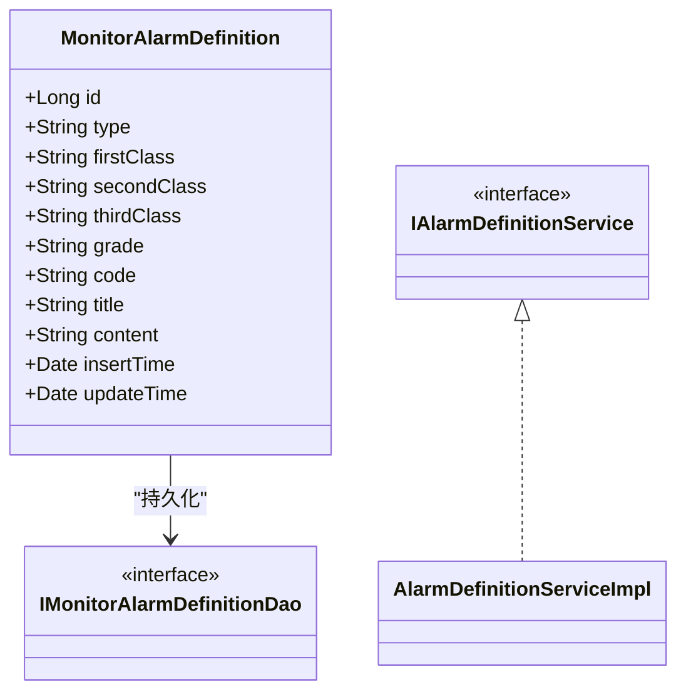
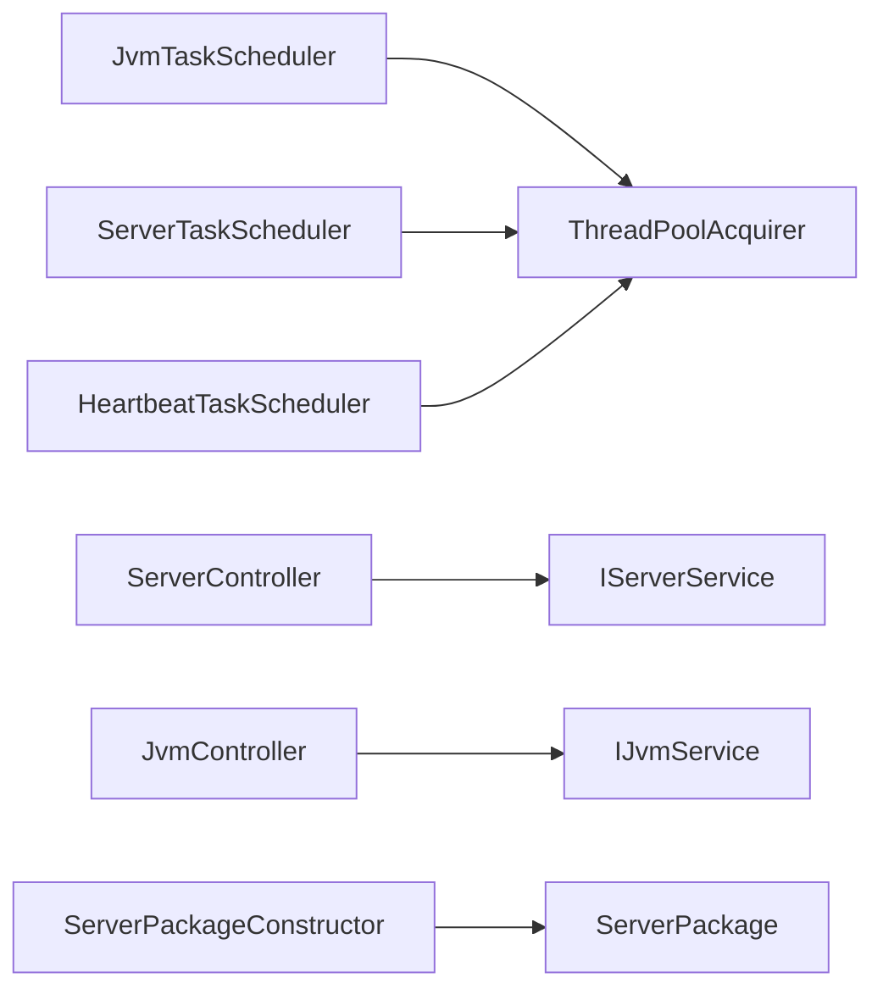

# 自定义监控指标开发

<cite>
**本文引用的文件**
- [Server.java](file://phoenix-common\phoenix-common-core\src\main\java\com\gitee\pifeng\monitoring\common\domain\Server.java)
- [Jvm.java](file://phoenix-common\phoenix-common-core\src\main\java\com\gitee\pifeng\monitoring\common\domain\Jvm.java)
- [ServerPackage.java](file://phoenix-common\phoenix-common-core\src\main\java\com\gitee\pifeng\monitoring\common\dto\ServerPackage.java)
- [JvmPackage.java](file://phoenix-common\phoenix-common-core\src\main\java\com\gitee\pifeng\monitoring\common\dto\JvmPackage.java)
- [IPackageConstructor.java](file://phoenix-common\phoenix-common-core\src\main\java\com\gitee\pifeng\monitoring\common\inf\IPackageConstructor.java)
- [ServerPackageConstructor.java](file://phoenix-server\src\main\java\com\gitee\pifeng\monitoring\server\business\server\core\ServerPackageConstructor.java)
- [JvmTaskScheduler.java](file://phoenix-client\phoenix-client-core\src\main\java\com\gitee\pifeng\monitoring\plug\scheduler\JvmTaskScheduler.java)
- [ServerTaskScheduler.java](file://phoenix-client\phoenix-client-core\src\main\java\com\gitee\pifeng\monitoring\plug\scheduler\ServerTaskScheduler.java)
- [HeartbeatTaskScheduler.java](file://phoenix-client\phoenix-client-core\src\main\java\com\gitee\pifeng\monitoring\plug\scheduler\HeartbeatTaskScheduler.java)
- [ThreadPoolAcquirer.java](file://phoenix-client\phoenix-client-core\src\main\java\com\gitee\pifeng\monitoring\plug\core\ThreadPoolAcquirer.java)
- [ServerController.java](file://phoenix-agent\src\main\java\com\gitee\pifeng\monitoring\agent\business\client\controller\ServerController.java)
- [JvmController.java](file://phoenix-agent\src\main\java\com\gitee\pifeng\monitoring\agent\business\client\controller\JvmController.java)
- [serverDetail.js](file://phoenix-ui\src\main\resources\static\modules\server\serverDetail.js)
- [MonitorRealtimeMonitoring.java](file://phoenix-ui\src\main\java\com\gitee\pifeng\monitoring\ui\business\web\entity\MonitorRealtimeMonitoring.java)
- [MonitorGroup.java](file://phoenix-ui\src\main\java\com\gitee\pifeng\monitoring\ui\business\web\entity\MonitorGroup.java)
- [MonitorJvmMemory.java](file://phoenix-ui\src\main\java\com\gitee\pifeng\monitoring\ui\business\web\entity\MonitorJvmMemory.java)
- [MonitorJvmMemoryHistory.java](file://phoenix-ui\src\main\java\com\gitee\pifeng\monitoring\ui\business\web\entity\MonitorJvmMemoryHistory.java)
- [IAlarmDefinitionService.java](file://phoenix-server\src\main\java\com\gitee\pifeng\monitoring\server\business\server\service\IAlarmDefinitionService.java)
- [AlarmDefinitionServiceImpl.java](file://phoenix-server\src\main\java\com\gitee\pifeng\monitoring\server\business\server\service\impl\AlarmDefinitionServiceImpl.java)
- [IMonitorAlarmDefinitionDao.java](file://phoenix-server\src\main\java\com\gitee\pifeng\monitoring\server\business\server\dao\IMonitorAlarmDefinitionDao.java)
- [MonitorAlarmDefinition.java](file://phoenix-ui\src\main\java\com\gitee\pifeng\monitoring\ui\business\web\entity\MonitorAlarmDefinition.java)
- [IMonitorAlarmDefinitionDao.java (UI)](file://phoenix-ui\src\main\java\com\gitee\pifeng\monitoring\ui\business\web\dao\IMonitorAlarmDefinitionDao.java)
- [MonitoringAgentDevConfig.java](file://phoenix-agent\src\main\java\com\gitee\pifeng\monitoring\agent\config\MonitoringAgentDevConfig.java)
- [MonitoringServerDevConfig.java](file://phoenix-server\src\main\java\com\gitee\pifeng\monitoring\server\config\phoenix\MonitoringServerDevConfig.java)
- [MonitoringUiDevConfig.java](file://phoenix-ui\src\main\java\com\gitee\pifeng\monitoring\ui\config\phoenix\MonitoringUiDevConfig.java)
- [RealtimeMonitoringServiceImpl.java](file://phoenix-server\src\main\java\com\gitee\pifeng\monitoring\server\business\server\service\impl\RealtimeMonitoringServiceImpl.java)
</cite>

## 目录
1. [简介](#简介)
2. [项目结构](#项目结构)
3. [核心组件](#核心组件)
4. [架构总览](#架构总览)
5. [详细组件分析](#详细组件分析)
6. [依赖分析](#依赖分析)
7. [性能考虑](#性能考虑)
8. [故障排查指南](#故障排查指南)
9. [结论](#结论)
10. [附录](#附录)

## 简介
本指南面向Phoenix监控系统的“自定义监控指标开发”，围绕以下目标展开：
- 指标数据模型设计：如何定义新的指标实体类、如何设计指标字段、如何建立指标间的关联关系。
- 数据采集机制：定时采集器开发、采集器注册、采集频率配置、数据预处理。
- 数据上报机制：数据包构造、序列化、网络传输、服务端接收与处理。
- 指标展示配置：在UI中添加新监控视图、图表配置、阈值设置、指标联动。
- 性能优化策略：批量处理、异步采集、缓存与内存管理。
- 实战示例：从需求分析到指标上线的完整流程。

## 项目结构
Phoenix采用多模块分层架构：
- phoenix-common：公共领域模型与DTO、常量、线程池与工具。
- phoenix-client：监控客户端插件，负责采集与上报。
- phoenix-agent：监控代理，接收客户端数据并进行解密/处理。
- phoenix-server：监控服务端，接收代理数据、持久化与告警。
- phoenix-ui：监控前端，提供可视化与配置界面。

**章节来源**
- [Server.java:1-76](file://phoenix-common\phoenix-common-core\src\main\java\com\gitee\pifeng\monitoring\common\domain\Server.java#L1-L76)
- [Jvm.java:1-51](file://phoenix-common\phoenix-common-core\src\main\java\com\gitee\pifeng\monitoring\common\domain\Jvm.java#L1-L51)

## 核心组件
- 数据模型与数据包
  - 服务器指标域模型：[Server.java:1-76](file://phoenix-common\phoenix-common-core\src\main\java\com\gitee\pifeng\monitoring\common\domain\Server.java#L1-L76)
  - JVM指标域模型：[Jvm.java:1-51](file://phoenix-common\phoenix-common-core\src\main\java\com\gitee\pifeng\monitoring\common\domain\Jvm.java#L1-L51)
  - 服务器数据包：[ServerPackage.java:1-34](file://phoenix-common\phoenix-common-core\src\main\java\com\gitee\pifeng\monitoring\common\dto\ServerPackage.java#L1-L34)
  - JVM数据包：[JvmPackage.java:1-34](file://phoenix-common\phoenix-common-core\src\main\java\com\gitee\pifeng\monitoring\common\dto\JvmPackage.java#L1-L34)
  - 数据包构造接口：[IPackageConstructor.java:36-85](file://phoenix-common\phoenix-common-core\src\main\java\com\gitee\pifeng\monitoring\common\inf\IPackageConstructor.java#L36-L85)
  - 服务端包构造器：[ServerPackageConstructor.java:23-66](file://phoenix-server\src\main\java\com\gitee\pifeng\monitoring\server\business\server\core\ServerPackageConstructor.java#L23-L66)

- 采集与调度
  - JVM采集调度器：[JvmTaskScheduler.java:1-50](file://phoenix-client\phoenix-client-core\src\main\java\com\gitee\pifeng\monitoring\plug\scheduler\JvmTaskScheduler.java#L1-L50)
  - 服务器采集调度器：[ServerTaskScheduler.java:1-43](file://phoenix-client\phoenix-client-core\src\main\java\com\gitee\pifeng\monitoring\plug\scheduler\ServerTaskScheduler.java#L1-L43)
  - 心跳采集调度器：[HeartbeatTaskScheduler.java:1-45](file://phoenix-client\phoenix-client-core\src\main\java\com\gitee\pifeng\monitoring\plug\scheduler\HeartbeatTaskScheduler.java#L1-L45)
  - 线程池获取：[ThreadPoolAcquirer.java:46-72](file://phoenix-client\phoenix-client-core\src\main\java\com\gitee\pifeng\monitoring\plug\core\ThreadPoolAcquirer.java#L46-L72)

- 接收与处理
  - 服务器包接收控制器：[ServerController.java:1-55](file://phoenix-agent\src\main\java\com\gitee\pifeng\monitoring\agent\business\client\controller\ServerController.java#L1-L55)
  - JVM包接收控制器：[JvmController.java:1-55](file://phoenix-agent\src\main\java\com\gitee\pifeng\monitoring\agent\business\client\controller\JvmController.java#L1-L55)

- 展示与配置
  - 服务器详情图表脚本：[serverDetail.js:1591-2421](file://phoenix-ui\src\main\resources\static\modules\server\serverDetail.js#L1591-L2421)
  - 实时监控实体：[MonitorRealtimeMonitoring.java:1-47](file://phoenix-ui\src\main\java\com\gitee\pifeng\monitoring\ui\business\web\entity\MonitorRealtimeMonitoring.java#L1-L47)
  - 监控分组实体：[MonitorGroup.java:1-44](file://phoenix-ui\src\main\java\com\gitee\pifeng\monitoring\ui\business\web\entity\MonitorGroup.java#L1-L44)
  - JVM内存实体：[MonitorJvmMemory.java:1-46](file://phoenix-ui\src\main\java\com\gitee\pifeng\monitoring\ui\business\web\entity\MonitorJvmMemory.java#L1-L46)
  - JVM内存历史实体：[MonitorJvmMemoryHistory.java:1-45](file://phoenix-ui\src\main\java\com\gitee\pifeng\monitoring\ui\business\web\entity\MonitorJvmMemoryHistory.java#L1-L45)

- 告警与阈值
  - 告警定义服务接口：[IAlarmDefinitionService.java:1-15](file://phoenix-server\src\main\java\com\gitee\pifeng\monitoring\server\business\server\service\IAlarmDefinitionService.java#L1-L15)
  - 告警定义服务实现：[AlarmDefinitionServiceImpl.java:1-19](file://phoenix-server\src\main\java\com\gitee\pifeng\monitoring\server\business\server\service\impl\AlarmDefinitionServiceImpl.java#L1-L19)
  - 告警定义DAO（服务端）：[IMonitorAlarmDefinitionDao.java:1-15](file://phoenix-server\src\main\java\com\gitee\pifeng\monitoring\server\business\server\dao\IMonitorAlarmDefinitionDao.java#L1-L15)
  - 告警定义实体（UI）：[MonitorAlarmDefinition.java:1-82](file://phoenix-ui\src\main\java\com\gitee\pifeng\monitoring\ui\business\web\entity\MonitorAlarmDefinition.java#L1-L82)
  - 告警定义DAO（UI）：[IMonitorAlarmDefinitionDao.java (UI):1-16](file://phoenix-ui\src\main\java\com\gitee\pifeng\monitoring\ui\business\web\dao\IMonitorAlarmDefinitionDao.java#L1-L16)

**章节来源**
- [ServerPackage.java:1-34](file://phoenix-common\phoenix-common-core\src\main\java\com\gitee\pifeng\monitoring\common\dto\ServerPackage.java#L1-L34)
- [JvmPackage.java:1-34](file://phoenix-common\phoenix-common-core\src\main\java\com\gitee\pifeng\monitoring\common\dto\JvmPackage.java#L1-L34)
- [IPackageConstructor.java:36-85](file://phoenix-common\phoenix-common-core\src\main\java\com\gitee\pifeng\monitoring\common\inf\IPackageConstructor.java#L36-L85)
- [ServerPackageConstructor.java:23-66](file://phoenix-server\src\main\java\com\gitee\pifeng\monitoring\server\business\server\core\ServerPackageConstructor.java#L23-L66)
- [JvmTaskScheduler.java:1-50](file://phoenix-client\phoenix-client-core\src\main\java\com\gitee\pifeng\monitoring\plug\scheduler\JvmTaskScheduler.java#L1-L50)
- [ServerTaskScheduler.java:1-43](file://phoenix-client\phoenix-client-core\src\main\java\com\gitee\pifeng\monitoring\plug\scheduler\ServerTaskScheduler.java#L1-L43)
- [HeartbeatTaskScheduler.java:1-45](file://phoenix-client\phoenix-client-core\src\main\java\com\gitee\pifeng\monitoring\plug\scheduler\HeartbeatTaskScheduler.java#L1-L45)
- [ThreadPoolAcquirer.java:46-72](file://phoenix-client\phoenix-client-core\src\main\java\com\gitee\pifeng\monitoring\plug\core\ThreadPoolAcquirer.java#L46-L72)
- [ServerController.java:1-55](file://phoenix-agent\src\main\java\com\gitee\pifeng\monitoring\agent\business\client\controller\ServerController.java#L1-L55)
- [JvmController.java:1-55](file://phoenix-agent\src\main\java\com\gitee\pifeng\monitoring\agent\business\client\controller\JvmController.java#L1-L55)
- [serverDetail.js:1591-2421](file://phoenix-ui\src\main\resources\static\modules\server\serverDetail.js#L1591-L2421)
- [MonitorRealtimeMonitoring.java:1-47](file://phoenix-ui\src\main\java\com\gitee\pifeng\monitoring\ui\business\web\entity\MonitorRealtimeMonitoring.java#L1-L47)
- [MonitorGroup.java:1-44](file://phoenix-ui\src\main\java\com\gitee\pifeng\monitoring\ui\business\web\entity\MonitorGroup.java#L1-L44)
- [MonitorJvmMemory.java:1-46](file://phoenix-ui\src\main\java\com\gitee\pifeng\monitoring\ui\business\web\entity\MonitorJvmMemory.java#L1-L46)
- [MonitorJvmMemoryHistory.java:1-45](file://phoenix-ui\src\main\java\com\gitee\pifeng\monitoring\ui\business\web\entity\MonitorJvmMemoryHistory.java#L1-L45)
- [IAlarmDefinitionService.java:1-15](file://phoenix-server\src\main\java\com\gitee\pifeng\monitoring\server\business\server\service\IAlarmDefinitionService.java#L1-L15)
- [AlarmDefinitionServiceImpl.java:1-19](file://phoenix-server\src\main\java\com\gitee\pifeng\monitoring\server\business\server\service\impl\AlarmDefinitionServiceImpl.java#L1-L19)
- [IMonitorAlarmDefinitionDao.java:1-15](file://phoenix-server\src\main\java\com\gitee\pifeng\monitoring\server\business\server\dao\IMonitorAlarmDefinitionDao.java#L1-L15)
- [MonitorAlarmDefinition.java:1-82](file://phoenix-ui\src\main\java\com\gitee\pifeng\monitoring\ui\business\web\entity\MonitorAlarmDefinition.java#L1-L82)
- [IMonitorAlarmDefinitionDao.java (UI):1-16](file://phoenix-ui\src\main\java\com\gitee\pifeng\monitoring\ui\business\web\dao\IMonitorAlarmDefinitionDao.java#L1-L16)

## 架构总览
下图展示了从客户端采集、代理接收、服务端处理到前端展示的完整链路。

**图表来源**
- [ServerController.java:47-53](file://phoenix-agent\src\main\java\com\gitee\pifeng\monitoring\agent\business\client\controller\ServerController.java#L47-L53)
- [ServerPackage.java:15-34](file://phoenix-common\phoenix-common-core\src\main\java\com\gitee\pifeng\monitoring\common\dto\ServerPackage.java#L15-L34)
- [ServerPackageConstructor.java:54-66](file://phoenix-server\src\main\java\com\gitee\pifeng\monitoring\server\business\server\core\ServerPackageConstructor.java#L54-L66)
- [serverDetail.js:1591-2421](file://phoenix-ui\src\main\resources\static\modules\server\serverDetail.js#L1591-L2421)

## 详细组件分析

### 数据模型与数据包
- Server与Jvm作为领域模型，封装了操作系统、内存、CPU、GPU、系统负载、网络、磁盘、电源、传感器、进程等维度信息，便于统一采集与传输。
- ServerPackage/JvmPackage继承自通用请求包基类，承载具体指标与传输频率字段，确保序列化与网络传输的一致性。
- IPackageConstructor定义了构建各类数据包的标准接口；服务端的ServerPackageConstructor负责链路信息与包体的组装。

**图表来源**
- [Server.java:16-75](file://phoenix-common\phoenix-common-core\src\main\java\com\gitee\pifeng\monitoring\common\domain\Server.java#L16-L75)
- [Jvm.java:16-50](file://phoenix-common\phoenix-common-core\src\main\java\com\gitee\pifeng\monitoring\common\domain\Jvm.java#L16-L50)
- [ServerPackage.java:15-33](file://phoenix-common\phoenix-common-core\src\main\java\com\gitee\pifeng\monitoring\common\dto\ServerPackage.java#L15-L33)
- [JvmPackage.java:15-33](file://phoenix-common\phoenix-common-core\src\main\java\com\gitee\pifeng\monitoring\common\dto\JvmPackage.java#L15-L33)
- [IPackageConstructor.java:36-85](file://phoenix-common\phoenix-common-core\src\main\java\com\gitee\pifeng\monitoring\common\inf\IPackageConstructor.java#L36-L85)
- [ServerPackageConstructor.java:40](file://phoenix-server\src\main\java\com\gitee\pifeng\monitoring\server\business\server\core\ServerPackageConstructor.java#L40)

**章节来源**
- [Server.java:16-75](file://phoenix-common\phoenix-common-core\src\main\java\com\gitee\pifeng\monitoring\common\domain\Server.java#L16-L75)
- [Jvm.java:16-50](file://phoenix-common\phoenix-common-core\src\main\java\com\gitee\pifeng\monitoring\common\domain\Jvm.java#L16-L50)
- [ServerPackage.java:15-33](file://phoenix-common\phoenix-common-core\src\main\java\com\gitee\pifeng\monitoring\common\dto\ServerPackage.java#L15-L33)
- [JvmPackage.java:15-33](file://phoenix-common\phoenix-common-core\src\main\java\com\gitee\pifeng\monitoring\common\dto\JvmPackage.java#L15-L33)
- [IPackageConstructor.java:36-85](file://phoenix-common\phoenix-common-core\src\main\java\com\gitee\pifeng\monitoring\common\inf\IPackageConstructor.java#L36-L85)
- [ServerPackageConstructor.java:40-66](file://phoenix-server\src\main\java\com\gitee\pifeng\monitoring\server\business\server\core\ServerPackageConstructor.java#L40-L66)

### 采集与调度
- JVM采集调度器：按配置启用/禁用，读取采集频率，使用受监控的定时线程池以固定延迟+固定周期的方式执行JVM采集线程。
- 服务器采集调度器：逻辑同上，用于采集服务器指标。
- 心跳采集调度器：周期性发送心跳包，用于保活与健康上报。
- 线程池获取：提供单例的受监控定时线程池，支持守护线程命名与拒绝策略配置。

**图表来源**
- [JvmTaskScheduler.java:40-48](file://phoenix-client\phoenix-client-core\src\main\java\com\gitee\pifeng\monitoring\plug\scheduler\JvmTaskScheduler.java#L40-L48)
- [ServerTaskScheduler.java:40-43](file://phoenix-client\phoenix-client-core\src\main\java\com\gitee\pifeng\monitoring\plug\scheduler\ServerTaskScheduler.java#L40-L43)
- [HeartbeatTaskScheduler.java:39-43](file://phoenix-client\phoenix-client-core\src\main\java\com\gitee\pifeng\monitoring\plug\scheduler\HeartbeatTaskScheduler.java#L39-L43)
- [ThreadPoolAcquirer.java:48-66](file://phoenix-client\phoenix-client-core\src\main\java\com\gitee\pifeng\monitoring\plug\core\ThreadPoolAcquirer.java#L48-L66)

**章节来源**
- [JvmTaskScheduler.java:40-48](file://phoenix-client\phoenix-client-core\src\main\java\com\gitee\pifeng\monitoring\plug\scheduler\JvmTaskScheduler.java#L40-L48)
- [ServerTaskScheduler.java:40-43](file://phoenix-client\phoenix-client-core\src\main\java\com\gitee\pifeng\monitoring\plug\scheduler\ServerTaskScheduler.java#L40-L43)
- [HeartbeatTaskScheduler.java:39-43](file://phoenix-client\phoenix-client-core\src\main\java\com\gitee\pifeng\monitoring\plug\scheduler\HeartbeatTaskScheduler.java#L39-L43)
- [ThreadPoolAcquirer.java:48-66](file://phoenix-client\phoenix-client-core\src\main\java\com\gitee\pifeng\monitoring\plug\core\ThreadPoolAcquirer.java#L48-L66)

### 数据包构造与序列化
- 服务端包构造器在接收到数据包后，提取链路信息（应用链路、网络链路、时间链路），若为空则初始化，保证后续处理一致性。
- 数据包通过统一的构造接口生成，确保字段一致、序列化稳定。

**图表来源**
- [ServerPackageConstructor.java:54-66](file://phoenix-server\src\main\java\com\gitee\pifeng\monitoring\server\business\server\core\ServerPackageConstructor.java#L54-L66)

**章节来源**
- [ServerPackageConstructor.java:54-66](file://phoenix-server\src\main\java\com\gitee\pifeng\monitoring\server\business\server\core\ServerPackageConstructor.java#L54-L66)

### 网络传输与接收
- 代理端提供REST接口接收客户端数据包，分别处理服务器与JVM两类数据包，返回基础响应包。
- 控制器通过服务层处理数据包，完成解密、校验与转发。

**图表来源**
- [ServerController.java:50-53](file://phoenix-agent\src\main\java\com\gitee\pifeng\monitoring\agent\business\client\controller\ServerController.java#L50-L53)
- [ServerController.java:37-53](file://phoenix-agent\src\main\java\com\gitee\pifeng\monitoring\agent\business\client\controller\ServerController.java#L37-L53)

**章节来源**
- [ServerController.java:37-53](file://phoenix-agent\src\main\java\com\gitee\pifeng\monitoring\agent\business\client\controller\ServerController.java#L37-L53)
- [JvmController.java:37-53](file://phoenix-agent\src\main\java\com\gitee\pifeng\monitoring\agent\business\client\controller\JvmController.java#L37-L53)

### 指标展示配置
- 前端通过ECharts脚本对服务器CPU、内存、进程、网络、磁盘、电源等指标进行折线图展示，支持联动、缩放、数据视图等功能。
- 实时监控实体与分组实体支撑UI侧的指标分类与分组展示。
- JVM内存与历史内存实体支撑内存指标的实时与历史数据展示。

**图表来源**
- [serverDetail.js:1591-2421](file://phoenix-ui\src\main\resources\static\modules\server\serverDetail.js#L1591-L2421)
- [MonitorRealtimeMonitoring.java:28-47](file://phoenix-ui\src\main\java\com\gitee\pifeng\monitoring\ui\business\web\entity\MonitorRealtimeMonitoring.java#L28-L47)
- [MonitorGroup.java:30-44](file://phoenix-ui\src\main\java\com\gitee\pifeng\monitoring\ui\business\web\entity\MonitorGroup.java#L30-L44)
- [MonitorJvmMemory.java:30-46](file://phoenix-ui\src\main\java\com\gitee\pifeng\monitoring\ui\business\web\entity\MonitorJvmMemory.java#L30-L46)
- [MonitorJvmMemoryHistory.java:30-45](file://phoenix-ui\src\main\java\com\gitee\pifeng\monitoring\ui\business\web\entity\MonitorJvmMemoryHistory.java#L30-L45)

**章节来源**
- [serverDetail.js:1591-2421](file://phoenix-ui\src\main\resources\static\modules\server\serverDetail.js#L1591-L2421)
- [MonitorRealtimeMonitoring.java:28-47](file://phoenix-ui\src\main\java\com\gitee\pifeng\monitoring\ui\business\web\entity\MonitorRealtimeMonitoring.java#L28-L47)
- [MonitorGroup.java:30-44](file://phoenix-ui\src\main\java\com\gitee\pifeng\monitoring\ui\business\web\entity\MonitorGroup.java#L30-L44)
- [MonitorJvmMemory.java:30-46](file://phoenix-ui\src\main\java\com\gitee\pifeng\monitoring\ui\business\web\entity\MonitorJvmMemory.java#L30-L46)
- [MonitorJvmMemoryHistory.java:30-45](file://phoenix-ui\src\main\java\com\gitee\pifeng\monitoring\ui\business\web\entity\MonitorJvmMemoryHistory.java#L30-L45)

### 告警与阈值
- 告警定义在服务端与UI侧均有对应实体与DAO，支持按监控类型、分类、级别、编码等维度进行配置。
- 服务端提供告警定义服务接口与实现，DAO负责持久化操作。
- 前端提供告警定义的增删改查页面与模板，支撑阈值与规则配置。

**图表来源**
- [MonitorAlarmDefinition.java:32-82](file://phoenix-ui\src\main\java\com\gitee\pifeng\monitoring\ui\business\web\entity\MonitorAlarmDefinition.java#L32-L82)
- [IAlarmDefinitionService.java:14](file://phoenix-server\src\main\java\com\gitee\pifeng\monitoring\server\business\server\service\IAlarmDefinitionService.java#L14)
- [AlarmDefinitionServiceImpl.java:18](file://phoenix-server\src\main\java\com\gitee\pifeng\monitoring\server\business\server\service\impl\AlarmDefinitionServiceImpl.java#L18)
- [IMonitorAlarmDefinitionDao.java](file://phoenix-server\src\main\java\com\gitee\pifeng\monitoring\server\business\server\dao\IMonitorAlarmDefinitionDao.java#L14)
- [IMonitorAlarmDefinitionDao.java (UI)](file://phoenix-ui\src\main\java\com\gitee\pifeng\monitoring\ui\business\web\dao\IMonitorAlarmDefinitionDao.java#L14)

**章节来源**
- [MonitorAlarmDefinition.java:32-82](file://phoenix-ui\src\main\java\com\gitee\pifeng\monitoring\ui\business\web\entity\MonitorAlarmDefinition.java#L32-L82)
- [IAlarmDefinitionService.java:14](file://phoenix-server\src\main\java\com\gitee\pifeng\monitoring\server\business\server\service\IAlarmDefinitionService.java#L14)
- [AlarmDefinitionServiceImpl.java:18](file://phoenix-server\src\main\java\com\gitee\pifeng\monitoring\server\business\server\service\impl\AlarmDefinitionServiceImpl.java#L18)
- [IMonitorAlarmDefinitionDao.java](file://phoenix-server\src\main\java\com\gitee\pifeng\monitoring\server\business\server\dao\IMonitorAlarmDefinitionDao.java#L14)
- [IMonitorAlarmDefinitionDao.java (UI)](file://phoenix-ui\src\main\java\com\gitee\pifeng\monitoring\ui\business\web\dao\IMonitorAlarmDefinitionDao.java#L14)

## 依赖分析
- 组件耦合
  - 客户端采集器通过统一的调度器与线程池进行异步采集，降低对业务线程的影响。
  - 代理控制器仅承担接收与转发职责，解耦了加密/校验与业务处理。
  - 服务端包构造器集中处理链路信息，提升后续处理一致性。
- 外部依赖
  - 前端ECharts用于可视化展示，与后端接口解耦。
  - MyBatis-Plus用于实体与DAO映射，支撑告警与指标数据持久化。

**图表来源**
- [JvmTaskScheduler.java:40-48](file://phoenix-client\phoenix-client-core\src\main\java\com\gitee\pifeng\monitoring\plug\scheduler\JvmTaskScheduler.java#L40-L48)
- [ServerTaskScheduler.java:40-43](file://phoenix-client\phoenix-client-core\src\main\java\com\gitee\pifeng\monitoring\plug\scheduler\ServerTaskScheduler.java#L40-L43)
- [HeartbeatTaskScheduler.java:39-43](file://phoenix-client\phoenix-client-core\src\main\java\com\gitee\pifeng\monitoring\plug\scheduler\HeartbeatTaskScheduler.java#L39-L43)
- [ThreadPoolAcquirer.java:48-66](file://phoenix-client\phoenix-client-core\src\main\java\com\gitee\pifeng\monitoring\plug\core\ThreadPoolAcquirer.java#L48-L66)
- [ServerController.java:34-35](file://phoenix-agent\src\main\java\com\gitee\pifeng\monitoring\agent\business\client\controller\ServerController.java#L34-L35)
- [JvmController.java:34-35](file://phoenix-agent\src\main\java\com\gitee\pifeng\monitoring\agent\business\client\controller\JvmController.java#L34-L35)
- [ServerPackageConstructor.java:40](file://phoenix-server\src\main\java\com\gitee\pifeng\monitoring\server\business\server\core\ServerPackageConstructor.java#L40)

**章节来源**
- [JvmTaskScheduler.java:40-48](file://phoenix-client\phoenix-client-core\src\main\java\com\gitee\pifeng\monitoring\plug\scheduler\JvmTaskScheduler.java#L40-L48)
- [ServerTaskScheduler.java:40-43](file://phoenix-client\phoenix-client-core\src\main\java\com\gitee\pifeng\monitoring\plug\scheduler\ServerTaskScheduler.java#L40-L43)
- [HeartbeatTaskScheduler.java:39-43](file://phoenix-client\phoenix-client-core\src\main\java\com\gitee\pifeng\monitoring\plug\scheduler\HeartbeatTaskScheduler.java#L39-L43)
- [ThreadPoolAcquirer.java:48-66](file://phoenix-client\phoenix-client-core\src\main\java\com\gitee\pifeng\monitoring\plug\core\ThreadPoolAcquirer.java#L48-L66)
- [ServerController.java:34-35](file://phoenix-agent\src\main\java\com\gitee\pifeng\monitoring\agent\business\client\controller\ServerController.java#L34-L35)
- [JvmController.java:34-35](file://phoenix-agent\src\main\java\com\gitee\pifeng\monitoring\agent\business\client\controller\JvmController.java#L34-L35)
- [ServerPackageConstructor.java:40](file://phoenix-server\src\main\java\com\gitee\pifeng\monitoring\server\business\server\core\ServerPackageConstructor.java#L40)

## 性能考虑
- 异步采集与线程池
  - 使用受监控的定时线程池，守护线程命名，避免阻塞业务线程。
  - IO密集型场景下，合理设置线程数与拒绝策略，防止过载。
- 批量处理
  - 将多个指标合并为一个数据包，减少网络往返次数。
- 缓存与内存管理
  - 对热点链路信息与中间结果进行短期缓存，降低重复计算。
  - 合理控制队列长度与元素内存占用，定期GC与内存回收。
- 告警前置判断
  - 在服务端对耗时较长的告警判定进行预警提示，避免影响整体吞吐。

**章节来源**
- [ThreadPoolAcquirer.java:48-66](file://phoenix-client\phoenix-client-core\src\main\java\com\gitee\pifeng\monitoring\plug\core\ThreadPoolAcquirer.java#L48-L66)
- [RealtimeMonitoringServiceImpl.java:149-161](file://phoenix-server\src\main\java\com\gitee\pifeng\monitoring\server\business\server\service\impl\RealtimeMonitoringServiceImpl.java#L149-L161)

## 故障排查指南
- 采集未生效
  - 检查采集调度器是否启用与频率配置是否正确。
  - 确认线程池状态与任务是否被拒绝。
- 数据包接收失败
  - 核对代理控制器的请求路径与参数类型是否匹配。
  - 检查服务端包构造器是否正确解析链路信息。
- 前端图表无数据
  - 检查AJAX请求是否成功，图表配置项是否正确。
  - 确认实体类字段与接口返回结构一致。
- 告警未触发
  - 核对告警定义的类型、分类、级别与编码是否匹配。
  - 检查DAO与服务实现是否正确映射。

**章节来源**
- [JvmTaskScheduler.java:40-48](file://phoenix-client\phoenix-client-core\src\main\java\com\gitee\pifeng\monitoring\plug\scheduler\JvmTaskScheduler.java#L40-L48)
- [ServerTaskScheduler.java:40-43](file://phoenix-client\phoenix-client-core\src\main\java\com\gitee\pifeng\monitoring\plug\scheduler\ServerTaskScheduler.java#L40-L43)
- [HeartbeatTaskScheduler.java:39-43](file://phoenix-client\phoenix-client-core\src\main\java\com\gitee\pifeng\monitoring\plug\scheduler\HeartbeatTaskScheduler.java#L39-L43)
- [ServerController.java:50-53](file://phoenix-agent\src\main\java\com\gitee\pifeng\monitoring\agent\business\client\controller\ServerController.java#L50-L53)
- [serverDetail.js:1591-2421](file://phoenix-ui\src\main\resources\static\modules\server\serverDetail.js#L1591-L2421)
- [MonitorAlarmDefinition.java:32-82](file://phoenix-ui\src\main\java\com\gitee\pifeng\monitoring\ui\business\web\entity\MonitorAlarmDefinition.java#L32-L82)

## 结论
通过统一的数据模型、规范的数据包构造、稳定的采集调度与清晰的前后端交互，Phoenix实现了可扩展的自定义监控指标体系。开发者可基于现有框架快速新增指标实体、配置采集频率、接入UI展示与告警阈值，同时遵循性能优化建议保障系统稳定性与可观测性。

## 附录
- 开发环境配置
  - 代理端开发配置：[MonitoringAgentDevConfig.java:31-35](file://phoenix-agent\src\main\java\com\gitee\pifeng\monitoring\agent\config\MonitoringAgentDevConfig.java#L31-L35)
  - 服务端开发配置：[MonitoringServerDevConfig.java:31-35](file://phoenix-server\src\main\java\com\gitee\pifeng\monitoring\server\config\phoenix\MonitoringServerDevConfig.java#L31-L35)
  - UI端开发配置：[MonitoringUiDevConfig.java:31-35](file://phoenix-ui\src\main\java\com\gitee\pifeng\monitoring\ui\config\phoenix\MonitoringUiDevConfig.java#L31-L35)