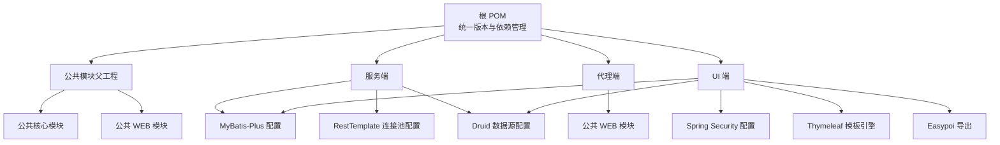
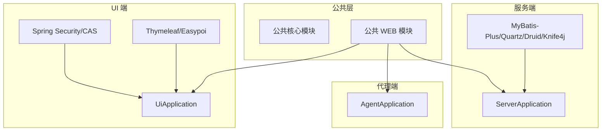
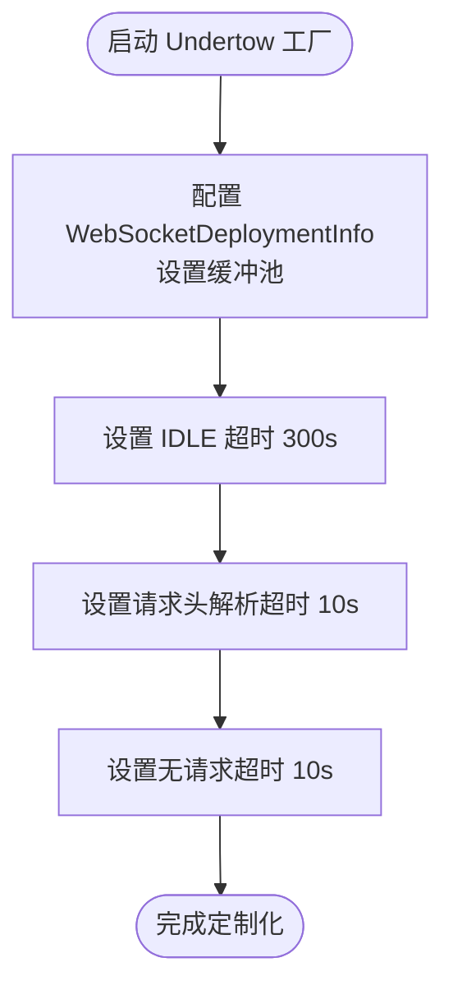
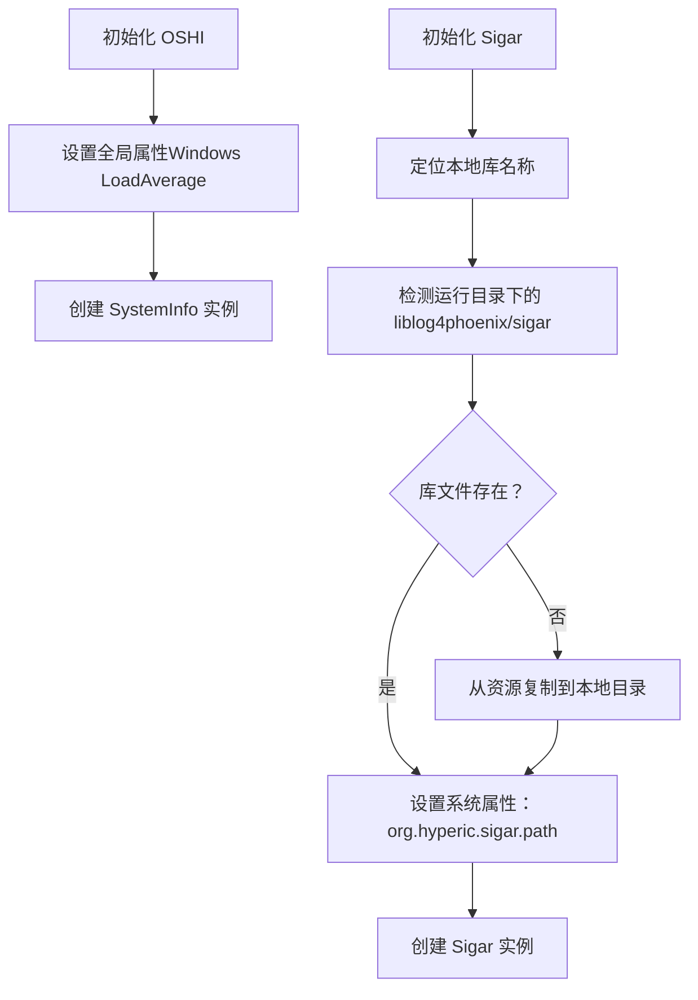
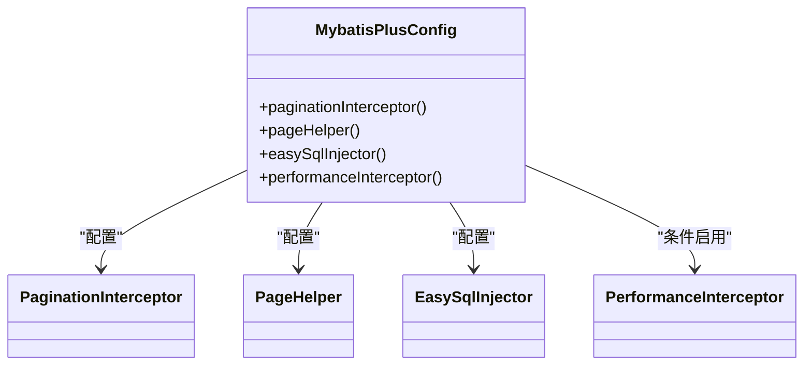
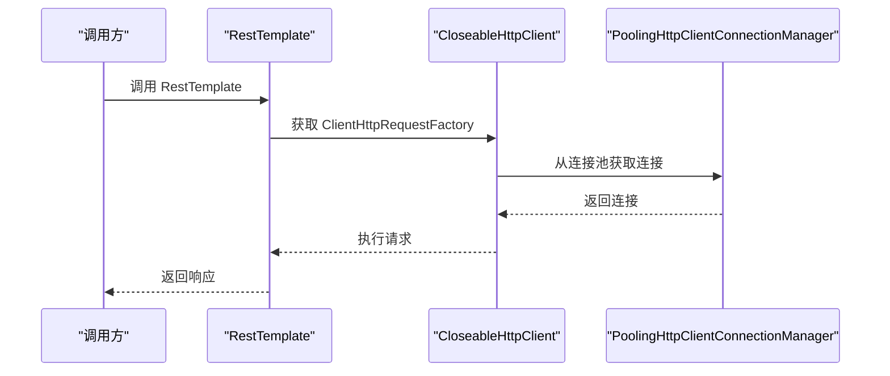
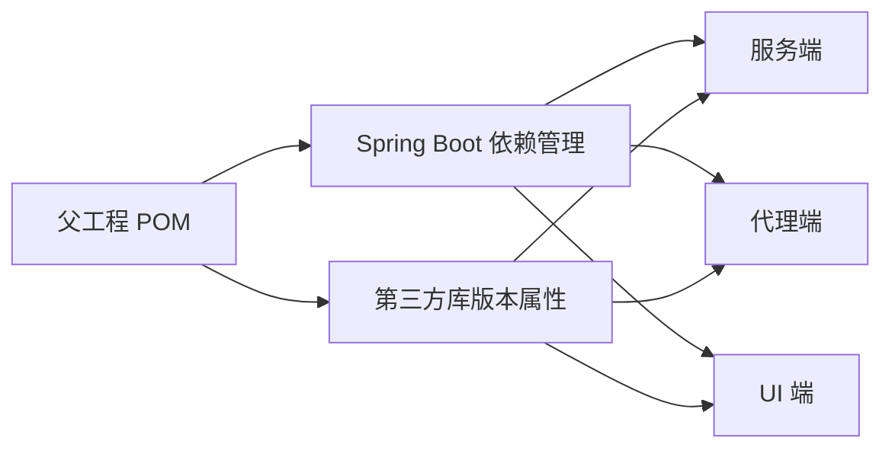

# 技术栈与依赖

<cite>
**本文档引用的文件**
- [根 POM（父工程）](file://pom.xml)
- [服务端 POM](file://phoenix-server/pom.xml)
- [代理端 POM](file://phoenix-agent/pom.xml)
- [UI 端 POM](file://phoenix-ui/pom.xml)
- [公共模块父工程 POM](file://phoenix-common/pom.xml)
- [Undertow 工厂定制器](file://phoenix-common/phoenix-common-web/src/main/java/com/gitee/pifeng/monitoring/common/web/core/CustomizationUndertowWebServerFactoryCustomizer.java)
- [OSHI 初始化器](file://phoenix-common/phoenix-common-core/src/main/java/com/gitee/pifeng/monitoring/common/init/InitOshi.java)
- [Sigar 初始化器](file://phoenix-common/phoenix-common-core/src/main/java/com/gitee/pifeng/monitoring/common/init/InitSigar.java)
- [MyBatis-Plus 配置（服务端）](file://phoenix-server/src/main/java/com/gitee/pifeng/monitoring/server/config/MybatisPlusConfig.java)
- [RestTemplate 配置（服务端）](file://phoenix-server/src/main/java/com/gitee/pifeng/monitoring/server/config/RestTemplateConfig.java)
- [服务端应用配置（YAML）](file://phoenix-server/src/main/resources/application.yml)
- [代理端应用配置（YAML）](file://phoenix-agent/src/main/resources/application.yml)
- [UI 端应用配置（YAML）](file://phoenix-ui/src/main/resources/application.yml)
- [公共 WEB 自动装配入口](file://phoenix-common/phoenix-common-web/src/main/resources/META-INF/spring.factories)
</cite>

## 目录
1. [简介](#简介)
2. [项目结构](#项目结构)
3. [核心组件](#核心组件)
4. [架构总览](#架构总览)
5. [详细组件分析](#详细组件分析)
6. [依赖分析](#依赖分析)
7. [性能考量](#性能考量)
8. [故障排查指南](#故障排查指南)
9. [结论](#结论)
10. [附录](#附录)

## 简介
本文件面向 Phoenix 监控系统的开发者与运维人员，系统性梳理并解释项目采用的技术栈与依赖，重点涵盖：
- Spring Boot 2.3.12.RELEASE 的特性与优势
- MyBatis-Plus ORM 框架的功能特性与配置要点
- Undertow 高性能 Web 服务器的性能表现与定制化配置
- 关键第三方库（OSHI、Sigar、Druid 等）的作用与价值
- 版本管理策略、依赖冲突解决与兼容性说明
- 开发工具链推荐配置（IDE、代码规范、调试）

目标是帮助读者理解技术选型背景与工程实践，快速上手并稳定维护系统。

## 项目结构
Phoenix 采用多模块 Maven 聚合工程组织，核心模块包括：
- 公共模块父工程：统一版本与依赖管理
- 公共核心模块：通用常量、领域模型、工具类、系统初始化（OSHI/Sigar）
- 公共 WEB 模块：Spring Boot 自动装配、Undertow 定制、业务扫描器
- 服务端：监控服务端，集成 MyBatis-Plus、Quartz、Druid、Knife4j 等
- 代理端：监控代理端，负责采集与上报
- UI 端：监控前端管理界面，集成 Spring Security、Thymeleaf、Easypoi、MyBatis-Plus 等

**图表来源**
- [根 POM（父工程）:1-785](file://pom.xml#L1-L785)
- [公共模块父工程 POM:1-45](file://phoenix-common/pom.xml#L1-L45)
- [服务端 POM:1-145](file://phoenix-server/pom.xml#L1-L145)
- [代理端 POM:1-82](file://phoenix-agent/pom.xml#L1-L82)
- [UI 端 POM:1-160](file://phoenix-ui/pom.xml#L1-L160)

**章节来源**
- [根 POM（父工程）:1-785](file://pom.xml#L1-L785)
- [公共模块父工程 POM:1-45](file://phoenix-common/pom.xml#L1-L45)

## 核心组件
- Spring Boot 2.3.12.RELEASE
  - 优势：成熟稳定、生态完善、自动装配、Actuator 健康检查、Graceful Shutdown、Undertow 内嵌服务器等
  - 项目中通过 spring-boot-dependencies 管理版本，确保模块间一致性
- MyBatis-Plus 3.1.2
  - 功能：内置分页、代码生成器、SQL 注入器、性能分析插件、驼峰映射、数据库标识等
  - 服务端与 UI 端均引入，统一数据访问层能力
- Undertow 高性能 Web 服务器
  - 通过自定义 WebServerFactoryCustomizer，设置 IDLE/REQUEST_PARSE/NO_REQUEST 超时、WebSocket 缓冲池、移除告警等
  - 服务端、代理端、UI 端均使用 Undertow，统一性能与稳定性
- OSHI 与 Sigar 系统信息采集
  - OSHI：跨平台系统信息采集，全局初始化，Windows 平台开启 LoadAverage
  - Sigar：动态加载本地库文件，按平台复制至运行目录，设置系统属性路径
- Druid 数据库连接池
  - 提供连接池大小、空闲检测、慢 SQL、Web 监控、过滤器链等配置
  - 服务端与 UI 端均启用，便于运维与性能观测
- Knife4j 文档增强
  - OpenAPI/Swagger 增强，支持 Basic 认证、版本控制、动态参数调试等
- Apache HttpClient 连接池（服务端）
  - 自定义连接池参数，支持 Keep-Alive、重试、超时、空闲回收等

**章节来源**
- [根 POM（父工程）:37-129](file://pom.xml#L37-L129)
- [服务端 POM:27-101](file://phoenix-server/pom.xml#L27-L101)
- [UI 端 POM:27-116](file://phoenix-ui/pom.xml#L27-L116)
- [Undertow 工厂定制器:1-55](file://phoenix-common/phoenix-common-web/src/main/java/com/gitee/pifeng/monitoring/common/web/core/CustomizationUndertowWebServerFactoryCustomizer.java#L1-L55)
- [OSHI 初始化器:1-40](file://phoenix-common/phoenix-common-core/src/main/java/com/gitee/pifeng/monitoring/common/init/InitOshi.java#L1-L40)
- [Sigar 初始化器:1-96](file://phoenix-common/phoenix-common-core/src/main/java/com/gitee/pifeng/monitoring/common/init/InitSigar.java#L1-L96)
- [MyBatis-Plus 配置（服务端）:1-112](file://phoenix-server/src/main/java/com/gitee/pifeng/monitoring/server/config/MybatisPlusConfig.java#L1-L112)
- [RestTemplate 配置（服务端）:1-144](file://phoenix-server/src/main/java/com/gitee/pifeng/monitoring/server/config/RestTemplateConfig.java#L1-L144)
- [服务端应用配置（YAML）:1-271](file://phoenix-server/src/main/resources/application.yml#L1-L271)
- [代理端应用配置（YAML）:1-111](file://phoenix-agent/src/main/resources/application.yml#L1-L111)
- [UI 端应用配置（YAML）:1-238](file://phoenix-ui/src/main/resources/application.yml#L1-L238)

## 架构总览
Phoenix 采用“多模块 + 多端”的分层架构：
- 公共模块提供跨端复用的能力（系统初始化、Web 定制、业务扫描）
- 服务端负责数据采集汇聚、定时任务、数据库与接口文档
- 代理端负责被监控应用侧的采集与上报
- UI 端负责可视化展示、用户管理、安全认证与导出

**图表来源**
- [公共模块父工程 POM:1-45](file://phoenix-common/pom.xml#L1-L45)
- [服务端 POM:1-145](file://phoenix-server/pom.xml#L1-L145)
- [代理端 POM:1-82](file://phoenix-agent/pom.xml#L1-L82)
- [UI 端 POM:1-160](file://phoenix-ui/pom.xml#L1-L160)

## 详细组件分析

### Undertow 性能与定制化
- 自定义 Undertow 选项：IDLE 超时、请求头解析超时、无请求超时
- WebSocket 缓冲池：全局复用 DefaultByteBufferPool，消除警告
- 适用范围：服务端、代理端、UI 端统一配置，保障高并发与低延迟

**图表来源**
- [Undertow 工厂定制器:34-52](file://phoenix-common/phoenix-common-web/src/main/java/com/gitee/pifeng/monitoring/common/web/core/CustomizationUndertowWebServerFactoryCustomizer.java#L34-L52)

**章节来源**
- [Undertow 工厂定制器:1-55](file://phoenix-common/phoenix-common-web/src/main/java/com/gitee/pifeng/monitoring/common/web/core/CustomizationUndertowWebServerFactoryCustomizer.java#L1-L55)
- [服务端应用配置（YAML）:7-20](file://phoenix-server/src/main/resources/application.yml#L7-L20)
- [代理端应用配置（YAML）:1-18](file://phoenix-agent/src/main/resources/application.yml#L1-L18)
- [UI 端应用配置（YAML）:1-27](file://phoenix-ui/src/main/resources/application.yml#L1-L27)

### OSHI 与 Sigar 系统信息采集
- OSHI：全局初始化 SystemInfo，Windows 平台开启 LoadAverage，便于 JVM/系统指标采集
- Sigar：动态复制平台本地库至运行目录，设置系统属性路径，确保底层系统调用可用

**图表来源**
- [OSHI 初始化器:32-38](file://phoenix-common/phoenix-common-core/src/main/java/com/gitee/pifeng/monitoring/common/init/InitOshi.java#L32-L38)
- [Sigar 初始化器:44-94](file://phoenix-common/phoenix-common-core/src/main/java/com/gitee/pifeng/monitoring/common/init/InitSigar.java#L44-L94)

**章节来源**
- [OSHI 初始化器:1-40](file://phoenix-common/phoenix-common-core/src/main/java/com/gitee/pifeng/monitoring/common/init/InitOshi.java#L1-L40)
- [Sigar 初始化器:1-96](file://phoenix-common/phoenix-common-core/src/main/java/com/gitee/pifeng/monitoring/common/init/InitSigar.java#L1-L96)

### MyBatis-Plus 配置与分页策略
- 分页插件：PaginationInterceptor + JsqlParserCountOptimize，提升 COUNT SQL 优化
- PageHelper：RowBounds 分页参数支持、合理化参数等
- 自定义 SQL 注入器：EasySqlInjector
- Profile 控制：仅在 test 环境启用 PerformanceInterceptor

**图表来源**
- [MyBatis-Plus 配置（服务端）:24-112](file://phoenix-server/src/main/java/com/gitee/pifeng/monitoring/server/config/MybatisPlusConfig.java#L24-L112)

**章节来源**
- [MyBatis-Plus 配置（服务端）:1-112](file://phoenix-server/src/main/java/com/gitee/pifeng/monitoring/server/config/MybatisPlusConfig.java#L1-L112)
- [服务端应用配置（YAML）:186-217](file://phoenix-server/src/main/resources/application.yml#L186-L217)

### RestTemplate 连接池（服务端）
- 自定义连接池：注册 HTTP/HTTPS SocketFactory、DNS 解析器、连接工厂
- 连接池参数：最大连接、每路由最大连接、空闲回收、TTL、Keep-Alive 策略
- 超时与重试：连接、等待、Socket 超时，以及重试次数
- 适用场景：服务端对外部服务发起 HTTP/HTTPS 请求，保障高并发与稳定性

**图表来源**
- [RestTemplate 配置（服务端）:54-141](file://phoenix-server/src/main/java/com/gitee/pifeng/monitoring/server/config/RestTemplateConfig.java#L54-L141)

**章节来源**
- [RestTemplate 配置（服务端）:1-144](file://phoenix-server/src/main/java/com/gitee/pifeng/monitoring/server/config/RestTemplateConfig.java#L1-L144)

### 数据源与 Druid 连接池
- 服务端与 UI 端均使用 Druid，配置项覆盖：初始大小、最小空闲、最大活跃、最大等待、空闲检测周期、慢 SQL、Web 监控、过滤器链、Spring AOP 拦截等
- 适用于高并发场景，便于监控 SQL 与连接泄漏

**章节来源**
- [服务端应用配置（YAML）:117-184](file://phoenix-server/src/main/resources/application.yml#L117-L184)
- [UI 端应用配置（YAML）:84-151](file://phoenix-ui/src/main/resources/application.yml#L84-L151)

### 文档与安全
- Knife4j：增强 OpenAPI/Swagger，支持 Basic 认证、版本控制、动态参数调试
- UI 端：Spring Security + CAS 集成，Thymeleaf 扩展，Easypoi 导出

**章节来源**
- [服务端应用配置（YAML）:236-271](file://phoenix-server/src/main/resources/application.yml#L236-L271)
- [代理端应用配置（YAML）:76-111](file://phoenix-agent/src/main/resources/application.yml#L76-L111)
- [UI 端应用配置（YAML）:204-238](file://phoenix-ui/src/main/resources/application.yml#L204-L238)
- [UI 端 POM:44-78](file://phoenix-ui/pom.xml#L44-L78)

## 依赖分析
- 版本管理策略
  - 父工程集中声明版本属性，子模块通过依赖管理统一拉取
  - Spring Boot 使用 spring-boot-dependencies，第三方库通过属性统一管理
- 模块间依赖
  - 服务端、代理端、UI 端均依赖公共 WEB 模块，实现 Undertow 定制与业务扫描
  - 服务端与 UI 端引入 MyBatis-Plus、Druid、Thymeleaf、Easypoi 等
- 第三方库价值
  - OSHI：跨平台系统信息采集，简化 JVM/OS 指标获取
  - Sigar：底层系统调用封装，适配多平台本地库
  - Druid：连接池 + 监控 + 过滤器链，便于运维与性能观测
  - Knife4j：OpenAPI 增强，提升接口文档体验
  - Apache HttpClient：高并发 HTTP 客户端，服务端对外请求

**图表来源**
- [根 POM（父工程）:132-392](file://pom.xml#L132-L392)
- [服务端 POM:27-101](file://phoenix-server/pom.xml#L27-L101)
- [代理端 POM:27-38](file://phoenix-agent/pom.xml#L27-L38)
- [UI 端 POM:27-116](file://phoenix-ui/pom.xml#L27-L116)

**章节来源**
- [根 POM（父工程）:28-129](file://pom.xml#L28-L129)
- [公共模块父工程 POM:28-43](file://phoenix-common/pom.xml#L28-L43)

## 性能考量
- Undertow 超时与缓冲池：降低慢连接风险，提升并发处理能力
- Druid 连接池：合理设置最大连接与空闲回收，避免连接泄漏与抖动
- MyBatis-Plus 分页优化：COUNT SQL 优化与合理化参数，降低数据库压力
- RestTemplate 连接池：长连接、Keep-Alive、超时与重试策略，提升外部调用稳定性
- 日志与压缩：服务端/代理端/UI 端 Undertow 访问日志与响应压缩，平衡可观测性与带宽

[本节为通用性能指导，不直接分析具体文件]

## 故障排查指南
- Undertow 警告与超时
  - 症状：WebSocket 缓冲池未设置告警、慢连接导致阻塞
  - 处理：确认 CustomizationUndertowWebServerFactoryCustomizer 已生效，检查超时配置
- OSHI/Sigar 初始化失败
  - 症状：系统信息采集异常、Sigar 库文件大小为零
  - 处理：确认资源目录下 sigar 库存在并可复制，检查 org.hyperic.sigar.path 系统属性
- Druid 连接池问题
  - 症状：连接池耗尽、慢 SQL、连接泄漏
  - 处理：调整最大连接、空闲检测周期、慢 SQL 阈值，开启 Web 监控与 AOP 拦截
- MyBatis-Plus 分页异常
  - 症状：COUNT SQL 抖动、分页参数不生效
  - 处理：确认 PaginationInterceptor 与 PageHelper 配置，合理化参数开启
- RestTemplate 超时与重试
  - 症状：连接/等待/Socket 超时、请求失败
  - 处理：调整超时与重试次数，检查连接池参数与 Keep-Alive 策略

**章节来源**
- [Undertow 工厂定制器:34-52](file://phoenix-common/phoenix-common-web/src/main/java/com/gitee/pifeng/monitoring/common/web/core/CustomizationUndertowWebServerFactoryCustomizer.java#L34-L52)
- [Sigar 初始化器:44-94](file://phoenix-common/phoenix-common-core/src/main/java/com/gitee/pifeng/monitoring/common/init/InitSigar.java#L44-L94)
- [服务端应用配置（YAML）:117-184](file://phoenix-server/src/main/resources/application.yml#L117-L184)
- [MyBatis-Plus 配置（服务端）:38-77](file://phoenix-server/src/main/java/com/gitee/pifeng/monitoring/server/config/MybatisPlusConfig.java#L38-L77)
- [RestTemplate 配置（服务端）:102-138](file://phoenix-server/src/main/java/com/gitee/pifeng/monitoring/server/config/RestTemplateConfig.java#L102-L138)

## 结论
Phoenix 监控系统通过“统一版本管理 + 多模块复用 + 高性能 Web 服务器 + ORM 与连接池 + 系统采集库”的技术组合，实现了跨端一致的监控能力与稳定的运行表现。Spring Boot 2.3.12.RELEASE 提供了成熟的自动装配与运维能力；MyBatis-Plus 与 Druid 提升了数据访问与连接池的可观测性；Undertow 的定制化配置保障了高并发场景下的性能与稳定性；OSHI/Sigar 则为系统级指标采集提供了可靠支撑。建议在后续升级中优先评估 Spring Boot 与核心依赖的兼容性，确保平滑演进。

[本节为总结性内容，不直接分析具体文件]

## 附录

### 版本与依赖兼容性说明
- Spring Boot 2.3.12.RELEASE 与 MyBatis-Plus 3.1.2：官方兼容，分页与代码生成器稳定
- Undertow：与 Spring Boot 2.3.x 内嵌服务器兼容，定制化选项丰富
- Druid 1.2.4：与 MySQL/Oracle/Redis/MongoDB 驱动配合良好，监控与过滤器链完善
- Knife4j：OpenAPI 增强，与 SpringDoc Swagger UI 配置一致
- Apache HttpClient：高并发场景稳定，建议与连接池参数配合使用

**章节来源**
- [根 POM（父工程）:82-129](file://pom.xml#L82-L129)
- [服务端 POM:54-100](file://phoenix-server/pom.xml#L54-L100)
- [UI 端 POM:79-115](file://phoenix-ui/pom.xml#L79-L115)

### 开发工具链推荐配置
- IDE
  - IntelliJ IDEA：启用 Lombok、Spring Boot 插件、Maven 视图
  - 代码风格：Google Java Style 或 Alibaba Java Coding Guidelines（团队统一）
- 代码规范
  - 注解与日志：统一使用 SLF4J + Lombok 简化样板代码
  - 命名规范：驼峰命名、包名小写、类名使用名词
- 调试配置
  - VM Options：-Dfile.encoding=UTF-8、-Djdk.net.URLClassPath.disableClassPathURLCheck=true（见父工程插件配置）
  - 端口：devtools livereload 端口按模块区分（服务端 35731、代理端 35730、UI 端 35732）
  - Undertow 访问日志：统一输出到 liblog4phoenix/logs 下，便于排查

**章节来源**
- [根 POM（父工程）:436-448](file://pom.xml#L436-L448)
- [服务端应用配置（YAML）:59-64](file://phoenix-server/src/main/resources/application.yml#L59-L64)
- [代理端应用配置（YAML）:51-56](file://phoenix-agent/src/main/resources/application.yml#L51-L56)
- [UI 端应用配置（YAML）:68-73](file://phoenix-ui/src/main/resources/application.yml#L68-L73)