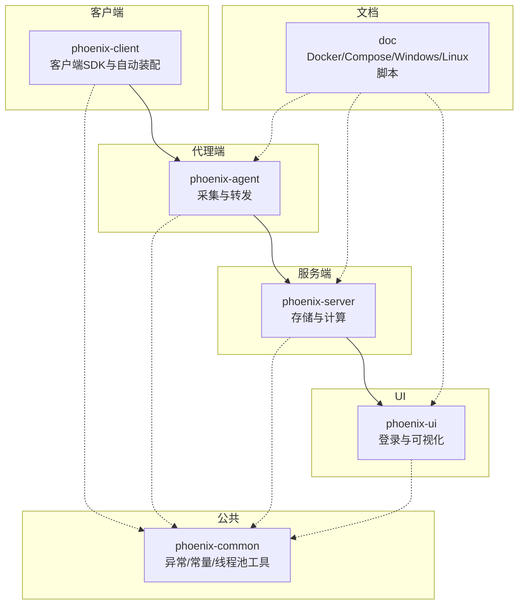
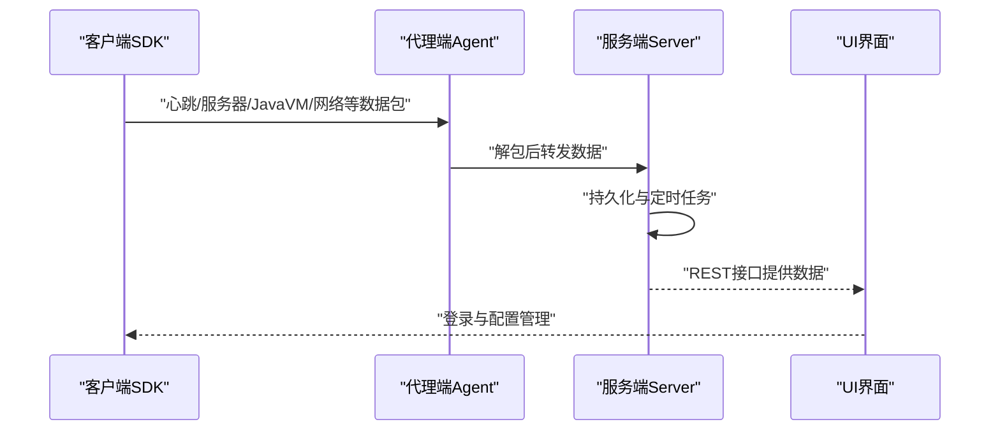
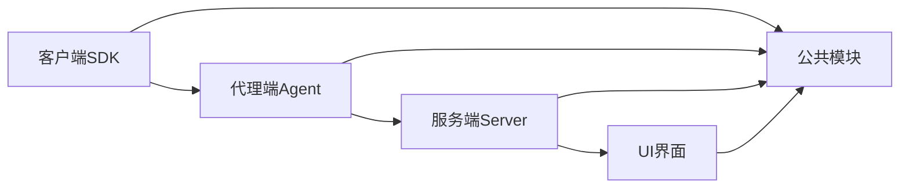

# 常见问题解答

<cite>
**本文引用的文件**
- [phoenix-agent 应用配置](file://phoenix-agent/src/main/resources/application.yml)
- [phoenix-agent 开发环境配置](file://phoenix-agent/src/main/resources/application-dev.yml)
- [phoenix-server 应用配置](file://phoenix-server/src/main/resources/application.yml)
- [phoenix-server 开发环境配置](file://phoenix-server/src/main/resources/application-dev.yml)
- [phoenix-ui 应用配置](file://phoenix-ui/src/main/resources/application.yml)
- [phoenix-ui 开发环境配置](file://phoenix-ui/src/main/resources/application-dev.yml)
- [客户端配置加载与校验](file://phoenix-client/phoenix-client-core/src/main/java/com/gitee/pifeng/monitoring/plug/core/ConfigLoader.java)
- [客户端HTTP连接池配置](file://phoenix-client/phoenix-client-core/src/main/java/com/gitee/pifeng/monitoring/plug/core/EnumPoolingHttpClient.java)
- [代理端HTTP连接池配置](file://phoenix-agent/src/main/java/com/gitee/pifeng/monitoring/agent/config/RestTemplateConfig.java)
- [服务端HTTP连接池配置](file://phoenix-server/src/main/java/com/gitee/pifeng/monitoring/server/config/RestTemplateConfig.java)
- [数据库监控任务（示例）](file://phoenix-server/src/main/java/com/gitee/pifeng/monitoring/server/business/server/monitor/db/DbMonitorJob.java)
- [告警示例与邮件发送门面](file://phoenix-server/src/main/java/com/gitee/pifeng/monitoring/server/business/server/service/impl/AlarmRecordDetailServiceImpl.java)
- [模板消息发送门面](file://phoenix-server/src/main/java/com/gitee/pifeng/monitoring/server/business/server/service/impl/TemplateMsgSendFacadeServiceImpl.java)
- [UI 登录安全配置](file://phoenix-ui/src/main/java/com/gitee/pifeng/monitoring/ui/config/springsecurity/SpringSecurityConfig.java)
- [UI 登录页前端脚本片段](file://phoenix-ui/src/main/resources/templates/user/login.html)
- [UI 登录验证码属性](file://phoenix-ui/src/main/java/com/gitee/pifeng/monitoring/ui/property/auth/selfauth/LoginCaptchaProperties.java)
- [通用异常基类](file://phoenix-common/phoenix-common-core/src/main/java/com/gitee/pifeng/monitoring/common/exception/MonitoringUniversalException.java)
- [数据库异常](file://phoenix-common/phoenix-common-core/src/main/java/com/gitee/pifeng/monitoring/common/exception/DbException.java)
- [线程池边界计算器](file://phoenix-common/phoenix-common-core/src/main/java/com/gitee/pifeng/monitoring/common/abs/AbstractPoolSizeCalculator.java)
- [受监控线程池执行器](file://phoenix-common/phoenix-common-core/src/main/java/com/gitee/pifeng/monitoring/common/threadpool/MonitoredThreadPoolExecutor.java)
- [返回结果信息常量](file://phoenix-common/phoenix-common-core/src/main/java/com/gitee/pifeng/monitoring/common/constant/ResultMsgConstants.java)
- [Linux 自动化打包脚本](file://doc/LinuxServices/auto_package.sh)
</cite>

## 目录
1. [简介](#简介)
2. [项目结构](#项目结构)
3. [核心组件](#核心组件)
4. [架构总览](#架构总览)
5. [详细组件分析](#详细组件分析)
6. [依赖分析](#依赖分析)
7. [性能考量](#性能考量)
8. [故障排查指南](#故障排查指南)
9. [结论](#结论)
10. [附录](#附录)

## 简介
本FAQ面向Phoenix监控系统的使用者与运维人员，聚焦于日常使用中最常见的问题：客户端无法连接代理端、代理端数据采集失败、服务端启动异常、UI界面登录失败、监控数据延迟或缺失、告警通知未送达等。文档提供症状描述、可能原因、分步排查步骤与具体解决方法，并涵盖配置错误（端口冲突、网络配置、数据库连接、SSL）、性能问题（资源占用高、处理延迟、内存泄漏）与兼容性问题（版本差异、第三方组件冲突）。每个问题均给出预防措施与最佳实践，帮助您规避同类问题。

## 项目结构
Phoenix采用多模块架构，包含客户端SDK、代理端Agent、服务端Server与UI界面四大部分，配合公共模块与文档资源。各模块通过独立的Spring Boot配置文件进行运行参数控制，便于容器化与本地开发。

图表来源
- [phoenix-agent 应用配置:1-111](file://phoenix-agent/src/main/resources/application.yml#L1-L111)
- [phoenix-server 应用配置:1-271](file://phoenix-server/src/main/resources/application.yml#L1-L271)
- [phoenix-ui 应用配置:1-238](file://phoenix-ui/src/main/resources/application.yml#L1-L238)

章节来源
- [phoenix-agent 应用配置:1-111](file://phoenix-agent/src/main/resources/application.yml#L1-L111)
- [phoenix-server 应用配置:1-271](file://phoenix-server/src/main/resources/application.yml#L1-L271)
- [phoenix-ui 应用配置:1-238](file://phoenix-ui/src/main/resources/application.yml#L1-L238)

## 核心组件
- 客户端SDK：负责采集业务指标并通过HTTP发送至代理端，内置连接池与超时配置，支持重试与连接复用。
- 代理端Agent：接收客户端上报，解包、鉴权、转发至服务端，内置HTTP客户端连接池与访问日志。
- 服务端Server：接收代理端数据，持久化入库，执行定时任务与告警，提供REST接口与管理端点。
- UI界面：基于Spring Security实现登录认证与会话管理，支持验证码与记住我，提供监控可视化。
- 公共模块：统一异常体系、线程池边界计算与受监控线程池执行器，以及通用常量与工具。

章节来源
- [客户端HTTP连接池配置:139-202](file://phoenix-client/phoenix-client-core/src/main/java/com/gitee/pifeng/monitoring/plug/core/EnumPoolingHttpClient.java#L139-L202)
- [代理端HTTP连接池配置:98-138](file://phoenix-agent/src/main/java/com/gitee/pifeng/monitoring/agent/config/RestTemplateConfig.java#L98-L138)
- [服务端HTTP连接池配置:95-116](file://phoenix-server/src/main/java/com/gitee/pifeng/monitoring/server/config/RestTemplateConfig.java#L95-L116)
- [通用异常基类:1-31](file://phoenix-common/phoenix-common-core/src/main/java/com/gitee/pifeng/monitoring/common/exception/MonitoringUniversalException.java#L1-L31)
- [线程池边界计算器:1-161](file://phoenix-common/phoenix-common-core/src/main/java/com/gitee/pifeng/monitoring/common/abs/AbstractPoolSizeCalculator.java#L1-L161)
- [受监控线程池执行器:1-40](file://phoenix-common/phoenix-common-core/src/main/java/com/gitee/pifeng/monitoring/common/threadpool/MonitoredThreadPoolExecutor.java#L1-L40)

## 架构总览
下图展示了从客户端到代理端、再到服务端与UI的整体调用链路与关键交互点。

图表来源
- [phoenix-agent 应用配置:1-111](file://phoenix-agent/src/main/resources/application.yml#L1-L111)
- [phoenix-server 应用配置:1-271](file://phoenix-server/src/main/resources/application.yml#L1-L271)
- [phoenix-ui 应用配置:1-238](file://phoenix-ui/src/main/resources/application.yml#L1-L238)

## 详细组件分析

### 问题一：客户端无法连接到代理端
- 症状
  - 客户端上报心跳或指标失败，出现连接超时或拒绝。
  - 日志提示连接池耗尽或超时。
- 可能原因
  - 代理端端口未开放或被防火墙拦截。
  - 客户端配置的代理端URL错误或路径不正确。
  - 代理端HTTP连接池过小，无法支撑并发上报。
  - 客户端HTTP超时配置过短。
- 排查步骤
  - 确认代理端监听端口与上下文路径配置正确。
  - 使用curl或浏览器访问代理端健康端点与Swagger接口。
  - 检查客户端配置文件中的代理端URL与协议（HTTP/HTTPS）。
  - 查看代理端访问日志与错误日志。
  - 检查客户端与代理端网络连通性（ping/ telnet/ nmap）。
- 解决方案
  - 调整代理端HTTP连接池最大连接数与路由限制。
  - 适当增大客户端连接超时、套接字超时与连接池等待超时。
  - 如需HTTPS，请确保证书有效且客户端信任。
- 预防与最佳实践
  - 在生产环境固定端口并加入防火墙白名单。
  - 将客户端与代理端置于同一内网或低延迟网络。
  - 对客户端连接池进行容量评估与压测。

章节来源
- [phoenix-agent 应用配置:1-111](file://phoenix-agent/src/main/resources/application.yml#L1-L111)
- [phoenix-agent 开发环境配置:1-3](file://phoenix-agent/src/main/resources/application-dev.yml#L1-L3)
- [客户端配置加载与校验:402-423](file://phoenix-client/phoenix-client-core/src/main/java/com/gitee/pifeng/monitoring/plug/core/ConfigLoader.java#L402-L423)
- [客户端HTTP连接池配置:139-202](file://phoenix-client/phoenix-client-core/src/main/java/com/gitee/pifeng/monitoring/plug/core/EnumPoolingHttpClient.java#L139-L202)
- [代理端HTTP连接池配置:98-138](file://phoenix-agent/src/main/java/com/gitee/pifeng/monitoring/agent/config/RestTemplateConfig.java#L98-L138)

### 问题二：代理端数据采集失败
- 症状
  - 代理端接收数据后无法转发到服务端，出现异常或丢包。
  - 服务端侧无对应实例或指标。
- 可能原因
  - 代理端HTTP客户端连接池过小，导致获取连接超时。
  - 服务端数据库连接异常或不可达。
  - 代理端与服务端之间网络不稳定或DNS解析失败。
- 排查步骤
  - 检查代理端服务端URL配置与协议。
  - 查看代理端访问日志与异常堆栈。
  - 使用代理端健康端点确认自身状态。
  - 验证服务端数据库连接串与账号权限。
- 解决方案
  - 提升代理端与服务端HTTP连接池上限与路由限制。
  - 优化数据库连接池参数，确保连接可用性。
  - 使用内网域名或固定IP，减少DNS抖动。
- 预防与最佳实践
  - 对关键链路进行压力测试，评估连接池容量。
  - 启用连接健康检查与重试策略。
  - 分离数据库读写，必要时引入中间件。

章节来源
- [phoenix-agent 应用配置:1-111](file://phoenix-agent/src/main/resources/application.yml#L1-L111)
- [phoenix-server 应用配置:117-184](file://phoenix-server/src/main/resources/application.yml#L117-L184)
- [代理端HTTP连接池配置:98-138](file://phoenix-agent/src/main/java/com/gitee/pifeng/monitoring/agent/config/RestTemplateConfig.java#L98-L138)
- [服务端HTTP连接池配置:95-116](file://phoenix-server/src/main/java/com/gitee/pifeng/monitoring/server/config/RestTemplateConfig.java#L95-L116)

### 问题三：服务端启动异常
- 症状
  - 启动时报数据库连接失败、端口占用、配置加载异常。
  - Swagger健康端点不可用或返回错误。
- 可能原因
  - 数据库URL、用户名、密码错误或数据库未初始化。
  - 端口被占用（默认端口与上下文路径冲突）。
  - 配置文件profile未正确激活或属性缺失。
- 排查步骤
  - 检查开发环境配置文件中的数据库连接串与凭据。
  - 使用netstat/lsof确认端口占用情况。
  - 查看服务端日志中的异常堆栈与SQL报错。
  - 确认Quartz与MyBatis Plus配置是否正确。
- 解决方案
  - 修改数据库连接参数或先初始化数据库schema。
  - 更改服务端端口或停止占用进程。
  - 补充缺失的配置项，确保profile生效。
- 预防与最佳实践
  - 使用容器编排时固定端口映射与环境变量。
  - 在CI/CD中加入数据库初始化与连通性检查。
  - 对敏感配置使用密文或外部化配置中心。

章节来源
- [phoenix-server 开发环境配置:1-38](file://phoenix-server/src/main/resources/application-dev.yml#L1-L38)
- [phoenix-server 应用配置:117-184](file://phoenix-server/src/main/resources/application.yml#L117-L184)
- [phoenix-server 应用配置:67-105](file://phoenix-server/src/main/resources/application.yml#L67-L105)

### 问题四：UI界面登录失败
- 症状
  - 登录页面无法提交、验证码无效、登录后跳转异常。
  - 会话超时或被强制下线。
- 可能原因
  - Spring Security配置错误或未启用。
  - 验证码未启用但前端仍要求输入。
  - 数据源未配置或会话存储异常。
  - 浏览器禁用Cookie或跨域问题。
- 排查步骤
  - 检查UI配置文件中的认证类型与CAS/自建认证开关。
  - 确认验证码属性与登录页脚本联动。
  - 查看登录失败处理器与会话注册表配置。
  - 使用开发者工具查看登录请求与响应头。
- 解决方案
  - 根据认证类型启用相应安全配置。
  - 若启用验证码，确保验证码接口可用且未过期。
  - 配置JDBC会话存储并初始化表结构。
- 预防与最佳实践
  - 生产环境启用HTTPS与强密码策略。
  - 合理设置会话超时与最大并发会话数。
  - 对登录接口增加限流与防护。

章节来源
- [phoenix-ui 开发环境配置:31-49](file://phoenix-ui/src/main/resources/application-dev.yml#L31-L49)
- [UI 登录安全配置:33-166](file://phoenix-ui/src/main/java/com/gitee/pifeng/monitoring/ui/config/springsecurity/SpringSecurityConfig.java#L33-L166)
- [UI 登录页前端脚本片段:157-174](file://phoenix-ui/src/main/resources/templates/user/login.html#L157-L174)
- [UI 登录验证码属性:1-23](file://phoenix-ui/src/main/java/com/gitee/pifeng/monitoring/ui/property/auth/selfauth/LoginCaptchaProperties.java#L1-L23)

### 问题五：监控数据延迟或缺失
- 症状
  - UI仪表盘数据更新滞后、曲线断层或为空。
  - 服务端日志显示采集任务执行异常。
- 可能原因
  - 客户端上报周期过长或网络抖动导致丢包。
  - 服务端数据库写入压力过大或索引缺失。
  - 代理端转发失败或限流。
- 排查步骤
  - 检查客户端上报周期与网络质量。
  - 查看服务端数据库慢SQL与连接池状态。
  - 核查代理端转发队列与重试策略。
- 解决方案
  - 优化客户端上报频率与批处理大小。
  - 为高频查询字段建立索引，调整连接池参数。
  - 为代理端与服务端分别扩容连接池。
- 预防与最佳实践
  - 对热点指标进行聚合与降采样。
  - 使用异步写入与批量提交提升吞吐。
  - 建立数据一致性校验与报警。

章节来源
- [phoenix-server 应用配置:117-184](file://phoenix-server/src/main/resources/application.yml#L117-L184)
- [phoenix-agent 应用配置:1-111](file://phoenix-agent/src/main/resources/application.yml#L1-L111)

### 问题六：告警通知未送达
- 症状
  - 触发告警但短信/邮件未收到，或记录为空。
- 可能原因
  - 告警通道配置缺失（手机号、邮箱）。
  - 邮件SMTP未启用SSL或凭据错误。
  - 短信通道未接入或签名未通过。
- 排查步骤
  - 检查告警配置中的通道与收件人/号码。
  - 验证邮件服务端口、SSL与认证参数。
  - 查看告警示例与发送门面对应实现。
- 解决方案
  - 补充完整告警收件人与通道参数。
  - 修正邮件SSL与端口配置，确保网络可达。
  - 集成短信通道并完成签名与模板审核。
- 预防与最佳实践
  - 多通道并行发送，失败重试与回退策略。
  - 对外发通道进行灰度与压测。
  - 记录发送结果并建立可观测性。

章节来源
- [phoenix-server 开发环境配置:17-38](file://phoenix-server/src/main/resources/application-dev.yml#L17-L38)
- [告警示例与邮件发送门面:136-198](file://phoenix-server/src/main/java/com/gitee/pifeng/monitoring/server/business/server/service/impl/AlarmRecordDetailServiceImpl.java#L136-L198)
- [模板消息发送门面:33-71](file://phoenix-server/src/main/java/com/gitee/pifeng/monitoring/server/business/server/service/impl/TemplateMsgSendFacadeServiceImpl.java#L33-L71)

### 问题七：配置错误导致的问题（端口冲突、网络配置、数据库连接、SSL）
- 症状
  - 启动失败、连接失败、证书错误、跨域异常。
- 可能原因
  - 多个模块使用相同端口或上下文路径冲突。
  - 数据库URL拼写错误、时区与字符集不一致。
  - SSL证书过期或不受信任，或未启用。
- 排查步骤
  - 统一端口分配并检查占用。
  - 校验数据库URL、驱动、时区与编码。
  - 检查SSL证书路径、别名与工厂类配置。
- 解决方案
  - 为Agent/Server/UI分别配置独立端口与上下文路径。
  - 使用标准驱动与推荐连接参数，启用SSL并校验证书。
  - 在容器中挂载证书或使用可信CA签发。
- 预防与最佳实践
  - 使用环境变量与配置文件分离敏感信息。
  - 在容器编排中统一管理端口与网络策略。

章节来源
- [phoenix-agent 开发环境配置:1-3](file://phoenix-agent/src/main/resources/application-dev.yml#L1-L3)
- [phoenix-server 开发环境配置:1-38](file://phoenix-server/src/main/resources/application-dev.yml#L1-L38)
- [phoenix-ui 开发环境配置:1-49](file://phoenix-ui/src/main/resources/application-dev.yml#L1-L49)

### 问题八：性能相关问题（占用过高、处理延迟、内存泄漏）
- 症状
  - CPU/内存持续升高，GC频繁，响应延迟上升。
- 可能原因
  - 线程池配置不当，队列积压或任务阻塞。
  - 连接池过大导致资源争用，或过小导致排队。
  - 缺少内存泄漏检测与监控。
- 排查步骤
  - 使用线程池边界计算器评估最优线程数与队列容量。
  - 监控连接池活跃连接与等待时间。
  - 分析GC日志与堆快照定位泄漏点。
- 解决方案
  - 调整核心线程数、最大线程数与队列长度。
  - 合理设置连接池最大连接与路由限制。
  - 引入受监控线程池执行器，记录拒绝任务数。
- 预防与最佳实践
  - 对关键线程池与连接池做容量规划与压测。
  - 建立性能基线与告警阈值。
  - 定期巡检与清理临时对象。

章节来源
- [线程池边界计算器:1-161](file://phoenix-common/phoenix-common-core/src/main/java/com/gitee/pifeng/monitoring/common/abs/AbstractPoolSizeCalculator.java#L1-L161)
- [受监控线程池执行器:1-40](file://phoenix-common/phoenix-common-core/src/main/java/com/gitee/pifeng/monitoring/common/threadpool/MonitoredThreadPoolExecutor.java#L1-L40)
- [客户端HTTP连接池配置:139-202](file://phoenix-client/phoenix-client-core/src/main/java/com/gitee/pifeng/monitoring/plug/core/EnumPoolingHttpClient.java#L139-L202)
- [代理端HTTP连接池配置:98-138](file://phoenix-agent/src/main/java/com/gitee/pifeng/monitoring/agent/config/RestTemplateConfig.java#L98-L138)
- [服务端HTTP连接池配置:95-116](file://phoenix-server/src/main/java/com/gitee/pifeng/monitoring/server/config/RestTemplateConfig.java#L95-L116)

### 问题九：兼容性问题（版本差异、第三方组件冲突）
- 症状
  - 启动报错、功能异常、接口不兼容。
- 可能原因
  - Spring Boot、Spring Security、MyBatis/Plus版本不匹配。
  - Undertow/Jetty等Web容器版本差异导致行为不一致。
  - 第三方组件（如Druid、Quartz）版本冲突。
- 排查步骤
  - 对比各模块pom中的依赖版本，锁定兼容范围。
  - 关注容器与JDK版本对注解与AOP的影响。
  - 检查第三方组件的配置项是否随版本变更。
- 解决方案
  - 使用统一的BOM或父POM管理版本。
  - 在容器环境中统一JDK与Web容器版本。
  - 对关键组件进行回归测试与灰度发布。
- 预防与最佳实践
  - 建立依赖审计清单与升级计划。
  - 使用容器镜像固化版本，避免漂移。

章节来源
- [phoenix-agent 应用配置:1-111](file://phoenix-agent/src/main/resources/application.yml#L1-L111)
- [phoenix-server 应用配置:1-271](file://phoenix-server/src/main/resources/application.yml#L1-L271)
- [phoenix-ui 应用配置:1-238](file://phoenix-ui/src/main/resources/application.yml#L1-L238)

## 依赖分析
以下依赖关系图展示了模块间的关键耦合点与数据流向。

图表来源
- [phoenix-agent 应用配置:1-111](file://phoenix-agent/src/main/resources/application.yml#L1-L111)
- [phoenix-server 应用配置:1-271](file://phoenix-server/src/main/resources/application.yml#L1-L271)
- [phoenix-ui 应用配置:1-238](file://phoenix-ui/src/main/resources/application.yml#L1-L238)

章节来源
- [phoenix-agent 应用配置:1-111](file://phoenix-agent/src/main/resources/application.yml#L1-L111)
- [phoenix-server 应用配置:1-271](file://phoenix-server/src/main/resources/application.yml#L1-L271)
- [phoenix-ui 应用配置:1-238](file://phoenix-ui/src/main/resources/application.yml#L1-L238)

## 性能考量
- 连接池与超时
  - 客户端与代理端/服务端均配置了池化HTTP客户端，需根据并发与延迟需求调整最大连接数、路由限制与超时参数。
- 线程池与队列
  - 使用线程池边界计算器评估最优配置，结合受监控线程池执行器观察拒绝任务数。
- 数据库与缓存
  - 合理设置数据库连接池参数与索引，启用Caffeine缓存以降低查询压力。
- 日志与监控
  - 启用访问日志与慢SQL记录，结合Druid监控面板定位瓶颈。

章节来源
- [客户端HTTP连接池配置:139-202](file://phoenix-client/phoenix-client-core/src/main/java/com/gitee/pifeng/monitoring/plug/core/EnumPoolingHttpClient.java#L139-L202)
- [代理端HTTP连接池配置:98-138](file://phoenix-agent/src/main/java/com/gitee/pifeng/monitoring/agent/config/RestTemplateConfig.java#L98-L138)
- [服务端HTTP连接池配置:95-116](file://phoenix-server/src/main/java/com/gitee/pifeng/monitoring/server/config/RestTemplateConfig.java#L95-L116)
- [线程池边界计算器:1-161](file://phoenix-common/phoenix-common-core/src/main/java/com/gitee/pifeng/monitoring/common/abs/AbstractPoolSizeCalculator.java#L1-L161)
- [phoenix-server 应用配置:38-47](file://phoenix-server/src/main/resources/application.yml#L38-L47)
- [phoenix-server 应用配置:117-184](file://phoenix-server/src/main/resources/application.yml#L117-L184)

## 故障排查指南
- 通用排查流程
  - 明确症状与影响范围（客户端/代理端/服务端/UI）。
  - 检查对应模块的日志级别与输出位置。
  - 校验配置文件与环境变量，确保profile激活。
  - 使用健康端点与管理端点快速定位问题。
  - 逐层隔离（网络→连接池→数据库→业务逻辑）。
- 常用命令与工具
  - 端口检查：netstat/lsof
  - 连通性：ping/telnet/curl
  - 日志：tail/less/awk/grep
  - 数据库：mysql/sqlplus + 慢查询分析
  - JVM：jstat/jstack/jmap（如需）

章节来源
- [phoenix-agent 应用配置:59-74](file://phoenix-agent/src/main/resources/application.yml#L59-L74)
- [phoenix-server 应用配置:219-234](file://phoenix-server/src/main/resources/application.yml#L219-L234)
- [phoenix-ui 应用配置:187-202](file://phoenix-ui/src/main/resources/application.yml#L187-L202)

## 结论
通过规范的配置管理、合理的性能参数与完善的监控告警，Phoenix监控系统可在复杂环境中保持稳定高效运行。建议在上线前完成端到端联调与压测，建立标准化的运维流程与应急预案，持续优化系统性能与可靠性。

## 附录
- 自动化打包与部署参考
  - 使用Linux自动化脚本一键下载JDK/Maven并构建项目。
- 常用返回信息
  - 成功/失败统一常量便于前端与接口层处理。

章节来源
- [Linux 自动化打包脚本:1-24](file://doc/LinuxServices/auto_package.sh#L1-L24)
- [返回结果信息常量:24-34](file://phoenix-common/phoenix-common-core/src/main/java/com/gitee/pifeng/monitoring/common/constant/ResultMsgConstants.java#L24-L34)