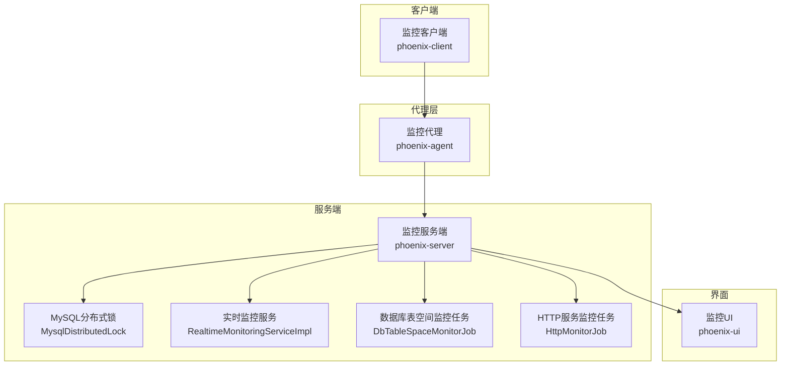
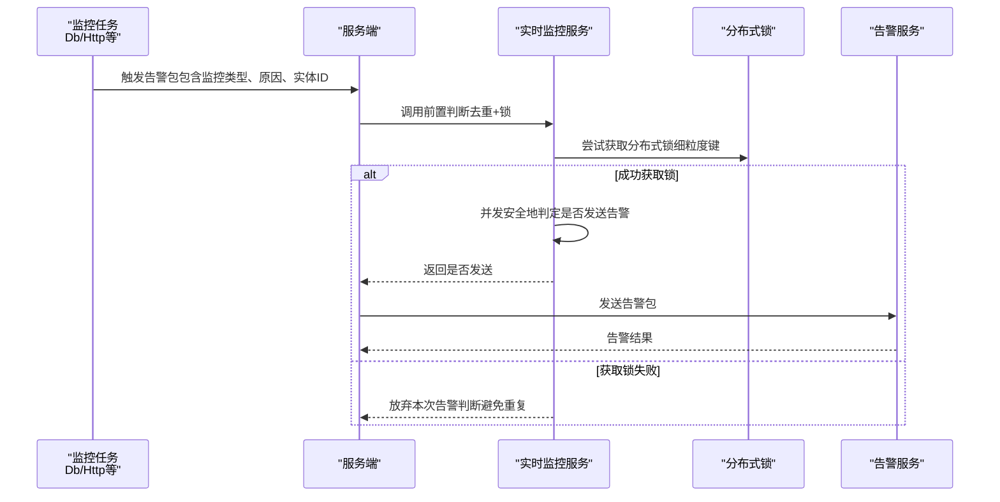
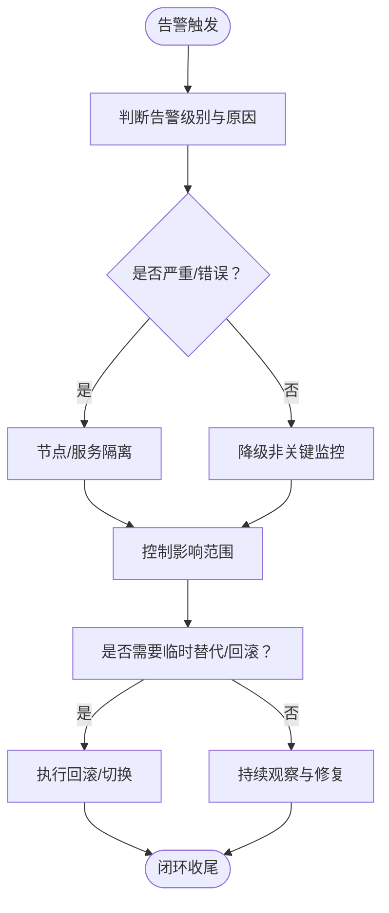
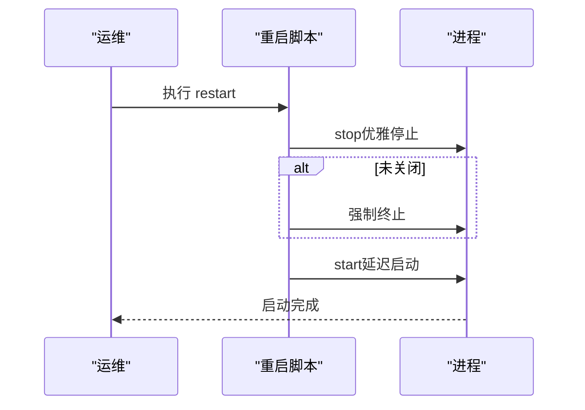
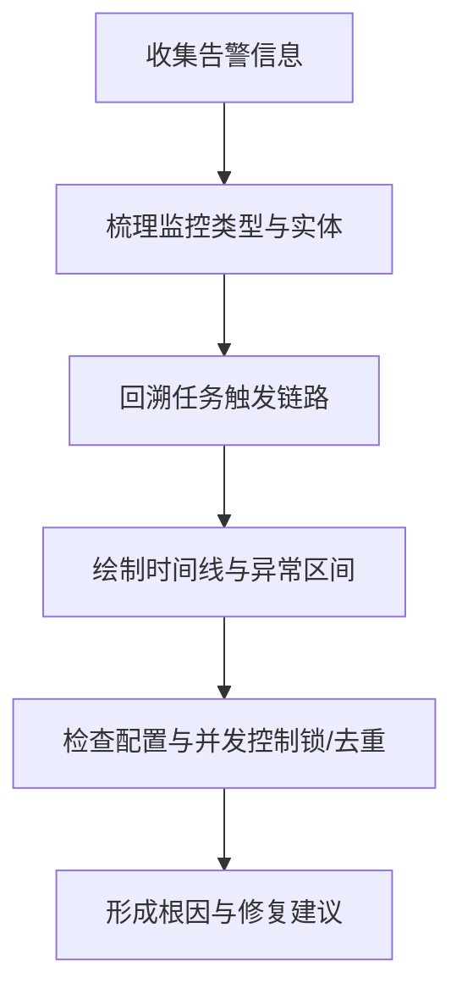
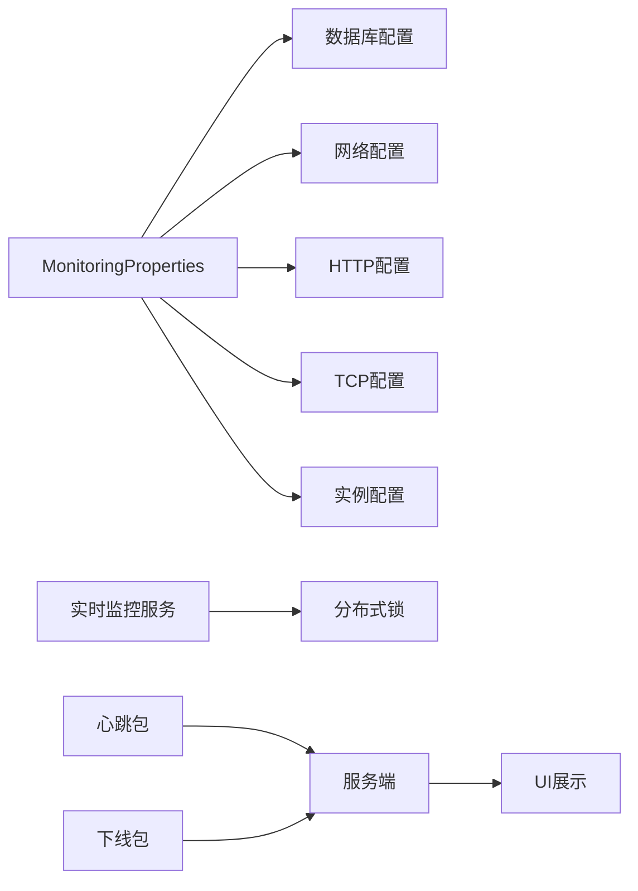

# 应急处理

<cite>
**本文引用的文件**   
- [phoenix-server/src/main/java/com/gitee/pifeng/monitoring/server/business/server/service/impl/RealtimeMonitoringServiceImpl.java](file://phoenix-server/src/main/java/com/gitee/pifeng/monitoring/server/business/server/service/impl/RealtimeMonitoringServiceImpl.java)
- [phoenix-server/src/main/java/com/gitee/pifeng/monitoring/server/business/server/monitor/db/DbTableSpaceMonitorJob.java](file://phoenix-server/src/main/java/com/gitee/pifeng/monitoring/server/business/server/monitor/db/DbTableSpaceMonitorJob.java)
- [phoenix-server/src/main/java/com/gitee/pifeng/monitoring/server/business/server/core/MysqlDistributedLock.java](file://phoenix-server/src/main/java/com/gitee/pifeng/monitoring/server/business/server/core/MysqlDistributedLock.java)
- [phoenix-server/src/main/java/com/gitee/pifeng/monitoring/server/business/server/monitor/http/HttpMonitorJob.java](file://phoenix-server/src/main/java/com/gitee/pifeng/monitoring/server/business/server/monitor/http/HttpMonitorJob.java)
- [phoenix-server/src/main/resources/application.yml](file://phoenix-server/src/main/resources/application.yml)
- [phoenix-ui/src/main/java/com/gitee/pifeng/monitoring/ui/business/web/entity/MonitorAlarmRecord.java](file://phoenix-ui/src/main/java/com/gitee/pifeng/monitoring/ui/business/web/entity/MonitorAlarmRecord.java)
- [phoenix-ui/src/main/java/com/gitee/pifeng/monitoring/ui/business/web/entity/MonitorRealtimeMonitoring.java](file://phoenix-ui/src/main/java/com/gitee/pifeng/monitoring/ui/business/web/entity/MonitorRealtimeMonitoring.java)
- [phoenix-ui/src/main/resources/static/modules/server/serverDetail.js](file://phoenix-ui/src/main/resources/static/modules/server/serverDetail.js)
- [phoenix-common/phoenix-common-core/src/main/java/com/gitee/pifeng/monitoring/common/constant/alarm/AlarmLevelEnums.java](file://phoenix-common/phoenix-common-core/src/main/java/com/gitee/pifeng/monitoring/common/constant/alarm/AlarmLevelEnums.java)
- [phoenix-common/phoenix-common-core/src/main/java/com/gitee/pifeng/monitoring/common/constant/alarm/AlarmReasonEnums.java](file://phoenix-common/phoenix-common-core/src/main/java/com/gitee/pifeng/monitoring/common/constant/alarm/AlarmReasonEnums.java)
- [phoenix-common/phoenix-common-core/src/main/java/com/gitee/pifeng/monitoring/common/constant/MonitorTypeEnums.java](file://phoenix-common/phoenix-common-core/src/main/java/com/gitee/pifeng/monitoring/common/constant/MonitorTypeEnums.java)
- [phoenix-common/phoenix-common-core/src/main/java/com/gitee/pifeng/monitoring/common/property/server/MonitoringProperties.java](file://phoenix-common/phoenix-common-core/src/main/java/com/gitee/pifeng/monitoring/common/property/server/MonitoringProperties.java)
- [phoenix-common/phoenix-common-core/src/main/java/com/gitee/pifeng/monitoring/common/property/server/MonitoringDbProperties.java](file://phoenix-common/phoenix-common-core/src/main/java/com/gitee/pifeng/monitoring/common/property/server/MonitoringDbProperties.java)
- [phoenix-common/phoenix-common-core/src/main/java/com/gitee/pifeng/monitoring/common/property/server/MonitoringDbStatusProperties.java](file://phoenix-common/phoenix-common-core/src/main/java/com/gitee/pifeng/monitoring/common/property/server/MonitoringDbStatusProperties.java)
- [phoenix-common/phoenix-common-core/src/main/java/com/gitee/pifeng/monitoring/common/property/server/MonitoringDbTableSpaceProperties.java](file://phoenix-common/phoenix-common-core/src/main/java/com/gitee/pifeng/monitoring/common/property/server/MonitoringDbTableSpaceProperties.java)
- [phoenix-common/phoenix-common-core/src/main/java/com/gitee/pifeng/monitoring/common/property/server/MonitoringNetworkProperties.java](file://phoenix-common/phoenix-common-core/src/main/java/com/gitee/pifeng/monitoring/common/property/server/MonitoringNetworkProperties.java)
- [phoenix-common/phoenix-common-core/src/main/java/com/gitee/pifeng/monitoring/common/property/server/MonitoringInstanceProperties.java](file://phoenix-common/phoenix-common-core/src/main/java/com/gitee/pifeng/monitoring/common/property/server/MonitoringInstanceProperties.java)
- [phoenix-common/phoenix-common-core/src/main/java/com/gitee/pifeng/monitoring/common/property/server/MonitoringInstanceStatusProperties.java](file://phoenix-common/phoenix-common-core/src/main/java/com/gitee/pifeng/monitoring/common/property/server/MonitoringInstanceStatusProperties.java)
- [phoenix-common/phoenix-common-core/src/main/java/com/gitee/pifeng/monitoring/common/property/client/MonitoringHeartbeatProperties.java](file://phoenix-common/phoenix-common-core/src/main/java/com/gitee/pifeng/monitoring/common/property/client/MonitoringHeartbeatProperties.java)
- [phoenix-common/phoenix-common-core/src/main/java/com/gitee/pifeng/monitoring/common/dto/HeartbeatPackage.java](file://phoenix-common/phoenix-common-core/src/main/java/com/gitee/pifeng/monitoring/common/dto/HeartbeatPackage.java)
- [phoenix-agent/src/main/java/com/gitee/pifeng/monitoring/agent/business/client/controller/HeartbeatController.java](file://phoenix-agent/src/main/java/com/gitee/pifeng/monitoring/agent/business/client/controller/HeartbeatController.java)
- [phoenix-agent/src/main/java/com/gitee/pifeng/monitoring/agent/business/client/service/impl/OfflineServiceImpl.java](file://phoenix-agent/src/main/java/com/gitee/pifeng/monitoring/agent/business/client/service/impl/OfflineServiceImpl.java)
- [phoenix-agent/src/main/java/com/gitee/pifeng/monitoring/agent/business/client/service/IOfflineService.java](file://phoenix-agent/src/main/java/com/gitee/pifeng/monitoring/agent/business/client/service/IOfflineService.java)
- [phoenix-agent/src/main/java/com/gitee/pifeng/monitoring/agent/business/server/service/IOfflineService.java](file://phoenix-agent/src/main/java/com/gitee/pifeng/monitoring/agent/business/server/service/IOfflineService.java)
- [phoenix-agent/src/main/java/com/gitee/pifeng/monitoring/agent/business/server/service/impl/ServerBusinessHandler.java](file://phoenix-agent/src/main/java/com/gitee/pifeng/monitoring/agent/business/server/service/impl/ServerBusinessHandler.java)
- [phoenix-common/phoenix-common-core/src/main/java/com/gitee/pifeng/monitoring/common/property/server/MonitoringHttpStatusProperties.java](file://phoenix-common/phoenix-common-core/src/main/java/com/gitee/pifeng/monitoring/common/property/server/MonitoringHttpStatusProperties.java)
- [phoenix-common/phoenix-common-core/src/main/java/com/gitee/pifeng/monitoring/common/property/server/MonitoringTcpProperties.java](file://phoenix-common/phoenix-common-core/src/main/java/com/gitee/pifeng/monitoring/common/property/server/MonitoringTcpProperties.java)
- [phoenix-common/phoenix-common-core/src/main/java/com/gitee/pifeng/monitoring/common/property/server/MonitoringHttpProperties.java](file://phoenix-common/phoenix-common-core/src/main/java/com/gitee/pifeng/monitoring/common/property/server/MonitoringHttpProperties.java)
- [phoenix-common/phoenix-common-core/src/main/java/com/gitee/pifeng/monitoring/common/property/server/MonitoringServerProperties.java](file://phoenix-common/phoenix-common-core/src/main/java/com/gitee/pifeng/monitoring/common/property/server/MonitoringServerProperties.java)
- [phoenix-common/phoenix-common-core/src/main/java/com/gitee/pifeng/monitoring/common/property/client/MonitoringCommHttpProperties.java](file://phoenix-common/phoenix-common-core/src/main/java/com/gitee/pifeng/monitoring/common/property/client/MonitoringCommHttpProperties.java)
- [phoenix-client/phoenix-client-core/src/main/java/com/gitee/pifeng/monitoring/plug/core/ConfigLoader.java](file://phoenix-client/phoenix-client-core/src/main/java/com/gitee/pifeng/monitoring/plug/core/ConfigLoader.java)
- [phoenix-server/src/main/java/com/gitee/pifeng/monitoring/server/business/server/service/impl/ServerDiskHistoryServiceImpl.java](file://phoenix-server/src/main/java/com/gitee/pifeng/monitoring/server/business/server/service/impl/ServerDiskHistoryServiceImpl.java)
- [doc/LinuxServices/phoenix-server/phoenix_server.sh](file://doc/LinuxServices/phoenix-server/phoenix_server.sh)
- [doc/LinuxServices/phoenix-ui/phoenix_ui.sh](file://doc/LinuxServices/phoenix-ui/phoenix_ui.sh)
- [doc/LinuxServices/phoenix-agent/phoenix_agent.sh](file://doc/LinuxServices/phoenix-agent/phoenix_agent.sh)
- [doc/WindowsServices/phoenix-server/service_restart.cmd](file://doc/WindowsServices/phoenix-server/service_restart.cmd)
- [doc/WindowsServices/phoenix-ui/service_restart.cmd](file://doc/WindowsServices/phoenix-ui/service_restart.cmd)
- [doc/数据库设计/sql/mysql/phoenix.sql](file://doc/数据库设计/sql/mysql/phoenix.sql)
</cite>

## 目录
1. [简介](#简介)
2. [项目结构](#项目结构)
3. [核心组件](#核心组件)
4. [架构总览](#架构总览)
5. [详细组件分析](#详细组件分析)
6. [依赖关系分析](#依赖关系分析)
7. [性能考量](#性能考量)
8. [故障排查指南](#故障排查指南)
9. [结论](#结论)
10. [附录](#附录)

## 简介
本文件面向Phoenix监控系统，围绕应急处理与故障管理，构建一套可落地的应急响应机制与处置流程，覆盖故障分类与分级、应急响应团队职责、故障报告与升级流程、故障隔离与快速恢复、根因分析方法以及故障预防与持续改进。文档结合系统现有模块（告警、监控、配置、服务与客户端通信、分布式锁、历史数据等），给出可操作的流程与技术手段。

## 项目结构
Phoenix由四大部分组成：监控客户端（Client）、监控代理（Agent）、监控服务端（Server）、监控UI（UI）。各部分通过心跳、信息包、HTTP/网络/TCP/HTTP服务等监控任务产生数据，服务端进行聚合、去重与告警决策，UI负责展示与运维操作。

**图示来源**
- [phoenix-server/src/main/java/com/gitee/pifeng/monitoring/server/business/server/service/impl/RealtimeMonitoringServiceImpl.java:55-89](file://phoenix-server/src/main/java/com/gitee/pifeng/monitoring/server/business/server/service/impl/RealtimeMonitoringServiceImpl.java#L55-L89)
- [phoenix-server/src/main/java/com/gitee/pifeng/monitoring/server/business/server/core/MysqlDistributedLock.java:94-125](file://phoenix-server/src/main/java/com/gitee/pifeng/monitoring/server/business/server/core/MysqlDistributedLock.java#L94-L125)
- [phoenix-server/src/main/java/com/gitee/pifeng/monitoring/server/business/server/monitor/db/DbTableSpaceMonitorJob.java:202-232](file://phoenix-server/src/main/java/com/gitee/pifeng/monitoring/server/business/server/monitor/db/DbTableSpaceMonitorJob.java#L202-L232)
- [phoenix-server/src/main/java/com/gitee/pifeng/monitoring/server/business/server/monitor/http/HttpMonitorJob.java:458-467](file://phoenix-server/src/main/java/com/gitee/pifeng/monitoring/server/business/server/monitor/http/HttpMonitorJob.java#L458-L467)

**章节来源**
- [phoenix-server/src/main/java/com/gitee/pifeng/monitoring/server/business/server/service/impl/RealtimeMonitoringServiceImpl.java:55-89](file://phoenix-server/src/main/java/com/gitee/pifeng/monitoring/server/business/server/service/impl/RealtimeMonitoringServiceImpl.java#L55-L89)
- [phoenix-server/src/main/java/com/gitee/pifeng/monitoring/server/business/server/core/MysqlDistributedLock.java:94-125](file://phoenix-server/src/main/java/com/gitee/pifeng/monitoring/server/business/server/core/MysqlDistributedLock.java#L94-L125)
- [phoenix-server/src/main/java/com/gitee/pifeng/monitoring/server/business/server/monitor/db/DbTableSpaceMonitorJob.java:202-232](file://phoenix-server/src/main/java/com/gitee/pifeng/monitoring/server/business/server/monitor/db/DbTableSpaceMonitorJob.java#L202-L232)
- [phoenix-server/src/main/java/com/gitee/pifeng/monitoring/server/business/server/monitor/http/HttpMonitorJob.java:458-467](file://phoenix-server/src/main/java/com/gitee/pifeng/monitoring/server/business/server/monitor/http/HttpMonitorJob.java#L458-L467)

## 核心组件
- 告警与监控配置：通过服务端配置属性统一管理各类监控开关与告警策略，如数据库、网络、HTTP、TCP、实例、服务器等。
- 实时监控与去重：服务端对告警进行前置判断与分布式锁保护，避免重复告警与并发冲突。
- 监控任务：数据库表空间、HTTP服务状态等定时任务负责发现异常并触发告警。
- 客户端与代理：心跳包与下线包用于维持连接与标记离线，支持服务端与代理间通信。
- UI与历史数据：UI展示告警与监控详情，服务端持久化历史监控数据（如磁盘）。

**章节来源**
- [phoenix-common/phoenix-common-core/src/main/java/com/gitee/pifeng/monitoring/common/property/server/MonitoringProperties.java:19-61](file://phoenix-common/phoenix-common-core/src/main/java/com/gitee/pifeng/monitoring/common/property/server/MonitoringProperties.java#L19-L61)
- [phoenix-common/phoenix-common-core/src/main/java/com/gitee/pifeng/monitoring/common/constant/alarm/AlarmLevelEnums.java:13-38](file://phoenix-common/phoenix-common-core/src/main/java/com/gitee/pifeng/monitoring/common/constant/alarm/AlarmLevelEnums.java#L13-L38)
- [phoenix-common/phoenix-common-core/src/main/java/com/gitee/pifeng/monitoring/common/constant/alarm/AlarmReasonEnums.java:11-31](file://phoenix-common/phoenix-common-core/src/main/java/com/gitee/pifeng/monitoring/common/constant/alarm/AlarmReasonEnums.java#L11-L31)
- [phoenix-common/phoenix-common-core/src/main/java/com/gitee/pifeng/monitoring/common/constant/MonitorTypeEnums.java:11-46](file://phoenix-common/phoenix-common-core/src/main/java/com/gitee/pifeng/monitoring/common/constant/MonitorTypeEnums.java#L11-L46)
- [phoenix-server/src/main/java/com/gitee/pifeng/monitoring/server/business/server/service/impl/RealtimeMonitoringServiceImpl.java:55-89](file://phoenix-server/src/main/java/com/gitee/pifeng/monitoring/server/business/server/service/impl/RealtimeMonitoringServiceImpl.java#L55-L89)
- [phoenix-server/src/main/java/com/gitee/pifeng/monitoring/server/business/server/monitor/db/DbTableSpaceMonitorJob.java:202-232](file://phoenix-server/src/main/java/com/gitee/pifeng/monitoring/server/business/server/monitor/db/DbTableSpaceMonitorJob.java#L202-L232)
- [phoenix-server/src/main/java/com/gitee/pifeng/monitoring/server/business/server/monitor/http/HttpMonitorJob.java:458-467](file://phoenix-server/src/main/java/com/gitee/pifeng/monitoring/server/business/server/monitor/http/HttpMonitorJob.java#L458-L467)
- [phoenix-common/phoenix-common-core/src/main/java/com/gitee/pifeng/monitoring/common/dto/HeartbeatPackage.java:14-27](file://phoenix-common/phoenix-common-core/src/main/java/com/gitee/pifeng/monitoring/common/dto/HeartbeatPackage.java#L14-L27)
- [phoenix-agent/src/main/java/com/gitee/pifeng/monitoring/agent/business/client/controller/HeartbeatController.java:26-40](file://phoenix-agent/src/main/java/com/gitee/pifeng/monitoring/agent/business/client/controller/HeartbeatController.java#L26-L40)
- [phoenix-agent/src/main/java/com/gitee/pifeng/monitoring/agent/business/client/service/impl/OfflineServiceImpl.java:30-36](file://phoenix-agent/src/main/java/com/gitee/pifeng/monitoring/agent/business/client/service/impl/OfflineServiceImpl.java#L30-L36)
- [phoenix-server/src/main/java/com/gitee/pifeng/monitoring/server/business/server/service/impl/ServerDiskHistoryServiceImpl.java:38-59](file://phoenix-server/src/main/java/com/gitee/pifeng/monitoring/server/business/server/service/impl/ServerDiskHistoryServiceImpl.java#L38-L59)

## 架构总览
以下序列图展示从监控任务发现异常到服务端进行去重与告警决策的关键流程，体现应急处理中的“快速发现—去重—决策—上报”的闭环。

**图示来源**
- [phoenix-server/src/main/java/com/gitee/pifeng/monitoring/server/business/server/monitor/db/DbTableSpaceMonitorJob.java:202-232](file://phoenix-server/src/main/java/com/gitee/pifeng/monitoring/server/business/server/monitor/db/DbTableSpaceMonitorJob.java#L202-L232)
- [phoenix-server/src/main/java/com/gitee/pifeng/monitoring/server/business/server/monitor/http/HttpMonitorJob.java:458-467](file://phoenix-server/src/main/java/com/gitee/pifeng/monitoring/server/business/server/monitor/http/HttpMonitorJob.java#L458-L467)
- [phoenix-server/src/main/java/com/gitee/pifeng/monitoring/server/business/server/service/impl/RealtimeMonitoringServiceImpl.java:55-89](file://phoenix-server/src/main/java/com/gitee/pifeng/monitoring/server/business/server/service/impl/RealtimeMonitoringServiceImpl.java#L55-L89)
- [phoenix-server/src/main/java/com/gitee/pifeng/monitoring/server/business/server/core/MysqlDistributedLock.java:94-125](file://phoenix-server/src/main/java/com/gitee/pifeng/monitoring/server/business/server/core/MysqlDistributedLock.java#L94-L125)

## 详细组件分析

### 故障分类与分级
- 监控类型：服务器、网络、TCP服务、HTTP服务、数据库、应用实例、自定义等，用于界定故障域。
- 告警级别：忽略、消息、警告、错误、严重，用于区分影响范围与紧急程度。
- 告警原因：正常转异常、异常转正常、发现、忽略，用于描述事件性质与处置策略差异。

建议在应急预案中明确：
- 一级（严重）：导致业务中断或重大损失的故障，要求立即隔离与回滚。
- 二级（错误）：影响部分业务或性能显著下降，要求快速降级与修复。
- 三级（警告）：潜在风险或阈值预警，要求关注与预防性处置。
- 四级（消息）：一般性提示，纳入观察与归档。

**章节来源**
- [phoenix-common/phoenix-common-core/src/main/java/com/gitee/pifeng/monitoring/common/constant/MonitorTypeEnums.java:11-46](file://phoenix-common/phoenix-common-core/src/main/java/com/gitee/pifeng/monitoring/common/constant/MonitorTypeEnums.java#L11-L46)
- [phoenix-common/phoenix-common-core/src/main/java/com/gitee/pifeng/monitoring/common/constant/alarm/AlarmLevelEnums.java:13-38](file://phoenix-common/phoenix-common-core/src/main/java/com/gitee/pifeng/monitoring/common/constant/alarm/AlarmLevelEnums.java#L13-L38)
- [phoenix-common/phoenix-common-core/src/main/java/com/gitee/pifeng/monitoring/common/constant/alarm/AlarmReasonEnums.java:11-31](file://phoenix-common/phoenix-common-core/src/main/java/com/gitee/pifeng/monitoring/common/constant/alarm/AlarmReasonEnums.java#L11-L31)

### 应急响应团队职责
- 运维团队：负责系统重启、服务回滚、资源扩容与隔离；执行快速恢复。
- 开发团队：负责根因定位、修复与回归测试；配合发布回滚。
- 测试团队：负责验证修复有效性与回归测试；参与演练与预案评审。
- 产品/运营：负责对外沟通、影响评估与业务侧协调。

### 故障报告与升级流程
- 一线值班：发现告警后，确认告警级别与类型，记录现象与影响范围。
- 二线支持：协助定位与隔离，必要时升级至三线。
- 三线专家：根因分析与修复，组织复盘与预案修订。
- 升级标准：达到严重级别或影响业务连续性时，立即升级。

### 应急处理时限
- 一级：发现后5分钟内完成初步隔离与降级，2小时内发布临时修复，24小时内完成永久修复。
- 二级：发现后15分钟内完成隔离与降级，6小时内发布临时修复，72小时内完成永久修复。
- 三级：发现后1小时完成隔离与降级，24小时内完成修复。
- 四级：观察期内完成修复与归档。

### 故障隔离措施
- 节点隔离：通过心跳与下线机制识别失联节点，阻断流量与告警风暴。
- 服务降级：根据配置属性关闭非关键监控（如数据库表空间、HTTP状态等），优先保障核心链路。
- 数据隔离：对异常数据进行标记与隔离存储，避免污染主数据流。
- 影响范围控制：基于监控类型与告警原因，限制告警传播范围与重复发送。

**章节来源**
- [phoenix-common/phoenix-common-core/src/main/java/com/gitee/pifeng/monitoring/common/property/server/MonitoringDbTableSpaceProperties.java](file://phoenix-common/phoenix-common-core/src/main/java/com/gitee/pifeng/monitoring/common/property/server/MonitoringDbTableSpaceProperties.java)
- [phoenix-common/phoenix-common-core/src/main/java/com/gitee/pifeng/monitoring/common/property/server/MonitoringHttpStatusProperties.java:18-30](file://phoenix-common/phoenix-common-core/src/main/java/com/gitee/pifeng/monitoring/common/property/server/MonitoringHttpStatusProperties.java#L18-L30)
- [phoenix-agent/src/main/java/com/gitee/pifeng/monitoring/agent/business/client/service/impl/OfflineServiceImpl.java:30-36](file://phoenix-agent/src/main/java/com/gitee/pifeng/monitoring/agent/business/client/service/impl/OfflineServiceImpl.java#L30-L36)
- [phoenix-agent/src/main/java/com/gitee/pifeng/monitoring/agent/business/client/service/IOfflineService.java:14-28](file://phoenix-agent/src/main/java/com/gitee/pifeng/monitoring/agent/business/client/service/IOfflineService.java#L14-L28)
- [phoenix-agent/src/main/java/com/gitee/pifeng/monitoring/agent/business/server/service/IOfflineService.java:16-33](file://phoenix-agent/src/main/java/com/gitee/pifeng/monitoring/agent/business/server/service/IOfflineService.java#L16-L33)

### 快速恢复策略
- 系统重启策略：提供Linux脚本与Windows命令，支持优雅停止与强制终止，设定最大重试与等待时间。
- 数据恢复流程：利用历史监控数据（如磁盘）进行对比与回溯，辅助定位异常区间。
- 服务回滚方案：针对HTTP/TCP/数据库等监控配置，提供开关与告警开关，便于快速回退。
- 临时替代方案：在严重故障时，启用降级策略与临时路由，保障核心链路可用。

**图示来源**
- [doc/LinuxServices/phoenix-server/phoenix_server.sh:47-107](file://doc/LinuxServices/phoenix-server/phoenix_server.sh#L47-L107)
- [doc/LinuxServices/phoenix-ui/phoenix_ui.sh:47-107](file://doc/LinuxServices/phoenix-ui/phoenix_ui.sh#L47-L107)
- [doc/LinuxServices/phoenix-agent/phoenix_agent.sh:47-107](file://doc/LinuxServices/phoenix-agent/phoenix_agent.sh#L47-L107)
- [doc/WindowsServices/phoenix-server/service_restart.cmd](file://doc/WindowsServices/phoenix-server/service_restart.cmd)
- [doc/WindowsServices/phoenix-ui/service_restart.cmd](file://doc/WindowsServices/phoenix-ui/service_restart.cmd)

**章节来源**
- [phoenix-server/src/main/java/com/gitee/pifeng/monitoring/server/business/server/service/impl/ServerDiskHistoryServiceImpl.java:38-59](file://phoenix-server/src/main/java/com/gitee/pifeng/monitoring/server/business/server/service/impl/ServerDiskHistoryServiceImpl.java#L38-L59)
- [phoenix-common/phoenix-common-core/src/main/java/com/gitee/pifeng/monitoring/common/property/server/MonitoringDbProperties.java:19-36](file://phoenix-common/phoenix-common-core/src/main/java/com/gitee/pifeng/monitoring/common/property/server/MonitoringDbProperties.java#L19-L36)
- [phoenix-common/phoenix-common-core/src/main/java/com/gitee/pifeng/monitoring/common/property/server/MonitoringNetworkProperties.java:19-31](file://phoenix-common/phoenix-common-core/src/main/java/com/gitee/pifeng/monitoring/common/property/server/MonitoringNetworkProperties.java#L19-L31)
- [phoenix-common/phoenix-common-core/src/main/java/com/gitee/pifeng/monitoring/common/property/server/MonitoringInstanceProperties.java:19-31](file://phoenix-common/phoenix-common-core/src/main/java/com/gitee/pifeng/monitoring/common/property/server/MonitoringInstanceProperties.java#L19-L31)

### 根因分析方法
- 现象分析：结合告警标题、内容、级别与类型，定位受影响的监控域与实体。
- 传播路径追踪：依据监控类型与告警原因，回溯任务触发链路（如HTTP服务状态、数据库表空间）。
- 时间线梳理：利用告警记录与历史数据，绘制事件时间轴，识别异常区间与修复窗口。
- 原因定位：结合配置属性开关、心跳与下线包、分布式锁保护逻辑，判断是否存在并发冲突或配置误设。

**章节来源**
- [phoenix-ui/src/main/java/com/gitee/pifeng/monitoring/ui/business/web/entity/MonitorAlarmRecord.java:42-81](file://phoenix-ui/src/main/java/com/gitee/pifeng/monitoring/ui/business/web/entity/MonitorAlarmRecord.java#L42-L81)
- [phoenix-ui/src/main/java/com/gitee/pifeng/monitoring/ui/business/web/entity/MonitorRealtimeMonitoring.java:42-64](file://phoenix-ui/src/main/java/com/gitee/pifeng/monitoring/ui/business/web/entity/MonitorRealtimeMonitoring.java#L42-L64)
- [phoenix-server/src/main/java/com/gitee/pifeng/monitoring/server/business/server/service/impl/RealtimeMonitoringServiceImpl.java:55-89](file://phoenix-server/src/main/java/com/gitee/pifeng/monitoring/server/business/server/service/impl/RealtimeMonitoringServiceImpl.java#L55-L89)
- [phoenix-server/src/main/java/com/gitee/pifeng/monitoring/server/business/server/core/MysqlDistributedLock.java:94-125](file://phoenix-server/src/main/java/com/gitee/pifeng/monitoring/server/business/server/core/MysqlDistributedLock.java#L94-L125)

### 故障预防措施
- 风险评估：定期评估监控配置阈值与告警策略，识别潜在风险点。
- 故障演练：模拟节点离线、服务降级、数据库异常等场景，验证应急预案。
- 预防性维护：优化心跳与通信超时配置，提升系统韧性。
- 监控告警优化：根据历史告警统计，调整告警级别与去重策略，减少误报与漏报。

**章节来源**
- [phoenix-common/phoenix-common-core/src/main/java/com/gitee/pifeng/monitoring/common/property/client/MonitoringCommHttpProperties.java](file://phoenix-common/phoenix-common-core/src/main/java/com/gitee/pifeng/monitoring/common/property/client/MonitoringCommHttpProperties.java)
- [phoenix-client/phoenix-client-core/src/main/java/com/gitee/pifeng/monitoring/plug/core/ConfigLoader.java:388-402](file://phoenix-client/phoenix-client-core/src/main/java/com/gitee/pifeng/monitoring/plug/core/ConfigLoader.java#L388-L402)
- [phoenix-common/phoenix-common-core/src/main/java/com/gitee/pifeng/monitoring/common/property/client/MonitoringHeartbeatProperties.java:20-27](file://phoenix-common/phoenix-common-core/src/main/java/com/gitee/pifeng/monitoring/common/property/client/MonitoringHeartbeatProperties.java#L20-L27)

### 应急处理记录与总结
- 记录过程：记录告警发现时间、处置步骤、责任人、影响范围与恢复时间。
- 效果分析：评估处置时效、告警准确性与系统稳定性指标。
- 经验总结：提炼可复用的处置模板与优化建议，修订应急预案。
- 持续改进：将演练与复盘结果纳入配置优化与流程改进。

**章节来源**
- [phoenix-ui/src/main/resources/static/modules/server/serverDetail.js:1032-1059](file://phoenix-ui/src/main/resources/static/modules/server/serverDetail.js#L1032-L1059)
- [doc/数据库设计/sql/mysql/phoenix.sql:46-599](file://doc/数据库设计/sql/mysql/phoenix.sql#L46-L599)

## 依赖关系分析
- 配置依赖：服务端通过MonitoringProperties统一管理各类监控与告警开关，直接影响应急处置策略。
- 并发依赖：实时监控服务通过分布式锁保证告警去重，避免风暴与重复。
- 通信依赖：心跳包与下线包用于节点健康与离线判定，支撑隔离与降级。
- 数据依赖：告警记录与历史监控数据为根因分析与复盘提供依据。

**图示来源**
- [phoenix-common/phoenix-common-core/src/main/java/com/gitee/pifeng/monitoring/common/property/server/MonitoringProperties.java:19-61](file://phoenix-common/phoenix-common-core/src/main/java/com/gitee/pifeng/monitoring/common/property/server/MonitoringProperties.java#L19-L61)
- [phoenix-server/src/main/java/com/gitee/pifeng/monitoring/server/business/server/service/impl/RealtimeMonitoringServiceImpl.java:55-89](file://phoenix-server/src/main/java/com/gitee/pifeng/monitoring/server/business/server/service/impl/RealtimeMonitoringServiceImpl.java#L55-L89)
- [phoenix-server/src/main/java/com/gitee/pifeng/monitoring/server/business/server/core/MysqlDistributedLock.java:94-125](file://phoenix-server/src/main/java/com/gitee/pifeng/monitoring/server/business/server/core/MysqlDistributedLock.java#L94-L125)
- [phoenix-common/phoenix-common-core/src/main/java/com/gitee/pifeng/monitoring/common/dto/HeartbeatPackage.java:14-27](file://phoenix-common/phoenix-common-core/src/main/java/com/gitee/pifeng/monitoring/common/dto/HeartbeatPackage.java#L14-L27)
- [phoenix-agent/src/main/java/com/gitee/pifeng/monitoring/agent/business/client/controller/HeartbeatController.java:26-40](file://phoenix-agent/src/main/java/com/gitee/pifeng/monitoring/agent/business/client/controller/HeartbeatController.java#L26-L40)
- [phoenix-agent/src/main/java/com/gitee/pifeng/monitoring/agent/business/client/service/impl/OfflineServiceImpl.java:30-36](file://phoenix-agent/src/main/java/com/gitee/pifeng/monitoring/agent/business/client/service/impl/OfflineServiceImpl.java#L30-L36)

**章节来源**
- [phoenix-common/phoenix-common-core/src/main/java/com/gitee/pifeng/monitoring/common/property/server/MonitoringProperties.java:19-61](file://phoenix-common/phoenix-common-core/src/main/java/com/gitee/pifeng/monitoring/common/property/server/MonitoringProperties.java#L19-L61)
- [phoenix-server/src/main/java/com/gitee/pifeng/monitoring/server/business/server/service/impl/RealtimeMonitoringServiceImpl.java:55-89](file://phoenix-server/src/main/java/com/gitee/pifeng/monitoring/server/business/server/service/impl/RealtimeMonitoringServiceImpl.java#L55-L89)
- [phoenix-server/src/main/java/com/gitee/pifeng/monitoring/server/business/server/core/MysqlDistributedLock.java:94-125](file://phoenix-server/src/main/java/com/gitee/pifeng/monitoring/server/business/server/core/MysqlDistributedLock.java#L94-L125)

## 性能考量
- 告警去重与锁竞争：合理设置分布式锁的等待与过期时间，避免长事务与锁争用。
- 监控任务频率：根据业务峰值与资源占用，动态调整任务执行周期，降低抖动。
- 历史数据写入：批量写入与索引优化，避免历史表成为瓶颈。
- 心跳与通信：优化心跳频率与超时参数，平衡探测灵敏度与系统负载。

## 故障排查指南
- 快速定位：通过UI查看告警记录与监控详情，结合历史数据定位异常区间。
- 并发问题：检查实时监控服务的分布式锁获取情况，确认是否存在长时间持锁或超时。
- 配置问题：核对各类监控与告警配置开关，确认是否误关关键监控。
- 通信问题：检查心跳与下线包传输状态，确认节点健康与路由可达。

**章节来源**
- [phoenix-ui/src/main/java/com/gitee/pifeng/monitoring/ui/business/web/entity/MonitorAlarmRecord.java:42-81](file://phoenix-ui/src/main/java/com/gitee/pifeng/monitoring/ui/business/web/entity/MonitorAlarmRecord.java#L42-L81)
- [phoenix-ui/src/main/java/com/gitee/pifeng/monitoring/ui/business/web/entity/MonitorRealtimeMonitoring.java:42-64](file://phoenix-ui/src/main/java/com/gitee/pifeng/monitoring/ui/business/web/entity/MonitorRealtimeMonitoring.java#L42-L64)
- [phoenix-server/src/main/java/com/gitee/pifeng/monitoring/server/business/server/service/impl/RealtimeMonitoringServiceImpl.java:55-89](file://phoenix-server/src/main/java/com/gitee/pifeng/monitoring/server/business/server/service/impl/RealtimeMonitoringServiceImpl.java#L55-L89)
- [phoenix-server/src/main/java/com/gitee/pifeng/monitoring/server/business/server/core/MysqlDistributedLock.java:94-125](file://phoenix-server/src/main/java/com/gitee/pifeng/monitoring/server/business/server/core/MysqlDistributedLock.java#L94-L125)

## 结论
通过将系统现有的监控、告警、配置与通信能力与标准化的应急流程相结合，Phoenix监控系统可在故障发生时实现快速发现、有效隔离、及时恢复与持续改进。建议将本文流程固化为SOP，并结合实际运行情况进行演练与迭代。

## 附录
- 服务重启脚本与命令：参见Linux脚本与Windows命令文件。
- 数据库表结构：包含告警记录与相关字段，支撑应急记录与复盘。

**章节来源**
- [doc/LinuxServices/phoenix-server/phoenix_server.sh:1-140](file://doc/LinuxServices/phoenix-server/phoenix_server.sh#L1-L140)
- [doc/LinuxServices/phoenix-ui/phoenix_ui.sh:1-140](file://doc/LinuxServices/phoenix-ui/phoenix_ui.sh#L1-L140)
- [doc/LinuxServices/phoenix-agent/phoenix_agent.sh:1-140](file://doc/LinuxServices/phoenix-agent/phoenix_agent.sh#L1-L140)
- [doc/WindowsServices/phoenix-server/service_restart.cmd](file://doc/WindowsServices/phoenix-server/service_restart.cmd)
- [doc/WindowsServices/phoenix-ui/service_restart.cmd](file://doc/WindowsServices/phoenix-ui/service_restart.cmd)
- [doc/数据库设计/sql/mysql/phoenix.sql:46-599](file://doc/数据库设计/sql/mysql/phoenix.sql#L46-L599)