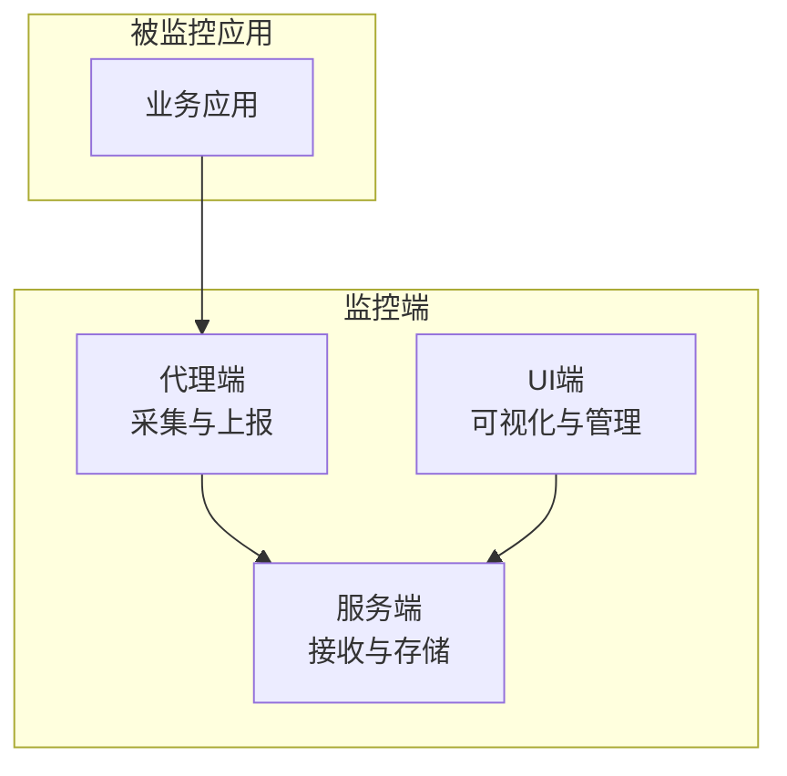
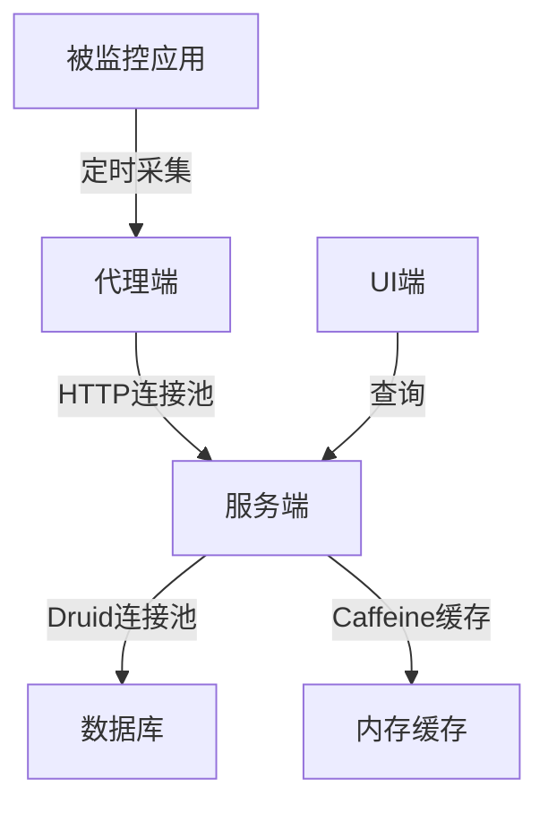
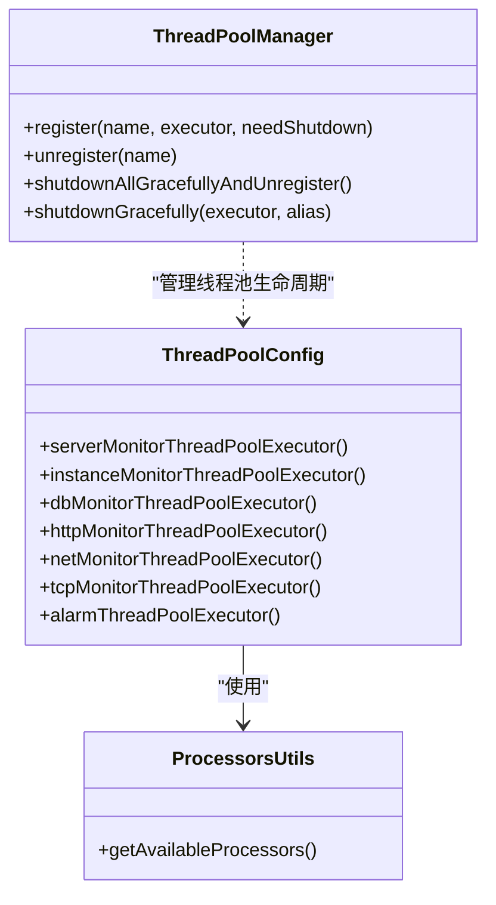
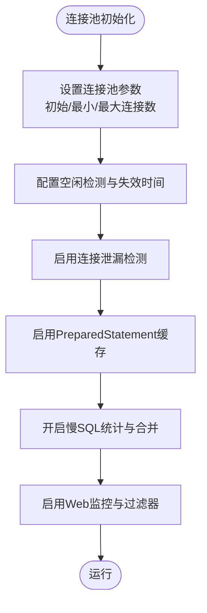
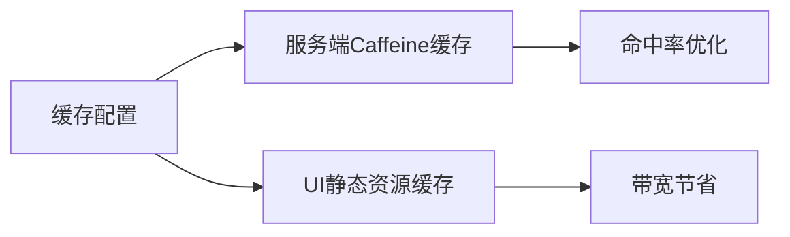
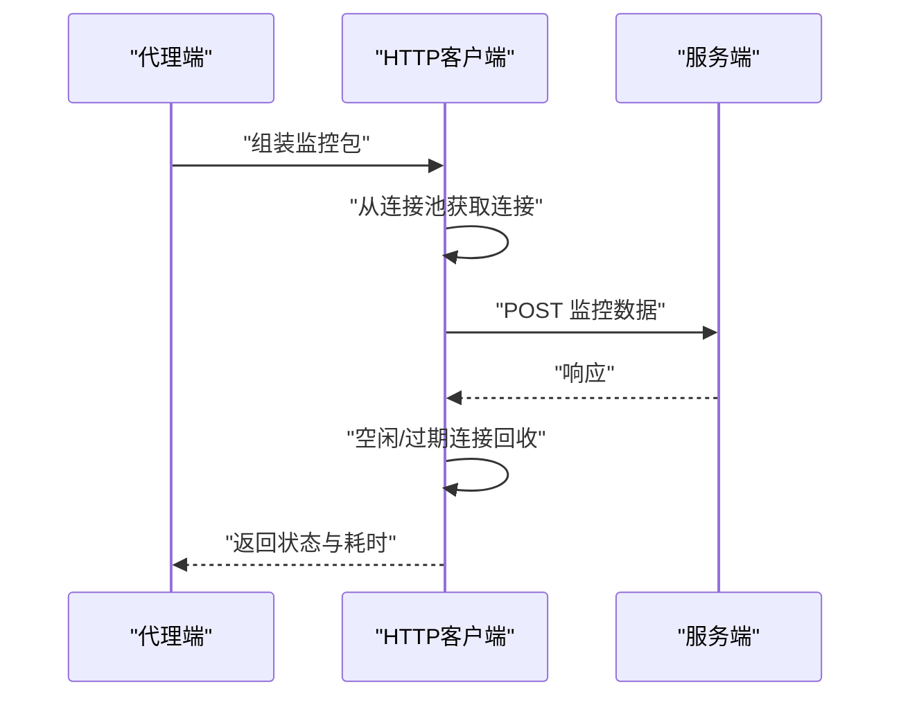
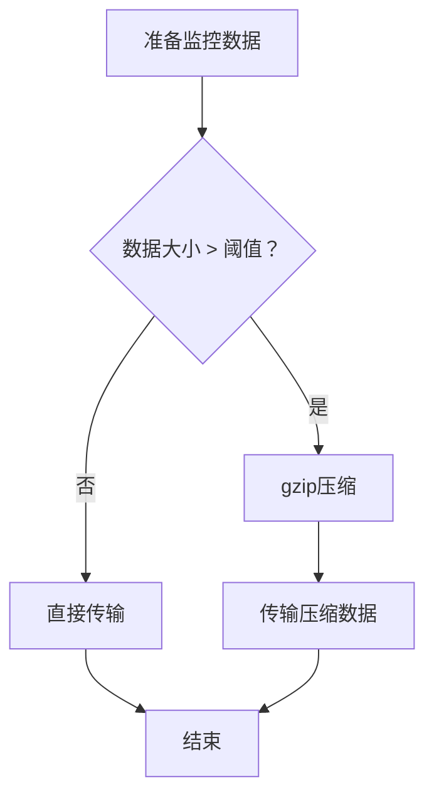
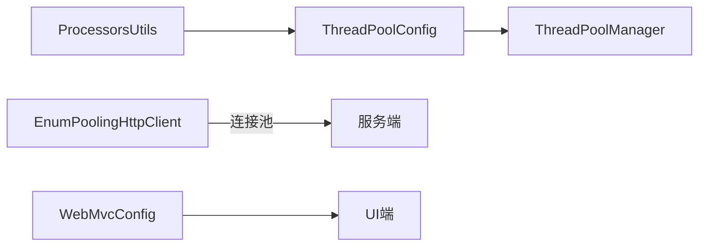

# 性能调优

<cite>
**本文引用的文件**   
- [application.yml（服务端）](file://phoenix-server/src/main/resources/application.yml)
- [application.yml（代理端）](file://phoenix-agent/src/main/resources/application.yml)
- [application.yml（UI端）](file://phoenix-ui/src/main/resources/application.yml)
- [ThreadPoolConfig（服务端）](file://phoenix-server/src/main/java/com/gitee/pifeng/monitoring/server/config/ThreadPoolConfig.java)
- [ThreadPoolManager（公共）](file://phoenix-common/phoenix-common-core/src/main/java/com/gitee/pifeng/monitoring/common/threadpool/ThreadPoolManager.java)
- [ProcessorsUtils（公共）](file://phoenix-common/phoenix-common-core/src/main/java/com/gitee/pifeng/monitoring/common/util/server/ProcessorsUtils.java)
- [EnumPoolingHttpClient（客户端）](file://phoenix-client/phoenix-client-core/src/main/java/com/gitee/pifeng/monitoring/plug/core/EnumPoolingHttpClient.java)
- [monitoring-prod.properties（服务端）](file://phoenix-server/src/main/resources/monitoring-prod.properties)
- [monitoring-prod.properties（代理端）](file://phoenix-agent/src/main/resources/monitoring-prod.properties)
- [monitoring-prod.properties（UI端）](file://phoenix-ui/src/main/resources/monitoring-prod.properties)
- [ZipUtils（公共）](file://phoenix-common/phoenix-common-core/src/main/java/com/gitee/pifeng/monitoring/common/util/ZipUtils.java)
- [WebMvcConfig（UI端）](file://phoenix-ui/src/main/java/com/gitee/pifeng/monitoring/ui/config/WebMvcConfig.java)
- [AbstractPoolSizeCalculator（公共）](file://phoenix-common/phoenix-common-core/src/main/java/com/gitee/pifeng/monitoring/common/abs/AbstractPoolSizeCalculator.java)
- [ThreadTypeEnums（公共）](file://phoenix-common/phoenix-common-core/src/main/java/com/gitee/pifeng/monitoring/common/constant/ThreadTypeEnums.java)
</cite>

## 目录
1. [简介](#简介)
2. [项目结构](#项目结构)
3. [核心组件](#核心组件)
4. [架构总览](#架构总览)
5. [详细组件分析](#详细组件分析)
6. [依赖分析](#依赖分析)
7. [性能考量](#性能考量)
8. [故障排查指南](#故障排查指南)
9. [结论](#结论)
10. [附录](#附录)

## 简介
本指南面向Phoenix监控系统，围绕系统自身与被监控应用两方面的性能优化展开，覆盖线程池配置、数据库连接池、缓存策略、网络连接、数据库调优、JVM调优、网络带宽优化以及性能监控与基准测试方法。目标是在保障监控能力的同时，将监控开销降至最低，避免对业务造成明显影响。

## 项目结构
Phoenix由三端组成：服务端（接收与存储监控数据）、代理端（采集被监控应用侧指标并上报）、UI端（可视化与管理）。各端均采用Spring Boot + Undertow，具备独立的配置文件与线程池/连接池/缓存策略。

[本图为概念性结构示意，不直接映射具体源码文件，故不附“图表来源”]

## 核心组件
- 线程池体系：服务端按监控类型拆分专用线程池，统一由管理器负责优雅关闭。
- 网络层：客户端内置HTTP连接池，支持连接复用、空闲回收、超时配置。
- 缓存与静态资源：UI端启用静态资源长期缓存，服务端使用Caffeine本地缓存。
- 数据库连接池：基于Druid，提供连接泄漏检测、慢SQL统计、Web监控等。
- 压缩与传输：公共工具提供字符串压缩判定，结合HTTP传输减少带宽占用。
- 配置中心：各端提供生产环境配置文件，集中管理监控频率、超时、实例标识等。

**章节来源**
- [ThreadPoolConfig（服务端）:21-211](file://phoenix-server/src/main/java/com/gitee/pifeng/monitoring/server/config/ThreadPoolConfig.java#L21-L211)
- [ThreadPoolManager（公共）:21-131](file://phoenix-common/phoenix-common-core/src/main/java/com/gitee/pifeng/monitoring/common/threadpool/ThreadPoolManager.java#L21-L131)
- [EnumPoolingHttpClient（客户端）:70-220](file://phoenix-client/phoenix-client-core/src/main/java/com/gitee/pifeng/monitoring/plug/core/EnumPoolingHttpClient.java#L70-L220)
- [application.yml（服务端）:34-105](file://phoenix-server/src/main/resources/application.yml#L34-L105)
- [application.yml（UI端）:40-152](file://phoenix-ui/src/main/resources/application.yml#L40-L152)
- [ZipUtils（公共）:15-54](file://phoenix-common/phoenix-common-core/src/main/java/com/gitee/pifeng/monitoring/common/util/ZipUtils.java#L15-L54)
- [monitoring-prod.properties（服务端）:1-41](file://phoenix-server/src/main/resources/monitoring-prod.properties#L1-L41)
- [monitoring-prod.properties（代理端）:1-41](file://phoenix-agent/src/main/resources/monitoring-prod.properties#L1-L41)
- [monitoring-prod.properties（UI端）:1-41](file://phoenix-ui/src/main/resources/monitoring-prod.properties#L1-L41)

## 架构总览
Phoenix的性能优化围绕“采集—传输—存储—展示”链路展开，系统通过可调的线程池、连接池、缓存与压缩策略，平衡吞吐与延迟，同时为被监控应用提供可配置的采样与频率策略，以降低对业务的影响。

**图表来源**
- [EnumPoolingHttpClient（客户端）:124-200](file://phoenix-client/phoenix-client-core/src/main/java/com/gitee/pifeng/monitoring/plug/core/EnumPoolingHttpClient.java#L124-L200)
- [application.yml（服务端）:117-184](file://phoenix-server/src/main/resources/application.yml#L117-L184)
- [application.yml（UI端）:84-152](file://phoenix-ui/src/main/resources/application.yml#L84-L152)

## 详细组件分析

### 线程池配置优化
- 服务端按监控类型拆分线程池，避免相互干扰；线程数依据CPU核数与阻塞系数计算，队列采用无界LinkedBlockingQueue，适合IO密集场景。
- 统一管理器负责注册/注销与优雅关闭，确保停机时任务有序退出。
- 建议：
  - 对CPU密集型任务（如复杂计算）调整阻塞系数与队列容量。
  - 结合业务峰值流量，动态评估线程池大小与拒绝策略。
  - 定期检查线程池拒绝与堆积情况，必要时扩容或限流。

**图表来源**
- [ThreadPoolConfig（服务端）:21-211](file://phoenix-server/src/main/java/com/gitee/pifeng/monitoring/server/config/ThreadPoolConfig.java#L21-L211)
- [ThreadPoolManager（公共）:21-131](file://phoenix-common/phoenix-common-core/src/main/java/com/gitee/pifeng/monitoring/common/threadpool/ThreadPoolManager.java#L21-L131)
- [ProcessorsUtils（公共）:11-38](file://phoenix-common/phoenix-common-core/src/main/java/com/gitee/pifeng/monitoring/common/util/server/ProcessorsUtils.java#L11-L38)

**章节来源**
- [ThreadPoolConfig（服务端）:21-211](file://phoenix-server/src/main/java/com/gitee/pifeng/monitoring/server/config/ThreadPoolConfig.java#L21-L211)
- [ThreadPoolManager（公共）:21-131](file://phoenix-common/phoenix-common-core/src/main/java/com/gitee/pifeng/monitoring/common/threadpool/ThreadPoolManager.java#L21-L131)
- [ProcessorsUtils（公共）:11-38](file://phoenix-common/phoenix-common-core/src/main/java/com/gitee/pifeng/monitoring/common/util/server/ProcessorsUtils.java#L11-L38)

### 数据库连接池调优
- 服务端与UI端均使用Druid连接池，支持：
  - 初始化/最小/最大连接数
  - 空闲检测周期与最小空闲时间
  - 连接有效性校验、连接泄漏检测
  - PreparedStatement缓存与慢SQL统计
  - Web监控与过滤器链
- 建议：
  - 根据QPS与事务复杂度调整最大连接数与等待超时。
  - 开启慢SQL统计定位瓶颈，结合索引与SQL优化。
  - 合理设置remove-abandoned超时，避免连接泄漏。

**图表来源**
- [application.yml（服务端）:117-184](file://phoenix-server/src/main/resources/application.yml#L117-L184)
- [application.yml（UI端）:84-152](file://phoenix-ui/src/main/resources/application.yml#L84-L152)

**章节来源**
- [application.yml（服务端）:117-184](file://phoenix-server/src/main/resources/application.yml#L117-L184)
- [application.yml（UI端）:84-152](file://phoenix-ui/src/main/resources/application.yml#L84-L152)

### 缓存策略优化
- 服务端：Caffeine本地缓存，设置最大条数与访问过期时间，适合热点查询与临时数据。
- UI端：Thymeleaf禁用缓存，静态资源启用长期缓存，降低前端带宽与服务器压力。
- 建议：
  - 为高频查询结果设置合适TTL与容量上限。
  - 对UI静态资源按版本号缓存，避免缓存穿透。
  - 结合业务热点，评估缓存命中率与淘汰策略。

**图表来源**
- [application.yml（服务端）:38-44](file://phoenix-server/src/main/resources/application.yml#L38-L44)
- [application.yml（UI端）:76-82](file://phoenix-ui/src/main/resources/application.yml#L76-L82)
- [WebMvcConfig（UI端）:21-42](file://phoenix-ui/src/main/java/com/gitee/pifeng/monitoring/ui/config/WebMvcConfig.java#L21-L42)

**章节来源**
- [application.yml（服务端）:38-44](file://phoenix-server/src/main/resources/application.yml#L38-L44)
- [application.yml（UI端）:76-82](file://phoenix-ui/src/main/resources/application.yml#L76-L82)
- [WebMvcConfig（UI端）:21-42](file://phoenix-ui/src/main/java/com/gitee/pifeng/monitoring/ui/config/WebMvcConfig.java#L21-L42)

### 网络连接优化
- 客户端HTTP连接池：
  - 最大连接数与每路由最大连接数，避免高并发下的连接池耗尽。
  - 连接/请求超时、长连接保持、空闲连接回收与过期连接清理。
  - 支持重试与连接复用策略。
- 建议：
  - 根据业务峰值QPS与RT设定最大连接与超时阈值。
  - 合理设置keep-alive与TTL，减少握手开销。
  - 对大包数据启用压缩（见“网络带宽优化”）。

**图表来源**
- [EnumPoolingHttpClient（客户端）:124-200](file://phoenix-client/phoenix-client-core/src/main/java/com/gitee/pifeng/monitoring/plug/core/EnumPoolingHttpClient.java#L124-L200)

**章节来源**
- [EnumPoolingHttpClient（客户端）:70-220](file://phoenix-client/phoenix-client-core/src/main/java/com/gitee/pifeng/monitoring/plug/core/EnumPoolingHttpClient.java#L70-L220)

### 网络带宽优化
- 字符串压缩判定：当字符串长度超过阈值（如64KB）时启用gzip压缩，减少传输体积。
- UI端开启响应压缩，仅对满足阈值的响应生效。
- 建议：
  - 对大体量JSON或文本采用压缩。
  - 结合业务数据特征，动态评估压缩比与CPU消耗。
  - 与HTTP连接池配合，减少连接建立次数，提高吞吐。

**图表来源**
- [ZipUtils（公共）:39-52](file://phoenix-common/phoenix-common-core/src/main/java/com/gitee/pifeng/monitoring/common/util/ZipUtils.java#L39-L52)
- [application.yml（UI端）:8-14](file://phoenix-ui/src/main/resources/application.yml#L8-L14)

**章节来源**
- [ZipUtils（公共）:15-54](file://phoenix-common/phoenix-common-core/src/main/java/com/gitee/pifeng/monitoring/common/util/ZipUtils.java#L15-L54)
- [application.yml（UI端）:8-14](file://phoenix-ui/src/main/resources/application.yml#L8-L14)

### 数据库性能调优
- 连接池：Druid参数齐全，建议结合业务QPS与慢SQL分析，动态调整最大连接与等待超时。
- 查询优化：MyBatis-Plus配置启用驼峰映射，避免冗余AS别名；结合慢SQL与索引策略优化。
- 事务管理：建议按业务场景设置合理的隔离级别与超时时间，避免长事务锁竞争。
- 存储引擎：MySQL层面建议使用合适的存储引擎与索引设计，配合慢查询日志定位问题。

**章节来源**
- [application.yml（服务端）:186-217](file://phoenix-server/src/main/resources/application.yml#L186-L217)
- [application.yml（UI端）:154-184](file://phoenix-ui/src/main/resources/application.yml#L154-L184)

### JVM性能调优
- 建议关注堆内存配置、GC策略与GC日志分析，结合系统负载与GC停顿时间进行调优。
- Phoenix提供GC信息采集能力，可用于观测GC行为与趋势。
- 建议：
  - 明确GC策略（如G1/Parallel），结合停顿目标与吞吐目标选择。
  - 观测GC日志，识别晋升失败、大对象分配等问题。
  - 对于高频短生命周期对象，优化对象池与逃逸分析。

**章节来源**
- [monitoring-prod.properties（服务端）:38-41](file://phoenix-server/src/main/resources/monitoring-prod.properties#L38-L41)
- [monitoring-prod.properties（代理端）:38-41](file://phoenix-agent/src/main/resources/monitoring-prod.properties#L38-L41)
- [monitoring-prod.properties（UI端）:38-41](file://phoenix-ui/src/main/resources/monitoring-prod.properties#L38-L41)

### 被监控应用的性能影响评估
- 监控频率与采样策略：通过配置文件中的采集频率参数，平衡数据粒度与开销。
- 心跳与指标上报：合理设置心跳与指标上报周期，避免在业务高峰期集中上报。
- 采样策略：对高频事件采用采样，降低CPU与网络压力。
- 监控开销量化：结合系统指标（CPU、内存、GC、网络、数据库）与业务指标（QPS、RT、错误率）对比分析，评估监控对业务的影响。

**章节来源**
- [monitoring-prod.properties（服务端）:10-41](file://phoenix-server/src/main/resources/monitoring-prod.properties#L10-L41)
- [monitoring-prod.properties（代理端）:10-41](file://phoenix-agent/src/main/resources/monitoring-prod.properties#L10-L41)
- [monitoring-prod.properties（UI端）:10-41](file://phoenix-ui/src/main/resources/monitoring-prod.properties#L10-L41)

### 性能监控与基准测试
- 性能指标：CPU使用率、内存占用、GC时间与次数、网络吞吐、数据库连接池状态、UI静态资源命中率等。
- 基准测试：使用公共工具中的线程池规模计算器思路，设计受控压测场景，测量不同线程池规模下的吞吐与延迟边界。
- 回归检测：建立基线，定期对比关键指标，及时发现性能退化。

**章节来源**
- [AbstractPoolSizeCalculator（公共）:89-184](file://phoenix-common/phoenix-common-core/src/main/java/com/gitee/pifeng/monitoring/common/abs/AbstractPoolSizeCalculator.java#L89-L184)
- [ThreadTypeEnums（公共）:11-24](file://phoenix-common/phoenix-common-core/src/main/java/com/gitee/pifeng/monitoring/common/constant/ThreadTypeEnums.java#L11-L24)

## 依赖分析
- 服务端线程池配置依赖处理器核心数工具，统一由工厂线程名与守护线程策略管理。
- 客户端HTTP连接池配置集中于单例，便于全局复用与回收。
- UI端静态资源缓存策略与服务端缓存策略互补，分别优化前端与后端缓存命中。

**图表来源**
- [ThreadPoolConfig（服务端）:21-211](file://phoenix-server/src/main/java/com/gitee/pifeng/monitoring/server/config/ThreadPoolConfig.java#L21-L211)
- [ThreadPoolManager（公共）:21-131](file://phoenix-common/phoenix-common-core/src/main/java/com/gitee/pifeng/monitoring/common/threadpool/ThreadPoolManager.java#L21-L131)
- [ProcessorsUtils（公共）:11-38](file://phoenix-common/phoenix-common-core/src/main/java/com/gitee/pifeng/monitoring/common/util/server/ProcessorsUtils.java#L11-L38)
- [EnumPoolingHttpClient（客户端）:124-200](file://phoenix-client/phoenix-client-core/src/main/java/com/gitee/pifeng/monitoring/plug/core/EnumPoolingHttpClient.java#L124-L200)
- [WebMvcConfig（UI端）:21-42](file://phoenix-ui/src/main/java/com/gitee/pifeng/monitoring/ui/config/WebMvcConfig.java#L21-L42)

**章节来源**
- [ThreadPoolConfig（服务端）:21-211](file://phoenix-server/src/main/java/com/gitee/pifeng/monitoring/server/config/ThreadPoolConfig.java#L21-L211)
- [ThreadPoolManager（公共）:21-131](file://phoenix-common/phoenix-common-core/src/main/java/com/gitee/pifeng/monitoring/common/threadpool/ThreadPoolManager.java#L21-L131)
- [ProcessorsUtils（公共）:11-38](file://phoenix-common/phoenix-common-core/src/main/java/com/gitee/pifeng/monitoring/common/util/server/ProcessorsUtils.java#L11-L38)
- [EnumPoolingHttpClient（客户端）:124-200](file://phoenix-client/phoenix-client-core/src/main/java/com/gitee/pifeng/monitoring/plug/core/EnumPoolingHttpClient.java#L124-L200)
- [WebMvcConfig（UI端）:21-42](file://phoenix-ui/src/main/java/com/gitee/pifeng/monitoring/ui/config/WebMvcConfig.java#L21-L42)

## 性能考量
- 线程池：IO密集场景下，适当增大线程数与队列容量；CPU密集场景下，优先控制线程数，避免上下文切换。
- 连接池：根据并发连接与RT设定最大连接与超时，避免连接池耗尽与请求排队。
- 缓存：热点数据本地缓存，静态资源长期缓存，减少重复计算与网络传输。
- 压缩：对大包数据启用压缩，权衡CPU与带宽。
- 数据库：结合慢SQL与索引策略，优化查询路径；合理设置连接池参数与事务隔离级别。
- JVM：明确GC策略与停顿目标，结合GC日志分析优化堆与代大小。

[本节为通用指导，不直接分析具体文件，故不附“章节来源”]

## 故障排查指南
- 线程池异常：
  - 检查拒绝策略与队列堆积，必要时扩容或限流。
  - 使用优雅关闭流程，避免停机时任务丢失。
- 连接池异常：
  - 关注连接泄漏与超时，调整最大连接与等待超时。
  - 启用慢SQL统计与Web监控，定位异常SQL。
- 压缩与传输：
  - 对超大响应启用压缩，避免内存溢出。
  - 检查HTTP客户端超时与重试策略。
- 缓存与UI：
  - 静态资源缓存策略需与版本号配合，避免陈旧内容。
  - 服务端缓存命中率低时，评估TTL与容量。

**章节来源**
- [ThreadPoolManager（公共）:80-131](file://phoenix-common/phoenix-common-core/src/main/java/com/gitee/pifeng/monitoring/common/threadpool/ThreadPoolManager.java#L80-L131)
- [EnumPoolingHttpClient（客户端）:162-200](file://phoenix-client/phoenix-client-core/src/main/java/com/gitee/pifeng/monitoring/plug/core/EnumPoolingHttpClient.java#L162-L200)
- [application.yml（服务端）:117-184](file://phoenix-server/src/main/resources/application.yml#L117-L184)
- [WebMvcConfig（UI端）:21-42](file://phoenix-ui/src/main/java/com/gitee/pifeng/monitoring/ui/config/WebMvcConfig.java#L21-L42)

## 结论
Phoenix监控系统通过模块化的线程池、连接池、缓存与压缩策略，能够在保障可观测性的前提下，将监控开销控制在较低水平。结合被监控应用的采样与频率策略，可进一步降低对业务的影响。建议在生产环境中持续监控关键指标，定期进行基准测试与回归检测，确保性能稳定与可预期。

[本节为总结性内容，不直接分析具体文件，故不附“章节来源”]

## 附录
- 关键配置要点速览：
  - 线程池：按监控类型拆分，守护线程命名，统一优雅关闭。
  - 连接池：Druid参数齐全，慢SQL与Web监控开启。
  - 缓存：Caffeine与静态资源缓存策略。
  - 压缩：字符串压缩阈值与UI响应压缩。
  - 配置：各端生产配置文件集中管理监控频率与超时。

[本节为概览性内容，不直接分析具体文件，故不附“章节来源”]