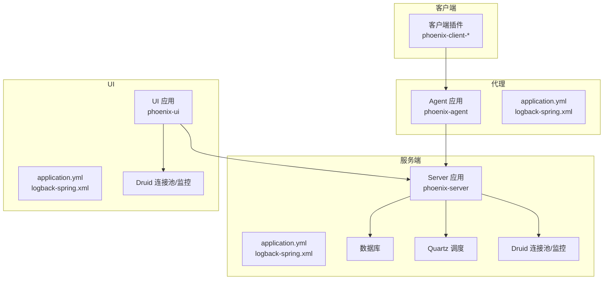
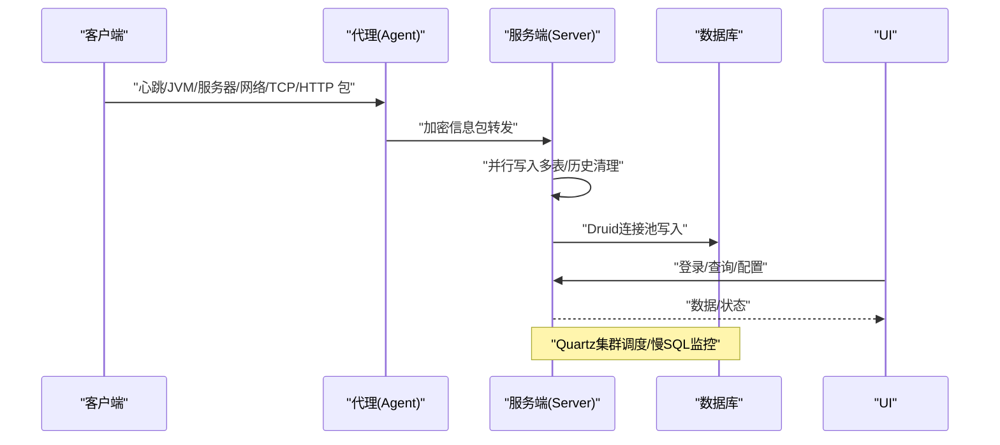
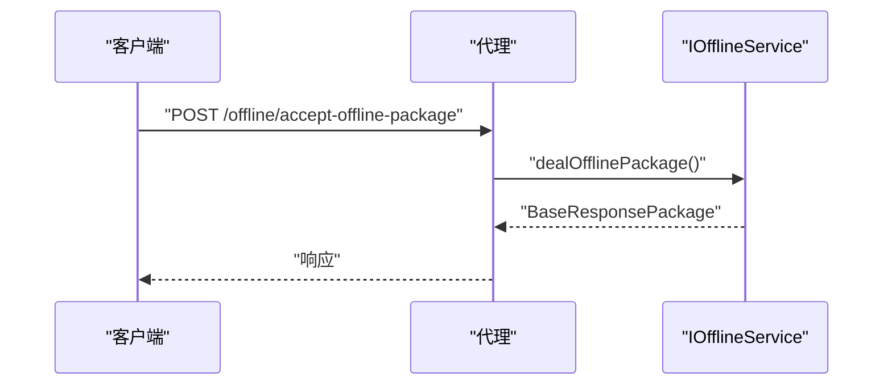
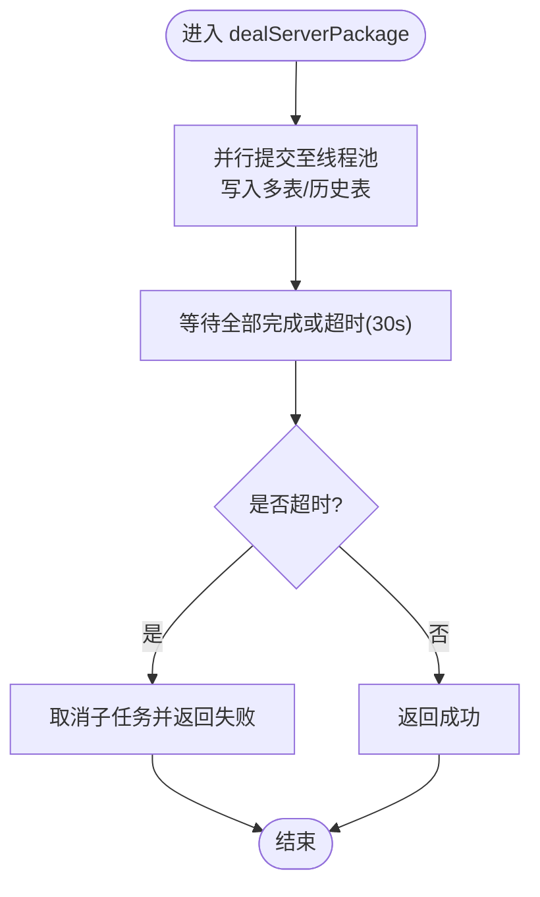
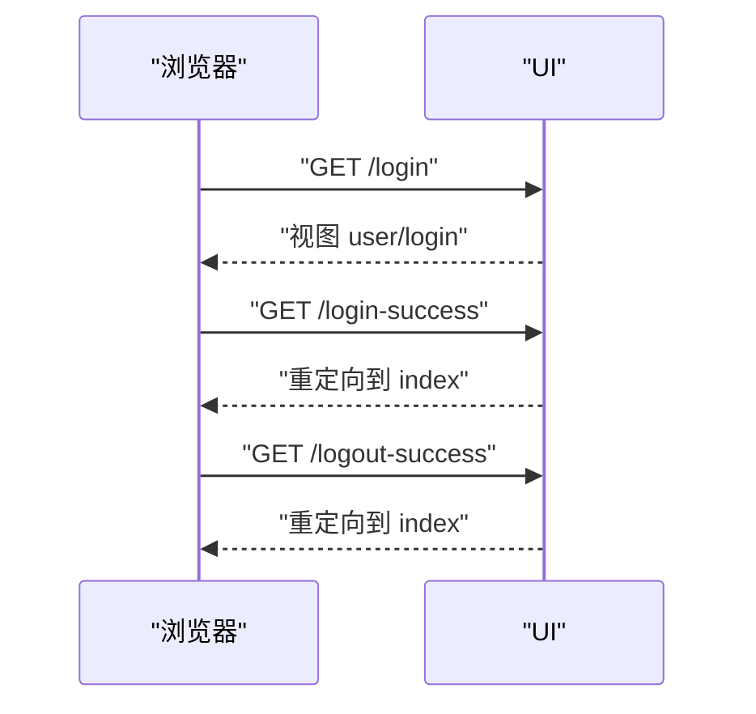
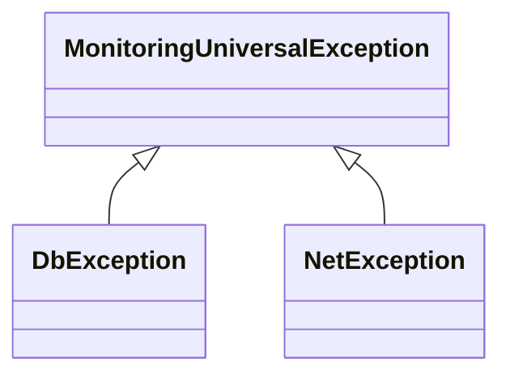
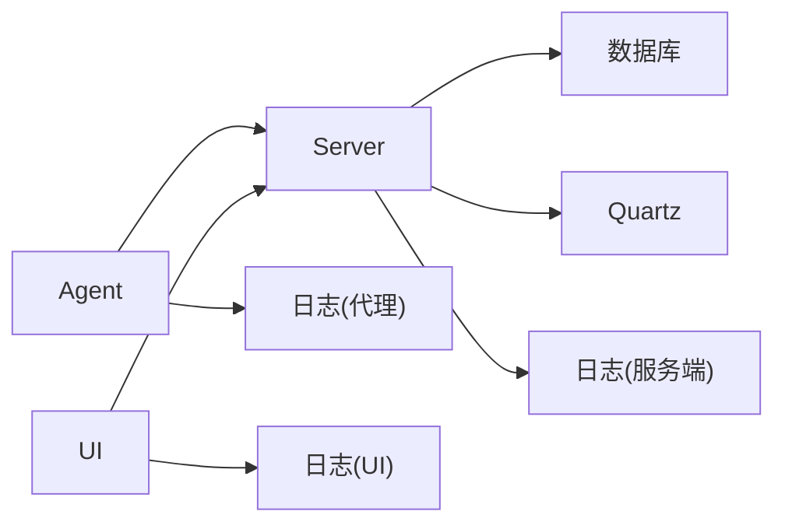

# 故障排除

<cite>
**本文引用的文件**   
- [application.yml（代理）](file://phoenix-agent/src/main/resources/application.yml)
- [application.yml（服务端）](file://phoenix-server/src/main/resources/application.yml)
- [application.yml（UI）](file://phoenix-ui/src/main/resources/application.yml)
- [logback-spring.xml（代理）](file://phoenix-agent/src/main/resources/logback-spring.xml)
- [logback-spring.xml（服务端）](file://phoenix-server/src/main/resources/logback-spring.xml)
- [logback-spring.xml（UI）](file://phoenix-ui/src/main/resources/logback-spring.xml)
- [OfflineController.java（代理）](file://phoenix-agent/src/main/java/com/gitee/pifeng/monitoring/agent/business/client/controller/OfflineController.java)
- [ServerServiceImpl.java（服务端）](file://phoenix-server/src/main/java/com/gitee/pifeng/monitoring/server/business/server/service/impl/ServerServiceImpl.java)
- [LoginController.java（UI）](file://phoenix-ui/src/main/java/com/gitee/pifeng/monitoring/ui/business/web/controller/LoginController.java)
- [ILogExceptionService.java（服务端）](file://phoenix-server/src/main/java/com/gitee/pifeng/monitoring/server/business/server/service/ILogExceptionService.java)
- [IMonitorLogExceptionDao.java（服务端）](file://phoenix-server/src/main/java/com/gitee/pifeng/monitoring/server/business/server/dao/IMonitorLogExceptionDao.java)
- [LogExceptionServiceImpl.java（服务端）](file://phoenix-server/src/main/java/com/gitee/pifeng/monitoring/server/business/server/service/impl/LogExceptionServiceImpl.java)
- [ExceptionLogAspect.java（服务端）](file://phoenix-server/src/main/java/com/gitee/pifeng/monitoring/server/business/server/component/ExceptionLogAspect.java)
- [MonitoringUniversalException.java（公共）](file://phoenix-common/phoenix-common-core/src/main/java/com/gitee/pifeng/monitoring/common/exception/MonitoringUniversalException.java)
- [DbException.java（公共）](file://phoenix-common/phoenix-common-core/src/main/java/com/gitee/pifeng/monitoring/common/exception/DbException.java)
- [NetException.java（公共）](file://phoenix-common/phoenix-common-core/src/main/java/com/gitee/pifeng/monitoring/common/exception/NetException.java)
- [AbstractPoolSizeCalculator.java（公共）](file://phoenix-common/phoenix-common-core/src/main/java/com/gitee/pifeng/monitoring/common/abs/AbstractPoolSizeCalculator.java)
- [phoenixAgent.xml（Windows服务）](file://doc/WindowsServices/phoenix-agent/phoenixAgent.xml)
- [phoenixServer.xml（Windows服务）](file://doc/WindowsServices/phoenix-server/phoenixServer.xml)
- [phoenixUI.xml（Windows服务）](file://doc/WindowsServices/phoenix-ui/phoenixUI.xml)
</cite>

## 目录
1. [简介](#简介)
2. [项目结构](#项目结构)
3. [核心组件](#核心组件)
4. [架构总览](#架构总览)
5. [详细组件分析](#详细组件分析)
6. [依赖分析](#依赖分析)
7. [性能考量](#性能考量)
8. [故障排除指南](#故障排除指南)
9. [结论](#结论)
10. [附录](#附录)

## 简介
本故障排除文档面向Phoenix监控系统（代理、服务端、UI、客户端）的运维与开发人员，聚焦以下目标：
- 快速定位并解决客户端无法连接、代理端数据丢失、服务端性能问题、UI界面异常等常见问题
- 提供日志分析方法：日志级别、关键信息识别、日志格式解读、收集与分析工具使用
- 性能调优指南：系统自身性能优化、被监控应用的影响、网络带宽优化、数据库性能调优
- 网络问题诊断：连接、防火墙、代理、DNS等
- 数据库问题排查：连接池、慢查询、锁等待、存储空间
- 系统资源监控：CPU、内存、磁盘、网络
- 应急处理流程：故障响应、隔离与快速恢复

## 项目结构
Phoenix由四部分组成：客户端（Client）、代理（Agent）、服务端（Server）、UI（前端管理界面）。各模块通过配置文件与日志配置统一管理，服务端与UI均内置Druid监控与Quartz调度能力。

图表来源
- [application.yml（代理）:1-111](file://phoenix-agent/src/main/resources/application.yml#L1-L111)
- [logback-spring.xml（代理）:1-120](file://phoenix-agent/src/main/resources/logback-spring.xml#L1-L120)
- [application.yml（服务端）:1-271](file://phoenix-server/src/main/resources/application.yml#L1-L271)
- [logback-spring.xml（服务端）:1-120](file://phoenix-server/src/main/resources/logback-spring.xml#L1-L120)
- [application.yml（UI）:1-238](file://phoenix-ui/src/main/resources/application.yml#L1-L238)
- [logback-spring.xml（UI）:1-120](file://phoenix-ui/src/main/resources/logback-spring.xml#L1-L120)

章节来源
- [application.yml（代理）:1-111](file://phoenix-agent/src/main/resources/application.yml#L1-L111)
- [application.yml（服务端）:1-271](file://phoenix-server/src/main/resources/application.yml#L1-L271)
- [application.yml（UI）:1-238](file://phoenix-ui/src/main/resources/application.yml#L1-L238)
- [logback-spring.xml（代理）:1-120](file://phoenix-agent/src/main/resources/logback-spring.xml#L1-L120)
- [logback-spring.xml（服务端）:1-120](file://phoenix-server/src/main/resources/logback-spring.xml#L1-L120)
- [logback-spring.xml（UI）:1-120](file://phoenix-ui/src/main/resources/logback-spring.xml#L1-L120)

## 核心组件
- 代理（Agent）
  - 接收客户端心跳、JVM、服务器、网络、TCP/HTTP等信息包，负责下行告警、离线通知等
  - 关键控制器：OfflineController（下线信息包）
  - 配置要点：上下文路径、 Undertow 访问日志、优雅停机、日志级别、Knife4j/Swagger
- 服务端（Server）
  - 接收并落库服务器监控数据，异步并行写入多张历史表，支持历史清理
  - 关键服务：ServerServiceImpl（并行处理、超时控制、重试注解）
  - 配置要点：Quartz集群、Druid连接池、慢SQL记录、健康端点、Knife4j/Swagger
- UI（UI）
  - 登录、权限、报表、系统配置等管理界面
  - 关键控制器：LoginController（登录页、登录成功、登出成功）
  - 配置要点：Thymeleaf、Druid监控、健康端点、Knife4j/Swagger
- 异常与日志
  - 统一异常基类、数据库异常、网络异常
  - 异常切面记录异常日志并可触发告警
- 性能与线程池
  - 抽象线程池边界计算器，辅助调优

章节来源
- [OfflineController.java（代理）:1-60](file://phoenix-agent/src/main/java/com/gitee/pifeng/monitoring/agent/business/client/controller/OfflineController.java#L1-L60)
- [ServerServiceImpl.java（服务端）:1-345](file://phoenix-server/src/main/java/com/gitee/pifeng/monitoring/server/business/server/service/impl/ServerServiceImpl.java#L1-L345)
- [LoginController.java（UI）:1-84](file://phoenix-ui/src/main/java/com/gitee/pifeng/monitoring/ui/business/web/controller/LoginController.java#L1-L84)
- [MonitoringUniversalException.java（公共）:1-31](file://phoenix-common/phoenix-common-core/src/main/java/com/gitee/pifeng/monitoring/common/exception/MonitoringUniversalException.java#L1-L31)
- [DbException.java（公共）:1-27](file://phoenix-common/phoenix-common-core/src/main/java/com/gitee/pifeng/monitoring/common/exception/DbException.java#L1-L27)
- [NetException.java（公共）:1-23](file://phoenix-common/phoenix-common-core/src/main/java/com/gitee/pifeng/monitoring/common/exception/NetException.java#L1-L23)
- [AbstractPoolSizeCalculator.java（公共）:1-70](file://phoenix-common/phoenix-common-core/src/main/java/com/gitee/pifeng/monitoring/common/abs/AbstractPoolSizeCalculator.java#L1-L70)

## 架构总览
Phoenix采用“客户端采集 → 代理汇聚 → 服务端入库/调度 → UI展示”的链路。异常与日志通过切面统一记录，数据库通过Druid监控与慢SQL配置，Quartz负责分布式调度。

图表来源
- [OfflineController.java（代理）:54-57](file://phoenix-agent/src/main/java/com/gitee/pifeng/monitoring/agent/business/client/controller/OfflineController.java#L54-L57)
- [ServerServiceImpl.java（服务端）:191-247](file://phoenix-server/src/main/java/com/gitee/pifeng/monitoring/server/business/server/service/impl/ServerServiceImpl.java#L191-L247)
- [application.yml（服务端）:117-184](file://phoenix-server/src/main/resources/application.yml#L117-L184)
- [application.yml（UI）:85-151](file://phoenix-ui/src/main/resources/application.yml#L85-L151)

## 详细组件分析

### 代理（Agent）：下线信息包处理
- 功能：接收客户端下线信息包，调用服务层处理并返回响应
- 关键点：接口路径、异常类型（网络异常）、日志级别
- 常见问题：下线包未达、服务不可用、网络不通、解密/加密异常

图表来源
- [OfflineController.java（代理）:54-57](file://phoenix-agent/src/main/java/com/gitee/pifeng/monitoring/agent/business/client/controller/OfflineController.java#L54-L57)

章节来源
- [OfflineController.java（代理）:1-60](file://phoenix-agent/src/main/java/com/gitee/pifeng/monitoring/agent/business/client/controller/OfflineController.java#L1-L60)
- [application.yml（代理）:1-111](file://phoenix-agent/src/main/resources/application.yml#L1-L111)
- [logback-spring.xml（代理）:1-120](file://phoenix-agent/src/main/resources/logback-spring.xml#L1-L120)

### 服务端（Server）：服务器信息包处理与并行写入
- 功能：接收服务器监控包，异步并行写入操作系统、CPU、内存、磁盘、网卡、进程、负载等多表，支持历史清理
- 关键点：CompletableFuture并行、超时控制（30秒）、事务与重试注解、线程池
- 常见问题：并行写入超时、数据库压力大、历史清理不及时、Quartz调度异常

图表来源
- [ServerServiceImpl.java（服务端）:191-247](file://phoenix-server/src/main/java/com/gitee/pifeng/monitoring/server/business/server/service/impl/ServerServiceImpl.java#L191-L247)

章节来源
- [ServerServiceImpl.java（服务端）:1-345](file://phoenix-server/src/main/java/com/gitee/pifeng/monitoring/server/business/server/service/impl/ServerServiceImpl.java#L1-L345)
- [application.yml（服务端）:67-104](file://phoenix-server/src/main/resources/application.yml#L67-L104)
- [application.yml（服务端）:117-184](file://phoenix-server/src/main/resources/application.yml#L117-L184)
- [logback-spring.xml（服务端）:1-120](file://phoenix-server/src/main/resources/logback-spring.xml#L1-L120)

### UI（UI）：登录与页面跳转
- 功能：提供登录页、登录成功与登出成功重定向
- 常见问题：登录页无法访问、验证码开关、会话失效、静态资源压缩导致加载慢

图表来源
- [LoginController.java（UI）:42-81](file://phoenix-ui/src/main/java/com/gitee/pifeng/monitoring/ui/business/web/controller/LoginController.java#L42-L81)

章节来源
- [LoginController.java（UI）:1-84](file://phoenix-ui/src/main/java/com/gitee/pifeng/monitoring/ui/business/web/controller/LoginController.java#L1-L84)
- [application.yml（UI）:1-238](file://phoenix-ui/src/main/resources/application.yml#L1-L238)
- [logback-spring.xml（UI）:1-120](file://phoenix-ui/src/main/resources/logback-spring.xml#L1-L120)

### 异常与日志：统一异常与异常切面
- 统一异常：MonitoringUniversalException、DbException、NetException
- 异常切面：捕获异常，记录异常日志，拼装告警消息，触发告警
- 常见问题：异常未记录、告警未触发、异常类型误判

图表来源
- [MonitoringUniversalException.java（公共）:1-31](file://phoenix-common/phoenix-common-core/src/main/java/com/gitee/pifeng/monitoring/common/exception/MonitoringUniversalException.java#L1-L31)
- [DbException.java（公共）:1-27](file://phoenix-common/phoenix-common-core/src/main/java/com/gitee/pifeng/monitoring/common/exception/DbException.java#L1-L27)
- [NetException.java（公共）:1-23](file://phoenix-common/phoenix-common-core/src/main/java/com/gitee/pifeng/monitoring/common/exception/NetException.java#L1-L23)

章节来源
- [ILogExceptionService.java（服务端）:1-16](file://phoenix-server/src/main/java/com/gitee/pifeng/monitoring/server/business/server/service/ILogExceptionService.java#L1-L16)
- [IMonitorLogExceptionDao.java（服务端）:1-16](file://phoenix-server/src/main/java/com/gitee/pifeng/monitoring/server/business/server/dao/IMonitorLogExceptionDao.java#L1-L16)
- [LogExceptionServiceImpl.java（服务端）:1-20](file://phoenix-server/src/main/java/com/gitee/pifeng/monitoring/server/business/server/service/impl/LogExceptionServiceImpl.java#L1-L20)
- [ExceptionLogAspect.java（服务端）:196-223](file://phoenix-server/src/main/java/com/gitee/pifeng/monitoring/server/business/server/component/ExceptionLogAspect.java#L196-L223)

## 依赖分析
- 组件耦合
  - 代理依赖服务端接口（信息包接收）
  - 服务端依赖数据库（Druid连接池）、Quartz调度
  - UI依赖服务端REST与模板引擎
- 外部依赖
  - Druid：连接池、慢SQL、Web监控
  - Quartz：分布式调度
  - Undertow：访问日志
  - Knife4j/SpringDoc：接口文档

图表来源
- [application.yml（代理）:1-111](file://phoenix-agent/src/main/resources/application.yml#L1-L111)
- [application.yml（服务端）:117-184](file://phoenix-server/src/main/resources/application.yml#L117-L184)
- [application.yml（UI）:85-151](file://phoenix-ui/src/main/resources/application.yml#L85-L151)

章节来源
- [application.yml（代理）:1-111](file://phoenix-agent/src/main/resources/application.yml#L1-L111)
- [application.yml（服务端）:1-271](file://phoenix-server/src/main/resources/application.yml#L1-L271)
- [application.yml（UI）:1-238](file://phoenix-ui/src/main/resources/application.yml#L1-L238)

## 性能考量
- 服务端并行写入
  - 使用CompletableFuture并行写入多表，超时30秒，避免阻塞
  - 建议：根据数据库TPS与历史表增长趋势调整超时与线程池容量
- 数据库连接池
  - Druid初始5、最大500（服务端）、100（UI），慢SQL阈值5秒
  - 建议：结合慢SQL监控与业务峰值流量评估最大连接数
- 线程池与队列
  - AbstractPoolSizeCalculator可用于估算线程数与队列容量
  - 建议：压测评估CPU利用率目标与队列内存占用
- 缓存与序列化
  - 服务端启用Caffeine缓存，减少热点查询压力
- 网络与压缩
  - UI启用响应压缩，降低带宽占用
- 调度与优雅停机
  - Quartz集群与等待作业完成关闭，避免数据丢失

章节来源
- [ServerServiceImpl.java（服务端）:191-247](file://phoenix-server/src/main/java/com/gitee/pifeng/monitoring/server/business/server/service/impl/ServerServiceImpl.java#L191-L247)
- [application.yml（服务端）:38-47](file://phoenix-server/src/main/resources/application.yml#L38-L47)
- [application.yml（服务端）:117-184](file://phoenix-server/src/main/resources/application.yml#L117-L184)
- [application.yml（UI）:85-151](file://phoenix-ui/src/main/resources/application.yml#L85-L151)
- [AbstractPoolSizeCalculator.java（公共）:1-70](file://phoenix-common/phoenix-common-core/src/main/java/com/gitee/pifeng/monitoring/common/abs/AbstractPoolSizeCalculator.java#L1-L70)

## 故障排除指南

### 一、客户端无法连接
- 现象
  - 客户端心跳失败、JVM/服务器信息包丢失
- 诊断步骤
  - 检查代理上下文路径与端口（默认 /phoenix-agent）
  - 检查代理日志级别与访问日志（Undertow）
  - 使用Knife4j/Swagger验证接口可用性
  - 检查网络连通性（代理→服务端）
- 解决方案
  - 调整代理端口/上下文路径与防火墙放行
  - 临时提升日志级别为DEBUG定位异常
  - 校验客户端配置与许可证校验

章节来源
- [application.yml（代理）:2-18](file://phoenix-agent/src/main/resources/application.yml#L2-L18)
- [application.yml（代理）:76-111](file://phoenix-agent/src/main/resources/application.yml#L76-L111)
- [logback-spring.xml（代理）:24-47](file://phoenix-agent/src/main/resources/logback-spring.xml#L24-L47)

### 二、代理端数据丢失
- 现象
  - 服务端未收到服务器信息包、历史表未更新
- 诊断步骤
  - 核对OfflineController接口是否可达
  - 查看并行写入是否超时（30秒）
  - 检查数据库连接池是否耗尽
- 解决方案
  - 调整并行超时或拆分写入批次
  - 扩大Druid最大连接数或优化慢SQL
  - 启用Quartz集群确保调度稳定

章节来源
- [OfflineController.java（代理）:54-57](file://phoenix-agent/src/main/java/com/gitee/pifeng/monitoring/agent/business/client/controller/OfflineController.java#L54-L57)
- [ServerServiceImpl.java（服务端）:230-247](file://phoenix-server/src/main/java/com/gitee/pifeng/monitoring/server/business/server/service/impl/ServerServiceImpl.java#L230-L247)
- [application.yml（服务端）:117-184](file://phoenix-server/src/main/resources/application.yml#L117-L184)

### 三、服务端性能问题
- 现象
  - 写入延迟高、数据库压力大、历史清理不及时
- 诊断步骤
  - 查看Druid监控面板（慢SQL、活动连接数）
  - 检查CompletableFuture并行执行与超时
  - 分析Quartz作业执行情况
- 解决方案
  - 优化数据库索引与批量写入策略
  - 调整线程池与队列容量
  - 合理设置历史清理阈值与周期

章节来源
- [application.yml（服务端）:117-184](file://phoenix-server/src/main/resources/application.yml#L117-L184)
- [application.yml（服务端）:67-104](file://phoenix-server/src/main/resources/application.yml#L67-L104)
- [ServerServiceImpl.java（服务端）:191-247](file://phoenix-server/src/main/java/com/gitee/pifeng/monitoring/server/business/server/service/impl/ServerServiceImpl.java#L191-L247)

### 四、UI界面异常
- 现象
  - 登录页空白、静态资源加载失败、页面跳转异常
- 诊断步骤
  - 检查Thymeleaf模板路径与编码
  - 检查响应压缩配置与静态资源路径
  - 查看UI日志与访问日志
- 解决方案
  - 修复模板路径与静态资源映射
  - 调整压缩阈值与MIME类型
  - 检查会话存储（JDBC Session）

章节来源
- [LoginController.java（UI）:42-81](file://phoenix-ui/src/main/java/com/gitee/pifeng/monitoring/ui/business/web/controller/LoginController.java#L42-L81)
- [application.yml（UI）:76-82](file://phoenix-ui/src/main/resources/application.yml#L76-L82)
- [application.yml（UI）:8-14](file://phoenix-ui/src/main/resources/application.yml#L8-L14)
- [logback-spring.xml（UI）:1-120](file://phoenix-ui/src/main/resources/logback-spring.xml#L1-L120)

### 五、日志分析方法
- 日志级别
  - 服务端/代理/UI默认INFO，oshi降为ERROR，便于聚焦业务日志
- 关键日志信息
  - 并行写入超时、数据库连接异常、异常切面记录的异常详情
- 日志格式
  - 控制台与滚动文件，按天分割，WARN/ERROR单独文件
- 收集与分析
  - 通过Druid监控面板查看慢SQL与连接池状态
  - 结合Knife4j/Swagger定位接口问题

章节来源
- [application.yml（代理）:24-31](file://phoenix-agent/src/main/resources/application.yml#L24-L31)
- [application.yml（服务端）:24-31](file://phoenix-server/src/main/resources/application.yml#L24-L31)
- [application.yml（UI）:30-38](file://phoenix-ui/src/main/resources/application.yml#L30-L38)
- [logback-spring.xml（代理）:14-46](file://phoenix-agent/src/main/resources/logback-spring.xml#L14-L46)
- [logback-spring.xml（服务端）:14-46](file://phoenix-server/src/main/resources/logback-spring.xml#L14-L46)
- [logback-spring.xml（UI）:14-46](file://phoenix-ui/src/main/resources/logback-spring.xml#L14-L46)

### 六、网络问题诊断
- 连接与端口
  - 检查各模块上下文路径与端口（/phoenix-agent、/phoenix-server、/phoenix-ui）
- 防火墙与代理
  - 确认代理→服务端双向放行
- DNS与主机名
  - 确保服务端与UI可解析代理域名
- Windows服务配置
  - 使用Windows服务XML配置下载、认证与扩展项

章节来源
- [application.yml（代理）:2-18](file://phoenix-agent/src/main/resources/application.yml#L2-L18)
- [application.yml（服务端）:2-20](file://phoenix-server/src/main/resources/application.yml#L2-L20)
- [application.yml（UI）:1-27](file://phoenix-ui/src/main/resources/application.yml#L1-L27)
- [phoenixAgent.xml（Windows服务）:265-297](file://doc/WindowsServices/phoenix-agent/phoenixAgent.xml#L265-L297)
- [phoenixServer.xml（Windows服务）:265-297](file://doc/WindowsServices/phoenix-server/phoenixServer.xml#L265-L297)
- [phoenixUI.xml（Windows服务）:265-297](file://doc/WindowsServices/phoenix-ui/phoenixUI.xml#L265-L297)

### 七、数据库问题排查
- 连接池问题
  - 活跃连接数过高、获取连接超时、泄露连接
- 慢查询分析
  - Druid慢SQL记录与阈值（5秒）
- 锁等待与死锁
  - 通过数据库审计与锁监控定位
- 存储空间不足
  - 历史表增长快，需定期清理或扩容

章节来源
- [application.yml（服务端）:117-184](file://phoenix-server/src/main/resources/application.yml#L117-L184)
- [application.yml（UI）:85-151](file://phoenix-ui/src/main/resources/application.yml#L85-L151)

### 八、系统资源监控
- CPU/内存/磁盘/网络
  - 通过OSI与系统指标采集（代理侧）
  - 服务端与UI日志观察GC、连接池、线程池状态
  - 使用Druid监控面板观察数据库资源占用

章节来源
- [logback-spring.xml（代理）:1-120](file://phoenix-agent/src/main/resources/logback-spring.xml#L1-L120)
- [logback-spring.xml（服务端）:1-120](file://phoenix-server/src/main/resources/logback-spring.xml#L1-L120)
- [logback-spring.xml（UI）:1-120](file://phoenix-ui/src/main/resources/logback-spring.xml#L1-L120)

### 九、应急处理流程
- 故障隔离
  - 临时关闭高负载接口或作业，释放资源
- 快速恢复
  - 重启异常模块（代理/服务端/UI），确认优雅停机生效
  - 检查Druid连接池与Quartz调度状态
- 告警联动
  - 异常切面触发告警，结合日志与监控面板快速定位

章节来源
- [application.yml（代理）:17-20](file://phoenix-agent/src/main/resources/application.yml#L17-L20)
- [application.yml（服务端）:95-100](file://phoenix-server/src/main/resources/application.yml#L95-L100)
- [application.yml（UI）:71-73](file://phoenix-ui/src/main/resources/application.yml#L71-L73)
- [ExceptionLogAspect.java（服务端）:196-223](file://phoenix-server/src/main/java/com/gitee/pifeng/monitoring/server/business/server/component/ExceptionLogAspect.java#L196-L223)

## 结论
通过明确的组件职责、完善的日志与监控配置、以及可量化的性能与异常处理机制，Phoenix监控系统具备较强的可观测性与可维护性。建议在生产环境中：
- 启用并细化日志级别与访问日志
- 基于Druid与Quartz持续优化数据库与调度
- 使用并行写入与线程池边界计算器进行容量规划
- 建立标准化的应急响应流程与演练

## 附录
- 常用端点与路径
  - 代理：/phoenix-agent/swagger-ui.html、/phoenix-agent/v3/api-docs
  - 服务端：/phoenix-server/swagger-ui.html、/phoenix-server/v3/api-docs、/phoenix-server/druid
  - UI：/phoenix-ui/swagger-ui.html、/phoenix-ui/v3/api-docs、/phoenix-ui/druid
- Windows服务配置参考
  - 代理/服务端/UI 的 Windows 服务XML示例，包含下载、认证与扩展项配置

章节来源
- [application.yml（代理）:76-111](file://phoenix-agent/src/main/resources/application.yml#L76-L111)
- [application.yml（服务端）:220-271](file://phoenix-server/src/main/resources/application.yml#L220-L271)
- [application.yml（UI）:204-238](file://phoenix-ui/src/main/resources/application.yml#L204-L238)
- [phoenixAgent.xml（Windows服务）:265-297](file://doc/WindowsServices/phoenix-agent/phoenixAgent.xml#L265-L297)
- [phoenixServer.xml（Windows服务）:265-297](file://doc/WindowsServices/phoenix-server/phoenixServer.xml#L265-L297)
- [phoenixUI.xml（Windows服务）:265-297](file://doc/WindowsServices/phoenix-ui/phoenixUI.xml#L265-L297)