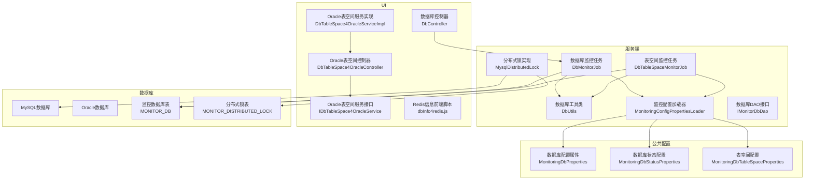
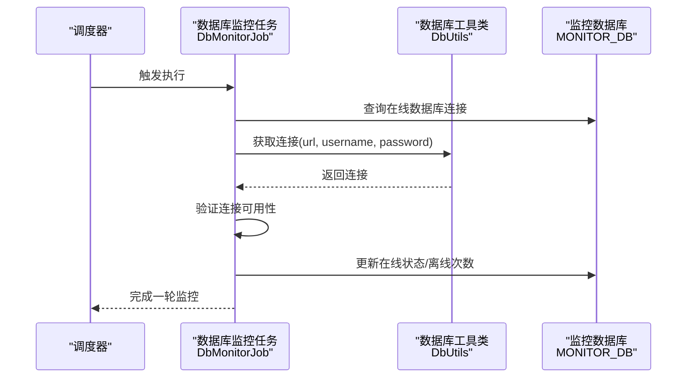
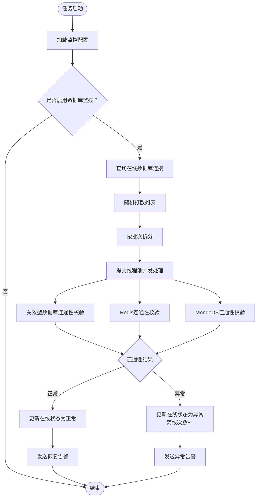
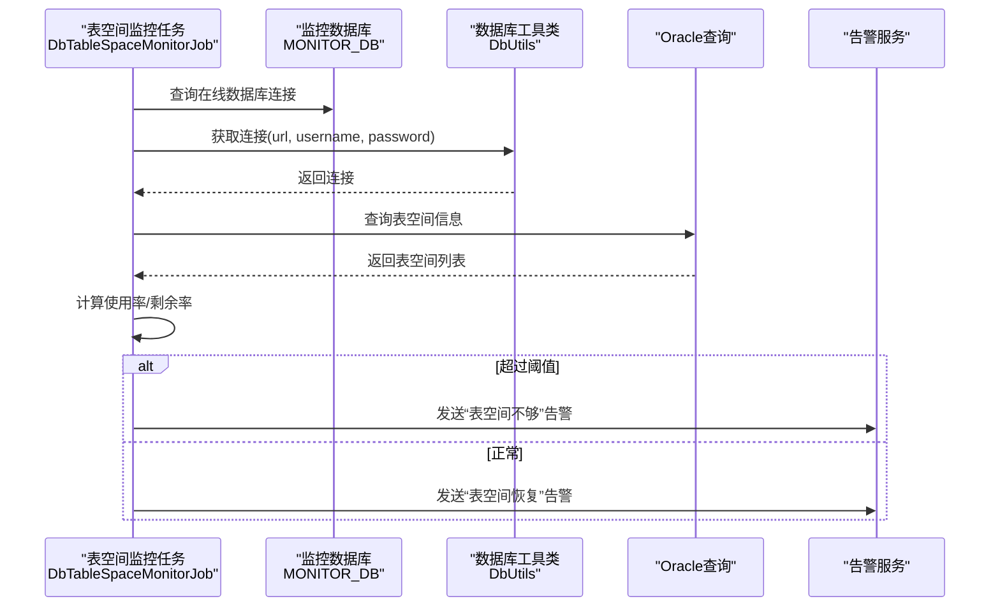
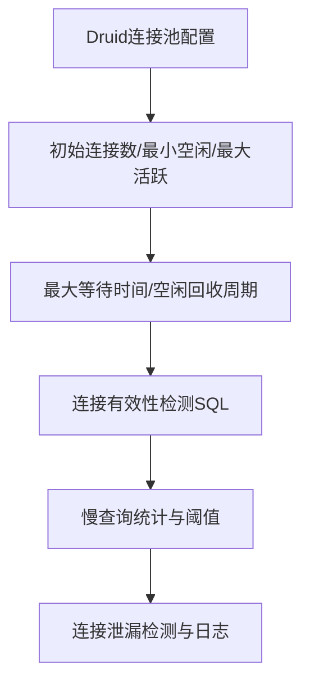
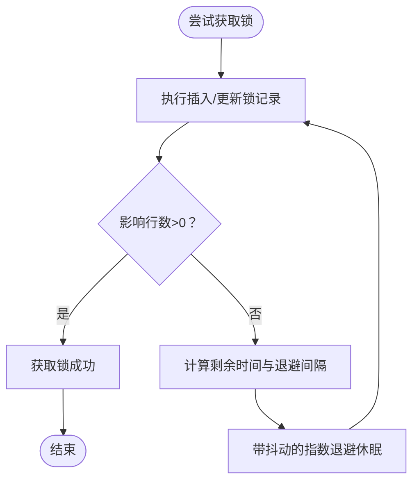
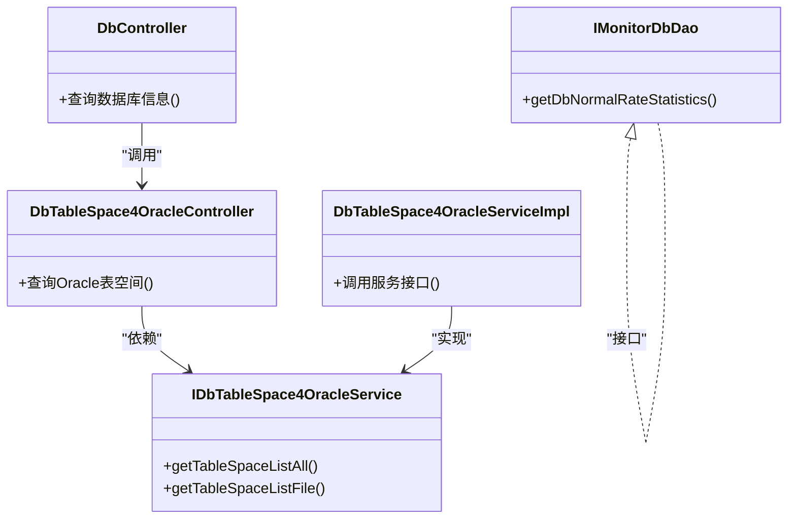
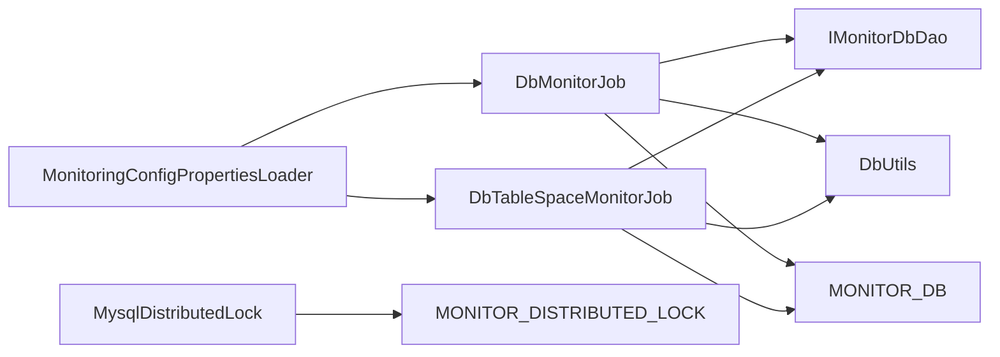

# 数据库问题排查

<cite>
**本文引用的文件**
- [DbMonitorJob.java](file://phoenix-server/src/main/java/com/gitee/pifeng/monitoring/server/business/server/monitor/db/DbMonitorJob.java)
- [DbTableSpaceMonitorJob.java](file://phoenix-server/src/main/java/com/gitee/pifeng/monitoring/server/business/server/monitor/db/DbTableSpaceMonitorJob.java)
- [DbUtils.java](file://phoenix-server/src/main/java/com/gitee/pifeng/monitoring/server/util/db/DbUtils.java)
- [MysqlDistributedLock.java](file://phoenix-server/src/main/java/com/gitee/pifeng/monitoring/server/business/server/core/MysqlDistributedLock.java)
- [MonitoringDbProperties.java](file://phoenix-common/phoenix-common-core/src/main/java/com/gitee/pifeng/monitoring/common/property/server/MonitoringDbProperties.java)
- [MonitoringDbStatusProperties.java](file://phoenix-common/phoenix-common-core/src/main/java/com/gitee/pifeng/monitoring/common/property/server/MonitoringDbStatusProperties.java)
- [MonitoringDbTableSpaceProperties.java](file://phoenix-common/phoenix-common-core/src/main/java/com/gitee/pifeng/monitoring/common/property/server/MonitoringDbTableSpaceProperties.java)
- [MonitoringConfigPropertiesLoader.java](file://phoenix-server/src/main/java/com/gitee/pifeng/monitoring/server/business/server/core/MonitoringConfigPropertiesLoader.java)
- [application.yml](file://phoenix-ui/src/main/resources/application.yml)
- [phoenix.sql](file://doc/数据库设计/sql/mysql/phoenix.sql)
- [DbController.java](file://phoenix-server/src/main/java/com/gitee/pifeng/monitoring/server/business/server/controller/DbController.java)
- [DbTableSpace4OracleController.java](file://phoenix-server/src/main/java/com/gitee/pifeng/monitoring/server/business/server/controller/DbTableSpace4OracleController.java)
- [IDbTableSpace4OracleService.java](file://phoenix-server/src/main/java/com/gitee/pifeng/monitoring/server/business/server/service/IDbTableSpace4OracleService.java)
- [IMonitorDbDao.java](file://phoenix-ui/src/main/java/com/gitee/pifeng/monitoring/ui/business/web/dao/IMonitorDbDao.java)
- [DbTableSpace4OracleServiceImpl.java](file://phoenix-ui/src/main/java/com/gitee/pifeng/monitoring/ui/business/web/service/impl/DbTableSpace4OracleServiceImpl.java)
- [dbInfo4redis.js](file://phoenix-ui/src/main/resources/static/modules/db/dbInfo4redis.js)
- [DbTableSpace.java](file://phoenix-server/src/main/java/com/gitee/pifeng/monitoring/server/business/server/domain/DbTableSpace.java)
</cite>

## 目录
1. [简介](#简介)
2. [项目结构](#项目结构)
3. [核心组件](#核心组件)
4. [架构总览](#架构总览)
5. [详细组件分析](#详细组件分析)
6. [依赖分析](#依赖分析)
7. [性能考量](#性能考量)
8. [故障排查指南](#故障排查指南)
9. [结论](#结论)
10. [附录](#附录)

## 简介
本文件面向Phoenix监控系统的数据库问题排查，围绕以下主题提供系统化的诊断与处置方法：
- 连接池问题：配置不当、连接泄漏、连接超时、连接数限制
- 慢查询分析与优化：慢查询日志启用、慢SQL识别、执行计划分析、索引优化
- 锁等待与死锁：锁等待监控、死锁检测、锁竞争分析、事务优化
- 存储空间不足：数据库文件增长监控、空间清理策略、归档与压缩、容量规划
- 数据库性能监控与调优：关键指标监控、瓶颈识别、参数调优、备份与恢复
- 版本兼容性：不同数据库版本差异、迁移策略、升级注意事项

## 项目结构
Phoenix监控系统由服务端、UI与公共模块组成，数据库相关能力主要集中在服务端的数据库监控任务与UI侧的数据库管理页面。

**图表来源**
- [DbMonitorJob.java:101-156](file://phoenix-server/src/main/java/com/gitee/pifeng/monitoring/server/business/server/monitor/db/DbMonitorJob.java#L101-L156)
- [DbTableSpaceMonitorJob.java:105-151](file://phoenix-server/src/main/java/com/gitee/pifeng/monitoring/server/business/server/monitor/db/DbTableSpaceMonitorJob.java#L105-L151)
- [DbUtils.java:46-55](file://phoenix-server/src/main/java/com/gitee/pifeng/monitoring/server/util/db/DbUtils.java#L46-L55)
- [MysqlDistributedLock.java:237-245](file://phoenix-server/src/main/java/com/gitee/pifeng/monitoring/server/business/server/core/MysqlDistributedLock.java#L237-L245)
- [MonitoringConfigPropertiesLoader.java:162-176](file://phoenix-server/src/main/java/com/gitee/pifeng/monitoring/server/business/server/core/MonitoringConfigPropertiesLoader.java#L162-L176)
- [IMonitorDbDao.java:16-29](file://phoenix-ui/src/main/java/com/gitee/pifeng/monitoring/ui/business/web/dao/IMonitorDbDao.java#L16-L29)
- [DbController.java:1-33](file://phoenix-server/src/main/java/com/gitee/pifeng/monitoring/server/business/server/controller/DbController.java#L1-L33)
- [DbTableSpace4OracleController.java:1-32](file://phoenix-server/src/main/java/com/gitee/pifeng/monitoring/server/business/server/controller/DbTableSpace4OracleController.java#L1-L32)
- [IDbTableSpace4OracleService.java:1-48](file://phoenix-server/src/main/java/com/gitee/pifeng/monitoring/server/business/server/service/IDbTableSpace4OracleService.java#L1-L48)
- [DbTableSpace4OracleServiceImpl.java:1-28](file://phoenix-ui/src/main/java/com/gitee/pifeng/monitoring/ui/business/web/service/impl/DbTableSpace4OracleServiceImpl.java#L1-L28)
- [dbInfo4redis.js:131-152](file://phoenix-ui/src/main/resources/static/modules/db/dbInfo4redis.js#L131-L152)

**章节来源**
- [DbMonitorJob.java:1-449](file://phoenix-server/src/main/java/com/gitee/pifeng/monitoring/server/business/server/monitor/db/DbMonitorJob.java#L1-L449)
- [DbTableSpaceMonitorJob.java:1-272](file://phoenix-server/src/main/java/com/gitee/pifeng/monitoring/server/business/server/monitor/db/DbTableSpaceMonitorJob.java#L1-L272)
- [DbUtils.java:1-58](file://phoenix-server/src/main/java/com/gitee/pifeng/monitoring/server/util/db/DbUtils.java#L1-L58)
- [MysqlDistributedLock.java:70-247](file://phoenix-server/src/main/java/com/gitee/pifeng/monitoring/server/business/server/core/MysqlDistributedLock.java#L70-L247)
- [MonitoringConfigPropertiesLoader.java:162-176](file://phoenix-server/src/main/java/com/gitee/pifeng/monitoring/server/business/server/core/MonitoringConfigPropertiesLoader.java#L162-L176)
- [application.yml:84-152](file://phoenix-ui/src/main/resources/application.yml#L84-L152)
- [phoenix.sql:110-139](file://doc/数据库设计/sql/mysql/phoenix.sql#L110-L139)
- [IMonitorDbDao.java:1-29](file://phoenix-ui/src/main/java/com/gitee/pifeng/monitoring/ui/business/web/dao/IMonitorDbDao.java#L1-L29)
- [DbController.java:1-33](file://phoenix-server/src/main/java/com/gitee/pifeng/monitoring/server/business/server/controller/DbController.java#L1-L33)
- [DbTableSpace4OracleController.java:1-32](file://phoenix-server/src/main/java/com/gitee/pifeng/monitoring/server/business/server/controller/DbTableSpace4OracleController.java#L1-L32)
- [IDbTableSpace4OracleService.java:1-48](file://phoenix-server/src/main/java/com/gitee/pifeng/monitoring/server/business/server/service/IDbTableSpace4OracleService.java#L1-L48)
- [DbTableSpace4OracleServiceImpl.java:1-28](file://phoenix-ui/src/main/java/com/gitee/pifeng/monitoring/ui/business/web/service/impl/DbTableSpace4OracleServiceImpl.java#L1-L28)
- [dbInfo4redis.js:131-152](file://phoenix-ui/src/main/resources/static/modules/db/dbInfo4redis.js#L131-L152)

## 核心组件
- 数据库状态监控任务：周期性扫描监控数据库连接，验证连通性并发送告警。
- 表空间监控任务：针对Oracle数据库查询表空间使用率，超过阈值则告警。
- 数据库工具类：封装连接获取逻辑，统一异常处理。
- 分布式锁实现：基于MySQL表实现带退避重试的分布式锁，避免锁竞争与死锁。
- 监控配置属性：集中管理数据库监控开关、告警开关、阈值与级别。
- UI控制器与服务：提供数据库信息展示与Oracle表空间查询接口。
- 数据库表结构：MONITOR_DB、MONITOR_DISTRIBUTED_LOCK等核心表支撑监控与锁机制。

**章节来源**
- [DbMonitorJob.java:101-156](file://phoenix-server/src/main/java/com/gitee/pifeng/monitoring/server/business/server/monitor/db/DbMonitorJob.java#L101-L156)
- [DbTableSpaceMonitorJob.java:164-210](file://phoenix-server/src/main/java/com/gitee/pifeng/monitoring/server/business/server/monitor/db/DbTableSpaceMonitorJob.java#L164-L210)
- [DbUtils.java:46-55](file://phoenix-server/src/main/java/com/gitee/pifeng/monitoring/server/util/db/DbUtils.java#L46-L55)
- [MysqlDistributedLock.java:205-225](file://phoenix-server/src/main/java/com/gitee/pifeng/monitoring/server/business/server/core/MysqlDistributedLock.java#L205-L225)
- [MonitoringDbProperties.java:19-36](file://phoenix-common/phoenix-common-core/src/main/java/com/gitee/pifeng/monitoring/common/property/server/MonitoringDbProperties.java#L19-L36)
- [MonitoringDbStatusProperties.java:19-31](file://phoenix-common/phoenix-common-core/src/main/java/com/gitee/pifeng/monitoring/common/property/server/MonitoringDbStatusProperties.java#L19-L31)
- [MonitoringDbTableSpaceProperties.java:20-42](file://phoenix-common/phoenix-common-core/src/main/java/com/gitee/pifeng/monitoring/common/property/server/MonitoringDbTableSpaceProperties.java#L20-L42)
- [DbTableSpace.java:22-54](file://phoenix-server/src/main/java/com/gitee/pifeng/monitoring/server/business/server/domain/DbTableSpace.java#L22-L54)

## 架构总览
数据库监控链路从配置加载开始，任务调度器触发监控任务，任务通过工具类建立数据库连接，执行健康检查或表空间查询，根据阈值与告警策略生成告警并落库。

**图表来源**
- [DbMonitorJob.java:101-156](file://phoenix-server/src/main/java/com/gitee/pifeng/monitoring/server/business/server/monitor/db/DbMonitorJob.java#L101-L156)
- [DbUtils.java:46-55](file://phoenix-server/src/main/java/com/gitee/pifeng/monitoring/server/util/db/DbUtils.java#L46-L55)
- [phoenix.sql:110-139](file://doc/数据库设计/sql/mysql/phoenix.sql#L110-L139)

## 详细组件分析

### 组件A：数据库状态监控任务（DbMonitorJob）
职责与流程：
- 读取监控配置，判断是否启用数据库监控与状态监控。
- 随机打散监控列表，分批提交至线程池并发处理。
- 对关系型数据库分别执行连通性校验，对Redis/MongoDB执行专用连通性测试。
- 根据连通性结果更新MONITOR_DB表状态并发送告警。

**图表来源**
- [DbMonitorJob.java:101-156](file://phoenix-server/src/main/java/com/gitee/pifeng/monitoring/server/business/server/monitor/db/DbMonitorJob.java#L101-L156)
- [DbMonitorJob.java:262-301](file://phoenix-server/src/main/java/com/gitee/pifeng/monitoring/server/business/server/monitor/db/DbMonitorJob.java#L262-L301)
- [DbMonitorJob.java:312-352](file://phoenix-server/src/main/java/com/gitee/pifeng/monitoring/server/business/server/monitor/db/DbMonitorJob.java#L312-L352)

**章节来源**
- [DbMonitorJob.java:1-449](file://phoenix-server/src/main/java/com/gitee/pifeng/monitoring/server/business/server/monitor/db/DbMonitorJob.java#L1-L449)
- [MonitoringConfigPropertiesLoader.java:162-176](file://phoenix-server/src/main/java/com/gitee/pifeng/monitoring/server/business/server/core/MonitoringConfigPropertiesLoader.java#L162-L176)
- [phoenix.sql:110-139](file://doc/数据库设计/sql/mysql/phoenix.sql#L110-L139)

### 组件B：表空间监控任务（DbTableSpaceMonitorJob）
职责与流程：
- 仅对Oracle数据库执行表空间查询。
- 读取配置阈值与告警级别，计算使用率与剩余率。
- 超阈值发送告警，正常则发送恢复告警。
- 结果以领域模型封装并通过告警服务落库。

**图表来源**
- [DbTableSpaceMonitorJob.java:164-210](file://phoenix-server/src/main/java/com/gitee/pifeng/monitoring/server/business/server/monitor/db/DbTableSpaceMonitorJob.java#L164-L210)
- [DbTableSpaceMonitorJob.java:226-272](file://phoenix-server/src/main/java/com/gitee/pifeng/monitoring/server/business/server/monitor/db/DbTableSpaceMonitorJob.java#L226-L272)
- [DbUtils.java:46-55](file://phoenix-server/src/main/java/com/gitee/pifeng/monitoring/server/util/db/DbUtils.java#L46-L55)

**章节来源**
- [DbTableSpaceMonitorJob.java:1-272](file://phoenix-server/src/main/java/com/gitee/pifeng/monitoring/server/business/server/monitor/db/DbTableSpaceMonitorJob.java#L1-L272)
- [DbTableSpace.java:22-54](file://phoenix-server/src/main/java/com/gitee/pifeng/monitoring/server/business/server/domain/DbTableSpace.java#L22-L54)
- [MonitoringDbTableSpaceProperties.java:20-42](file://phoenix-common/phoenix-common-core/src/main/java/com/gitee/pifeng/monitoring/common/property/server/MonitoringDbTableSpaceProperties.java#L20-L42)

### 组件C：数据库连接池与慢查询（基于Druid配置）
- 连接池参数：初始连接数、最小空闲、最大活跃、最大等待时间、空闲回收周期、最小存活时间、连接有效性检测SQL等。
- 慢查询配置：开启慢SQL合并统计、慢SQL阈值（毫秒）。
- 泄漏检测：开启移除废弃连接与超时时间，输出废弃日志。

**图表来源**
- [application.yml:84-152](file://phoenix-ui/src/main/resources/application.yml#L84-L152)

**章节来源**
- [application.yml:84-152](file://phoenix-ui/src/main/resources/application.yml#L84-L152)

### 组件D：分布式锁（MysqlDistributedLock）
- 实现要点：基于唯一键冲突实现“抢占过期锁”，结合指数退避与抖动控制重试节奏，避免DB压力与“对齐效应”。
- 连接策略：显式获取auto-commit连接，避免绑定Spring事务。
- 清理策略：概率性清理过期锁，降低维护成本。

**图表来源**
- [MysqlDistributedLock.java:76-118](file://phoenix-server/src/main/java/com/gitee/pifeng/monitoring/server/business/server/core/MysqlDistributedLock.java#L76-L118)
- [MysqlDistributedLock.java:205-225](file://phoenix-server/src/main/java/com/gitee/pifeng/monitoring/server/business/server/core/MysqlDistributedLock.java#L205-L225)

**章节来源**
- [MysqlDistributedLock.java:70-247](file://phoenix-server/src/main/java/com/gitee/pifeng/monitoring/server/business/server/core/MysqlDistributedLock.java#L70-L247)

### 组件E：UI侧数据库管理与Oracle表空间
- 控制器：提供数据库信息查询与Oracle表空间查询接口。
- 服务接口与实现：封装Oracle表空间查询逻辑，供UI调用。
- DAO：提供数据库正常率统计等查询能力。
- 前端脚本：展示Redis键空间信息（示例，体现UI侧数据渲染思路）。

**图表来源**
- [DbController.java:1-33](file://phoenix-server/src/main/java/com/gitee/pifeng/monitoring/server/business/server/controller/DbController.java#L1-L33)
- [DbTableSpace4OracleController.java:1-32](file://phoenix-server/src/main/java/com/gitee/pifeng/monitoring/server/business/server/controller/DbTableSpace4OracleController.java#L1-L32)
- [IDbTableSpace4OracleService.java:1-48](file://phoenix-server/src/main/java/com/gitee/pifeng/monitoring/server/business/server/service/IDbTableSpace4OracleService.java#L1-L48)
- [DbTableSpace4OracleServiceImpl.java:1-28](file://phoenix-ui/src/main/java/com/gitee/pifeng/monitoring/ui/business/web/service/impl/DbTableSpace4OracleServiceImpl.java#L1-L28)
- [IMonitorDbDao.java:16-29](file://phoenix-ui/src/main/java/com/gitee/pifeng/monitoring/ui/business/web/dao/IMonitorDbDao.java#L16-L29)

**章节来源**
- [DbController.java:1-33](file://phoenix-server/src/main/java/com/gitee/pifeng/monitoring/server/business/server/controller/DbController.java#L1-L33)
- [DbTableSpace4OracleController.java:1-32](file://phoenix-server/src/main/java/com/gitee/pifeng/monitoring/server/business/server/controller/DbTableSpace4OracleController.java#L1-L32)
- [IDbTableSpace4OracleService.java:1-48](file://phoenix-server/src/main/java/com/gitee/pifeng/monitoring/server/business/server/service/IDbTableSpace4OracleService.java#L1-L48)
- [DbTableSpace4OracleServiceImpl.java:1-28](file://phoenix-ui/src/main/java/com/gitee/pifeng/monitoring/ui/business/web/service/impl/DbTableSpace4OracleServiceImpl.java#L1-L28)
- [IMonitorDbDao.java:1-29](file://phoenix-ui/src/main/java/com/gitee/pifeng/monitoring/ui/business/web/dao/IMonitorDbDao.java#L1-L29)

## 依赖分析
- 配置依赖：监控配置加载器集中读取数据库监控开关、告警开关、阈值与级别，贯穿任务执行。
- 数据依赖：MONITOR_DB作为监控目标清单，MONITOR_DISTRIBUTED_LOCK支撑分布式锁。
- 工具依赖：DbUtils统一连接获取，简化异常处理。
- 任务依赖：DbMonitorJob与DbTableSpaceMonitorJob分别负责状态与表空间监控，互不干扰。

**图表来源**
- [MonitoringConfigPropertiesLoader.java:162-176](file://phoenix-server/src/main/java/com/gitee/pifeng/monitoring/server/business/server/core/MonitoringConfigPropertiesLoader.java#L162-L176)
- [DbMonitorJob.java:101-156](file://phoenix-server/src/main/java/com/gitee/pifeng/monitoring/server/business/server/monitor/db/DbMonitorJob.java#L101-L156)
- [DbTableSpaceMonitorJob.java:105-151](file://phoenix-server/src/main/java/com/gitee/pifeng/monitoring/server/business/server/monitor/db/DbTableSpaceMonitorJob.java#L105-L151)
- [DbUtils.java:46-55](file://phoenix-server/src/main/java/com/gitee/pifeng/monitoring/server/util/db/DbUtils.java#L46-L55)
- [phoenix.sql:110-139](file://doc/数据库设计/sql/mysql/phoenix.sql#L110-L139)
- [phoenix.sql:142-155](file://doc/数据库设计/sql/mysql/phoenix.sql#L142-L155)
- [MysqlDistributedLock.java:237-245](file://phoenix-server/src/main/java/com/gitee/pifeng/monitoring/server/business/server/core/MysqlDistributedLock.java#L237-L245)

**章节来源**
- [MonitoringConfigPropertiesLoader.java:162-176](file://phoenix-server/src/main/java/com/gitee/pifeng/monitoring/server/business/server/core/MonitoringConfigPropertiesLoader.java#L162-L176)
- [phoenix.sql:110-139](file://doc/数据库设计/sql/mysql/phoenix.sql#L110-L139)
- [phoenix.sql:142-155](file://doc/数据库设计/sql/mysql/phoenix.sql#L142-L155)

## 性能考量
- 并发与批处理：监控任务对数据库连接列表进行随机打散与分批提交，配合线程池提升吞吐。
- 指数退避与抖动：分布式锁采用指数退避+抖动，降低DB压力与“对齐效应”。
- 连接池参数：合理设置初始连接、最大等待、空闲回收与有效性检测，平衡延迟与资源占用。
- 慢查询监控：开启慢SQL统计与阈值，结合索引优化与SQL改写降低热点查询对整体性能的影响。

[本节为通用指导，无需特定文件引用]

## 故障排查指南

### 1. 连接池问题
- 症状
  - 获取连接超时、连接数达到上限、连接泄漏导致连接池枯竭。
- 诊断步骤
  - 检查Druid连接池配置项与慢查询统计，确认最大等待时间、最大活跃数、空闲回收周期是否合理。
  - 开启连接泄漏检测与废弃日志，定位长时间未释放的连接。
  - 观察监控任务与业务线程池的并发情况，避免过度竞争。
- 处置建议
  - 调整初始连接与最大活跃数，确保满足峰值需求。
  - 设置合理的最大等待时间，避免阻塞堆积。
  - 启用连接有效性检测SQL，定期回收无效连接。
  - 修复业务代码，确保连接在finally块中正确关闭。

**章节来源**
- [application.yml:84-152](file://phoenix-ui/src/main/resources/application.yml#L84-L152)
- [DbMonitorJob.java:117-151](file://phoenix-server/src/main/java/com/gitee/pifeng/monitoring/server/business/server/monitor/db/DbMonitorJob.java#L117-L151)

### 2. 慢查询分析与优化
- 症状
  - 接口响应时间长、数据库CPU高、慢查询日志频繁。
- 诊断步骤
  - 启用慢查询统计与阈值，定位慢SQL。
  - 分析执行计划，识别全表扫描、缺少索引、回表过多等问题。
  - 结合业务热点SQL，评估索引覆盖与选择性。
- 优化策略
  - 创建合适的单列/复合索引，提升过滤与排序效率。
  - 改写SQL，避免隐式转换、函数包裹、OR条件等导致的索引失效。
  - 分页查询优化，避免深层OFFSET。
  - 将复杂查询拆分为多次简单查询，或引入物化视图/缓存。

**章节来源**
- [application.yml:118-119](file://phoenix-ui/src/main/resources/application.yml#L118-L119)

### 3. 锁等待与死锁
- 症状
  - 事务长时间不提交、锁等待队列增长、偶发死锁。
- 诊断步骤
  - 使用分布式锁实现（基于唯一键冲突与过期时间）避免竞态。
  - 观察MONITOR_DISTRIBUTED_LOCK表，清理过期锁，防止“幽灵锁”。
  - 分析事务粒度与隔离级别，减少长事务与跨行锁竞争。
- 处置建议
  - 采用指数退避+抖动的重试策略，降低DB压力。
  - 显式获取auto-commit连接，避免Spring事务绑定导致的锁传播。
  - 缩短事务时间，批量提交，减少锁持有时间。

**章节来源**
- [MysqlDistributedLock.java:76-118](file://phoenix-server/src/main/java/com/gitee/pifeng/monitoring/server/business/server/core/MysqlDistributedLock.java#L76-L118)
- [MysqlDistributedLock.java:205-225](file://phoenix-server/src/main/java/com/gitee/pifeng/monitoring/server/business/server/core/MysqlDistributedLock.java#L205-L225)
- [phoenix.sql:142-155](file://doc/数据库设计/sql/mysql/phoenix.sql#L142-L155)

### 4. 存储空间不足
- 症状
  - 表空间使用率接近阈值、数据库写入失败、IO压力增大。
- 诊断步骤
  - 使用表空间监控任务获取各表空间使用率与剩余率。
  - 结合业务增长趋势，评估归档与压缩策略。
- 处置建议
  - 提升表空间配额或扩容数据文件。
  - 清理历史数据、归档旧数据、启用压缩。
  - 制定容量规划与预警阈值，定期巡检。

**章节来源**
- [DbTableSpaceMonitorJob.java:164-210](file://phoenix-server/src/main/java/com/gitee/pifeng/monitoring/server/business/server/monitor/db/DbTableSpaceMonitorJob.java#L164-L210)
- [MonitoringDbTableSpaceProperties.java:20-42](file://phoenix-common/phoenix-common-core/src/main/java/com/gitee/pifeng/monitoring/common/property/server/MonitoringDbTableSpaceProperties.java#L20-L42)

### 5. 数据库性能监控与调优
- 关键指标
  - 连接池利用率、活跃连接数、等待时间、超时次数。
  - 慢查询数量与占比、平均响应时间。
  - 表空间使用率、剩余率、增长趋势。
- 调优策略
  - 参数调优：连接池大小、超时阈值、回收策略。
  - 业务优化：SQL优化、索引优化、分页与缓存。
  - 备份与恢复：制定备份策略，验证恢复流程，确保RPO/RTO达标。

**章节来源**
- [DbMonitorJob.java:101-156](file://phoenix-server/src/main/java/com/gitee/pifeng/monitoring/server/business/server/monitor/db/DbMonitorJob.java#L101-L156)
- [DbTableSpaceMonitorJob.java:105-151](file://phoenix-server/src/main/java/com/gitee/pifeng/monitoring/server/business/server/monitor/db/DbTableSpaceMonitorJob.java#L105-L151)

### 6. 版本兼容性问题
- 症状
  - 驱动版本不匹配、SQL语法差异、功能特性缺失。
- 处置建议
  - 统一数据库驱动版本，确保与数据库版本兼容。
  - 针对不同数据库（如MySQL、Oracle）分别配置SQL与连接参数。
  - 进行迁移前的兼容性测试，逐步切换并验证功能与性能。

**章节来源**
- [DbMonitorJob.java:372-379](file://phoenix-server/src/main/java/com/gitee/pifeng/monitoring/server/business/server/monitor/db/DbMonitorJob.java#L372-L379)

## 结论
Phoenix监控系统通过任务化与配置化的手段实现了数据库状态与表空间的自动化监控，并提供了连接池、慢查询、锁与存储空间等关键问题的排查路径。建议在生产环境中：
- 合理配置连接池与慢查询阈值；
- 建立表空间与连接池的预警阈值；
- 使用分布式锁与指数退避策略降低锁竞争；
- 持续优化SQL与索引，控制慢查询比例；
- 制定容量规划与备份恢复策略，保障业务连续性。

[本节为总结，无需特定文件引用]

## 附录
- 监控数据库表结构参考：MONITOR_DB、MONITOR_DISTRIBUTED_LOCK等。
- UI侧数据库管理入口与Oracle表空间查询接口。

**章节来源**
- [phoenix.sql:110-139](file://doc/数据库设计/sql/mysql/phoenix.sql#L110-L139)
- [phoenix.sql:142-155](file://doc/数据库设计/sql/mysql/phoenix.sql#L142-L155)
- [DbController.java:1-33](file://phoenix-server/src/main/java/com/gitee/pifeng/monitoring/server/business/server/controller/DbController.java#L1-L33)
- [DbTableSpace4OracleController.java:1-32](file://phoenix-server/src/main/java/com/gitee/pifeng/monitoring/server/business/server/controller/DbTableSpace4OracleController.java#L1-L32)