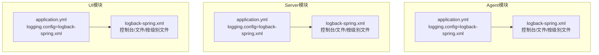
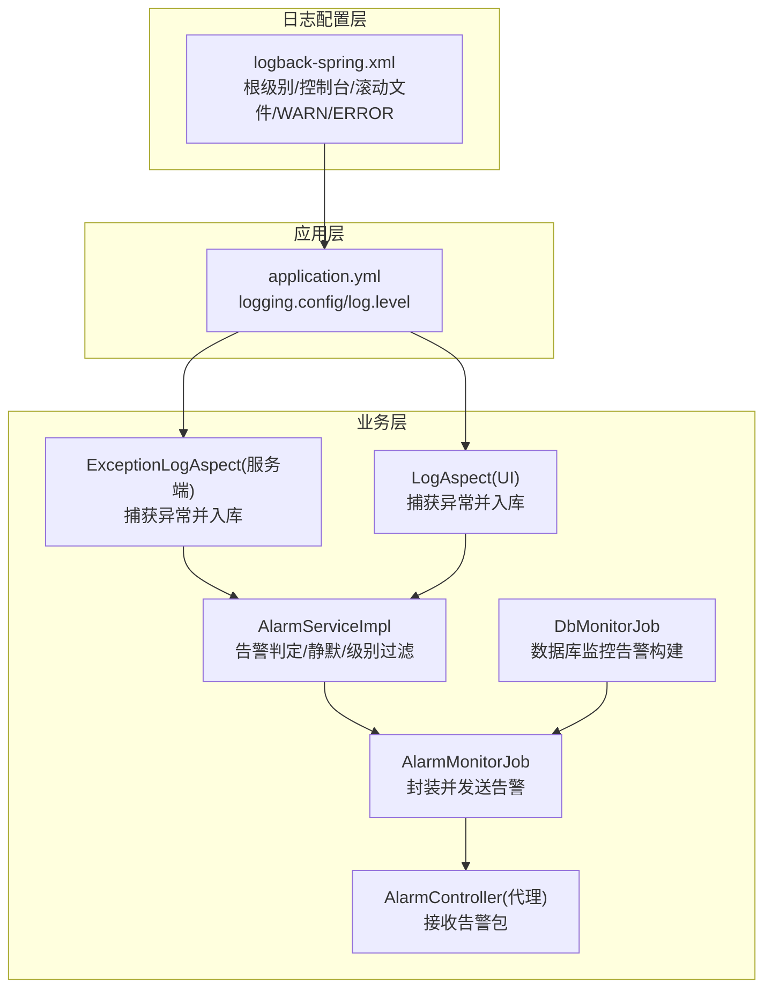
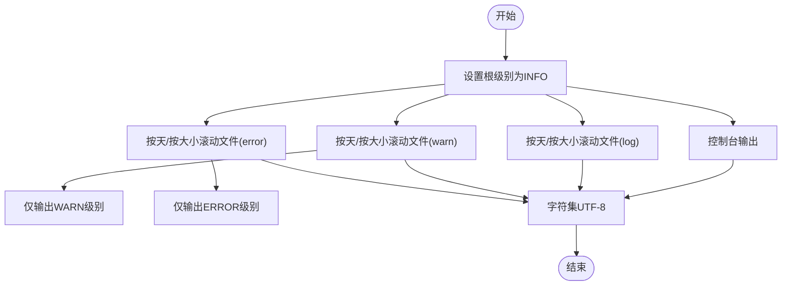
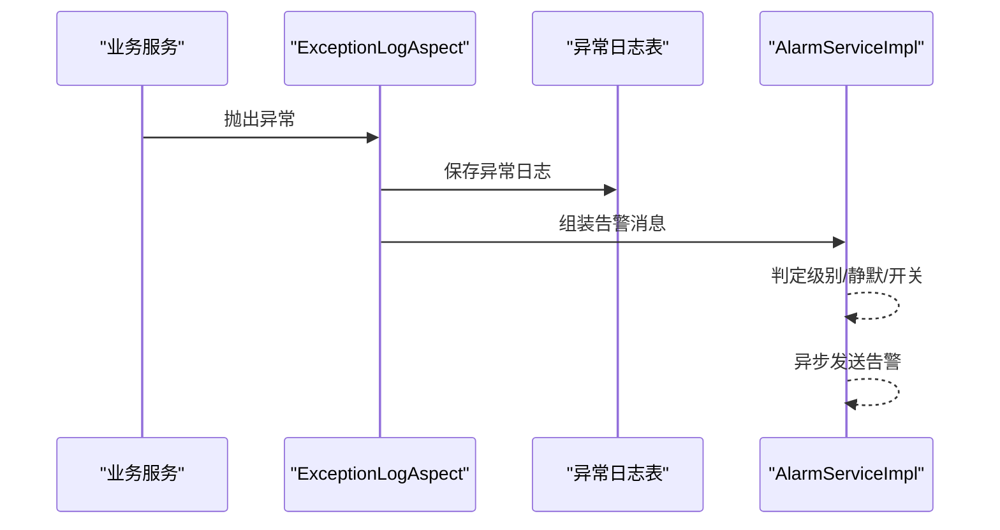
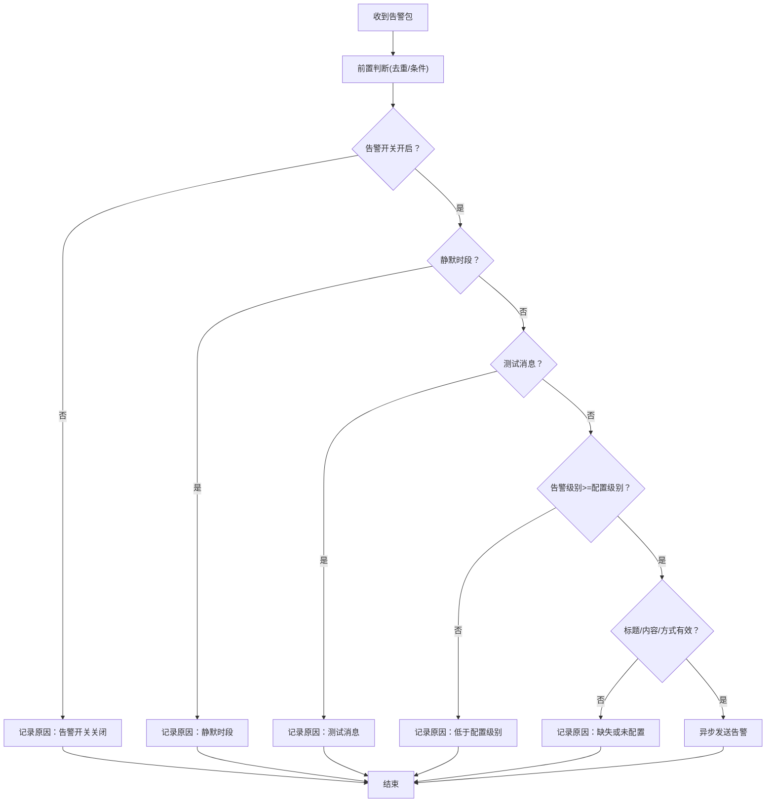
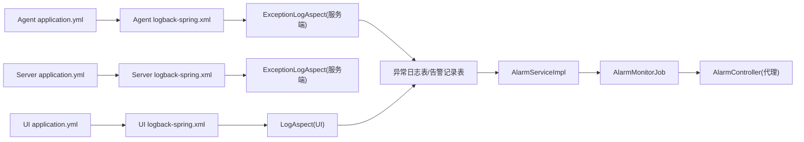
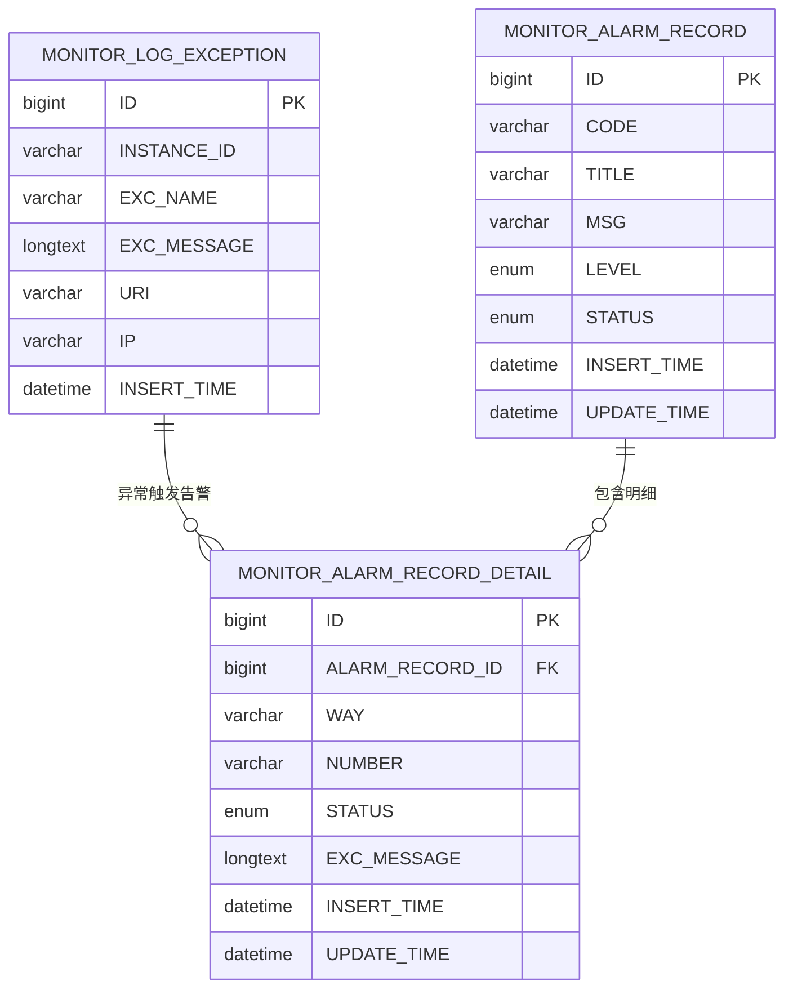

# 日志分析

<cite>
**本文引用的文件**
- [phoenix-agent/src/main/resources/logback-spring.xml](file://phoenix-agent/src/main/resources/logback-spring.xml)
- [phoenix-server/src/main/resources/logback-spring.xml](file://phoenix-server/src/main/resources/logback-spring.xml)
- [phoenix-ui/src/main/resources/logback-spring.xml](file://phoenix-ui/src/main/resources/logback-spring.xml)
- [phoenix-agent/src/main/resources/application.yml](file://phoenix-agent/src/main/resources/application.yml)
- [phoenix-server/src/main/resources/application.yml](file://phoenix-server/src/main/resources/application.yml)
- [phoenix-ui/src/main/resources/application.yml](file://phoenix-ui/src/main/resources/application.yml)
- [phoenix-server/src/main/java/com/gitee/pifeng/monitoring/server/business/server/service/impl/AlarmServiceImpl.java](file://phoenix-server/src/main/java/com/gitee/pifeng/monitoring/server/business/server/service/impl/AlarmServiceImpl.java)
- [phoenix-server/src/main/java/com/gitee/pifeng/monitoring/server/business/server/monitor/AlarmMonitorJob.java](file://phoenix-server/src/main/java/com/gitee/pifeng/monitoring/server/business/server/monitor/AlarmMonitorJob.java)
- [phoenix-server/src/main/java/com/gitee/pifeng/monitoring/server/business/server/monitor/db/DbMonitorJob.java](file://phoenix-server/src/main/java/com/gitee/pifeng/monitoring/server/business/server/monitor/db/DbMonitorJob.java)
- [phoenix-server/src/main/java/com/gitee/pifeng/monitoring/server/business/server/component/ExceptionLogAspect.java](file://phoenix-server/src/main/java/com/gitee/pifeng/monitoring/server/business/server/component/ExceptionLogAspect.java)
- [phoenix-ui/src/main/java/com/gitee/pifeng/monitoring/ui/business/web/component/LogAspect.java](file://phoenix-ui/src/main/java/com/gitee/pifeng/monitoring/ui/business/web/component/LogAspect.java)
- [phoenix-ui/src/main/java/com/gitee/pifeng/monitoring/ui/business/web/mapper/MonitorLogExceptionMapper.xml](file://phoenix-ui/src/main/java/com/gitee/pifeng/monitoring/ui/business/web/mapper/MonitorLogExceptionMapper.xml)
- [phoenix-agent/src/main/java/com/gitee/pifeng/monitoring/agent/business/client/controller/AlarmController.java](file://phoenix-agent/src/main/java/com/gitee/pifeng/monitoring/agent/business/client/controller/AlarmController.java)
- [doc/数据库设计/sql/mysql/phoenix.sql](file://doc/数据库设计/sql/mysql/phoenix.sql)
</cite>

## 目录
1. [简介](#简介)
2. [项目结构](#项目结构)
3. [核心组件](#核心组件)
4. [架构总览](#架构总览)
5. [详细组件分析](#详细组件分析)
6. [依赖关系分析](#依赖关系分析)
7. [性能考量](#性能考量)
8. [故障排查指南](#故障排查指南)
9. [结论](#结论)
10. [附录](#附录)

## 简介
本文件面向Phoenix监控系统的日志分析与运维实践，围绕Logback日志配置展开，涵盖日志级别、滚动策略、格式模式、字符集等配置项的说明与最佳实践；解释启动、运行、错误、警告等日志的识别与分析方法；提供日志格式字段解读指南；介绍日志收集与分析工具的使用思路；并通过实际案例展示如何利用日志定位系统问题、性能瓶颈与异常情况；最后给出日志监控与告警配置建议。

## 项目结构
Phoenix由三个子模块组成：agent（采集端）、server（服务端）、ui（前端UI）。三者均采用Spring Boot + Logback的组合，日志配置位于各自模块的资源目录中，统一通过application.yml中的logging.config指向logback-spring.xml。

图表来源
- [phoenix-agent/src/main/resources/application.yml:21-31](file://phoenix-agent/src/main/resources/application.yml#L21-L31)
- [phoenix-server/src/main/resources/application.yml:23-31](file://phoenix-server/src/main/resources/application.yml#L23-L31)
- [phoenix-ui/src/main/resources/application.yml:30-38](file://phoenix-ui/src/main/resources/application.yml#L30-L38)
- [phoenix-agent/src/main/resources/logback-spring.xml:1-120](file://phoenix-agent/src/main/resources/logback-spring.xml#L1-L120)
- [phoenix-server/src/main/resources/logback-spring.xml:1-120](file://phoenix-server/src/main/resources/logback-spring.xml#L1-L120)
- [phoenix-ui/src/main/resources/logback-spring.xml:1-120](file://phoenix-ui/src/main/resources/logback-spring.xml#L1-L120)

章节来源
- [phoenix-agent/src/main/resources/application.yml:21-31](file://phoenix-agent/src/main/resources/application.yml#L21-L31)
- [phoenix-server/src/main/resources/application.yml:23-31](file://phoenix-server/src/main/resources/application.yml#L23-L31)
- [phoenix-ui/src/main/resources/application.yml:30-38](file://phoenix-ui/src/main/resources/application.yml#L30-L38)

## 核心组件
- 日志配置文件：各模块的logback-spring.xml定义了根日志级别、控制台输出、滚动文件输出以及按级别（WARN/ERROR）分离的独立文件appender。
- 日志级别：根级别为INFO，同时输出到控制台与多文件appender；WARN/ERROR分别写入独立文件，便于快速筛选。
- 滚动策略：基于“按大小+按时间”的滚动策略，单文件最大2MB，保留30天，总量上限1GB，兼顾容量与检索效率。
- 字符集：统一设置为UTF-8，确保中文等字符正确显示。
- 应用配置：application.yml中通过logging.config指向对应模块的logback配置，并设置特定包的日志级别（如监控包、OSHI等）。

章节来源
- [phoenix-agent/src/main/resources/logback-spring.xml:5-120](file://phoenix-agent/src/main/resources/logback-spring.xml#L5-L120)
- [phoenix-server/src/main/resources/logback-spring.xml:5-120](file://phoenix-server/src/main/resources/logback-spring.xml#L5-L120)
- [phoenix-ui/src/main/resources/logback-spring.xml:5-120](file://phoenix-ui/src/main/resources/logback-spring.xml#L5-L120)
- [phoenix-agent/src/main/resources/application.yml:21-31](file://phoenix-agent/src/main/resources/application.yml#L21-L31)
- [phoenix-server/src/main/resources/application.yml:23-31](file://phoenix-server/src/main/resources/application.yml#L23-L31)
- [phoenix-ui/src/main/resources/application.yml:30-38](file://phoenix-ui/src/main/resources/application.yml#L30-L38)

## 架构总览
Phoenix的日志体系由“配置层（logback-spring.xml）+应用层（application.yml）+业务层（异常切面与告警）”构成。业务侧通过切面捕获异常并落库，UI侧提供异常日志查询界面，服务端负责告警判定与发送。

图表来源
- [phoenix-agent/src/main/resources/logback-spring.xml:1-120](file://phoenix-agent/src/main/resources/logback-spring.xml#L1-L120)
- [phoenix-server/src/main/resources/logback-spring.xml:1-120](file://phoenix-server/src/main/resources/logback-spring.xml#L1-L120)
- [phoenix-ui/src/main/resources/logback-spring.xml:1-120](file://phoenix-ui/src/main/resources/logback-spring.xml#L1-L120)
- [phoenix-agent/src/main/resources/application.yml:21-31](file://phoenix-agent/src/main/resources/application.yml#L21-L31)
- [phoenix-server/src/main/resources/application.yml:23-31](file://phoenix-server/src/main/resources/application.yml#L23-L31)
- [phoenix-ui/src/main/resources/application.yml:30-38](file://phoenix-ui/src/main/resources/application.yml#L30-L38)
- [phoenix-server/src/main/java/com/gitee/pifeng/monitoring/server/business/server/component/ExceptionLogAspect.java:175-196](file://phoenix-server/src/main/java/com/gitee/pifeng/monitoring/server/business/server/component/ExceptionLogAspect.java#L175-L196)
- [phoenix-ui/src/main/java/com/gitee/pifeng/monitoring/ui/business/web/component/LogAspect.java:233-256](file://phoenix-ui/src/main/java/com/gitee/pifeng/monitoring/ui/business/web/component/LogAspect.java#L233-L256)
- [phoenix-server/src/main/java/com/gitee/pifeng/monitoring/server/business/server/service/impl/AlarmServiceImpl.java:206-284](file://phoenix-server/src/main/java/com/gitee/pifeng/monitoring/server/business/server/service/impl/AlarmServiceImpl.java#L206-L284)
- [phoenix-server/src/main/java/com/gitee/pifeng/monitoring/server/business/server/monitor/AlarmMonitorJob.java:101-127](file://phoenix-server/src/main/java/com/gitee/pifeng/monitoring/server/business/server/monitor/AlarmMonitorJob.java#L101-L127)
- [phoenix-server/src/main/java/com/gitee/pifeng/monitoring/server/business/server/monitor/db/DbMonitorJob.java:407-434](file://phoenix-server/src/main/java/com/gitee/pifeng/monitoring/server/business/server/monitor/db/DbMonitorJob.java#L407-L434)
- [phoenix-agent/src/main/java/com/gitee/pifeng/monitoring/agent/business/client/controller/AlarmController.java:47-53](file://phoenix-agent/src/main/java/com/gitee/pifeng/monitoring/agent/business/client/controller/AlarmController.java#L47-L53)

## 详细组件分析

### 组件A：日志配置（Logback）
- 配置项概览
  - 根级别：INFO
  - 输出目标：控制台（ConsoleAppender）+ 文件（RollingFileAppender）
  - 分级输出：单独的WARN/ERROR文件，便于快速定位
  - 滚动策略：SizeAndTimeBasedRollingPolicy，单文件最大2MB，保留30天，总量上限1GB
  - 字符集：UTF-8
  - 模式：控制台使用高亮模式，文件输出包含时间、级别、线程、类名与方法名、消息
- 最佳实践
  - 生产环境保持INFO及以上级别，避免过多DEBUG噪声
  - 使用分级文件分离WARN/ERROR，提高检索效率
  - 滚动策略平衡磁盘占用与历史保留，必要时可按环境调整
  - 统一字符集，避免中文乱码
  - 如需更细粒度控制，可在application.yml中为特定包设置级别

图表来源
- [phoenix-agent/src/main/resources/logback-spring.xml:5-120](file://phoenix-agent/src/main/resources/logback-spring.xml#L5-L120)
- [phoenix-server/src/main/resources/logback-spring.xml:5-120](file://phoenix-server/src/main/resources/logback-spring.xml#L5-L120)
- [phoenix-ui/src/main/resources/logback-spring.xml:5-120](file://phoenix-ui/src/main/resources/logback-spring.xml#L5-L120)

章节来源
- [phoenix-agent/src/main/resources/logback-spring.xml:5-120](file://phoenix-agent/src/main/resources/logback-spring.xml#L5-L120)
- [phoenix-server/src/main/resources/logback-spring.xml:5-120](file://phoenix-server/src/main/resources/logback-spring.xml#L5-L120)
- [phoenix-ui/src/main/resources/logback-spring.xml:5-120](file://phoenix-ui/src/main/resources/logback-spring.xml#L5-L120)

### 组件B：日志级别与应用配置
- application.yml中通过logging.config指向logback配置文件，并对特定包设置日志级别（如监控包、OSHI等），以减少无关噪声或增强可观测性。
- Undertow访问日志：各模块均启用了Undertow访问日志，目录位于liblog4phoenix/logs/{module}/undertow，格式为common，便于HTTP层面的审计与分析。

章节来源
- [phoenix-agent/src/main/resources/application.yml:21-31](file://phoenix-agent/src/main/resources/application.yml#L21-L31)
- [phoenix-server/src/main/resources/application.yml:23-31](file://phoenix-server/src/main/resources/application.yml#L23-L31)
- [phoenix-ui/src/main/resources/application.yml:30-38](file://phoenix-ui/src/main/resources/application.yml#L30-L38)

### 组件C：异常捕获与日志入库（服务端）
- ExceptionLogAspect在服务端捕获异常，构造异常日志实体并保存至数据库，同时拼装告警消息，用于后续告警流程。
- 该组件与AlarmServiceImpl配合，形成“异常捕获—告警判定—发送”的闭环。

图表来源
- [phoenix-server/src/main/java/com/gitee/pifeng/monitoring/server/business/server/component/ExceptionLogAspect.java:175-196](file://phoenix-server/src/main/java/com/gitee/pifeng/monitoring/server/business/server/component/ExceptionLogAspect.java#L175-L196)
- [phoenix-server/src/main/java/com/gitee/pifeng/monitoring/server/business/server/service/impl/AlarmServiceImpl.java:105-170](file://phoenix-server/src/main/java/com/gitee/pifeng/monitoring/server/business/server/service/impl/AlarmServiceImpl.java#L105-L170)

章节来源
- [phoenix-server/src/main/java/com/gitee/pifeng/monitoring/server/business/server/component/ExceptionLogAspect.java:175-196](file://phoenix-server/src/main/java/com/gitee/pifeng/monitoring/server/business/server/component/ExceptionLogAspect.java#L175-L196)
- [phoenix-server/src/main/java/com/gitee/pifeng/monitoring/server/business/server/service/impl/AlarmServiceImpl.java:105-170](file://phoenix-server/src/main/java/com/gitee/pifeng/monitoring/server/business/server/service/impl/AlarmServiceImpl.java#L105-L170)

### 组件D：异常捕获与日志入库（UI）
- UI模块同样通过LogAspect捕获异常并入库，便于在前端侧进行异常日志的查询与展示。
- UI提供异常日志列表查询接口，支持按应用、异常名、消息、URI、IP、时间范围等条件筛选。

章节来源
- [phoenix-ui/src/main/java/com/gitee/pifeng/monitoring/ui/business/web/component/LogAspect.java:233-256](file://phoenix-ui/src/main/java/com/gitee/pifeng/monitoring/ui/business/web/component/LogAspect.java#L233-L256)
- [phoenix-ui/src/main/java/com/gitee/pifeng/monitoring/ui/business/web/mapper/MonitorLogExceptionMapper.xml:35-66](file://phoenix-ui/src/main/java/com/gitee/pifeng/monitoring/ui/business/web/mapper/MonitorLogExceptionMapper.xml#L35-L66)

### 组件E：告警判定与发送
- AlarmServiceImpl负责告警前置判断、静默时段控制、测试消息过滤、告警级别阈值控制、告警方式校验等，最终异步执行告警发送。
- AlarmMonitorJob封装告警包并调用服务端处理流程。
- DbMonitorJob在数据库监控场景中构建告警信息，触发告警发送。

图表来源
- [phoenix-server/src/main/java/com/gitee/pifeng/monitoring/server/business/server/service/impl/AlarmServiceImpl.java:206-284](file://phoenix-server/src/main/java/com/gitee/pifeng/monitoring/server/business/server/service/impl/AlarmServiceImpl.java#L206-L284)
- [phoenix-server/src/main/java/com/gitee/pifeng/monitoring/server/business/server/monitor/AlarmMonitorJob.java:101-127](file://phoenix-server/src/main/java/com/gitee/pifeng/monitoring/server/business/server/monitor/AlarmMonitorJob.java#L101-L127)
- [phoenix-server/src/main/java/com/gitee/pifeng/monitoring/server/business/server/monitor/db/DbMonitorJob.java:407-434](file://phoenix-server/src/main/java/com/gitee/pifeng/monitoring/server/business/server/monitor/db/DbMonitorJob.java#L407-L434)

章节来源
- [phoenix-server/src/main/java/com/gitee/pifeng/monitoring/server/business/server/service/impl/AlarmServiceImpl.java:206-284](file://phoenix-server/src/main/java/com/gitee/pifeng/monitoring/server/business/server/service/impl/AlarmServiceImpl.java#L206-L284)
- [phoenix-server/src/main/java/com/gitee/pifeng/monitoring/server/business/server/monitor/AlarmMonitorJob.java:101-127](file://phoenix-server/src/main/java/com/gitee/pifeng/monitoring/server/business/server/monitor/AlarmMonitorJob.java#L101-L127)
- [phoenix-server/src/main/java/com/gitee/pifeng/monitoring/server/business/server/monitor/db/DbMonitorJob.java:407-434](file://phoenix-server/src/main/java/com/gitee/pifeng/monitoring/server/business/server/monitor/db/DbMonitorJob.java#L407-L434)

## 依赖关系分析
- 配置依赖：application.yml依赖logback-spring.xml；logback-spring.xml定义了根级别与appender。
- 业务依赖：异常切面依赖数据库存储；告警服务依赖配置属性（开关、静默、级别、方式）；代理端接收告警包并返回结果。
- 数据模型：异常日志表与告警记录表支撑UI查询与告警追踪。

图表来源
- [phoenix-agent/src/main/resources/application.yml:21-31](file://phoenix-agent/src/main/resources/application.yml#L21-L31)
- [phoenix-server/src/main/resources/application.yml:23-31](file://phoenix-server/src/main/resources/application.yml#L23-L31)
- [phoenix-ui/src/main/resources/application.yml:30-38](file://phoenix-ui/src/main/resources/application.yml#L30-L38)
- [phoenix-agent/src/main/resources/logback-spring.xml:1-120](file://phoenix-agent/src/main/resources/logback-spring.xml#L1-L120)
- [phoenix-server/src/main/resources/logback-spring.xml:1-120](file://phoenix-server/src/main/resources/logback-spring.xml#L1-L120)
- [phoenix-ui/src/main/resources/logback-spring.xml:1-120](file://phoenix-ui/src/main/resources/logback-spring.xml#L1-L120)
- [phoenix-server/src/main/java/com/gitee/pifeng/monitoring/server/business/server/component/ExceptionLogAspect.java:175-196](file://phoenix-server/src/main/java/com/gitee/pifeng/monitoring/server/business/server/component/ExceptionLogAspect.java#L175-L196)
- [phoenix-ui/src/main/java/com/gitee/pifeng/monitoring/ui/business/web/component/LogAspect.java:233-256](file://phoenix-ui/src/main/java/com/gitee/pifeng/monitoring/ui/business/web/component/LogAspect.java#L233-L256)
- [phoenix-server/src/main/java/com/gitee/pifeng/monitoring/server/business/server/service/impl/AlarmServiceImpl.java:105-170](file://phoenix-server/src/main/java/com/gitee/pifeng/monitoring/server/business/server/service/impl/AlarmServiceImpl.java#L105-L170)
- [phoenix-server/src/main/java/com/gitee/pifeng/monitoring/server/business/server/monitor/AlarmMonitorJob.java:101-127](file://phoenix-server/src/main/java/com/gitee/pifeng/monitoring/server/business/server/monitor/AlarmMonitorJob.java#L101-L127)
- [phoenix-agent/src/main/java/com/gitee/pifeng/monitoring/agent/business/client/controller/AlarmController.java:47-53](file://phoenix-agent/src/main/java/com/gitee/pifeng/monitoring/agent/business/client/controller/AlarmController.java#L47-L53)

章节来源
- [phoenix-agent/src/main/resources/application.yml:21-31](file://phoenix-agent/src/main/resources/application.yml#L21-L31)
- [phoenix-server/src/main/resources/application.yml:23-31](file://phoenix-server/src/main/resources/application.yml#L23-L31)
- [phoenix-ui/src/main/resources/application.yml:30-38](file://phoenix-ui/src/main/resources/application.yml#L30-L38)

## 性能考量
- 滚动策略：单文件2MB、保留30天、总量1GB，适合大多数生产环境；若日志量较大，可适当增大maxFileSize或totalSizeCap，或缩短maxHistory。
- 字符集：统一UTF-8，避免编码问题导致的解析失败。
- 控制台输出：开发环境可开启高亮模式，生产环境建议关闭或限制输出，减少I/O开销。
- 异步告警：告警发送采用线程池异步执行，避免阻塞主业务流程。
- 包级别日志：通过application.yml对特定包设置级别，减少不必要的日志输出，降低IO压力。

## 故障排查指南
- 启动阶段
  - 查看控制台输出与根级别日志，确认应用上下文加载与端口绑定情况。
  - 检查application.yml中的logging.config是否正确指向logback配置。
- 运行阶段
  - 若出现大量DEBUG/INFO噪声，调整application.yml中相关包的日志级别。
  - 关注滚动文件是否正常生成，确认LOG_HOME路径权限与磁盘空间。
- 错误与警告
  - 使用WARN/ERROR分离文件快速定位问题；结合时间戳与线程名定位具体请求或任务。
  - 若告警未发送，检查AlarmServiceImpl中的静默时段、告警开关、级别阈值与告警方式配置。
- 异常日志查询
  - 在UI中通过异常日志列表查询接口，按应用、异常名、消息、URI、IP、时间范围筛选，辅助定位问题根因。

章节来源
- [phoenix-server/src/main/java/com/gitee/pifeng/monitoring/server/business/server/service/impl/AlarmServiceImpl.java:206-284](file://phoenix-server/src/main/java/com/gitee/pifeng/monitoring/server/business/server/service/impl/AlarmServiceImpl.java#L206-L284)
- [phoenix-ui/src/main/java/com/gitee/pifeng/monitoring/ui/business/web/mapper/MonitorLogExceptionMapper.xml:35-66](file://phoenix-ui/src/main/java/com/gitee/pifeng/monitoring/ui/business/web/mapper/MonitorLogExceptionMapper.xml#L35-L66)

## 结论
Phoenix的日志体系通过统一的Logback配置与应用层级别控制，实现了清晰的输出结构与高效的滚动管理；异常捕获与告警判定流程完善，支持静默时段、级别阈值与多种告警方式的灵活配置。结合UI提供的异常日志查询能力，可快速定位问题并进行告警闭环管理。建议在生产环境中持续优化滚动策略与日志级别，确保可观测性与性能的平衡。

## 附录

### 日志格式字段解读
- 时间戳：精确到毫秒，用于定位事件发生时刻与顺序
- 级别：INFO/WARN/ERROR等，反映事件严重程度
- 线程名：标识产生日志的线程，便于关联并发问题
- 类名与方法名：定位具体代码位置，辅助问题定位
- 消息内容：业务相关信息与异常堆栈摘要，用于快速理解问题

章节来源
- [phoenix-agent/src/main/resources/logback-spring.xml:15-18](file://phoenix-agent/src/main/resources/logback-spring.xml#L15-L18)
- [phoenix-server/src/main/resources/logback-spring.xml:15-18](file://phoenix-server/src/main/resources/logback-spring.xml#L15-L18)
- [phoenix-ui/src/main/resources/logback-spring.xml:15-18](file://phoenix-ui/src/main/resources/logback-spring.xml#L15-L18)

### 日志收集与分析工具使用建议
- 内置轮转：使用Logback自带的滚动策略即可满足日常需求
- 第三方工具：可将滚动文件接入ELK/Graylog等平台进行集中采集、检索与可视化
- 建议：在采集前统一日志格式与时间戳，确保跨系统一致性

### 日志分析实战案例
- 定位接口异常
  - 步骤：在UI异常日志列表中按URI与时间范围筛选，查看异常名与消息；结合服务端异常切面日志，定位具体方法与参数
  - 关键字段：URI、异常名、异常消息、时间戳、线程名
- 识别性能瓶颈
  - 步骤：关注ERROR/WARN文件中的慢调用或超时信息；结合服务端日志中的耗时统计与线程池状态
  - 关键字段：时间戳、线程名、消息中的耗时指标
- 排查告警未触发
  - 步骤：检查AlarmServiceImpl的判定逻辑（静默时段、级别阈值、告警方式），核对application.yml中的告警配置
  - 关键字段：告警标题、告警内容、告警级别、静默时段配置

章节来源
- [phoenix-server/src/main/java/com/gitee/pifeng/monitoring/server/business/server/service/impl/AlarmServiceImpl.java:206-284](file://phoenix-server/src/main/java/com/gitee/pifeng/monitoring/server/business/server/service/impl/AlarmServiceImpl.java#L206-L284)
- [phoenix-ui/src/main/java/com/gitee/pifeng/monitoring/ui/business/web/mapper/MonitorLogExceptionMapper.xml:35-66](file://phoenix-ui/src/main/java/com/gitee/pifeng/monitoring/ui/business/web/mapper/MonitorLogExceptionMapper.xml#L35-L66)

### 日志监控与告警配置
- 日志级别监控
  - 建议：通过Prometheus+Grafana或ELK的指标面板，对ERROR/WARN数量进行趋势监控
- 异常日志告警
  - 建议：在AlarmServiceImpl基础上，增加异常日志条数阈值与周期性统计，触发相应告警
- 配置项参考
  - 告警开关、静默时段、告警级别、告警方式等均在服务端配置中定义，可通过配置中心动态调整

章节来源
- [phoenix-server/src/main/java/com/gitee/pifeng/monitoring/server/business/server/service/impl/AlarmServiceImpl.java:206-284](file://phoenix-server/src/main/java/com/gitee/pifeng/monitoring/server/business/server/service/impl/AlarmServiceImpl.java#L206-L284)
- [phoenix-server/src/main/resources/application.yml:23-31](file://phoenix-server/src/main/resources/application.yml#L23-L31)

### 数据模型（异常日志与告警记录）

图表来源
- [doc/数据库设计/sql/mysql/phoenix.sql:76-89](file://doc/数据库设计/sql/mysql/phoenix.sql#L76-L89)