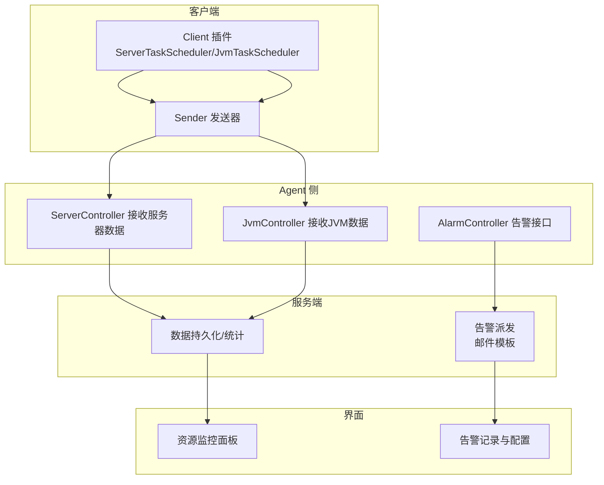
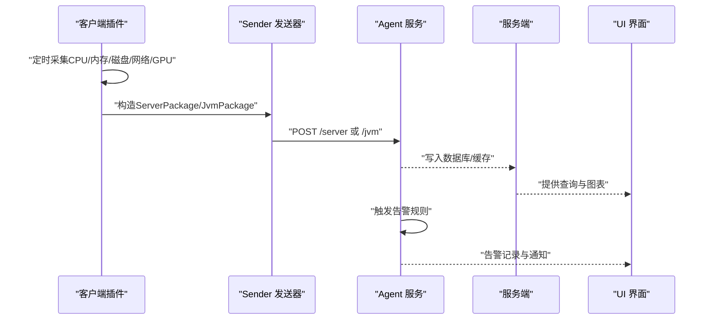
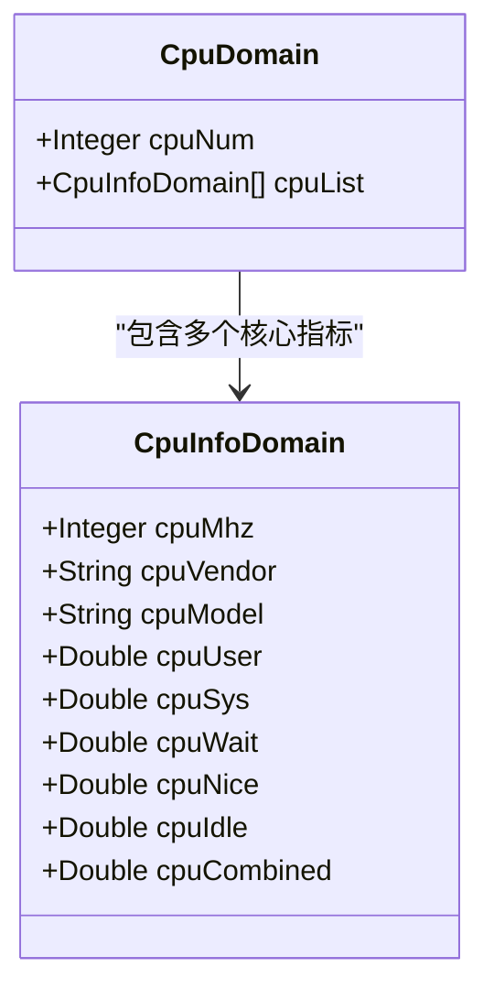
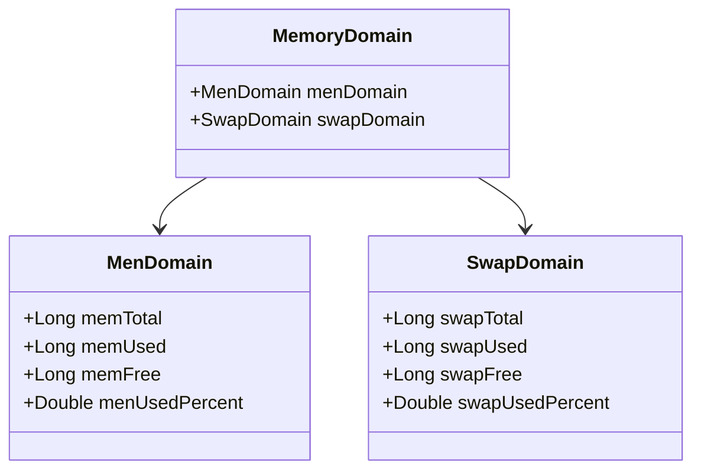
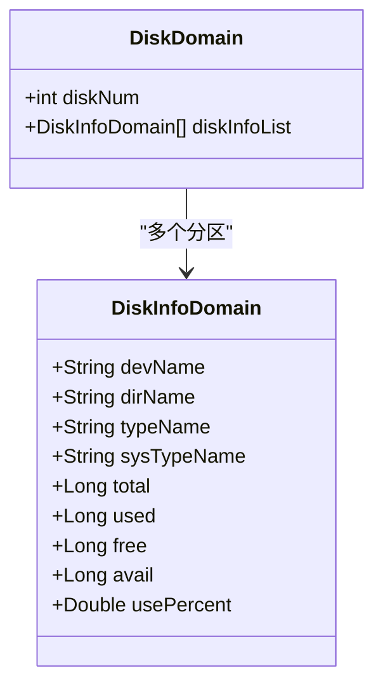
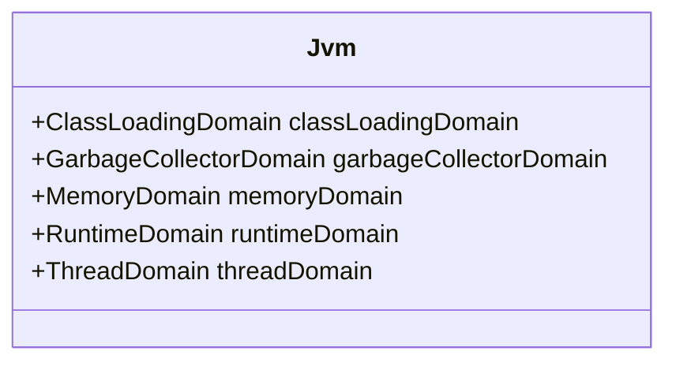
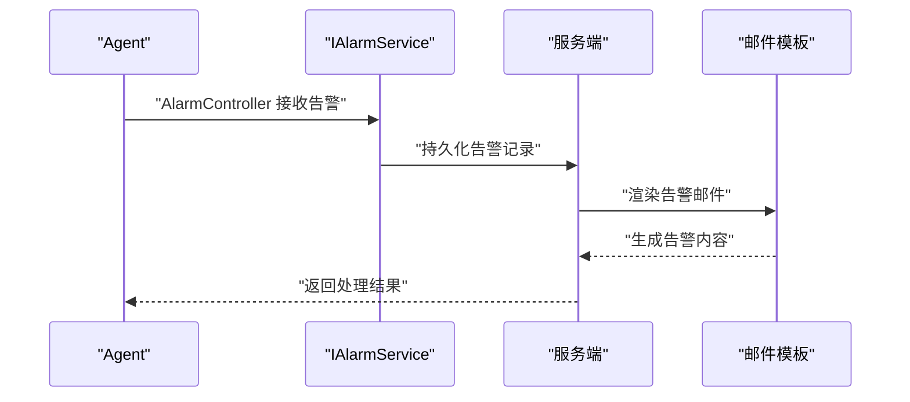
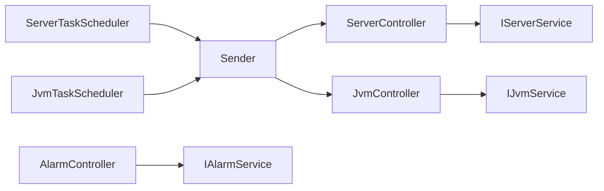

# 系统资源监控

<cite>
**本文引用的文件**
- [Server.java](file://phoenix-common/phoenix-common-core/src/main/java/com/gitee/pifeng/monitoring/common/domain/Server.java)
- [Jvm.java](file://phoenix-common/phoenix-common-core/src/main/java/com/gitee/pifeng/monitoring/common/domain/Jvm.java)
- [CpuDomain.java](file://phoenix-common/phoenix-common-core/src/main/java/com/gitee/pifeng/monitoring/common/domain/server/CpuDomain.java)
- [MemoryDomain.java](file://phoenix-common/phoenix-common-core/src/main/java/com/gitee/pifeng/monitoring/common/domain/server/MemoryDomain.java)
- [DiskDomain.java](file://phoenix-common/phoenix-common-core/src/main/java/com/gitee/pifeng/monitoring/common/domain/server/DiskDomain.java)
- [ServerPackage.java](file://phoenix-common/phoenix-common-core/src/main/java/com/gitee/pifeng/monitoring/common/dto/ServerPackage.java)
- [JvmPackage.java](file://phoenix-common/phoenix-common-core/src/main/java/com/gitee/pifeng/monitoring/common/dto/JvmPackage.java)
- [MonitorTypeEnums.java](file://phoenix-common/phoenix-common-core/src/main/java/com/gitee/pifeng/monitoring/common/constant/MonitorTypeEnums.java)
- [Alarm.java](file://phoenix-common/phoenix-common-core/src/main/java/com/gitee/pifeng/monitoring/common/domain/Alarm.java)
- [AlarmPackage.java](file://phoenix-common/phoenix-common-core/src/main/java/com/gitee/pifeng/monitoring/common/dto/AlarmPackage.java)
- [IAlarmService.java](file://phoenix-agent/src/main/java/com/gitee/pifeng/monitoring/agent/business/client/service/IAlarmService.java)
- [IServerService.java](file://phoenix-agent/src/main/java/com/gitee/pifeng/monitoring/agent/business/client/service/IServerService.java)
- [IJvmService.java](file://phoenix-agent/src/main/java/com/gitee/pifeng/monitoring/agent/business/client/service/IJvmService.java)
- [ServerController.java](file://phoenix-agent/src/main/java/com/gitee/pifeng/monitoring/agent/business/client/controller/ServerController.java)
- [JvmController.java](file://phoenix-agent/src/main/java/com/gitee/pifeng/monitoring/agent/business/client/controller/JvmController.java)
- [AlarmController.java](file://phoenix-agent/src/main/java/com/gitee/pifeng/monitoring/agent/business/client/controller/AlarmController.java)
- [ServerTaskScheduler.java](file://phoenix-client/src/main/java/com/gitee/pifeng/monitoring/plug/scheduler/ServerTaskScheduler.java)
- [JvmTaskScheduler.java](file://phoenix-client/src/main/java/com/gitee/pifeng/monitoring/plug/scheduler/JvmTaskScheduler.java)
- [Sender.java](file://phoenix-client/src/main/java/com/gitee/pifeng/monitoring/plug/core/Sender.java)
- [application.yml](file://phoenix-agent/src/main/resources/application.yml)
- [application.yml](file://phoenix-server/src/main/resources/application.yml)
- [application.yml](file://phoenix-ui/src/main/resources/application.yml)
- [mail-alarm-template.html](file://phoenix-server/src/main/resources/templates/mail/mail-alarm-template.html)
- [mail-alarm-template2.html](file://phoenix-server/src/main/resources/templates/mail/mail-alarm-template2.html)
</cite>

## 目录
1. [引言](#引言)
2. [项目结构](#项目结构)
3. [核心组件](#核心组件)
4. [架构总览](#架构总览)
5. [详细组件分析](#详细组件分析)
6. [依赖分析](#依赖分析)
7. [性能考虑](#性能考虑)
8. [故障排查指南](#故障排查指南)
9. [结论](#结论)
10. [附录](#附录)

## 引言
本文件面向Phoenix监控系统的系统资源监控能力，围绕CPU、内存、磁盘、网络与GPU等资源维度，系统化阐述监控方法、指标含义、阈值设定、告警配置与运维实践。文档以代码结构为依据，结合数据模型与控制流，帮助读者快速理解并落地资源监控与告警。

## 项目结构
Phoenix采用“客户端采集-代理上报-服务端聚合-界面展示”的分层架构：
- 客户端插件负责定时采集主机与JVM资源，并通过Sender发送到Agent
- Agent提供HTTP接口接收Server/JVM等数据包，同时暴露告警接口
- 服务端负责持久化、统计与告警派发（邮件模板）
- UI提供资源监控可视化与告警管理界面

图表来源
- [ServerTaskScheduler.java](file://phoenix-client/src/main/java/com/gitee/pifeng/monitoring/plug/scheduler/ServerTaskScheduler.java)
- [JvmTaskScheduler.java](file://phoenix-client/src/main/java/com/gitee/pifeng/monitoring/plug/scheduler/JvmTaskScheduler.java)
- [Sender.java](file://phoenix-client/src/main/java/com/gitee/pifeng/monitoring/plug/core/Sender.java)
- [ServerController.java](file://phoenix-agent/src/main/java/com/gitee/pifeng/monitoring/agent/business/client/controller/ServerController.java)
- [JvmController.java](file://phoenix-agent/src/main/java/com/gitee/pifeng/monitoring/agent/business/client/controller/JvmController.java)
- [AlarmController.java](file://phoenix-agent/src/main/java/com/gitee/pifeng/monitoring/agent/business/client/controller/AlarmController.java)
- [mail-alarm-template.html](file://phoenix-server/src/main/resources/templates/mail/mail-alarm-template.html)

章节来源
- [application.yml](file://phoenix-agent/src/main/resources/application.yml)
- [application.yml](file://phoenix-server/src/main/resources/application.yml)
- [application.yml](file://phoenix-ui/src/main/resources/application.yml)

## 核心组件
- 资源数据模型
  - 服务器资源：Server聚合了操作系统、内存、CPU、GPU、系统负载、网卡、磁盘、电源、传感器、进程等子域
  - JVM资源：Jvm聚合类加载、GC、内存、运行时、线程等子域
- 数据包封装
  - ServerPackage/JvmPackage携带Server/Jvm对象与采集频率，用于跨进程/跨模块传输
- 监控类型枚举
  - MonitorTypeEnums涵盖数据库、服务器、网络、TCP/HTTP服务、应用实例、自定义等监控类型

章节来源
- [Server.java](file://phoenix-common/phoenix-common-core/src/main/java/com/gitee/pifeng/monitoring/common/domain/Server.java)
- [Jvm.java](file://phoenix-common/phoenix-common-core/src/main/java/com/gitee/pifeng/monitoring/common/domain/Jvm.java)
- [ServerPackage.java](file://phoenix-common/phoenix-common-core/src/main/java/com/gitee/pifeng/monitoring/common/dto/ServerPackage.java)
- [JvmPackage.java](file://phoenix-common/phoenix-common-core/src/main/java/com/gitee/pifeng/monitoring/common/dto/JvmPackage.java)
- [MonitorTypeEnums.java](file://phoenix-common/phoenix-common-core/src/main/java/com/gitee/pifeng/monitoring/common/constant/MonitorTypeEnums.java)

## 架构总览
下图展示了从客户端采集到Agent接收、服务端处理与UI呈现的完整链路。

图表来源
- [ServerTaskScheduler.java](file://phoenix-client/src/main/java/com/gitee/pifeng/monitoring/plug/scheduler/ServerTaskScheduler.java)
- [JvmTaskScheduler.java](file://phoenix-client/src/main/java/com/gitee/pifeng/monitoring/plug/scheduler/JvmTaskScheduler.java)
- [Sender.java](file://phoenix-client/src/main/java/com/gitee/pifeng/monitoring/plug/core/Sender.java)
- [ServerController.java](file://phoenix-agent/src/main/java/com/gitee/pifeng/monitoring/agent/business/client/controller/ServerController.java)
- [JvmController.java](file://phoenix-agent/src/main/java/com/gitee/pifeng/monitoring/agent/business/client/controller/JvmController.java)

## 详细组件分析

### CPU资源监控
- 数据模型
  - CpuDomain描述CPU数量与每核指标集合；CpuInfoDomain包含频率、厂商、型号、用户/系统/等待/错误/空闲/综合使用率等
- 监控要点
  - 单核与全局使用率：关注cpuCombined与各核cpuUser/sys/wait变化
  - 负载与瓶颈：结合SystemLoadAverageDomain与进程域观察是否存在CPU争用
  - 多核一致性：若部分核心长期高占用，需定位热点进程或线程
- 阈值建议
  - 单核持续超过80%较长时间可设为“警告”
  - 综合使用率超过85%且系统负载升高，设为“严重”
- 指标解读
  - wait高通常表示I/O瓶颈；idle低但wait不高可能为CPU密集型任务
- 可视化
  - 使用UI折线图展示单核与综合使用率趋势

图表来源
- [CpuDomain.java](file://phoenix-common/phoenix-common-core/src/main/java/com/gitee/pifeng/monitoring/common/domain/server/CpuDomain.java)

章节来源
- [CpuDomain.java](file://phoenix-common/phoenix-common-core/src/main/java/com/gitee/pifeng/monitoring/common/domain/server/CpuDomain.java)
- [Server.java](file://phoenix-common/phoenix-common-core/src/main/java/com/gitee/pifeng/monitoring/common/domain/Server.java)

### 内存资源监控
- 数据模型
  - MemoryDomain包含menDomain（物理内存）与swapDomain（交换区）两部分
  - menDomain提供总量/使用量/剩余量/使用率
  - swapDomain提供总量/使用量/剩余量/使用率
- 监控要点
  - 物理内存：关注memUsed与menUsedPercent，结合系统负载判断是否接近上限
  - 交换区：swapUsed增长伴随频繁换页可能引发性能抖动
- 阈值建议
  - 物理内存使用率超过80%为“警告”，超过90%为“严重”
  - swapUsedPercent持续高于10%需关注
- 泄漏检测
  - 观察内存使用曲线是否持续爬升且无法回收
- 趋势分析
  - 结合时间序列查看峰值与均值，识别周期性波动

图表来源
- [MemoryDomain.java](file://phoenix-common/phoenix-common-core/src/main/java/com/gitee/pifeng/monitoring/common/domain/server/MemoryDomain.java)

章节来源
- [MemoryDomain.java](file://phoenix-common/phoenix-common-core/src/main/java/com/gitee/pifeng/monitoring/common/domain/server/MemoryDomain.java)
- [Server.java](file://phoenix-common/phoenix-common-core/src/main/java/com/gitee/pifeng/monitoring/common/domain/Server.java)

### 磁盘空间与IO监控
- 数据模型
  - DiskDomain描述磁盘数量与分区列表
  - DiskInfoDomain包含分区名/挂载点/文件系统类型/总/已用/剩余/可用/使用率等
- 监控策略
  - 空间监控：usePercent阈值建议不低于80%（高风险分区）
  - IO健康：结合进程域观察读写等待与上下文切换异常
- 存储预警
  - 为不同分区设置差异化阈值（根分区更严格）
- 健康检查
  - 定期检查只读、inode使用率、碎片与坏块（如适用）

图表来源
- [DiskDomain.java](file://phoenix-common/phoenix-common-core/src/main/java/com/gitee/pifeng/monitoring/common/domain/server/DiskDomain.java)

章节来源
- [DiskDomain.java](file://phoenix-common/phoenix-common-core/src/main/java/com/gitee/pifeng/monitoring/common/domain/server/DiskDomain.java)
- [Server.java](file://phoenix-common/phoenix-common-core/src/main/java/com/gitee/pifeng/monitoring/common/domain/Server.java)

### 网络资源监控
- 数据模型
  - NetDomain在Server中作为子域存在，用于承载网卡统计信息（如速率、连接数、错误计数等）
- 监控要点
  - 带宽使用：结合速率与接口容量评估
  - 连接数：TIME_WAIT、CLOSE_WAIT异常增多需排查应用
  - 延迟与丢包：结合专用探测工具与系统计数器
- 设备状态：接口UP/DOWN、CRC错包、缓冲溢出等

章节来源
- [Server.java](file://phoenix-common/phoenix-common-core/src/main/java/com/gitee/pifeng/monitoring/common/domain/Server.java)

### GPU资源监控（如适用）
- 数据模型
  - GpuDomain在Server中作为子域存在，用于承载GPU使用率、显存、温度等指标
- 监控要点
  - 使用率与显存占用：结合任务类型（训练/推理）设定阈值
  - 温度：避免长时间接近热阈值
- 性能分析：结合计算吞吐与显存带宽利用率

章节来源
- [Server.java](file://phoenix-common/phoenix-common-core/src/main/java/com/gitee/pifeng/monitoring/common/domain/Server.java)

### JVM资源监控
- 数据模型
  - Jvm聚合类加载、GC、内存、运行时、线程等子域，便于统一采集与展示
- 监控要点
  - 堆/非堆内存使用率与GC频率
  - 线程活跃数与死锁迹象
  - 类加载与卸载速率
- 采集与上报
  - JvmTaskScheduler定时采集，通过JvmController上报

图表来源
- [Jvm.java](file://phoenix-common/phoenix-common-core/src/main/java/com/gitee/pifeng/monitoring/common/domain/Jvm.java)

章节来源
- [Jvm.java](file://phoenix-common/phoenix-common-core/src/main/java/com/gitee/pifeng/monitoring/common/domain/Jvm.java)
- [JvmPackage.java](file://phoenix-common/phoenix-common-core/src/main/java/com/gitee/pifeng/monitoring/common/dto/JvmPackage.java)
- [JvmTaskScheduler.java](file://phoenix-client/src/main/java/com/gitee/pifeng/monitoring/plug/scheduler/JvmTaskScheduler.java)
- [JvmController.java](file://phoenix-agent/src/main/java/com/gitee/pifeng/monitoring/agent/business/client/controller/JvmController.java)

### 系统资源告警配置
- 告警数据模型
  - Alarm封装告警实体，AlarmPackage封装告警数据包
- 告警接口
  - Agent提供AlarmController，用于接收与处理告警
- 告警派发
  - 服务端模板化邮件告警（mail-alarm-template.html、mail-alarm-template2.html）
- 配置要点
  - 阈值：CPU、内存、磁盘、网络、GPU分别设置合理阈值与持续时间
  - 触发条件：瞬时阈值+滑动窗口判定
  - 通知方式：邮件/IM（按模板渲染）
  - 处理流程：记录告警、派发通知、归档、恢复确认

图表来源
- [Alarm.java](file://phoenix-common/phoenix-common-core/src/main/java/com/gitee/pifeng/monitoring/common/domain/Alarm.java)
- [AlarmPackage.java](file://phoenix-common/phoenix-common-core/src/main/java/com/gitee/pifeng/monitoring/common/dto/AlarmPackage.java)
- [IAlarmService.java](file://phoenix-agent/src/main/java/com/gitee/pifeng/monitoring/agent/business/client/service/IAlarmService.java)
- [AlarmController.java](file://phoenix-agent/src/main/java/com/gitee/pifeng/monitoring/agent/business/client/controller/AlarmController.java)
- [mail-alarm-template.html](file://phoenix-server/src/main/resources/templates/mail/mail-alarm-template.html)
- [mail-alarm-template2.html](file://phoenix-server/src/main/resources/templates/mail/mail-alarm-template2.html)

章节来源
- [Alarm.java](file://phoenix-common/phoenix-common-core/src/main/java/com/gitee/pifeng/monitoring/common/domain/Alarm.java)
- [AlarmPackage.java](file://phoenix-common/phoenix-common-core/src/main/java/com/gitee/pifeng/monitoring/common/dto/AlarmPackage.java)
- [IAlarmService.java](file://phoenix-agent/src/main/java/com/gitee/pifeng/monitoring/agent/business/client/service/IAlarmService.java)
- [AlarmController.java](file://phoenix-agent/src/main/java/com/gitee/pifeng/monitoring/agent/business/client/controller/AlarmController.java)
- [mail-alarm-template.html](file://phoenix-server/src/main/resources/templates/mail/mail-alarm-template.html)
- [mail-alarm-template2.html](file://phoenix-server/src/main/resources/templates/mail/mail-alarm-template2.html)

## 依赖分析
- 组件耦合
  - 客户端插件通过Sender与Agent控制器解耦
  - Agent控制器依赖服务接口（IServerService、IJvmService）实现具体业务
  - 服务端与UI通过DTO/Domain模型进行数据交互
- 关键依赖链
  - ServerTaskScheduler/JvmTaskScheduler -> Sender -> ServerController/JvmController
  - AlarmController -> IAlarmService -> 邮件模板

图表来源
- [ServerTaskScheduler.java](file://phoenix-client/src/main/java/com/gitee/pifeng/monitoring/plug/scheduler/ServerTaskScheduler.java)
- [JvmTaskScheduler.java](file://phoenix-client/src/main/java/com/gitee/pifeng/monitoring/plug/scheduler/JvmTaskScheduler.java)
- [Sender.java](file://phoenix-client/src/main/java/com/gitee/pifeng/monitoring/plug/core/Sender.java)
- [ServerController.java](file://phoenix-agent/src/main/java/com/gitee/pifeng/monitoring/agent/business/client/controller/ServerController.java)
- [JvmController.java](file://phoenix-agent/src/main/java/com/gitee/pifeng/monitoring/agent/business/client/controller/JvmController.java)
- [IServerService.java](file://phoenix-agent/src/main/java/com/gitee/pifeng/monitoring/agent/business/client/service/IServerService.java)
- [IJvmService.java](file://phoenix-agent/src/main/java/com/gitee/pifeng/monitoring/agent/business/client/service/IJvmService.java)
- [AlarmController.java](file://phoenix-agent/src/main/java/com/gitee/pifeng/monitoring/agent/business/client/controller/AlarmController.java)
- [IAlarmService.java](file://phoenix-agent/src/main/java/com/gitee/pifeng/monitoring/agent/business/client/service/IAlarmService.java)

章节来源
- [MonitorTypeEnums.java](file://phoenix-common/phoenix-common-core/src/main/java/com/gitee/pifeng/monitoring/common/constant/MonitorTypeEnums.java)

## 性能考虑
- 采样频率
  - CPU/内存/磁盘：默认10秒一次；高波动场景可缩短至5秒
  - 网络/GPU：按实际需求调整，避免过度采样导致开销
- 批量与压缩
  - 合理合并请求，减少网络往返
- 缓存与限流
  - Agent侧对高频请求做限流与去重
- 可观测性
  - 记录采集耗时与失败率，辅助调优

## 故障排查指南
- 采集不到数据
  - 检查客户端定时任务是否运行、Sender是否可达Agent
  - 核对ServerPackage/JvmPackage字段是否正确填充
- 指标异常
  - CPU：核使用率不一致、wait过高
  - 内存：swap频繁、物理内存持续上涨
  - 磁盘：分区使用率飙升、IO等待高
  - 网络：带宽饱和、连接数异常
- 告警未触发
  - 检查阈值配置、持续时间与监控类型
  - 查看AlarmController日志与IAlarmService执行情况
- 邮件告警失败
  - 校验邮件模板与SMTP配置

章节来源
- [ServerTaskScheduler.java](file://phoenix-client/src/main/java/com/gitee/pifeng/monitoring/plug/scheduler/ServerTaskScheduler.java)
- [JvmTaskScheduler.java](file://phoenix-client/src/main/java/com/gitee/pifeng/monitoring/plug/scheduler/JvmTaskScheduler.java)
- [Sender.java](file://phoenix-client/src/main/java/com/gitee/pifeng/monitoring/plug/core/Sender.java)
- [ServerController.java](file://phoenix-agent/src/main/java/com/gitee/pifeng/monitoring/agent/business/client/controller/ServerController.java)
- [JvmController.java](file://phoenix-agent/src/main/java/com/gitee/pifeng/monitoring/agent/business/client/controller/JvmController.java)
- [AlarmController.java](file://phoenix-agent/src/main/java/com/gitee/pifeng/monitoring/agent/business/client/controller/AlarmController.java)
- [IAlarmService.java](file://phoenix-agent/src/main/java/com/gitee/pifeng/monitoring/agent/business/client/service/IAlarmService.java)

## 结论
Phoenix监控系统通过标准化的数据模型与清晰的采集-上报-处理-展示链路，覆盖CPU、内存、磁盘、网络与GPU等关键资源维度。配合可配置的阈值与邮件告警，能够有效支撑生产环境的稳定性保障。建议结合业务特征细化阈值策略，并持续优化采样频率与告警收敛，提升可观测性与运维效率。

## 附录
- 配置文件位置
  - Agent：application.yml
  - 服务端：application.yml
  - UI：application.yml
- 邮件模板
  - mail-alarm-template.html
  - mail-alarm-template2.html

章节来源
- [application.yml](file://phoenix-agent/src/main/resources/application.yml)
- [application.yml](file://phoenix-server/src/main/resources/application.yml)
- [application.yml](file://phoenix-ui/src/main/resources/application.yml)
- [mail-alarm-template.html](file://phoenix-server/src/main/resources/templates/mail/mail-alarm-template.html)
- [mail-alarm-template2.html](file://phoenix-server/src/main/resources/templates/mail/mail-alarm-template2.html)