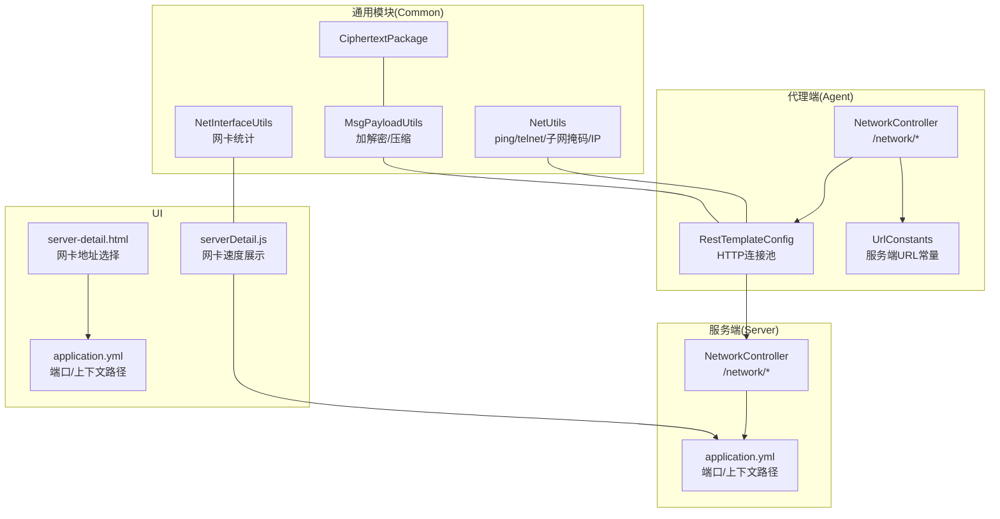
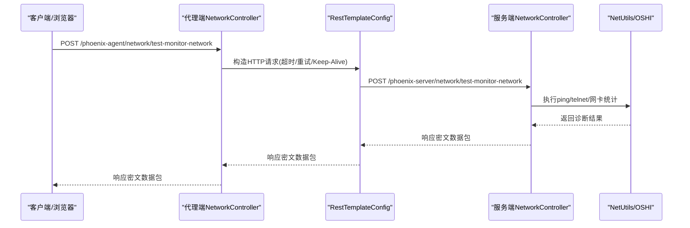
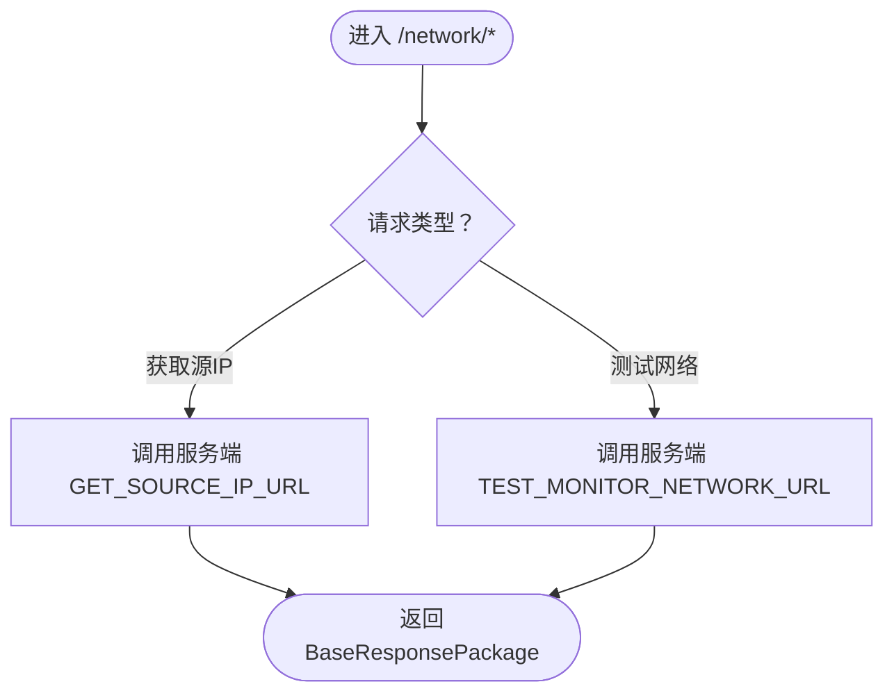
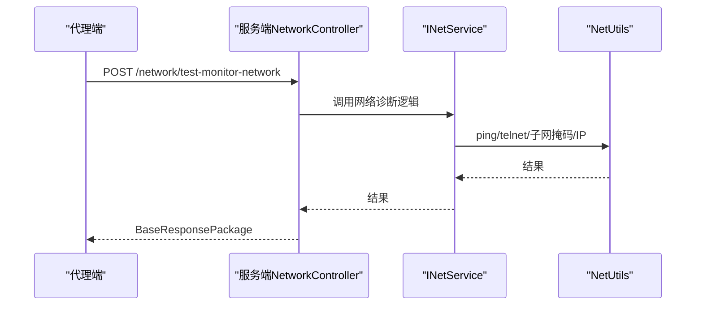
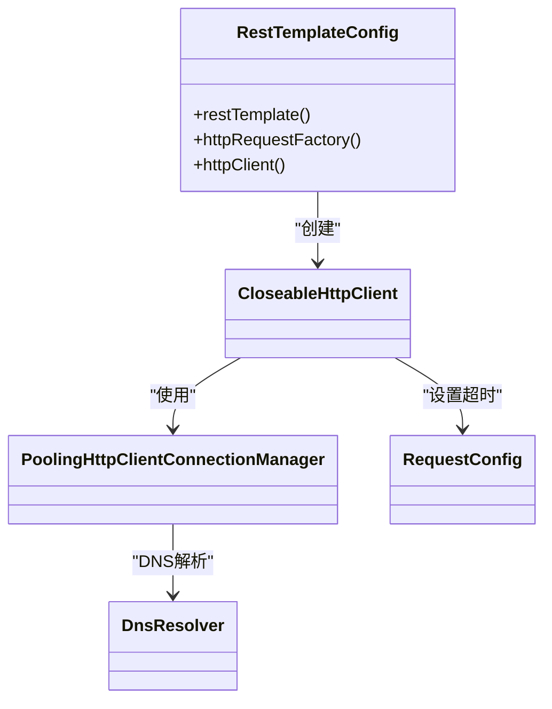
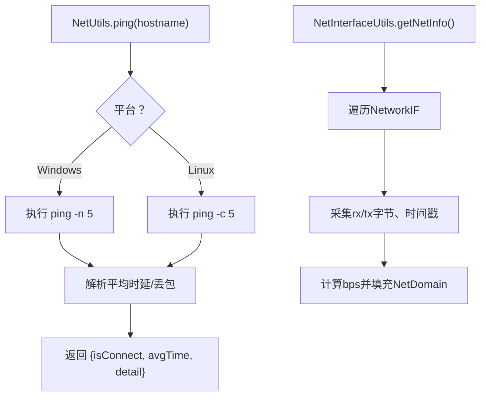
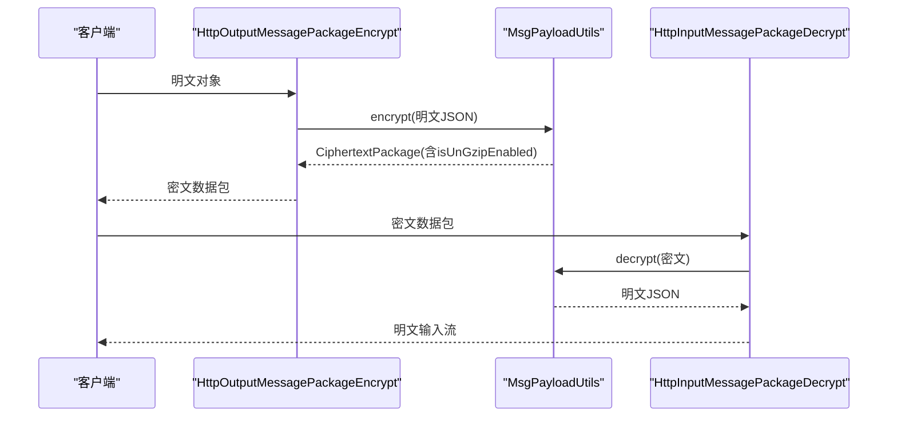
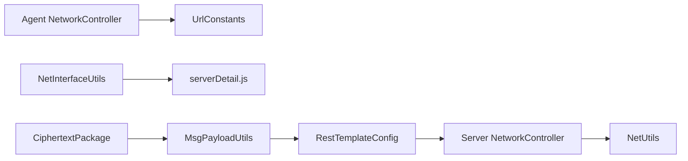

# 网络诊断

<cite>
**本文引用的文件**   
- [phoenix-agent NetworkController.java](file://phoenix-agent/src/main/java/com/gitee/pifeng/monitoring/agent/business/client/controller/NetworkController.java)
- [phoenix-server NetworkController.java](file://phoenix-server/src/main/java/com/gitee/pifeng/monitoring/server/business/server/controller/NetworkController.java)
- [RestTemplateConfig.java](file://phoenix-agent/src/main/java/com/gitee/pifeng/monitoring/agent/config/RestTemplateConfig.java)
- [UrlConstants.java](file://phoenix-agent/src/main/java/com/gitee/pifeng/monitoring/agent/constant/UrlConstants.java)
- [NetUtils.java](file://phoenix-common/phoenix-common-core/src/main/java/com/gitee/pifeng/monitoring/common/util/server/NetUtils.java)
- [NetInterfaceUtils.java](file://phoenix-common/phoenix-common-core/src/main/java/com/gitee/pifeng/monitoring/common/util/server/oshi/NetInterfaceUtils.java)
- [MsgPayloadUtils.java](file://phoenix-common/phoenix-common-core/src/main/java/com/gitee/pifeng/monitoring/common/util/MsgPayloadUtils.java)
- [HttpInputMessagePackageDecrypt.java](file://phoenix-common/phoenix-common-web/src/main/java/com/gitee/pifeng/monitoring/common/web/core/http/HttpInputMessagePackageDecrypt.java)
- [HttpOutputMessagePackageEncrypt.java](file://phoenix-common/phoenix-common-web/src/main/java/com/gitee/pifeng/monitoring/common/web/core/http/HttpOutputMessagePackageEncrypt.java)
- [application.yml（代理端）](file://phoenix-agent/src/main/resources/application.yml)
- [application.yml（服务端）](file://phoenix-server/src/main/resources/application.yml)
- [CiphertextPackage.java](file://phoenix-common/phoenix-common-core/src/main/java/com/gitee/pifeng/monitoring/common/dto/CiphertextPackage.java)
- [serverDetail.js（UI侧）](file://phoenix-ui/src/main/resources/static/modules/server/serverDetail.js)
- [server-detail.html（UI模板）](file://phoenix-ui/src/main/resources/templates/server/server-detail.html)
- [NetUtilsTest.java](file://phoenix-common/phoenix-common-core/src/test/java/com/gitee/pifeng/monitoring/common/util/server/NetUtilsTest.java)
</cite>

## 目录
1. [简介](#简介)
2. [项目结构](#项目结构)
3. [核心组件](#核心组件)
4. [架构总览](#架构总览)
5. [详细组件分析](#详细组件分析)
6. [依赖分析](#依赖分析)
7. [性能考量](#性能考量)
8. [故障排查指南](#故障排查指南)
9. [结论](#结论)
10. [附录](#附录)

## 简介
本文件面向Phoenix监控系统的网络诊断场景，聚焦以下问题域：
- 客户端与代理端连接失败
- 代理端与服务端通信异常
- UI界面访问失败
- 防火墙配置检查（端口开放、IP白名单、安全组、策略验证）
- 代理设置检查（HTTP/SOCKS、认证、代理链）
- DNS解析问题（域名解析失败、DNS缓存、DNS服务器）
- 网络延迟与丢包检测（ping/telnet、网络质量工具、路径分析、带宽测试）
- 网络安全问题（SSL/TLS、加密通信、中间人防护）

文档结合代码实现与配置，给出可操作的诊断步骤、定位方法与修复建议。

## 项目结构
Phoenix由三大部分组成：代理端（Agent）、服务端（Server）、UI（UI）。网络诊断能力贯穿三者，关键点包括：
- 代理端负责采集与上报，依赖HTTP客户端连接服务端
- 服务端提供REST API与UI页面
- UI通过浏览器访问服务端，渲染网络与服务器指标
- 通用模块提供网络工具、消息加解密与压缩、OSHI网卡统计

图表来源
- [phoenix-agent NetworkController.java:1-80](file://phoenix-agent/src/main/java/com/gitee/pifeng/monitoring/agent/business/client/controller/NetworkController.java#L1-80)
- [RestTemplateConfig.java:1-155](file://phoenix-agent/src/main/java/com/gitee/pifeng/monitoring/agent/config/RestTemplateConfig.java#L1-155)
- [UrlConstants.java:1-127](file://phoenix-agent/src/main/java/com/gitee/pifeng/monitoring/agent/constant/UrlConstants.java#L1-127)
- [phoenix-server NetworkController.java:25-68](file://phoenix-server/src/main/java/com/gitee/pifeng/monitoring/server/business/server/controller/NetworkController.java#L25-68)
- [application.yml（代理端）:1-111](file://phoenix-agent/src/main/resources/application.yml#L1-L111)
- [application.yml（服务端）:1-271](file://phoenix-server/src/main/resources/application.yml#L1-L271)
- [NetUtils.java:1-594](file://phoenix-common/phoenix-common-core/src/main/java/com/gitee/pifeng/monitoring/common/util/server/NetUtils.java#L1-L594)
- [NetInterfaceUtils.java:1-138](file://phoenix-common/phoenix-common-core/src/main/java/com/gitee/pifeng/monitoring/common/util/server/oshi/NetInterfaceUtils.java#L1-138)
- [MsgPayloadUtils.java:1-120](file://phoenix-common/phoenix-common-core/src/main/java/com/gitee/pifeng/monitoring/common/util/MsgPayloadUtils.java#L1-120)
- [CiphertextPackage.java:1-33](file://phoenix-common/phoenix-common-core/src/main/java/com/gitee/pifeng/monitoring/common/dto/CiphertextPackage.java#L1-33)
- [serverDetail.js（UI侧）:960-978](file://phoenix-ui/src/main/resources/static/modules/server/serverDetail.js#L960-L978)
- [server-detail.html（UI模板）:89-112](file://phoenix-ui/src/main/resources/templates/server/server-detail.html#L89-L112)

章节来源
- [phoenix-agent NetworkController.java:1-80](file://phoenix-agent/src/main/java/com/gitee/pifeng/monitoring/agent/business/client/controller/NetworkController.java#L1-80)
- [phoenix-server NetworkController.java:25-68](file://phoenix-server/src/main/java/com/gitee/pifeng/monitoring/server/business/server/controller/NetworkController.java#L25-68)
- [RestTemplateConfig.java:1-155](file://phoenix-agent/src/main/java/com/gitee/pifeng/monitoring/agent/config/RestTemplateConfig.java#L1-155)
- [UrlConstants.java:1-127](file://phoenix-agent/src/main/java/com/gitee/pifeng/monitoring/agent/constant/UrlConstants.java#L1-127)
- [application.yml（代理端）:1-111](file://phoenix-agent/src/main/resources/application.yml#L1-L111)
- [application.yml（服务端）:1-271](file://phoenix-server/src/main/resources/application.yml#L1-L271)
- [NetUtils.java:1-594](file://phoenix-common/phoenix-common-core/src/main/java/com/gitee/pifeng/monitoring/common/util/server/NetUtils.java#L1-L594)
- [NetInterfaceUtils.java:1-138](file://phoenix-common/phoenix-common-core/src/main/java/com/gitee/pifeng/monitoring/common/util/server/oshi/NetInterfaceUtils.java#L1-138)
- [MsgPayloadUtils.java:1-120](file://phoenix-common/phoenix-common-core/src/main/java/com/gitee/pifeng/monitoring/common/util/MsgPayloadUtils.java#L1-120)
- [CiphertextPackage.java:1-33](file://phoenix-common/phoenix-common-core/src/main/java/com/gitee/pifeng/monitoring/common/dto/CiphertextPackage.java#L1-33)
- [serverDetail.js（UI侧）:960-978](file://phoenix-ui/src/main/resources/static/modules/server/serverDetail.js#L960-L978)
- [server-detail.html（UI模板）:89-112](file://phoenix-ui/src/main/resources/templates/server/server-detail.html#L89-L112)

## 核心组件
- 代理端网络控制器：提供“获取源IP”“测试网络连通性”等接口，转发至服务端对应接口
- 服务端网络控制器：提供“获取被监控网络源IP地址”“网络连通性测试”等接口
- HTTP客户端与连接池：基于Apache HttpClient构建，支持HTTP/HTTPS、连接池、超时、重试、Keep-Alive
- URL常量：集中管理服务端REST接口地址
- 网络工具：封装ping/telnet、子网掩码与IP获取、跨平台差异处理
- 网卡统计：基于OSHI采集网卡速率、收发字节数、丢包与错误计数
- 消息加解密与压缩：统一的CiphertextPackage与加解密流程，支持GZIP压缩
- UI侧：展示网卡地址选择与实时带宽（上/下行）

章节来源
- [phoenix-agent NetworkController.java:1-80](file://phoenix-agent/src/main/java/com/gitee/pifeng/monitoring/agent/business/client/controller/NetworkController.java#L1-80)
- [phoenix-server NetworkController.java:25-68](file://phoenix-server/src/main/java/com/gitee/pifeng/monitoring/server/business/server/controller/NetworkController.java#L25-68)
- [RestTemplateConfig.java:1-155](file://phoenix-agent/src/main/java/com/gitee/pifeng/monitoring/agent/config/RestTemplateConfig.java#L1-155)
- [UrlConstants.java:1-127](file://phoenix-agent/src/main/java/com/gitee/pifeng/monitoring/agent/constant/UrlConstants.java#L1-127)
- [NetUtils.java:1-594](file://phoenix-common/phoenix-common-core/src/main/java/com/gitee/pifeng/monitoring/common/util/server/NetUtils.java#L1-L594)
- [NetInterfaceUtils.java:1-138](file://phoenix-common/phoenix-common-core/src/main/java/com/gitee/pifeng/monitoring/common/util/server/oshi/NetInterfaceUtils.java#L1-138)
- [MsgPayloadUtils.java:1-120](file://phoenix-common/phoenix-common-core/src/main/java/com/gitee/pifeng/monitoring/common/util/MsgPayloadUtils.java#L1-120)
- [CiphertextPackage.java:1-33](file://phoenix-common/phoenix-common-core/src/main/java/com/gitee/pifeng/monitoring/common/dto/CiphertextPackage.java#L1-33)
- [serverDetail.js（UI侧）:960-978](file://phoenix-ui/src/main/resources/static/modules/server/serverDetail.js#L960-L978)
- [server-detail.html（UI模板）:89-112](file://phoenix-ui/src/main/resources/templates/server/server-detail.html#L89-L112)

## 架构总览
代理端通过RestTemplate向服务端发起HTTP请求，服务端控制器接收并处理网络诊断任务，UI通过浏览器访问服务端并渲染网络指标。

图表来源
- [phoenix-agent NetworkController.java:74-77](file://phoenix-agent/src/main/java/com/gitee/pifeng/monitoring/agent/business/client/controller/NetworkController.java#L74-L77)
- [RestTemplateConfig.java:115-149](file://phoenix-agent/src/main/java/com/gitee/pifeng/monitoring/agent/config/RestTemplateConfig.java#L115-L149)
- [phoenix-server NetworkController.java:61-68](file://phoenix-server/src/main/java/com/gitee/pifeng/monitoring/server/business/server/controller/NetworkController.java#L61-L68)
- [NetUtils.java:377-456](file://phoenix-common/phoenix-common-core/src/main/java/com/gitee/pifeng/monitoring/common/util/server/NetUtils.java#L377-L456)
- [NetInterfaceUtils.java:40-106](file://phoenix-common/phoenix-common-core/src/main/java/com/gitee/pifeng/monitoring/common/util/server/oshi/NetInterfaceUtils.java#L40-L106)

章节来源
- [phoenix-agent NetworkController.java:1-80](file://phoenix-agent/src/main/java/com/gitee/pifeng/monitoring/agent/business/client/controller/NetworkController.java#L1-80)
- [RestTemplateConfig.java:1-155](file://phoenix-agent/src/main/java/com/gitee/pifeng/monitoring/agent/config/RestTemplateConfig.java#L1-155)
- [phoenix-server NetworkController.java:25-68](file://phoenix-server/src/main/java/com/gitee/pifeng/monitoring/server/business/server/controller/NetworkController.java#L25-68)
- [NetUtils.java:1-594](file://phoenix-common/phoenix-common-core/src/main/java/com/gitee/pifeng/monitoring/common/util/server/NetUtils.java#L1-L594)
- [NetInterfaceUtils.java:1-138](file://phoenix-common/phoenix-common-core/src/main/java/com/gitee/pifeng/monitoring/common/util/server/oshi/NetInterfaceUtils.java#L1-138)

## 详细组件分析

### 代理端网络控制器
- 提供“获取源IP”“测试网络连通性”接口，将请求转发至服务端对应URL
- 通过IBaseRequestPackageService与UrlConstants配合，调用服务端REST接口

图表来源
- [phoenix-agent NetworkController.java:55-77](file://phoenix-agent/src/main/java/com/gitee/pifeng/monitoring/agent/business/client/controller/NetworkController.java#L55-L77)
- [UrlConstants.java:62-69](file://phoenix-agent/src/main/java/com/gitee/pifeng/monitoring/agent/constant/UrlConstants.java#L62-L69)

章节来源
- [phoenix-agent NetworkController.java:1-80](file://phoenix-agent/src/main/java/com/gitee/pifeng/monitoring/agent/business/client/controller/NetworkController.java#L1-80)
- [UrlConstants.java:1-127](file://phoenix-agent/src/main/java/com/gitee/pifeng/monitoring/agent/constant/UrlConstants.java#L1-127)

### 服务端网络控制器
- 提供“获取被监控网络源IP地址”“网络连通性测试”接口
- 使用INetService与NetUtils协作，执行ping/telnet与网卡统计

图表来源
- [phoenix-server NetworkController.java:61-68](file://phoenix-server/src/main/java/com/gitee/pifeng/monitoring/server/business/server/controller/NetworkController.java#L61-L68)
- [NetUtils.java:377-456](file://phoenix-common/phoenix-common-core/src/main/java/com/gitee/pifeng/monitoring/common/util/server/NetUtils.java#L377-L456)

章节来源
- [phoenix-server NetworkController.java:25-68](file://phoenix-server/src/main/java/com/gitee/pifeng/monitoring/server/business/server/controller/NetworkController.java#L25-68)
- [NetUtils.java:1-594](file://phoenix-common/phoenix-common-core/src/main/java/com/gitee/pifeng/monitoring/common/util/server/NetUtils.java#L1-L594)

### HTTP客户端与连接池（代理端）
- 基于Apache HttpClient，注册HTTP/HTTPS Socket工厂
- 连接池：最大连接、每路由最大连接、空闲回收、过期回收、Keep-Alive策略
- 超时配置：连接超时、Socket超时、连接池获取超时
- 重试机制：默认重试3次
- DNS解析：使用系统默认DNS解析器

图表来源
- [RestTemplateConfig.java:89-152](file://phoenix-agent/src/main/java/com/gitee/pifeng/monitoring/agent/config/RestTemplateConfig.java#L89-L152)

章节来源
- [RestTemplateConfig.java:1-155](file://phoenix-agent/src/main/java/com/gitee/pifeng/monitoring/agent/config/RestTemplateConfig.java#L1-155)

### URL常量与上下文路径
- 代理端通过ConfigLoader读取comm.http.url作为服务端根路径
- 代理端上下文路径：/phoenix-agent
- 服务端上下文路径：/phoenix-server
- UI上下文路径：/phoenix-ui（UI配置文件中体现）

章节来源
- [UrlConstants.java:29-69](file://phoenix-agent/src/main/java/com/gitee/pifeng/monitoring/agent/constant/UrlConstants.java#L29-L69)
- [application.yml（代理端）:2-4](file://phoenix-agent/src/main/resources/application.yml#L2-L4)
- [application.yml（服务端）:2-4](file://phoenix-server/src/main/resources/application.yml#L2-L4)

### 网络工具与网卡统计
- NetUtils：封装ping/telnet、子网掩码与IP获取、跨平台差异处理
- NetInterfaceUtils：基于OSHI采集网卡速率、收发字节、丢包与错误计数

图表来源
- [NetUtils.java:394-456](file://phoenix-common/phoenix-common-core/src/main/java/com/gitee/pifeng/monitoring/common/util/server/NetUtils.java#L394-L456)
- [NetInterfaceUtils.java:40-106](file://phoenix-common/phoenix-common-core/src/main/java/com/gitee/pifeng/monitoring/common/util/server/oshi/NetInterfaceUtils.java#L40-L106)

章节来源
- [NetUtils.java:1-594](file://phoenix-common/phoenix-common-core/src/main/java/com/gitee/pifeng/monitoring/common/util/server/NetUtils.java#L1-L594)
- [NetInterfaceUtils.java:1-138](file://phoenix-common/phoenix-common-core/src/main/java/com/gitee/pifeng/monitoring/common/util/server/oshi/NetInterfaceUtils.java#L1-138)

### 消息加解密与压缩
- CiphertextPackage承载密文与是否需要解压标志
- MsgPayloadUtils：自动判断是否GZIP压缩，统一加解密入口
- HttpInputMessagePackageDecrypt/HttpOutputMessagePackageEncrypt：请求/响应的解密与加密包装

图表来源
- [MsgPayloadUtils.java:42-102](file://phoenix-common/phoenix-common-core/src/main/java/com/gitee/pifeng/monitoring/common/util/MsgPayloadUtils.java#L42-L102)
- [HttpOutputMessagePackageEncrypt.java:29-38](file://phoenix-common/phoenix-common-core/src/main/java/com/gitee/pifeng/monitoring/common/web/core/http/HttpOutputMessagePackageEncrypt.java#L29-L38)
- [HttpInputMessagePackageDecrypt.java:72-84](file://phoenix-common/phoenix-common-web/src/main/java/com/gitee/pifeng/monitoring/common/web/core/http/HttpInputMessagePackageDecrypt.java#L72-L84)
- [CiphertextPackage.java:21-33](file://phoenix-common/phoenix-common-core/src/main/java/com/gitee/pifeng/monitoring/common/dto/CiphertextPackage.java#L21-L33)

章节来源
- [MsgPayloadUtils.java:1-120](file://phoenix-common/phoenix-common-core/src/main/java/com/gitee/pifeng/monitoring/common/util/MsgPayloadUtils.java#L1-120)
- [HttpOutputMessagePackageEncrypt.java:1-40](file://phoenix-common/phoenix-common-core/src/main/java/com/gitee/pifeng/monitoring/common/web/core/http/HttpOutputMessagePackageEncrypt.java#L1-40)
- [HttpInputMessagePackageDecrypt.java:1-102](file://phoenix-common/phoenix-common-web/src/main/java/com/gitee/pifeng/monitoring/common/web/core/http/HttpInputMessagePackageDecrypt.java#L1-L102)
- [CiphertextPackage.java:1-33](file://phoenix-common/phoenix-common-core/src/main/java/com/gitee/pifeng/monitoring/common/dto/CiphertextPackage.java#L1-33)

### UI侧网络指标展示
- server-detail.html：提供网卡地址选择下拉框
- serverDetail.js：展示发送/接收字节、包数、错误/丢弃数、下行/上行带宽

章节来源
- [server-detail.html（UI模板）:89-112](file://phoenix-ui/src/main/resources/templates/server/server-detail.html#L89-L112)
- [serverDetail.js（UI侧）:960-978](file://phoenix-ui/src/main/resources/static/modules/server/serverDetail.js#L960-L978)

## 依赖分析
- 代理端依赖服务端REST接口，URL由UrlConstants集中管理
- 代理端HTTP客户端依赖连接池与超时配置，影响网络诊断的稳定性与性能
- 服务端依赖网络工具与OSHI统计，支撑UI侧指标展示
- UI依赖服务端上下文路径与模板渲染

图表来源
- [phoenix-agent NetworkController.java:1-80](file://phoenix-agent/src/main/java/com/gitee/pifeng/monitoring/agent/business/client/controller/NetworkController.java#L1-80)
- [UrlConstants.java:1-127](file://phoenix-agent/src/main/java/com/gitee/pifeng/monitoring/agent/constant/UrlConstants.java#L1-127)
- [RestTemplateConfig.java:1-155](file://phoenix-agent/src/main/java/com/gitee/pifeng/monitoring/agent/config/RestTemplateConfig.java#L1-155)
- [phoenix-server NetworkController.java:25-68](file://phoenix-server/src/main/java/com/gitee/pifeng/monitoring/server/business/server/controller/NetworkController.java#L25-68)
- [NetUtils.java:1-594](file://phoenix-common/phoenix-common-core/src/main/java/com/gitee/pifeng/monitoring/common/util/server/NetUtils.java#L1-L594)
- [NetInterfaceUtils.java:1-138](file://phoenix-common/phoenix-common-core/src/main/java/com/gitee/pifeng/monitoring/common/util/server/oshi/NetInterfaceUtils.java#L1-138)
- [MsgPayloadUtils.java:1-120](file://phoenix-common/phoenix-common-core/src/main/java/com/gitee/pifeng/monitoring/common/util/MsgPayloadUtils.java#L1-120)
- [CiphertextPackage.java:1-33](file://phoenix-common/phoenix-common-core/src/main/java/com/gitee/pifeng/monitoring/common/dto/CiphertextPackage.java#L1-33)
- [serverDetail.js（UI侧）:960-978](file://phoenix-ui/src/main/resources/static/modules/server/serverDetail.js#L960-L978)

章节来源
- [phoenix-agent NetworkController.java:1-80](file://phoenix-agent/src/main/java/com/gitee/pifeng/monitoring/agent/business/client/controller/NetworkController.java#L1-80)
- [RestTemplateConfig.java:1-155](file://phoenix-agent/src/main/java/com/gitee/pifeng/monitoring/agent/config/RestTemplateConfig.java#L1-155)
- [UrlConstants.java:1-127](file://phoenix-agent/src/main/java/com/gitee/pifeng/monitoring/agent/constant/UrlConstants.java#L1-127)
- [phoenix-server NetworkController.java:25-68](file://phoenix-server/src/main/java/com/gitee/pifeng/monitoring/server/business/server/controller/NetworkController.java#L25-68)
- [NetUtils.java:1-594](file://phoenix-common/phoenix-common-core/src/main/java/com/gitee/pifeng/monitoring/common/util/server/NetUtils.java#L1-L594)
- [NetInterfaceUtils.java:1-138](file://phoenix-common/phoenix-common-core/src/main/java/com/gitee/pifeng/monitoring/common/util/server/oshi/NetInterfaceUtils.java#L1-138)
- [MsgPayloadUtils.java:1-120](file://phoenix-common/phoenix-common-core/src/main/java/com/gitee/pifeng/monitoring/common/util/MsgPayloadUtils.java#L1-120)
- [CiphertextPackage.java:1-33](file://phoenix-common/phoenix-common-core/src/main/java/com/gitee/pifeng/monitoring/common/dto/CiphertextPackage.java#L1-33)
- [serverDetail.js（UI侧）:960-978](file://phoenix-ui/src/main/resources/static/modules/server/serverDetail.js#L960-L978)

## 性能考量
- 连接池规模：MaxTotal与DefaultMaxPerRoute需满足并发需求，避免连接池耗尽导致超时
- Keep-Alive与重试：合理设置连接存活时间与重试次数，平衡可靠性与资源占用
- 超时参数：连接超时、Socket超时、连接池获取超时需与业务容忍度匹配
- GZIP压缩：大数据包自动压缩可降低带宽，但增加CPU开销
- OSHI采样周期：网卡速率计算需适当采样间隔，避免过于频繁造成开销

章节来源
- [RestTemplateConfig.java:108-149](file://phoenix-agent/src/main/java/com/gitee/pifeng/monitoring/agent/config/RestTemplateConfig.java#L108-L149)
- [MsgPayloadUtils.java:42-59](file://phoenix-common/phoenix-common-core/src/main/java/com/gitee/pifeng/monitoring/common/util/MsgPayloadUtils.java#L42-L59)
- [NetInterfaceUtils.java:66-69](file://phoenix-common/phoenix-common-core/src/main/java/com/gitee/pifeng/monitoring/common/util/server/oshi/NetInterfaceUtils.java#L66-L69)

## 故障排查指南

### 一、客户端与代理端连接失败
- 症状：代理端无法访问、请求超时、连接被拒绝
- 排查步骤
  1) 确认服务端上下文路径与端口：/phoenix-server
  2) 确认代理端上下文路径与端口：/phoenix-agent
  3) 使用ping/telnet验证服务端可达性与端口监听状态
  4) 检查代理端HTTP超时与连接池配置
  5) 检查代理端与服务端之间的防火墙策略
- 诊断工具
  - ping：验证IP连通性
  - telnet：验证端口连通性
  - curl/wget：验证HTTP接口可用性
- 修复建议
  - 调整连接超时与重试次数
  - 开放代理端到服务端的出站端口
  - 如需HTTPS，确保证书有效且信任链完整

章节来源
- [application.yml（代理端）:2-4](file://phoenix-agent/src/main/resources/application.yml#L2-L4)
- [application.yml（服务端）:2-4](file://phoenix-server/src/main/resources/application.yml#L2-L4)
- [NetUtils.java:377-456](file://phoenix-common/phoenix-common-core/src/main/java/com/gitee/pifeng/monitoring/common/util/server/NetUtils.java#L377-L456)
- [NetUtils.java:560-591](file://phoenix-common/phoenix-common-core/src/main/java/com/gitee/pifeng/monitoring/common/util/server/NetUtils.java#L560-L591)
- [RestTemplateConfig.java:115-149](file://phoenix-agent/src/main/java/com/gitee/pifeng/monitoring/agent/config/RestTemplateConfig.java#L115-L149)

### 二、代理端与服务端通信异常
- 症状：代理端调用服务端接口失败、响应异常
- 排查步骤
  1) 核对UrlConstants中的服务端根URL
  2) 检查服务端网络控制器接口是否正常
  3) 检查服务端日志与健康检查端点
  4) 检查代理端连接池与超时配置
- 诊断工具
  - 服务端健康端点：/actuator/health
  - 服务端Swagger：/v3/api-docs
- 修复建议
  - 调整连接池大小与超时参数
  - 检查服务端上下文路径与端口绑定
  - 启用更详细的日志以定位异常

章节来源
- [UrlConstants.java:29-69](file://phoenix-agent/src/main/java/com/gitee/pifeng/monitoring/agent/constant/UrlConstants.java#L29-L69)
- [phoenix-server NetworkController.java:61-68](file://phoenix-server/src/main/java/com/gitee/pifeng/monitoring/server/business/server/controller/NetworkController.java#L61-L68)
- [application.yml（服务端）:219-234](file://phoenix-server/src/main/resources/application.yml#L219-L234)
- [RestTemplateConfig.java:108-149](file://phoenix-agent/src/main/java/com/gitee/pifeng/monitoring/agent/config/RestTemplateConfig.java#L108-L149)

### 三、UI界面访问失败
- 症状：浏览器无法访问UI页面或接口
- 排查步骤
  1) 确认UI上下文路径与端口：/phoenix-ui
  2) 检查静态资源与模板路径
  3) 检查服务端与UI之间的网络连通性
- 诊断工具
  - 浏览器开发者工具查看网络请求
  - 服务端访问日志
- 修复建议
  - 修正UI上下文路径与端口
  - 确保静态资源可访问

章节来源
- [application.yml（服务端）:2-4](file://phoenix-server/src/main/resources/application.yml#L2-L4)
- [server-detail.html（UI模板）:89-112](file://phoenix-ui/src/main/resources/templates/server/server-detail.html#L89-L112)
- [serverDetail.js（UI侧）:960-978](file://phoenix-ui/src/main/resources/static/modules/server/serverDetail.js#L960-L978)

### 四、防火墙配置检查
- 端口开放检查
  - 代理端到服务端：确认服务端监听端口与上下文路径
  - UI到服务端：确认UI上下文路径与端口
- IP白名单与安全组
  - 限制代理端与UI的访问来源
  - 仅开放必要的端口范围
- 策略验证
  - 使用curl/telnet验证端口连通性
  - 检查跨网段路由与NAT规则

章节来源
- [application.yml（代理端）:2-4](file://phoenix-agent/src/main/resources/application.yml#L2-L4)
- [application.yml（服务端）:2-4](file://phoenix-server/src/main/resources/application.yml#L2-L4)
- [NetUtils.java:560-591](file://phoenix-common/phoenix-common-core/src/main/java/com/gitee/pifeng/monitoring/common/util/server/NetUtils.java#L560-L591)

### 五、代理设置检查与配置
- HTTP/SOCKS代理
  - 代理端HTTP客户端默认使用系统DNS解析器
  - 如需代理，可在运行环境或JVM层面配置
- 代理认证
  - 如使用代理认证，需在系统或JVM代理配置中设置
- 代理链路
  - 检查代理链路的连通性与超时
  - 验证代理服务器的访问日志

章节来源
- [RestTemplateConfig.java:100-101](file://phoenix-agent/src/main/java/com/gitee/pifeng/monitoring/agent/config/RestTemplateConfig.java#L100-L101)

### 六、DNS解析问题
- 域名解析失败
  - 使用nslookup/dig验证域名解析
  - 检查DNS服务器配置与网络连通性
- DNS缓存问题
  - 清理系统DNS缓存
  - 临时更换DNS服务器验证
- DNS服务器配置
  - 确认系统DNS设置与网络环境一致

章节来源
- [RestTemplateConfig.java:100-101](file://phoenix-agent/src/main/java/com/gitee/pifeng/monitoring/agent/config/RestTemplateConfig.java#L100-L101)

### 七、网络延迟与丢包检测
- ping/telnet
  - 使用NetUtils.ping/NetUtils.telnetVT200进行连通性与时延检测
- 网络质量工具
  - 使用iperf3/网络质量测试工具评估带宽与抖动
- 路径分析
  - 使用traceroute/tracert追踪路由路径
- 带宽测试
  - 基于OSHI网卡统计计算实时带宽（上/下行）

章节来源
- [NetUtils.java:377-456](file://phoenix-common/phoenix-common-core/src/main/java/com/gitee/pifeng/monitoring/common/util/server/NetUtils.java#L377-L456)
- [NetUtils.java:560-591](file://phoenix-common/phoenix-common-core/src/main/java/com/gitee/pifeng/monitoring/common/util/server/NetUtils.java#L560-L591)
- [NetInterfaceUtils.java:40-106](file://phoenix-common/phoenix-common-core/src/main/java/com/gitee/pifeng/monitoring/common/util/server/oshi/NetInterfaceUtils.java#L40-L106)
- [serverDetail.js（UI侧）:960-978](file://phoenix-ui/src/main/resources/static/modules/server/serverDetail.js#L960-L978)

### 八、网络安全问题
- SSL/TLS证书验证
  - 确保服务端HTTPS证书有效、受信
  - 检查代理端是否正确信任CA
- 加密通信
  - 使用MsgPayloadUtils进行统一加解密
  - 确保密钥与算法配置一致
- 中间人攻击防护
  - 仅使用受信的HTTPS通道
  - 校验证书链与吊销列表

章节来源
- [MsgPayloadUtils.java:42-102](file://phoenix-common/phoenix-common-core/src/main/java/com/gitee/pifeng/monitoring/common/util/MsgPayloadUtils.java#L42-L102)
- [HttpInputMessagePackageDecrypt.java:72-84](file://phoenix-common/phoenix-common-web/src/main/java/com/gitee/pifeng/monitoring/common/web/core/http/HttpInputMessagePackageDecrypt.java#L72-L84)
- [HttpOutputMessagePackageEncrypt.java:29-38](file://phoenix-common/phoenix-common-core/src/main/java/com/gitee/pifeng/monitoring/common/web/core/http/HttpOutputMessagePackageEncrypt.java#L29-L38)

## 结论
Phoenix监控系统的网络诊断能力覆盖了从代理端到服务端再到UI的全链路。通过统一的URL常量、HTTP客户端连接池、网络工具与加解密流程，系统能够在复杂网络环境中稳定地进行连通性检测与指标采集。建议在部署时重点关注上下文路径、端口开放、超时与重试参数、DNS配置以及HTTPS证书与加密策略，以确保网络诊断的准确性与安全性。

## 附录
- 单元测试参考：NetUtilsTest包含ping与telnet测试示例，可用于验证网络工具行为

章节来源
- [NetUtilsTest.java:60-119](file://phoenix-common/phoenix-common-core/src/test/java/com/gitee/pifeng/monitoring/common/util/server/NetUtilsTest.java#L60-L119)