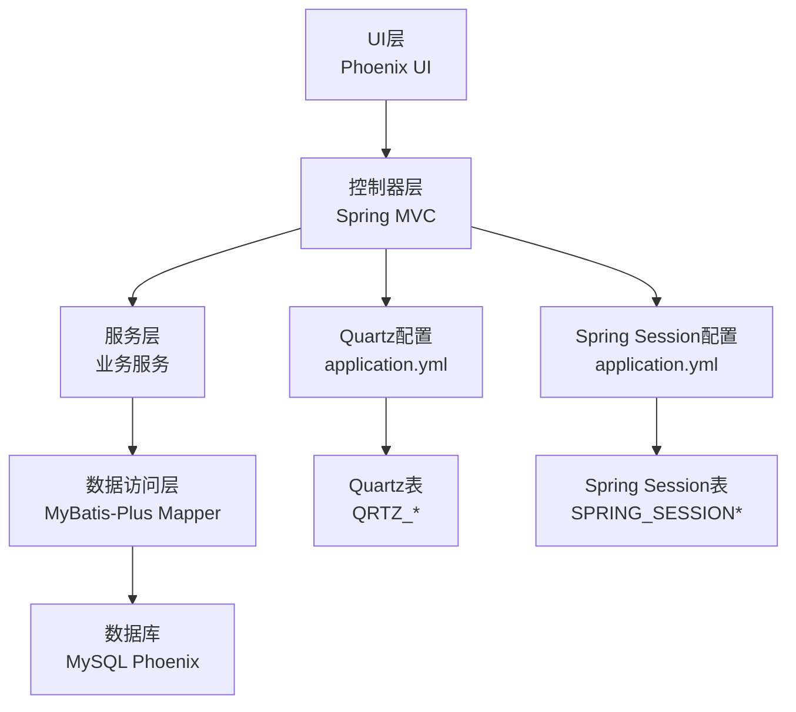
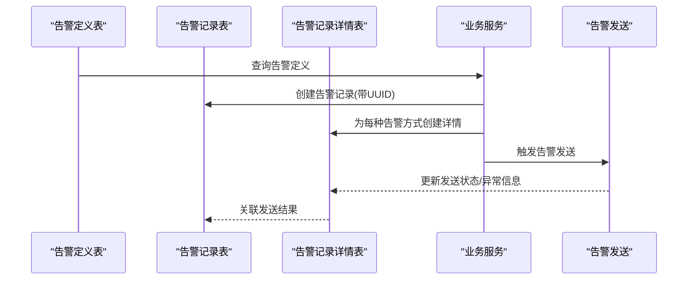
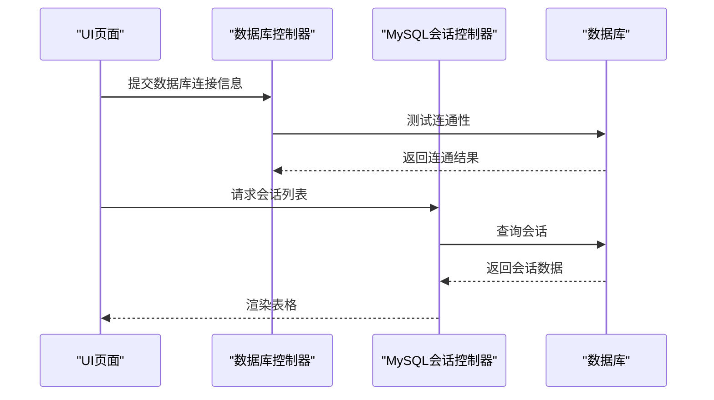
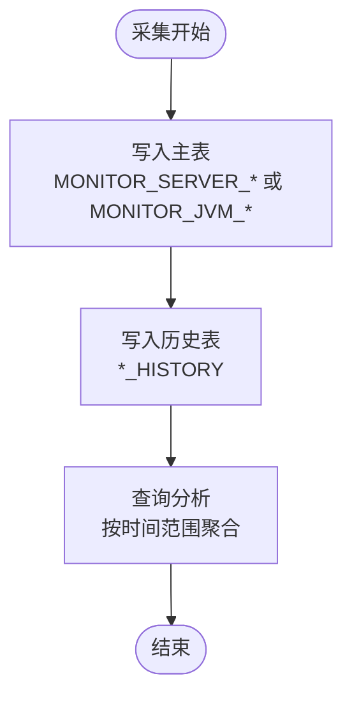
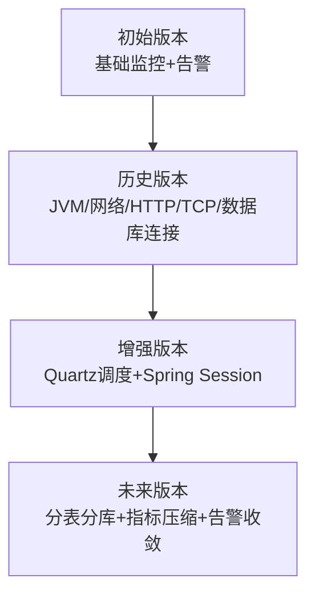

# Schema图表与示例

<cite>
**本文引用的文件**
- [phoenix.sql](file://doc/数据库设计/sql/mysql/phoenix.sql)
- [MonitorAlarmDefinition.java](file://phoenix-server/src/main/java/com/gitee/pifeng/monitoring/server/business/server/entity/MonitorAlarmDefinition.java)
- [MonitorAlarmRecord.java](file://phoenix-server/src/main/java/com/gitee/pifeng/monitoring/server/business/server/entity/MonitorAlarmRecord.java)
- [MonitorDb.java](file://phoenix-server/src/main/java/com/gitee/pifeng/monitoring/server/business/server/entity/MonitorDb.java)
- [application.yml](file://phoenix-server/src/main/resources/application.yml)
- [application-dev.yml](file://phoenix-server/src/main/resources/application-dev.yml)
- [DbController.java](file://phoenix-server/src/main/java/com/gitee/pifeng/monitoring/server/business/server/controller/DbController.java)
- [DbSession4MysqlController.java](file://phoenix-server/src/main/java/com/gitee/pifeng/monitoring/server/business/server/controller/DbSession4MysqlController.java)
- [add-db.html](file://phoenix-ui/src/main/resources/templates/db/add-db.html)
- [edit-db.html](file://phoenix-ui/src/main/resources/templates/db/edit-db.html)
- [db.html](file://phoenix-ui/src/main/resources/templates/db/db.html)
- [dbSession4mysql.js](file://phoenix-ui/src/main/resources/static/modules/db/dbSession4mysql.js)
- [MonitoringDbProperties.java](file://phoenix-common/src/main/java/com/gitee/pifeng/monitoring/common/property/server/MonitoringDbProperties.java)
- [MonitorDbVo.java](file://phoenix-ui/src/main/java/com/gitee/pifeng/monitoring/ui/business/web/vo/MonitorDbVo.java)
</cite>

## 目录
1. [简介](#简介)
2. [项目结构](#项目结构)
3. [核心组件](#核心组件)
4. [架构概览](#架构概览)
5. [详细组件分析](#详细组件分析)
6. [依赖分析](#依赖分析)
7. [性能考虑](#性能考虑)
8. [故障排查指南](#故障排查指南)
9. [结论](#结论)
10. [附录](#附录)

## 简介
本文件面向Phoenix监控系统的数据库设计，提供完整的数据库E-R图与表结构图，直观展示各表之间的关系与数据流向；包含典型数据示例（告警触发、监控记录、历史数据组织方式等）；提供数据字典（字段类型、取值范围、业务含义）；给出数据库初始化脚本与示例数据导入说明；并绘制数据库版本演进图，帮助开发者快速搭建测试环境并理解系统演进。

## 项目结构
Phoenix数据库设计位于doc/数据库设计/sql/mysql/phoenix.sql，涵盖监控系统所需的核心表，包括告警定义、告警记录、实时监控、服务器监控、JVM监控、网络监控、数据库连接、用户与角色、Quartz调度表以及Spring Session表等。应用层通过MyBatis-Plus映射到实体类，配置文件中定义了数据源、Quartz调度与MyBatis-Plus驼峰映射规则。

```mermaid
graph TB
subgraph "数据库层"
ALD["告警定义表<br/>MONITOR_ALARM_DEFINITION"]
ALR["告警记录表<br/>MONITOR_ALARM_RECORD"]
ALRD["告警记录详情表<br/>MONITOR_ALARM_RECORD_DETAIL"]
RTM["实时监控表<br/>MONITOR_REALTIME_MONITORING"]
ENV["监控环境表<br/>MONITOR_ENV"]
GRP["监控分组表<br/>MONITOR_GROUP"]
USR["用户表<br/>MONITOR_USER"]
ROLE["角色表<br/>MONITOR_ROLE"]
DBT["数据库表<br/>MONITOR_DB"]
HTTP["HTTP监控表<br/>MONITOR_HTTP"]
HTTP_H["HTTP历史表<br/>MONITOR_HTTP_HISTORY"]
NET["网络监控表<br/>MONITOR_NET"]
NET_H["网络历史表<br/>MONITOR_NET_HISTORY"]
TCP["TCP监控表<br/>MONITOR_TCP"]
TCP_H["TCP历史表<br/>MONITOR_TCP_HISTORY"]
SRV["服务器表<br/>MONITOR_SERVER"]
SRV_CPU["服务器CPU表<br/>MONITOR_SERVER_CPU"]
SRV_MEM["服务器内存表<br/>MONITOR_SERVER_MEMORY"]
SRV_DISK["服务器磁盘表<br/>MONITOR_SERVER_DISK"]
SRV_NET["服务器网卡表<br/>MONITOR_SERVER_NETCARD"]
SRV_OS["服务器操作系统表<br/>MONITOR_SERVER_OS"]
SRV_PROC["服务器进程表<br/>MONITOR_SERVER_PROCESS"]
SRV_PWR["服务器电池表<br/>MONITOR_SERVER_POWER_SOURCES"]
JVM_CL["JVM类加载表<br/>MONITOR_JVM_CLASS_LOADING"]
JVM_GC["JVM GC表<br/>MONITOR_JVM_GARBAGE_COLLECTOR"]
JVM_MEM["JVM内存表<br/>MONITOR_JVM_MEMORY"]
JVM_MEM_H["JVM内存历史表<br/>MONITOR_JVM_MEMORY_HISTORY"]
JVM_RT["JVM运行时表<br/>MONITOR_JVM_RUNTIME"]
JVM_TH["JVM线程表<br/>MONITOR_JVM_THREAD"]
INST["应用实例表<br/>MONITOR_INSTANCE"]
LOG_EX["异常日志表<br/>MONITOR_LOG_EXCEPTION"]
LOG_OP["操作日志表<br/>MONITOR_LOG_OPERATION"]
DLOCK["分布式锁表<br/>MONITOR_DISTRIBUTED_LOCK"]
CFG["监控配置表<br/>MONITOR_CONFIG"]
Q_BLOB["Quartz BLOB触发器<br/>QRTZ_BLOB_TRIGGERS"]
Q_CAL["Quartz 日历<br/>QRTZ_CALENDARS"]
Q_CRON["Quartz Cron触发器<br/>QRTZ_CRON_TRIGGERS"]
Q_FIRED["Quartz 已触发<br/>QRTZ_FIRED_TRIGGERS"]
Q_JOB["Quartz 任务详情<br/>QRTZ_JOB_DETAILS"]
Q_LOCK["Quartz 锁<br/>QRTZ_LOCKS"]
Q_PAUSE["Quartz 暂停组<br/>QRTZ_PAUSED_TRIGGER_GRPS"]
Q_STATE["Quartz 调度器状态<br/>QRTZ_SCHEDULER_STATE"]
Q_SIMPLE["Quartz 简单触发器<br/>QRTZ_SIMPLE_TRIGGERS"]
Q_SIMPROP["Quartz SimProp触发器<br/>QRTZ_SIMPROP_TRIGGERS"]
Q_TRIG["Quartz 触发器<br/>QRTZ_TRIGGERS"]
S_SESS["Spring Session<br/>SPRING_SESSION"]
S_ATTR["Spring Session属性<br/>SPRING_SESSION_ATTRIBUTES"]
end
subgraph "应用层"
SRV_CFG["应用配置<br/>application.yml"]
DEV_CFG["开发配置<br/>application-dev.yml"]
DB_CTRL["数据库控制器<br/>DbController"]
DB_MY_CTRL["MySQL会话控制器<br/>DbSession4MysqlController"]
UI_ADD["UI添加页面<br/>add-db.html"]
UI_EDIT["UI编辑页面<br/>edit-db.html"]
UI_LIST["UI列表页面<br/>db.html"]
JS_MY["MySQL会话JS<br/>dbSession4mysql.js"]
end
SRV_CFG --> DBT
DEV_CFG --> DBT
DB_CTRL --> DBT
DB_MY_CTRL --> DBT
UI_ADD --> DBT
UI_EDIT --> DBT
UI_LIST --> DBT
JS_MY --> DBT
```

**图表来源**
- [phoenix.sql](file://doc/数据库设计/sql/mysql/phoenix.sql)
- [application.yml](file://phoenix-server/src/main/resources/application.yml)
- [application-dev.yml](file://phoenix-server/src/main/resources/application-dev.yml)
- [DbController.java](file://phoenix-server/src/main/java/com/gitee/pifeng/monitoring/server/business/server/controller/DbController.java)
- [DbSession4MysqlController.java](file://phoenix-server/src/main/java/com/gitee/pifeng/monitoring/server/business/server/controller/DbSession4MysqlController.java)
- [add-db.html](file://phoenix-ui/src/main/resources/templates/db/add-db.html)
- [edit-db.html](file://phoenix-ui/src/main/resources/templates/db/edit-db.html)
- [db.html](file://phoenix-ui/src/main/resources/templates/db/db.html)
- [dbSession4mysql.js](file://phoenix-ui/src/main/resources/static/modules/db/dbSession4mysql.js)

**章节来源**
- [phoenix.sql](file://doc/数据库设计/sql/mysql/phoenix.sql)
- [application.yml](file://phoenix-server/src/main/resources/application.yml)
- [application-dev.yml](file://phoenix-server/src/main/resources/application-dev.yml)

## 核心组件
- 告警体系：告警定义表、告警记录表、告警记录详情表，支撑告警的定义、触发与发送状态追踪。
- 实时监控：实时监控表用于去重与告警去重控制。
- 环境与分组：监控环境表与监控分组表为各类监控实体提供环境与分组维度。
- 服务器监控：服务器基础信息、CPU、内存、磁盘、网卡、进程、传感器、电池等多维监控。
- JVM监控：类加载、GC、内存、运行时、线程等JVM指标。
- 网络与HTTP/TCP监控：网络连通性、HTTP可用性与响应时间、TCP端口连通性。
- 数据库连接：统一管理数据库连接信息，支持MySQL、Oracle、Redis、Mongo等类型。
- 用户与权限：用户表与角色表，配合前端UI进行权限管理。
- 调度与会话：Quartz调度表用于定时任务持久化，Spring Session表用于会话管理。
- 日志与配置：异常日志、操作日志、分布式锁、监控配置等。

**章节来源**
- [phoenix.sql](file://doc/数据库设计/sql/mysql/phoenix.sql)
- [MonitorAlarmDefinition.java](file://phoenix-server/src/main/java/com/gitee/pifeng/monitoring/server/business/server/entity/MonitorAlarmDefinition.java)
- [MonitorAlarmRecord.java](file://phoenix-server/src/main/java/com/gitee/pifeng/monitoring/server/business/server/entity/MonitorAlarmRecord.java)
- [MonitorDb.java](file://phoenix-server/src/main/java/com/gitee/pifeng/monitoring/server/business/server/entity/MonitorDb.java)

## 架构概览
数据库层采用MySQL，应用层通过Spring Boot + MyBatis-Plus访问数据库；Quartz用于任务调度持久化；UI层通过模板与JS调用后端接口实现数据库连接与会话管理。

**图表来源**
- [application.yml](file://phoenix-server/src/main/resources/application.yml)
- [phoenix.sql](file://doc/数据库设计/sql/mysql/phoenix.sql)

## 详细组件分析

### 告警定义与记录流程
告警从定义到记录再到发送的完整流程如下：

**图表来源**
- [phoenix.sql](file://doc/数据库设计/sql/mysql/phoenix.sql)
- [MonitorAlarmDefinition.java](file://phoenix-server/src/main/java/com/gitee/pifeng/monitoring/server/business/server/entity/MonitorAlarmDefinition.java)
- [MonitorAlarmRecord.java](file://phoenix-server/src/main/java/com/gitee/pifeng/monitoring/server/business/server/entity/MonitorAlarmRecord.java)

**章节来源**
- [phoenix.sql](file://doc/数据库设计/sql/mysql/phoenix.sql)
- [MonitorAlarmDefinition.java](file://phoenix-server/src/main/java/com/gitee/pifeng/monitoring/server/business/server/entity/MonitorAlarmDefinition.java)
- [MonitorAlarmRecord.java](file://phoenix-server/src/main/java/com/gitee/pifeng/monitoring/server/business/server/entity/MonitorAlarmRecord.java)

### 数据库连接与会话管理
数据库连接信息通过UI页面维护，后端控制器负责测试连通性与会话查询，前端JS渲染列表。

**图表来源**
- [DbController.java](file://phoenix-server/src/main/java/com/gitee/pifeng/monitoring/server/business/server/controller/DbController.java)
- [DbSession4MysqlController.java](file://phoenix-server/src/main/java/com/gitee/pifeng/monitoring/server/business/server/controller/DbSession4MysqlController.java)
- [add-db.html](file://phoenix-ui/src/main/resources/templates/db/add-db.html)
- [edit-db.html](file://phoenix-ui/src/main/resources/templates/db/edit-db.html)
- [db.html](file://phoenix-ui/src/main/resources/templates/db/db.html)
- [dbSession4mysql.js](file://phoenix-ui/src/main/resources/static/modules/db/dbSession4mysql.js)

**章节来源**
- [DbController.java](file://phoenix-server/src/main/java/com/gitee/pifeng/monitoring/server/business/server/controller/DbController.java)
- [DbSession4MysqlController.java](file://phoenix-server/src/main/java/com/gitee/pifeng/monitoring/server/business/server/controller/DbSession4MysqlController.java)
- [add-db.html](file://phoenix-ui/src/main/resources/templates/db/add-db.html)
- [edit-db.html](file://phoenix-ui/src/main/resources/templates/db/edit-db.html)
- [db.html](file://phoenix-ui/src/main/resources/templates/db/db.html)
- [dbSession4mysql.js](file://phoenix-ui/src/main/resources/static/modules/db/dbSession4mysql.js)

### 服务器与JVM监控数据流
服务器与JVM监控数据按时间序列写入历史表，便于趋势分析与回溯。

**图表来源**
- [phoenix.sql](file://doc/数据库设计/sql/mysql/phoenix.sql)

**章节来源**
- [phoenix.sql](file://doc/数据库设计/sql/mysql/phoenix.sql)

## 依赖分析
- 外部依赖：MySQL、Quartz、Spring Session。
- 应用配置：数据源、Quartz持久化、MyBatis-Plus驼峰映射、Druid监控。
- 表间依赖：外键约束确保环境与分组维度的一致性；历史表与主表通过ID关联。

```mermaid
erDiagram
MONITOR_ENV ||--o{ MONITOR_DB : "环境"
MONITOR_GROUP ||--o{ MONITOR_DB : "分组"
MONITOR_ENV ||--o{ MONITOR_HTTP : "环境"
MONITOR_GROUP ||--o{ MONITOR_HTTP : "分组"
MONITOR_ENV ||--o{ MONITOR_NET : "环境"
MONITOR_GROUP ||--o{ MONITOR_NET : "分组"
MONITOR_ENV ||--o{ MONITOR_TCP : "环境"
MONITOR_GROUP ||--o{ MONITOR_TCP : "分组"
MONITOR_ENV ||--o{ MONITOR_SERVER : "环境"
MONITOR_GROUP ||--o{ MONITOR_SERVER : "分组"
MONITOR_ENV ||--o{ MONITOR_INSTANCE : "环境"
MONITOR_GROUP ||--o{ MONITOR_INSTANCE : "分组"
MONITOR_ALARM_RECORD ||--o{ MONITOR_ALARM_RECORD_DETAIL : "详情"
MONITOR_HTTP ||--o{ MONITOR_HTTP_HISTORY : "历史"
MONITOR_NET ||--o{ MONITOR_NET_HISTORY : "历史"
MONITOR_TCP ||--o{ MONITOR_TCP_HISTORY : "历史"
MONITOR_SERVER ||--o{ MONITOR_SERVER_CPU : "CPU"
MONITOR_SERVER ||--o{ MONITOR_SERVER_MEMORY : "内存"
MONITOR_SERVER ||--o{ MONITOR_SERVER_DISK : "磁盘"
MONITOR_SERVER ||--o{ MONITOR_SERVER_NETCARD : "网卡"
MONITOR_SERVER ||--o{ MONITOR_SERVER_PROCESS : "进程"
MONITOR_SERVER ||--o{ MONITOR_SERVER_POWER_SOURCES : "电池"
MONITOR_INSTANCE ||--o{ MONITOR_JVM_CLASS_LOADING : "JVM类加载"
MONITOR_INSTANCE ||--o{ MONITOR_JVM_GARBAGE_COLLECTOR : "JVM GC"
MONITOR_INSTANCE ||--o{ MONITOR_JVM_MEMORY : "JVM内存"
MONITOR_INSTANCE ||--o{ MONITOR_JVM_RUNTIME : "JVM运行时"
MONITOR_INSTANCE ||--o{ MONITOR_JVM_THREAD : "JVM线程"
```

**图表来源**
- [phoenix.sql](file://doc/数据库设计/sql/mysql/phoenix.sql)

**章节来源**
- [phoenix.sql](file://doc/数据库设计/sql/mysql/phoenix.sql)

## 性能考虑
- 索引策略：历史表与监控表广泛使用时间字段索引，便于按时间范围查询；主表与详情表使用组合索引减少重复告警。
- 批量写入：历史表写入频繁，建议批量插入与异步处理。
- 缓存与监控：Druid连接池配置与监控统计，结合MyBatis-Plus驼峰映射减少SQL复杂度。
- 分表分库：高并发场景可考虑按时间维度分表或按实例维度分库。

[本节为通用指导，无需特定文件引用]

## 故障排查指南
- 数据库连通性：通过数据库控制器的测试接口验证URL、用户名、密码与驱动类配置。
- 会话查询：确认MySQL会话控制器的请求参数与数据库权限。
- 告警发送：检查告警记录详情表的状态与异常信息字段，定位发送失败原因。
- Quartz调度：确认Quartz表初始化与集群配置，避免任务重复执行。
- Spring Session：检查会话过期时间与主键索引，避免会话丢失。

**章节来源**
- [DbController.java](file://phoenix-server/src/main/java/com/gitee/pifeng/monitoring/server/business/server/controller/DbController.java)
- [DbSession4MysqlController.java](file://phoenix-server/src/main/java/com/gitee/pifeng/monitoring/server/business/server/controller/DbSession4MysqlController.java)
- [phoenix.sql](file://doc/数据库设计/sql/mysql/phoenix.sql)

## 结论
Phoenix监控系统的数据库设计围绕“多维监控+告警闭环+历史回溯”展开，通过清晰的表结构与外键约束保障数据一致性，配合应用层的控制器与UI页面实现高效的运维管理。建议在生产环境中结合索引优化、批量写入与分表策略，持续完善监控与告警能力。

[本节为总结性内容，无需特定文件引用]

## 附录

### 数据库初始化脚本与示例数据导入
- 初始化脚本：doc/数据库设计/sql/mysql/phoenix.sql
- 示例数据：脚本末尾包含角色、用户、环境等基础数据的INSERT语句，导入后即可直接登录UI进行配置。

**章节来源**
- [phoenix.sql](file://doc/数据库设计/sql/mysql/phoenix.sql)

### 数据字典（字段说明）
以下为部分核心表的关键字段说明（字段类型、取值范围、业务含义）。更多字段请参考脚本注释与实体类映射。

- 告警定义表（MONITOR_ALARM_DEFINITION）
  - TYPE：告警类型（SERVER、NET、TCP4SERVICE、HTTP4SERVICE、DOCKER、INSTANCE、DATABASE、CUSTOM）
  - GRADE：告警级别（INFO、WARN、ERROR、FATAL）
  - CODE：告警编码（唯一标识）
  - TITLE/CONTENT：标题与内容
- 告警记录表（MONITOR_ALARM_RECORD）
  - CODE：告警UUID
  - LEVEL：告警级别（IGNORE、INFO、WARM、ERROR、FATAL）
  - WAY：告警方式（多种方式逗号分隔）
  - CONTENT：告警内容
- 数据库表（MONITOR_DB）
  - CONN_NAME：连接名称
  - URL/USERNAME/PASSWORD：数据库连接信息
  - DB_TYPE：数据库类型（MySQL、Oracle、Redis、Mongo）
  - DRIVER_CLASS：驱动类
  - IS_ONLINE/IS_ENABLE_MONITOR/IS_ENABLE_ALARM：状态与开关
- 服务器表（MONITOR_SERVER）
  - IP/SERVER_NAME/SERVER_SUMMARY：服务器基本信息
  - IS_ONLINE/IS_ENABLE_MONITOR/IS_ENABLE_ALARM/OFFLINE_COUNT/CONN_FREQUENCY：状态与监控参数
- JVM内存表（MONITOR_JVM_MEMORY）
  - INSTANCE_ID：应用实例ID
  - MEMORY_TYPE：内存类型（如Heap、Non-Heap）
  - INIT/USED/COMMITTED/MAX：内存字节数
- HTTP监控表（MONITOR_HTTP）
  - HOSTNAME_SOURCE/URL_TARGET/METHOD/CONTENT_TYPE：请求信息
  - AVG_TIME/STATUS/OFFLINE_COUNT：响应与状态
- 网络监控表（MONITOR_NET）
  - IP_SOURCE/IP_TARGET/IP_DESC/STATUS：网络连通性
  - AVG_TIME/PING_DETAIL/OFFLINE_COUNT：延迟与详情
- TCP监控表（MONITOR_TCP）
  - HOSTNAME_SOURCE/HOSTNAME_TARGET/PORT_TARGET/DESCR：目标信息
  - AVG_TIME/STATUS/OFFLINE_COUNT：响应与状态
- 用户与角色（MONITOR_USER/MONITOR_ROLE）
  - ACCOUNT/USERNAME/PASSWORD/ROLE_ID/EMAIL/REMARKS：用户信息
  - ROLE_NAME：角色名称

**章节来源**
- [phoenix.sql](file://doc/数据库设计/sql/mysql/phoenix.sql)
- [MonitorAlarmDefinition.java](file://phoenix-server/src/main/java/com/gitee/pifeng/monitoring/server/business/server/entity/MonitorAlarmDefinition.java)
- [MonitorAlarmRecord.java](file://phoenix-server/src/main/java/com/gitee/pifeng/monitoring/server/business/server/entity/MonitorAlarmRecord.java)
- [MonitorDb.java](file://phoenix-server/src/main/java/com/gitee/pifeng/monitoring/server/business/server/entity/MonitorDb.java)

### 数据库版本演进图
- 初始版本：包含基础监控表与告警表，满足核心监控需求。
- 历史版本：逐步增加JVM监控、网络与HTTP/TCP监控、数据库连接管理、Quartz调度与Spring Session支持。
- 未来规划：按时间维度分表、按实例维度分库、引入指标压缩与归档策略、增强告警去重与收敛算法。

[本图为概念性演进示意，无需图表来源]

### 开发者快速搭建指南
- 步骤1：导入初始化脚本，创建数据库与表结构。
- 步骤2：配置数据源（application-dev.yml或application.yml）。
- 步骤3：启动Phoenix Server与Phoenix UI。
- 步骤4：在UI中添加数据库连接，测试连通性并查看会话列表。
- 步骤5：配置监控环境与分组，开启相应监控与告警。

**章节来源**
- [application-dev.yml](file://phoenix-server/src/main/resources/application-dev.yml)
- [application.yml](file://phoenix-server/src/main/resources/application.yml)
- [DbController.java](file://phoenix-server/src/main/java/com/gitee/pifeng/monitoring/server/business/server/controller/DbController.java)
- [DbSession4MysqlController.java](file://phoenix-server/src/main/java/com/gitee/pifeng/monitoring/server/business/server/controller/DbSession4MysqlController.java)
- [add-db.html](file://phoenix-ui/src/main/resources/templates/db/add-db.html)
- [db.html](file://phoenix-ui/src/main/resources/templates/db/db.html)
- [dbSession4mysql.js](file://phoenix-ui/src/main/resources/static/modules/db/dbSession4mysql.js)