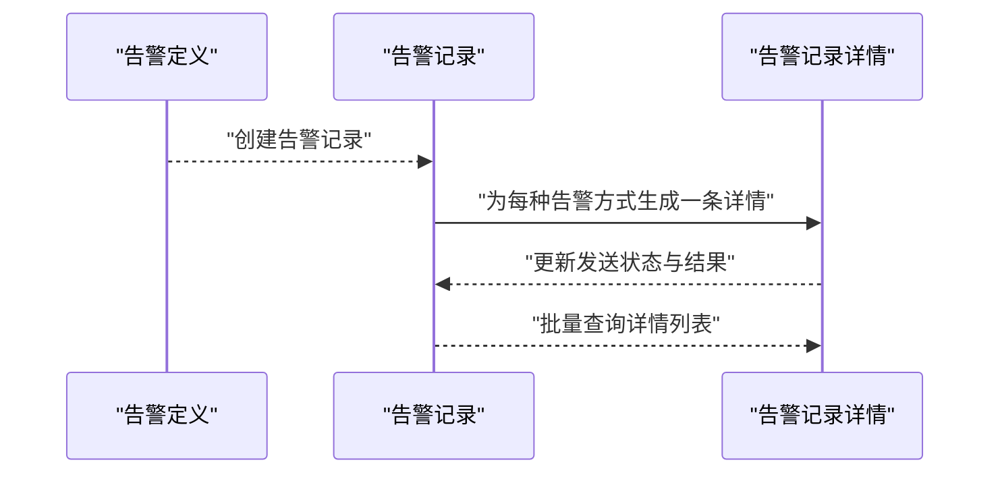
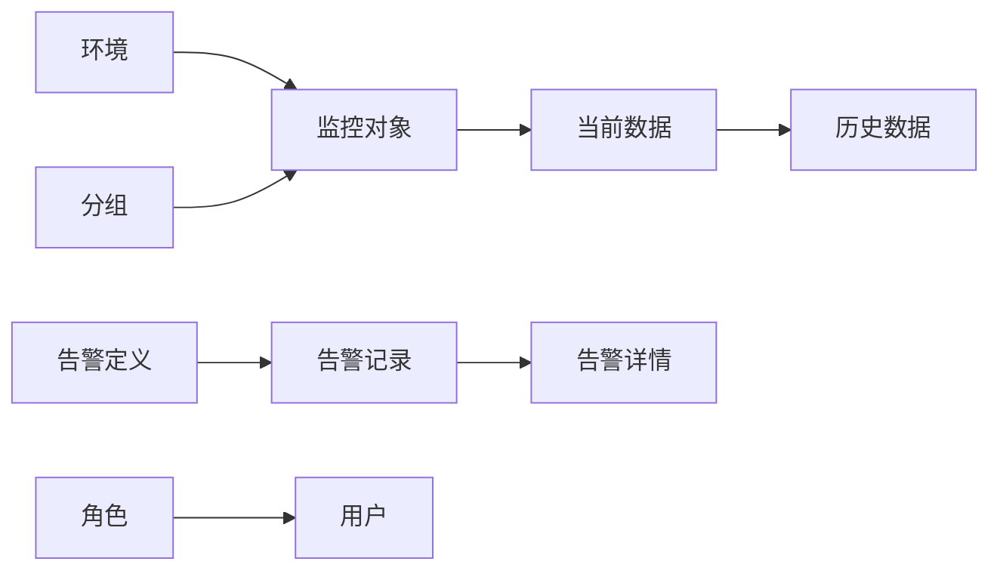

# 实体关系映射

<cite>
**本文引用的文件**
- [phoenix.sql](file://doc/数据库设计/sql/mysql/phoenix.sql)
- [Alarm.java](file://phoenix-common/phoenix-common-core/src/main/java/com/gitee/pifeng/monitoring/common/domain/Alarm.java)
- [Server.java](file://phoenix-common/phoenix-common-core/src/main/java/com/gitee/pifeng/monitoring/common/domain/Server.java)
</cite>

## 目录
1. [简介](#简介)
2. [项目结构](#项目结构)
3. [核心组件](#核心组件)
4. [架构概览](#架构概览)
5. [详细组件分析](#详细组件分析)
6. [依赖分析](#依赖分析)
7. [性能考虑](#性能考虑)
8. [故障排查指南](#故障排查指南)
9. [结论](#结论)
10. [附录](#附录)

## 简介
本文件面向Phoenix监控系统，提供数据库层的实体关系映射（ER）文档。重点覆盖以下主题：
- 表之间的主外键关系设计与参照完整性保障
- 外键约束的设计原则、级联更新/删除策略选择
- 业务逻辑层面的实体关系：监控环境与监控分组的层级关系、监控实例与环境/分组的关联、告警记录与其详情的一对多关系
- 关系设计最佳实践与注意事项
- 提供ER图与实体关系图，直观展示各表之间的关联关系

## 项目结构
Phoenix数据库脚本位于doc/数据库设计/sql/mysql/phoenix.sql，涵盖监控系统的核心表结构与外键约束。该脚本定义了环境、分组、各类监控对象（服务器、网络、TCP、HTTP、数据库、应用实例）、JVM指标、告警定义与记录、用户与角色等表，并通过外键建立稳定的参照关系。

```mermaid
graph TB
subgraph "监控环境与分组"
ENV["MONITOR_ENV<br/>监控环境"]
GROUP["MONITOR_GROUP<br/>监控分组"]
end
subgraph "监控对象"
SERVER["MONITOR_SERVER<br/>服务器"]
NET["MONITOR_NET<br/>网络"]
TCP["MONITOR_TCP<br/>TCP"]
HTTP["MONITOR_HTTP<br/>HTTP"]
DB["MONITOR_DB<br/>数据库"]
INSTANCE["MONITOR_INSTANCE<br/>应用实例"]
end
subgraph "监控数据与历史"
JVM_MEM["MONITOR_JVM_MEMORY<br/>JVM内存"]
JVM_MEM_H["MONITOR_JVM_MEMORY_HISTORY<br/>JVM内存历史"]
SERVER_CPU["MONITOR_SERVER_CPU<br/>服务器CPU"]
SERVER_CPU_H["MONITOR_SERVER_CPU_HISTORY<br/>服务器CPU历史"]
SERVER_MEM["MONITOR_SERVER_MEMORY<br/>服务器内存"]
SERVER_MEM_H["MONITOR_SERVER_MEMORY_HISTORY<br/>服务器内存历史"]
SERVER_DISK["MONITOR_SERVER_DISK<br/>服务器磁盘"]
SERVER_DISK_H["MONITOR_SERVER_DISK_HISTORY<br/>服务器磁盘历史"]
SERVER_NET["MONITOR_SERVER_NETCARD<br/>服务器网卡"]
SERVER_NET_H["MONITOR_SERVER_NETCARD_HISTORY<br/>服务器网卡历史"]
SERVER_LOAD["MONITOR_SERVER_LOAD_AVERAGE<br/>服务器平均负载"]
SERVER_LOAD_H["MONITOR_SERVER_LOAD_AVERAGE_HISTORY<br/>服务器平均负载历史"]
SERVER_PROC["MONITOR_SERVER_PROCESS<br/>服务器进程"]
SERVER_PROC_H["MONITOR_SERVER_PROCESS_HISTORY<br/>服务器进程历史"]
SERVER_SENS["MONITOR_SERVER_SENSORS<br/>服务器传感器"]
SERVER_PWR["MONITOR_SERVER_POWER_SOURCES<br/>服务器电池"]
end
subgraph "告警体系"
ALARM_DEF["MONITOR_ALARM_DEFINITION<br/>告警定义"]
ALARM_REC["MONITOR_ALARM_RECORD<br/>告警记录"]
ALARM_REC_DET["MONITOR_ALARM_RECORD_DETAIL<br/>告警记录详情"]
end
subgraph "用户与权限"
ROLE["MONITOR_ROLE<br/>角色"]
USER["MONITOR_USER<br/>用户"]
end
ENV --> SERVER
ENV --> NET
ENV --> TCP
ENV --> HTTP
ENV --> DB
ENV --> INSTANCE
GROUP --> SERVER
GROUP --> NET
GROUP --> TCP
GROUP --> HTTP
GROUP --> DB
GROUP --> INSTANCE
INSTANCE --> JVM_MEM
INSTANCE --> JVM_MEM_H
SERVER --> SERVER_CPU
SERVER --> SERVER_CPU_H
SERVER --> SERVER_MEM
SERVER --> SERVER_MEM_H
SERVER --> SERVER_DISK
SERVER --> SERVER_DISK_H
SERVER --> SERVER_NET
SERVER --> SERVER_NET_H
SERVER --> SERVER_LOAD
SERVER --> SERVER_LOAD_H
SERVER --> SERVER_PROC
SERVER --> SERVER_PROC_H
SERVER --> SERVER_SENS
SERVER --> SERVER_PWR
ALARM_DEF --> ALARM_REC
ALARM_REC --> ALARM_REC_DET
ROLE --> USER
```

图表来源
- [phoenix.sql:158-197](file://doc/数据库设计/sql/mysql/phoenix.sql#L158-L197)
- [phoenix.sql:615-650](file://doc/数据库设计/sql/mysql/phoenix.sql#L615-L650)
- [phoenix.sql:525-554](file://doc/数据库设计/sql/mysql/phoenix.sql#L525-L554)
- [phoenix.sql:1094-1124](file://doc/数据库设计/sql/mysql/phoenix.sql#L1094-L1124)
- [phoenix.sql:200-235](file://doc/数据库设计/sql/mysql/phoenix.sql#L200-L235)
- [phoenix.sql:110-139](file://doc/数据库设计/sql/mysql/phoenix.sql#L110-L139)
- [phoenix.sql:271-304](file://doc/数据库设计/sql/mysql/phoenix.sql#L271-L304)
- [phoenix.sql:307-395](file://doc/数据库设计/sql/mysql/phoenix.sql#L307-L395)
- [phoenix.sql:623-650](file://doc/数据库设计/sql/mysql/phoenix.sql#L623-L650)
- [phoenix.sql:653-764](file://doc/数据库设计/sql/mysql/phoenix.sql#L653-L764)
- [phoenix.sql:767-832](file://doc/数据库设计/sql/mysql/phoenix.sql#L767-L832)
- [phoenix.sql:835-884](file://doc/数据库设计/sql/mysql/phoenix.sql#L835-L884)
- [phoenix.sql:887-958](file://doc/数据库设计/sql/mysql/phoenix.sql#L887-L958)
- [phoenix.sql:961-982](file://doc/数据库设计/sql/mysql/phoenix.sql#L961-L982)
- [phoenix.sql:985-1021](file://doc/数据库设计/sql/mysql/phoenix.sql#L985-L1021)
- [phoenix.sql:1024-1071](file://doc/数据库设计/sql/mysql/phoenix.sql#L1024-L1071)
- [phoenix.sql:1074-1091](file://doc/数据库设计/sql/mysql/phoenix.sql#L1074-L1091)
- [phoenix.sql:17-65](file://doc/数据库设计/sql/mysql/phoenix.sql#L17-L65)
- [phoenix.sql:39-91](file://doc/数据库设计/sql/mysql/phoenix.sql#L39-L91)
- [phoenix.sql:1155-1176](file://doc/数据库设计/sql/mysql/phoenix.sql#L1155-L1176)
- [phoenix.sql:607-620](file://doc/数据库设计/sql/mysql/phoenix.sql#L607-L620)

章节来源
- [phoenix.sql:1-1478](file://doc/数据库设计/sql/mysql/phoenix.sql#L1-L1478)

## 核心组件
本节聚焦于与ER设计直接相关的核心表及其职责：
- 监控环境（MONITOR_ENV）：定义监控所处的环境维度，作为其他监控对象的环境归属依据。
- 监控分组（MONITOR_GROUP）：按监控类型与业务维度划分的分组，作为监控对象的分组归属依据。
- 监控对象表：服务器、网络、TCP、HTTP、数据库、应用实例等，均通过环境与分组字段进行关联。
- 监控数据与历史表：JVM与服务器各子域（CPU、内存、磁盘、网卡、负载、进程、传感器、电池等）均有“当前”与“历史”两张表，用于时间序列存储。
- 告警体系：告警定义、告警记录、告警记录详情，形成“一对一定义 -> 一对多记录 -> 一对多详情”的完整链路。
- 用户与角色：角色与用户表，用户通过角色外键关联。

章节来源
- [phoenix.sql:158-197](file://doc/数据库设计/sql/mysql/phoenix.sql#L158-L197)
- [phoenix.sql:17-65](file://doc/数据库设计/sql/mysql/phoenix.sql#L17-L65)
- [phoenix.sql:39-91](file://doc/数据库设计/sql/mysql/phoenix.sql#L39-L91)
- [phoenix.sql:615-650](file://doc/数据库设计/sql/mysql/phoenix.sql#L615-L650)
- [phoenix.sql:653-764](file://doc/数据库设计/sql/mysql/phoenix.sql#L653-L764)
- [phoenix.sql:767-832](file://doc/数据库设计/sql/mysql/phoenix.sql#L767-L832)
- [phoenix.sql:835-884](file://doc/数据库设计/sql/mysql/phoenix.sql#L835-L884)
- [phoenix.sql:887-958](file://doc/数据库设计/sql/mysql/phoenix.sql#L887-L958)
- [phoenix.sql:961-982](file://doc/数据库设计/sql/mysql/phoenix.sql#L961-L982)
- [phoenix.sql:985-1021](file://doc/数据库设计/sql/mysql/phoenix.sql#L985-L1021)
- [phoenix.sql:1024-1071](file://doc/数据库设计/sql/mysql/phoenix.sql#L1024-L1071)
- [phoenix.sql:1074-1091](file://doc/数据库设计/sql/mysql/phoenix.sql#L1074-L1091)
- [phoenix.sql:1155-1176](file://doc/数据库设计/sql/mysql/phoenix.sql#L1155-L1176)

## 架构概览
下图从ER角度展示Phoenix监控系统的核心实体与关系，突出环境/分组的层级、监控对象与其数据/历史表的继承关系、以及告警的主从关系。

```mermaid
erDiagram
MONITOR_ENV {
bigint ID PK
varchar ENV_NAME UK
varchar ENV_DESC
varchar CREATE_ACCOUNT
varchar UPDATE_ACCOUNT
datetime INSERT_TIME
datetime UPDATE_TIME
}
MONITOR_GROUP {
bigint ID PK
varchar GROUP_TYPE
varchar GROUP_NAME UK
varchar GROUP_DESC
varchar CREATE_ACCOUNT
varchar UPDATE_ACCOUNT
datetime INSERT_TIME
datetime UPDATE_TIME
}
MONITOR_SERVER {
bigint ID PK
varchar IP UK
varchar SERVER_NAME
varchar SERVER_SUMMARY
varchar IS_ONLINE
varchar IS_ENABLE_MONITOR
varchar IS_ENABLE_ALARM
int OFFLINE_COUNT
int CONN_FREQUENCY
varchar MONITOR_ENV
varchar MONITOR_GROUP
datetime INSERT_TIME
datetime UPDATE_TIME
}
MONITOR_NET {
bigint ID PK
varchar IP_SOURCE
varchar IP_TARGET
varchar IP_DESC
varchar STATUS
varchar IS_ENABLE_MONITOR
varchar IS_ENABLE_ALARM
double AVG_TIME
text PING_DETAIL
int OFFLINE_COUNT
varchar MONITOR_ENV
varchar MONITOR_GROUP
datetime INSERT_TIME
datetime UPDATE_TIME
}
MONITOR_TCP {
bigint ID PK
varchar HOSTNAME_SOURCE
varchar HOSTNAME_TARGET
int PORT_TARGET
varchar DESCR
bigint AVG_TIME
varchar STATUS
varchar IS_ENABLE_MONITOR
varchar IS_ENABLE_ALARM
int OFFLINE_COUNT
varchar MONITOR_ENV
varchar MONITOR_GROUP
datetime INSERT_TIME
datetime UPDATE_TIME
}
MONITOR_HTTP {
bigint ID PK
varchar HOSTNAME_SOURCE
varchar URL_TARGET
varchar METHOD
varchar CONTENT_TYPE
text HEADER_PARAMETER
text BODY_PARAMETER
varchar DESCR
bigint AVG_TIME
int STATUS
varchar IS_ENABLE_MONITOR
varchar IS_ENABLE_ALARM
text EXC_MESSAGE
text RESULT_BODY
int RESULT_BODY_SIZE
int OFFLINE_COUNT
varchar MONITOR_ENV
varchar MONITOR_GROUP
datetime INSERT_TIME
datetime UPDATE_TIME
}
MONITOR_DB {
bigint ID PK
varchar CONN_NAME
varchar URL
varchar USERNAME
varchar PASSWORD
varchar DB_TYPE
varchar DRIVER_CLASS
varchar DB_DESC
varchar IS_ONLINE
varchar IS_ENABLE_MONITOR
varchar IS_ENABLE_ALARM
int OFFLINE_COUNT
varchar MONITOR_ENV
varchar MONITOR_GROUP
datetime INSERT_TIME
datetime UPDATE_TIME
}
MONITOR_INSTANCE {
bigint ID PK
varchar INSTANCE_ID UK
varchar ENDPOINT
varchar INSTANCE_NAME
varchar INSTANCE_DESC
varchar INSTANCE_SUMMARY
varchar LANGUAGE
varchar APP_SERVER_TYPE
varchar IP
varchar IS_ONLINE
varchar IS_ENABLE_MONITOR
varchar IS_ENABLE_ALARM
varchar IS_OFFLINE_NOTICE
int OFFLINE_COUNT
int CONN_FREQUENCY
varchar MONITOR_ENV
varchar MONITOR_GROUP
datetime INSERT_TIME
datetime UPDATE_TIME
}
MONITOR_JVM_MEMORY {
bigint ID PK
varchar INSTANCE_ID UK
varchar MEMORY_TYPE
bigint INIT
bigint USED
bigint COMMITTED
varchar MAX
datetime INSERT_TIME
datetime UPDATE_TIME
}
MONITOR_JVM_MEMORY_HISTORY {
bigint ID PK
varchar INSTANCE_ID
varchar MEMORY_TYPE
bigint INIT
bigint USED
bigint COMMITTED
varchar MAX
datetime INSERT_TIME
datetime UPDATE_TIME
}
MONITOR_ALARM_DEFINITION {
bigint ID PK
varchar TYPE
varchar FIRST_CLASS
varchar SECOND_CLASS
varchar THIRD_CLASS
varchar GRADE
varchar CODE UK
varchar TITLE
varchar CONTENT
datetime INSERT_TIME
datetime UPDATE_TIME
}
MONITOR_ALARM_RECORD {
bigint ID PK
varchar CODE UK
varchar ALARM_DEF_CODE
varchar TYPE
varchar LEVEL
varchar WAY
varchar TITLE
longtext CONTENT
varchar NOT_SEND_REASON
datetime INSERT_TIME
datetime UPDATE_TIME
}
MONITOR_ALARM_RECORD_DETAIL {
bigint ID PK
bigint ALARM_RECORD_ID
varchar CODE UK
varchar WAY
varchar NUMBER
varchar STATUS
longtext EXC_MESSAGE
datetime INSERT_TIME
datetime UPDATE_TIME
}
MONITOR_ROLE {
bigint ID PK
varchar ROLE_NAME
datetime CREATE_TIME
datetime UPDATE_TIME
}
MONITOR_USER {
bigint ID PK
varchar ACCOUNT UK
varchar USERNAME
varchar PASSWORD
bigint ROLE_ID
varchar EMAIL
varchar REMARKS
datetime REGISTER_TIME
datetime UPDATE_TIME
}
MONITOR_SERVER_CPU {
bigint ID PK
varchar IP
int CPU_NO
int CPU_MHZ
varchar CPU_VENDOR
varchar CPU_MODEL
double CPU_USER
double CPU_SYS
double CPU_WAIT
double CPU_NICE
double CPU_COMBINED
double CPU_IDLE
datetime INSERT_TIME
datetime UPDATE_TIME
}
MONITOR_SERVER_CPU_HISTORY {
bigint ID PK
varchar IP
int CPU_NO
int CPU_MHZ
varchar CPU_VENDOR
varchar CPU_MODEL
double CPU_USER
double CPU_SYS
double CPU_WAIT
double CPU_NICE
double CPU_COMBINED
double CPU_IDLE
datetime INSERT_TIME
datetime UPDATE_TIME
}
MONITOR_SERVER_MEMORY {
bigint ID PK
varchar IP UK
bigint MEM_TOTAL
bigint MEM_USED
bigint MEM_FREE
double MEN_USED_PERCENT
bigint SWAP_TOTAL
bigint SWAP_USED
bigint SWAP_FREE
double SWAP_USED_PERCENT
datetime INSERT_TIME
datetime UPDATE_TIME
}
MONITOR_SERVER_MEMORY_HISTORY {
bigint ID PK
varchar IP
bigint MEM_TOTAL
bigint MEM_USED
bigint MEM_FREE
double MEN_USED_PERCENT
bigint SWAP_TOTAL
bigint SWAP_USED
bigint SWAP_FREE
double SWAP_USED_PERCENT
datetime INSERT_TIME
datetime UPDATE_TIME
}
MONITOR_SERVER_DISK {
bigint ID PK
varchar IP
int DISK_NO
varchar DEV_NAME
varchar DIR_NAME
varchar TYPE_NAME
varchar SYS_TYPE_NAME
bigint TOTAL
bigint FREE
bigint USED
bigint AVAIL
double USE_PERCENT
datetime INSERT_TIME
datetime UPDATE_TIME
}
MONITOR_SERVER_DISK_HISTORY {
bigint ID PK
varchar IP
int DISK_NO
varchar DEV_NAME
varchar DIR_NAME
varchar TYPE_NAME
varchar SYS_TYPE_NAME
bigint TOTAL
bigint FREE
bigint USED
bigint AVAIL
double USE_PERCENT
datetime INSERT_TIME
datetime UPDATE_TIME
}
MONITOR_SERVER_NETCARD {
bigint ID PK
varchar IP
int NET_NO
varchar NAME
varchar TYPE
varchar ADDRESS
varchar MASK
varchar BROADCAST
varchar HW_ADDR
varchar DESCRIPTION
bigint RX_BYTES
bigint RX_PACKETS
bigint RX_ERRORS
bigint RX_DROPPED
bigint TX_BYTES
bigint TX_PACKETS
bigint TX_ERRORS
bigint TX_DROPPED
double DOWNLOAD_BPS
double UPLOAD_BPS
datetime INSERT_TIME
datetime UPDATE_TIME
}
MONITOR_SERVER_NETCARD_HISTORY {
bigint ID PK
varchar IP
int NET_NO
varchar NAME
varchar TYPE
varchar ADDRESS
varchar MASK
varchar BROADCAST
varchar HW_ADDR
varchar DESCRIPTION
bigint RX_BYTES
bigint RX_PACKETS
bigint RX_ERRORS
bigint RX_DROPPED
bigint TX_BYTES
bigint TX_PACKETS
bigint TX_ERRORS
bigint TX_DROPPED
double DOWNLOAD_BPS
double UPLOAD_BPS
datetime INSERT_TIME
datetime UPDATE_TIME
}
MONITOR_SERVER_LOAD_AVERAGE {
bigint ID PK
varchar IP UK
int LOGICAL_PROCESSOR_COUNT
double ONE
double FIVE
double FIFTEEN
datetime INSERT_TIME
datetime UPDATE_TIME
}
MONITOR_SERVER_LOAD_AVERAGE_HISTORY {
bigint ID PK
varchar IP
int LOGICAL_PROCESSOR_COUNT
double ONE
double FIVE
double FIFTEEN
datetime INSERT_TIME
datetime UPDATE_TIME
}
MONITOR_SERVER_PROCESS {
bigint ID PK
varchar IP
int PROCESS_ID
varchar NAME
text PATH
text COMMAND_LINE
varchar CURRENT_WORKING_DIRECTORY
varchar USER
varchar STATE
varchar UP_TIME
datetime START_TIME
double CPU_LOAD_CUMULATIVE
varchar BITNESS
bigint MEMORY_SIZE
varchar PORTS
datetime INSERT_TIME
datetime UPDATE_TIME
}
MONITOR_SERVER_PROCESS_HISTORY {
bigint ID PK
varchar IP
int PROCESS_NUM
datetime INSERT_TIME
datetime UPDATE_TIME
}
MONITOR_SERVER_SENSORS {
bigint ID PK
varchar IP UK
varchar CPU_TEMPERATURE
varchar CPU_VOLTAGE
varchar FAN_SPEED
datetime INSERT_TIME
datetime UPDATE_TIME
}
MONITOR_SERVER_POWER_SOURCES {
bigint ID PK
varchar IP
int POWER_SOURCES_NO
varchar NAME
varchar DEVICE_NAME
double REMAINING_CAPACITY_PERCENT
varchar TIME_REMAINING_ESTIMATED
varchar TIME_REMAINING_INSTANT
varchar POWER_USAGE_RATE
varchar VOLTAGE
varchar AMPERAGE
varchar IS_POWER_ON_LINE
varchar IS_CHARGING
varchar IS_DISCHARGING
varchar CURRENT_CAPACITY
varchar MAX_CAPACITY
varchar DESIGN_CAPACITY
varchar CYCLE_COUNT
varchar CHEMISTRY
varchar MANUFACTURE_DATE
varchar MANUFACTURER
varchar SERIAL_NUMBER
varchar TEMPERATURE
datetime INSERT_TIME
datetime UPDATE_TIME
}
MONITOR_ENV ||--o{ MONITOR_SERVER : "环境关联"
MONITOR_ENV ||--o{ MONITOR_NET : "环境关联"
MONITOR_ENV ||--o{ MONITOR_TCP : "环境关联"
MONITOR_ENV ||--o{ MONITOR_HTTP : "环境关联"
MONITOR_ENV ||--o{ MONITOR_DB : "环境关联"
MONITOR_ENV ||--o{ MONITOR_INSTANCE : "环境关联"
MONITOR_GROUP ||--o{ MONITOR_SERVER : "分组关联"
MONITOR_GROUP ||--o{ MONITOR_NET : "分组关联"
MONITOR_GROUP ||--o{ MONITOR_TCP : "分组关联"
MONITOR_GROUP ||--o{ MONITOR_HTTP : "分组关联"
MONITOR_GROUP ||--o{ MONITOR_DB : "分组关联"
MONITOR_GROUP ||--o{ MONITOR_INSTANCE : "分组关联"
MONITOR_INSTANCE ||--o{ MONITOR_JVM_MEMORY : "实例关联"
MONITOR_INSTANCE ||--o{ MONITOR_JVM_MEMORY_HISTORY : "实例关联"
MONITOR_ALARM_DEFINITION ||--o{ MONITOR_ALARM_RECORD : "定义关联"
MONITOR_ALARM_RECORD ||--o{ MONITOR_ALARM_RECORD_DETAIL : "记录关联"
MONITOR_ROLE ||--o{ MONITOR_USER : "角色关联"
```

图表来源
- [phoenix.sql:158-197](file://doc/数据库设计/sql/mysql/phoenix.sql#L158-L197)
- [phoenix.sql:615-650](file://doc/数据库设计/sql/mysql/phoenix.sql#L615-L650)
- [phoenix.sql:525-554](file://doc/数据库设计/sql/mysql/phoenix.sql#L525-L554)
- [phoenix.sql:1094-1124](file://doc/数据库设计/sql/mysql/phoenix.sql#L1094-L1124)
- [phoenix.sql:200-235](file://doc/数据库设计/sql/mysql/phoenix.sql#L200-L235)
- [phoenix.sql:110-139](file://doc/数据库设计/sql/mysql/phoenix.sql#L110-L139)
- [phoenix.sql:271-304](file://doc/数据库设计/sql/mysql/phoenix.sql#L271-L304)
- [phoenix.sql:307-395](file://doc/数据库设计/sql/mysql/phoenix.sql#L307-L395)
- [phoenix.sql:17-65](file://doc/数据库设计/sql/mysql/phoenix.sql#L17-L65)
- [phoenix.sql:39-91](file://doc/数据库设计/sql/mysql/phoenix.sql#L39-L91)
- [phoenix.sql:1155-1176](file://doc/数据库设计/sql/mysql/phoenix.sql#L1155-L1176)

## 详细组件分析

### 监控环境与监控分组
- 设计要点
  - 环境（ENV）与分组（GROUP）分别以唯一键约束（UK）确保全局唯一性，便于跨监控对象统一归类。
  - 各监控对象表（服务器、网络、TCP、HTTP、数据库、应用实例）均包含MONITOR_ENV与MONITOR_GROUP字段，并建立外键约束，确保删除/更新时遵循RESTRICT策略，防止误删导致数据漂移。
- 参照完整性
  - 删除或更新ENV/GROUP前需清理或迁移其下的监控对象，避免违反外键约束。
- 业务意义
  - 环境用于区分开发/测试/预生产/生产等不同阶段；分组用于按监控类型（如SERVER、HTTP4SERVICE等）与业务维度组织监控对象。

章节来源
- [phoenix.sql:158-197](file://doc/数据库设计/sql/mysql/phoenix.sql#L158-L197)
- [phoenix.sql:615-650](file://doc/数据库设计/sql/mysql/phoenix.sql#L615-L650)
- [phoenix.sql:525-554](file://doc/数据库设计/sql/mysql/phoenix.sql#L525-L554)
- [phoenix.sql:1094-1124](file://doc/数据库设计/sql/mysql/phoenix.sql#L1094-L1124)
- [phoenix.sql:200-235](file://doc/数据库设计/sql/mysql/phoenix.sql#L200-L235)
- [phoenix.sql:110-139](file://doc/数据库设计/sql/mysql/phoenix.sql#L110-L139)
- [phoenix.sql:271-304](file://doc/数据库设计/sql/mysql/phoenix.sql#L271-L304)

### 监控实例与监控环境/分组
- 关系模型
  - 应用实例（MONITOR_INSTANCE）通过MONITOR_ENV与MONITOR_GROUP字段关联到环境与分组。
  - 实例与JVM内存（MONITOR_JVM_MEMORY）及历史表（MONITOR_JVM_MEMORY_HISTORY）之间存在一对一与一对多关系，通过INSTANCE_ID建立关联。
- 外键策略
  - 实例与环境/分组采用RESTRICT策略，确保实例生命周期内环境/分组不可随意变更或删除。
- 业务逻辑
  - 实例代表具体的运行单元（客户端/代理端/服务端/UI端），其监控数据（JVM内存）随时间序列化存储于历史表，便于趋势分析与回溯。

章节来源
- [phoenix.sql:271-304](file://doc/数据库设计/sql/mysql/phoenix.sql#L271-L304)
- [phoenix.sql:307-395](file://doc/数据库设计/sql/mysql/phoenix.sql#L307-L395)

### 告警记录与告警记录详情
- 关系模型
  - 告警定义（MONITOR_ALARM_DEFINITION）与告警记录（MONITOR_ALARM_RECORD）为一对一定义与一对多记录的关系。
  - 告警记录（MONITOR_ALARM_RECORD）与告警记录详情（MONITOR_ALARM_RECORD_DETAIL）为一对多关系，每条记录可对应多种告警方式（短信、邮件等）的发送详情。
- 外键策略
  - MONITOR_ALARM_RECORD_DETAIL的ALARM_RECORD_ID字段指向MONITOR_ALARM_RECORD.ID，采用RESTRICT策略，保证详情必须依附于有效记录。
- 业务逻辑
  - 定义表用于集中管理告警模板与级别；记录表用于承载一次告警事件；详情表用于追踪每种告警方式的发送状态与结果。

图表来源
- [phoenix.sql:17-65](file://doc/数据库设计/sql/mysql/phoenix.sql#L17-L65)
- [phoenix.sql:39-91](file://doc/数据库设计/sql/mysql/phoenix.sql#L39-L91)

章节来源
- [phoenix.sql:17-65](file://doc/数据库设计/sql/mysql/phoenix.sql#L17-L65)
- [phoenix.sql:39-91](file://doc/数据库设计/sql/mysql/phoenix.sql#L39-L91)

### 监控数据与历史表的继承关系
- 关系模型
  - 当前表（如MONITOR_SERVER_CPU、MONITOR_JVM_MEMORY等）与历史表（如MONITOR_SERVER_CPU_HISTORY、MONITOR_JVM_MEMORY_HISTORY等）通过主键与时间戳字段形成“当前 -> 历史”的继承关系。
  - 服务器各子域（CPU、内存、磁盘、网卡、负载、进程、传感器、电池）均遵循相同模式。
- 业务意义
  - 当前表保存最新观测值，历史表用于长期存储与统计分析，支持时间序列查询与趋势分析。

章节来源
- [phoenix.sql:653-764](file://doc/数据库设计/sql/mysql/phoenix.sql#L653-L764)
- [phoenix.sql:767-832](file://doc/数据库设计/sql/mysql/phoenix.sql#L767-L832)
- [phoenix.sql:835-884](file://doc/数据库设计/sql/mysql/phoenix.sql#L835-L884)
- [phoenix.sql:887-958](file://doc/数据库设计/sql/mysql/phoenix.sql#L887-L958)
- [phoenix.sql:961-982](file://doc/数据库设计/sql/mysql/phoenix.sql#L961-L982)
- [phoenix.sql:985-1021](file://doc/数据库设计/sql/mysql/phoenix.sql#L985-L1021)
- [phoenix.sql:1024-1071](file://doc/数据库设计/sql/mysql/phoenix.sql#L1024-L1071)
- [phoenix.sql:1074-1091](file://doc/数据库设计/sql/mysql/phoenix.sql#L1074-L1091)

### 用户与角色
- 关系模型
  - 角色（MONITOR_ROLE）与用户（MONITOR_USER）为一对多关系，用户通过ROLE_ID外键关联角色。
- 外键策略
  - 采用RESTRICT策略，确保角色删除前需迁移或删除用户。

章节来源
- [phoenix.sql:1155-1176](file://doc/数据库设计/sql/mysql/phoenix.sql#L1155-L1176)

## 依赖分析
- 组件耦合
  - 环境与分组是监控对象的“元数据”，被广泛引用，耦合度高但内聚性强。
  - 实例与JVM内存数据存在强依赖，历史表进一步扩展了时间维度。
  - 告警体系内部依赖清晰，定义 -> 记录 -> 详情逐层细化。
- 外部依赖
  - 服务器各子域表与实例表相互独立，但共同服务于服务器监控场景。
- 循环依赖
  - 未发现循环依赖，外键方向统一指向父实体（环境/分组/角色/记录）。

图表来源
- [phoenix.sql:158-197](file://doc/数据库设计/sql/mysql/phoenix.sql#L158-L197)
- [phoenix.sql:615-650](file://doc/数据库设计/sql/mysql/phoenix.sql#L615-L650)
- [phoenix.sql:307-395](file://doc/数据库设计/sql/mysql/phoenix.sql#L307-L395)
- [phoenix.sql:17-65](file://doc/数据库设计/sql/mysql/phoenix.sql#L17-L65)
- [phoenix.sql:39-91](file://doc/数据库设计/sql/mysql/phoenix.sql#L39-L91)
- [phoenix.sql:1155-1176](file://doc/数据库设计/sql/mysql/phoenix.sql#L1155-L1176)

## 性能考虑
- 索引策略
  - 环境与分组表对ENV_NAME/GROUP_NAME建立唯一索引，提升过滤效率。
  - 监控对象表对MONITOR_ENV/MONITOR_GROUP字段建立索引，加速按环境/分组查询。
  - 告警记录表对CODE、TYPE、LEVEL、INSERT_TIME等建立索引，优化告警检索与统计。
  - 历史表对时间戳字段建立索引，支持高效的时间序列查询。
- 外键约束成本
  - 外键在写入时带来额外校验开销，但在保证数据一致性方面收益显著。
- 建议
  - 对高频查询字段（如实例ID、IP、主机名、URL、端口）建立复合索引，减少全表扫描。
  - 历史表定期归档或分区，控制单表规模，提升查询性能。

## 故障排查指南
- 常见问题
  - 删除环境/分组时报外键约束错误：需先迁移或删除其下的监控对象。
  - 插入告警详情失败：确认对应的告警记录ID是否存在且未被删除。
  - 更新实例所属环境/分组失败：因采用RESTRICT策略，需先调整实例归属或迁移数据。
- 排查步骤
  - 检查外键约束定义与索引是否存在。
  - 使用EXPLAIN分析慢查询，确认索引命中情况。
  - 对历史表进行归档或清理，避免历史数据膨胀影响性能。

章节来源
- [phoenix.sql:132-135](file://doc/数据库设计/sql/mysql/phoenix.sql#L132-L135)
- [phoenix.sql:228-231](file://doc/数据库设计/sql/mysql/phoenix.sql#L228-L231)
- [phoenix.sql:547-550](file://doc/数据库设计/sql/mysql/phoenix.sql#L547-L550)
- [phoenix.sql:1117-1120](file://doc/数据库设计/sql/mysql/phoenix.sql#L1117-L1120)
- [phoenix.sql:86-87](file://doc/数据库设计/sql/mysql/phoenix.sql#L86-L87)
- [phoenix.sql](file://doc/数据库设计/sql/mysql/phoenix.sql#L1172)

## 结论
Phoenix监控系统的ER设计以“环境/分组”为核心元数据，围绕监控对象与其数据/历史表构建清晰的层次结构；告警体系通过定义、记录与详情形成闭环。外键约束采用RESTRICT策略，确保参照完整性与数据一致性。建议在高频字段上完善索引，并对历史表进行周期性归档，以平衡查询性能与存储成本。

## 附录
- 业务实体关系补充
  - Alarm领域对象用于封装告警信息，包含监控类型、子类型、告警级别、标题、内容、告警编码、被告警主体ID等关键属性，体现业务层面的告警抽象与配置能力。
  - Server领域对象聚合了操作系统、内存、CPU、GPU、平均负载、网卡、磁盘、电池、传感器、进程等子域信息，体现服务器监控的综合视角。

章节来源
- [Alarm.java:1-117](file://phoenix-common/phoenix-common-core/src/main/java/com/gitee/pifeng/monitoring/common/domain/Alarm.java#L1-L117)
- [Server.java:1-76](file://phoenix-common/phoenix-common-core/src/main/java/com/gitee/pifeng/monitoring/common/domain/Server.java#L1-L76)