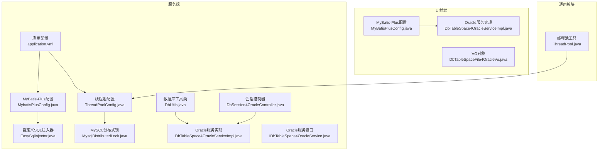
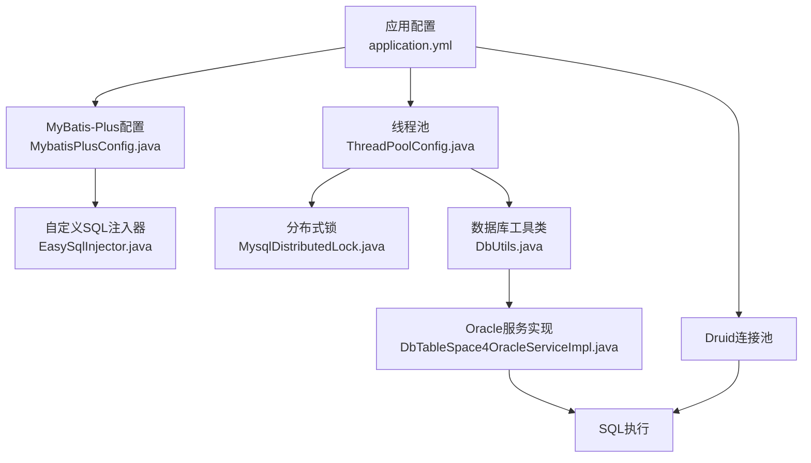
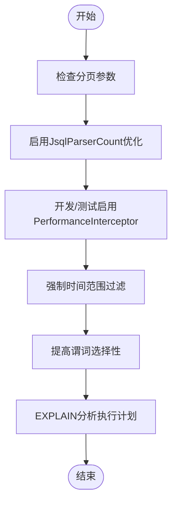
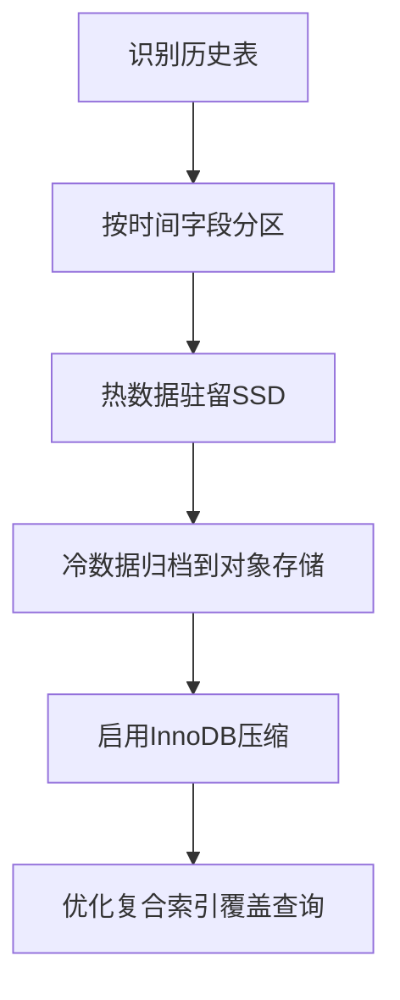
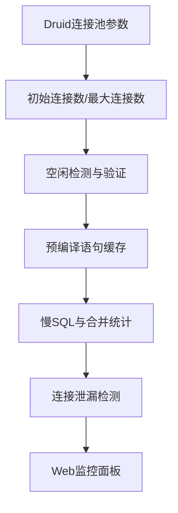
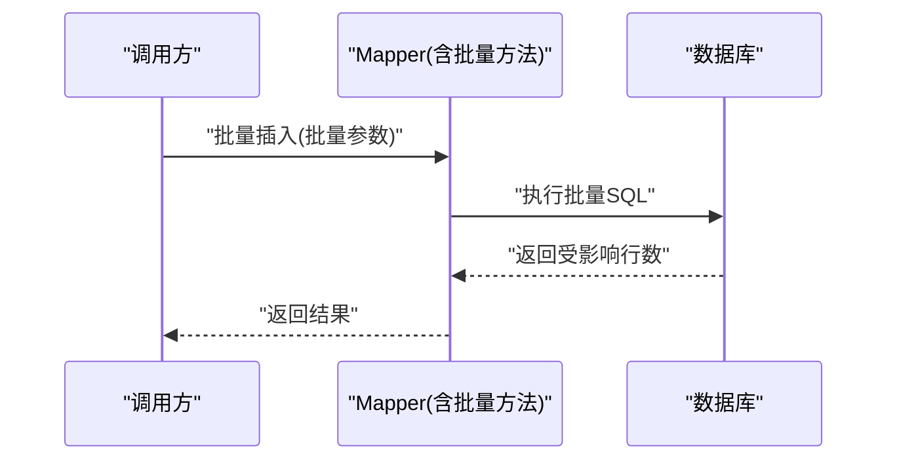
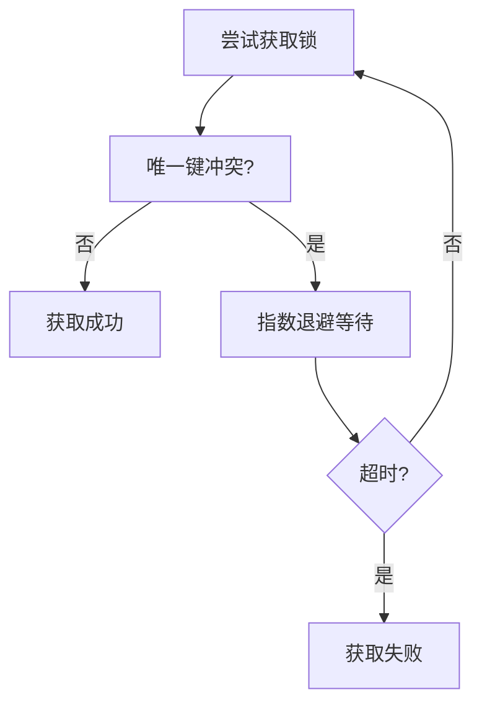
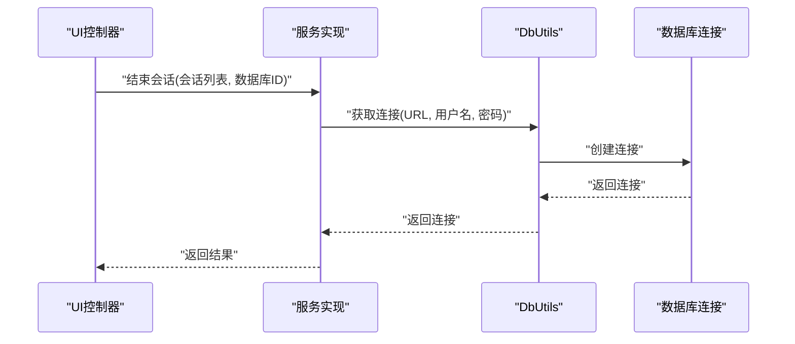
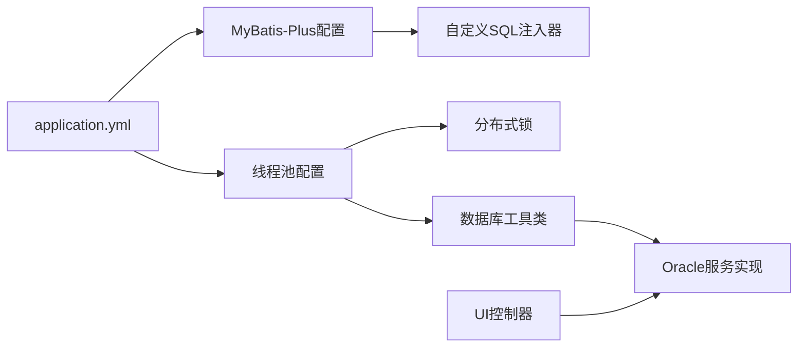

# 性能优化策略

<cite>
**本文引用的文件**
- [application.yml](file://phoenix-server/src/main/resources/application.yml)
- [application-dev.yml](file://phoenix-server/src/main/resources/application-dev.yml)
- [application-prod.yml](file://phoenix-server/src/main/resources/application-prod.yml)
- [MybatisPlusConfig.java](file://phoenix-server/src/main/java/com/gitee/pifeng/monitoring/server/config/MybatisPlusConfig.java)
- [EasySqlInjector.java](file://phoenix-server/src/main/java/com/gitee/pifeng/monitoring/server/config/EasySqlInjector.java)
- [ThreadPoolConfig.java](file://phoenix-server/src/main/java/com/gitee/pifeng/monitoring/server/config/ThreadPoolConfig.java)
- [DbUtils.java](file://phoenix-server/src/main/java/com/gitee/pifeng/monitoring/server/util/db/DbUtils.java)
- [MysqlDistributedLock.java](file://phoenix-server/src/main/java/com/gitee/pifeng/monitoring/server/business/server/core/MysqlDistributedLock.java)
- [DbSession4OracleServiceImpl.java](file://phoenix-server/src/main/java/com/gitee/pifeng/monitoring/server/business/server/service/impl/DbSession4OracleServiceImpl.java)
- [IDbTableSpace4OracleService.java](file://phoenix-server/src/main/java/com/gitee/pifeng/monitoring/server/business/server/service/IDbTableSpace4OracleService.java)
- [DbTableSpace4OracleServiceImpl.java](file://phoenix-server/src/main/java/com/gitee/pifeng/monitoring/server/business/server/service/impl/DbTableSpace4OracleServiceImpl.java)
- [MonitorDb.java](file://phoenix-server/src/main/java/com/gitee/pifeng/monitoring/server/business/server/entity/MonitorDb.java)
- [phoenix.sql](file://doc/数据库设计/sql/mysql/phoenix.sql)
- [MyBatisPlusConfig.java](file://phoenix-ui/src/main/java/com/gitee/pifeng/monitoring/ui/config/mybatisplus/MyBatisPlusConfig.java)
- [DbSession4OracleController.java](file://phoenix-ui/src/main/java/com/gitee/pifeng/monitoring/ui/business/web/controller/DbSession4OracleController.java)
- [DbTableSpace4OracleServiceImpl.java](file://phoenix-ui/src/main/java/com/gitee/pifeng/monitoring/ui/business/web/service/impl/DbTableSpace4OracleServiceImpl.java)
- [DbTableSpaceFile4OracleVo.java](file://phoenix-ui/src/main/java/com/gitee/pifeng/monitoring/ui/business/web/vo/DbTableSpaceFile4OracleVo.java)
- [ThreadPool.java](file://phoenix-common/phoenix-common-core/src/main/java/com/gitee/pifeng/monitoring/common/threadpool/ThreadPool.java)
</cite>

## 目录
1. [简介](#简介)
2. [项目结构](#项目结构)
3. [核心组件](#核心组件)
4. [架构总览](#架构总览)
5. [详细组件分析](#详细组件分析)
6. [依赖关系分析](#依赖关系分析)
7. [性能考量](#性能考量)
8. [故障排查指南](#故障排查指南)
9. [结论](#结论)
10. [附录](#附录)

## 简介
本文件面向Phoenix监控系统，聚焦数据库性能优化策略，围绕高并发写入、海量历史数据存储与复杂查询场景，系统性提出查询优化、存储优化、连接池优化、批量处理优化以及数据库参数调优建议，并配套性能监控与诊断工具使用指南，帮助在生产环境中稳定、高效地运行监控系统。

## 项目结构
Phoenix由“服务端”“UI前端”“通用模块”三部分组成，数据库相关能力主要集中在服务端与通用模块：
- 服务端负责监控采集、数据库连接与分布式锁、线程池调度、MyBatis-Plus配置与SQL执行效率插件等。
- UI前端负责数据库资源视图展示与交互，部分数据库信息通过后端代理获取。
- 通用模块提供线程池与公共属性配置，支撑整体性能调优。

**图表来源**
- [application.yml:116-184](file://phoenix-server/src/main/resources/application.yml#L116-L184)
- [MybatisPlusConfig.java:24-112](file://phoenix-server/src/main/java/com/gitee/pifeng/monitoring/server/config/MybatisPlusConfig.java#L24-L112)
- [EasySqlInjector.java:17-26](file://phoenix-server/src/main/java/com/gitee/pifeng/monitoring/server/config/EasySqlInjector.java#L17-L26)
- [ThreadPoolConfig.java:69-100](file://phoenix-server/src/main/java/com/gitee/pifeng/monitoring/server/config/ThreadPoolConfig.java#L69-L100)
- [DbUtils.java:46-55](file://phoenix-server/src/main/java/com/gitee/pifeng/monitoring/server/util/db/DbUtils.java#L46-L55)
- [MysqlDistributedLock.java:94-125](file://phoenix-server/src/main/java/com/gitee/pifeng/monitoring/server/business/server/core/MysqlDistributedLock.java#L94-L125)
- [DbTableSpace4OracleServiceImpl.java:40-43](file://phoenix-server/src/main/java/com/gitee/pifeng/monitoring/server/business/server/service/impl/DbTableSpace4OracleServiceImpl.java#L40-L43)
- [IDbTableSpace4OracleService.java:16-48](file://phoenix-server/src/main/java/com/gitee/pifeng/monitoring/server/business/server/service/IDbTableSpace4OracleService.java#L16-L48)
- [DbSession4OracleController.java:104-119](file://phoenix-ui/src/main/java/com/gitee/pifeng/monitoring/ui/business/web/controller/DbSession4OracleController.java#L104-L119)
- [MyBatisPlusConfig.java:24-112](file://phoenix-ui/src/main/java/com/gitee/pifeng/monitoring/ui/config/mybatisplus/MyBatisPlusConfig.java#L24-L112)
- [ThreadPool.java:102-172](file://phoenix-common/phoenix-common-core/src/main/java/com/gitee/pifeng/monitoring/common/threadpool/ThreadPool.java#L102-L172)

**章节来源**
- [application.yml:116-184](file://phoenix-server/src/main/resources/application.yml#L116-L184)
- [MybatisPlusConfig.java:24-112](file://phoenix-server/src/main/java/com/gitee/pifeng/monitoring/server/config/MybatisPlusConfig.java#L24-L112)
- [ThreadPoolConfig.java:69-100](file://phoenix-server/src/main/java/com/gitee/pifeng/monitoring/server/config/ThreadPoolConfig.java#L69-L100)

## 核心组件
- 连接池与数据库参数：基于Druid连接池的配置，包含初始连接数、最大活跃数、空闲检测、预编译语句缓存、慢SQL统计与Web监控等。
- ORM与分页：MyBatis-Plus分页插件与SQL执行效率插件，结合JsqlParser优化count查询。
- 批量写入：自定义SQL注入器提供批量插入方法，减少网络往返与事务开销。
- 线程池：区分CPU密集型与IO密集型线程池，适配监控采集与数据库查询的并发特征。
- 分布式锁：基于MySQL的分布式锁实现，带指数退避与超时控制，避免热点竞争与死循环。
- 数据库工具类：统一连接获取与解密流程，确保安全与可维护性。

**章节来源**
- [application.yml:116-184](file://phoenix-server/src/main/resources/application.yml#L116-L184)
- [MybatisPlusConfig.java:38-77](file://phoenix-server/src/main/java/com/gitee/pifeng/monitoring/server/config/MybatisPlusConfig.java#L38-L77)
- [EasySqlInjector.java:17-26](file://phoenix-server/src/main/java/com/gitee/pifeng/monitoring/server/config/EasySqlInjector.java#L17-L26)
- [ThreadPoolConfig.java:69-100](file://phoenix-server/src/main/java/com/gitee/pifeng/monitoring/server/config/ThreadPoolConfig.java#L69-L100)
- [MysqlDistributedLock.java:94-125](file://phoenix-server/src/main/java/com/gitee/pifeng/monitoring/server/business/server/core/MysqlDistributedLock.java#L94-L125)
- [DbUtils.java:46-55](file://phoenix-server/src/main/java/com/gitee/pifeng/monitoring/server/util/db/DbUtils.java#L46-L55)

## 架构总览
Phoenix监控系统数据库侧的关键路径包括：应用配置驱动连接池与ORM，线程池调度采集任务，MyBatis-Plus执行SQL，Druid监控SQL与连接，必要时通过分布式锁保障并发一致性。

**图表来源**
- [application.yml:116-184](file://phoenix-server/src/main/resources/application.yml#L116-L184)
- [MybatisPlusConfig.java:24-112](file://phoenix-server/src/main/java/com/gitee/pifeng/monitoring/server/config/MybatisPlusConfig.java#L24-L112)
- [EasySqlInjector.java:17-26](file://phoenix-server/src/main/java/com/gitee/pifeng/monitoring/server/config/EasySqlInjector.java#L17-L26)
- [ThreadPoolConfig.java:69-100](file://phoenix-server/src/main/java/com/gitee/pifeng/monitoring/server/config/ThreadPoolConfig.java#L69-L100)
- [MysqlDistributedLock.java:94-125](file://phoenix-server/src/main/java/com/gitee/pifeng/monitoring/server/business/server/core/MysqlDistributedLock.java#L94-L125)
- [DbUtils.java:46-55](file://phoenix-server/src/main/java/com/gitee/pifeng/monitoring/server/util/db/DbUtils.java#L46-L55)
- [DbTableSpace4OracleServiceImpl.java:40-43](file://phoenix-server/src/main/java/com/gitee/pifeng/monitoring/server/business/server/service/impl/DbTableSpace4OracleServiceImpl.java#L40-L43)

## 详细组件分析

### 查询优化策略
- 分页与计数优化：启用JsqlParserCountOptimize以优化count查询，避免全表扫描；PageHelper参数合理化，避免越界翻页带来的额外开销。
- SQL执行效率：开发/测试环境启用PerformanceInterceptor，定位慢SQL与高频执行语句。
- 查询重写建议：
  - 对历史表查询增加时间范围过滤条件，优先命中索引。
  - 复杂聚合查询拆分为多阶段，利用临时表或物化视图。
  - 避免SELECT *，仅选择必要列，减少网络与解析开销。
- 执行计划分析：结合Druid SQL监控与数据库EXPLAIN，识别全表扫描、索引失效与回表过多问题。

**图表来源**
- [MybatisPlusConfig.java:38-77](file://phoenix-server/src/main/java/com/gitee/pifeng/monitoring/server/config/MybatisPlusConfig.java#L38-L77)
- [MyBatisPlusConfig.java:24-112](file://phoenix-ui/src/main/java/com/gitee/pifeng/monitoring/ui/config/mybatisplus/MyBatisPlusConfig.java#L24-L112)
- [application.yml:116-184](file://phoenix-server/src/main/resources/application.yml#L116-L184)

**章节来源**
- [MybatisPlusConfig.java:38-77](file://phoenix-server/src/main/java/com/gitee/pifeng/monitoring/server/config/MybatisPlusConfig.java#L38-L77)
- [MyBatisPlusConfig.java:24-112](file://phoenix-ui/src/main/java/com/gitee/pifeng/monitoring/ui/config/mybatisplus/MyBatisPlusConfig.java#L24-L112)

### 存储优化方案
- 数据分区：对按时间维度的历史表（如JVM、服务器指标）建议按月/季分区，便于快速裁剪过期数据与加速查询。
- 归档策略：定期将历史数据归档至冷存储，保留热数据在高性能SSD，降低在线库压力。
- 压缩技术：启用InnoDB压缩（zlib），对重复度高的历史字段（如状态、描述）可显著节省空间。
- 索引优化：为高频过滤字段（环境、分组、实例ID、时间戳）建立复合索引，避免回表与排序。

**图表来源**
- [phoenix.sql:126-314](file://doc/数据库设计/sql/mysql/phoenix.sql#L126-L314)

**章节来源**
- [phoenix.sql:126-314](file://doc/数据库设计/sql/mysql/phoenix.sql#L126-L314)

### 连接池优化
- 连接池配置要点：合理设置initial-size、max-active、min-idle与max-wait，避免连接饥饿与抖动。
- PSCache与慢SQL：开启pool-prepared-statements与max-pool-prepared-statement-per-connection-size，合并SQL与慢SQL统计，辅助定位热点。
- 泄漏检测：启用remove-abandoned与log-abandoned，结合业务超时设置，及时回收泄漏连接。
- Web监控：开启stat-view-servlet与web-stat-filter，实时掌握SQL与连接使用情况。

**图表来源**
- [application.yml:116-184](file://phoenix-server/src/main/resources/application.yml#L116-L184)

**章节来源**
- [application.yml:116-184](file://phoenix-server/src/main/resources/application.yml#L116-L184)

### 批量处理优化
- 批量插入：通过自定义SQL注入器提供的批量插入方法，减少网络往返与事务提交次数。
- 批量更新/删除：按主键或唯一键分批处理，避免长事务与锁争用；对大表删除采用“分片+延迟”的策略。
- 事务边界：将批量操作置于独立事务，设置合理超时与重试策略，防止阻塞影响在线查询。

**图表来源**
- [EasySqlInjector.java:17-26](file://phoenix-server/src/main/java/com/gitee/pifeng/monitoring/server/config/EasySqlInjector.java#L17-L26)

**章节来源**
- [EasySqlInjector.java:17-26](file://phoenix-server/src/main/java/com/gitee/pifeng/monitoring/server/config/EasySqlInjector.java#L17-L26)

### 并发与锁机制
- 分布式锁：基于MySQL唯一键的“插入/更新即加锁”，失败即重试；采用指数退避+最大间隔+超时控制，避免忙等与热点竞争。
- 线程池：区分CPU密集型与IO密集型任务，合理设置核心线程、队列与拒绝策略，避免线程风暴。

**图表来源**
- [MysqlDistributedLock.java:94-125](file://phoenix-server/src/main/java/com/gitee/pifeng/monitoring/server/business/server/core/MysqlDistributedLock.java#L94-L125)

**章节来源**
- [MysqlDistributedLock.java:94-125](file://phoenix-server/src/main/java/com/gitee/pifeng/monitoring/server/business/server/core/MysqlDistributedLock.java#L94-L125)
- [ThreadPool.java:102-172](file://phoenix-common/phoenix-common-core/src/main/java/com/gitee/pifeng/monitoring/common/threadpool/ThreadPool.java#L102-L172)

### 数据库连接与会话管理
- 连接获取：统一通过工具类解密密码并创建连接，确保安全与可维护性。
- Oracle会话：提供会话列表查询与结束会话能力，便于诊断长事务与资源占用。

**图表来源**
- [DbSession4OracleController.java:104-119](file://phoenix-ui/src/main/java/com/gitee/pifeng/monitoring/ui/business/web/controller/DbSession4OracleController.java#L104-L119)
- [DbSession4OracleServiceImpl.java:42-45](file://phoenix-server/src/main/java/com/gitee/pifeng/monitoring/server/business/server/service/impl/DbSession4OracleServiceImpl.java#L42-L45)
- [DbUtils.java:46-55](file://phoenix-server/src/main/java/com/gitee/pifeng/monitoring/server/util/db/DbUtils.java#L46-L55)

**章节来源**
- [DbSession4OracleController.java:104-119](file://phoenix-ui/src/main/java/com/gitee/pifeng/monitoring/ui/business/web/controller/DbSession4OracleController.java#L104-L119)
- [DbSession4OracleServiceImpl.java:42-45](file://phoenix-server/src/main/java/com/gitee/pifeng/monitoring/server/business/server/service/impl/DbSession4OracleServiceImpl.java#L42-L45)
- [DbUtils.java:46-55](file://phoenix-server/src/main/java/com/gitee/pifeng/monitoring/server/util/db/DbUtils.java#L46-L55)

## 依赖关系分析
- 应用配置驱动连接池与ORM，线程池为监控采集与数据库操作提供并发基础。
- 自定义SQL注入器扩展批量写入能力，降低网络与事务成本。
- 分布式锁保障关键路径的串行化，避免竞态与死锁风险。
- UI层通过控制器与服务实现访问数据库资源，VO对象承载展示所需字段。

**图表来源**
- [application.yml:116-184](file://phoenix-server/src/main/resources/application.yml#L116-L184)
- [MybatisPlusConfig.java:24-112](file://phoenix-server/src/main/java/com/gitee/pifeng/monitoring/server/config/MybatisPlusConfig.java#L24-L112)
- [EasySqlInjector.java:17-26](file://phoenix-server/src/main/java/com/gitee/pifeng/monitoring/server/config/EasySqlInjector.java#L17-L26)
- [ThreadPoolConfig.java:69-100](file://phoenix-server/src/main/java/com/gitee/pifeng/monitoring/server/config/ThreadPoolConfig.java#L69-L100)
- [MysqlDistributedLock.java:94-125](file://phoenix-server/src/main/java/com/gitee/pifeng/monitoring/server/business/server/core/MysqlDistributedLock.java#L94-L125)
- [DbUtils.java:46-55](file://phoenix-server/src/main/java/com/gitee/pifeng/monitoring/server/util/db/DbUtils.java#L46-L55)
- [DbTableSpace4OracleServiceImpl.java:40-43](file://phoenix-server/src/main/java/com/gitee/pifeng/monitoring/server/business/server/service/impl/DbTableSpace4OracleServiceImpl.java#L40-L43)
- [DbSession4OracleController.java:104-119](file://phoenix-ui/src/main/java/com/gitee/pifeng/monitoring/ui/business/web/controller/DbSession4OracleController.java#L104-L119)

**章节来源**
- [application.yml:116-184](file://phoenix-server/src/main/resources/application.yml#L116-L184)
- [MybatisPlusConfig.java:24-112](file://phoenix-server/src/main/java/com/gitee/pifeng/monitoring/server/config/MybatisPlusConfig.java#L24-L112)
- [ThreadPoolConfig.java:69-100](file://phoenix-server/src/main/java/com/gitee/pifeng/monitoring/server/config/ThreadPoolConfig.java#L69-L100)

## 性能考量
- 高并发写入：批量插入、预编译语句缓存、连接池上限与等待时间调优、慢SQL与合并统计。
- 大量历史数据：分区、归档、压缩、复合索引覆盖查询。
- 复杂查询：分页优化、执行计划分析、避免全表扫描与回表。
- 连接与锁：连接泄漏检测、分布式锁退避与超时、线程池隔离与拒绝策略。
- 监控与诊断：Druid监控面板、SQL执行效率插件、EXPLAIN与慢查询日志。

[本节为通用指导，无需列出具体文件来源]

## 故障排查指南
- 连接池告警：检查max-wait、max-active与remove-abandoned配置，关注Web监控中的连接使用率与慢SQL。
- 查询性能问题：启用开发/测试环境的SQL执行效率插件，结合EXPLAIN定位索引与扫描问题。
- 批量写入卡顿：确认批量方法是否生效、事务边界是否合理、是否存在长事务阻塞。
- 分布式锁失败：检查唯一键冲突、退避参数与超时设置，避免热点Key争用。
- Oracle会话异常：通过UI控制器提供的结束会话能力清理长事务或异常会话。

**章节来源**
- [application.yml:116-184](file://phoenix-server/src/main/resources/application.yml#L116-L184)
- [MyBatisPlusConfig.java:104-110](file://phoenix-ui/src/main/java/com/gitee/pifeng/monitoring/ui/config/mybatisplus/MyBatisPlusConfig.java#L104-L110)
- [MysqlDistributedLock.java:94-125](file://phoenix-server/src/main/java/com/gitee/pifeng/monitoring/server/business/server/core/MysqlDistributedLock.java#L94-L125)
- [DbSession4OracleController.java:104-119](file://phoenix-ui/src/main/java/com/gitee/pifeng/monitoring/ui/business/web/controller/DbSession4OracleController.java#L104-L119)

## 结论
通过连接池参数调优、ORM分页与SQL执行效率插件、批量写入扩展、分布式锁与线程池隔离，以及分区/归档/压缩等存储策略，Phoenix监控系统可在高并发写入与复杂查询场景下保持稳定与高效。建议在生产环境持续使用Druid监控与EXPLAIN分析，配合定期的索引与分区评估，确保系统长期性能健康。

[本节为总结性内容，无需列出具体文件来源]

## 附录
- 数据库表结构参考：MONITOR_DB、MONITOR_DISTRIBUTED_LOCK、MONITOR_INSTANCE、MONITOR_JVM_CLASS_LOADING等。
- Oracle资源视图：UI层提供表空间与会话等资源展示，服务端通过工具类与连接池安全访问数据库。

**章节来源**
- [phoenix.sql:126-314](file://doc/数据库设计/sql/mysql/phoenix.sql#L126-L314)
- [MonitorDb.java:26-68](file://phoenix-server/src/main/java/com/gitee/pifeng/monitoring/server/business/server/entity/MonitorDb.java#L26-L68)
- [DbTableSpaceFile4OracleVo.java:27-54](file://phoenix-ui/src/main/java/com/gitee/pifeng/monitoring/ui/business/web/vo/DbTableSpaceFile4OracleVo.java#L27-L54)