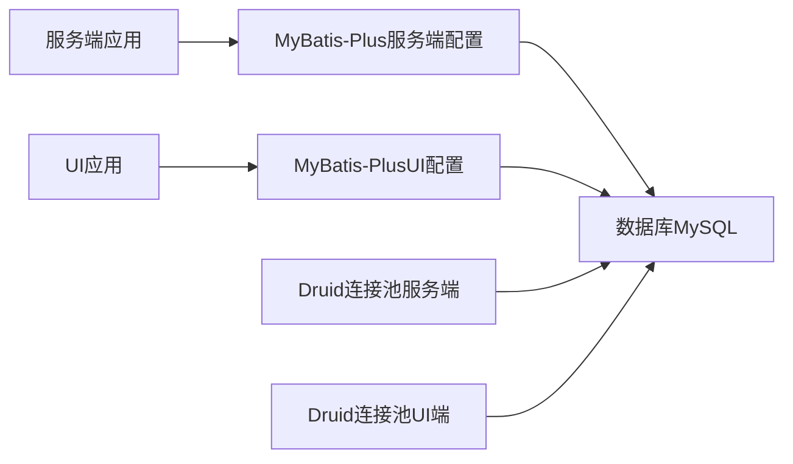
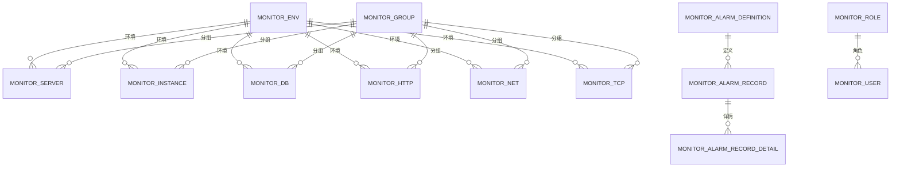
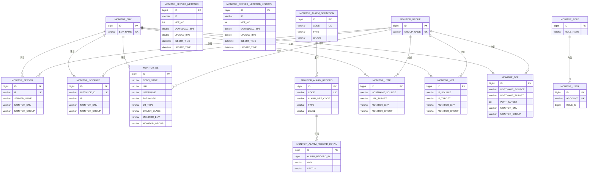

# 数据库设计

<cite>
**本文引用的文件**   
- [phoenix.sql](file://doc/数据库设计/sql/mysql/phoenix.sql)
- [application.yml（服务端）](file://phoenix-server/src/main/resources/application.yml)
- [application.yml（UI端）](file://phoenix-ui/src/main/resources/application.yml)
- [MybatisPlusConfig（服务端）](file://phoenix-server/src/main/java/com/gitee/pifeng/monitoring/server/config/MybatisPlusConfig.java)
- [MybatisPlusConfig（UI端）](file://phoenix-ui/src/main/java/com/gitee/pifeng/monitoring/ui/config/mybatisplus/MybatisPlusConfig.java)
- [EasySqlInjector（服务端）](file://phoenix-server/src/main/java/com/gitee/pifeng/monitoring/server/config/EasySqlInjector.java)
- [EasySqlInjector（UI端）](file://phoenix-ui/src/main/java/com/gitee/pifeng/monitoring/ui/config/mybatisplus/EasySqlInjector.java)
- [MonitorDb（UI实体）](file://phoenix-ui/src/main/java/com/gitee/pifeng/monitoring/ui/business/web/entity/MonitorDb.java)
- [MonitorDb（服务端实体）](file://phoenix-server/src/main/java/com/gitee/pifeng/monitoring/server/business/server/entity/MonitorDb.java)
- [DbUtils（服务端工具）](file://phoenix-server/src/main/java/com/gitee/pifeng/monitoring/server/util/db/DbUtils.java)
- [DbMonitorJob（服务端数据库监控作业）](file://phoenix-server/src/main/java/com/gitee/pifeng/monitoring/server/business/server/monitor/db/DbMonitorJob.java)
- [DbTableSpaceMonitorJob（服务端数据库表空间监控作业）](file://phoenix-server/src/main/java/com/gitee/pifeng/monitoring/server/business/server/monitor/db/DbTableSpaceMonitorJob.java)
- [IDbTableSpace4OracleService（服务端Oracle表空间服务接口）](file://phoenix-server/src/main/java/com/gitee/pifeng/monitoring/server/business/server/service/IDbTableSpace4OracleService.java)
- [DbTableSpace4OracleServiceImpl（服务端Oracle表空间服务实现）](file://phoenix-server/src/main/java/com/gitee/pifeng/monitoring/server/business/server/service/impl/DbTableSpace4OracleServiceImpl.java)
- [MyBatisPlusAutoGenerator（UI端MyBatis-Plus代码生成器）](file://phoenix-ui/src/main/java/com/gitee/pifeng/monitoring/ui/business/web/MyBatisPlusAutoGenerator.java)
- [MonitorServerNetcard（服务端实体）](file://phoenix-server/src/main/java/com/gitee/pifeng/monitoring/server/business/server/entity/MonitorServerNetcard.java)
- [MonitorServerNetcardHistory（服务端实体）](file://phoenix-server/src/main/java/com/gitee/pifeng/monitoring/server/business/server/entity/MonitorServerNetcardHistory.java)
- [MonitorServerNetcardServiceImpl（UI服务实现）](file://phoenix-ui/src/main/java/com/gitee/pifeng/monitoring/ui/business/web/service/impl/MonitorServerNetcardServiceImpl.java)
</cite>

## 更新摘要
**变更内容**   
- 更新了服务器网卡监控表的术语标准化：将DOWNLOAD_BPS和UPLOAD_BPS列的注释从'下载速度'和'上传速度'更新为'下载速率'和'上传速率'
- 强调了数据库文档与实际测量指标的精确对应关系
- 补充了服务器网卡监控表的详细说明

## 目录
1. [简介](#简介)
2. [项目结构](#项目结构)
3. [核心组件](#核心组件)
4. [架构总览](#架构总览)
5. [详细组件分析](#详细组件分析)
6. [依赖分析](#依赖分析)
7. [性能考虑](#性能考虑)
8. [故障排查指南](#故障排查指南)
9. [结论](#结论)
10. [附录](#附录)

## 简介
本文件面向Phoenix监控系统，提供数据库层面的完整设计文档。内容覆盖核心表结构（监控服务器、监控实例、监控历史、告警记录等）、实体关系映射（主外键、关联查询、级联策略）、索引与约束设计（主键、唯一、复合索引）、数据访问层（MyBatis-Plus配置与使用）、性能优化策略以及数据迁移与版本管理建议。文档同时给出数据库ER图与示例数据，帮助读者快速理解与落地。

## 项目结构
Phoenix数据库脚本位于doc/数据库设计/sql/mysql/phoenix.sql，包含约1478行DDL与示例数据，覆盖监控系统所需的核心表与定时任务相关表（Quartz）。服务端与UI端均采用MyBatis-Plus作为ORM框架，并通过自定义SQL注入器扩展批量插入能力。数据源统一使用Druid连接池，配置于各模块的application.yml中。

```mermaid
graph TB
subgraph "数据库"
T1["MONITOR_SERVER<br/>服务器表"]
T2["MONITOR_INSTANCE<br/>应用实例表"]
T3["MONITOR_DB<br/>数据库连接表"]
T4["MONITOR_ALARM_DEFINITION<br/>告警定义表"]
T5["MONITOR_ALARM_RECORD<br/>告警记录表"]
T6["MONITOR_ALARM_RECORD_DETAIL<br/>告警记录详情表"]
T7["MONITOR_HTTP / HISTORY<br/>HTTP监控与历史"]
T8["MONITOR_NET / HISTORY<br/>网络监控与历史"]
T9["MONITOR_TCP / HISTORY<br/>TCP监控与历史"]
T10["JVM系列表<br/>类加载/内存/GC/线程"]
T11["ENV/GROUP/USER/ROLE<br/>环境/分组/用户/角色"]
T12["Quartz调度表<br/>QRTZ_*"]
T13["MONITOR_SERVER_NETCARD<br/>服务器网卡表"]
T14["MONITOR_SERVER_NETCARD_HISTORY<br/>服务器网卡历史表"]
end
subgraph "服务端"
S1["MyBatis-Plus配置"]
S2["自定义SQL注入器"]
S3["数据库工具类"]
S4["监控作业DB/表空间/HTTP/NET/TCP/JVM"]
end
subgraph "UI端"
U1["MyBatis-Plus配置"]
U2["自定义SQL注入器"]
U3["实体类MonitorDb等"]
U4["代码生成器"]
end
S1 --- T11
S2 --- T1
S3 --- T3
S4 --- T1
U1 --- T11
U2 --- T1
U3 --- T3
U4 --- T3
```

**章节来源**
- [phoenix.sql:1-1478](file://doc/数据库设计/sql/mysql/phoenix.sql#L1-L1478)
- [application.yml（服务端）:116-184](file://phoenix-server/src/main/resources/application.yml#L116-L184)
- [application.yml（UI端）:110-185](file://phoenix-ui/src/main/resources/application.yml#L110-L185)
- [MybatisPlusConfig（服务端）:24-112](file://phoenix-server/src/main/java/com/gitee/pifeng/monitoring/server/config/MybatisPlusConfig.java#L24-L112)
- [MybatisPlusConfig（UI端）:24-112](file://phoenix-ui/src/main/java/com/gitee/pifeng/monitoring/ui/config/mybatisplus/MybatisPlusConfig.java#L24-L112)

## 核心组件
本节聚焦Phoenix监控系统的关键表与职责划分：
- 监控服务器表（MONITOR_SERVER）：存储服务器基本信息、在线状态、监控开关、离线次数、连接频率、所属环境与分组等。
- 应用实例表（MONITOR_INSTANCE）：记录应用实例标识、端点类型、语言、IP、在线状态、监控/告警开关、离线通知与次数、所属环境与分组等。
- 数据库连接表（MONITOR_DB）：维护数据库连接名、URL、用户名、密码、驱动类、描述、在线状态、监控/告警开关、离线次数、所属环境与分组等。
- 告警定义表（MONITOR_ALARM_DEFINITION）：定义告警类型、分类、级别、编码、标题与内容。
- 告警记录表（MONITOR_ALARM_RECORD）：记录告警事件的唯一编码、类型、级别、方式、标题、内容、发送原因、时间戳等。
- 告警记录详情表（MONITOR_ALARM_RECORD_DETAIL）：记录每种告警方式的发送状态与结果。
- HTTP/网络/TCP监控与历史表：分别记录对应协议的监控指标、状态、离线次数、所属环境与分组，并提供历史表用于趋势分析。
- JVM系列表：记录类加载、内存、GC、线程等JVM指标，提供历史表支持时序分析。
- 服务器网卡监控表（MONITOR_SERVER_NETCARD / MONITOR_SERVER_NETCARD_HISTORY）：记录服务器网卡的实时流量指标，包括下载速率和上传速率，提供历史表支持时序分析。
- 环境/分组/用户/角色表：支撑多环境与多分组的监控组织与权限管理。
- Quartz调度表：支撑定时任务与调度。

**章节来源**
- [phoenix.sql:16-1478](file://doc/数据库设计/sql/mysql/phoenix.sql#L16-L1478)

## 架构总览
Phoenix数据库层采用"表-实体-DAO/Service"的分层设计，服务端与UI端分别通过MyBatis-Plus访问数据库。服务端负责采集与存储监控数据，UI端负责展示与管理。数据库连接池采用Druid，ORM配置统一开启驼峰映射与下划线表名策略。

**图表来源**
- [application.yml（服务端）:116-184](file://phoenix-server/src/main/resources/application.yml#L116-L184)
- [application.yml（UI端）:110-185](file://phoenix-ui/src/main/resources/application.yml#L110-L185)
- [MybatisPlusConfig（服务端）:24-112](file://phoenix-server/src/main/java/com/gitee/pifeng/monitoring/server/config/MybatisPlusConfig.java#L24-L112)
- [MybatisPlusConfig（UI端）:24-112](file://phoenix-ui/src/main/java/com/gitee/pifeng/monitoring/ui/config/mybatisplus/MybatisPlusConfig.java#L24-L112)

## 详细组件分析

### 监控服务器表（MONITOR_SERVER）
- 设计要点
  - 主键：自增ID
  - 唯一索引：IP（确保单机唯一）
  - 外键：MONITOR_ENV、MONITOR_GROUP（受限于外键约束）
  - 字段：IP、服务器名、摘要、在线状态、监控/告警开关、离线次数、连接频率、所属环境与分组、时间戳
- 索引与约束
  - 唯一索引：UX_IP
  - 外键：MONITOR_SERVER_ENV_FK、MONITOR_SERVER_GROUP_FK
- 查询与更新
  - 按IP查询与更新在线状态
  - 按环境/分组聚合统计

**章节来源**
- [phoenix.sql:623-650](file://doc/数据库设计/sql/mysql/phoenix.sql#L623-L650)

### 应用实例表（MONITOR_INSTANCE）
- 设计要点
  - 主键：自增ID
  - 唯一索引：INSTANCE_ID（实例唯一标识）
  - 外键：MONITOR_ENV、MONITOR_GROUP
  - 字段：实例ID、端点类型、语言、IP、在线状态、监控/告警开关、离线通知与次数、连接频率、所属环境与分组、时间戳
- 索引与约束
  - 唯一索引：UX_INSTANCE_ID
  - 外键：MONITOR_INSTANCE_ENV_FK、MONITOR_INSTANCE_GROUP_FK

**章节来源**
- [phoenix.sql:271-304](file://doc/数据库设计/sql/mysql/phoenix.sql#L271-L304)

### 数据库连接表（MONITOR_DB）
- 设计要点
  - 主键：自增ID
  - 外键：MONITOR_ENV、MONITOR_GROUP
  - 字段：连接名、URL、用户名、密码、驱动类、描述、在线状态、监控/告警开关、离线次数、所属环境与分组、时间戳
- 索引与约束
  - 外键：MONITOR_DB_ENV_FK、MONITOR_DB_GROUP_FK
- 数据访问
  - 实体类在UI与服务端分别存在，字段一致，便于跨模块共享
  - 服务端提供数据库连接工具类用于动态连接测试与访问

**章节来源**
- [phoenix.sql:110-139](file://doc/数据库设计/sql/mysql/phoenix.sql#L110-L139)
- [MonitorDb（UI实体）:27-98](file://phoenix-ui/src/main/java/com/gitee/pifeng/monitoring/ui/business/web/entity/MonitorDb.java#L27-L98)
- [MonitorDb（服务端实体）:26-125](file://phoenix-server/src/main/java/com/gitee/pifeng/monitoring/server/business/server/entity/MonitorDb.java#L26-L125)
- [DbUtils（服务端工具）:46-55](file://phoenix-server/src/main/java/com/gitee/pifeng/monitoring/server/util/db/DbUtils.java#L46-L55)

### 告警定义表（MONITOR_ALARM_DEFINITION）
- 设计要点
  - 主键：自增ID
  - 唯一索引：NX_CODE（告警编码）
  - 字段：类型、分类（一级/二级/三级）、级别、编码、标题、内容、时间戳
- 查询与更新
  - 按类型/编码检索告警定义
  - 按更新时间维护最新定义

**章节来源**
- [phoenix.sql:16-37](file://doc/数据库设计/sql/mysql/phoenix.sql#L16-L37)

### 告警记录表（MONITOR_ALARM_RECORD）
- 设计要点
  - 主键：自增ID
  - 唯一索引：NX_CODE（告警唯一编码）
  - 复合索引：NX_INSERT_TIME、NX_UPDATE_TIME、NX_TYPE、NX_LEVEL
  - 字段：UUID编码、定义编码、类型、级别、方式、标题、内容、不发送原因、时间戳
- 关联
  - 与MONITOR_ALARM_DEFINITION通过定义编码关联
- 查询与更新
  - 按类型/级别过滤
  - 按时间窗口查询最新告警

**章节来源**
- [phoenix.sql:40-65](file://doc/数据库设计/sql/mysql/phoenix.sql#L40-L65)

### 告警记录详情表（MONITOR_ALARM_RECORD_DETAIL）
- 设计要点
  - 主键：自增ID
  - 唯一索引：UX_ALARM_RECORD_ID_WAY（告警记录+告警方式唯一）
  - 复合索引：NX_WAY、NX_STATUS、MONITOR_ALARM_RECORD_FK
  - 外键：MONITOR_ALARM_RECORD_FK（限制删除，避免孤儿）
  - 字段：告警记录ID、告警方式、接收人、发送状态、异常信息、告警时间、结果获取时间
- 关联
  - 一对多：一条告警记录可有多条发送详情

**章节来源**
- [phoenix.sql:68-91](file://doc/数据库设计/sql/mysql/phoenix.sql#L68-L91)

### HTTP监控与历史表（MONITOR_HTTP / MONITOR_HTTP_HISTORY）
- 设计要点
  - 主键：自增ID
  - 复合索引：NX_HOSTNAME_SOURCE、NX_URL_TARGET、NX_INSERT_TIME
  - 外键：MONITOR_ENV、MONITOR_GROUP
  - 字段：来源主机、目标URL、方法、媒体类型、请求参数、平均响应时间、状态、异常信息、结果内容、大小、离线次数、所属环境与分组、时间戳
- 历史表
  - 记录每次采集的快照，支持趋势分析

**章节来源**
- [phoenix.sql:200-268](file://doc/数据库设计/sql/mysql/phoenix.sql#L200-L268)

### 网络监控与历史表（MONITOR_NET / MONITOR_NET_HISTORY）
- 设计要点
  - 主键：自增ID
  - 复合索引：NX_IP_SOURCE、NX_IP_TARGET、NX_INSERT_TIME
  - 外键：MONITOR_ENV、MONITOR_GROUP
  - 字段：来源IP、目标IP、描述、平均响应时间、状态、离线次数、所属环境与分组、时间戳
- 历史表
  - 记录每次采集的快照，支持趋势分析

**章节来源**
- [phoenix.sql:525-581](file://doc/数据库设计/sql/mysql/phoenix.sql#L525-L581)

### TCP监控与历史表（MONITOR_TCP / MONITOR_TCP_HISTORY）
- 设计要点
  - 主键：自增ID
  - 复合索引：NX_HOSTNAME_SOURCE、NX_HOSTNAME_TARGET、NX_PORT_TARGET、NX_INSERT_TIME
  - 外键：MONITOR_ENV、MONITOR_GROUP
  - 字段：来源主机、目标主机、端口、描述、平均响应时间、状态、离线次数、所属环境与分组、时间戳
- 历史表
  - 记录每次采集的快照，支持趋势分析

**章节来源**
- [phoenix.sql:1094-1152](file://doc/数据库设计/sql/mysql/phoenix.sql#L1094-L1152)

### 服务器网卡监控表（MONITOR_SERVER_NETCARD / MONITOR_SERVER_NETCARD_HISTORY）
- 设计要点
  - 主键：自增ID
  - 唯一索引：UX_IP_NET_NO（IP+网卡序号组合唯一）
  - 复合索引：NX_IP、NX_ADDRESS、NX_INSERT_TIME、NX_UPDATE_TIME
  - 外键：MONITOR_ENV、MONITOR_GROUP
  - 字段：IP地址、网卡序号、网卡名字、网卡类型、网卡地址、子网掩码、广播地址、MAC地址、网卡描述、接收/发送字节数、接收/发送包数、接收/发送错误包数、接收/发送丢弃包数、下载速率、上传速率、新增时间、更新时间
- 历史表
  - 记录每次采集的快照，支持趋势分析
- 术语标准化
  - 列注释已从'下载速度'和'上传速度'更新为'下载速率'和'上传速率'，确保与实际测量指标的精确对应

**章节来源**
- [phoenix.sql:887-958](file://doc/数据库设计/sql/mysql/phoenix.sql#L887-L958)
- [MonitorServerNetcard（服务端实体）:150-159](file://phoenix-server/src/main/java/com/gitee/pifeng/monitoring/server/business/server/entity/MonitorServerNetcard.java#L150-L159)
- [MonitorServerNetcardHistory（服务端实体）:149-159](file://phoenix-server/src/main/java/com/gitee/pifeng/monitoring/server/business/server/entity/MonitorServerNetcardHistory.java#L149-L159)

### JVM监控与历史表（MONITOR_JVM_* 与 MONITOR_JVM_*_HISTORY）
- 设计要点
  - 类加载：唯一索引（INSTANCE_ID）
  - 内存/GC：唯一索引（INSTANCE_ID, TYPE 或 INSTANCE_ID, NAME）
  - 历史表：按时间维度记录，支持趋势分析
  - 字段：实例ID、指标值、时间戳

**章节来源**
- [phoenix.sql:307-395](file://doc/数据库设计/sql/mysql/phoenix.sql#L307-L395)

### 环境/分组/用户/角色表
- 设计要点
  - MONITOR_ENV：环境名唯一
  - MONITOR_GROUP：分组名唯一
  - MONITOR_USER：账号唯一，外键到MONITOR_ROLE
  - 支撑多环境与多分组的监控组织与权限管理

**章节来源**
- [phoenix.sql:158-197](file://doc/数据库设计/sql/mysql/phoenix.sql#L158-L197)
- [phoenix.sql:1155-1176](file://doc/数据库设计/sql/mysql/phoenix.sql#L1155-L1176)

### Quartz调度表（QRTZ_*）
- 设计要点
  - 支撑定时任务与调度，包含触发器、作业详情、简单/复杂触发器等
  - 用于监控采集与告警发送的定时任务

**章节来源**
- [phoenix.sql:1179-1414](file://doc/数据库设计/sql/mysql/phoenix.sql#L1179-L1414)

## 依赖分析
- 外键关系
  - 服务器/实例/数据库/HTTP/网络/TCP等表均依赖环境与分组表
  - 告警记录详情依赖告警记录表
  - 用户依赖角色表
- 级联策略
  - 多处外键采用RESTRICT（禁止删除/更新），避免数据不一致
- 查询路径
  - 环境/分组维度聚合
  - 实例/服务器维度趋势分析
  - 告警定义与记录的关联查询

**图表来源**
- [phoenix.sql:132-135](file://doc/数据库设计/sql/mysql/phoenix.sql#L132-L135)
- [phoenix.sql:228-231](file://doc/数据库设计/sql/mysql/phoenix.sql#L228-L231)
- [phoenix.sql:547-550](file://doc/数据库设计/sql/mysql/phoenix.sql#L547-L550)
- [phoenix.sql:1117-1120](file://doc/数据库设计/sql/mysql/phoenix.sql#L1117-L1120)
- [phoenix.sql:82-87](file://doc/数据库设计/sql/mysql/phoenix.sql#L82-L87)
- [phoenix.sql:1170-1172](file://doc/数据库设计/sql/mysql/phoenix.sql#L1170-L1172)

**章节来源**
- [phoenix.sql:110-1478](file://doc/数据库设计/sql/mysql/phoenix.sql#L110-L1478)

## 性能考虑
- 索引设计
  - 单列索引：按时间、类型、级别、状态等高频过滤字段建立
  - 复合索引：按查询场景组合（如环境/分组、实例ID+类型、IP+时间）
  - 唯一索引：保证关键业务唯一性（实例ID、IP、告警编码）
- 查询优化
  - 使用复合索引覆盖常见WHERE/ORDER BY
  - 历史表按时间切片或分区，减少全表扫描
  - 合理分页与LIMIT，避免一次性拉取大量历史数据
- 连接池与ORM
  - Druid连接池参数已配置，建议结合业务并发调整最大连接数与超时
  - MyBatis-Plus开启驼峰映射与下划线表名策略，减少手工映射成本
- 批量写入
  - 自定义SQL注入器提供批量插入能力，适合高吞吐的历史数据写入

**章节来源**
- [application.yml（服务端）:116-184](file://phoenix-server/src/main/resources/application.yml#L116-L184)
- [application.yml（UI端）:110-185](file://phoenix-ui/src/main/resources/application.yml#L110-L185)
- [MybatisPlusConfig（服务端）:24-112](file://phoenix-server/src/main/java/com/gitee/pifeng/monitoring/server/config/MybatisPlusConfig.java#L24-L112)
- [MybatisPlusConfig（UI端）:24-112](file://phoenix-ui/src/main/java/com/gitee/pifeng/monitoring/ui/config/mybatisplus/MybatisPlusConfig.java#L24-L112)
- [EasySqlInjector（服务端）:17-26](file://phoenix-server/src/main/java/com/gitee/pifeng/monitoring/server/config/EasySqlInjector.java#L17-L26)
- [EasySqlInjector（UI端）:17-26](file://phoenix-ui/src/main/java/com/gitee/pifeng/monitoring/ui/config/mybatisplus/EasySqlInjector.java#L17-L26)

## 故障排查指南
- 连接问题
  - 使用服务端数据库工具类进行连接测试，确认URL、用户名、密码解码正确
- ORM问题
  - 检查MyBatis-Plus配置是否启用驼峰映射与下划线表名策略
  - 开发/测试环境可启用SQL执行效率插件定位慢查询
- 外键约束
  - 删除/更新前先检查是否存在依赖（RESTRICT策略）
- 历史数据堆积
  - 定期清理历史表或按时间分区裁剪

**章节来源**
- [DbUtils（服务端工具）:46-55](file://phoenix-server/src/main/java/com/gitee/pifeng/monitoring/server/util/db/DbUtils.java#L46-L55)
- [MybatisPlusConfig（服务端）:104-110](file://phoenix-server/src/main/java/com/gitee/pifeng/monitoring/server/config/MybatisPlusConfig.java#L104-L110)
- [MybatisPlusConfig（UI端）:104-110](file://phoenix-ui/src/main/java/com/gitee/pifeng/monitoring/ui/config/mybatisplus/MybatisPlusConfig.java#L104-L110)

## 结论
Phoenix数据库设计围绕"监控服务器、实例、协议（HTTP/网络/TCP）、JVM指标、告警、服务器网卡监控"六大维度构建，辅以环境/分组/用户/角色的组织与权限体系。通过合理的索引与约束、MyBatis-Plus配置与Druid连接池，满足高并发下的稳定性与可维护性。特别地，服务器网卡监控表的术语标准化确保了数据库文档与实际测量指标的精确对应，提升了监控数据的准确性。建议在生产环境中配合历史数据分区与定期清理策略，持续优化查询与写入性能。

## 附录

### 数据库schema图表

**图表来源**
- [phoenix.sql:110-1478](file://doc/数据库设计/sql/mysql/phoenix.sql#L110-L1478)

### 示例数据
- 角色与用户
  - 角色：超级管理员、普通用户
  - 用户：admin、guest
- 环境
  - dev、test、pre、prod

**章节来源**
- [phoenix.sql:1456-1477](file://doc/数据库设计/sql/mysql/phoenix.sql#L1456-L1477)

### 数据访问模式（MyBatis-Plus）
- 配置要点
  - Mapper扫描路径：服务端扫描server包，UI扫描ui包
  - 自定义SQL注入器：启用批量插入方法
  - ORM特性：驼峰映射、下划线表名、数据库ID标识
- 使用建议
  - 服务端：通过实体类与Mapper接口访问MONITOR_SERVER、MONITOR_INSTANCE、MONITOR_DB、MONITOR_SERVER_NETCARD等表
  - UI端：通过实体类与Mapper接口访问MONITOR_DB、MONITOR_SERVER_NETCARD等表，结合代码生成器快速生成DAO与XML

**章节来源**
- [MybatisPlusConfig（服务端）:24-112](file://phoenix-server/src/main/java/com/gitee/pifeng/monitoring/server/config/MybatisPlusConfig.java#L24-L112)
- [MybatisPlusConfig（UI端）:24-112](file://phoenix-ui/src/main/java/com/gitee/pifeng/monitoring/ui/config/mybatisplus/MybatisPlusConfig.java#L24-L112)
- [EasySqlInjector（服务端）:17-26](file://phoenix-server/src/main/java/com/gitee/pifeng/monitoring/server/config/EasySqlInjector.java#L17-L26)
- [EasySqlInjector（UI端）:17-26](file://phoenix-ui/src/main/java/com/gitee/pifeng/monitoring/ui/config/mybatisplus/EasySqlInjector.java#L17-L26)
- [MyBatisPlusAutoGenerator（UI端）:71-103](file://phoenix-ui/src/main/java/com/gitee/pifeng/monitoring/ui/business/web/MyBatisPlusAutoGenerator.java#L71-L103)

### 性能优化与分区策略
- 历史表分区
  - 按时间（如天/周）分区，定期归档旧数据
- 索引优化
  - 针对高频查询字段建立复合索引
  - 避免过度索引导致写入性能下降
- 连接池调优
  - 根据业务并发调整最大连接数、空闲检测与超时参数

**章节来源**
- [application.yml（服务端）:116-184](file://phoenix-server/src/main/resources/application.yml#L116-L184)
- [application.yml（UI端）:110-185](file://phoenix-ui/src/main/resources/application.yml#L110-L185)

### 数据迁移与版本管理
- 迁移路径
  - 新增表：在phoenix.sql末尾追加DDL与示例数据
  - 修改表：保留原表结构，新增列或索引，必要时提供数据迁移脚本
  - 删除表：谨慎处理，确保无外键依赖或先清理依赖
- 版本管理
  - 通过注释记录版本与变更日期
  - 在CI/CD流程中执行DDL脚本，确保数据库结构与应用版本一致

**章节来源**
- [phoenix.sql:1-14](file://doc/数据库设计/sql/mysql/phoenix.sql#L1-L14)

### 服务器网卡监控表详细说明
- 表结构特点
  - MONITOR_SERVER_NETCARD：存储服务器网卡的实时监控数据
  - MONITOR_SERVER_NETCARD_HISTORY：存储服务器网卡的历史监控数据
- 速率指标
  - DOWNLOAD_BPS：下载速率（字节/秒）
  - UPLOAD_BPS：上传速率（字节/秒）
- 术语标准化
  - 采用"速率"而非"速度"的术语，更准确地反映瞬时测量指标的物理含义
  - 符合网络监控领域的专业术语规范

**章节来源**
- [phoenix.sql:887-958](file://doc/数据库设计/sql/mysql/phoenix.sql#L887-L958)
- [MonitorServerNetcard（服务端实体）:150-159](file://phoenix-server/src/main/java/com/gitee/pifeng/monitoring/server/business/server/entity/MonitorServerNetcard.java#L150-L159)
- [MonitorServerNetcardHistory（服务端实体）:149-159](file://phoenix-server/src/main/java/com/gitee/pifeng/monitoring/server/business/server/entity/MonitorServerNetcardHistory.java#L149-L159)
- [MonitorServerNetcardServiceImpl（UI服务实现）:56-70](file://phoenix-ui/src/main/java/com/gitee/pifeng/monitoring/ui/business/web/service/impl/MonitorServerNetcardServiceImpl.java#L56-L70)