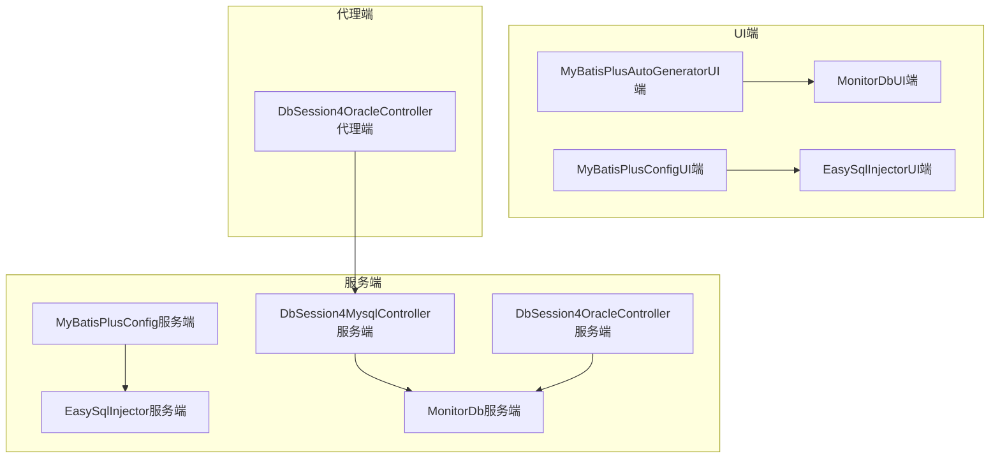
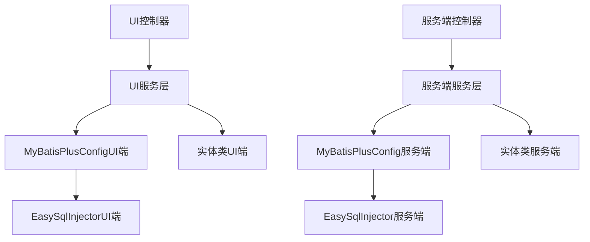
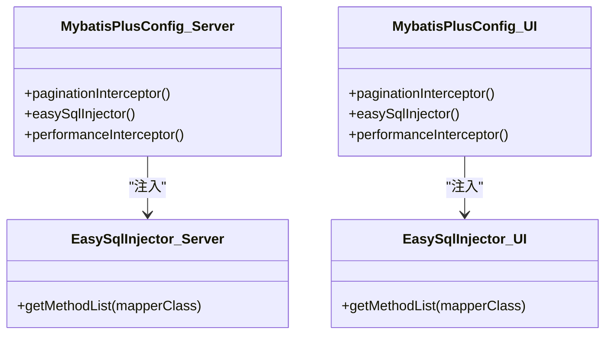
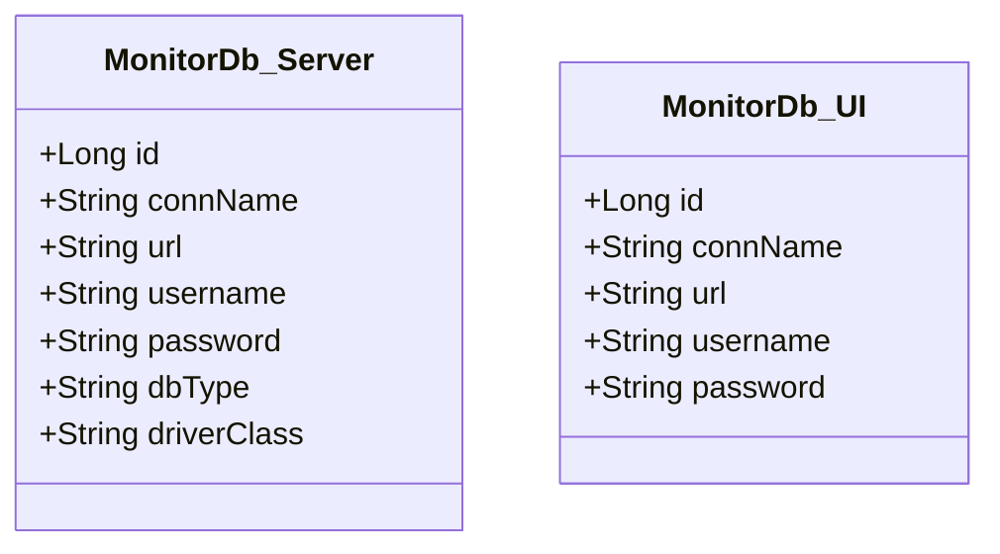
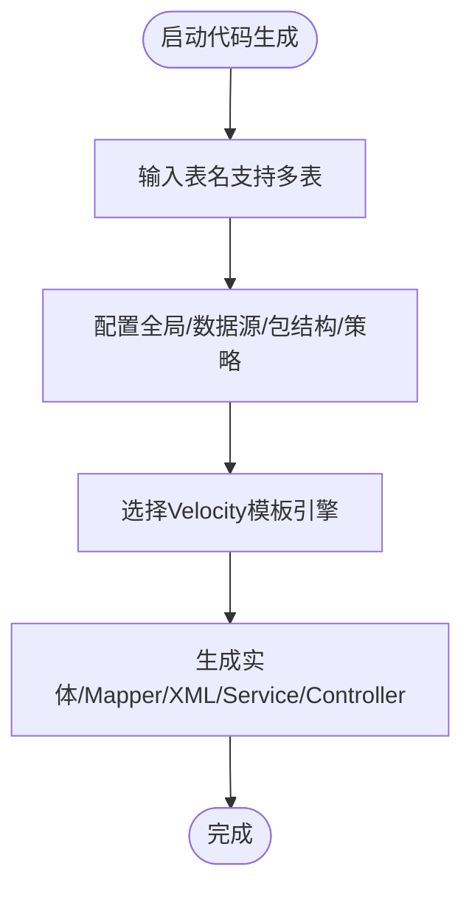
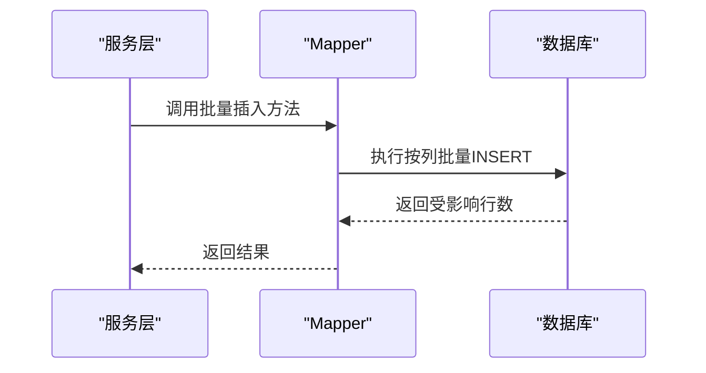
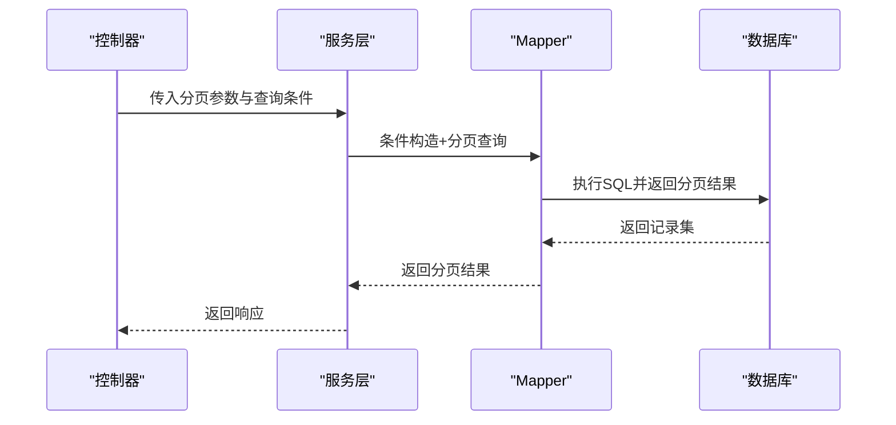
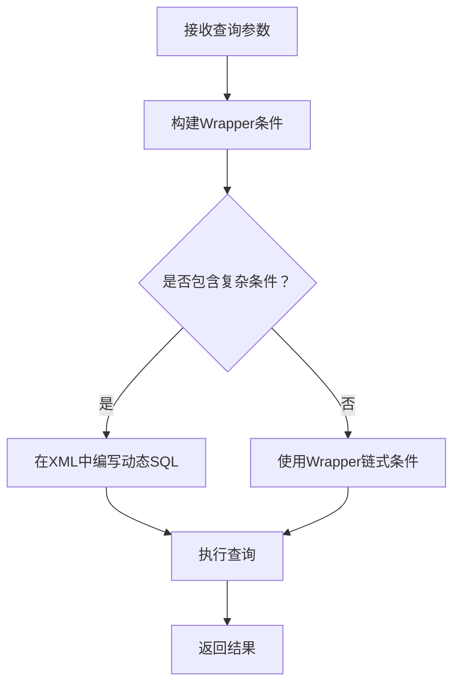
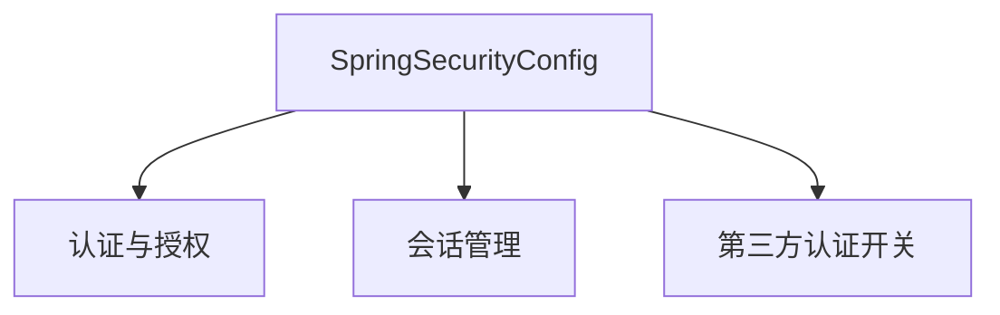
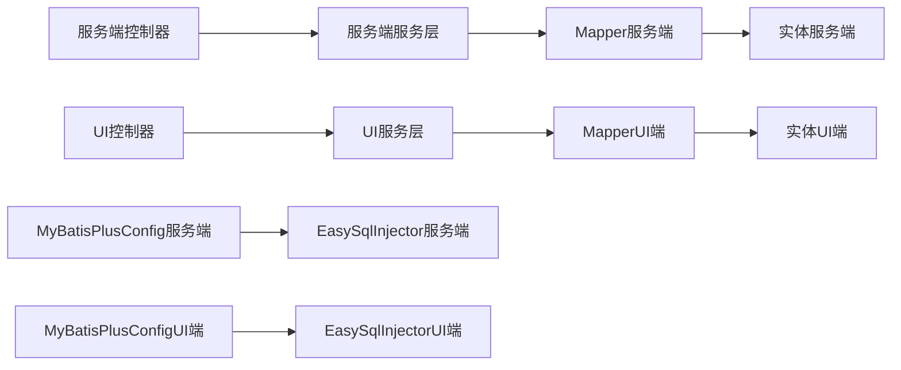

# 数据访问模式

<cite>
**本文引用的文件**
- [MyBatisPlusAutoGenerator.java](file://phoenix-ui/src/main/java/com/gitee/pifeng/monitoring/ui/business/web/MyBatisPlusAutoGenerator.java)
- [EasySqlInjector.java（服务端）](file://phoenix-server/src/main/java/com/gitee/pifeng/monitoring/server/config/EasySqlInjector.java)
- [MybatisPlusConfig.java（服务端）](file://phoenix-server/src/main/java/com/gitee/pifeng/monitoring/server/config/MybatisPlusConfig.java)
- [EasySqlInjector.java（UI端）](file://phoenix-ui/src/main/java/com/gitee/pifeng/monitoring/ui/config/mybatisplus/EasySqlInjector.java)
- [MybatisPlusConfig.java（UI端）](file://phoenix-ui/src/main/java/com/gitee/pifeng/monitoring/ui/config/mybatisplus/MybatisPlusConfig.java)
- [MonitorDb（服务端）](file://phoenix-server/src/main/java/com/gitee/pifeng/monitoring/server/business/server/entity/MonitorDb.java)
- [MonitorDb（UI端）](file://phoenix-ui/src/main/java/com/gitee/pifeng/monitoring/ui/business/web/entity/MonitorDb.java)
- [DbSession4MysqlController.java（服务端）](file://phoenix-server/src/main/java/com/gitee/pifeng/monitoring/server/business/server/controller/DbSession4MysqlController.java)
- [DbSession4OracleController.java（服务端）](file://phoenix-server/src/main/java/com/gitee/pifeng/monitoring/server/business/server/controller/DbSession4OracleController.java)
- [DbSession4OracleController.java（代理端）](file://phoenix-agent/src/main/java/com/gitee/pifeng/monitoring/agent/business/client/controller/DbSession4OracleController.java)
- [SpringSecurityConfig.java（UI端）](file://phoenix-ui/src/main/java/com/gitee/pifeng/monitoring/ui/config/springsecurity/SpringSecurityConfig.java)
</cite>

## 目录
1. [引言](#引言)
2. [项目结构](#项目结构)
3. [核心组件](#核心组件)
4. [架构总览](#架构总览)
5. [详细组件分析](#详细组件分析)
6. [依赖关系分析](#依赖关系分析)
7. [性能考量](#性能考量)
8. [故障排查指南](#故障排查指南)
9. [结论](#结论)
10. [附录](#附录)

## 引言
本文件面向Phoenix监控系统的数据访问层，系统性阐述基于MyBatis Plus的数据访问模式与最佳实践。内容涵盖实体类设计、Mapper接口与XML映射、DAO/Repository模式封装、典型数据访问场景（批量插入、分页查询、复杂条件组合查询）、性能优化策略（批量操作、懒加载、缓存）、安全考虑（SQL注入防护、权限控制、数据脱敏）以及测试策略与最佳实践。

## 项目结构
Phoenix由三部分组成：服务端（phoenix-server）、UI（phoenix-ui）、代理端（phoenix-agent）。数据访问层在服务端与UI端均采用MyBatis Plus配置与扩展，代理端通过HTTP调用服务端接口完成数据采集与上报。

- 服务端与UI端均提供MyBatis Plus配置类，启用分页插件、自定义SQL注入器、可选的SQL执行效率插件。
- UI端提供MyBatis Plus代码生成器，用于一键生成实体、Mapper、XML、Service、Controller等骨架代码。
- 实体类统一使用MyBatis Plus注解映射数据库表字段；服务端与UI端存在同名实体，分别服务于各自业务域。

图表来源
- [MybatisPlusConfig.java（服务端）:24-112](file://phoenix-server/src/main/java/com/gitee/pifeng/monitoring/server/config/MybatisPlusConfig.java#L24-L112)
- [EasySqlInjector.java（服务端）:17-26](file://phoenix-server/src/main/java/com/gitee/pifeng/monitoring/server/config/EasySqlInjector.java#L17-L26)
- [MybatisPlusConfig.java（UI端）:24-112](file://phoenix-ui/src/main/java/com/gitee/pifeng/monitoring/ui/config/mybatisplus/MybatisPlusConfig.java#L24-L112)
- [EasySqlInjector.java（UI端）:17-26](file://phoenix-ui/src/main/java/com/gitee/pifeng/monitoring/ui/config/mybatisplus/EasySqlInjector.java#L17-L26)
- [MonitorDb（服务端）:26-68](file://phoenix-server/src/main/java/com/gitee/pifeng/monitoring/server/business/server/entity/MonitorDb.java#L26-L68)
- [MonitorDb（UI端）:27-53](file://phoenix-ui/src/main/java/com/gitee/pifeng/monitoring/ui/business/web/entity/MonitorDb.java#L27-L53)
- [DbSession4MysqlController.java（服务端）:42-71](file://phoenix-server/src/main/java/com/gitee/pifeng/monitoring/server/business/server/controller/DbSession4MysqlController.java#L42-L71)
- [DbSession4OracleController.java（服务端）:42-71](file://phoenix-server/src/main/java/com/gitee/pifeng/monitoring/server/business/server/controller/DbSession4OracleController.java#L42-L71)
- [DbSession4OracleController.java（代理端）:32-68](file://phoenix-agent/src/main/java/com/gitee/pifeng/monitoring/agent/business/client/controller/DbSession4OracleController.java#L32-L68)

章节来源
- [MybatisPlusConfig.java（服务端）:24-112](file://phoenix-server/src/main/java/com/gitee/pifeng/monitoring/server/config/MybatisPlusConfig.java#L24-L112)
- [MybatisPlusConfig.java（UI端）:24-112](file://phoenix-ui/src/main/java/com/gitee/pifeng/monitoring/ui/config/mybatisplus/MybatisPlusConfig.java#L24-L112)
- [MyBatisPlusAutoGenerator.java:52-137](file://phoenix-ui/src/main/java/com/gitee/pifeng/monitoring/ui/business/web/MyBatisPlusAutoGenerator.java#L52-L137)

## 核心组件
- MyBatis Plus配置与插件
  - 分页插件：服务端与UI端均配置PaginationInterceptor与PageHelper，支持合理化分页参数。
  - 自定义SQL注入器：在DefaultSqlInjector基础上注入InsertBatchSomeColumn，增强批量插入能力。
  - SQL执行效率插件：仅在开发/测试环境启用，便于定位慢SQL。
- 实体类设计
  - 统一使用@TableName/@TableId/@TableField等注解映射表结构。
  - 字段类型与序列化策略（如Long转字符串序列化）满足前端展示需求。
- 控制器与服务交互
  - 控制器接收请求参数，调用服务层处理业务逻辑，返回响应包。
  - 代理端控制器将请求转发至服务端对应控制器。

章节来源
- [MybatisPlusConfig.java（服务端）:24-112](file://phoenix-server/src/main/java/com/gitee/pifeng/monitoring/server/config/MybatisPlusConfig.java#L24-L112)
- [EasySqlInjector.java（服务端）:17-26](file://phoenix-server/src/main/java/com/gitee/pifeng/monitoring/server/config/EasySqlInjector.java#L17-L26)
- [MybatisPlusConfig.java（UI端）:24-112](file://phoenix-ui/src/main/java/com/gitee/pifeng/monitoring/ui/config/mybatisplus/MybatisPlusConfig.java#L24-L112)
- [EasySqlInjector.java（UI端）:17-26](file://phoenix-ui/src/main/java/com/gitee/pifeng/monitoring/ui/config/mybatisplus/EasySqlInjector.java#L17-L26)
- [MonitorDb（服务端）:26-68](file://phoenix-server/src/main/java/com/gitee/pifeng/monitoring/server/business/server/entity/MonitorDb.java#L26-L68)
- [MonitorDb（UI端）:27-53](file://phoenix-ui/src/main/java/com/gitee/pifeng/monitoring/ui/business/web/entity/MonitorDb.java#L27-L53)
- [DbSession4MysqlController.java（服务端）:42-71](file://phoenix-server/src/main/java/com/gitee/pifeng/monitoring/server/business/server/controller/DbSession4MysqlController.java#L42-L71)
- [DbSession4OracleController.java（服务端）:42-71](file://phoenix-server/src/main/java/com/gitee/pifeng/monitoring/server/business/server/controller/DbSession4OracleController.java#L42-L71)
- [DbSession4OracleController.java（代理端）:32-68](file://phoenix-agent/src/main/java/com/gitee/pifeng/monitoring/agent/business/client/controller/DbSession4OracleController.java#L32-L68)

## 架构总览
Phoenix数据访问层采用“控制器-服务-数据访问”的分层架构。MyBatis Plus在服务端与UI端分别配置，统一提供分页、批量插入、SQL执行监控等能力。UI端通过代码生成器快速产出实体与Mapper XML，服务端通过自定义注入器扩展批量写入能力。

图表来源
- [MybatisPlusConfig.java（UI端）:24-112](file://phoenix-ui/src/main/java/com/gitee/pifeng/monitoring/ui/config/mybatisplus/MybatisPlusConfig.java#L24-L112)
- [EasySqlInjector.java（UI端）:17-26](file://phoenix-ui/src/main/java/com/gitee/pifeng/monitoring/ui/config/mybatisplus/EasySqlInjector.java#L17-L26)
- [MybatisPlusConfig.java（服务端）:24-112](file://phoenix-server/src/main/java/com/gitee/pifeng/monitoring/server/config/MybatisPlusConfig.java#L24-L112)
- [EasySqlInjector.java（服务端）:17-26](file://phoenix-server/src/main/java/com/gitee/pifeng/monitoring/server/config/EasySqlInjector.java#L17-L26)
- [MonitorDb（UI端）:27-53](file://phoenix-ui/src/main/java/com/gitee/pifeng/monitoring/ui/business/web/entity/MonitorDb.java#L27-L53)
- [MonitorDb（服务端）:26-68](file://phoenix-server/src/main/java/com/gitee/pifeng/monitoring/server/business/server/entity/MonitorDb.java#L26-L68)

## 详细组件分析

### MyBatis Plus配置与扩展
- 分页插件
  - 启用PaginationInterceptor与PageHelper，设置合理化参数，避免越界与无效查询。
- 自定义SQL注入器
  - 在DefaultSqlInjector基础上增加InsertBatchSomeColumn方法，支持按列批量插入，减少SQL拼接与事务开销。
- SQL执行效率插件
  - 仅在开发/测试环境启用，便于定位慢SQL并优化。

图表来源
- [MybatisPlusConfig.java（服务端）:24-112](file://phoenix-server/src/main/java/com/gitee/pifeng/monitoring/server/config/MybatisPlusConfig.java#L24-L112)
- [EasySqlInjector.java（服务端）:17-26](file://phoenix-server/src/main/java/com/gitee/pifeng/monitoring/server/config/EasySqlInjector.java#L17-L26)
- [MybatisPlusConfig.java（UI端）:24-112](file://phoenix-ui/src/main/java/com/gitee/pifeng/monitoring/ui/config/mybatisplus/MybatisPlusConfig.java#L24-L112)
- [EasySqlInjector.java（UI端）:17-26](file://phoenix-ui/src/main/java/com/gitee/pifeng/monitoring/ui/config/mybatisplus/EasySqlInjector.java#L17-L26)

章节来源
- [MybatisPlusConfig.java（服务端）:24-112](file://phoenix-server/src/main/java/com/gitee/pifeng/monitoring/server/config/MybatisPlusConfig.java#L24-L112)
- [EasySqlInjector.java（服务端）:17-26](file://phoenix-server/src/main/java/com/gitee/pifeng/monitoring/server/config/EasySqlInjector.java#L17-L26)
- [MybatisPlusConfig.java（UI端）:24-112](file://phoenix-ui/src/main/java/com/gitee/pifeng/monitoring/ui/config/mybatisplus/MybatisPlusConfig.java#L24-L112)
- [EasySqlInjector.java（UI端）:17-26](file://phoenix-ui/src/main/java/com/gitee/pifeng/monitoring/ui/config/mybatisplus/EasySqlInjector.java#L17-L26)

### 实体类设计（Entity）
- 注解映射
  - 使用@TableName标识表名，@TableId/@TableField映射主键与字段，确保ORM与数据库一致。
- 序列化策略
  - 对Long类型的主键使用字符串序列化，避免前端精度丢失。
- 字段语义
  - 字段命名遵循下划线转驼峰策略，提升可读性与一致性。

图表来源
- [MonitorDb（服务端）:26-68](file://phoenix-server/src/main/java/com/gitee/pifeng/monitoring/server/business/server/entity/MonitorDb.java#L26-L68)
- [MonitorDb（UI端）:27-53](file://phoenix-ui/src/main/java/com/gitee/pifeng/monitoring/ui/business/web/entity/MonitorDb.java#L27-L53)

章节来源
- [MonitorDb（服务端）:26-68](file://phoenix-server/src/main/java/com/gitee/pifeng/monitoring/server/business/server/entity/MonitorDb.java#L26-L68)
- [MonitorDb（UI端）:27-53](file://phoenix-ui/src/main/java/com/gitee/pifeng/monitoring/ui/business/web/entity/MonitorDb.java#L27-L53)

### Mapper接口与XML映射
- 代码生成
  - UI端提供MyBatisPlusAutoGenerator，支持按表生成实体、Mapper、XML、Service、Controller等文件，统一命名规范与模板。
- XML映射
  - 通过InjectionConfig与Velocity模板引擎输出Mapper XML，便于后续手写SQL优化与复杂查询扩展。

图表来源
- [MyBatisPlusAutoGenerator.java:52-137](file://phoenix-ui/src/main/java/com/gitee/pifeng/monitoring/ui/business/web/MyBatisPlusAutoGenerator.java#L52-L137)

章节来源
- [MyBatisPlusAutoGenerator.java:52-137](file://phoenix-ui/src/main/java/com/gitee/pifeng/monitoring/ui/business/web/MyBatisPlusAutoGenerator.java#L52-L137)

### DAO/Repository模式与CRUD封装
- DAO/Repository职责
  - DAO层负责数据持久化操作，Repository层封装常用CRUD与分页查询。
- 批量操作
  - 通过自定义SQL注入器提供的InsertBatchSomeColumn，实现按列批量插入，降低事务与SQL解析成本。
- 分页查询
  - 结合PaginationInterceptor与PageHelper，支持合理化分页参数，避免越界与全表扫描。
- 复杂条件组合查询
  - 建议在Mapper XML中编写动态SQL，或使用Wrapper条件构造器，确保SQL可读性与可维护性。

章节来源
- [EasySqlInjector.java（服务端）:17-26](file://phoenix-server/src/main/java/com/gitee/pifeng/monitoring/server/config/EasySqlInjector.java#L17-L26)
- [EasySqlInjector.java（UI端）:17-26](file://phoenix-ui/src/main/java/com/gitee/pifeng/monitoring/ui/config/mybatisplus/EasySqlInjector.java#L17-L26)
- [MybatisPlusConfig.java（服务端）:24-112](file://phoenix-server/src/main/java/com/gitee/pifeng/monitoring/server/config/MybatisPlusConfig.java#L24-L112)
- [MybatisPlusConfig.java（UI端）:24-112](file://phoenix-ui/src/main/java/com/gitee/pifeng/monitoring/ui/config/mybatisplus/MybatisPlusConfig.java#L24-L112)

### 典型数据访问场景

#### 场景一：监控数据的批量插入
- 目标：将采集到的监控数据高效写入数据库。
- 方案：使用自定义注入器提供的批量插入方法，按列写入，减少SQL拼接与事务提交次数。
- 流程：

图表来源
- [EasySqlInjector.java（服务端）:17-26](file://phoenix-server/src/main/java/com/gitee/pifeng/monitoring/server/config/EasySqlInjector.java#L17-L26)
- [EasySqlInjector.java（UI端）:17-26](file://phoenix-ui/src/main/java/com/gitee/pifeng/monitoring/ui/config/mybatisplus/EasySqlInjector.java#L17-L26)

章节来源
- [EasySqlInjector.java（服务端）:17-26](file://phoenix-server/src/main/java/com/gitee/pifeng/monitoring/server/config/EasySqlInjector.java#L17-L26)
- [EasySqlInjector.java（UI端）:17-26](file://phoenix-ui/src/main/java/com/gitee/pifeng/monitoring/ui/config/mybatisplus/EasySqlInjector.java#L17-L26)

#### 场景二：历史数据的分页查询
- 目标：按时间范围与过滤条件查询历史监控数据。
- 方案：结合分页插件与Wrapper条件构造器，支持排序、过滤与合理化分页。
- 流程：

图表来源
- [MybatisPlusConfig.java（服务端）:24-112](file://phoenix-server/src/main/java/com/gitee/pifeng/monitoring/server/config/MybatisPlusConfig.java#L24-L112)
- [MybatisPlusConfig.java（UI端）:24-112](file://phoenix-ui/src/main/java/com/gitee/pifeng/monitoring/ui/config/mybatisplus/MybatisPlusConfig.java#L24-L112)

章节来源
- [MybatisPlusConfig.java（服务端）:24-112](file://phoenix-server/src/main/java/com/gitee/pifeng/monitoring/server/config/MybatisPlusConfig.java#L24-L112)
- [MybatisPlusConfig.java（UI端）:24-112](file://phoenix-ui/src/main/java/com/gitee/pifeng/monitoring/ui/config/mybatisplus/MybatisPlusConfig.java#L24-L112)

#### 场景三：复杂条件的组合查询
- 目标：支持多字段过滤、区间查询、模糊匹配等复杂条件。
- 方案：在Mapper XML中编写动态SQL，或使用Wrapper链式条件构造，确保SQL可读性与可维护性。
- 流程：

图表来源
- [MybatisPlusConfig.java（服务端）:24-112](file://phoenix-server/src/main/java/com/gitee/pifeng/monitoring/server/config/MybatisPlusConfig.java#L24-L112)
- [MybatisPlusConfig.java（UI端）:24-112](file://phoenix-ui/src/main/java/com/gitee/pifeng/monitoring/ui/config/mybatisplus/MybatisPlusConfig.java#L24-L112)

章节来源
- [MybatisPlusConfig.java（服务端）:24-112](file://phoenix-server/src/main/java/com/gitee/pifeng/monitoring/server/config/MybatisPlusConfig.java#L24-L112)
- [MybatisPlusConfig.java（UI端）:24-112](file://phoenix-ui/src/main/java/com/gitee/pifeng/monitoring/ui/config/mybatisplus/MybatisPlusConfig.java#L24-L112)

### 安全考虑
- SQL注入防护
  - 使用Wrapper条件构造器或Mapper XML中的动态SQL标签，避免字符串拼接。
  - 严格校验与过滤用户输入参数，防止非法条件注入。
- 权限控制
  - UI端采用Spring Security配置，启用基于会话的认证与授权，支持自定义认证与第三方认证。
- 数据脱敏
  - 对敏感字段（如密码）在传输与存储层面进行脱敏处理，避免明文泄露。

图表来源
- [SpringSecurityConfig.java（UI端）:33-62](file://phoenix-ui/src/main/java/com/gitee/pifeng/monitoring/ui/config/springsecurity/SpringSecurityConfig.java#L33-L62)

章节来源
- [SpringSecurityConfig.java（UI端）:33-62](file://phoenix-ui/src/main/java/com/gitee/pifeng/monitoring/ui/config/springsecurity/SpringSecurityConfig.java#L33-L62)

### 测试策略与最佳实践
- 单元测试
  - 针对Mapper与Service编写单元测试，覆盖常见CRUD与边界条件。
- 集成测试
  - 使用测试数据库或内存数据库，验证分页、批量插入、复杂条件查询等场景。
- 性能测试
  - 使用SQL执行效率插件定位慢SQL，结合分页与索引优化提升查询性能。
- 最佳实践
  - 统一命名规范与注解风格，保持实体与Mapper XML的一致性。
  - 对高频查询建立合适索引，避免SELECT *与N+1查询。

## 依赖关系分析
- 组件耦合
  - 控制器依赖服务层，服务层依赖Mapper与实体类。
  - 配置类与注入器通过Spring容器装配，形成横切能力。
- 外部依赖
  - MyBatis Plus、PageHelper、Velocity模板引擎、Spring Security等。
- 循环依赖
  - 通过接口与依赖注入避免循环依赖问题。

图表来源
- [MybatisPlusConfig.java（服务端）:24-112](file://phoenix-server/src/main/java/com/gitee/pifeng/monitoring/server/config/MybatisPlusConfig.java#L24-L112)
- [EasySqlInjector.java（服务端）:17-26](file://phoenix-server/src/main/java/com/gitee/pifeng/monitoring/server/config/EasySqlInjector.java#L17-L26)
- [MybatisPlusConfig.java（UI端）:24-112](file://phoenix-ui/src/main/java/com/gitee/pifeng/monitoring/ui/config/mybatisplus/MybatisPlusConfig.java#L24-L112)
- [EasySqlInjector.java（UI端）:17-26](file://phoenix-ui/src/main/java/com/gitee/pifeng/monitoring/ui/config/mybatisplus/EasySqlInjector.java#L17-L26)
- [MonitorDb（服务端）:26-68](file://phoenix-server/src/main/java/com/gitee/pifeng/monitoring/server/business/server/entity/MonitorDb.java#L26-L68)
- [MonitorDb（UI端）:27-53](file://phoenix-ui/src/main/java/com/gitee/pifeng/monitoring/ui/business/web/entity/MonitorDb.java#L27-L53)

章节来源
- [MybatisPlusConfig.java（服务端）:24-112](file://phoenix-server/src/main/java/com/gitee/pifeng/monitoring/server/config/MybatisPlusConfig.java#L24-L112)
- [EasySqlInjector.java（服务端）:17-26](file://phoenix-server/src/main/java/com/gitee/pifeng/monitoring/server/config/EasySqlInjector.java#L17-L26)
- [MybatisPlusConfig.java（UI端）:24-112](file://phoenix-ui/src/main/java/com/gitee/pifeng/monitoring/ui/config/mybatisplus/MybatisPlusConfig.java#L24-L112)
- [EasySqlInjector.java（UI端）:17-26](file://phoenix-ui/src/main/java/com/gitee/pifeng/monitoring/ui/config/mybatisplus/EasySqlInjector.java#L17-L26)
- [MonitorDb（服务端）:26-68](file://phoenix-server/src/main/java/com/gitee/pifeng/monitoring/server/business/server/entity/MonitorDb.java#L26-L68)
- [MonitorDb（UI端）:27-53](file://phoenix-ui/src/main/java/com/gitee/pifeng/monitoring/ui/business/web/entity/MonitorDb.java#L27-L53)

## 性能考量
- 批量操作
  - 使用批量插入方法减少事务与SQL解析成本，建议分批提交以控制内存占用。
- 分页优化
  - 合理设置分页参数，避免大偏移量导致的全表扫描；必要时使用覆盖索引。
- SQL执行监控
  - 开发/测试环境启用SQL执行效率插件，定期审查慢SQL并优化。
- 缓存策略
  - 对只读或低频更新的数据引入缓存（如Redis），减少数据库压力。
- 懒加载
  - 对关联对象采用延迟加载，避免不必要的JOIN与序列化开销。

## 故障排查指南
- SQL异常
  - 检查Wrapper条件与动态SQL拼接，确认字段名与表名大小写一致。
- 分页异常
  - 确认分页参数与合理化配置，检查是否存在越界或全表扫描。
- 批量插入失败
  - 校验实体字段与数据库列的映射关系，确认批量方法的列集合正确。
- 认证与授权问题
  - 检查Spring Security配置与会话管理，确认认证提供者与权限规则。

章节来源
- [SpringSecurityConfig.java（UI端）:33-62](file://phoenix-ui/src/main/java/com/gitee/pifeng/monitoring/ui/config/springsecurity/SpringSecurityConfig.java#L33-L62)

## 结论
Phoenix监控系统通过MyBatis Plus实现了标准化的数据访问层设计，配合分页插件、自定义SQL注入器与代码生成器，显著提升了开发效率与查询性能。在安全方面，通过Spring Security与参数校验有效降低了风险。建议在生产环境中持续优化索引与SQL，引入缓存与合理的批量策略，并完善测试体系以保障稳定性。

## 附录
- 快速上手
  - 使用UI端代码生成器生成实体与Mapper XML，按需扩展Service与Controller。
  - 在服务端与UI端分别启用MyBatis Plus配置与自定义注入器，确保批量插入与分页功能可用。
- 参考路径
  - [MyBatisPlusAutoGenerator.java:52-137](file://phoenix-ui/src/main/java/com/gitee/pifeng/monitoring/ui/business/web/MyBatisPlusAutoGenerator.java#L52-L137)
  - [MybatisPlusConfig.java（服务端）:24-112](file://phoenix-server/src/main/java/com/gitee/pifeng/monitoring/server/config/MybatisPlusConfig.java#L24-L112)
  - [EasySqlInjector.java（服务端）:17-26](file://phoenix-server/src/main/java/com/gitee/pifeng/monitoring/server/config/EasySqlInjector.java#L17-L26)
  - [MybatisPlusConfig.java（UI端）:24-112](file://phoenix-ui/src/main/java/com/gitee/pifeng/monitoring/ui/config/mybatisplus/MybatisPlusConfig.java#L24-L112)
  - [EasySqlInjector.java（UI端）:17-26](file://phoenix-ui/src/main/java/com/gitee/pifeng/monitoring/ui/config/mybatisplus/EasySqlInjector.java#L17-L26)
  - [MonitorDb（服务端）:26-68](file://phoenix-server/src/main/java/com/gitee/pifeng/monitoring/server/business/server/entity/MonitorDb.java#L26-L68)
  - [MonitorDb（UI端）:27-53](file://phoenix-ui/src/main/java/com/gitee/pifeng/monitoring/ui/business/web/entity/MonitorDb.java#L27-L53)
  - [DbSession4MysqlController.java（服务端）:42-71](file://phoenix-server/src/main/java/com/gitee/pifeng/monitoring/server/business/server/controller/DbSession4MysqlController.java#L42-L71)
  - [DbSession4OracleController.java（服务端）:42-71](file://phoenix-server/src/main/java/com/gitee/pifeng/monitoring/server/business/server/controller/DbSession4OracleController.java#L42-L71)
  - [DbSession4OracleController.java（代理端）:32-68](file://phoenix-agent/src/main/java/com/gitee/pifeng/monitoring/agent/business/client/controller/DbSession4OracleController.java#L32-L68)
  - [SpringSecurityConfig.java（UI端）:33-62](file://phoenix-ui/src/main/java/com/gitee/pifeng/monitoring/ui/config/springsecurity/SpringSecurityConfig.java#L33-L62)