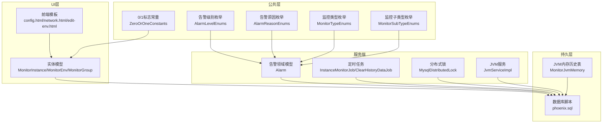
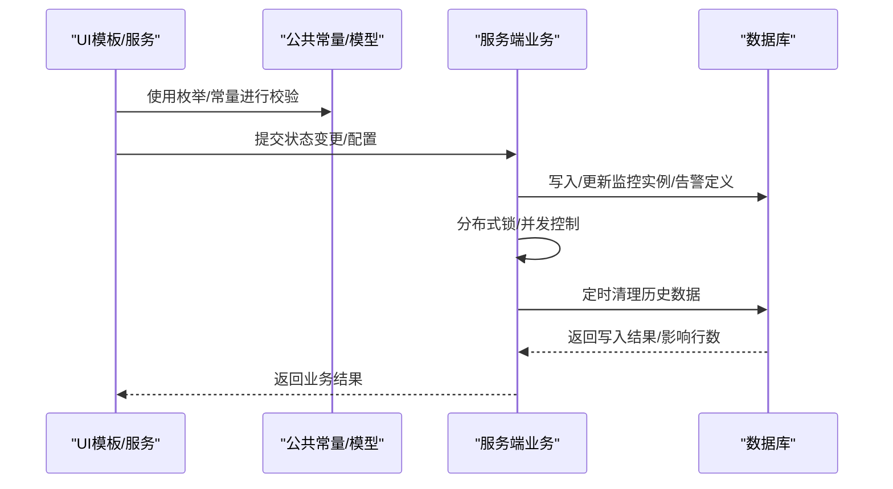
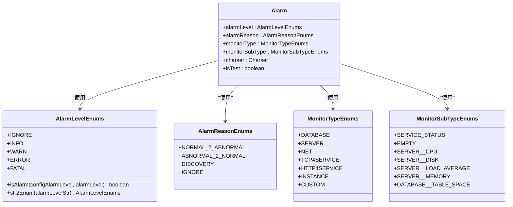
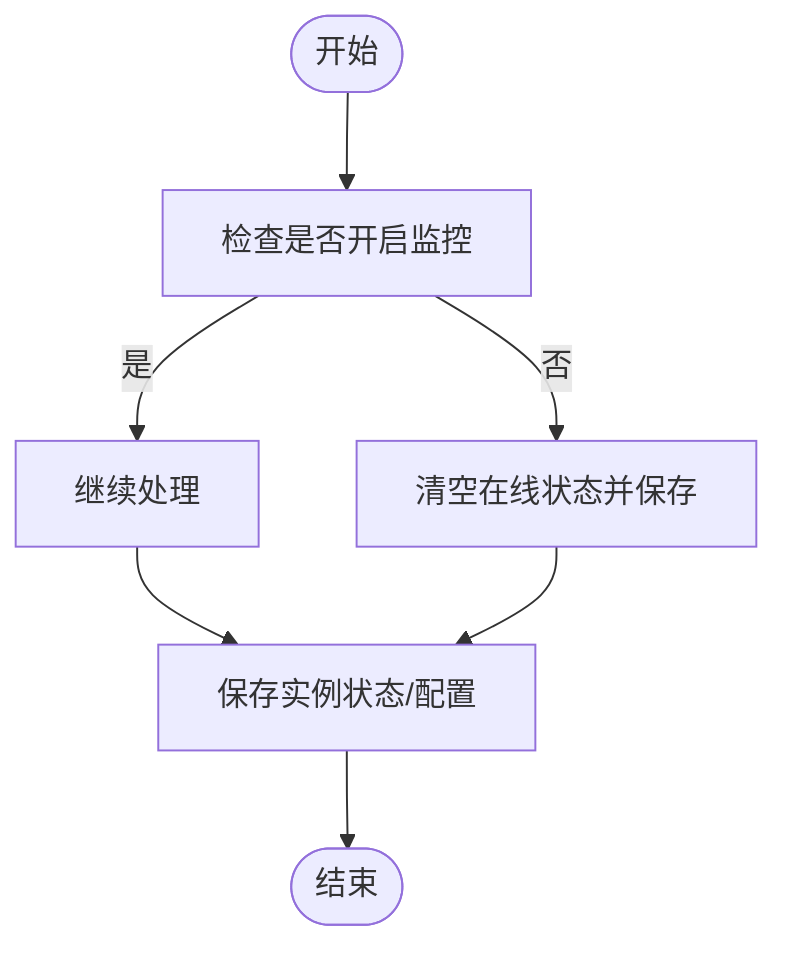
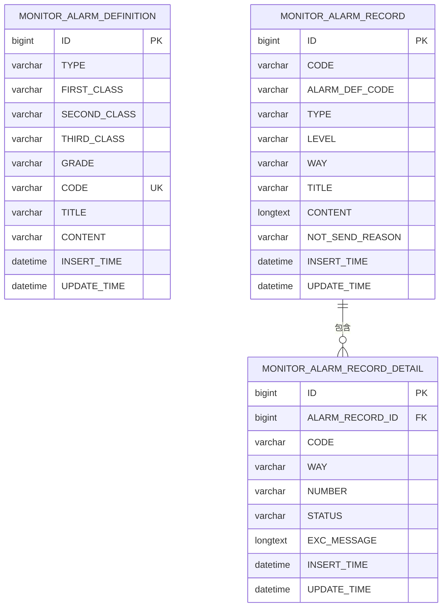
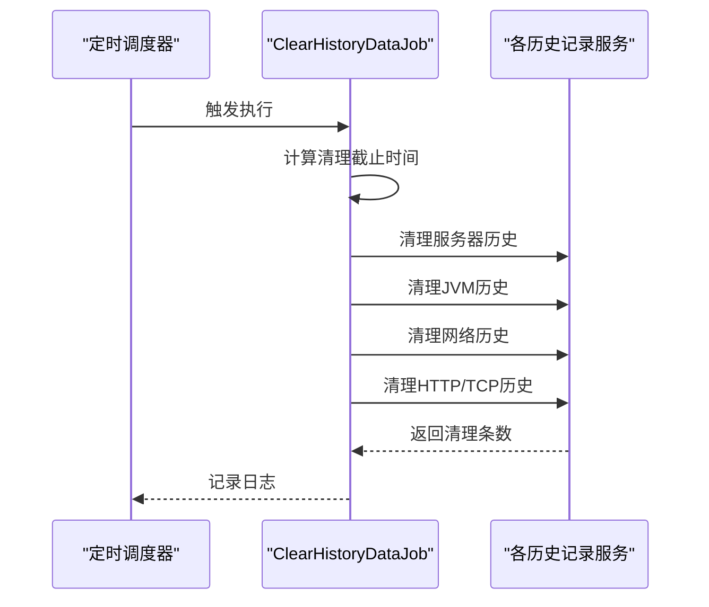
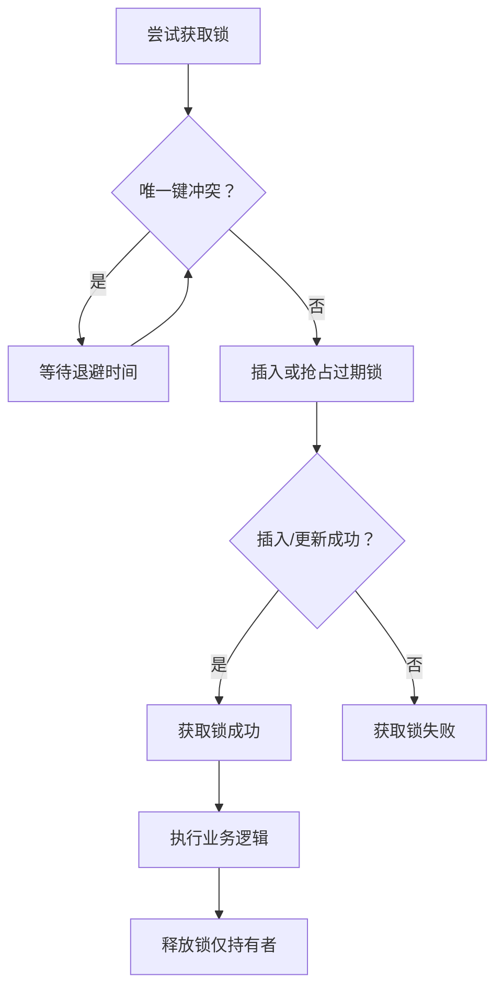
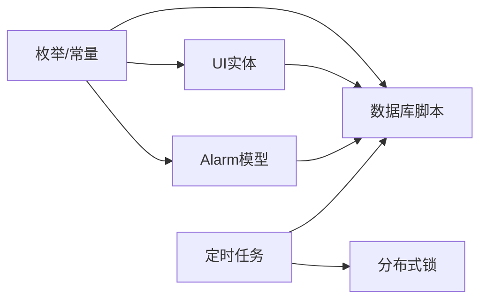

# 数据验证与业务规则

<cite>
**本文引用的文件**   
- [AlarmLevelEnums.java](file://phoenix-common/phoenix-common-core/src/main/java/com/gitee/pifeng/monitoring/common/constant/alarm/AlarmLevelEnums.java)
- [AlarmReasonEnums.java](file://phoenix-common/phoenix-common-core/src/main/java/com/gitee/pifeng/monitoring/common/constant/alarm/AlarmReasonEnums.java)
- [MonitorTypeEnums.java](file://phoenix-common/phoenix-common-core/src/main/java/com/gitee/pifeng/monitoring/common/constant/monitortype/MonitorTypeEnums.java)
- [MonitorSubTypeEnums.java](file://phoenix-common/phoenix-common-core/src/main/java/com/gitee/pifeng/monitoring/common/constant/monitortype/MonitorSubTypeEnums.java)
- [Alarm.java](file://phoenix-common/phoenix-common-core/src/main/java/com/gitee/pifeng/monitoring/common/domain/Alarm.java)
- [ZeroOrOneConstants.java](file://phoenix-common/phoenix-common-core/src/main/java/com/gitee/pifeng/monitoring/common/constant/ZeroOrOneConstants.java)
- [MonitorInstance.java](file://phoenix-ui/src/main/java/com/gitee/pifeng/monitoring/ui/business/web/entity/MonitorInstance.java)
- [MonitorEnv.java](file://phoenix-ui/src/main/java/com/gitee/pifeng/monitoring/ui/business/web/entity/MonitorEnv.java)
- [MonitorGroup.java](file://phoenix-ui/src/main/java/com/gitee/pifeng/monitoring/ui/business/web/entity/MonitorGroup.java)
- [MonitorAlarmDefinition.java](file://phoenix-ui/src/main/java/com/gitee/pifeng/monitoring/ui/business/web/entity/MonitorAlarmDefinition.java)
- [MonitorAlarmRecord.java](file://phoenix-ui/src/main/java/com/gitee/pifeng/monitoring/ui/business/web/entity/MonitorAlarmRecord.java)
- [phoenix.sql](file://doc/数据库设计/sql/mysql/phoenix.sql)
- [MysqlDistributedLock.java](file://phoenix-server/src/main/java/com/gitee/pifeng/monitoring/server/business/server/core/MysqlDistributedLock.java)
- [InstanceMonitorJob.java](file://phoenix-server/src/main/java/com/gitee/pifeng/monitoring/server/business/server/monitor/instance/InstanceMonitorJob.java)
- [JvmServiceImpl.java](file://phoenix-server/src/main/java/com/gitee/pifeng/monitoring/server/business/server/service/impl/JvmServiceImpl.java)
- [ClearHistoryDataJob.java](file://phoenix-server/src/main/java/com/gitee/pifeng/monitoring/server/business/server/monitor/ClearHistoryDataJob.java)
- [VerificationCodeException.java](file://phoenix-ui/src/main/java/com/gitee/pifeng/monitoring/ui/exception/VerificationCodeException.java)
- [BadListenerConfigException.java](file://phoenix-common/phoenix-common-core/src/main/java/com/gitee/pifeng/monitoring/common/exception/BadListenerConfigException.java)
- [DbException.java](file://phoenix-common/phoenix-common-core/src/main/java/com/gitee/pifeng/monitoring/common/exception/DbException.java)
- [MonitorInstanceServiceImpl.java](file://phoenix-ui/src/main/java/com/gitee/pifeng/monitoring/ui/business/web/service/impl/MonitorInstanceServiceImpl.java)
- [config.html](file://phoenix-ui/src/main/resources/templates/set/config.html)
- [network.html](file://phoenix-ui/src/main/resources/templates/network/network.html)
- [edit-env.html](file://phoenix-ui/src/main/resources/templates/set/edit-env.html)
- [MonitorJvmMemory.java](file://phoenix-server/src/main/java/com/gitee/pifeng/monitoring/server/business/server/entity/MonitorJvmMemory.java)
</cite>

## 目录
1. [简介](#简介)
2. [项目结构](#项目结构)
3. [核心组件](#核心组件)
4. [架构总览](#架构总览)
5. [详细组件分析](#详细组件分析)
6. [依赖分析](#依赖分析)
7. [性能考虑](#性能考虑)
8. [故障排查指南](#故障排查指南)
9. [结论](#结论)
10. [附录](#附录)

## 简介
本文件面向Phoenix监控系统的数据验证与业务规则，聚焦以下目标：
- 数据完整性约束设计：NOT NULL、数据类型、长度、范围等
- 业务规则实现：告警级别与原因的枚举校验、监控状态与环境/分组有效性、实例状态转换规则
- 业务场景示例：监控实例状态转换、告警发送条件、历史数据清理策略
- 一致性保障：分布式锁、并发控制、数据同步
- 数据质量与异常处理策略

## 项目结构
Phoenix由“客户端插件”“服务端采集与存储”“UI管理与展示”三层组成，数据验证与业务规则主要分布在公共常量、实体模型、数据库表结构、服务与调度任务中。

图表来源
- [AlarmLevelEnums.java:13-38](file://phoenix-common/phoenix-common-core/src/main/java/com/gitee/pifeng/monitoring/common/constant/alarm/AlarmLevelEnums.java#L13-L38)
- [AlarmReasonEnums.java:11-33](file://phoenix-common/phoenix-common-core/src/main/java/com/gitee/pifeng/monitoring/common/constant/alarm/AlarmReasonEnums.java#L11-L33)
- [MonitorTypeEnums.java:11-48](file://phoenix-common/phoenix-common-core/src/main/java/com/gitee/pifeng/monitoring/common/constant/monitortype/MonitorTypeEnums.java#L11-L48)
- [MonitorSubTypeEnums.java:11-52](file://phoenix-common/phoenix-common-core/src/main/java/com/gitee/pifeng/monitoring/common/constant/monitortype/MonitorSubTypeEnums.java#L11-L52)
- [Alarm.java:21-83](file://phoenix-common/phoenix-common-core/src/main/java/com/gitee/pifeng/monitoring/common/domain/Alarm.java#L21-L83)
- [ZeroOrOneConstants.java:11-38](file://phoenix-common/phoenix-common-core/src/main/java/com/gitee/pifeng/monitoring/common/constant/ZeroOrOneConstants.java#L11-L38)
- [MonitorInstance.java:23-111](file://phoenix-ui/src/main/java/com/gitee/pifeng/monitoring/ui/business/web/entity/MonitorInstance.java#L23-L111)
- [MonitorEnv.java:26-48](file://phoenix-ui/src/main/java/com/gitee/pifeng/monitoring/ui/business/web/entity/MonitorEnv.java#L26-L48)
- [MonitorGroup.java:26-70](file://phoenix-ui/src/main/java/com/gitee/pifeng/monitoring/ui/business/web/entity/MonitorGroup.java#L26-L70)
- [phoenix.sql:16-200](file://doc/数据库设计/sql/mysql/phoenix.sql#L16-L200)
- [InstanceMonitorJob.java:128-150](file://phoenix-server/src/main/java/com/gitee/pifeng/monitoring/server/business/server/monitor/instance/InstanceMonitorJob.java#L128-L150)
- [ClearHistoryDataJob.java:68-78](file://phoenix-server/src/main/java/com/gitee/pifeng/monitoring/server/business/server/monitor/ClearHistoryDataJob.java#L68-L78)
- [MysqlDistributedLock.java:94-247](file://phoenix-server/src/main/java/com/gitee/pifeng/monitoring/server/business/server/core/MysqlDistributedLock.java#L94-L247)
- [JvmServiceImpl.java:127-155](file://phoenix-server/src/main/java/com/gitee/pifeng/monitoring/server/business/server/service/impl/JvmServiceImpl.java#L127-L155)
- [MonitorJvmMemory.java:58-83](file://phoenix-server/src/main/java/com/gitee/pifeng/monitoring/server/business/server/entity/MonitorJvmMemory.java#L58-L83)

章节来源
- [phoenix.sql:16-200](file://doc/数据库设计/sql/mysql/phoenix.sql#L16-L200)
- [AlarmLevelEnums.java:13-115](file://phoenix-common/phoenix-common-core/src/main/java/com/gitee/pifeng/monitoring/common/constant/alarm/AlarmLevelEnums.java#L13-L115)
- [AlarmReasonEnums.java:11-33](file://phoenix-common/phoenix-common-core/src/main/java/com/gitee/pifeng/monitoring/common/constant/alarm/AlarmReasonEnums.java#L11-L33)
- [MonitorTypeEnums.java:11-48](file://phoenix-common/phoenix-common-core/src/main/java/com/gitee/pifeng/monitoring/common/constant/monitortype/MonitorTypeEnums.java#L11-L48)
- [MonitorSubTypeEnums.java:11-52](file://phoenix-common/phoenix-common-core/src/main/java/com/gitee/pifeng/monitoring/common/constant/monitortype/MonitorSubTypeEnums.java#L11-L52)
- [Alarm.java:21-83](file://phoenix-common/phoenix-common-core/src/main/java/com/gitee/pifeng/monitoring/common/domain/Alarm.java#L21-L83)
- [ZeroOrOneConstants.java:11-38](file://phoenix-common/phoenix-common-core/src/main/java/com/gitee/pifeng/monitoring/common/constant/ZeroOrOneConstants.java#L11-L38)
- [MonitorInstance.java:23-111](file://phoenix-ui/src/main/java/com/gitee/pifeng/monitoring/ui/business/web/entity/MonitorInstance.java#L23-L111)
- [MonitorEnv.java:26-48](file://phoenix-ui/src/main/java/com/gitee/pifeng/monitoring/ui/business/web/entity/MonitorEnv.java#L26-L48)
- [MonitorGroup.java:26-70](file://phoenix-ui/src/main/java/com/gitee/pifeng/monitoring/ui/business/web/entity/MonitorGroup.java#L26-L70)
- [InstanceMonitorJob.java:128-150](file://phoenix-server/src/main/java/com/gitee/pifeng/monitoring/server/business/server/monitor/instance/InstanceMonitorJob.java#L128-L150)
- [ClearHistoryDataJob.java:68-78](file://phoenix-server/src/main/java/com/gitee/pifeng/monitoring/server/business/server/monitor/ClearHistoryDataJob.java#L68-L78)
- [MysqlDistributedLock.java:94-247](file://phoenix-server/src/main/java/com/gitee/pifeng/monitoring/server/business/server/core/MysqlDistributedLock.java#L94-L247)
- [JvmServiceImpl.java:127-155](file://phoenix-server/src/main/java/com/gitee/pifeng/monitoring/server/business/server/service/impl/JvmServiceImpl.java#L127-L155)
- [MonitorJvmMemory.java:58-83](file://phoenix-server/src/main/java/com/gitee/pifeng/monitoring/server/business/server/entity/MonitorJvmMemory.java#L58-L83)

## 核心组件
- 告警级别与原因：通过枚举限定取值域，提供字符串到枚举的转换与告警阈值判定逻辑，确保告警发送策略一致。
- 监控类型与子类型：统一监控维度分类，避免类型歧义导致的统计与展示错误。
- 实体与表结构：以MyBatis-Plus注解与数据库脚本共同约束字段类型、长度、非空与索引，保证数据层一致性。
- 业务开关与标志位：使用0/1字符串常量表达布尔语义，配合UI模板与服务端逻辑，形成统一的状态与开关控制。

章节来源
- [AlarmLevelEnums.java:13-115](file://phoenix-common/phoenix-common-core/src/main/java/com/gitee/pifeng/monitoring/common/constant/alarm/AlarmLevelEnums.java#L13-L115)
- [AlarmReasonEnums.java:11-33](file://phoenix-common/phoenix-common-core/src/main/java/com/gitee/pifeng/monitoring/common/constant/alarm/AlarmReasonEnums.java#L11-L33)
- [MonitorTypeEnums.java:11-48](file://phoenix-common/phoenix-common-core/src/main/java/com/gitee/pifeng/monitoring/common/constant/monitortype/MonitorTypeEnums.java#L11-L48)
- [MonitorSubTypeEnums.java:11-52](file://phoenix-common/phoenix-common-core/src/main/java/com/gitee/pifeng/monitoring/common/constant/monitortype/MonitorSubTypeEnums.java#L11-L52)
- [ZeroOrOneConstants.java:11-38](file://phoenix-common/phoenix-common-core/src/main/java/com/gitee/pifeng/monitoring/common/constant/ZeroOrOneConstants.java#L11-L38)
- [MonitorInstance.java:23-111](file://phoenix-ui/src/main/java/com/gitee/pifeng/monitoring/ui/business/web/entity/MonitorInstance.java#L23-L111)
- [phoenix.sql:16-200](file://doc/数据库设计/sql/mysql/phoenix.sql#L16-L200)

## 架构总览
数据验证与业务规则在多层协同：
- UI层负责输入校验与状态开关展示（模板与服务端联动）
- 公共层提供统一的枚举与常量，作为跨模块契约
- 服务端负责业务规则执行、分布式一致性与数据清理
- 数据库层通过DDL约束与索引保障数据完整性与查询效率

图表来源
- [config.html:371-386](file://phoenix-ui/src/main/resources/templates/set/config.html#L371-L386)
- [AlarmLevelEnums.java:51-81](file://phoenix-common/phoenix-common-core/src/main/java/com/gitee/pifeng/monitoring/common/constant/alarm/AlarmLevelEnums.java#L51-L81)
- [MysqlDistributedLock.java:206-225](file://phoenix-server/src/main/java/com/gitee/pifeng/monitoring/server/business/server/core/MysqlDistributedLock.java#L206-L225)
- [ClearHistoryDataJob.java:68-78](file://phoenix-server/src/main/java/com/gitee/pifeng/monitoring/server/business/server/monitor/ClearHistoryDataJob.java#L68-L78)

## 详细组件分析

### 告警级别与原因的验证与发送策略
- 告警级别枚举限定取值，并提供“是否达到告警阈值”的判定方法，避免跨模块对齐偏差。
- 告警原因枚举用于区分状态变化与发现/忽略等场景，便于审计与统计。
- 告警领域模型中，级别、原因、监控类型与子类型均有默认值与可选字符集，确保消息体完整且可控。

图表来源
- [AlarmLevelEnums.java:13-115](file://phoenix-common/phoenix-common-core/src/main/java/com/gitee/pifeng/monitoring/common/constant/alarm/AlarmLevelEnums.java#L13-L115)
- [AlarmReasonEnums.java:11-33](file://phoenix-common/phoenix-common-core/src/main/java/com/gitee/pifeng/monitoring/common/constant/alarm/AlarmReasonEnums.java#L11-L33)
- [MonitorTypeEnums.java:11-48](file://phoenix-common/phoenix-common-core/src/main/java/com/gitee/pifeng/monitoring/common/constant/monitortype/MonitorTypeEnums.java#L11-L48)
- [MonitorSubTypeEnums.java:11-52](file://phoenix-common/phoenix-common-core/src/main/java/com/gitee/pifeng/monitoring/common/constant/monitortype/MonitorSubTypeEnums.java#L11-L52)
- [Alarm.java:21-83](file://phoenix-common/phoenix-common-core/src/main/java/com/gitee/pifeng/monitoring/common/domain/Alarm.java#L21-L83)

章节来源
- [AlarmLevelEnums.java:51-115](file://phoenix-common/phoenix-common-core/src/main/java/com/gitee/pifeng/monitoring/common/constant/alarm/AlarmLevelEnums.java#L51-L115)
- [AlarmReasonEnums.java:11-33](file://phoenix-common/phoenix-common-core/src/main/java/com/gitee/pifeng/monitoring/common/constant/alarm/AlarmReasonEnums.java#L11-L33)
- [Alarm.java:21-83](file://phoenix-common/phoenix-common-core/src/main/java/com/gitee/pifeng/monitoring/common/domain/Alarm.java#L21-L83)

### 监控实例状态转换规则与环境/分组有效性
- 实例状态字段采用0/1字符串表示在线/离线，配合“是否开启监控”“是否开启告警”等标志位，形成清晰的状态机。
- UI模板提供开关项，服务端在设置“关闭监控”时将在线状态置空，避免脏数据。
- 环境与分组通过外键约束关联，前端下拉选择确保输入有效。

图表来源
- [MonitorInstanceServiceImpl.java:387-398](file://phoenix-ui/src/main/java/com/gitee/pifeng/monitoring/ui/business/web/service/impl/MonitorInstanceServiceImpl.java#L387-L398)
- [ZeroOrOneConstants.java:27-32](file://phoenix-common/phoenix-common-core/src/main/java/com/gitee/pifeng/monitoring/common/constant/ZeroOrOneConstants.java#L27-L32)
- [config.html:371-386](file://phoenix-ui/src/main/resources/templates/set/config.html#L371-L386)
- [network.html:48-71](file://phoenix-ui/src/main/resources/templates/network/network.html#L48-L71)
- [edit-env.html:26-47](file://phoenix-ui/src/main/resources/templates/set/edit-env.html#L26-L47)

章节来源
- [MonitorInstance.java:70-88](file://phoenix-ui/src/main/java/com/gitee/pifeng/monitoring/ui/business/web/entity/MonitorInstance.java#L70-L88)
- [MonitorInstanceServiceImpl.java:387-398](file://phoenix-ui/src/main/java/com/gitee/pifeng/monitoring/ui/business/web/service/impl/MonitorInstanceServiceImpl.java#L387-L398)
- [ZeroOrOneConstants.java:27-32](file://phoenix-common/phoenix-common-core/src/main/java/com/gitee/pifeng/monitoring/common/constant/ZeroOrOneConstants.java#L27-L32)
- [config.html:371-386](file://phoenix-ui/src/main/resources/templates/set/config.html#L371-L386)
- [network.html:48-71](file://phoenix-ui/src/main/resources/templates/network/network.html#L48-L71)
- [edit-env.html:26-47](file://phoenix-ui/src/main/resources/templates/set/edit-env.html#L26-L47)

### 告警定义与记录的数据约束与业务规则
- 告警定义表的类型、级别、编码、标题、内容均有限定与索引，确保唯一性与检索效率。
- 告警记录表包含告警级别、方式、标题、内容、发送状态等，支持按类型与级别快速过滤。
- 告警记录详情表与记录表存在外键约束，保证明细与汇总的一致性。

图表来源
- [phoenix.sql:16-91](file://doc/数据库设计/sql/mysql/phoenix.sql#L16-L91)
- [MonitorAlarmDefinition.java:26-43](file://phoenix-ui/src/main/java/com/gitee/pifeng/monitoring/ui/business/web/entity/MonitorAlarmDefinition.java#L26-L43)
- [MonitorAlarmRecord.java:26-45](file://phoenix-ui/src/main/java/com/gitee/pifeng/monitoring/ui/business/web/entity/MonitorAlarmRecord.java#L26-L45)

章节来源
- [phoenix.sql:16-91](file://doc/数据库设计/sql/mysql/phoenix.sql#L16-L91)
- [MonitorAlarmDefinition.java:26-43](file://phoenix-ui/src/main/java/com/gitee/pifeng/monitoring/ui/business/web/entity/MonitorAlarmDefinition.java#L26-L43)
- [MonitorAlarmRecord.java:26-45](file://phoenix-ui/src/main/java/com/gitee/pifeng/monitoring/ui/business/web/entity/MonitorAlarmRecord.java#L26-L45)

### 历史数据清理策略
- 定时任务扫描各历史表，清理一个月以前的数据，避免历史数据无限增长。
- JVM历史记录清理方法提供明确的清理边界与返回值，便于监控与审计。

图表来源
- [ClearHistoryDataJob.java:68-78](file://phoenix-server/src/main/java/com/gitee/pifeng/monitoring/server/business/server/monitor/ClearHistoryDataJob.java#L68-L78)
- [JvmServiceImpl.java:143-155](file://phoenix-server/src/main/java/com/gitee/pifeng/monitoring/server/business/server/service/impl/JvmServiceImpl.java#L143-L155)

章节来源
- [ClearHistoryDataJob.java:68-78](file://phoenix-server/src/main/java/com/gitee/pifeng/monitoring/server/business/server/monitor/ClearHistoryDataJob.java#L68-L78)
- [JvmServiceImpl.java:143-155](file://phoenix-server/src/main/java/com/gitee/pifeng/monitoring/server/business/server/service/impl/JvmServiceImpl.java#L143-L155)

### 并发控制与数据一致性
- 分布式锁基于MySQL唯一键抢占+过期时间，结合指数退避与抖动，避免热点竞争与DB压力。
- 仅持有者可释放锁，防止误删他人锁；同时提供独立连接避免与Spring事务耦合。
- 实例状态监控任务使用同步块与配置开关，确保同一时间仅一个线程处理实例列表。

图表来源
- [MysqlDistributedLock.java:94-225](file://phoenix-server/src/main/java/com/gitee/pifeng/monitoring/server/business/server/core/MysqlDistributedLock.java#L94-L225)
- [InstanceMonitorJob.java:128-150](file://phoenix-server/src/main/java/com/gitee/pifeng/monitoring/server/business/server/monitor/instance/InstanceMonitorJob.java#L128-L150)

章节来源
- [MysqlDistributedLock.java:94-247](file://phoenix-server/src/main/java/com/gitee/pifeng/monitoring/server/business/server/core/MysqlDistributedLock.java#L94-L247)
- [InstanceMonitorJob.java:128-150](file://phoenix-server/src/main/java/com/gitee/pifeng/monitoring/server/business/server/monitor/instance/InstanceMonitorJob.java#L128-L150)

### 数据完整性约束设计
- 表结构层面：
  - NOT NULL：类型、级别、编码、标题、内容、插入时间等关键字段均设为非空
  - 唯一键：告警编码、环境名、分组名等
  - 外键：数据库连接与环境/分组关联
  - 索引：按类型、级别、插入时间等建立索引，提升查询与清理效率
- 实体与注解层面：
  - MyBatis-Plus注解明确字段映射与序列化策略
  - 字段长度与类型在数据库脚本中严格定义

章节来源
- [phoenix.sql:16-200](file://doc/数据库设计/sql/mysql/phoenix.sql#L16-L200)
- [MonitorInstance.java:23-111](file://phoenix-ui/src/main/java/com/gitee/pifeng/monitoring/ui/business/web/entity/MonitorInstance.java#L23-L111)
- [MonitorEnv.java:26-48](file://phoenix-ui/src/main/java/com/gitee/pifeng/monitoring/ui/business/web/entity/MonitorEnv.java#L26-L48)
- [MonitorGroup.java:26-70](file://phoenix-ui/src/main/java/com/gitee/pifeng/monitoring/ui/business/web/entity/MonitorGroup.java#L26-L70)
- [MonitorJvmMemory.java:58-83](file://phoenix-server/src/main/java/com/gitee/pifeng/monitoring/server/business/server/entity/MonitorJvmMemory.java#L58-L83)

## 依赖分析
- 枚举与常量作为跨模块契约，被UI、服务端与数据库脚本共同遵循
- 实体与表结构一一对应，注解与DDL共同约束数据层
- 服务端任务依赖配置加载与分布式锁，确保一致性与稳定性

图表来源
- [AlarmLevelEnums.java:13-115](file://phoenix-common/phoenix-common-core/src/main/java/com/gitee/pifeng/monitoring/common/constant/alarm/AlarmLevelEnums.java#L13-L115)
- [Alarm.java:21-83](file://phoenix-common/phoenix-common-core/src/main/java/com/gitee/pifeng/monitoring/common/domain/Alarm.java#L21-L83)
- [MonitorInstance.java:23-111](file://phoenix-ui/src/main/java/com/gitee/pifeng/monitoring/ui/business/web/entity/MonitorInstance.java#L23-L111)
- [phoenix.sql:16-200](file://doc/数据库设计/sql/mysql/phoenix.sql#L16-L200)
- [MysqlDistributedLock.java:94-247](file://phoenix-server/src/main/java/com/gitee/pifeng/monitoring/server/business/server/core/MysqlDistributedLock.java#L94-L247)
- [ClearHistoryDataJob.java:68-78](file://phoenix-server/src/main/java/com/gitee/pifeng/monitoring/server/business/server/monitor/ClearHistoryDataJob.java#L68-L78)

## 性能考虑
- 分布式锁采用指数退避+抖动，降低热点竞争与DB压力
- 历史数据清理按月滚动清理，避免全表扫描
- 索引覆盖常用查询维度（类型、级别、时间），提升检索效率
- 并行处理JVM信息包时设置超时与中断处理，避免阻塞

## 故障排查指南
- 告警级别/原因不生效：检查枚举转换与阈值判定逻辑
- 实例状态异常：核对“是否开启监控”与“在线状态”联动逻辑
- 分布式锁频繁失败：关注退避参数与过期时间设置
- 历史数据清理无效：确认截止时间计算与服务返回值
- UI验证码异常：参考验证码异常枚举定位问题

章节来源
- [AlarmLevelEnums.java:93-115](file://phoenix-common/phoenix-common-core/src/main/java/com/gitee/pifeng/monitoring/common/constant/alarm/AlarmLevelEnums.java#L93-L115)
- [VerificationCodeException.java:33-63](file://phoenix-ui/src/main/java/com/gitee/pifeng/monitoring/ui/exception/VerificationCodeException.java#L33-L63)
- [MysqlDistributedLock.java:94-225](file://phoenix-server/src/main/java/com/gitee/pifeng/monitoring/server/business/server/core/MysqlDistributedLock.java#L94-L225)
- [JvmServiceImpl.java:127-155](file://phoenix-server/src/main/java/com/gitee/pifeng/monitoring/server/business/server/service/impl/JvmServiceImpl.java#L127-L155)

## 结论
Phoenix通过“公共枚举/常量 + 实体/表结构 + 服务端规则 + 定时任务 + 分布式锁”的组合，构建了完整的数据验证与业务规则体系。该体系在保证数据完整性的同时，提供了清晰的状态转换、可靠的告警发送与高效的历史数据管理能力。

## 附录
- 数据库脚本中关键字段的NOT NULL、唯一键与外键定义，确保数据层约束
- UI模板中的lay-verify与下拉选择，辅助前端输入校验
- 服务端异常类型（如数据库异常、监听器配置异常）用于统一错误处理

章节来源
- [phoenix.sql:16-200](file://doc/数据库设计/sql/mysql/phoenix.sql#L16-L200)
- [edit-env.html:26-47](file://phoenix-ui/src/main/resources/templates/set/edit-env.html#L26-L47)
- [DbException.java:11-26](file://phoenix-common/phoenix-common-core/src/main/java/com/gitee/pifeng/monitoring/common/exception/DbException.java#L11-L26)
- [BadListenerConfigException.java:11-25](file://phoenix-common/phoenix-common-core/src/main/java/com/gitee/pifeng/monitoring/common/exception/BadListenerConfigException.java#L11-L25)