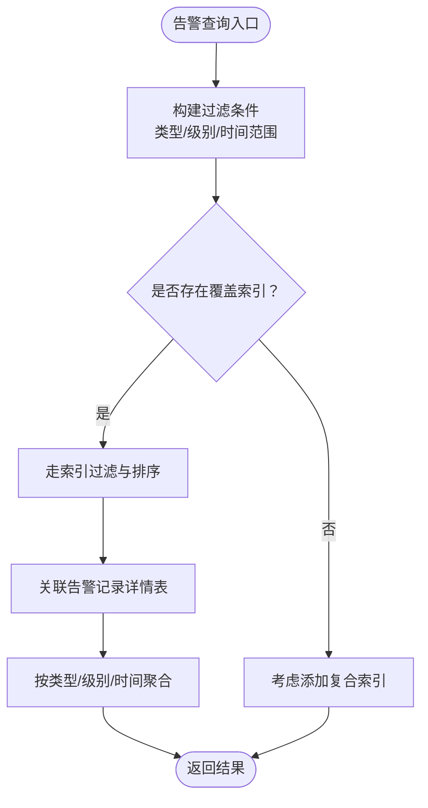
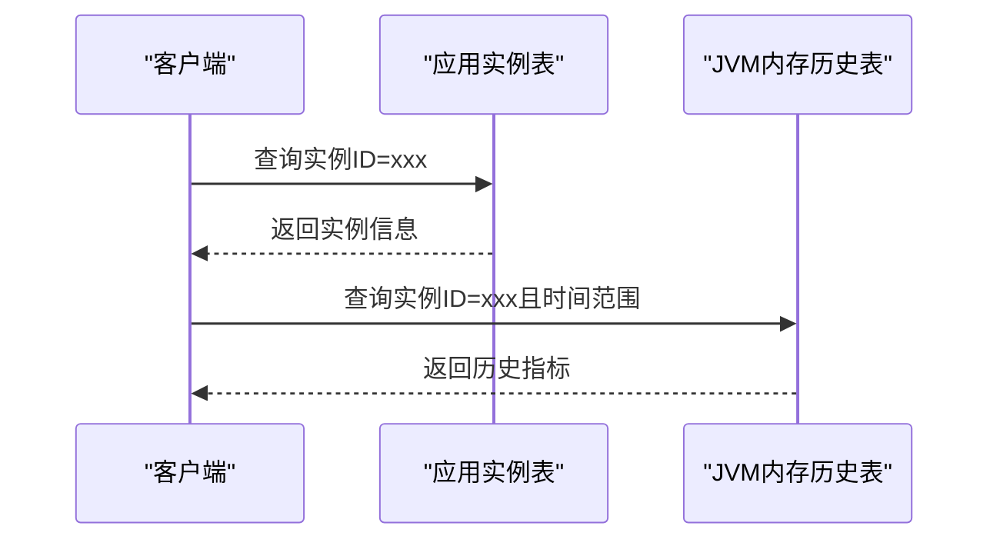
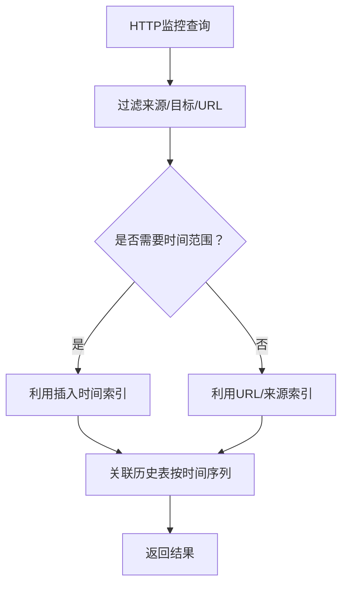
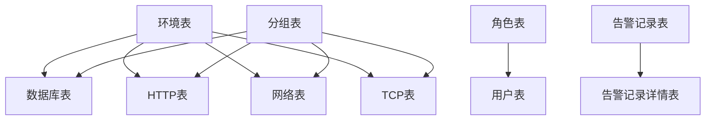

# 索引与约束设计

<cite>
**本文引用的文件**
- [phoenix.sql](file://doc/数据库设计/sql/mysql/phoenix.sql)
</cite>

## 目录
1. [简介](#简介)
2. [项目结构](#项目结构)
3. [核心组件](#核心组件)
4. [架构总览](#架构总览)
5. [详细组件分析](#详细组件分析)
6. [依赖分析](#依赖分析)
7. [性能考量](#性能考量)
8. [故障排查指南](#故障排查指南)
9. [结论](#结论)
10. [附录](#附录)

## 简介
本文件面向Phoenix监控系统的数据库层，聚焦“索引与约束设计”。通过对数据库脚本的系统化梳理，阐明各类索引（主键、唯一、复合、外键关联索引）的设计策略与适用场景，总结查询性能优化要点（WHERE过滤、JOIN优化、ORDER BY优化），并给出约束设计（NOT NULL、CHECK、DEFAULT）与维护策略、性能监控建议。目标是帮助开发者与DBA在实际业务中高效、安全地设计与维护Phoenix的数据库结构。

## 项目结构
Phoenix数据库脚本集中于MySQL建表语句，覆盖监控系统的主要实体表与关系表，包含：
- 告警相关：定义表、记录表、记录详情表
- 实例与服务器：应用实例、服务器及其CPU/内存/磁盘/GPU/网卡/进程/传感器等维度
- 网络与TCP/HTTP监控：网络连通性、TCP连通性、HTTP可用性
- 配置与环境/分组：配置表、环境表、分组表
- 用户与角色：用户表、角色表
- 定时任务与会话：Quartz调度表、Spring Session表
- 分布式锁：分布式锁表

该结构体现了监控系统对“多源数据采集、历史归档、实时告警”的典型需求，索引与约束围绕这些需求进行设计。

## 核心组件
本节从索引与约束两个维度，逐表解析关键设计点与优化策略。

- 主键索引
  - 所有表均设置自增主键，确保每条记录唯一标识，支撑后续外键与历史归档。
  - 示例：应用实例表、服务器表、HTTP/网络/TCP监控表、JVM/服务器各子表等均采用主键索引。

- 唯一索引
  - 用于保障业务唯一性，避免重复或冲突。
  - 示例：
    - 应用实例表：按实例ID建立唯一索引，确保实例唯一。
    - 服务器表：按IP建立唯一索引，避免重复IP。
    - JVM类加载、GC、内存、线程等表：按实例ID唯一，或按实例ID+类型/名称组合唯一，确保同一实例下指标不重复。
    - 服务器维度表：如CPU、磁盘、GPU、网卡、进程等，多采用IP+序号组合唯一，保证同一主机下各部件唯一。
    - 用户表：账号唯一。
    - 环境/分组表：环境名、分组名唯一。
    - Quartz调度表：复合主键，配合外键索引提升调度查询效率。

- 复合索引
  - 针对常见查询模式（多列过滤、范围查询、排序）构建复合索引，显著降低全表扫描成本。
  - 示例：
    - 实时监控表：按类型+编码建立唯一索引；同时建立类型+子类型+被告警主体ID、类型+被告警主体ID等复合索引，满足多维过滤与去重。
    - 告警记录表：按插入时间、更新时间、类型、级别建立索引，支撑告警查询、统计与排序。
    - 异常日志/操作日志：按插入时间、实例ID、是否告警等建立索引，便于快速检索与聚合。
    - HTTP/网络/TCP历史表：按主表ID、插入时间、URL/IP/端口等建立索引，支撑历史回溯与趋势分析。
    - 服务器维度历史表：按IP、插入时间、更新时间等建立索引，支撑按时间窗口的聚合分析。

- 外键与关联索引
  - 多表通过外键建立强一致性约束，同时在外键列建立普通索引，提升JOIN效率与外键校验性能。
  - 示例：
    - 数据库表、HTTP/网络/TCP监控表分别关联环境/分组表，外键列均建立索引。
    - 告警记录详情表关联告警记录主表，外键列建立索引并设置限制删除策略，保证数据一致性。
    - 用户表关联角色表，外键列建立索引。
    - Quartz调度表之间存在级联外键，配合索引提升触发器查询效率。
    - Spring Session属性表与会话表建立级联删除，属性表主键为复合主键并带外键约束。

- 查询性能优化要点
  - WHERE条件过滤
    - 将等值过滤字段置于复合索引前部，优先命中选择性高的列。
    - 对范围查询（时间戳）尽量放在索引末尾，避免阻断前导等值匹配。
  - JOIN优化
    - 关联字段必须建立索引；优先使用小表驱动大表，减少嵌套循环。
    - 复合索引可直接覆盖JOIN条件，避免额外回表。
  - ORDER BY优化
    - 排序字段与过滤字段尽量落在同一索引中，避免额外排序开销。
    - 时间序列类查询（历史表）优先按插入时间升序/降序，利用索引顺序减少排序。

- 约束设计
  - NOT NULL：对关键业务字段（如实例ID、IP、类型、编码、标题、内容、插入时间等）设置非空约束，确保数据完整性。
  - CHECK约束：MySQL建表语法不支持CHECK，可通过触发器或应用层约束替代；Phoenix脚本中未见CHECK定义。
  - DEFAULT值：对可选字段（如状态、描述、分组、是否启用监控/告警等）设置合理默认值，降低插入复杂度。
  - 外键约束：通过外键保证参照完整性，结合索引提升约束检查与JOIN效率。

**章节来源**
- [phoenix.sql:1-1478](file://doc/数据库设计/sql/mysql/phoenix.sql#L1-L1478)

## 架构总览
下图展示Phoenix数据库层的核心表与索引/约束关系，突出主键、唯一、复合与外键索引的分布与作用。

```mermaid
erDiagram
MONITOR_ALARM_DEFINITION {
bigint ID PK
varchar CODE
datetime INSERT_TIME
datetime UPDATE_TIME
}
MONITOR_ALARM_RECORD {
bigint ID PK
varchar CODE
datetime INSERT_TIME
datetime UPDATE_TIME
varchar TYPE
varchar LEVEL
}
MONITOR_ALARM_RECORD_DETAIL {
bigint ID PK
bigint ALARM_RECORD_ID FK
varchar WAY
varchar STATUS
datetime INSERT_TIME
}
MONITOR_INSTANCE {
bigint ID PK
varchar INSTANCE_ID UK
varchar IP
varchar MONITOR_ENV
varchar MONITOR_GROUP
}
MONITOR_SERVER {
bigint ID PK
varchar IP UK
varchar MONITOR_ENV
varchar MONITOR_GROUP
}
MONITOR_HTTP {
bigint ID PK
varchar HOSTNAME_SOURCE
varchar URL_TARGET
varchar MONITOR_ENV
varchar MONITOR_GROUP
}
MONITOR_HTTP_HISTORY {
bigint ID PK
bigint HTTP_ID
varchar HOSTNAME_SOURCE
varchar URL_TARGET
datetime INSERT_TIME
}
MONITOR_NET {
bigint ID PK
varchar IP_SOURCE
varchar IP_TARGET
varchar MONITOR_ENV
varchar MONITOR_GROUP
}
MONITOR_NET_HISTORY {
bigint ID PK
bigint NET_ID
varchar IP_SOURCE
varchar IP_TARGET
datetime INSERT_TIME
}
MONITOR_TCP {
bigint ID PK
varchar HOSTNAME_SOURCE
varchar HOSTNAME_TARGET
int PORT_TARGET
varchar MONITOR_ENV
varchar MONITOR_GROUP
}
MONITOR_TCP_HISTORY {
bigint ID PK
bigint TCP_ID
datetime INSERT_TIME
varchar HOSTNAME_SOURCE
varchar HOSTNAME_TARGET
int PORT_TARGET
}
MONITOR_JVM_CLASS_LOADING {
bigint ID PK
varchar INSTANCE_ID UK
}
MONITOR_JVM_GARBAGE_COLLECTOR {
bigint ID PK
varchar INSTANCE_ID
varchar GARBAGE_COLLECTOR_NAME
}
MONITOR_JVM_MEMORY {
bigint ID PK
varchar INSTANCE_ID
varchar MEMORY_TYPE
}
MONITOR_JVM_MEMORY_HISTORY {
bigint ID PK
varchar INSTANCE_ID
varchar MEMORY_TYPE
datetime INSERT_TIME
}
MONITOR_JVM_RUNTIME {
bigint ID PK
varchar INSTANCE_ID UK
}
MONITOR_JVM_THREAD {
bigint ID PK
varchar INSTANCE_ID UK
}
MONITOR_ENV {
bigint ID PK
varchar ENV_NAME UK
}
MONITOR_GROUP {
bigint ID PK
varchar GROUP_TYPE
varchar GROUP_NAME UK
}
MONITOR_USER {
bigint ID PK
bigint ROLE_ID FK
varchar ACCOUNT UK
}
MONITOR_ROLE {
bigint ID PK
}
MONITOR_REALTIME_MONITORING {
bigint ID PK
varchar TYPE
varchar CODE
varchar ALERTED_ENTITY_ID
}
MONITOR_ALARM_RECORD_DETAIL }o--|| MONITOR_ALARM_RECORD : "外键"
MONITOR_DB }o--o{ MONITOR_ENV : "外键"
MONITOR_DB }o--o{ MONITOR_GROUP : "外键"
MONITOR_HTTP }o--o{ MONITOR_ENV : "外键"
MONITOR_HTTP }o--o{ MONITOR_GROUP : "外键"
MONITOR_NET }o--o{ MONITOR_ENV : "外键"
MONITOR_NET }o--o{ MONITOR_GROUP : "外键"
MONITOR_TCP }o--o{ MONITOR_ENV : "外键"
MONITOR_TCP }o--o{ MONITOR_GROUP : "外键"
MONITOR_USER }o--|| MONITOR_ROLE : "外键"
```

**图表来源**
- [phoenix.sql:18-304](file://doc/数据库设计/sql/mysql/phoenix.sql#L18-L304)
- [phoenix.sql:306-449](file://doc/数据库设计/sql/mysql/phoenix.sql#L306-L449)
- [phoenix.sql:451-604](file://doc/数据库设计/sql/mysql/phoenix.sql#L451-L604)
- [phoenix.sql:606-1176](file://doc/数据库设计/sql/mysql/phoenix.sql#L606-L1176)

## 详细组件分析

### 告警定义与记录表
- 设计要点
  - 告警定义表：主键+唯一索引（告警编码），支撑按编码快速定位定义。
  - 告警记录表：主键+多维索引（插入时间、更新时间、类型、级别），支撑告警查询、统计与排序。
  - 告警记录详情表：唯一复合索引（记录ID+告警方式）+外键索引，确保同种方式仅一条发送记录，同时支持按记录ID快速关联。
- 查询优化
  - 按类型/级别过滤：利用类型、级别索引快速筛选。
  - 按时间窗口查询：利用插入/更新时间索引，避免额外排序。
  - 去重与聚合：通过唯一索引避免重复发送，减少聚合成本。

**图表来源**
- [phoenix.sql:39-65](file://doc/数据库设计/sql/mysql/phoenix.sql#L39-L65)
- [phoenix.sql:67-91](file://doc/数据库设计/sql/mysql/phoenix.sql#L67-L91)

**章节来源**
- [phoenix.sql:39-91](file://doc/数据库设计/sql/mysql/phoenix.sql#L39-L91)

### 应用实例与服务器表
- 设计要点
  - 实例表：实例ID唯一索引，确保实例唯一；同时按环境/分组建立索引，支撑按环境/分组筛选。
  - 服务器表：IP唯一索引，避免重复IP；按环境/分组建立索引。
  - JVM与服务器子表：多采用实例ID唯一或组合唯一，确保同一实例下指标不重复；历史表按实例ID与时间建立索引，支撑时间序列分析。
- 查询优化
  - 按实例ID查询：利用唯一索引快速定位。
  - 按环境/分组筛选：利用环境/分组索引快速过滤。
  - 时间序列查询：历史表按时间索引，避免额外排序。

**图表来源**
- [phoenix.sql:270-304](file://doc/数据库设计/sql/mysql/phoenix.sql#L270-L304)
- [phoenix.sql:350-395](file://doc/数据库设计/sql/mysql/phoenix.sql#L350-L395)

**章节来源**
- [phoenix.sql:270-304](file://doc/数据库设计/sql/mysql/phoenix.sql#L270-L304)
- [phoenix.sql:350-395](file://doc/数据库设计/sql/mysql/phoenix.sql#L350-L395)

### HTTP/网络/TCP监控表
- 设计要点
  - 主表：按来源/目标、URL/IP/端口、环境/分组建立索引，支撑连通性查询与分组管理。
  - 历史表：按主表ID、时间建立索引，支撑历史回溯与趋势分析。
- 查询优化
  - 多维过滤：来源/目标、URL/IP/端口、时间范围组合查询，利用复合索引提升效率。
  - 历史对比：按主表ID关联历史表，避免跨表全表扫描。

**图表来源**
- [phoenix.sql:200-235](file://doc/数据库设计/sql/mysql/phoenix.sql#L200-L235)
- [phoenix.sql:237-268](file://doc/数据库设计/sql/mysql/phoenix.sql#L237-L268)

**章节来源**
- [phoenix.sql:200-268](file://doc/数据库设计/sql/mysql/phoenix.sql#L200-L268)

### 实时监控表
- 设计要点
  - 唯一复合索引（类型+编码），确保同一类型下的编码唯一。
  - 复合索引（类型+子类型+被告警主体ID）、（类型+被告警主体ID），支撑多维过滤与去重。
- 查询优化
  - 唯一性保障：通过唯一索引避免重复告警记录。
  - 多维过滤：利用复合索引快速定位特定实体的告警状态。

**章节来源**
- [phoenix.sql:583-604](file://doc/数据库设计/sql/mysql/phoenix.sql#L583-L604)

### 用户与角色、环境与分组
- 设计要点
  - 角色表：主键。
  - 用户表：主键+角色外键+账号唯一索引，确保登录唯一性。
  - 环境/分组表：主键+名称唯一索引，支撑多表外键引用。
- 查询优化
  - 登录与权限：账号唯一索引快速定位用户。
  - 分组/环境筛选：名称唯一索引支撑快速过滤。

**章节来源**
- [phoenix.sql:606-620](file://doc/数据库设计/sql/mysql/phoenix.sql#L606-L620)
- [phoenix.sql:1154-1176](file://doc/数据库设计/sql/mysql/phoenix.sql#L1154-L1176)
- [phoenix.sql:157-197](file://doc/数据库设计/sql/mysql/phoenix.sql#L157-L197)

### Quartz调度与Spring Session
- 设计要点
  - Quartz表：复合主键与外键索引，配合触发器状态、时间等索引，支撑调度查询与状态管理。
  - Spring Session表：会话ID唯一索引、过期时间索引、用户索引，支撑会话管理与清理。
- 查询优化
  - 调度查询：利用索引快速定位待执行任务。
  - 会话清理：利用过期时间索引定期清理失效会话。

**章节来源**
- [phoenix.sql:1178-1452](file://doc/数据库设计/sql/mysql/phoenix.sql#L1178-L1452)

## 依赖分析
- 外键关系
  - 数据库、HTTP、网络、TCP监控表均引用环境/分组表，外键列建立索引，保证参照完整性与查询效率。
  - 告警记录详情表引用告警记录表，外键列建立索引并限制删除策略。
  - 用户表引用角色表，外键列建立索引。
- 索引耦合
  - 复合索引与WHERE/JOIN/ORDER BY高度耦合，需根据查询模式动态评估与调整。
- 循环依赖
  - 未发现循环外键依赖，整体呈树状引用关系，维护相对简单。

**图表来源**
- [phoenix.sql:110-139](file://doc/数据库设计/sql/mysql/phoenix.sql#L110-L139)
- [phoenix.sql:200-235](file://doc/数据库设计/sql/mysql/phoenix.sql#L200-L235)
- [phoenix.sql:525-554](file://doc/数据库设计/sql/mysql/phoenix.sql#L525-L554)
- [phoenix.sql:1094-1124](file://doc/数据库设计/sql/mysql/phoenix.sql#L1094-L1124)
- [phoenix.sql:1154-1176](file://doc/数据库设计/sql/mysql/phoenix.sql#L1154-L1176)
- [phoenix.sql:67-91](file://doc/数据库设计/sql/mysql/phoenix.sql#L67-L91)

**章节来源**
- [phoenix.sql:110-139](file://doc/数据库设计/sql/mysql/phoenix.sql#L110-L139)
- [phoenix.sql:200-235](file://doc/数据库设计/sql/mysql/phoenix.sql#L200-L235)
- [phoenix.sql:525-554](file://doc/数据库设计/sql/mysql/phoenix.sql#L525-L554)
- [phoenix.sql:1094-1124](file://doc/数据库设计/sql/mysql/phoenix.sql#L1094-L1124)
- [phoenix.sql:1154-1176](file://doc/数据库设计/sql/mysql/phoenix.sql#L1154-L1176)
- [phoenix.sql:67-91](file://doc/数据库设计/sql/mysql/phoenix.sql#L67-L91)

## 性能考量
- 索引选择性
  - 高选择性列（如实例ID、IP、账号）优先作为索引前导列，提升过滤效率。
- 复合索引设计
  - 以WHERE/JOIN/ORDER BY三要素为依据，优先覆盖最常用查询模式。
  - 时间列尽量放在复合索引末尾，避免阻断前导等值匹配。
- 统计信息与执行计划
  - 定期更新表统计信息，结合执行计划分析索引使用情况，及时调整索引策略。
- 写入与读取权衡
  - 频繁写入的表应控制索引数量，避免写放大；对热点查询表适当增加索引。
- 历史表分区
  - 历史表按时间维度可考虑分区（若数据库支持），进一步提升时间范围查询性能。

## 故障排查指南
- 唯一约束冲突
  - 实例ID、账号、环境名、分组名等唯一索引冲突时，检查业务是否重复插入或并发写入未加锁。
- 外键约束失败
  - 插入/更新引用表时，确认被引用键是否存在且索引有效；检查删除策略是否限制删除。
- 查询慢
  - 使用EXPLAIN分析执行计划，确认是否命中预期索引；对缺失的复合索引进行补充。
- 索引维护
  - 定期重建碎片索引，保持统计信息最新；对长期无用索引进行清理。

**章节来源**
- [phoenix.sql:132-135](file://doc/数据库设计/sql/mysql/phoenix.sql#L132-L135)
- [phoenix.sql:296](file://doc/数据库设计/sql/mysql/phoenix.sql#L296)
- [phoenix.sql:642](file://doc/数据库设计/sql/mysql/phoenix.sql#L642)
- [phoenix.sql:1171](file://doc/数据库设计/sql/mysql/phoenix.sql#L1171)

## 结论
Phoenix数据库层的索引与约束设计围绕“唯一性保障、多维查询优化、外键一致性”展开。通过主键、唯一、复合与外键索引的协同，系统在高并发监控场景下实现了高效的数据检索与稳定的业务一致性。建议在实际运维中持续关注查询模式变化，动态调整索引策略，并完善索引维护与性能监控流程，以保障系统长期稳定与高性能。

## 附录
- 常用索引设计清单（示例）
  - 实时监控：类型+编码（唯一）、类型+子类型+被告警主体ID、类型+被告警主体ID
  - 告警记录：插入时间、更新时间、类型、级别
  - 历史表：主表ID+时间、实例ID+时间、IP+时间
  - 实例/服务器：实例ID（唯一）、IP（唯一）
  - 用户/角色：账号（唯一）、角色ID
  - 环境/分组：环境名（唯一）、分组名（唯一）