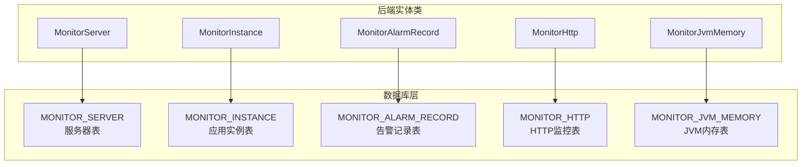
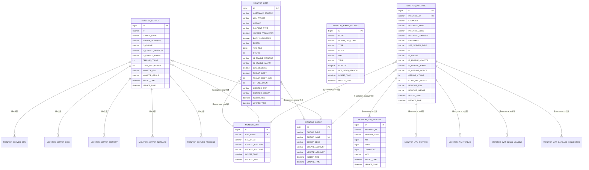
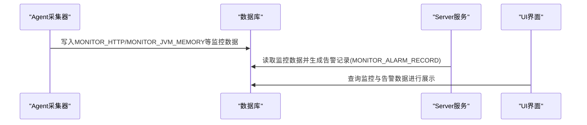

# 表结构设计

<cite>
**本文引用的文件**
- [phoenix.sql](file://doc/数据库设计/sql/mysql/phoenix.sql)
- [MonitorServer.java](file://phoenix-server/src/main/java/com/gitee/pifeng/monitoring/server/business/server/entity/MonitorServer.java)
- [MonitorInstance.java](file://phoenix-server/src/main/java/com/gitee/pifeng/monitoring/server/business/server/entity/MonitorInstance.java)
- [MonitorAlarmRecord.java](file://phoenix-server/src/main/java/com/gitee/pifeng/monitoring/server/business/server/entity/MonitorAlarmRecord.java)
- [MonitorHttp.java](file://phoenix-server/src/main/java/com/gitee/pifeng/monitoring/server/business/server/entity/MonitorHttp.java)
- [MonitorJvmMemory.java](file://phoenix-server/src/main/java/com/gitee/pifeng/monitoring/server/business/server/entity/MonitorJvmMemory.java)
</cite>

## 目录
1. [简介](#简介)
2. [项目结构](#项目结构)
3. [核心组件](#核心组件)
4. [架构总览](#架构总览)
5. [详细组件分析](#详细组件分析)
6. [依赖分析](#依赖分析)
7. [性能考量](#性能考量)
8. [故障排查指南](#故障排查指南)
9. [结论](#结论)

## 简介
本文件面向Phoenix监控系统的数据库表结构设计，聚焦于核心监控表的字段定义、数据类型选择、字符集与排序规则设计、索引策略与外键约束，并结合后端实体类映射关系，解释各表的业务含义与设计权衡。重点覆盖以下表：
- 监控服务器表 MONITOR_SERVER
- 监控实例表 MONITOR_INSTANCE
- 告警记录表 MONITOR_ALARM_RECORD
- HTTP监控表 MONITOR_HTTP
- JVM监控表 MONITOR_JVM_MEMORY

同时给出每张表的完整DDL与字段注释说明，帮助开发者快速理解字段在监控系统中的作用与意义。

## 项目结构
Phoenix采用前后端分离与多模块架构，数据库层通过统一的MySQL脚本初始化，后端实体类通过MyBatis-Plus映射到对应表。本文档以数据库脚本与实体类为依据，梳理表结构设计。

图表来源
- [phoenix.sql](file://doc/数据库设计/sql/mysql/phoenix.sql)
- [MonitorServer.java](file://phoenix-server/src/main/java/com/gitee/pifeng/monitoring/server/business/server/entity/MonitorServer.java)
- [MonitorInstance.java](file://phoenix-server/src/main/java/com/gitee/pifeng/monitoring/server/business/server/entity/MonitorInstance.java)
- [MonitorAlarmRecord.java](file://phoenix-server/src/main/java/com/gitee/pifeng/monitoring/server/business/server/entity/MonitorAlarmRecord.java)
- [MonitorHttp.java](file://phoenix-server/src/main/java/com/gitee/pifeng/monitoring/server/business/server/entity/MonitorHttp.java)
- [MonitorJvmMemory.java](file://phoenix-server/src/main/java/com/gitee/pifeng/monitoring/server/business/server/entity/MonitorJvmMemory.java)

章节来源
- [phoenix.sql](file://doc/数据库设计/sql/mysql/phoenix.sql)

## 核心组件
本节概述关键表的职责与典型字段，便于快速定位与理解。

- MONITOR_SERVER（服务器表）
  - 职责：记录被监控服务器的基本信息、在线状态、监控与告警开关、离线次数、连接频率以及所属环境与分组。
  - 关键字段：IP、IS_ONLINE、IS_ENABLE_MONITOR、IS_ENABLE_ALARM、OFFLINE_COUNT、CONN_FREQUENCY、MONITOR_ENV、MONITOR_GROUP。
  - 设计要点：IP唯一索引，便于按IP快速查询；环境与分组通过外键关联独立表。

- MONITOR_INSTANCE（应用实例表）
  - 职责：记录应用实例标识、端点、名称、描述、摘要、语言、应用服务器类型、IP、在线状态、监控/告警开关、离线通知与次数、连接频率，以及所属环境与分组。
  - 关键字段：INSTANCE_ID（唯一）、ENDPOINT、IP、IS_ONLINE、IS_ENABLE_MONITOR、IS_ENABLE_ALARM、OFFLINE_COUNT、CONN_FREQUENCY、MONITOR_ENV、MONITOR_GROUP。
  - 设计要点：INSTANCE_ID唯一索引，确保实例去重；环境与分组外键。

- MONITOR_ALARM_RECORD（告警记录表）
  - 职责：存储一次告警事件的元信息（编码、类型、级别、方式、标题、内容、不发送原因）及时间戳。
  - 关键字段：CODE（UUID）、ALARM_DEF_CODE、TYPE、LEVEL、WAY、TITLE、CONTENT、NOT_SEND_REASON、INSERT_TIME、UPDATE_TIME。
  - 设计要点：多字段索引用于告警检索与统计；WAY、LEVEL、TYPE、INSERT_TIME、UPDATE_TIME均有索引。

- MONITOR_HTTP（HTTP监控表）
  - 职责：记录HTTP监控任务的目标URL、请求方法、媒体类型、请求头/体参数、描述、平均响应时间、状态、监控/告警开关、异常信息、结果内容与大小、离线次数、所属环境与分组。
  - 关键字段：HOSTNAME_SOURCE、URL_TARGET、METHOD、CONTENT_TYPE、HEADER_PARAMETER、BODY_PARAMETER、DESCR、AVG_TIME、STATUS、IS_ENABLE_MONITOR、IS_ENABLE_ALARM、EXC_MESSAGE、RESULT_BODY、RESULT_BODY_SIZE、OFFLINE_COUNT、MONITOR_ENV、MONITOR_GROUP。
  - 设计要点：URL_TARGET与来源主机索引；环境与分组外键；RESULT_*字段使用长文本类型以容纳较大响应体。

- MONITOR_JVM_MEMORY（JVM内存表）
  - 职责：记录应用实例的JVM内存指标（初始、已用、提交、最大），按实例+内存类型唯一，便于区分堆/非堆等不同内存区域。
  - 关键字段：INSTANCE_ID、MEMORY_TYPE、INIT、USED、COMMITTED、MAX、INSERT_TIME、UPDATE_TIME。
  - 设计要点：INSTANCE_ID与MEMORY_TYPE组合唯一索引；MAX使用可变长度字符串以兼容“未定义”场景。

章节来源
- [phoenix.sql](file://doc/数据库设计/sql/mysql/phoenix.sql)
- [MonitorServer.java](file://phoenix-server/src/main/java/com/gitee/pifeng/monitoring/server/business/server/entity/MonitorServer.java)
- [MonitorInstance.java](file://phoenix-server/src/main/java/com/gitee/pifeng/monitoring/server/business/server/entity/MonitorInstance.java)
- [MonitorAlarmRecord.java](file://phoenix-server/src/main/java/com/gitee/pifeng/monitoring/server/business/server/entity/MonitorAlarmRecord.java)
- [MonitorHttp.java](file://phoenix-server/src/main/java/com/gitee/pifeng/monitoring/server/business/server/entity/MonitorHttp.java)
- [MonitorJvmMemory.java](file://phoenix-server/src/main/java/com/gitee/pifeng/monitoring/server/business/server/entity/MonitorJvmMemory.java)

## 架构总览
下图展示关键表之间的关系与外键约束，体现监控数据的层次化组织。

图表来源
- [phoenix.sql](file://doc/数据库设计/sql/mysql/phoenix.sql)

## 详细组件分析

### 监控服务器表 MONITOR_SERVER
- 字段设计与业务含义
  - IP：服务器IP，唯一索引，便于快速定位与去重。
  - SERVER_NAME/SERVER_SUMMARY：服务器名称与摘要，辅助展示与检索。
  - IS_ONLINE/IS_ENABLE_MONITOR/IS_ENABLE_ALARM/OFFLINE_COUNT：在线状态、监控/告警开关与离线次数，支撑运维与告警策略。
  - CONN_FREQUENCY：连接频率，用于控制采集节奏。
  - MONITOR_ENV/MONITOR_GROUP：环境与分组，通过外键关联独立表，实现多环境/多分组隔离。
  - INSERT_TIME/UPDATE_TIME：时间戳，用于审计与历史追踪。
- 数据类型与字符集
  - IP使用定长字符串，字符集utf8mb4，排序规则general_ci，满足IPv4/IPv6存储与比较需求。
  - 状态字段使用单字符枚举式存储（'0'/'1'），节省空间且易索引。
- 索引与外键
  - 唯一索引：IP。
  - 外键：MONITOR_ENV、MONITOR_GROUP分别引用MONITOR_ENV与MONITOR_GROUP表的ENV_NAME与GROUP_NAME。
- DDL与字段注释
  - 参考完整DDL与注释，请见数据库脚本中“服务器表”的建表部分。

章节来源
- [phoenix.sql](file://doc/数据库设计/sql/mysql/phoenix.sql)
- [MonitorServer.java](file://phoenix-server/src/main/java/com/gitee/pifeng/monitoring/server/business/server/entity/MonitorServer.java)

### 监控实例表 MONITOR_INSTANCE
- 字段设计与业务含义
  - INSTANCE_ID：应用实例唯一标识，唯一索引，确保实例去重。
  - ENDPOINT：端点类型（client/agent/server/ui），用于区分采集来源。
  - INSTANCE_NAME/INSTANCE_DESC/INSTANCE_SUMMARY：实例名称、描述与摘要，便于展示与检索。
  - LANGUAGE/APP_SERVER_TYPE：编程语言与应用服务器类型，辅助分类与统计。
  - IP：实例所在IP，便于与服务器表关联。
  - IS_ONLINE/IS_ENABLE_MONITOR/IS_ENABLE_ALARM/IS_OFFLINE_NOTICE/OFFLINE_COUNT/CONN_FREQUENCY：实例在线状态、监控/告警开关、离线通知与次数、连接频率。
  - MONITOR_ENV/MONITOR_GROUP：环境与分组，外键关联。
  - INSERT_TIME/UPDATE_TIME：时间戳。
- 数据类型与字符集
  - INSTANCE_ID使用定长字符串，字符集utf8mb4，保证唯一性与索引效率。
  - 状态字段采用单字符枚举式存储，便于索引与过滤。
- 索引与外键
  - 唯一索引：INSTANCE_ID。
  - 外键：MONITOR_ENV、MONITOR_GROUP分别引用MONITOR_ENV与MONITOR_GROUP表。
- DDL与字段注释
  - 参考完整DDL与注释，请见数据库脚本中“应用实例表”的建表部分。

章节来源
- [phoenix.sql](file://doc/数据库设计/sql/mysql/phoenix.sql)
- [MonitorInstance.java](file://phoenix-server/src/main/java/com/gitee/pifeng/monitoring/server/business/server/entity/MonitorInstance.java)

### 告警记录表 MONITOR_ALARM_RECORD
- 字段设计与业务含义
  - CODE：告警编码，使用UUID，全局唯一，便于跨系统引用与幂等处理。
  - ALARM_DEF_CODE：告警定义编码，关联告警定义表。
  - TYPE/LEVEL/WAY：告警类型、级别与发送方式（可多方式逗号分隔），支撑多维检索与统计。
  - TITLE/CONTENT：告警标题与内容，支持长文本。
  - NOT_SEND_REASON：不发送告警的原因，便于问题诊断。
  - INSERT_TIME/UPDATE_TIME：时间戳，支撑按时间维度的查询与清理。
- 数据类型与字符集
  - UUID使用字符串存储，字符集utf8mb4，保证跨平台一致性。
  - CONTENT使用长文本类型，满足复杂告警内容存储。
- 索引与外键
  - 多字段索引：CODE、INSERT_TIME、UPDATE_TIME、TYPE、LEVEL，提升告警查询与统计效率。
- DDL与字段注释
  - 参考完整DDL与注释，请见数据库脚本中“告警记录表”的建表部分。

章节来源
- [phoenix.sql](file://doc/数据库设计/sql/mysql/phoenix.sql)
- [MonitorAlarmRecord.java](file://phoenix-server/src/main/java/com/gitee/pifeng/monitoring/server/business/server/entity/MonitorAlarmRecord.java)

### HTTP监控表 MONITOR_HTTP
- 字段设计与业务含义
  - HOSTNAME_SOURCE/URL_TARGET：请求来源主机与目标URL，支撑定位与检索。
  - METHOD/CONTENT_TYPE：请求方法与媒体类型，便于协议与格式识别。
  - HEADER_PARAMETER/BODY_PARAMETER：请求头与请求体参数，支持动态配置与调试。
  - DESCR：描述，便于人工标注与说明。
  - AVG_TIME/STATUS：平均响应时间与状态（通/不通），支撑SLA与健康度评估。
  - IS_ENABLE_MONITOR/IS_ENABLE_ALARM：监控/告警开关。
  - EXC_MESSAGE/RESULT_BODY/RESULT_BODY_SIZE：异常信息、结果内容与大小，支撑问题定位与容量规划。
  - OFFLINE_COUNT：离线次数。
  - MONITOR_ENV/MONITOR_GROUP：环境与分组，外键关联。
  - INSERT_TIME/UPDATE_TIME：时间戳。
- 数据类型与字符集
  - URL与主机名使用较长字符串，字符集utf8mb4，满足国际化域名与路径。
  - 参数与结果内容使用长文本类型，避免截断。
- 索引与外键
  - 索引：来源主机、目标URL、环境、分组；环境与分组外键。
- DDL与字段注释
  - 参考完整DDL与注释，请见数据库脚本中“HTTP信息表”的建表部分。

章节来源
- [phoenix.sql](file://doc/数据库设计/sql/mysql/phoenix.sql)
- [MonitorHttp.java](file://phoenix-server/src/main/java/com/gitee/pifeng/monitoring/server/business/server/entity/MonitorHttp.java)

### JVM监控表 MONITOR_JVM_MEMORY
- 字段设计与业务含义
  - INSTANCE_ID：应用实例ID，与实例表关联。
  - MEMORY_TYPE：内存类型（如堆/非堆等），用于区分不同内存区域。
  - INIT/USED/COMMITTED/MAX：内存指标（初始、已用、提交、最大），单位byte，MAX可能未定义，使用字符串存储。
  - INSERT_TIME/UPDATE_TIME：时间戳。
- 数据类型与字符集
  - byte数值使用整型或大整型，保证精度与范围。
  - MAX使用可变长度字符串，兼容“未定义”场景。
- 索引与外键
  - 唯一索引：INSTANCE_ID与MEMORY_TYPE组合，确保同一实例同一内存类型的唯一性。
- DDL与字段注释
  - 参考完整DDL与注释，请见数据库脚本中“java虚拟机内存信息表”的建表部分。

章节来源
- [phoenix.sql](file://doc/数据库设计/sql/mysql/phoenix.sql)
- [MonitorJvmMemory.java](file://phoenix-server/src/main/java/com/gitee/pifeng/monitoring/server/business/server/entity/MonitorJvmMemory.java)

## 依赖分析
- 实体类与表的映射
  - 后端实体类通过注解指定表名与字段映射，确保ORM访问与数据库结构一致。
- 外键与索引
  - 环境与分组通过外键约束实现强一致性；多字段索引提升查询性能。
- 数据流向
  - Agent侧采集数据写入对应监控表，Server侧进行聚合与告警判定，UI侧进行可视化展示。

图表来源
- [phoenix.sql](file://doc/数据库设计/sql/mysql/phoenix.sql)
- [MonitorHttp.java](file://phoenix-server/src/main/java/com/gitee/pifeng/monitoring/server/business/server/entity/MonitorHttp.java)
- [MonitorJvmMemory.java](file://phoenix-server/src/main/java/com/gitee/pifeng/monitoring/server/business/server/entity/MonitorJvmMemory.java)
- [MonitorAlarmRecord.java](file://phoenix-server/src/main/java/com/gitee/pifeng/monitoring/server/business/server/entity/MonitorAlarmRecord.java)

## 性能考量
- 索引策略
  - 高频查询字段（如IP、INSTANCE_ID、CODE、INSERT_TIME、TYPE、LEVEL）建立索引，降低扫描成本。
  - 唯一索引（IP、INSTANCE_ID、INSTANCE_ID+MEMORY_TYPE）保障数据一致性与查询效率。
- 字段类型选择
  - byte数值使用整型或大整型，避免溢出与精度丢失。
  - 长文本字段（如RESULT_BODY、EXC_MESSAGE、CONTENT）使用长文本类型，避免截断。
- 字符集与排序规则
  - 统一使用utf8mb4与general_ci，兼顾多语言与排序需求，减少字符集转换开销。
- 外键约束
  - 环境与分组外键确保数据完整性，配合索引提升关联查询性能。

## 故障排查指南
- 常见问题与定位
  - 告警未触发：检查MONITOR_ALARM_RECORD的NOT_SEND_REASON与WAY、LEVEL、TYPE索引是否生效。
  - HTTP监控异常：检查MONITOR_HTTP的EXC_MESSAGE与RESULT_BODY_SIZE，确认异常信息与响应体大小。
  - JVM内存异常：检查MONITOR_JVM_MEMORY的MAX字段是否为“未定义”，确认监控采集是否正常。
  - 实例重复：检查MONITOR_INSTANCE的INSTANCE_ID唯一索引，避免重复实例导致的数据混乱。
- 排查流程
  - 通过INSERT_TIME/UPDATE_TIME索引快速定位近期异常。
  - 使用环境与分组字段过滤特定范围。
  - 对照实体类字段映射，确认ORM层字段名称与数据库一致。

章节来源
- [phoenix.sql](file://doc/数据库设计/sql/mysql/phoenix.sql)
- [MonitorAlarmRecord.java](file://phoenix-server/src/main/java/com/gitee/pifeng/monitoring/server/business/server/entity/MonitorAlarmRecord.java)
- [MonitorHttp.java](file://phoenix-server/src/main/java/com/gitee/pifeng/monitoring/server/business/server/entity/MonitorHttp.java)
- [MonitorJvmMemory.java](file://phoenix-server/src/main/java/com/gitee/pifeng/monitoring/server/business/server/entity/MonitorJvmMemory.java)
- [MonitorInstance.java](file://phoenix-server/src/main/java/com/gitee/pifeng/monitoring/server/business/server/entity/MonitorInstance.java)

## 结论
Phoenix监控系统的表结构围绕“服务器—实例—监控—告警”的主线设计，通过统一的字符集与索引策略、明确的外键约束与唯一性约束，实现了高可用、可扩展与易维护的监控数据模型。结合实体类映射与索引优化，能够有效支撑大规模监控数据的采集、存储、查询与告警处理。