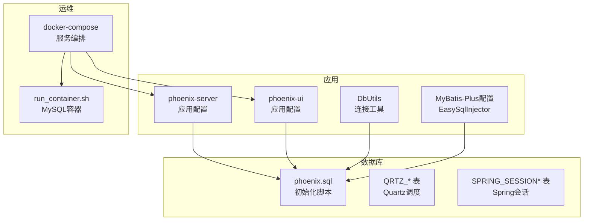
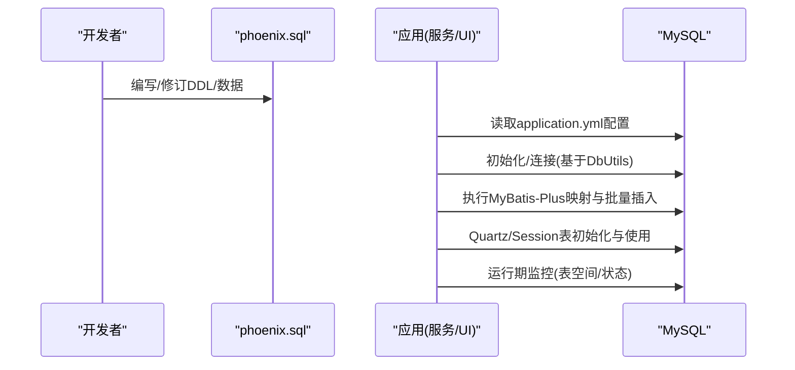
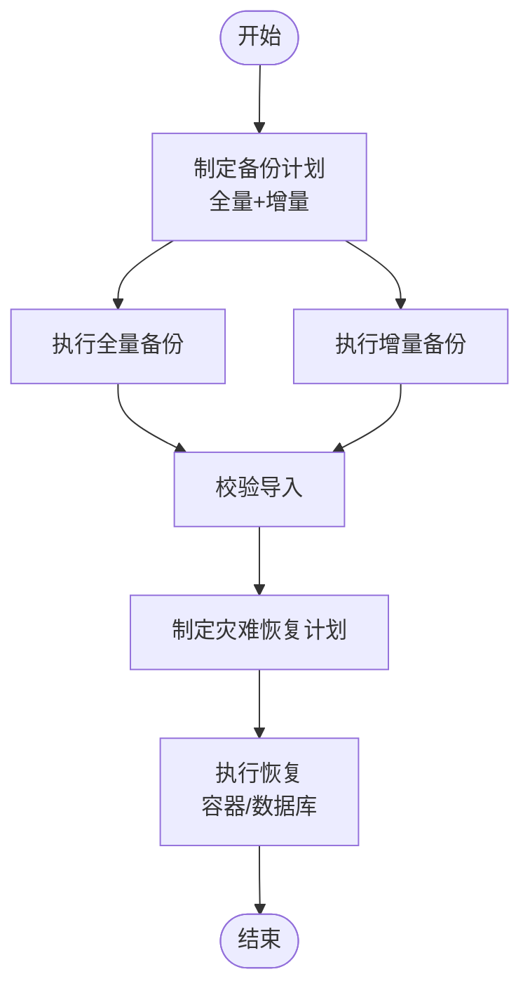
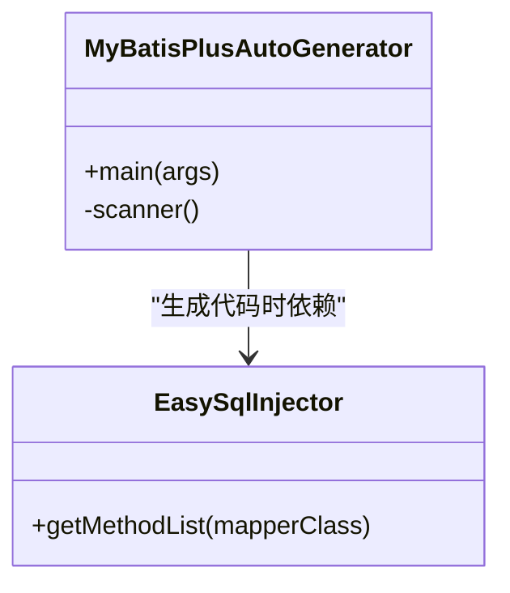
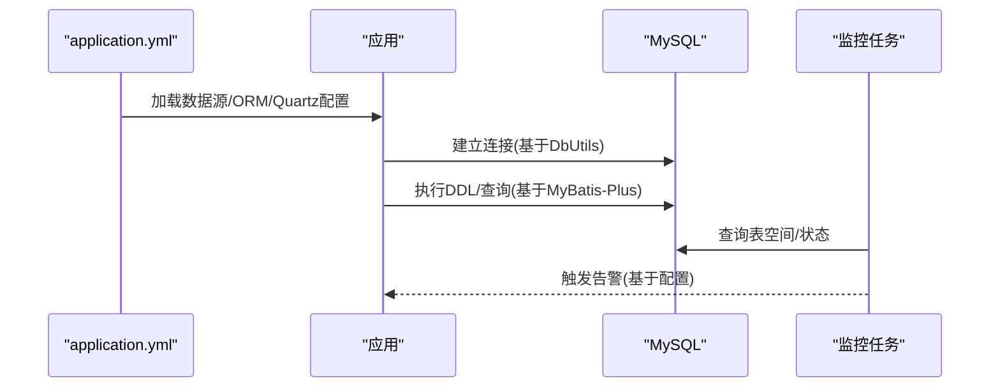
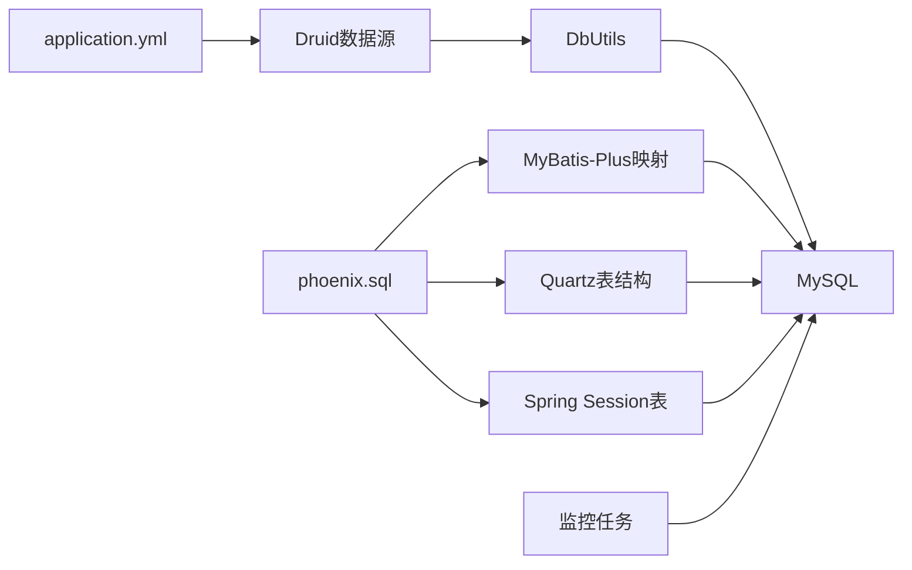

# 迁移与版本管理

<cite>
**本文引用的文件**
- [phoenix.sql](file://doc/数据库设计/sql/mysql/phoenix.sql)
- [application.yml](file://phoenix-server/src/main/resources/application.yml)
- [application.yml](file://phoenix-ui/src/main/resources/application.yml)
- [application-dev.yml](file://phoenix-server/src/main/resources/application-dev.yml)
- [application-dev.yml](file://phoenix-ui/src/main/resources/application-dev.yml)
- [DbUtils.java](file://phoenix-server/src/main/java/com/gitee/pifeng/monitoring/server/util/db/DbUtils.java)
- [DbTableSpace4OracleServiceImpl.java](file://phoenix-server/src/main/java/com/gitee/pifeng/monitoring/server/business/server/service/impl/DbTableSpace4OracleServiceImpl.java)
- [EasySqlInjector.java](file://phoenix-server/src/main/java/com/gitee/pifeng/monitoring/server/config/EasySqlInjector.java)
- [EasySqlInjector.java](file://phoenix-ui/src/main/java/com/gitee/pifeng/monitoring/ui/config/mybatisplus/EasySqlInjector.java)
- [MyBatisPlusAutoGenerator.java](file://phoenix-ui/src/main/java/com/gitee/pifeng/monitoring/ui/business/web/MyBatisPlusAutoGenerator.java)
- [DbException.java](file://phoenix-common/src/main/java/com/gitee/pifeng/monitoring/common/exception/DbException.java)
- [docker-compose.1.2.6.RELEASE-CR3.yml](file://doc/DockerCompose/docker-compose.1.2.6.RELEASE-CR3.yml)
- [run_container.1.2.6.RELEASE-CR5.sh](file://doc/Docker/mysql/run_container.1.2.6.RELEASE-CR5.sh)
- [DbTableSpaceMonitorJob.java](file://phoenix-server/src/main/java/com/gitee/pifeng/monitoring/server/business/server/monitor/db/DbTableSpaceMonitorJob.java)
- [MonitoringDbProperties.java](file://phoenix-common/src/main/java/com/gitee/pifeng/monitoring/common/property/server/MonitoringDbProperties.java)
- [MonitoringDbStatusProperties.java](file://phoenix-common/src/main/java/com/gitee/pifeng/monitoring/common/property/server/MonitoringDbStatusProperties.java)
- [MonitoringDbTableSpaceProperties.java](file://phoenix-common/src/main/java/com/gitee/pifeng/monitoring/common/property/server/MonitoringDbTableSpaceProperties.java)
- [MonitorConfigPageFormVo.java](file://phoenix-ui/src/main/java/com/gitee/pifeng/monitoring/ui/business/web/vo/MonitorConfigPageFormVo.java)
</cite>

## 目录
1. [简介](#简介)
2. [项目结构](#项目结构)
3. [核心组件](#核心组件)
4. [架构总览](#架构总览)
5. [详细组件分析](#详细组件分析)
6. [依赖关系分析](#依赖关系分析)
7. [性能考量](#性能考量)
8. [故障排查指南](#故障排查指南)
9. [结论](#结论)
10. [附录](#附录)

## 简介
本文件面向Phoenix监控系统的数据库迁移与版本管理，围绕以下目标展开：
- 数据库版本管理策略：版本号规范、变更记录管理、回滚机制
- 升级脚本编写规范：DDL兼容性、数据迁移、索引重建策略
- 增量升级与全量升级的适用场景与实施策略
- 备份与恢复策略：全量/增量/灾难恢复
- 风险评估与应急预案
- 自动化迁移工具与脚本使用指南
- 配置管理与数据库版本的协调机制

## 项目结构
Phoenix采用多模块架构，数据库相关能力主要体现在：
- 数据库初始化脚本：doc/数据库设计/sql/mysql/phoenix.sql
- 应用配置：phoenix-server与phoenix-ui的application.yml及profile配置
- 数据库连接与工具：DbUtils
- ORM与批量插入扩展：MyBatis-Plus配置与自定义SQL注入器
- 监控与告警：数据库表空间监控任务与配置属性
- Docker部署：MySQL容器与服务编排

**图表来源**
- [phoenix.sql:1-1478](file://doc/数据库设计/sql/mysql/phoenix.sql#L1-L1478)
- [application.yml:117-184](file://phoenix-server/src/main/resources/application.yml#L117-L184)
- [application.yml:84-152](file://phoenix-ui/src/main/resources/application.yml#L84-L152)
- [DbUtils.java:1-57](file://phoenix-server/src/main/java/com/gitee/pifeng/monitoring/server/util/db/DbUtils.java#L1-L57)
- [EasySqlInjector.java:1-26](file://phoenix-server/src/main/java/com/gitee/pifeng/monitoring/server/config/EasySqlInjector.java#L1-L26)
- [EasySqlInjector.java:1-26](file://phoenix-ui/src/main/java/com/gitee/pifeng/monitoring/ui/config/mybatisplus/EasySqlInjector.java#L1-L26)
- [docker-compose.1.2.6.RELEASE-CR3.yml:1-47](file://doc/DockerCompose/docker-compose.1.2.6.RELEASE-CR3.yml#L1-L47)
- [run_container.1.2.6.RELEASE-CR5.sh:1-44](file://doc/Docker/mysql/run_container.1.2.6.RELEASE-CR5.sh#L1-L44)

**章节来源**
- [phoenix.sql:1-1478](file://doc/数据库设计/sql/mysql/phoenix.sql#L1-L1478)
- [application.yml:117-184](file://phoenix-server/src/main/resources/application.yml#L117-L184)
- [application.yml:84-152](file://phoenix-ui/src/main/resources/application.yml#L84-L152)
- [docker-compose.1.2.6.RELEASE-CR3.yml:1-47](file://doc/DockerCompose/docker-compose.1.2.6.RELEASE-CR3.yml#L1-L47)

## 核心组件
- 初始化脚本与表结构：phoenix.sql定义了完整的数据库模式，包含业务表、Quartz调度表、Spring Session表等。
- 数据源与连接：应用通过application.yml配置Druid数据源，DbUtils封装连接获取与密码解码。
- ORM与批量插入：MyBatis-Plus配置与自定义SQL注入器，支持批量插入优化。
- 监控与告警：数据库表空间监控任务与配置属性，支持阈值与告警开关。
- 部署与运行：Docker Compose与容器启动脚本，确保MySQL与服务的稳定运行。

**章节来源**
- [phoenix.sql:1-1478](file://doc/数据库设计/sql/mysql/phoenix.sql#L1-L1478)
- [application.yml:117-184](file://phoenix-server/src/main/resources/application.yml#L117-L184)
- [DbUtils.java:1-57](file://phoenix-server/src/main/java/com/gitee/pifeng/monitoring/server/util/db/DbUtils.java#L1-L57)
- [EasySqlInjector.java:1-26](file://phoenix-server/src/main/java/com/gitee/pifeng/monitoring/server/config/EasySqlInjector.java#L1-L26)
- [EasySqlInjector.java:1-26](file://phoenix-ui/src/main/java/com/gitee/pifeng/monitoring/ui/config/mybatisplus/EasySqlInjector.java#L1-L26)
- [DbTableSpaceMonitorJob.java:202-232](file://phoenix-server/src/main/java/com/gitee/pifeng/monitoring/server/business/server/monitor/db/DbTableSpaceMonitorJob.java#L202-L232)
- [MonitoringDbProperties.java:1-36](file://phoenix-common/src/main/java/com/gitee/pifeng/monitoring/common/property/server/MonitoringDbProperties.java#L1-L36)
- [MonitoringDbTableSpaceProperties.java:1-42](file://phoenix-common/src/main/java/com/gitee/pifeng/monitoring/common/property/server/MonitoringDbTableSpaceProperties.java#L1-L42)
- [docker-compose.1.2.6.RELEASE-CR3.yml:1-47](file://doc/DockerCompose/docker-compose.1.2.6.RELEASE-CR3.yml#L1-L47)

## 架构总览
数据库迁移与版本管理涉及“脚本—配置—运行时”的协同：
- 脚本层：phoenix.sql作为基准版本，承载全量初始化与结构定义。
- 配置层：application.yml定义数据源、MyBatis-Plus、Quartz等关键配置。
- 运行层：DbUtils负责连接，MyBatis-Plus负责ORM，监控任务负责运行期观测。

**图表来源**
- [phoenix.sql:1-1478](file://doc/数据库设计/sql/mysql/phoenix.sql#L1-L1478)
- [application.yml:117-184](file://phoenix-server/src/main/resources/application.yml#L117-L184)
- [DbUtils.java:1-57](file://phoenix-server/src/main/java/com/gitee/pifeng/monitoring/server/util/db/DbUtils.java#L1-L57)
- [EasySqlInjector.java:1-26](file://phoenix-server/src/main/java/com/gitee/pifeng/monitoring/server/config/EasySqlInjector.java#L1-L26)

## 详细组件分析

### 版本号规范与变更记录管理
- 基准版本：phoenix.sql作为基准版本，包含完整的建表DDL、索引与约束定义。
- 变更记录：建议在脚本头部维护“目标服务器版本、文件编码、生成时间”等元信息，便于追踪。
- 版本演进：对于后续变更，建议以“补丁式脚本”形式存在，命名包含版本号与日期，例如“patch_v1.2.6_YYYYMMDD.sql”，并在CI/CD中统一管理。

**章节来源**
- [phoenix.sql:1-14](file://doc/数据库设计/sql/mysql/phoenix.sql#L1-L14)

### 回滚机制
- 原则：优先采用“向前兼容”的DDL变更；对不可逆变更，需准备对应的回滚脚本。
- 结构回滚：可参考phoenix.sql的“DROP TABLE IF EXISTS”顺序，逐张表回滚。
- 数据回滚：对重要数据变更，保留备份与增量导出；结合业务表的“INSERT/UPDATE时间戳”进行定位恢复。
- 配置回滚：应用配置变更遵循灰度发布与快速回退策略。

**章节来源**
- [phoenix.sql:1-14](file://doc/数据库设计/sql/mysql/phoenix.sql#L1-L14)

### 升级脚本编写规范
- DDL兼容性
  - 字段变更：优先使用“ALTER TABLE … ADD COLUMN … DEFAULT … COMMENT …”，避免直接DROP COLUMN。
  - 索引变更：先创建新索引，再删除旧索引，避免长事务锁表。
  - 字符集与排序规则：统一使用utf8mb4与通用排序规则，确保跨环境一致性。
- 数据迁移
  - 使用批量插入优化（见“批量插入扩展”）。
  - 对大表迁移，采用分批处理与事务拆分，降低锁竞争。
- 索引重建策略
  - 新增索引：在低峰时段执行，监控锁等待与慢查询。
  - 重建索引：必要时使用“在线重建”策略，避免长时间阻塞。

**章节来源**
- [phoenix.sql:1-1478](file://doc/数据库设计/sql/mysql/phoenix.sql#L1-L1478)
- [EasySqlInjector.java:1-26](file://phoenix-server/src/main/java/com/gitee/pifeng/monitoring/server/config/EasySqlInjector.java#L1-L26)
- [EasySqlInjector.java:1-26](file://phoenix-ui/src/main/java/com/gitee/pifeng/monitoring/ui/config/mybatisplus/EasySqlInjector.java#L1-L26)

### 增量升级与全量升级
- 全量升级
  - 场景：首次部署、全新环境、重大架构变更。
  - 策略：直接执行phoenix.sql，确保初始化完整性。
- 增量升级
  - 场景：常规迭代、小范围结构与数据变更。
  - 策略：按版本顺序执行补丁脚本，验证索引与约束一致性。

**章节来源**
- [phoenix.sql:1-1478](file://doc/数据库设计/sql/mysql/phoenix.sql#L1-L1478)

### 备份与恢复策略
- 全量备份
  - 使用mysqldump导出结构与数据，包含外键检查关闭与开启的包裹。
  - 建议定期（如每日）执行并校验导入。
- 增量备份
  - 基于binlog的增量备份与恢复，配合时间点恢复（PITR）。
- 灾难恢复
  - 多地容灾：结合Docker Compose与容器镜像，快速拉起服务。
  - MySQL容器：通过run_container脚本与卷挂载，保障数据持久化。

**图表来源**
- [docker-compose.1.2.6.RELEASE-CR3.yml:1-47](file://doc/DockerCompose/docker-compose.1.2.6.RELEASE-CR3.yml#L1-L47)
- [run_container.1.2.6.RELEASE-CR5.sh:1-44](file://doc/Docker/mysql/run_container.1.2.6.RELEASE-CR5.sh#L1-L44)

**章节来源**
- [docker-compose.1.2.6.RELEASE-CR3.yml:1-47](file://doc/DockerCompose/docker-compose.1.2.6.RELEASE-CR3.yml#L1-L47)
- [run_container.1.2.6.RELEASE-CR5.sh:1-44](file://doc/Docker/mysql/run_container.1.2.6.RELEASE-CR5.sh#L1-L44)

### 风险评估与应急预案
- 风险识别
  - DDL锁表风险：通过索引重建策略与低峰时段规避。
  - 数据迁移失败：准备回滚脚本与数据校验。
  - 连接异常：通过DbUtils与Druid配置的健康检查与超时设置降低影响。
- 应急预案
  - 快速回滚：执行对应回滚脚本，恢复到上一稳定版本。
  - 降级措施：临时关闭高风险监控任务，释放数据库压力。
  - 通知机制：结合告警配置，确保问题及时上报。

**章节来源**
- [DbUtils.java:1-57](file://phoenix-server/src/main/java/com/gitee/pifeng/monitoring/server/util/db/DbUtils.java#L1-L57)
- [DbException.java:1-26](file://phoenix-common/src/main/java/com/gitee/pifeng/monitoring/common/exception/DbException.java#L1-L26)

### 自动化迁移工具与脚本使用
- MyBatis-Plus代码生成器
  - 用途：根据表结构自动生成实体、Mapper、Service等代码，减少手写Mapper/XML的重复劳动。
  - 使用：在MyBatisPlusAutoGenerator中配置数据源与包结构，执行main方法即可批量生成。
- 批量插入扩展
  - 用途：通过自定义SQL注入器，启用InsertBatchSomeColumn，提升批量插入效率。
  - 配置：在MyBatis-Plus配置中启用全局配置，确保批量插入生效。

**图表来源**
- [MyBatisPlusAutoGenerator.java:1-136](file://phoenix-ui/src/main/java/com/gitee/pifeng/monitoring/ui/business/web/MyBatisPlusAutoGenerator.java#L1-L136)
- [EasySqlInjector.java:1-26](file://phoenix-server/src/main/java/com/gitee/pifeng/monitoring/server/config/EasySqlInjector.java#L1-L26)

**章节来源**
- [MyBatisPlusAutoGenerator.java:1-136](file://phoenix-ui/src/main/java/com/gitee/pifeng/monitoring/ui/business/web/MyBatisPlusAutoGenerator.java#L1-L136)
- [EasySqlInjector.java:1-26](file://phoenix-server/src/main/java/com/gitee/pifeng/monitoring/server/config/EasySqlInjector.java#L1-L26)
- [EasySqlInjector.java:1-26](file://phoenix-ui/src/main/java/com/gitee/pifeng/monitoring/ui/config/mybatisplus/EasySqlInjector.java#L1-L26)

### 配置管理与数据库版本的协调机制
- 应用配置
  - 数据源：通过application.yml配置Druid连接池参数与连接URL，确保与phoenix.sql一致的字符集与时区。
  - MyBatis-Plus：启用驼峰映射与数据库标识，保证实体与表结构的正确映射。
  - Quartz：使用JDBC持久化与集群配置，确保调度表结构与前缀一致。
- 运行期监控
  - 数据库表空间监控：通过配置属性控制是否启用与告警阈值，结合监控任务实现运行期观测。
  - UI配置：MonitorConfigPageFormVo中提供数据库表空间相关开关与阈值，便于前端可视化配置。

**图表来源**
- [application.yml:117-184](file://phoenix-server/src/main/resources/application.yml#L117-L184)
- [application.yml:84-152](file://phoenix-ui/src/main/resources/application.yml#L84-L152)
- [DbUtils.java:1-57](file://phoenix-server/src/main/java/com/gitee/pifeng/monitoring/server/util/db/DbUtils.java#L1-L57)
- [DbTableSpaceMonitorJob.java:202-232](file://phoenix-server/src/main/java/com/gitee/pifeng/monitoring/server/business/server/monitor/db/DbTableSpaceMonitorJob.java#L202-L232)
- [MonitoringDbTableSpaceProperties.java:1-42](file://phoenix-common/src/main/java/com/gitee/pifeng/monitoring/common/property/server/MonitoringDbTableSpaceProperties.java#L1-L42)
- [MonitorConfigPageFormVo.java:293-321](file://phoenix-ui/src/main/java/com/gitee/pifeng/monitoring/ui/business/web/vo/MonitorConfigPageFormVo.java#L293-L321)

**章节来源**
- [application.yml:117-184](file://phoenix-server/src/main/resources/application.yml#L117-L184)
- [application.yml:84-152](file://phoenix-ui/src/main/resources/application.yml#L84-L152)
- [DbUtils.java:1-57](file://phoenix-server/src/main/java/com/gitee/pifeng/monitoring/server/util/db/DbUtils.java#L1-L57)
- [DbTableSpaceMonitorJob.java:202-232](file://phoenix-server/src/main/java/com/gitee/pifeng/monitoring/server/business/server/monitor/db/DbTableSpaceMonitorJob.java#L202-L232)
- [MonitoringDbTableSpaceProperties.java:1-42](file://phoenix-common/src/main/java/com/gitee/pifeng/monitoring/common/property/server/MonitoringDbTableSpaceProperties.java#L1-L42)
- [MonitorConfigPageFormVo.java:293-321](file://phoenix-ui/src/main/java/com/gitee/pifeng/monitoring/ui/business/web/vo/MonitorConfigPageFormVo.java#L293-L321)

## 依赖关系分析
- 脚本依赖：phoenix.sql定义了所有业务表、Quartz与Spring Session表，应用通过ORM映射这些表。
- 配置依赖：application.yml中的数据源、MyBatis-Plus与Quartz配置直接影响应用启动与运行。
- 工具依赖：DbUtils为应用提供统一的连接入口；MyBatis-Plus的自定义注入器提升批量操作性能。
- 监控依赖：数据库表空间监控任务依赖配置属性与数据库连接。

**图表来源**
- [phoenix.sql:1-1478](file://doc/数据库设计/sql/mysql/phoenix.sql#L1-L1478)
- [application.yml:117-184](file://phoenix-server/src/main/resources/application.yml#L117-L184)
- [DbUtils.java:1-57](file://phoenix-server/src/main/java/com/gitee/pifeng/monitoring/server/util/db/DbUtils.java#L1-L57)
- [DbTableSpaceMonitorJob.java:202-232](file://phoenix-server/src/main/java/com/gitee/pifeng/monitoring/server/business/server/monitor/db/DbTableSpaceMonitorJob.java#L202-L232)

**章节来源**
- [phoenix.sql:1-1478](file://doc/数据库设计/sql/mysql/phoenix.sql#L1-L1478)
- [application.yml:117-184](file://phoenix-server/src/main/resources/application.yml#L117-L184)
- [DbUtils.java:1-57](file://phoenix-server/src/main/java/com/gitee/pifeng/monitoring/server/util/db/DbUtils.java#L1-L57)

## 性能考量
- 连接池与超时：Druid配置合理的初始大小、最大活跃数与超时参数，降低连接争用。
- ORM与批量插入：启用驼峰映射与批量插入扩展，减少SQL拼接与往返次数。
- 索引与查询：为高频查询字段建立合适索引，避免全表扫描；对大表查询使用LIMIT与分页。
- 监控与告警：合理设置阈值与告警级别，避免频繁告警干扰。

[本节为通用指导，无需特定文件引用]

## 故障排查指南
- 连接异常
  - 检查application.yml中的URL、用户名、密码是否正确。
  - 使用DbUtils进行连接测试，确认密码解码与字符集设置。
- ORM映射异常
  - 校验表名与字段命名是否符合驼峰映射规则。
  - 确认MyBatis-Plus配置与数据库标识一致。
- 监控告警异常
  - 检查数据库表空间监控配置属性与开关状态。
  - 关注监控任务的日志与异常堆栈。

**章节来源**
- [application-dev.yml:11-14](file://phoenix-server/src/main/resources/application-dev.yml#L11-L14)
- [application-dev.yml:20-23](file://phoenix-ui/src/main/resources/application-dev.yml#L20-L23)
- [DbUtils.java:1-57](file://phoenix-server/src/main/java/com/gitee/pifeng/monitoring/server/util/db/DbUtils.java#L1-L57)
- [DbTableSpaceMonitorJob.java:202-232](file://phoenix-server/src/main/java/com/gitee/pifeng/monitoring/server/business/server/monitor/db/DbTableSpaceMonitorJob.java#L202-L232)
- [DbException.java:1-26](file://phoenix-common/src/main/java/com/gitee/pifeng/monitoring/common/exception/DbException.java#L1-L26)

## 结论
Phoenix监控系统的数据库迁移与版本管理应坚持“脚本标准化、配置可追溯、工具自动化、监控可观测”的原则。通过phoenix.sql的基准版本、完善的配置与连接工具、以及运行期监控与告警体系，可有效支撑系统的稳定演进与快速恢复。

[本节为总结性内容，无需特定文件引用]

## 附录
- 建议的脚本命名规范：patch_v{version}_{YYYYMMDD}.sql
- 建议的版本号格式：主版本.次版本.修订号（如1.2.6）
- 建议的回滚脚本命名：rollback_patch_v{version}_{YYYYMMDD}.sql

[本节为通用指导，无需特定文件引用]