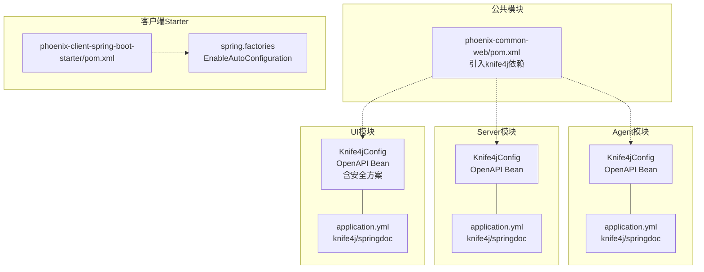
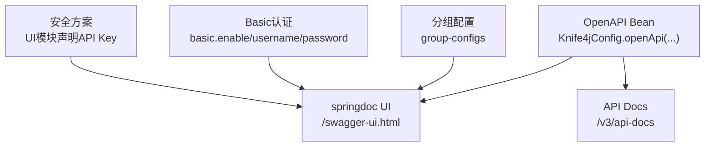
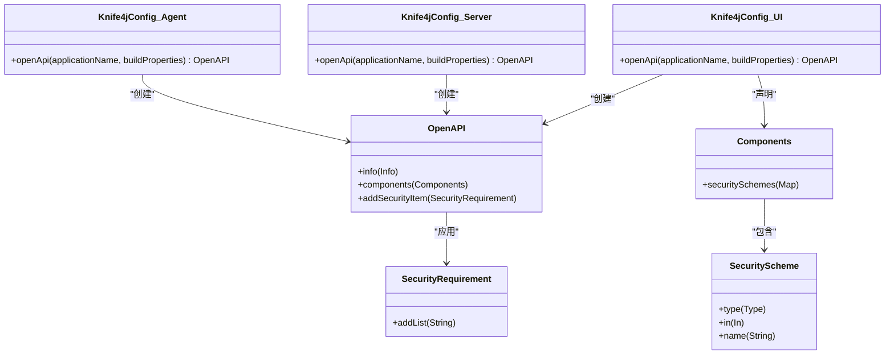
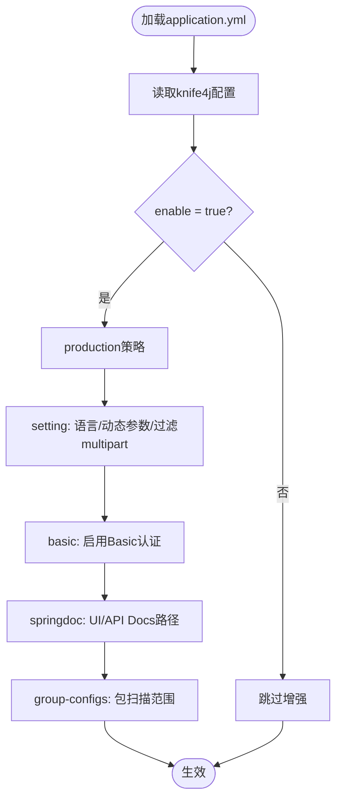
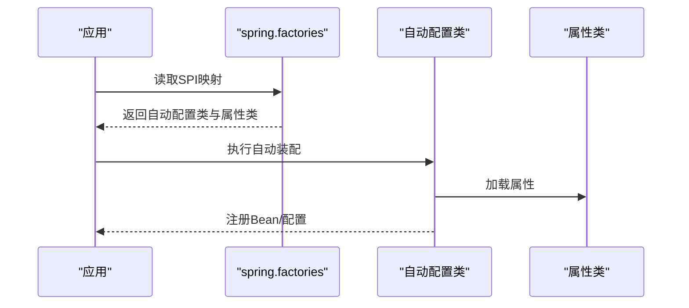
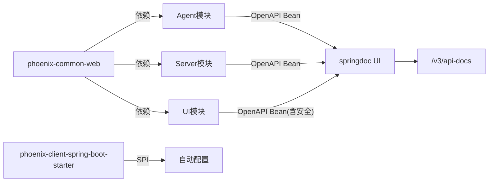

# API文档配置

<cite>
**本文引用的文件**   
- [phoenix-agent/src/main/java/com/gitee/pifeng/monitoring/agent/config/Knife4jConfig.java](file://phoenix-agent/src/main/java/com/gitee/pifeng/monitoring/agent/config/Knife4jConfig.java)
- [phoenix-server/src/main/java/com/gitee/pifeng/monitoring/server/config/Knife4jConfig.java](file://phoenix-server/src/main/java/com/gitee/pifeng/monitoring/server/config/Knife4jConfig.java)
- [phoenix-ui/src/main/java/com/gitee/pifeng/monitoring/ui/config/Knife4jConfig.java](file://phoenix-ui/src/main/java/com/gitee/pifeng/monitoring/ui/config/Knife4jConfig.java)
- [phoenix-agent/src/main/resources/application.yml](file://phoenix-agent/src/main/resources/application.yml)
- [phoenix-server/src/main/resources/application.yml](file://phoenix-server/src/main/resources/application.yml)
- [phoenix-ui/src/main/resources/application.yml](file://phoenix-ui/src/main/resources/application.yml)
- [phoenix-common-web/pom.xml](file://phoenix-common-web/pom.xml)
- [phoenix-client-spring-boot-starter/src/main/resources/META-INF/spring.factories](file://phoenix-client-spring-boot-starter/src/main/resources/META-INF/spring.factories)
- [phoenix-common-web/src/main/resources/META-INF/spring.factories](file://phoenix-common-web/src/main/resources/META-INF/spring.factories)
- [phoenix-client-spring-boot-starter/pom.xml](file://phoenix-client-spring-boot-starter/pom.xml)
</cite>

## 目录
1. [简介](#简介)
2. [项目结构](#项目结构)
3. [核心组件](#核心组件)
4. [架构总览](#架构总览)
5. [详细组件分析](#详细组件分析)
6. [依赖分析](#依赖分析)
7. [性能考量](#性能考量)
8. [故障排查指南](#故障排查指南)
9. [结论](#结论)
10. [附录](#附录)

## 简介
本文件围绕API文档配置展开，重点解析Knife4j在API文档生成中的核心作用，涵盖SpringDoc OpenAPI集成、接口测试与在线调试、文档分组与导出、权限控制与安全策略等。同时结合项目中各模块的Knife4j配置与spring.factories SPI机制，给出最佳实践与实现方案，帮助团队建立统一、可维护、可扩展的API文档体系。

## 项目结构
Phoenix项目由agent、server、ui三大业务模块组成，均通过独立的Knife4j配置类与application.yml中的knife4j/springdoc配置，实现OpenAPI文档的生成与UI展示。公共模块phoenix-common-web引入knife4j-openapi3-spring-boot-starter，为各子模块提供统一的文档能力基础。

图表来源
- [phoenix-agent/src/main/java/com/gitee/pifeng/monitoring/agent/config/Knife4jConfig.java:1-50](file://phoenix-agent/src/main/java/com/gitee/pifeng/monitoring/agent/config/Knife4jConfig.java#L1-L50)
- [phoenix-server/src/main/java/com/gitee/pifeng/monitoring/server/config/Knife4jConfig.java:1-50](file://phoenix-server/src/main/java/com/gitee/pifeng/monitoring/server/config/Knife4jConfig.java#L1-L50)
- [phoenix-ui/src/main/java/com/gitee/pifeng/monitoring/ui/config/Knife4jConfig.java:1-64](file://phoenix-ui/src/main/java/com/gitee/pifeng/monitoring/ui/config/Knife4jConfig.java#L1-L64)
- [phoenix-agent/src/main/resources/application.yml:76-111](file://phoenix-agent/src/main/resources/application.yml#L76-L111)
- [phoenix-server/src/main/resources/application.yml:236-271](file://phoenix-server/src/main/resources/application.yml#L236-L271)
- [phoenix-ui/src/main/resources/application.yml:204-238](file://phoenix-ui/src/main/resources/application.yml#L204-L238)
- [phoenix-common-web/pom.xml:161-165](file://phoenix-common-web/pom.xml#L161-L165)
- [phoenix-client-spring-boot-starter/pom.xml:1-71](file://phoenix-client-spring-boot-starter/pom.xml#L1-L71)
- [phoenix-client-spring-boot-starter/src/main/resources/META-INF/spring.factories:1-4](file://phoenix-client-spring-boot-starter/src/main/resources/META-INF/spring.factories#L1-L4)
- [phoenix-common-web/src/main/resources/META-INF/spring.factories:1-2](file://phoenix-common-web/src/main/resources/META-INF/spring.factories#L1-L2)

章节来源
- [phoenix-agent/src/main/java/com/gitee/pifeng/monitoring/agent/config/Knife4jConfig.java:1-50](file://phoenix-agent/src/main/java/com/gitee/pifeng/monitoring/agent/config/Knife4jConfig.java#L1-L50)
- [phoenix-server/src/main/java/com/gitee/pifeng/monitoring/server/config/Knife4jConfig.java:1-50](file://phoenix-server/src/main/java/com/gitee/pifeng/monitoring/server/config/Knife4jConfig.java#L1-L50)
- [phoenix-ui/src/main/java/com/gitee/pifeng/monitoring/ui/config/Knife4jConfig.java:1-64](file://phoenix-ui/src/main/java/com/gitee/pifeng/monitoring/ui/config/Knife4jConfig.java#L1-L64)
- [phoenix-agent/src/main/resources/application.yml:76-111](file://phoenix-agent/src/main/resources/application.yml#L76-L111)
- [phoenix-server/src/main/resources/application.yml:236-271](file://phoenix-server/src/main/resources/application.yml#L236-L271)
- [phoenix-ui/src/main/resources/application.yml:204-238](file://phoenix-ui/src/main/resources/application.yml#L204-L238)
- [phoenix-common-web/pom.xml:161-165](file://phoenix-common-web/pom.xml#L161-L165)
- [phoenix-client-spring-boot-starter/pom.xml:1-71](file://phoenix-client-spring-boot-starter/pom.xml#L1-L71)
- [phoenix-client-spring-boot-starter/src/main/resources/META-INF/spring.factories:1-4](file://phoenix-client-spring-boot-starter/src/main/resources/META-INF/spring.factories#L1-L4)
- [phoenix-common-web/src/main/resources/META-INF/spring.factories:1-2](file://phoenix-common-web/src/main/resources/META-INF/spring.factories#L1-L2)

## 核心组件
- Knife4j配置类：在三个模块中分别定义OpenAPI Bean，统一设置标题、联系人、描述、版本、许可证等元信息；UI模块额外声明安全方案（如API Key在Header中传递）。
- 应用配置：各模块的application.yml集中配置knife4j开关、生产保护策略、UI语言、调试参数、Basic认证、springdoc路径与分组扫描包等。
- 依赖与SPI：公共模块引入knife4j依赖；客户端starter通过spring.factories注册自动装配入口，实现按需启用与配置。

章节来源
- [phoenix-agent/src/main/java/com/gitee/pifeng/monitoring/agent/config/Knife4jConfig.java:38-47](file://phoenix-agent/src/main/java/com/gitee/pifeng/monitoring/agent/config/Knife4jConfig.java#L38-L47)
- [phoenix-server/src/main/java/com/gitee/pifeng/monitoring/server/config/Knife4jConfig.java:38-47](file://phoenix-server/src/main/java/com/gitee/pifeng/monitoring/server/config/Knife4jConfig.java#L38-L47)
- [phoenix-ui/src/main/java/com/gitee/pifeng/monitoring/ui/config/Knife4jConfig.java:43-61](file://phoenix-ui/src/main/java/com/gitee/pifeng/monitoring/ui/config/Knife4jConfig.java#L43-L61)
- [phoenix-agent/src/main/resources/application.yml:76-111](file://phoenix-agent/src/main/resources/application.yml#L76-L111)
- [phoenix-server/src/main/resources/application.yml:236-271](file://phoenix-server/src/main/resources/application.yml#L236-L271)
- [phoenix-ui/src/main/resources/application.yml:204-238](file://phoenix-ui/src/main/resources/application.yml#L204-L238)
- [phoenix-common-web/pom.xml:161-165](file://phoenix-common-web/pom.xml#L161-L165)
- [phoenix-client-spring-boot-starter/src/main/resources/META-INF/spring.factories:1-4](file://phoenix-client-spring-boot-starter/src/main/resources/META-INF/spring.factories#L1-L4)

## 架构总览
下图展示了Knife4j在Phoenix项目中的整体架构：OpenAPI Bean由各模块配置类创建，springdoc UI负责渲染；application.yml中的knife4j与springdoc配置决定UI行为与分组；公共模块提供依赖，客户端starter通过SPI自动装配。

图表来源
- [phoenix-agent/src/main/java/com/gitee/pifeng/monitoring/agent/config/Knife4jConfig.java:38-47](file://phoenix-agent/src/main/java/com/gitee/pifeng/monitoring/agent/config/Knife4jConfig.java#L38-L47)
- [phoenix-server/src/main/java/com/gitee/pifeng/monitoring/server/config/Knife4jConfig.java:38-47](file://phoenix-server/src/main/java/com/gitee/pifeng/monitoring/server/config/Knife4jConfig.java#L38-L47)
- [phoenix-ui/src/main/java/com/gitee/pifeng/monitoring/ui/config/Knife4jConfig.java:43-61](file://phoenix-ui/src/main/java/com/gitee/pifeng/monitoring/ui/config/Knife4jConfig.java#L43-L61)
- [phoenix-agent/src/main/resources/application.yml:98-111](file://phoenix-agent/src/main/resources/application.yml#L98-L111)
- [phoenix-server/src/main/resources/application.yml:258-271](file://phoenix-server/src/main/resources/application.yml#L258-L271)
- [phoenix-ui/src/main/resources/application.yml:226-238](file://phoenix-ui/src/main/resources/application.yml#L226-L238)

## 详细组件分析

### 组件A：Knife4j配置类（OpenAPI Bean）
- 职责：创建并返回OpenAPI对象，设置标题、联系人、描述、版本、许可证等信息；UI模块额外声明安全方案与全局安全需求。
- 关键点：
  - 使用构建属性动态注入版本号，确保文档与制品一致。
  - UI模块通过Components与SecurityScheme声明API Key（Header模式），并在OpenAPI层面添加SecurityRequirement，使调试界面具备鉴权能力。
  - 三个模块的配置类结构一致，便于统一维护与扩展。

图表来源
- [phoenix-agent/src/main/java/com/gitee/pifeng/monitoring/agent/config/Knife4jConfig.java:38-47](file://phoenix-agent/src/main/java/com/gitee/pifeng/monitoring/agent/config/Knife4jConfig.java#L38-L47)
- [phoenix-server/src/main/java/com/gitee/pifeng/monitoring/server/config/Knife4jConfig.java:38-47](file://phoenix-server/src/main/java/com/gitee/pifeng/monitoring/server/config/Knife4jConfig.java#L38-L47)
- [phoenix-ui/src/main/java/com/gitee/pifeng/monitoring/ui/config/Knife4jConfig.java:43-61](file://phoenix-ui/src/main/java/com/gitee/pifeng/monitoring/ui/config/Knife4jConfig.java#L43-L61)

章节来源
- [phoenix-agent/src/main/java/com/gitee/pifeng/monitoring/agent/config/Knife4jConfig.java:38-47](file://phoenix-agent/src/main/java/com/gitee/pifeng/monitoring/agent/config/Knife4jConfig.java#L38-L47)
- [phoenix-server/src/main/java/com/gitee/pifeng/monitoring/server/config/Knife4jConfig.java:38-47](file://phoenix-server/src/main/java/com/gitee/pifeng/monitoring/server/config/Knife4jConfig.java#L38-L47)
- [phoenix-ui/src/main/java/com/gitee/pifeng/monitoring/ui/config/Knife4jConfig.java:43-61](file://phoenix-ui/src/main/java/com/gitee/pifeng/monitoring/ui/config/Knife4jConfig.java#L43-L61)

### 组件B：应用级Knife4j与SpringDoc配置
- 职责：集中控制Knife4j增强功能、UI语言、调试参数、Basic认证、分组扫描范围与springdoc UI/API Docs路径。
- 关键点：
  - 开启增强与生产保护策略，避免在生产暴露敏感信息。
  - 设置UI语言、动态参数调试、过滤multipart接口等，提升调试体验。
  - 分组配置按模块包扫描，确保文档聚合与隔离。
  - Basic认证用于限制UI访问，保障内网或受控环境使用。

图表来源
- [phoenix-agent/src/main/resources/application.yml:76-111](file://phoenix-agent/src/main/resources/application.yml#L76-L111)
- [phoenix-server/src/main/resources/application.yml:236-271](file://phoenix-server/src/main/resources/application.yml#L236-L271)
- [phoenix-ui/src/main/resources/application.yml:204-238](file://phoenix-ui/src/main/resources/application.yml#L204-L238)

章节来源
- [phoenix-agent/src/main/resources/application.yml:76-111](file://phoenix-agent/src/main/resources/application.yml#L76-L111)
- [phoenix-server/src/main/resources/application.yml:236-271](file://phoenix-server/src/main/resources/application.yml#L236-L271)
- [phoenix-ui/src/main/resources/application.yml:204-238](file://phoenix-ui/src/main/resources/application.yml#L204-L238)

### 组件C：SpringFactories SPI机制（客户端Starter）
- 职责：通过spring.factories注册自动装配入口，实现@EnableMonitoring注解与相关属性类的自动装配，简化客户端接入。
- 关键点：
  - 客户端starter声明EnableAutoConfiguration映射到自动配置类。
  - 公共web模块声明EnableAutoConfiguration映射到业务扫描器，统一处理业务组件。

图表来源
- [phoenix-client-spring-boot-starter/src/main/resources/META-INF/spring.factories:1-4](file://phoenix-client-spring-boot-starter/src/main/resources/META-INF/spring.factories#L1-L4)
- [phoenix-common-web/src/main/resources/META-INF/spring.factories:1-2](file://phoenix-common-web/src/main/resources/META-INF/spring.factories#L1-L2)

章节来源
- [phoenix-client-spring-boot-starter/src/main/resources/META-INF/spring.factories:1-4](file://phoenix-client-spring-boot-starter/src/main/resources/META-INF/spring.factories#L1-L4)
- [phoenix-common-web/src/main/resources/META-INF/spring.factories:1-2](file://phoenix-common-web/src/main/resources/META-INF/spring.factories#L1-L2)

### 组件D：依赖与集成（Knife4j Starter）
- 职责：公共模块引入knife4j-openapi3-spring-boot-starter，为agent/server/ui提供统一的OpenAPI与UI能力。
- 关键点：
  - 依赖版本由父工程统一管理，确保兼容性。
  - 各模块通过配置类与application.yml实现差异化定制。

章节来源
- [phoenix-common-web/pom.xml:161-165](file://phoenix-common-web/pom.xml#L161-L165)

## 依赖分析
- 模块耦合：
  - 三个业务模块共享Knife4j配置类与springdoc配置，耦合度低、内聚性强。
  - UI模块在Knife4j配置中增加安全方案，体现差异化需求。
- 外部依赖：
  - knife4j-openapi3-spring-boot-starter提供OpenAPI与UI能力。
  - 客户端starter通过SPI实现自动装配，降低接入成本。
- 循环依赖：
  - 当前结构未见循环依赖迹象，配置类仅创建Bean，无互相引用。

图表来源
- [phoenix-agent/src/main/java/com/gitee/pifeng/monitoring/agent/config/Knife4jConfig.java:38-47](file://phoenix-agent/src/main/java/com/gitee/pifeng/monitoring/agent/config/Knife4jConfig.java#L38-L47)
- [phoenix-server/src/main/java/com/gitee/pifeng/monitoring/server/config/Knife4jConfig.java:38-47](file://phoenix-server/src/main/java/com/gitee/pifeng/monitoring/server/config/Knife4jConfig.java#L38-L47)
- [phoenix-ui/src/main/java/com/gitee/pifeng/monitoring/ui/config/Knife4jConfig.java:43-61](file://phoenix-ui/src/main/java/com/gitee/pifeng/monitoring/ui/config/Knife4jConfig.java#L43-L61)
- [phoenix-common-web/pom.xml:161-165](file://phoenix-common-web/pom.xml#L161-L165)
- [phoenix-client-spring-boot-starter/src/main/resources/META-INF/spring.factories:1-4](file://phoenix-client-spring-boot-starter/src/main/resources/META-INF/spring.factories#L1-L4)

章节来源
- [phoenix-agent/src/main/java/com/gitee/pifeng/monitoring/agent/config/Knife4jConfig.java:38-47](file://phoenix-agent/src/main/java/com/gitee/pifeng/monitoring/agent/config/Knife4jConfig.java#L38-L47)
- [phoenix-server/src/main/java/com/gitee/pifeng/monitoring/server/config/Knife4jConfig.java:38-47](file://phoenix-server/src/main/java/com/gitee/pifeng/monitoring/server/config/Knife4jConfig.java#L38-L47)
- [phoenix-ui/src/main/java/com/gitee/pifeng/monitoring/ui/config/Knife4jConfig.java:43-61](file://phoenix-ui/src/main/java/com/gitee/pifeng/monitoring/ui/config/Knife4jConfig.java#L43-L61)
- [phoenix-common-web/pom.xml:161-165](file://phoenix-common-web/pom.xml#L161-L165)
- [phoenix-client-spring-boot-starter/src/main/resources/META-INF/spring.factories:1-4](file://phoenix-client-spring-boot-starter/src/main/resources/META-INF/spring.factories#L1-L4)

## 性能考量
- 文档生成与UI渲染：
  - 合理设置分组扫描包，避免全量扫描带来的启动与内存压力。
  - 控制springdoc UI的排序与扩展展示，减少前端渲染负担。
- 生产环境保护：
  - 启用production策略，隐藏敏感信息；必要时配合Basic认证与白名单访问。
- 缓存与静态资源：
  - UI模块开启响应压缩与会话存储，有助于提升页面加载速度。

## 故障排查指南
- 文档未生成或UI空白
  - 检查knife4j.enable与springdoc.api-docs.path是否正确配置。
  - 确认OpenAPI Bean已创建且版本信息可读。
- UI无法访问或提示未授权
  - 检查basic.enable与用户名密码配置。
  - 如UI模块声明了安全方案，需在调试时携带对应Header。
- 分组不生效或接口缺失
  - 核对group-configs的paths-to-match与packages-to-scan是否覆盖目标接口。
- 版本不一致或信息缺失
  - 确保BuildProperties可用，以正确注入版本号。

章节来源
- [phoenix-agent/src/main/resources/application.yml:76-111](file://phoenix-agent/src/main/resources/application.yml#L76-L111)
- [phoenix-server/src/main/resources/application.yml:236-271](file://phoenix-server/src/main/resources/application.yml#L236-L271)
- [phoenix-ui/src/main/resources/application.yml:204-238](file://phoenix-ui/src/main/resources/application.yml#L204-L238)
- [phoenix-agent/src/main/java/com/gitee/pifeng/monitoring/agent/config/Knife4jConfig.java:38-47](file://phoenix-agent/src/main/java/com/gitee/pifeng/monitoring/agent/config/Knife4jConfig.java#L38-L47)
- [phoenix-server/src/main/java/com/gitee/pifeng/monitoring/server/config/Knife4jConfig.java:38-47](file://phoenix-server/src/main/java/com/gitee/pifeng/monitoring/server/config/Knife4jConfig.java#L38-L47)
- [phoenix-ui/src/main/java/com/gitee/pifeng/monitoring/ui/config/Knife4jConfig.java:43-61](file://phoenix-ui/src/main/java/com/gitee/pifeng/monitoring/ui/config/Knife4jConfig.java#L43-L61)

## 结论
Phoenix项目通过统一的Knife4j配置与springdoc集成，实现了跨模块的一致化API文档能力；配合application.yml的精细化配置与spring.factories的SPI机制，既满足开发调试需求，又兼顾生产环境的安全与稳定。建议在后续迭代中持续完善接口规范、参数说明与错误码定义，形成标准化的文档模板与最佳实践。

## 附录
- 最佳实践清单
  - 接口规范：统一使用OpenAPI注解描述路径、参数、响应与异常。
  - 参数说明：详尽的参数类型、必填、范围与示例，避免歧义。
  - 错误码定义：集中管理错误码与消息，保持前后端一致。
  - 示例代码：提供常见场景的请求/响应示例，便于快速集成。
  - 版本管理：通过BuildProperties注入版本，文档随制品同步更新。
  - 多环境配置：dev/test/prod三套knife4j与springdoc配置，确保环境隔离。
  - 文档安全：生产环境启用production策略与Basic认证，必要时加入IP白名单与HTTPS。