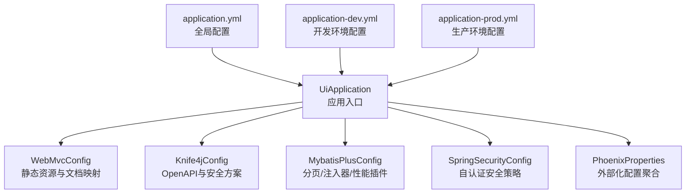
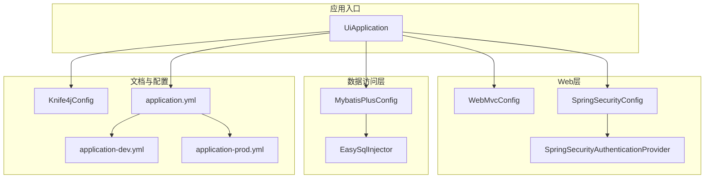
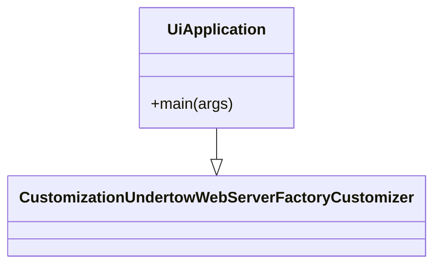
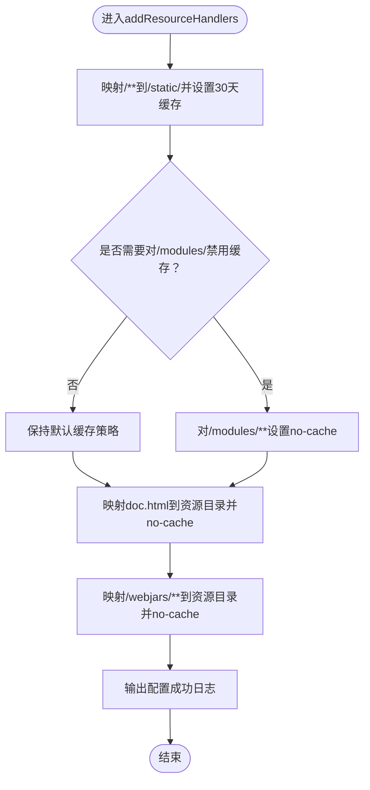
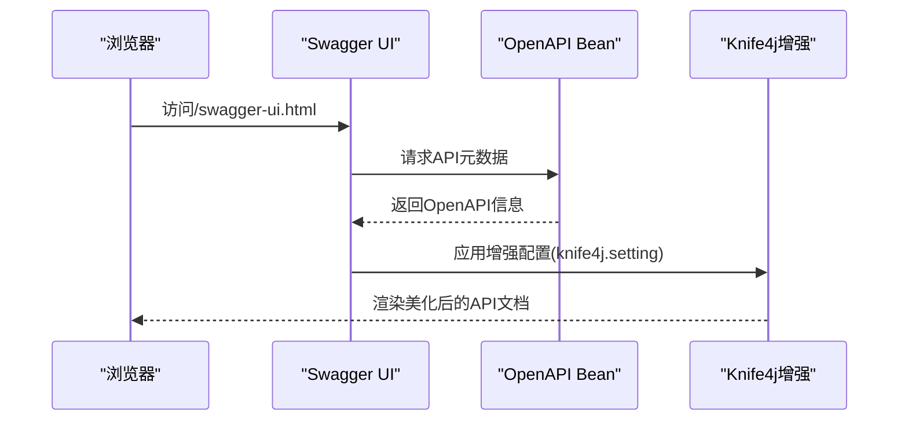
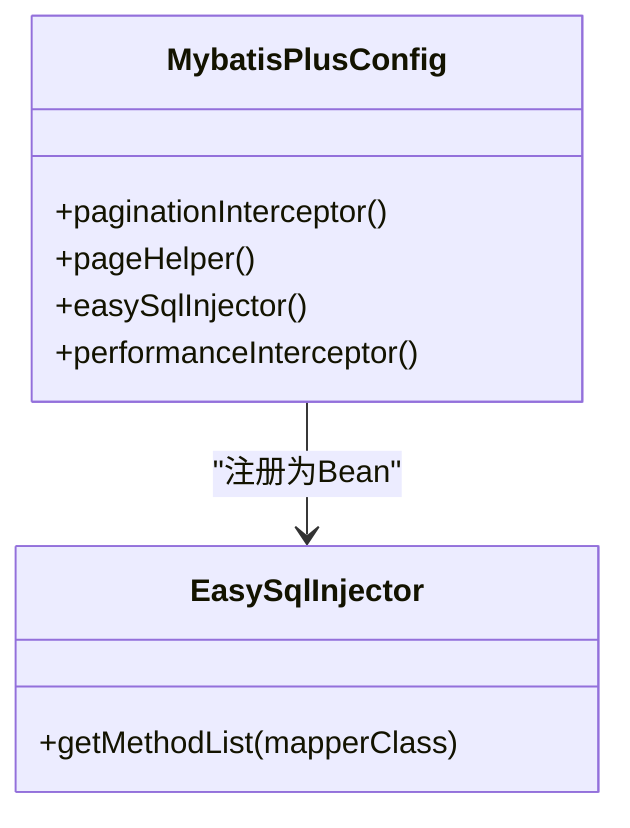
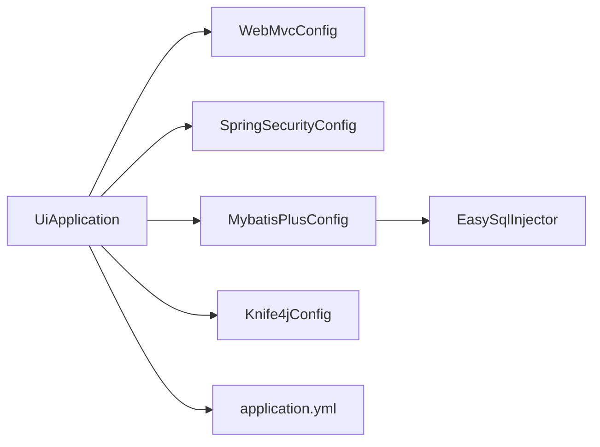

# UI端架构设计

<cite>
**本文引用的文件**
- [UiApplication.java](file://phoenix-ui/src/main/java/com/gitee/pifeng/monitoring/ui/UiApplication.java)
- [WebMvcConfig.java](file://phoenix-ui/src/main/java/com/gitee/pifeng/monitoring/ui/config/WebMvcConfig.java)
- [Knife4jConfig.java](file://phoenix-ui/src/main/java/com/gitee/pifeng/monitoring/ui/config/Knife4jConfig.java)
- [MybatisPlusConfig.java](file://phoenix-ui/src/main/java/com/gitee/pifeng/monitoring/ui/config/mybatisplus/MybatisPlusConfig.java)
- [EasySqlInjector.java](file://phoenix-ui/src/main/java/com/gitee/pifeng/monitoring/ui/config/mybatisplus/EasySqlInjector.java)
- [SpringSecurityConfig.java](file://phoenix-ui/src/main/java/com/gitee/pifeng/monitoring/ui/config/springsecurity/SpringSecurityConfig.java)
- [BaseWebSecurityConfigurerAdapter.java](file://phoenix-ui/src/main/java/com/gitee/pifeng/monitoring/ui/config/springsecurity/BaseWebSecurityConfigurerAdapter.java)
- [SpringSecurityAuthenticationProvider.java](file://phoenix-ui/src/main/java/com/gitee/pifeng/monitoring/ui/config/springsecurity/SpringSecurityAuthenticationProvider.java)
- [PhoenixProperties.java](file://phoenix-ui/src/main/java/com/gitee/pifeng/monitoring/ui/property/PhoenixProperties.java)
- [application.yml](file://phoenix-ui/src/main/resources/application.yml)
- [application-dev.yml](file://phoenix-ui/src/main/resources/application-dev.yml)
- [application-prod.yml](file://phoenix-ui/src/main/resources/application-prod.yml)
</cite>

## 目录
1. [引言](#引言)
2. [项目结构](#项目结构)
3. [核心组件](#核心组件)
4. [架构总览](#架构总览)
5. [详细组件分析](#详细组件分析)
6. [依赖分析](#依赖分析)
7. [性能考量](#性能考量)
8. [故障排查指南](#故障排查指南)
9. [结论](#结论)
10. [附录](#附录)

## 引言
本技术文档围绕UI端（phoenix-ui）的架构设计展开，重点解析UiApplication启动类的设计理念与自动配置、组件扫描策略、缓存启用机制等核心架构要素；详解WebMvcConfig在静态资源处理、接口文档资源映射等方面的配置；阐述Knife4j在API文档生成、接口测试与文档美化方面的集成；说明MybatisPlus配置如何通过分页插件、SQL注入器等简化数据访问层开发；并总结架构最佳实践，包括依赖注入策略、事务管理、异常处理与性能优化。

## 项目结构
UI端采用标准Spring Boot多模块结构，核心入口位于UiApplication，配置集中在config包内，业务代码按领域划分在business包下，资源文件位于resources目录。关键配置文件包括application.yml及不同环境的profile配置文件。



图表来源
- [UiApplication.java:37-46](file://phoenix-ui/src/main/java/com/gitee/pifeng/monitoring/ui/UiApplication.java#L37-L46)
- [WebMvcConfig.java:23-53](file://phoenix-ui/src/main/java/com/gitee/pifeng/monitoring/ui/config/WebMvcConfig.java#L23-L53)
- [Knife4jConfig.java:30-61](file://phoenix-ui/src/main/java/com/gitee/pifeng/monitoring/ui/config/Knife4jConfig.java#L30-L61)
- [MybatisPlusConfig.java:26-110](file://phoenix-ui/src/main/java/com/gitee/pifeng/monitoring/ui/config/mybatisplus/MybatisPlusConfig.java#L26-L110)
- [SpringSecurityConfig.java:33-39](file://phoenix-ui/src/main/java/com/gitee/pifeng/monitoring/ui/config/springsecurity/SpringSecurityConfig.java#L33-L39)
- [PhoenixProperties.java:16-20](file://phoenix-ui/src/main/java/com/gitee/pifeng/monitoring/ui/property/PhoenixProperties.java#L16-L20)
- [application.yml:1-238](file://phoenix-ui/src/main/resources/application.yml#L1-L238)
- [application-dev.yml:1-49](file://phoenix-ui/src/main/resources/application-dev.yml#L1-L49)
- [application-prod.yml:1-39](file://phoenix-ui/src/main/resources/application-prod.yml#L1-L39)

章节来源
- [UiApplication.java:19-46](file://phoenix-ui/src/main/java/com/gitee/pifeng/monitoring/ui/UiApplication.java#L19-L46)
- [application.yml:1-238](file://phoenix-ui/src/main/resources/application.yml#L1-L238)

## 核心组件
- 启动类与自动配置
  - UiApplication通过@EnableRetry、@EnableCaching、@EnableTransactionManagement、@EnableConfigurationProperties、@ComponentScan等注解实现重试、缓存、事务、配置绑定与组件扫描策略。
  - 继承自定制的Web容器工厂适配器，便于统一容器行为。
- Web层配置
  - WebMvcConfig在生产环境配置静态资源缓存策略、接口文档资源映射，确保doc.html与webjars可用且不被缓存。
- API文档集成
  - Knife4jConfig基于OpenAPI定义基本信息、安全方案（如CSRF Token），并与springdoc配置联动，提供Swagger UI与分组扫描。
- 数据访问层
  - MybatisPlusConfig启用分页插件、PageHelper分页、自定义SQL注入器（批量插入扩展），并在开发/测试环境启用SQL执行效率插件。
- 安全与认证
  - SpringSecurityConfig基于自定义认证提供者与会话管理，结合BaseWebSecurityConfigurerAdapter定义忽略资源与URL，实现登录、记住我、会话并发控制等。
- 外部化配置
  - PhoenixProperties聚合phoenix前缀配置，配合application.yml中的knife4j、springdoc、mybatis-plus等配置生效。

章节来源
- [UiApplication.java:29-36](file://phoenix-ui/src/main/java/com/gitee/pifeng/monitoring/ui/UiApplication.java#L29-L36)
- [WebMvcConfig.java:23-53](file://phoenix-ui/src/main/java/com/gitee/pifeng/monitoring/ui/config/WebMvcConfig.java#L23-L53)
- [Knife4jConfig.java:30-61](file://phoenix-ui/src/main/java/com/gitee/pifeng/monitoring/ui/config/Knife4jConfig.java#L30-L61)
- [MybatisPlusConfig.java:26-110](file://phoenix-ui/src/main/java/com/gitee/pifeng/monitoring/ui/config/mybatisplus/MybatisPlusConfig.java#L26-L110)
- [SpringSecurityConfig.java:33-39](file://phoenix-ui/src/main/java/com/gitee/pifeng/monitoring/ui/config/springsecurity/SpringSecurityConfig.java#L33-L39)
- [PhoenixProperties.java:16-20](file://phoenix-ui/src/main/java/com/gitee/pifeng/monitoring/ui/property/PhoenixProperties.java#L16-L20)

## 架构总览
UI端整体架构以Spring Boot为核心，结合Web MVC、MyBatis-Plus、Spring Security与Knife4j，形成前后端分离的监控平台前端界面。启动类负责装配自动配置与组件扫描；Web层负责静态资源与接口文档映射；数据访问层通过MyBatis-Plus简化CRUD与分页；安全层通过Spring Security实现登录认证与会话管理；API文档通过Knife4j与springdoc生成与展示。



图表来源
- [UiApplication.java:37-46](file://phoenix-ui/src/main/java/com/gitee/pifeng/monitoring/ui/UiApplication.java#L37-L46)
- [WebMvcConfig.java:23-53](file://phoenix-ui/src/main/java/com/gitee/pifeng/monitoring/ui/config/WebMvcConfig.java#L23-L53)
- [SpringSecurityConfig.java:33-39](file://phoenix-ui/src/main/java/com/gitee/pifeng/monitoring/ui/config/springsecurity/SpringSecurityConfig.java#L33-L39)
- [SpringSecurityAuthenticationProvider.java:28-51](file://phoenix-ui/src/main/java/com/gitee/pifeng/monitoring/ui/config/springsecurity/SpringSecurityAuthenticationProvider.java#L28-L51)
- [MybatisPlusConfig.java:26-110](file://phoenix-ui/src/main/java/com/gitee/pifeng/monitoring/ui/config/mybatisplus/MybatisPlusConfig.java#L26-L110)
- [EasySqlInjector.java:17-26](file://phoenix-ui/src/main/java/com/gitee/pifeng/monitoring/ui/config/mybatisplus/EasySqlInjector.java#L17-L26)
- [Knife4jConfig.java:30-61](file://phoenix-ui/src/main/java/com/gitee/pifeng/monitoring/ui/config/Knife4jConfig.java#L30-L61)
- [application.yml:1-238](file://phoenix-ui/src/main/resources/application.yml#L1-L238)
- [application-dev.yml:1-49](file://phoenix-ui/src/main/resources/application-dev.yml#L1-L49)
- [application-prod.yml:1-39](file://phoenix-ui/src/main/resources/application-prod.yml#L1-L39)

## 详细组件分析

### 启动类UiApplication设计
- 自动配置与组件扫描
  - @EnableRetry：启用重试能力，便于网络波动或临时性失败场景。
  - @EnableCaching：启用缓存，结合application.yml中的caffeine缓存配置，提升查询性能。
  - @EnableTransactionManagement：开启声明式事务，便于业务层事务控制。
  - @EnableConfigurationProperties(PhoenixProperties)：绑定phoenix前缀配置。
  - @ComponentScan(nameGenerator = UniqueBeanNameGenerator)：自定义Bean命名策略，避免同名冲突。
  - @EnableAspectJAutoProxy(proxyTargetClass = true, exposeProxy = true)：启用AOP代理，暴露目标对象以便内部调用。
- Web容器定制
  - 继承CustomizationUndertowWebServerFactoryCustomizer，统一 Undertow 行为（如access log、优雅停机等）。
- 启动计时
  - 启动阶段使用计时器记录启动耗时，便于性能评估与优化。



图表来源
- [UiApplication.java:37-46](file://phoenix-ui/src/main/java/com/gitee/pifeng/monitoring/ui/UiApplication.java#L37-L46)

章节来源
- [UiApplication.java:29-46](file://phoenix-ui/src/main/java/com/gitee/pifeng/monitoring/ui/UiApplication.java#L29-L46)
- [application.yml:14-27](file://phoenix-ui/src/main/resources/application.yml#L14-L27)

### WebMvcConfig配置类
- 静态资源处理
  - 对/**路径映射至classpath:/static/，设置30天公共缓存，提升CDN与浏览器缓存命中率。
  - 保留对/modules/等子目录的缓存策略开关，便于按需调整。
- 接口文档资源映射
  - 映射doc.html与/webjars/**至资源目录，且禁用缓存，确保Knife4j文档页面可正确加载。
- 日志与生效条件
  - 仅在prod profile生效，避免开发环境干扰。
  - 输出配置成功日志，便于运维核验。



图表来源
- [WebMvcConfig.java:34-53](file://phoenix-ui/src/main/java/com/gitee/pifeng/monitoring/ui/config/WebMvcConfig.java#L34-L53)

章节来源
- [WebMvcConfig.java:23-53](file://phoenix-ui/src/main/java/com/gitee/pifeng/monitoring/ui/config/WebMvcConfig.java#L23-L53)

### Knife4j配置与API文档
- OpenAPI基础信息
  - 定义标题、描述、版本、联系人、许可证等信息，版本来源于构建属性。
- 安全方案
  - 注册CSRF Token API Key方案，并在全局组件中启用，保障接口调用安全。
- 与springdoc联动
  - 通过knife4j.enable、production、setting等配置启用增强模式与界面语言、动态参数调试等功能。
  - springdoc.group-configs指定扫描包路径，实现按模块分组展示。



图表来源
- [Knife4jConfig.java:43-61](file://phoenix-ui/src/main/java/com/gitee/pifeng/monitoring/ui/config/Knife4jConfig.java#L43-L61)
- [application.yml:204-238](file://phoenix-ui/src/main/resources/application.yml#L204-L238)

章节来源
- [Knife4jConfig.java:29-61](file://phoenix-ui/src/main/java/com/gitee/pifeng/monitoring/ui/config/Knife4jConfig.java#L29-L61)
- [application.yml:204-238](file://phoenix-ui/src/main/resources/application.yml#L204-L238)

### MybatisPlus配置与数据访问层
- 分页插件
  - PaginationInterceptor：MyBatis-Plus分页插件，开启count优化，提升大数据量分页查询性能。
  - PageHelper：兼容RowBounds的分页实现，通过属性开启offsetAsPageNum、rowBoundsWithCount、reasonable等。
- 自定义SQL注入器
  - EasySqlInjector：在DefaultSqlInjector基础上增加InsertBatchSomeColumn方法，支持批量插入列选择，减少重复SQL。
- 开发/测试环境SQL效率插件
  - PerformanceInterceptor：输出慢SQL与执行耗时，辅助定位性能瓶颈。
- Mapper扫描
  - @MapperScan扫描业务DAO包，结合UniqueBeanNameGenerator避免命名冲突。



图表来源
- [MybatisPlusConfig.java:26-110](file://phoenix-ui/src/main/java/com/gitee/pifeng/monitoring/ui/config/mybatisplus/MybatisPlusConfig.java#L26-L110)
- [EasySqlInjector.java:17-26](file://phoenix-ui/src/main/java/com/gitee/pifeng/monitoring/ui/config/mybatisplus/EasySqlInjector.java#L17-L26)

章节来源
- [MybatisPlusConfig.java:26-110](file://phoenix-ui/src/main/java/com/gitee/pifeng/monitoring/ui/config/mybatisplus/MybatisPlusConfig.java#L26-L110)
- [EasySqlInjector.java:17-26](file://phoenix-ui/src/main/java/com/gitee/pifeng/monitoring/ui/config/mybatisplus/EasySqlInjector.java#L17-L26)

### SpringSecurity安全与认证
- 自定义认证提供者
  - SpringSecurityAuthenticationProvider继承DaoAuthenticationProvider，扩展登录验证码校验逻辑，结合LoginCaptchaProperties控制是否启用。
- 安全策略
  - SpringSecurityConfig基于BaseWebSecurityConfigurerAdapter，忽略静态资源与特定URL，配置登录页、登录处理URL、失败处理器、记住我、会话并发控制与登出流程。
  - 使用BCryptPasswordEncoder进行密码加密，持久化token存储于数据库（JdbcTokenRepositoryImpl）。
- 会话管理
  - 结合Spring Session与JDBC存储，实现集群环境下的会话并发与失效控制。

```mermaid
sequenceDiagram
participant Browser as "浏览器"
participant FormLogin as "登录表单"
participant Provider as "认证提供者"
participant Details as "认证细节"
participant DB as "用户与Token存储"
Browser->>FormLogin : 提交账号/密码/验证码
FormLogin->>Provider : 触发认证
Provider->>Details : 校验验证码(若启用)
Details-->>Provider : 验证通过/失败
alt 验证通过
Provider->>DB : 查询用户与角色
DB-->>Provider : 返回用户详情
Provider-->>Browser : 登录成功(含会话/记住我)
else 验证失败
Provider-->>Browser : 认证失败(错误提示)
end
```

图表来源
- [SpringSecurityConfig.java:80-166](file://phoenix-ui/src/main/java/com/gitee/pifeng/monitoring/ui/config/springsecurity/SpringSecurityConfig.java#L80-L166)
- [SpringSecurityAuthenticationProvider.java:63-91](file://phoenix-ui/src/main/java/com/gitee/pifeng/monitoring/ui/config/springsecurity/SpringSecurityAuthenticationProvider.java#L63-L91)
- [BaseWebSecurityConfigurerAdapter.java:18-49](file://phoenix-ui/src/main/java/com/gitee/pifeng/monitoring/ui/config/springsecurity/BaseWebSecurityConfigurerAdapter.java#L18-L49)

章节来源
- [SpringSecurityConfig.java:33-235](file://phoenix-ui/src/main/java/com/gitee/pifeng/monitoring/ui/config/springsecurity/SpringSecurityConfig.java#L33-L235)
- [SpringSecurityAuthenticationProvider.java:28-94](file://phoenix-ui/src/main/java/com/gitee/pifeng/monitoring/ui/config/springsecurity/SpringSecurityAuthenticationProvider.java#L28-L94)
- [BaseWebSecurityConfigurerAdapter.java:13-51](file://phoenix-ui/src/main/java/com/gitee/pifeng/monitoring/ui/config/springsecurity/BaseWebSecurityConfigurerAdapter.java#L13-L51)

### 外部化配置与环境差异
- 全局配置
  - application.yml集中定义server、logging、spring、mybatis-plus、management、knife4j、springdoc等配置，包含缓存、数据源、压缩、Undertow访问日志、优雅停机等。
- 环境差异
  - application-dev.yml与application-prod.yml分别定义开发与生产环境的数据源、端口、SSL、验证码开关等，通过spring.profiles.active切换。

章节来源
- [application.yml:1-238](file://phoenix-ui/src/main/resources/application.yml#L1-L238)
- [application-dev.yml:1-49](file://phoenix-ui/src/main/resources/application-dev.yml#L1-L49)
- [application-prod.yml:1-39](file://phoenix-ui/src/main/resources/application-prod.yml#L1-L39)

## 依赖分析
- 启动类与配置
  - UiApplication依赖各配置类与外部化配置，形成松耦合的装配关系。
- Web与安全
  - WebMvcConfig与SpringSecurityConfig相互独立但共同影响静态资源与登录流程。
- 数据访问
  - MybatisPlusConfig与EasySqlInjector通过Bean方式注入，DAO层仅感知接口与XML。
- 文档
  - Knife4jConfig与application.yml中的knife4j、springdoc配置共同决定文档外观与功能。



图表来源
- [UiApplication.java:37-46](file://phoenix-ui/src/main/java/com/gitee/pifeng/monitoring/ui/UiApplication.java#L37-L46)
- [WebMvcConfig.java:23-53](file://phoenix-ui/src/main/java/com/gitee/pifeng/monitoring/ui/config/WebMvcConfig.java#L23-L53)
- [SpringSecurityConfig.java:33-39](file://phoenix-ui/src/main/java/com/gitee/pifeng/monitoring/ui/config/springsecurity/SpringSecurityConfig.java#L33-L39)
- [MybatisPlusConfig.java:26-110](file://phoenix-ui/src/main/java/com/gitee/pifeng/monitoring/ui/config/mybatisplus/MybatisPlusConfig.java#L26-L110)
- [EasySqlInjector.java:17-26](file://phoenix-ui/src/main/java/com/gitee/pifeng/monitoring/ui/config/mybatisplus/EasySqlInjector.java#L17-L26)
- [Knife4jConfig.java:30-61](file://phoenix-ui/src/main/java/com/gitee/pifeng/monitoring/ui/config/Knife4jConfig.java#L30-L61)
- [application.yml:1-238](file://phoenix-ui/src/main/resources/application.yml#L1-L238)

## 性能考量
- 启动与容器
  - Undertow访问日志与优雅停机配置有助于运行时稳定性与可观测性。
- 缓存
  - Caffeine缓存配置（最大条数、过期时间）可显著降低热点查询压力。
- 数据访问
  - 分页插件与count优化、批量插入方法、开发环境SQL效率插件，均有助于提升查询与写入性能。
- Web层
  - 静态资源长期缓存与接口文档资源禁用缓存，平衡CDN命中与文档更新需求。
- 安全
  - BCrypt加密与持久化Token，兼顾安全性与用户体验。

章节来源
- [application.yml:45-50](file://phoenix-ui/src/main/resources/application.yml#L45-L50)
- [MybatisPlusConfig.java:38-49](file://phoenix-ui/src/main/java/com/gitee/pifeng/monitoring/ui/config/mybatisplus/MybatisPlusConfig.java#L38-L49)
- [MybatisPlusConfig.java:60-77](file://phoenix-ui/src/main/java/com/gitee/pifeng/monitoring/ui/config/mybatisplus/MybatisPlusConfig.java#L60-L77)
- [WebMvcConfig.java:34-51](file://phoenix-ui/src/main/java/com/gitee/pifeng/monitoring/ui/config/WebMvcConfig.java#L34-L51)
- [SpringSecurityConfig.java:177-198](file://phoenix-ui/src/main/java/com/gitee/pifeng/monitoring/ui/config/springsecurity/SpringSecurityConfig.java#L177-L198)

## 故障排查指南
- 启动耗时与容器
  - 若启动缓慢，检查Undertow配置与缓存初始化；关注UiApplication中的启动计时日志。
- 静态资源与文档
  - 生产环境未生效：确认WebMvcConfig在prod profile下生效；检查静态资源路径与缓存策略。
  - 文档页面404：确认doc.html与/webjars/**映射已注册且未被缓存。
- 安全认证
  - 登录验证码异常：检查LoginCaptchaProperties配置与Session中验证码状态；核对验证码校验逻辑。
  - 认证失败：检查自定义认证提供者与密码编码器配置。
- 数据访问
  - 分页异常：确认PaginationInterceptor与PageHelper配置；检查SQL与count优化设置。
  - 批量插入失败：确认EasySqlInjector已注册并使用InsertBatchSomeColumn方法。
- 配置差异
  - 开发/生产环境差异：核对application-dev.yml与application-prod.yml中的数据源、端口、验证码开关等。

章节来源
- [UiApplication.java:39-45](file://phoenix-ui/src/main/java/com/gitee/pifeng/monitoring/ui/UiApplication.java#L39-L45)
- [WebMvcConfig.java:34-53](file://phoenix-ui/src/main/java/com/gitee/pifeng/monitoring/ui/config/WebMvcConfig.java#L34-L53)
- [SpringSecurityAuthenticationProvider.java:63-91](file://phoenix-ui/src/main/java/com/gitee/pifeng/monitoring/ui/config/springsecurity/SpringSecurityAuthenticationProvider.java#L63-L91)
- [MybatisPlusConfig.java:38-110](file://phoenix-ui/src/main/java/com/gitee/pifeng/monitoring/ui/config/mybatisplus/MybatisPlusConfig.java#L38-L110)
- [application-dev.yml:15-49](file://phoenix-ui/src/main/resources/application-dev.yml#L15-L49)
- [application-prod.yml:15-39](file://phoenix-ui/src/main/resources/application-prod.yml#L15-L39)

## 结论
UI端架构以Spring Boot为基础，通过UiApplication统一装配自动配置与组件扫描，结合WebMvcConfig、Knife4jConfig、MybatisPlusConfig与SpringSecurityConfig，实现了静态资源与接口文档的高效管理、API文档的美观呈现、数据访问层的高性能与易维护，以及完善的认证与会话控制。配合application.yml与profile配置，满足开发与生产的差异化需求。建议在后续迭代中持续关注缓存命中率、分页查询性能与安全策略的动态调整。

## 附录
- 最佳实践清单
  - 依赖注入策略：优先构造函数注入，避免循环依赖；使用@Lazy按需加载。
  - 事务管理：在Service层使用@Transactional，明确传播与回滚规则。
  - 异常处理：统一异常处理器与业务异常枚举，结合日志与监控。
  - 性能优化：启用分页优化与批量操作；合理配置缓存与静态资源缓存策略；使用慢SQL监控工具定位瓶颈。
  - 安全加固：启用CSRF保护与强密码策略；定期轮换密钥与会话配置。