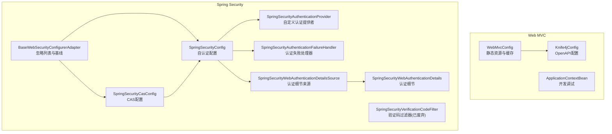
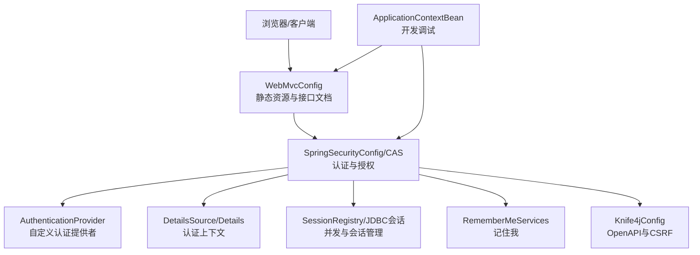
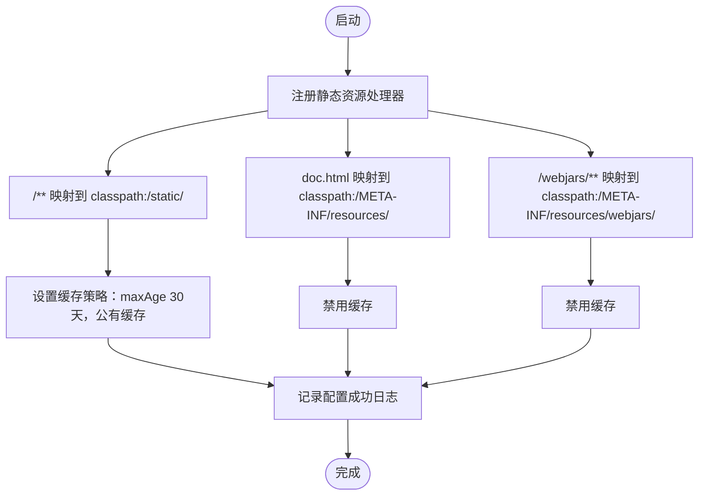
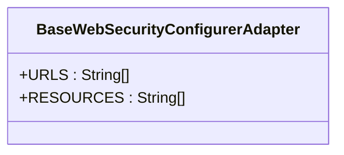
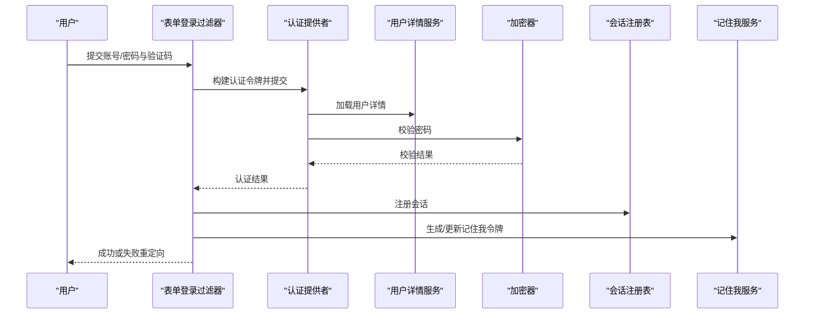
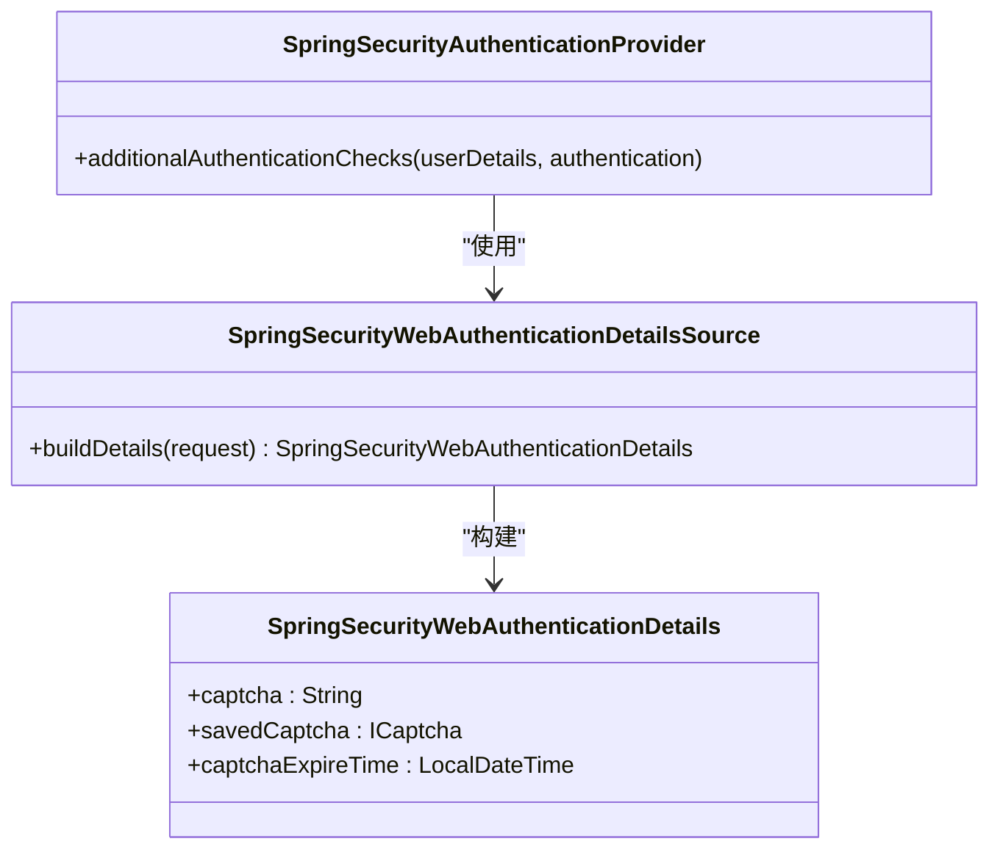
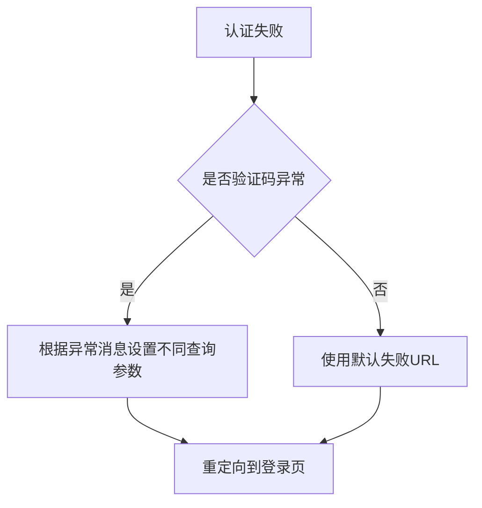
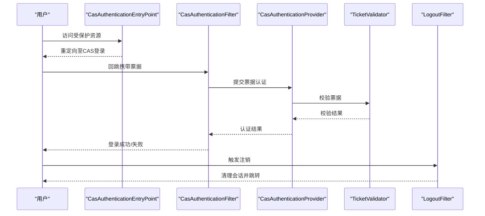
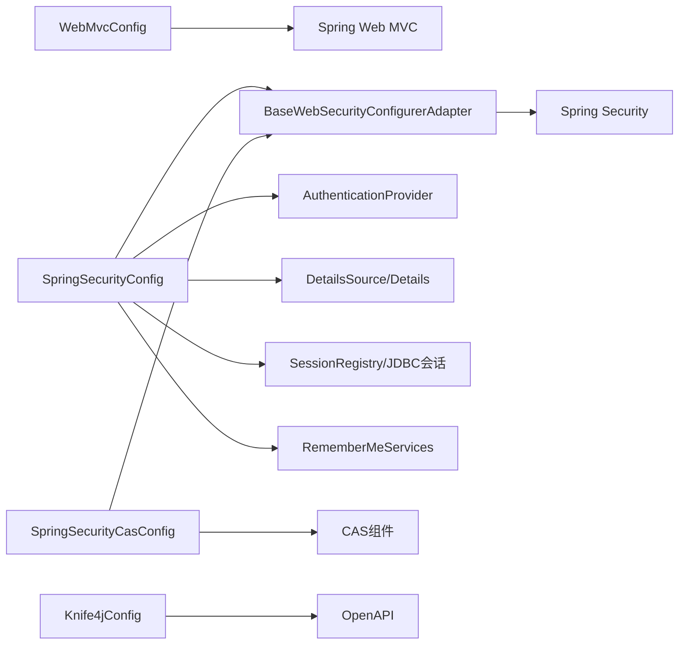

# Web MVC配置

<cite>
**本文引用的文件**   
- [WebMvcConfig.java](file://phoenix-ui/src/main/java/com/gitee/pifeng/monitoring/ui/config/WebMvcConfig.java)
- [BaseWebSecurityConfigurerAdapter.java](file://phoenix-ui/src/main/java/com/gitee/pifeng/monitoring/ui/config/springsecurity/BaseWebSecurityConfigurerAdapter.java)
- [SpringSecurityConfig.java](file://phoenix-ui/src/main/java/com/gitee/pifeng/monitoring/ui/config/springsecurity/SpringSecurityConfig.java)
- [SpringSecurityAuthenticationProvider.java](file://phoenix-ui/src/main/java/com/gitee/pifeng/monitoring/ui/config/springsecurity/SpringSecurityAuthenticationProvider.java)
- [SpringSecurityAuthenticationFailureHandler.java](file://phoenix-ui/src/main/java/com/gitee/pifeng/monitoring/ui/config/springsecurity/SpringSecurityAuthenticationFailureHandler.java)
- [SpringSecurityVerificationCodeFilter.java](file://phoenix-ui/src/main/java/com/gitee/pifeng/monitoring/ui/config/springsecurity/SpringSecurityVerificationCodeFilter.java)
- [SpringSecurityWebAuthenticationDetails.java](file://phoenix-ui/src/main/java/com/gitee/pifeng/monitoring/ui/config/springsecurity/SpringSecurityWebAuthenticationDetails.java)
- [SpringSecurityWebAuthenticationDetailsSource.java](file://phoenix-ui/src/main/java/com/gitee/pifeng/monitoring/ui/config/springsecurity/SpringSecurityWebAuthenticationDetailsSource.java)
- [SpringSecurityCasConfig.java](file://phoenix-ui/src/main/java/com/gitee/pifeng/monitoring/ui/config/springsecurity/SpringSecurityCasConfig.java)
- [Knife4jConfig.java](file://phoenix-ui/src/main/java/com/gitee/pifeng/monitoring/ui/config/Knife4jConfig.java)
- [ApplicationContextBean.java](file://phoenix-ui/src/main/java/com/gitee/pifeng/monitoring/ui/config/ApplicationContextBean.java)
- [ControllerExceptionHandlerAdvice.java](file://phoenix-ui/src/main/java/com/gitee/pifeng/monitoring/ui/business/web/component/ControllerExceptionHandlerAdvice.java)
</cite>

## 目录
1. [简介](#简介)
2. [项目结构](#项目结构)
3. [核心组件](#核心组件)
4. [架构总览](#架构总览)
5. [详细组件分析](#详细组件分析)
6. [依赖分析](#依赖分析)
7. [性能考虑](#性能考虑)
8. [故障排查指南](#故障排查指南)
9. [结论](#结论)
10. [附录](#附录)

## 简介
本文件面向Phoenix UI模块的Web MVC与Spring Security配置，系统性梳理以下主题：
- WebMvcConfig：静态资源处理、缓存策略与接口文档资源映射
- Spring Security安全配置：认证提供者、授权规则、会话管理、记住我、密码加密策略
- BaseWebSecurityConfigurerAdapter：抽象适配器设计与扩展点
- 自定义拦截器、过滤器、异常处理器的实现思路与最佳实践
- 性能优化：缓存、压缩、并发与会话策略

## 项目结构
Phoenix UI的Web层配置集中在config包下，按职责划分为：
- Web MVC配置：WebMvcConfig（静态资源与接口文档）
- Spring Security配置：BaseWebSecurityConfigurerAdapter、SpringSecurityConfig、SpringSecurityCasConfig、认证提供者与细节对象
- 文档与工具：Knife4jConfig（OpenAPI集成）、ApplicationContextBean（开发调试）

图表来源
- [WebMvcConfig.java:1-56](file://phoenix-ui/src/main/java/com/gitee/pifeng/monitoring/ui/config/WebMvcConfig.java#L1-L56)
- [BaseWebSecurityConfigurerAdapter.java:1-52](file://phoenix-ui/src/main/java/com/gitee/pifeng/monitoring/ui/config/springsecurity/BaseWebSecurityConfigurerAdapter.java#L1-L52)
- [SpringSecurityConfig.java:1-236](file://phoenix-ui/src/main/java/com/gitee/pifeng/monitoring/ui/config/springsecurity/SpringSecurityConfig.java#L1-L236)
- [SpringSecurityCasConfig.java:1-318](file://phoenix-ui/src/main/java/com/gitee/pifeng/monitoring/ui/config/springsecurity/SpringSecurityCasConfig.java#L1-L318)
- [SpringSecurityAuthenticationProvider.java:1-94](file://phoenix-ui/src/main/java/com/gitee/pifeng/monitoring/ui/config/springsecurity/SpringSecurityAuthenticationProvider.java#L1-L94)
- [SpringSecurityAuthenticationFailureHandler.java:1-67](file://phoenix-ui/src/main/java/com/gitee/pifeng/monitoring/ui/config/springsecurity/SpringSecurityAuthenticationFailureHandler.java#L1-L67)
- [SpringSecurityVerificationCodeFilter.java:1-100](file://phoenix-ui/src/main/java/com/gitee/pifeng/monitoring/ui/config/springsecurity/SpringSecurityVerificationCodeFilter.java#L1-L100)
- [SpringSecurityWebAuthenticationDetails.java:1-65](file://phoenix-ui/src/main/java/com/gitee/pifeng/monitoring/ui/config/springsecurity/SpringSecurityWebAuthenticationDetails.java#L1-L65)
- [SpringSecurityWebAuthenticationDetailsSource.java:1-27](file://phoenix-ui/src/main/java/com/gitee/pifeng/monitoring/ui/config/springsecurity/SpringSecurityWebAuthenticationDetailsSource.java#L1-L27)
- [Knife4jConfig.java:1-64](file://phoenix-ui/src/main/java/com/gitee/pifeng/monitoring/ui/config/Knife4jConfig.java#L1-L64)
- [ApplicationContextBean.java:1-63](file://phoenix-ui/src/main/java/com/gitee/pifeng/monitoring/ui/config/ApplicationContextBean.java#L1-L63)

章节来源
- [WebMvcConfig.java:1-56](file://phoenix-ui/src/main/java/com/gitee/pifeng/monitoring/ui/config/WebMvcConfig.java#L1-L56)
- [BaseWebSecurityConfigurerAdapter.java:1-52](file://phoenix-ui/src/main/java/com/gitee/pifeng/monitoring/ui/config/springsecurity/BaseWebSecurityConfigurerAdapter.java#L1-L52)
- [SpringSecurityConfig.java:1-236](file://phoenix-ui/src/main/java/com/gitee/pifeng/monitoring/ui/config/springsecurity/SpringSecurityConfig.java#L1-L236)
- [SpringSecurityCasConfig.java:1-318](file://phoenix-ui/src/main/java/com/gitee/pifeng/monitoring/ui/config/springsecurity/SpringSecurityCasConfig.java#L1-L318)
- [SpringSecurityAuthenticationProvider.java:1-94](file://phoenix-ui/src/main/java/com/gitee/pifeng/monitoring/ui/config/springsecurity/SpringSecurityAuthenticationProvider.java#L1-L94)
- [SpringSecurityAuthenticationFailureHandler.java:1-67](file://phoenix-ui/src/main/java/com/gitee/pifeng/monitoring/ui/config/springsecurity/SpringSecurityAuthenticationFailureHandler.java#L1-L67)
- [SpringSecurityVerificationCodeFilter.java:1-100](file://phoenix-ui/src/main/java/com/gitee/pifeng/monitoring/ui/config/springsecurity/SpringSecurityVerificationCodeFilter.java#L1-L100)
- [SpringSecurityWebAuthenticationDetails.java:1-65](file://phoenix-ui/src/main/java/com/gitee/pifeng/monitoring/ui/config/springsecurity/SpringSecurityWebAuthenticationDetails.java#L1-L65)
- [SpringSecurityWebAuthenticationDetailsSource.java:1-27](file://phoenix-ui/src/main/java/com/gitee/pifeng/monitoring/ui/config/springsecurity/SpringSecurityWebAuthenticationDetailsSource.java#L1-L27)
- [Knife4jConfig.java:1-64](file://phoenix-ui/src/main/java/com/gitee/pifeng/monitoring/ui/config/Knife4jConfig.java#L1-L64)
- [ApplicationContextBean.java:1-63](file://phoenix-ui/src/main/java/com/gitee/pifeng/monitoring/ui/config/ApplicationContextBean.java#L1-L63)

## 核心组件
- WebMvcConfig：生产环境专用的静态资源缓存策略与接口文档资源映射，确保前端资源长期缓存、接口文档可访问且不缓存
- BaseWebSecurityConfigurerAdapter：定义忽略URL与静态资源列表，作为自认证与CAS配置的共同基线
- SpringSecurityConfig：自认证模式下的安全配置，含认证提供者、登录流程、会话并发、记住我、密码加密与持久化token
- SpringSecurityCasConfig：CAS第三方认证模式下的安全配置，含入口、过滤器、提供者与单点登出
- 认证提供者与细节：SpringSecurityAuthenticationProvider负责额外校验（如验证码），SpringSecurityWebAuthenticationDetails与DetailsSource承载认证上下文
- 异常处理：ControllerExceptionHandlerAdvice统一处理控制器异常；SpringSecurityAuthenticationFailureHandler将验证码错误映射到登录页参数
- 文档与工具：Knife4jConfig提供OpenAPI与CSRF安全方案；ApplicationContextBean在开发环境打印Bean清单便于调试

章节来源
- [WebMvcConfig.java:23-53](file://phoenix-ui/src/main/java/com/gitee/pifeng/monitoring/ui/config/WebMvcConfig.java#L23-L53)
- [BaseWebSecurityConfigurerAdapter.java:13-51](file://phoenix-ui/src/main/java/com/gitee/pifeng/monitoring/ui/config/springsecurity/BaseWebSecurityConfigurerAdapter.java#L13-L51)
- [SpringSecurityConfig.java:39-235](file://phoenix-ui/src/main/java/com/gitee/pifeng/monitoring/ui/config/springsecurity/SpringSecurityConfig.java#L39-L235)
- [SpringSecurityCasConfig.java:48-317](file://phoenix-ui/src/main/java/com/gitee/pifeng/monitoring/ui/config/springsecurity/SpringSecurityCasConfig.java#L48-L317)
- [SpringSecurityAuthenticationProvider.java:30-91](file://phoenix-ui/src/main/java/com/gitee/pifeng/monitoring/ui/config/springsecurity/SpringSecurityAuthenticationProvider.java#L30-L91)
- [SpringSecurityWebAuthenticationDetails.java:21-62](file://phoenix-ui/src/main/java/com/gitee/pifeng/monitoring/ui/config/springsecurity/SpringSecurityWebAuthenticationDetails.java#L21-L62)
- [SpringSecurityWebAuthenticationDetailsSource.java:19-24](file://phoenix-ui/src/main/java/com/gitee/pifeng/monitoring/ui/config/springsecurity/SpringSecurityWebAuthenticationDetailsSource.java#L19-L24)
- [SpringSecurityAuthenticationFailureHandler.java:25-64](file://phoenix-ui/src/main/java/com/gitee/pifeng/monitoring/ui/config/springsecurity/SpringSecurityAuthenticationFailureHandler.java#L25-L64)
- [Knife4jConfig.java:30-61](file://phoenix-ui/src/main/java/com/gitee/pifeng/monitoring/ui/config/Knife4jConfig.java#L30-L61)
- [ApplicationContextBean.java:25-60](file://phoenix-ui/src/main/java/com/gitee/pifeng/monitoring/ui/config/ApplicationContextBean.java#L25-L60)

## 架构总览
Web层由Web MVC与Spring Security两大子系统协同工作：
- Web MVC负责静态资源与接口文档的暴露与缓存
- Spring Security负责认证、授权、会话与安全细节（验证码、记住我、持久化token）
- 两种认证模式（自认证与CAS）共享BaseWebSecurityConfigurerAdapter的忽略规则

图表来源
- [WebMvcConfig.java:34-53](file://phoenix-ui/src/main/java/com/gitee/pifeng/monitoring/ui/config/WebMvcConfig.java#L34-L53)
- [SpringSecurityConfig.java:80-166](file://phoenix-ui/src/main/java/com/gitee/pifeng/monitoring/ui/config/springsecurity/SpringSecurityConfig.java#L80-L166)
- [SpringSecurityCasConfig.java:81-143](file://phoenix-ui/src/main/java/com/gitee/pifeng/monitoring/ui/config/springsecurity/SpringSecurityCasConfig.java#L81-L143)
- [SpringSecurityAuthenticationProvider.java:48-91](file://phoenix-ui/src/main/java/com/gitee/pifeng/monitoring/ui/config/springsecurity/SpringSecurityAuthenticationProvider.java#L48-L91)
- [SpringSecurityWebAuthenticationDetailsSource.java:22-24](file://phoenix-ui/src/main/java/com/gitee/pifeng/monitoring/ui/config/springsecurity/SpringSecurityWebAuthenticationDetailsSource.java#L22-L24)
- [SpringSecurityWebAuthenticationDetails.java:49-62](file://phoenix-ui/src/main/java/com/gitee/pifeng/monitoring/ui/config/springsecurity/SpringSecurityWebAuthenticationDetails.java#L49-L62)
- [SpringSecurityConfig.java:230-233](file://phoenix-ui/src/main/java/com/gitee/pifeng/monitoring/ui/config/springsecurity/SpringSecurityConfig.java#L230-L233)
- [SpringSecurityConfig.java:191-198](file://phoenix-ui/src/main/java/com/gitee/pifeng/monitoring/ui/config/springsecurity/SpringSecurityConfig.java#L191-L198)
- [Knife4jConfig.java:43-61](file://phoenix-ui/src/main/java/com/gitee/pifeng/monitoring/ui/config/Knife4jConfig.java#L43-L61)
- [ApplicationContextBean.java:40-60](file://phoenix-ui/src/main/java/com/gitee/pifeng/monitoring/ui/config/ApplicationContextBean.java#L40-L60)

## 详细组件分析

### WebMvcConfig：静态资源与接口文档
- 静态资源映射：对classpath:/static/下的/**进行长期缓存（30天公有缓存）
- 接口文档资源：doc.html与/webjars/**不缓存，确保Swagger/Knife4j界面可正确加载
- 生产环境限定：仅在prod profile生效

图表来源
- [WebMvcConfig.java:34-53](file://phoenix-ui/src/main/java/com/gitee/pifeng/monitoring/ui/config/WebMvcConfig.java#L34-L53)

章节来源
- [WebMvcConfig.java:23-53](file://phoenix-ui/src/main/java/com/gitee/pifeng/monitoring/ui/config/WebMvcConfig.java#L23-L53)

### BaseWebSecurityConfigurerAdapter：抽象适配器与扩展点
- 忽略URL：关闭端点与健康端点
- 忽略静态资源：图片、JS、Layui、Lib、Modules、Style、Tpl、配置文件与图标等
- 设计意图：为自认证与CAS配置提供一致的忽略规则基线，便于扩展

图表来源
- [BaseWebSecurityConfigurerAdapter.java:18-49](file://phoenix-ui/src/main/java/com/gitee/pifeng/monitoring/ui/config/springsecurity/BaseWebSecurityConfigurerAdapter.java#L18-L49)

章节来源
- [BaseWebSecurityConfigurerAdapter.java:13-51](file://phoenix-ui/src/main/java/com/gitee/pifeng/monitoring/ui/config/springsecurity/BaseWebSecurityConfigurerAdapter.java#L13-L51)

### SpringSecurityConfig：自认证安全配置
- 全局忽略：静态资源与特定URL
- 认证提供者：使用自定义SpringSecurityAuthenticationProvider
- 授权规则：登录、注销、登录处理、验证码接口放行；其余请求需认证
- 登录流程：用户名/密码参数名、登录页、登录处理URL、成功/失败回调
- 会话管理：超时跳转、并发会话控制（最大会话数-1表示不限制，旧用户被踢出后跳转）
- 记住我：基于Spring Session的RememberMeServices，有效期约30天
- 持久化token：JdbcTokenRepositoryImpl，数据源来自外部注入
- 密码加密：BCryptPasswordEncoder
- 安全头：禁用缓存控制与frameOptions

图表来源
- [SpringSecurityConfig.java:96-100](file://phoenix-ui/src/main/java/com/gitee/pifeng/monitoring/ui/config/springsecurity/SpringSecurityConfig.java#L96-L100)
- [SpringSecurityAuthenticationProvider.java:63-91](file://phoenix-ui/src/main/java/com/gitee/pifeng/monitoring/ui/config/springsecurity/SpringSecurityAuthenticationProvider.java#L63-L91)
- [SpringSecurityConfig.java:112-166](file://phoenix-ui/src/main/java/com/gitee/pifeng/monitoring/ui/config/springsecurity/SpringSecurityConfig.java#L112-L166)
- [SpringSecurityConfig.java:140-149](file://phoenix-ui/src/main/java/com/gitee/pifeng/monitoring/ui/config/springsecurity/SpringSecurityConfig.java#L140-L149)
- [SpringSecurityConfig.java:191-198](file://phoenix-ui/src/main/java/com/gitee/pifeng/monitoring/ui/config/springsecurity/SpringSecurityConfig.java#L191-L198)
- [SpringSecurityConfig.java:211-219](file://phoenix-ui/src/main/java/com/gitee/pifeng/monitoring/ui/config/springsecurity/SpringSecurityConfig.java#L211-L219)
- [SpringSecurityConfig.java:230-233](file://phoenix-ui/src/main/java/com/gitee/pifeng/monitoring/ui/config/springsecurity/SpringSecurityConfig.java#L230-L233)

章节来源
- [SpringSecurityConfig.java:80-166](file://phoenix-ui/src/main/java/com/gitee/pifeng/monitoring/ui/config/springsecurity/SpringSecurityConfig.java#L80-L166)
- [SpringSecurityAuthenticationProvider.java:30-91](file://phoenix-ui/src/main/java/com/gitee/pifeng/monitoring/ui/config/springsecurity/SpringSecurityAuthenticationProvider.java#L30-L91)

### SpringSecurityAuthenticationProvider：自定义认证提供者
- 额外校验：当启用登录验证码时，从认证细节中读取用户输入与保存的验证码、过期时间，执行非空、存在、过期与校验一致性判断
- 密码校验：通过父类DaoAuthenticationProvider完成
- 与DetailsSource/Details协作：将验证码与过期时间封装进认证细节，供提供者读取

图表来源
- [SpringSecurityAuthenticationProvider.java:30-91](file://phoenix-ui/src/main/java/com/gitee/pifeng/monitoring/ui/config/springsecurity/SpringSecurityAuthenticationProvider.java#L30-L91)
- [SpringSecurityWebAuthenticationDetailsSource.java:19-24](file://phoenix-ui/src/main/java/com/gitee/pifeng/monitoring/ui/config/springsecurity/SpringSecurityWebAuthenticationDetailsSource.java#L19-L24)
- [SpringSecurityWebAuthenticationDetails.java:21-62](file://phoenix-ui/src/main/java/com/gitee/pifeng/monitoring/ui/config/springsecurity/SpringSecurityWebAuthenticationDetails.java#L21-L62)

章节来源
- [SpringSecurityAuthenticationProvider.java:30-91](file://phoenix-ui/src/main/java/com/gitee/pifeng/monitoring/ui/config/springsecurity/SpringSecurityAuthenticationProvider.java#L30-L91)
- [SpringSecurityWebAuthenticationDetailsSource.java:19-24](file://phoenix-ui/src/main/java/com/gitee/pifeng/monitoring/ui/config/springsecurity/SpringSecurityWebAuthenticationDetailsSource.java#L19-L24)
- [SpringSecurityWebAuthenticationDetails.java:21-62](file://phoenix-ui/src/main/java/com/gitee/pifeng/monitoring/ui/config/springsecurity/SpringSecurityWebAuthenticationDetails.java#L21-L62)

### SpringSecurityAuthenticationFailureHandler：认证失败处理器
- 将验证码相关异常映射为登录页的不同查询参数，便于前端展示对应提示
- 其他认证异常走默认失败URL

图表来源
- [SpringSecurityAuthenticationFailureHandler.java:38-64](file://phoenix-ui/src/main/java/com/gitee/pifeng/monitoring/ui/config/springsecurity/SpringSecurityAuthenticationFailureHandler.java#L38-L64)

章节来源
- [SpringSecurityAuthenticationFailureHandler.java:25-64](file://phoenix-ui/src/main/java/com/gitee/pifeng/monitoring/ui/config/springsecurity/SpringSecurityAuthenticationFailureHandler.java#L25-L64)

### SpringSecurityVerificationCodeFilter：验证码过滤器（已废弃）
- 曾在登录前校验验证码，现已由自定义认证提供者更优雅地实现
- 仍保留以兼容历史逻辑或迁移阶段

章节来源
- [SpringSecurityVerificationCodeFilter.java:26-61](file://phoenix-ui/src/main/java/com/gitee/pifeng/monitoring/ui/config/springsecurity/SpringSecurityVerificationCodeFilter.java#L26-L61)

### SpringSecurityCasConfig：CAS第三方认证
- 入口与过滤器：CasAuthenticationEntryPoint、CasAuthenticationFilter、SingleSignOutFilter、LogoutFilter
- 提供者与验证器：CasAuthenticationProvider、TicketValidator（支持CAS/CAS3）
- 会话与持久化：基于Spring Session的SessionRegistry与JdbcTokenRepositoryImpl
- 授权规则：所有请求需认证，表单登录与注销放行

图表来源
- [SpringSecurityCasConfig.java:114-143](file://phoenix-ui/src/main/java/com/gitee/pifeng/monitoring/ui/config/springsecurity/SpringSecurityCasConfig.java#L114-L143)
- [SpringSecurityCasConfig.java:154-199](file://phoenix-ui/src/main/java/com/gitee/pifeng/monitoring/ui/config/springsecurity/SpringSecurityCasConfig.java#L154-L199)
- [SpringSecurityCasConfig.java:210-248](file://phoenix-ui/src/main/java/com/gitee/pifeng/monitoring/ui/config/springsecurity/SpringSecurityCasConfig.java#L210-L248)
- [SpringSecurityCasConfig.java:259-280](file://phoenix-ui/src/main/java/com/gitee/pifeng/monitoring/ui/config/springsecurity/SpringSecurityCasConfig.java#L259-L280)

章节来源
- [SpringSecurityCasConfig.java:81-143](file://phoenix-ui/src/main/java/com/gitee/pifeng/monitoring/ui/config/springsecurity/SpringSecurityCasConfig.java#L81-L143)
- [SpringSecurityCasConfig.java:154-248](file://phoenix-ui/src/main/java/com/gitee/pifeng/monitoring/ui/config/springsecurity/SpringSecurityCasConfig.java#L154-L248)
- [SpringSecurityCasConfig.java:259-301](file://phoenix-ui/src/main/java/com/gitee/pifeng/monitoring/ui/config/springsecurity/SpringSecurityCasConfig.java#L259-L301)

### Knife4jConfig：OpenAPI与CSRF安全方案
- 配置OpenAPI基本信息与安全方案（API Key方式的X-CSRF-TOKEN）
- 与WebMvcConfig配合，确保接口文档页面可访问且不受缓存影响

章节来源
- [Knife4jConfig.java:30-61](file://phoenix-ui/src/main/java/com/gitee/pifeng/monitoring/ui/config/Knife4jConfig.java#L30-L61)

### ApplicationContextBean：开发调试辅助
- 在dev profile下打印IoC容器中所有Bean名称，便于定位组件与排查问题

章节来源
- [ApplicationContextBean.java:25-60](file://phoenix-ui/src/main/java/com/gitee/pifeng/monitoring/ui/config/ApplicationContextBean.java#L25-L60)

## 依赖分析
- WebMvcConfig依赖于Spring Web MVC的ResourceHandlerRegistry，面向静态资源与接口文档
- SpringSecurityConfig与SpringSecurityCasConfig均继承BaseWebSecurityConfigurerAdapter，复用忽略规则
- 认证提供者依赖用户详情服务与密码编码器，与DetailsSource/Details形成认证上下文闭环
- 会话管理依赖Spring Session的JDBC会话存储与SessionRegistry
- 记住我服务依赖Spring Session的RememberMeServices与JdbcTokenRepositoryImpl

图表来源
- [WebMvcConfig.java:34-53](file://phoenix-ui/src/main/java/com/gitee/pifeng/monitoring/ui/config/WebMvcConfig.java#L34-L53)
- [BaseWebSecurityConfigurerAdapter.java:18-49](file://phoenix-ui/src/main/java/com/gitee/pifeng/monitoring/ui/config/springsecurity/BaseWebSecurityConfigurerAdapter.java#L18-L49)
- [SpringSecurityConfig.java:96-100](file://phoenix-ui/src/main/java/com/gitee/pifeng/monitoring/ui/config/springsecurity/SpringSecurityConfig.java#L96-L100)
- [SpringSecurityCasConfig.java:210-248](file://phoenix-ui/src/main/java/com/gitee/pifeng/monitoring/ui/config/springsecurity/SpringSecurityCasConfig.java#L210-L248)

章节来源
- [WebMvcConfig.java:34-53](file://phoenix-ui/src/main/java/com/gitee/pifeng/monitoring/ui/config/WebMvcConfig.java#L34-L53)
- [BaseWebSecurityConfigurerAdapter.java:18-49](file://phoenix-ui/src/main/java/com/gitee/pifeng/monitoring/ui/config/springsecurity/BaseWebSecurityConfigurerAdapter.java#L18-L49)
- [SpringSecurityConfig.java:96-100](file://phoenix-ui/src/main/java/com/gitee/pifeng/monitoring/ui/config/springsecurity/SpringSecurityConfig.java#L96-L100)
- [SpringSecurityCasConfig.java:210-248](file://phoenix-ui/src/main/java/com/gitee/pifeng/monitoring/ui/config/springsecurity/SpringSecurityCasConfig.java#L210-L248)

## 性能考虑
- 静态资源缓存：生产环境对静态资源设置长期缓存，显著降低带宽与服务器压力
- 会话并发：通过Spring Session与SessionRegistry实现并发控制，避免重复登录挤占会话
- 记住我：基于Spring Session的RememberMeServices，减少频繁登录带来的认证开销
- 密码加密：BCrypt具备足够安全性与合理成本，兼顾性能与安全
- 接口文档：doc.html与/webjars/**不缓存，保证文档更新即时可见

章节来源
- [WebMvcConfig.java:37-39](file://phoenix-ui/src/main/java/com/gitee/pifeng/monitoring/ui/config/WebMvcConfig.java#L37-L39)
- [SpringSecurityConfig.java:140-149](file://phoenix-ui/src/main/java/com/gitee/pifeng/monitoring/ui/config/springsecurity/SpringSecurityConfig.java#L140-L149)
- [SpringSecurityConfig.java:191-198](file://phoenix-ui/src/main/java/com/gitee/pifeng/monitoring/ui/config/springsecurity/SpringSecurityConfig.java#L191-L198)
- [SpringSecurityConfig.java:177-180](file://phoenix-ui/src/main/java/com/gitee/pifeng/monitoring/ui/config/springsecurity/SpringSecurityConfig.java#L177-L180)

## 故障排查指南
- 登录失败与验证码问题：检查SpringSecurityAuthenticationFailureHandler是否正确映射验证码异常到登录页参数
- 验证码校验失败：确认SpringSecurityAuthenticationProvider在additionalAuthenticationChecks中对验证码与过期时间的判断逻辑
- 会话并发冲突：检查maximumSessions与maxSessionsPreventsLogin配置，确认SessionRegistry是否正确注册
- 记住我无效：确认RememberMeServices与JdbcTokenRepositoryImpl配置正确，数据源可用
- 接口文档404：确认WebMvcConfig对doc.html与/webjars/**的映射与缓存策略
- CAS登录异常：核对CasAuthenticationEntryPoint、CasAuthenticationFilter与TicketValidator配置

章节来源
- [SpringSecurityAuthenticationFailureHandler.java:38-64](file://phoenix-ui/src/main/java/com/gitee/pifeng/monitoring/ui/config/springsecurity/SpringSecurityAuthenticationFailureHandler.java#L38-L64)
- [SpringSecurityAuthenticationProvider.java:63-91](file://phoenix-ui/src/main/java/com/gitee/pifeng/monitoring/ui/config/springsecurity/SpringSecurityAuthenticationProvider.java#L63-L91)
- [SpringSecurityConfig.java:140-149](file://phoenix-ui/src/main/java/com/gitee/pifeng/monitoring/ui/config/springsecurity/SpringSecurityConfig.java#L140-L149)
- [SpringSecurityConfig.java:191-198](file://phoenix-ui/src/main/java/com/gitee/pifeng/monitoring/ui/config/springsecurity/SpringSecurityConfig.java#L191-L198)
- [WebMvcConfig.java:45-51](file://phoenix-ui/src/main/java/com/gitee/pifeng/monitoring/ui/config/WebMvcConfig.java#L45-L51)
- [SpringSecurityCasConfig.java:154-199](file://phoenix-ui/src/main/java/com/gitee/pifeng/monitoring/ui/config/springsecurity/SpringSecurityCasConfig.java#L154-L199)

## 结论
本配置体系以WebMvcConfig与BaseWebSecurityConfigurerAdapter为核心，分别覆盖Web层静态资源与安全基线；SpringSecurityConfig与SpringSecurityCasConfig分别支撑自认证与CAS两种认证模式，提供完善的认证、授权、会话与安全细节处理。通过长期缓存、并发会话控制、记住我与BCrypt加密等手段，兼顾性能与安全。

## 附录
- 自定义拦截器：建议在WebMvcConfigurer中注册拦截器，并在configure方法中设置拦截路径与排除规则
- 自定义过滤器：可参考SpringSecurityVerificationCodeFilter的实现思路，注意与Spring Security过滤器链的顺序与条件
- 异常处理器：ControllerExceptionHandlerAdvice提供统一异常处理模板，结合SpringSecurityAuthenticationFailureHandler实现登录异常的友好提示

章节来源
- [ControllerExceptionHandlerAdvice.java](file://phoenix-ui/src/main/java/com/gitee/pifeng/monitoring/ui/business/web/component/ControllerExceptionHandlerAdvice.java)