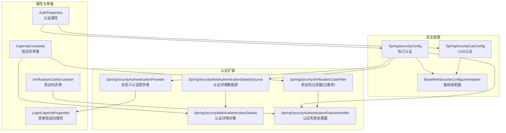
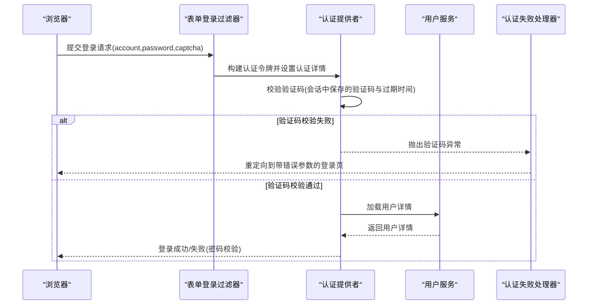
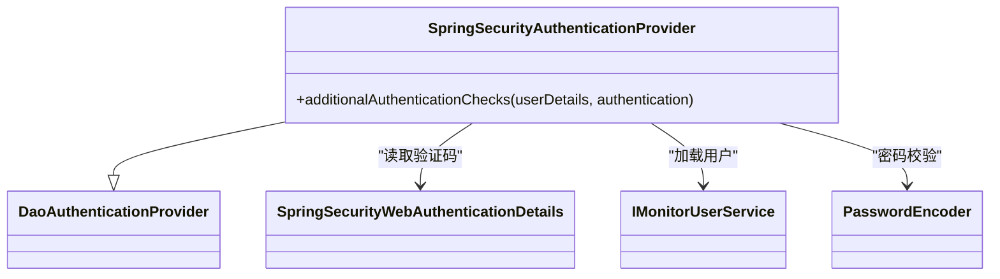
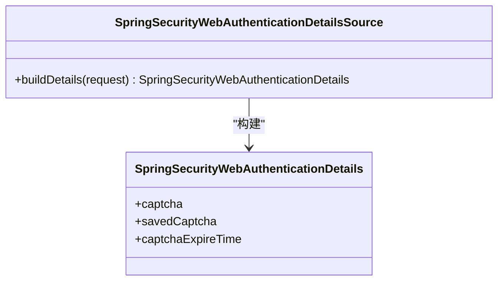
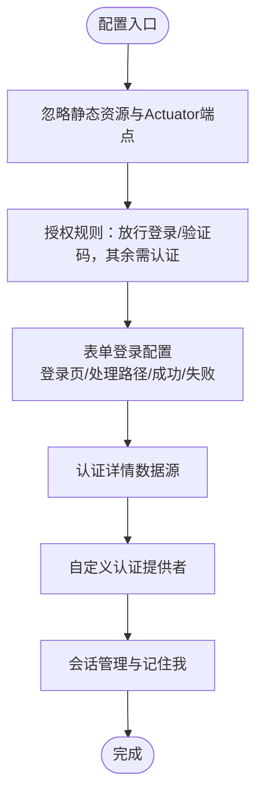
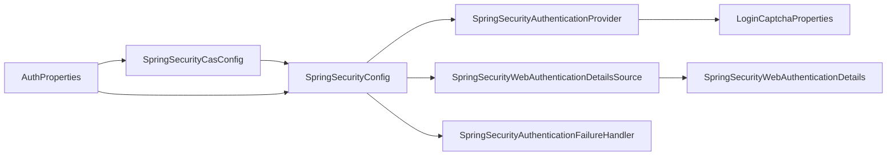

# 安全认证配置

<cite>
**本文引用的文件**
- [SpringSecurityConfig.java](file://phoenix-ui/src/main/java/com/gitee/pifeng/monitoring/ui/config/springsecurity/SpringSecurityConfig.java)
- [SpringSecurityAuthenticationProvider.java](file://phoenix-ui/src/main/java/com/gitee/pifeng/monitoring/ui/config/springsecurity/SpringSecurityAuthenticationProvider.java)
- [SpringSecurityWebAuthenticationDetails.java](file://phoenix-ui/src/main/java/com/gitee/pifeng/monitoring/ui/config/springsecurity/SpringSecurityWebAuthenticationDetails.java)
- [SpringSecurityWebAuthenticationDetailsSource.java](file://phoenix-ui/src/main/java/com/gitee/pifeng/monitoring/ui/config/springsecurity/SpringSecurityWebAuthenticationDetailsSource.java)
- [SpringSecurityAuthenticationFailureHandler.java](file://phoenix-ui/src/main/java/com/gitee/pifeng/monitoring/ui/config/springsecurity/SpringSecurityAuthenticationFailureHandler.java)
- [SpringSecurityVerificationCodeFilter.java](file://phoenix-ui/src/main/java/com/gitee/pifeng/monitoring/ui/config/springsecurity/SpringSecurityVerificationCodeFilter.java)
- [BaseWebSecurityConfigurerAdapter.java](file://phoenix-ui/src/main/java/com/gitee/pifeng/monitoring/ui/config/springsecurity/BaseWebSecurityConfigurerAdapter.java)
- [SpringSecurityCasConfig.java](file://phoenix-ui/src/main/java/com/gitee/pifeng/monitoring/ui/config/springsecurity/SpringSecurityCasConfig.java)
- [AuthProperties.java](file://phoenix-ui/src/main/java/com/gitee/pifeng/monitoring/ui/property/auth/AuthProperties.java)
- [LoginCaptchaProperties.java](file://phoenix-ui/src/main/java/com/gitee/pifeng/monitoring/ui/property/auth/selfauth/LoginCaptchaProperties.java)
- [CaptchaConstants.java](file://phoenix-ui/src/main/java/com/gitee/pifeng/monitoring/ui/constant/CaptchaConstants.java)
- [VerificationCodeException.java](file://phoenix-ui/src/main/java/com/gitee/pifeng/monitoring/ui/exception/VerificationCodeException.java)
- [application.yml](file://phoenix-ui/src/main/resources/application.yml)
</cite>

## 目录
1. [简介](#简介)
2. [项目结构](#项目结构)
3. [核心组件](#核心组件)
4. [架构总览](#架构总览)
5. [详细组件分析](#详细组件分析)
6. [依赖分析](#依赖分析)
7. [性能考量](#性能考量)
8. [故障排查指南](#故障排查指南)
9. [结论](#结论)
10. [附录](#附录)

## 简介
本技术文档围绕 Phoenix UI 模块的安全认证配置展开，系统性解析 Spring Security 的安全架构与实现细节，涵盖认证配置、授权规则、会话管理、密码编码策略、验证码校验、第三方 CAS 认证等主题。同时提供多种认证方式的配置示例思路与安全最佳实践，帮助读者快速理解并扩展安全体系。

## 项目结构
Phoenix UI 的安全配置位于 springsecurity 包内，采用“按场景分配置类”的组织方式：
- 自己认证模式：基于用户名密码 + 验证码的自定义认证流程
- 第三方认证模式：基于 CAS 的单点登录集成
- 基础适配器：统一忽略规则与静态资源
- 验证码与异常处理：独立的工具类与异常模型

图表来源
- [SpringSecurityConfig.java:1-236](file://phoenix-ui/src/main/java/com/gitee/pifeng/monitoring/ui/config/springsecurity/SpringSecurityConfig.java#L1-L236)
- [SpringSecurityCasConfig.java:1-318](file://phoenix-ui/src/main/java/com/gitee/pifeng/monitoring/ui/config/springsecurity/SpringSecurityCasConfig.java#L1-L318)
- [BaseWebSecurityConfigurerAdapter.java:1-52](file://phoenix-ui/src/main/java/com/gitee/pifeng/monitoring/ui/config/springsecurity/BaseWebSecurityConfigurerAdapter.java#L1-L52)
- [SpringSecurityAuthenticationProvider.java:1-94](file://phoenix-ui/src/main/java/com/gitee/pifeng/monitoring/ui/config/springsecurity/SpringSecurityAuthenticationProvider.java#L1-L94)
- [SpringSecurityWebAuthenticationDetailsSource.java:1-27](file://phoenix-ui/src/main/java/com/gitee/pifeng/monitoring/ui/config/springsecurity/SpringSecurityWebAuthenticationDetailsSource.java#L1-L27)
- [SpringSecurityWebAuthenticationDetails.java:1-65](file://phoenix-ui/src/main/java/com/gitee/pifeng/monitoring/ui/config/springsecurity/SpringSecurityWebAuthenticationDetails.java#L1-L65)
- [SpringSecurityVerificationCodeFilter.java:1-100](file://phoenix-ui/src/main/java/com/gitee/pifeng/monitoring/ui/config/springsecurity/SpringSecurityVerificationCodeFilter.java#L1-L100)
- [SpringSecurityAuthenticationFailureHandler.java:1-67](file://phoenix-ui/src/main/java/com/gitee/pifeng/monitoring/ui/config/springsecurity/SpringSecurityAuthenticationFailureHandler.java#L1-L67)
- [AuthProperties.java:1-27](file://phoenix-ui/src/main/java/com/gitee/pifeng/monitoring/ui/property/auth/AuthProperties.java#L1-L27)
- [LoginCaptchaProperties.java:1-24](file://phoenix-ui/src/main/java/com/gitee/pifeng/monitoring/ui/property/auth/selfauth/LoginCaptchaProperties.java#L1-L24)
- [CaptchaConstants.java:1-24](file://phoenix-ui/src/main/java/com/gitee/pifeng/monitoring/ui/constant/CaptchaConstants.java#L1-L24)
- [VerificationCodeException.java:1-64](file://phoenix-ui/src/main/java/com/gitee/pifeng/monitoring/ui/exception/VerificationCodeException.java#L1-L64)

章节来源
- [SpringSecurityConfig.java:1-236](file://phoenix-ui/src/main/java/com/gitee/pifeng/monitoring/ui/config/springsecurity/SpringSecurityConfig.java#L1-L236)
- [SpringSecurityCasConfig.java:1-318](file://phoenix-ui/src/main/java/com/gitee/pifeng/monitoring/ui/config/springsecurity/SpringSecurityCasConfig.java#L1-L318)
- [BaseWebSecurityConfigurerAdapter.java:1-52](file://phoenix-ui/src/main/java/com/gitee/pifeng/monitoring/ui/config/springsecurity/BaseWebSecurityConfigurerAdapter.java#L1-L52)

## 核心组件
- 自定义认证提供者：在用户名密码基础上增加验证码校验逻辑，扩展 Spring Security 默认的 DaoAuthenticationProvider
- 认证详情对象与数据源：封装前端传入的验证码及会话中的验证码对象与过期时间，供认证提供者使用
- 认证失败处理器：根据验证码异常类型映射到不同的错误参数，驱动前端提示
- 基础适配器：集中定义忽略的静态资源与 Actuator 端点，减少重复配置
- 自己认证与 CAS 认证：通过条件注解切换不同配置类，实现多认证模式

章节来源
- [SpringSecurityAuthenticationProvider.java:1-94](file://phoenix-ui/src/main/java/com/gitee/pifeng/monitoring/ui/config/springsecurity/SpringSecurityAuthenticationProvider.java#L1-L94)
- [SpringSecurityWebAuthenticationDetails.java:1-65](file://phoenix-ui/src/main/java/com/gitee/pifeng/monitoring/ui/config/springsecurity/SpringSecurityWebAuthenticationDetails.java#L1-L65)
- [SpringSecurityWebAuthenticationDetailsSource.java:1-27](file://phoenix-ui/src/main/java/com/gitee/pifeng/monitoring/ui/config/springsecurity/SpringSecurityWebAuthenticationDetailsSource.java#L1-L27)
- [SpringSecurityAuthenticationFailureHandler.java:1-67](file://phoenix-ui/src/main/java/com/gitee/pifeng/monitoring/ui/config/springsecurity/SpringSecurityAuthenticationFailureHandler.java#L1-L67)
- [BaseWebSecurityConfigurerAdapter.java:1-52](file://phoenix-ui/src/main/java/com/gitee/pifeng/monitoring/ui/config/springsecurity/BaseWebSecurityConfigurerAdapter.java#L1-L52)

## 架构总览
下图展示了“自己认证”模式下的认证流程：浏览器发起登录请求，认证过滤器收集账号、密码与验证码，认证提供者先校验验证码，再委托用户服务加载用户并校验密码，最终由失败处理器处理异常与重定向。

图表来源
- [SpringSecurityConfig.java:111-166](file://phoenix-ui/src/main/java/com/gitee/pifeng/monitoring/ui/config/springsecurity/SpringSecurityConfig.java#L111-L166)
- [SpringSecurityAuthenticationProvider.java:63-91](file://phoenix-ui/src/main/java/com/gitee/pifeng/monitoring/ui/config/springsecurity/SpringSecurityAuthenticationProvider.java#L63-L91)
- [SpringSecurityWebAuthenticationDetailsSource.java:17-26](file://phoenix-ui/src/main/java/com/gitee/pifeng/monitoring/ui/config/springsecurity/SpringSecurityWebAuthenticationDetailsSource.java#L17-L26)
- [SpringSecurityWebAuthenticationDetails.java:49-62](file://phoenix-ui/src/main/java/com/gitee/pifeng/monitoring/ui/config/springsecurity/SpringSecurityWebAuthenticationDetails.java#L49-L62)
- [SpringSecurityAuthenticationFailureHandler.java:38-64](file://phoenix-ui/src/main/java/com/gitee/pifeng/monitoring/ui/config/springsecurity/SpringSecurityAuthenticationFailureHandler.java#L38-L64)

## 详细组件分析

### 自定义认证提供者（SpringSecurityAuthenticationProvider）
- 实现原理
  - 继承 DaoAuthenticationProvider，复用 Spring Security 的密码校验流程
  - 在 additionalAuthenticationChecks 中先校验验证码，再调用父类完成密码校验
  - 验证码来源于认证详情对象，包含用户提交的验证码、会话中的验证码对象与过期时间
- 扩展方式
  - 可在 additionalAuthenticationChecks 中加入更多前置校验（如账户状态、风控策略）
  - 可替换或组合其他 AuthenticationProvider 实现多因子认证

图表来源
- [SpringSecurityAuthenticationProvider.java:30-91](file://phoenix-ui/src/main/java/com/gitee/pifeng/monitoring/ui/config/springsecurity/SpringSecurityAuthenticationProvider.java#L30-L91)
- [SpringSecurityWebAuthenticationDetails.java:21-62](file://phoenix-ui/src/main/java/com/gitee/pifeng/monitoring/ui/config/springsecurity/SpringSecurityWebAuthenticationDetails.java#L21-L62)

章节来源
- [SpringSecurityAuthenticationProvider.java:1-94](file://phoenix-ui/src/main/java/com/gitee/pifeng/monitoring/ui/config/springsecurity/SpringSecurityAuthenticationProvider.java#L1-L94)

### 认证详情对象与数据源（SpringSecurityWebAuthenticationDetails / SpringSecurityWebAuthenticationDetailsSource）
- 作用
  - 将前端传入的验证码与会话中的验证码对象、过期时间封装为认证详情
  - 认证提供者通过 details 获取验证码并进行校验
- 应用场景
  - 登录页图形验证码校验
  - 防御暴力破解与机器人攻击
  - 与验证码过滤器配合（当前已废弃，改用认证提供者）

图表来源
- [SpringSecurityWebAuthenticationDetailsSource.java:17-26](file://phoenix-ui/src/main/java/com/gitee/pifeng/monitoring/ui/config/springsecurity/SpringSecurityWebAuthenticationDetailsSource.java#L17-L26)
- [SpringSecurityWebAuthenticationDetails.java:21-62](file://phoenix-ui/src/main/java/com/gitee/pifeng/monitoring/ui/config/springsecurity/SpringSecurityWebAuthenticationDetails.java#L21-L62)

章节来源
- [SpringSecurityWebAuthenticationDetailsSource.java:1-27](file://phoenix-ui/src/main/java/com/gitee/pifeng/monitoring/ui/config/springsecurity/SpringSecurityWebAuthenticationDetailsSource.java#L1-L27)
- [SpringSecurityWebAuthenticationDetails.java:1-65](file://phoenix-ui/src/main/java/com/gitee/pifeng/monitoring/ui/config/springsecurity/SpringSecurityWebAuthenticationDetails.java#L1-L65)

### 验证码过滤器（已废弃）
- 说明
  - 曾作为独立过滤器在登录请求阶段校验验证码，现已改为在认证提供者中完成
  - 保留该类便于理解历史实现与迁移路径
- 失败处理
  - 通过认证失败处理器将异常映射为登录页的错误参数

章节来源
- [SpringSecurityVerificationCodeFilter.java:1-100](file://phoenix-ui/src/main/java/com/gitee/pifeng/monitoring/ui/config/springsecurity/SpringSecurityVerificationCodeFilter.java#L1-L100)

### 认证失败处理器（SpringSecurityAuthenticationFailureHandler）
- 功能
  - 将验证码相关异常映射为登录页的不同错误参数，驱动前端友好提示
  - 支持扩展其他认证异常的映射策略
- 适用范围
  - 适用于用户名密码认证与第三方认证的失败场景

章节来源
- [SpringSecurityAuthenticationFailureHandler.java:1-67](file://phoenix-ui/src/main/java/com/gitee/pifeng/monitoring/ui/config/springsecurity/SpringSecurityAuthenticationFailureHandler.java#L1-L67)

### 自己认证配置（SpringSecurityConfig）
- 认证配置
  - 登录页、登录处理路径、成功/失败跳转
  - 使用自定义认证详情数据源与认证提供者
  - 认证失败处理器接管错误重定向
- 授权规则
  - 登录、注销、验证码接口放行
  - 其余请求需认证
- 会话管理
  - 会话超时与并发登录控制
  - 基于 JDBC 的会话存储与记住我功能
- 密码编码策略
  - 使用 BCryptPasswordEncoder

图表来源
- [SpringSecurityConfig.java:80-166](file://phoenix-ui/src/main/java/com/gitee/pifeng/monitoring/ui/config/springsecurity/SpringSecurityConfig.java#L80-L166)

章节来源
- [SpringSecurityConfig.java:1-236](file://phoenix-ui/src/main/java/com/gitee/pifeng/monitoring/ui/config/springsecurity/SpringSecurityConfig.java#L1-L236)

### CAS 认证配置（SpringSecurityCasConfig）
- 适用场景
  - 企业级单点登录（SSO）集成
- 关键点
  - 配置 CAS 登录入口、服务端验证器、认证过滤器与注销过滤器
  - 与 JDBC 会话存储结合，支持会话并发控制
- 切换条件
  - 通过配置属性选择第三方认证与 CAS 类型

章节来源
- [SpringSecurityCasConfig.java:1-318](file://phoenix-ui/src/main/java/com/gitee/pifeng/monitoring/ui/config/springsecurity/SpringSecurityCasConfig.java#L1-L318)

### 属性与常量
- 认证类型属性：通过配置项切换“自己认证”与“第三方认证”
- 登录验证码属性：控制是否启用验证码校验
- 验证码常量：约定验证码参数名与会话键名
- 验证码异常：统一的验证码校验异常模型

章节来源
- [AuthProperties.java:1-27](file://phoenix-ui/src/main/java/com/gitee/pifeng/monitoring/ui/property/auth/AuthProperties.java#L1-L27)
- [LoginCaptchaProperties.java:1-24](file://phoenix-ui/src/main/java/com/gitee/pifeng/monitoring/ui/property/auth/selfauth/LoginCaptchaProperties.java#L1-L24)
- [CaptchaConstants.java:1-24](file://phoenix-ui/src/main/java/com/gitee/pifeng/monitoring/ui/constant/CaptchaConstants.java#L1-L24)
- [VerificationCodeException.java:1-64](file://phoenix-ui/src/main/java/com/gitee/pifeng/monitoring/ui/exception/VerificationCodeException.java#L1-L64)

## 依赖分析
- 组件耦合
  - SpringSecurityConfig 依赖认证提供者、认证详情数据源与失败处理器
  - 认证提供者依赖用户服务与密码编码器，并读取验证码属性
  - 认证详情数据源与对象负责从会话中提取验证码与过期时间
- 条件装配
  - 自己认证与 CAS 认证通过条件注解按配置动态启用
- 外部依赖
  - JDBC 会话存储、BCrypt 编码器、CAS 客户端库

图表来源
- [SpringSecurityConfig.java:39-100](file://phoenix-ui/src/main/java/com/gitee/pifeng/monitoring/ui/config/springsecurity/SpringSecurityConfig.java#L39-L100)
- [SpringSecurityCasConfig.java:48-102](file://phoenix-ui/src/main/java/com/gitee/pifeng/monitoring/ui/config/springsecurity/SpringSecurityCasConfig.java#L48-L102)
- [AuthProperties.java:18-27](file://phoenix-ui/src/main/java/com/gitee/pifeng/monitoring/ui/property/auth/AuthProperties.java#L18-L27)

章节来源
- [SpringSecurityConfig.java:1-236](file://phoenix-ui/src/main/java/com/gitee/pifeng/monitoring/ui/config/springsecurity/SpringSecurityConfig.java#L1-L236)
- [SpringSecurityCasConfig.java:1-318](file://phoenix-ui/src/main/java/com/gitee/pifeng/monitoring/ui/config/springsecurity/SpringSecurityCasConfig.java#L1-L318)

## 性能考量
- 密码编码
  - 使用 BCrypt，计算成本高但安全性强，建议在生产环境保持默认强度
- 会话存储
  - JDBC 会话存储具备跨节点共享能力，但会带来数据库 IO 压力；可结合缓存与合理的会话超时策略
- 验证码校验
  - 验证码仅在登录阶段生效，避免对常规请求造成额外负担
- 响应压缩
  - 服务端已开启压缩，有助于降低传输体积

章节来源
- [SpringSecurityConfig.java:177-180](file://phoenix-ui/src/main/java/com/gitee/pifeng/monitoring/ui/config/springsecurity/SpringSecurityConfig.java#L177-L180)
- [application.yml:9-13](file://phoenix-ui/src/main/resources/application.yml#L9-L13)

## 故障排查指南
- 登录失败无提示
  - 检查认证失败处理器是否正确映射验证码异常到登录页参数
  - 确认验证码参数名与会话键名一致（参考验证码常量）
- 验证码无效
  - 核对验证码是否过期、是否存在于会话中、是否与提交值匹配
  - 确认验证码过滤器未与认证提供者冲突（当前已废弃）
- 会话并发问题
  - 检查 JDBC 会话存储配置与会话注册表
  - 调整最大并发会话数与登录阻止策略
- 第三方认证异常
  - 核对 CAS 配置属性、服务端 URL 与验证器类型
  - 检查单点注销与登录过滤器的顺序

章节来源
- [SpringSecurityAuthenticationFailureHandler.java:38-64](file://phoenix-ui/src/main/java/com/gitee/pifeng/monitoring/ui/config/springsecurity/SpringSecurityAuthenticationFailureHandler.java#L38-L64)
- [SpringSecurityWebAuthenticationDetails.java:49-62](file://phoenix-ui/src/main/java/com/gitee/pifeng/monitoring/ui/config/springsecurity/SpringSecurityWebAuthenticationDetails.java#L49-L62)
- [SpringSecurityVerificationCodeFilter.java:48-97](file://phoenix-ui/src/main/java/com/gitee/pifeng/monitoring/ui/config/springsecurity/SpringSecurityVerificationCodeFilter.java#L48-L97)
- [SpringSecurityCasConfig.java:114-142](file://phoenix-ui/src/main/java/com/gitee/pifeng/monitoring/ui/config/springsecurity/SpringSecurityCasConfig.java#L114-L142)

## 结论
Phoenix UI 的安全配置以 Spring Security 为基础，通过自定义认证提供者与认证详情对象实现了“用户名密码 + 验证码”的强健登录流程，并提供了 CAS 单点登录的扩展能力。配置层采用条件装配与属性驱动，便于在不同部署环境中灵活切换认证模式。建议在生产环境中持续关注验证码策略、会话并发与密码编码强度，确保安全与性能的平衡。

## 附录
- 多种认证方式配置示例（思路）
  - 用户名密码认证：启用 SpringSecurityConfig，配置登录页与处理路径，接入自定义认证提供者
  - 验证码认证：启用登录验证码属性，确保验证码参数与会话键名一致
  - 第三方认证（CAS）：启用 SpringSecurityCasConfig，配置 CAS 服务端 URL 与验证器类型
- 安全最佳实践
  - CSRF 防护：启用默认 CSRF 保护，对异步接口可通过 Token 方案补充
  - XSS 防护：模板渲染与输出编码，避免直接拼接不受控内容
  - SQL 注入防护：使用 ORM 与预编译语句，避免原生 SQL 拼接
  - 传输安全：强制 HTTPS，HSTS 与安全响应头
  - 日志与审计：记录认证事件与异常，便于追踪与分析