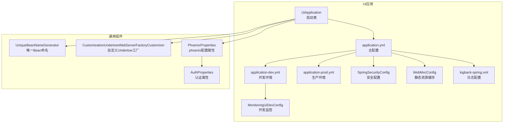
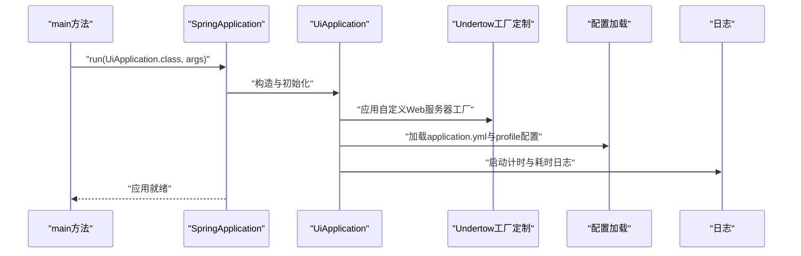
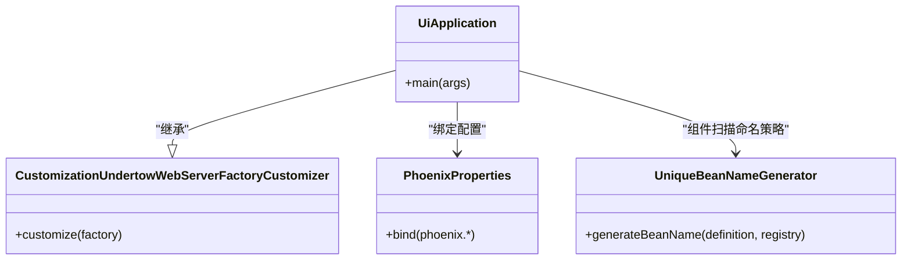
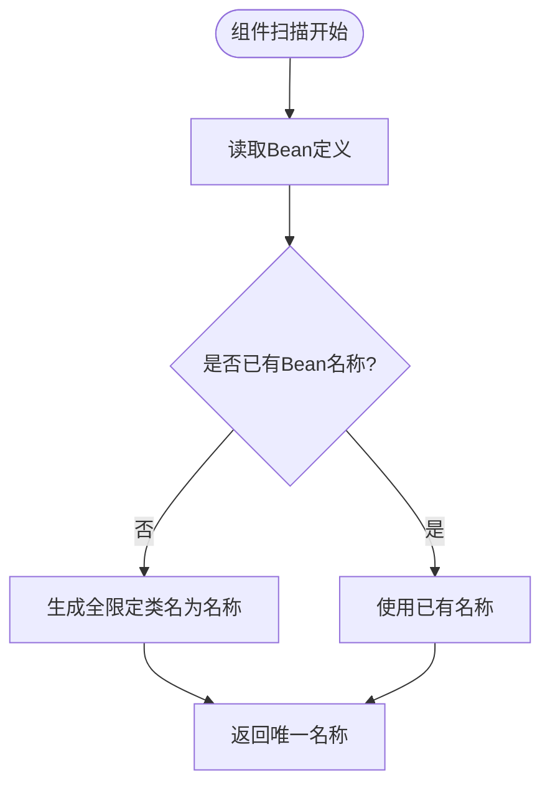
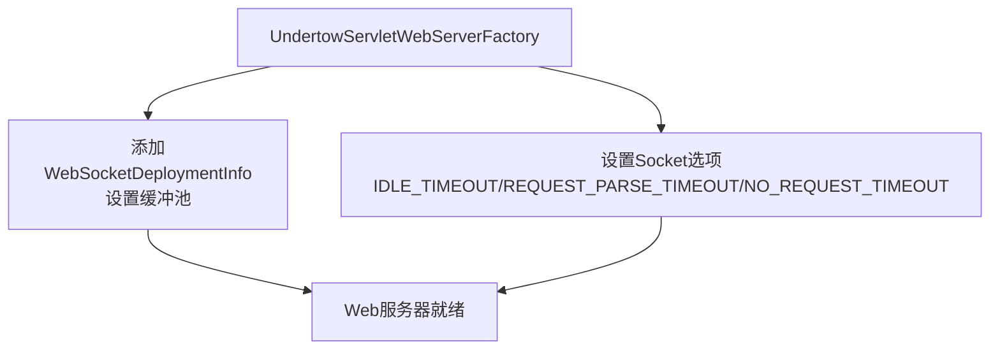
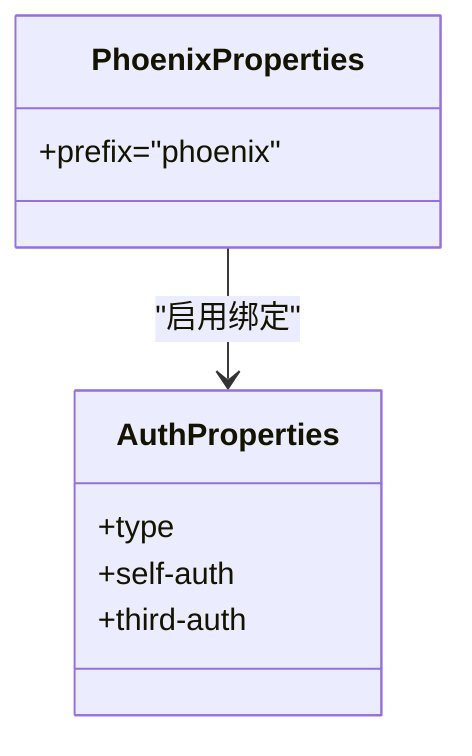
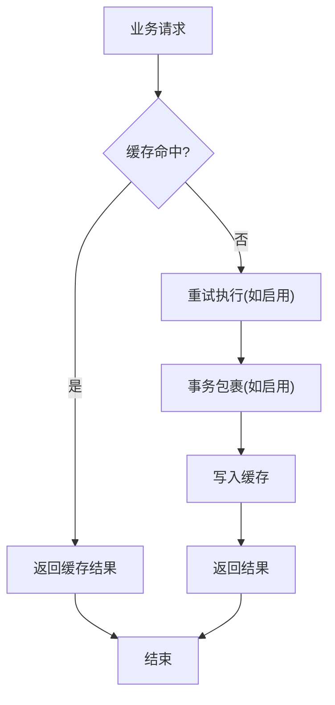
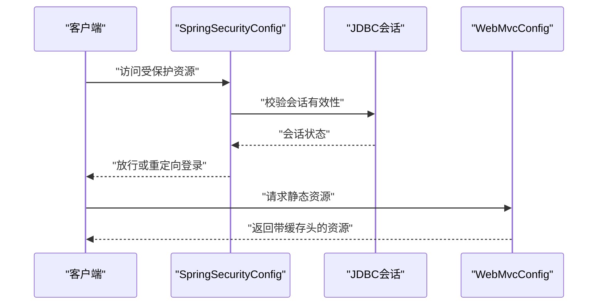
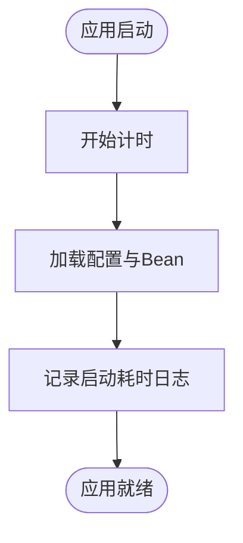
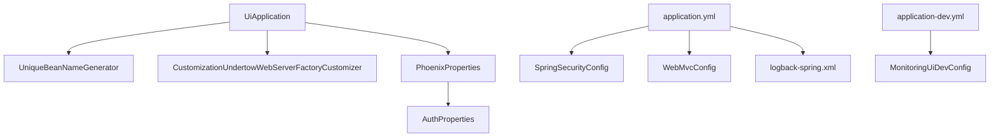

# 应用启动配置

<cite>
**本文引用的文件**
- [UiApplication.java](file://phoenix-ui/src/main/java/com/gitee/pifeng/monitoring/ui/UiApplication.java)
- [application.yml](file://phoenix-ui/src/main/resources/application.yml)
- [application-dev.yml](file://phoenix-ui/src/main/resources/application-dev.yml)
- [application-prod.yml](file://phoenix-ui/src/main/resources/application-prod.yml)
- [CustomizationUndertowWebServerFactoryCustomizer.java](file://phoenix-common/phoenix-common-web/src/main/java/com/gitee/pifeng/monitoring/common/web/core/CustomizationUndertowWebServerFactoryCustomizer.java)
- [UniqueBeanNameGenerator.java](file://phoenix-common/phoenix-common-web/src/main/java/com/gitee/pifeng/monitoring/common/web/core/UniqueBeanNameGenerator.java)
- [PhoenixProperties.java](file://phoenix-ui/src/main/java/com/gitee/pifeng/monitoring/ui/property/PhoenixProperties.java)
- [AuthProperties.java](file://phoenix-ui/src/main/java/com/gitee/pifeng/monitoring/ui/property/auth/AuthProperties.java)
- [logback-spring.xml](file://phoenix-ui/src/main/resources/logback-spring.xml)
- [WebMvcConfig.java](file://phoenix-ui/src/main/java/com/gitee/pifeng/monitoring/ui/config/WebMvcConfig.java)
- [SpringSecurityConfig.java](file://phoenix-ui/src/main/java/com/gitee/pifeng/monitoring/ui/config/springsecurity/SpringSecurityConfig.java)
- [MonitoringUiDevConfig.java](file://phoenix-ui/src/main/java/com/gitee/pifeng/monitoring/ui/config/phoenix/MonitoringUiDevConfig.java)
</cite>

## 目录
1. [引言](#引言)
2. [项目结构](#项目结构)
3. [核心组件](#核心组件)
4. [架构总览](#架构总览)
5. [详细组件分析](#详细组件分析)
6. [依赖分析](#依赖分析)
7. [性能考量](#性能考量)
8. [故障排查指南](#故障排查指南)
9. [结论](#结论)
10. [附录](#附录)

## 引言
本文围绕UI端应用启动配置展开，系统性解析UiApplication主启动类的设计与架构，重点涵盖@EnableRetry重试机制、@EnableCaching缓存配置、@EnableTransactionManagement事务管理、@EnableConfigurationProperties配置属性绑定等核心注解的作用与实现原理；同时详解@ComponentScan组件扫描策略与UniqueBeanNameGenerator唯一Bean命名机制，CustomizationUndertowWebServerFactoryCustomizer自定义Web服务器工厂的作用；并提供开发(dev)与生产(prod)环境配置文件的差异与最佳实践，以及启动性能监控、日志记录、配置验证等实用功能的实现细节。

## 项目结构
UI端应用位于phoenix-ui模块，启动入口为UiApplication，采用Spring Boot自动装配与多层配置结合的方式组织工程。核心配置集中在resources目录下的application.yml及按环境拆分的application-dev.yml、application-prod.yml；通用Web与Bean命名策略位于phoenix-common-web模块；安全与会话管理由Spring Security与Spring Session集成配置；日志采用Logback配置。

**图表来源**
- [UiApplication.java:1-49](file://phoenix-ui/src/main/java/com/gitee/pifeng/monitoring/ui/UiApplication.java#L1-L49)
- [application.yml:1-238](file://phoenix-ui/src/main/resources/application.yml#L1-L238)
- [application-dev.yml:1-49](file://phoenix-ui/src/main/resources/application-dev.yml#L1-L49)
- [application-prod.yml:1-39](file://phoenix-ui/src/main/resources/application-prod.yml#L1-L39)
- [SpringSecurityConfig.java:1-236](file://phoenix-ui/src/main/java/com/gitee/pifeng/monitoring/ui/config/springsecurity/SpringSecurityConfig.java#L1-L236)
- [WebMvcConfig.java:1-56](file://phoenix-ui/src/main/java/com/gitee/pifeng/monitoring/ui/config/WebMvcConfig.java#L1-L56)
- [logback-spring.xml:1-120](file://phoenix-ui/src/main/resources/logback-spring.xml#L1-L120)
- [MonitoringUiDevConfig.java:1-38](file://phoenix-ui/src/main/java/com/gitee/pifeng/monitoring/ui/config/phoenix/MonitoringUiDevConfig.java#L1-L38)
- [UniqueBeanNameGenerator.java:1-47](file://phoenix-common/phoenix-common-web/src/main/java/com/gitee/pifeng/monitoring/common/web/core/UniqueBeanNameGenerator.java#L1-L47)
- [CustomizationUndertowWebServerFactoryCustomizer.java:1-55](file://phoenix-common/phoenix-common-web/src/main/java/com/gitee/pifeng/monitoring/common/web/core/CustomizationUndertowWebServerFactoryCustomizer.java#L1-L55)
- [PhoenixProperties.java:1-21](file://phoenix-ui/src/main/java/com/gitee/pifeng/monitoring/ui/property/PhoenixProperties.java#L1-L21)
- [AuthProperties.java:1-27](file://phoenix-ui/src/main/java/com/gitee/pifeng/monitoring/ui/property/auth/AuthProperties.java#L1-L27)

**章节来源**
- [UiApplication.java:1-49](file://phoenix-ui/src/main/java/com/gitee/pifeng/monitoring/ui/UiApplication.java#L1-L49)
- [application.yml:1-238](file://phoenix-ui/src/main/resources/application.yml#L1-L238)

## 核心组件
- 启动类与注解组合
  - UiApplication继承自CustomizationUndertowWebServerFactoryCustomizer，以获得自定义Undertow Web服务器工厂的能力；通过@EnableRetry启用重试、@EnableCaching启用缓存、@EnableTransactionManagement启用事务管理、@EnableConfigurationProperties绑定PhoenixProperties、@ComponentScan(nameGenerator=UniqueBeanNameGenerator.class)启用唯一Bean命名、@EnableAspectJAutoProxy(proxyTargetClass=true, exposeProxy=true)启用AOP代理。
  - 启动流程中使用计时器统计启动耗时，并记录日志，便于性能监控与优化。
- 配置属性绑定
  - PhoenixProperties统一前缀“phoenix”，并@EnableConfigurationProperties引入AuthProperties，形成认证相关配置的分层绑定。
- 安全与会话
  - SpringSecurityConfig在自认证场景下启用Web安全、JDBC会话存储、方法级权限控制与记住我功能；WebMvcConfig在生产环境配置静态资源缓存策略。
- 日志与监控
  - logback-spring.xml集中配置控制台与滚动文件输出、按级别分流与根日志级别；开发环境通过MonitoringUiDevConfig注入监控属性，便于开发阶段观测。

**章节来源**
- [UiApplication.java:19-46](file://phoenix-ui/src/main/java/com/gitee/pifeng/monitoring/ui/UiApplication.java#L19-L46)
- [PhoenixProperties.java:8-21](file://phoenix-ui/src/main/java/com/gitee/pifeng/monitoring/ui/property/PhoenixProperties.java#L8-L21)
- [AuthProperties.java:9-27](file://phoenix-ui/src/main/java/com/gitee/pifeng/monitoring/ui/property/auth/AuthProperties.java#L9-L27)
- [SpringSecurityConfig.java:25-39](file://phoenix-ui/src/main/java/com/gitee/pifeng/monitoring/ui/config/springsecurity/SpringSecurityConfig.java#L25-L39)
- [WebMvcConfig.java:12-56](file://phoenix-ui/src/main/java/com/gitee/pifeng/monitoring/ui/config/WebMvcConfig.java#L12-L56)
- [logback-spring.xml:1-120](file://phoenix-ui/src/main/resources/logback-spring.xml#L1-L120)
- [MonitoringUiDevConfig.java:10-38](file://phoenix-ui/src/main/java/com/gitee/pifeng/monitoring/ui/config/phoenix/MonitoringUiDevConfig.java#L10-L38)

## 架构总览
UiApplication作为应用入口，承担以下职责：
- 注册自定义Web服务器工厂，优化WebSocket与超时配置；
- 绑定phoenix配置属性，驱动认证与业务配置；
- 启用重试、缓存、事务、AOP与组件扫描；
- 记录启动耗时，便于性能监控；
- 与安全、日志、静态资源缓存等配置协同工作。

**图表来源**
- [UiApplication.java:39-46](file://phoenix-ui/src/main/java/com/gitee/pifeng/monitoring/ui/UiApplication.java#L39-L46)
- [application.yml:60-74](file://phoenix-ui/src/main/resources/application.yml#L60-L74)
- [logback-spring.xml:114-120](file://phoenix-ui/src/main/resources/logback-spring.xml#L114-L120)

## 详细组件分析

### 启动类UiApplication与核心注解
- 设计要点
  - 继承CustomizationUndertowWebServerFactoryCustomizer，确保Undertow部署具备统一的WebSocket缓冲池与超时策略。
  - 通过@EnableConfigurationProperties绑定PhoenixProperties，使phoenix前缀配置可注入到Spring容器。
  - @ComponentScan(nameGenerator=UniqueBeanNameGenerator.class)避免同名类在不同包结构下产生Bean命名冲突。
  - @EnableRetry/@EnableCaching/@EnableTransactionManagement/@EnableAspectJAutoProxy为后续业务提供横切能力。
- 启动性能监控
  - 使用计时器统计启动耗时，并在启动完成后记录日志，便于定位启动瓶颈。

**图表来源**
- [UiApplication.java:37-46](file://phoenix-ui/src/main/java/com/gitee/pifeng/monitoring/ui/UiApplication.java#L37-L46)
- [CustomizationUndertowWebServerFactoryCustomizer.java:18-52](file://phoenix-common/phoenix-common-web/src/main/java/com/gitee/pifeng/monitoring/common/web/core/CustomizationUndertowWebServerFactoryCustomizer.java#L18-L52)
- [PhoenixProperties.java:16-21](file://phoenix-ui/src/main/java/com/gitee/pifeng/monitoring/ui/property/PhoenixProperties.java#L16-L21)
- [UniqueBeanNameGenerator.java:22-46](file://phoenix-common/phoenix-common-web/src/main/java/com/gitee/pifeng/monitoring/common/web/core/UniqueBeanNameGenerator.java#L22-L46)

**章节来源**
- [UiApplication.java:19-46](file://phoenix-ui/src/main/java/com/gitee/pifeng/monitoring/ui/UiApplication.java#L19-L46)

### 组件扫描与唯一Bean命名
- UniqueBeanNameGenerator覆盖默认注解Bean命名策略，使用全限定类名作为Bean名称，避免跨包同名类冲突。
- 结合@ComponentScan(nameGenerator=...)，确保扫描阶段生成稳定且唯一的Bean标识，有利于复杂模块化工程的可维护性。

**图表来源**
- [UniqueBeanNameGenerator.java:35-44](file://phoenix-common/phoenix-common-web/src/main/java/com/gitee/pifeng/monitoring/common/web/core/UniqueBeanNameGenerator.java#L35-L44)
- [UiApplication.java:35](file://phoenix-ui/src/main/java/com/gitee/pifeng/monitoring/ui/UiApplication.java#L35)

**章节来源**
- [UniqueBeanNameGenerator.java:9-47](file://phoenix-common/phoenix-common-web/src/main/java/com/gitee/pifeng/monitoring/common/web/core/UniqueBeanNameGenerator.java#L9-L47)
- [UiApplication.java:35](file://phoenix-ui/src/main/java/com/gitee/pifeng/monitoring/ui/UiApplication.java#L35)

### 自定义Web服务器工厂
- 作用
  - 为Undertow设置统一的WebSocket缓冲池，消除默认池警告。
  - 配置三类超时：空闲超时、请求头解析超时、无请求超时，提升抗攻击与稳定性。
- 影响范围
  - 对WebSocket、HTTP长连接、慢连接攻击防护具有直接影响，适合高并发与实时交互场景。

**图表来源**
- [CustomizationUndertowWebServerFactoryCustomizer.java:34-52](file://phoenix-common/phoenix-common-web/src/main/java/com/gitee/pifeng/monitoring/common/web/core/CustomizationUndertowWebServerFactoryCustomizer.java#L34-L52)

**章节来源**
- [CustomizationUndertowWebServerFactoryCustomizer.java:10-55](file://phoenix-common/phoenix-common-web/src/main/java/com/gitee/pifeng/monitoring/common/web/core/CustomizationUndertowWebServerFactoryCustomizer.java#L10-L55)

### 配置属性绑定与认证配置
- PhoenixProperties
  - 通过@ConfigurationProperties(prefix="phoenix")绑定顶层配置，@EnableConfigurationProperties引入子模块属性。
- AuthProperties
  - 通过@ConfigurationProperties(prefix="phoenix.auth")绑定认证配置，支持自认证与第三方认证类型切换。
- 配置验证
  - 通过@EnableConfigurationProperties在启动阶段进行类型安全绑定与校验，减少运行期异常。

**图表来源**
- [PhoenixProperties.java:16-21](file://phoenix-ui/src/main/java/com/gitee/pifeng/monitoring/ui/property/PhoenixProperties.java#L16-L21)
- [AuthProperties.java:17-27](file://phoenix-ui/src/main/java/com/gitee/pifeng/monitoring/ui/property/auth/AuthProperties.java#L17-L27)

**章节来源**
- [PhoenixProperties.java:8-21](file://phoenix-ui/src/main/java/com/gitee/pifeng/monitoring/ui/property/PhoenixProperties.java#L8-L21)
- [AuthProperties.java:9-27](file://phoenix-ui/src/main/java/com/gitee/pifeng/monitoring/ui/property/auth/AuthProperties.java#L9-L27)

### 缓存、重试与事务管理
- @EnableCaching
  - 在application.yml中配置Caffeine缓存，适用于高频查询接口的性能优化。
- @EnableRetry
  - 为网络波动、数据库抖动等场景提供重试保障，结合日志级别可观察重试行为。
- @EnableTransactionManagement
  - 为业务事务提供声明式管理基础，配合具体事务注解使用。

**图表来源**
- [application.yml:46-51](file://phoenix-ui/src/main/resources/application.yml#L46-L51)
- [application.yml:35-36](file://phoenix-ui/src/main/resources/application.yml#L35-L36)
- [UiApplication.java:30-36](file://phoenix-ui/src/main/java/com/gitee/pifeng/monitoring/ui/UiApplication.java#L30-L36)

**章节来源**
- [UiApplication.java:30-36](file://phoenix-ui/src/main/java/com/gitee/pifeng/monitoring/ui/UiApplication.java#L30-L36)
- [application.yml:46-51](file://phoenix-ui/src/main/resources/application.yml#L46-L51)

### 安全与会话管理
- SpringSecurityConfig
  - 启用Web安全、JDBC会话存储、方法级权限控制与记住我；根据phoenix.auth.type条件启用自认证配置。
- WebMvcConfig
  - 生产环境对静态资源设置长期缓存，避免重复下载；对特定文档路径禁用缓存，确保更新可见。

**图表来源**
- [SpringSecurityConfig.java:33-166](file://phoenix-ui/src/main/java/com/gitee/pifeng/monitoring/ui/config/springsecurity/SpringSecurityConfig.java#L33-L166)
- [WebMvcConfig.java:34-53](file://phoenix-ui/src/main/java/com/gitee/pifeng/monitoring/ui/config/WebMvcConfig.java#L34-L53)

**章节来源**
- [SpringSecurityConfig.java:25-39](file://phoenix-ui/src/main/java/com/gitee/pifeng/monitoring/ui/config/springsecurity/SpringSecurityConfig.java#L25-L39)
- [WebMvcConfig.java:20-56](file://phoenix-ui/src/main/java/com/gitee/pifeng/monitoring/ui/config/WebMvcConfig.java#L20-L56)

### 日志记录与启动性能监控
- logback-spring.xml
  - 控制台与滚动文件输出、按级别分流、根日志级别为INFO；日志目录统一在liblog4phoenix/logs/phoenix-ui。
- 启动性能监控
  - UiApplication在main方法中使用计时器统计启动耗时，并记录日志，便于定位启动阶段的性能瓶颈。

**图表来源**
- [logback-spring.xml:114-120](file://phoenix-ui/src/main/resources/logback-spring.xml#L114-L120)
- [UiApplication.java:39-46](file://phoenix-ui/src/main/java/com/gitee/pifeng/monitoring/ui/UiApplication.java#L39-L46)

**章节来源**
- [logback-spring.xml:1-120](file://phoenix-ui/src/main/resources/logback-spring.xml#L1-120)
- [UiApplication.java:39-46](file://phoenix-ui/src/main/java/com/gitee/pifeng/monitoring/ui/UiApplication.java#L39-L46)

### 开发与生产环境配置差异与最佳实践
- 端口与SSL
  - dev与prod均使用80端口，SSL默认关闭；生产环境可按需开启证书配置。
- 数据源
  - dev使用本地数据库地址与弱密码，prod使用更高安全级别的凭据与独立端口。
- Thymeleaf缓存
  - dev关闭模板缓存以便开发调试；prod开启模板缓存提升渲染性能。
- 认证验证码
  - dev关闭验证码，prod开启验证码以增强登录安全。
- 最佳实践
  - 生产环境务必开启HTTPS、严格凭据管理、启用审计日志与访问日志；开发环境可适度放宽但需明确边界。

**章节来源**
- [application-dev.yml:1-49](file://phoenix-ui/src/main/resources/application-dev.yml#L1-L49)
- [application-prod.yml:1-39](file://phoenix-ui/src/main/resources/application-prod.yml#L1-L39)
- [application.yml:14-28](file://phoenix-ui/src/main/resources/application.yml#L14-L28)

## 依赖分析
UiApplication与各组件之间的依赖关系如下：

**图表来源**
- [UiApplication.java:35-36](file://phoenix-ui/src/main/java/com/gitee/pifeng/monitoring/ui/UiApplication.java#L35-L36)
- [PhoenixProperties.java:16-21](file://phoenix-ui/src/main/java/com/gitee/pifeng/monitoring/ui/property/PhoenixProperties.java#L16-L21)
- [AuthProperties.java:17-27](file://phoenix-ui/src/main/java/com/gitee/pifeng/monitoring/ui/property/auth/AuthProperties.java#L17-L27)
- [application.yml:30-74](file://phoenix-ui/src/main/resources/application.yml#L30-L74)
- [MonitoringUiDevConfig.java:18-38](file://phoenix-ui/src/main/java/com/gitee/pifeng/monitoring/ui/config/phoenix/MonitoringUiDevConfig.java#L18-L38)

**章节来源**
- [UiApplication.java:19-46](file://phoenix-ui/src/main/java/com/gitee/pifeng/monitoring/ui/UiApplication.java#L19-L46)
- [PhoenixProperties.java:8-21](file://phoenix-ui/src/main/java/com/gitee/pifeng/monitoring/ui/property/PhoenixProperties.java#L8-L21)
- [AuthProperties.java:9-27](file://phoenix-ui/src/main/java/com/gitee/pifeng/monitoring/ui/property/auth/AuthProperties.java#L9-L27)
- [application.yml:1-238](file://phoenix-ui/src/main/resources/application.yml#L1-L238)
- [MonitoringUiDevConfig.java:10-38](file://phoenix-ui/src/main/java/com/gitee/pifeng/monitoring/ui/config/phoenix/MonitoringUiDevConfig.java#L10-L38)

## 性能考量
- 启动性能
  - 使用计时器统计启动耗时，便于定位启动阶段瓶颈；建议结合JVM参数与依赖精简持续优化。
- 缓存策略
  - Caffeine缓存配置合理设置容量与过期策略，避免内存压力；对热点数据优先缓存。
- Web服务器
  - Undertow超时与缓冲池配置有助于抗慢连接与提升并发稳定性。
- 日志级别
  - 生产环境建议将敏感模块日志级别调至INFO以上，避免过多DEBUG日志影响性能。

[本节为通用指导，无需列出章节来源]

## 故障排查指南
- 启动耗时异常
  - 检查application.yml中的组件扫描与Bean初始化顺序；确认自定义Web服务器工厂是否正确加载。
- 缓存与重试
  - 若缓存未生效，检查Caffeine配置与@Cacheable/@Retryable使用；关注日志级别以观察重试行为。
- 安全与会话
  - 若登录或会话异常，核对SpringSecurityConfig与JDBC会话配置；确认phoenix.auth.type与对应认证属性。
- 日志问题
  - 检查logback-spring.xml的输出路径与级别；确认日志滚动策略与文件权限。

**章节来源**
- [UiApplication.java:39-46](file://phoenix-ui/src/main/java/com/gitee/pifeng/monitoring/ui/UiApplication.java#L39-L46)
- [application.yml:30-74](file://phoenix-ui/src/main/resources/application.yml#L30-L74)
- [SpringSecurityConfig.java:33-166](file://phoenix-ui/src/main/java/com/gitee/pifeng/monitoring/ui/config/springsecurity/SpringSecurityConfig.java#L33-L166)
- [logback-spring.xml:1-120](file://phoenix-ui/src/main/resources/logback-spring.xml#L1-120)

## 结论
UiApplication通过注解组合与通用组件协同，构建了高性能、可扩展、易维护的UI端启动配置体系。自定义Web服务器工厂、唯一Bean命名策略、配置属性绑定与安全会话管理共同构成了稳定的运行基座；开发与生产环境配置差异明确了安全与性能的权衡策略；启动性能监控与日志体系则为运维与优化提供了可靠支撑。

[本节为总结性内容，无需列出章节来源]

## 附录
- 关键配置项速览
  - 服务器：context-path、压缩、accesslog、优雅停机
  - 缓存：Caffeine类型与规格
  - 会话：JDBC存储、超时
  - 数据源：Druid连接池参数与监控
  - MyBatis-Plus：映射位置、驼峰转换、数据库标识
  - 管理端点：健康与关闭端点暴露
  - 接口文档：Knife4j与springdoc配置

**章节来源**
- [application.yml:1-238](file://phoenix-ui/src/main/resources/application.yml#L1-L238)