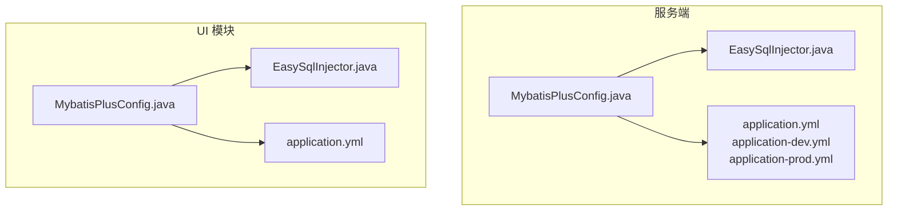
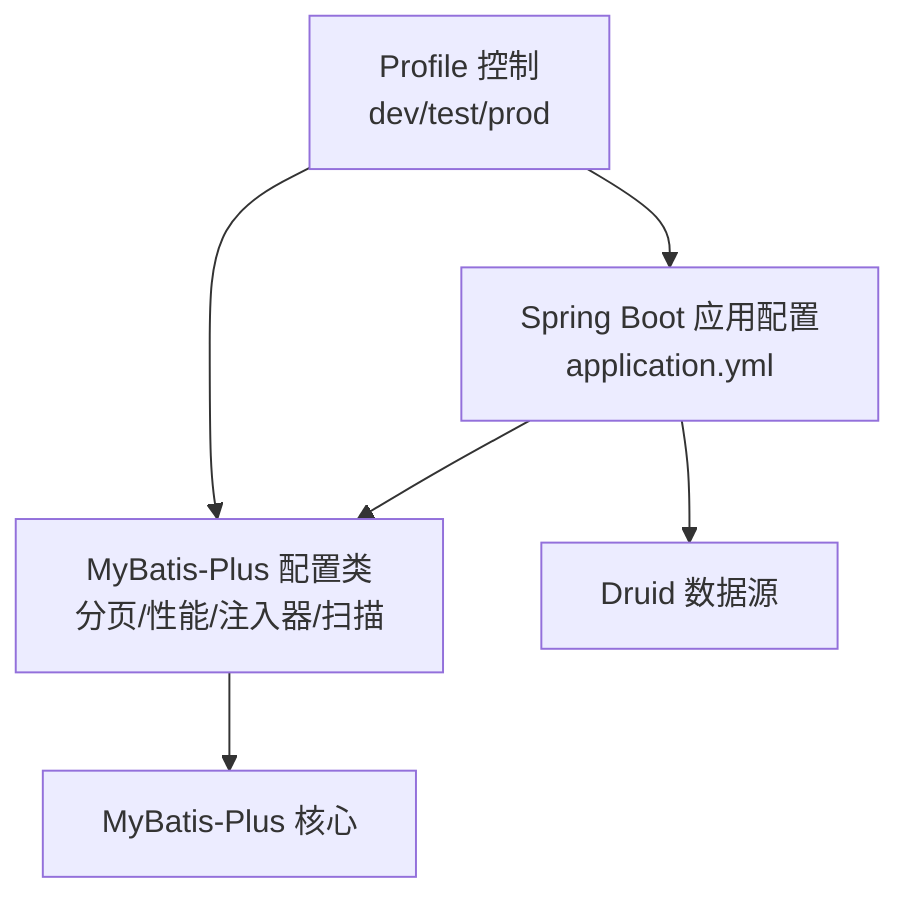
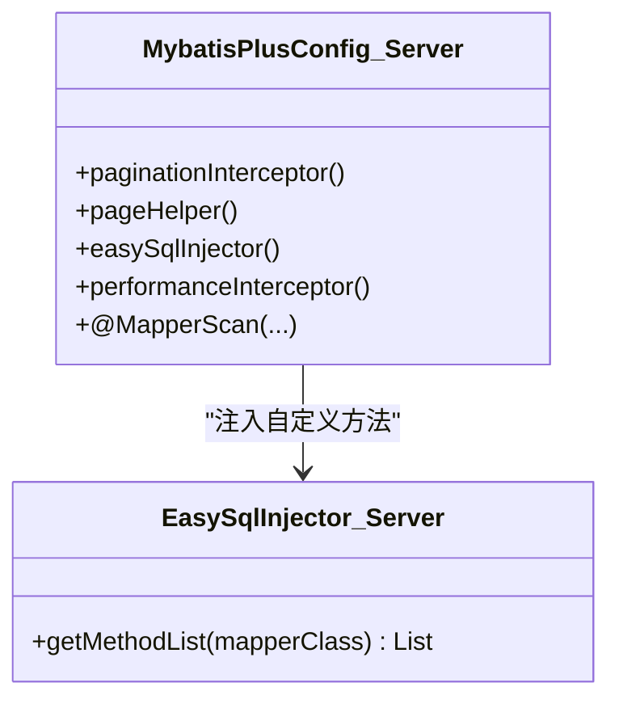
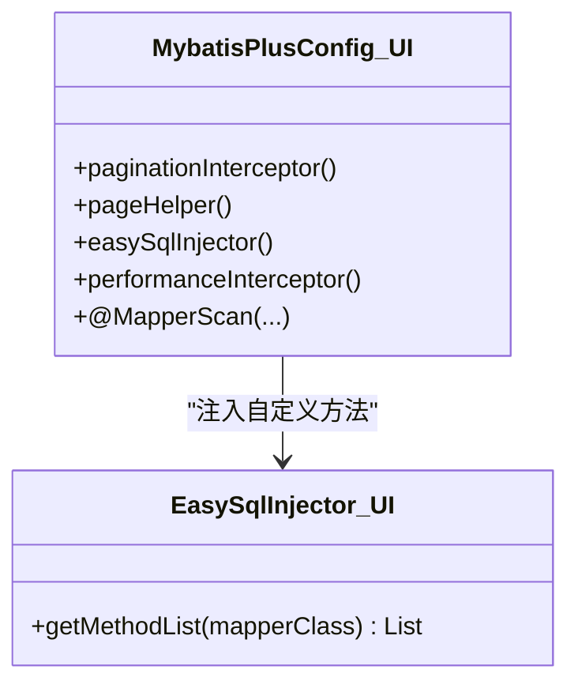
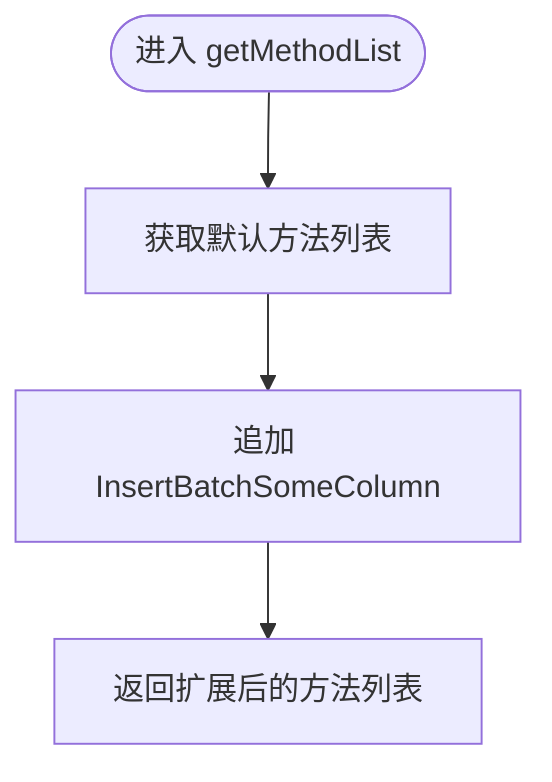
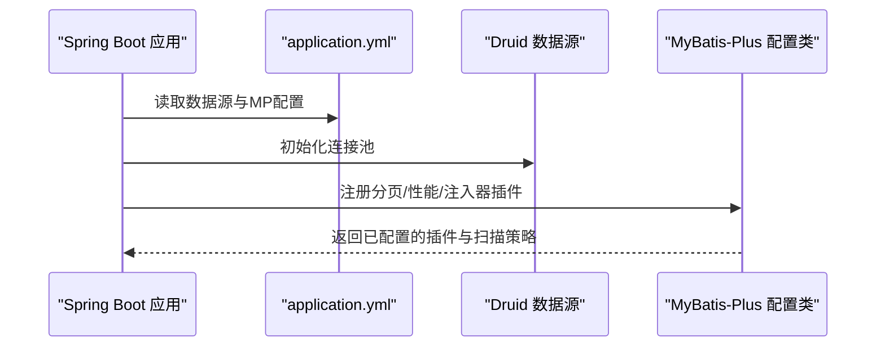
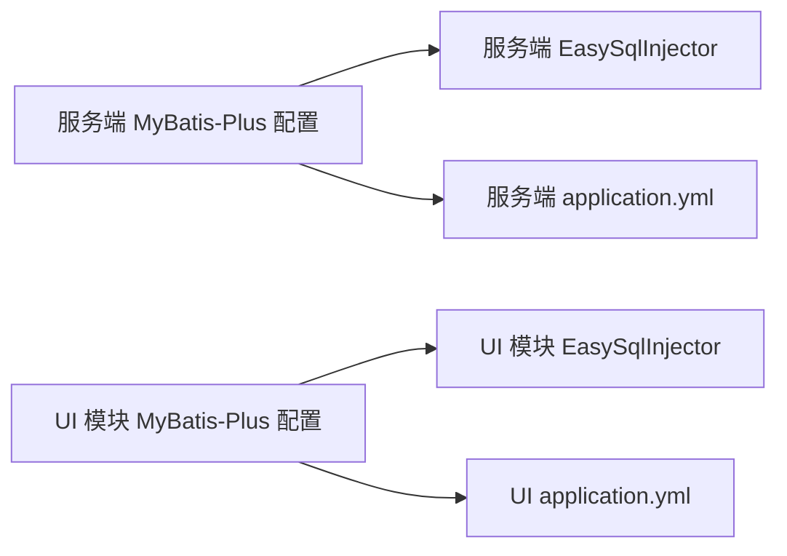

# 数据访问层配置

<cite>
**本文引用的文件**
- [MybatisPlusConfig.java](file://phoenix-server/src/main/java/com/gitee/pifeng/monitoring/server/config/MybatisPlusConfig.java)
- [EasySqlInjector.java](file://phoenix-server/src/main/java/com/gitee/pifeng/monitoring/server/config/EasySqlInjector.java)
- [MybatisPlusConfig.java](file://phoenix-ui/src/main/java/com/gitee/pifeng/monitoring/ui/config/mybatisplus/MybatisPlusConfig.java)
- [EasySqlInjector.java](file://phoenix-ui/src/main/java/com/gitee/pifeng/monitoring/ui/config/mybatisplus/EasySqlInjector.java)
- [application.yml](file://phoenix-server/src/main/resources/application.yml)
- [application-dev.yml](file://phoenix-server/src/main/resources/application-dev.yml)
- [application-prod.yml](file://phoenix-server/src/main/resources/application-prod.yml)
- [application.yml](file://phoenix-ui/src/main/resources/application.yml)
</cite>

## 目录
1. [引言](#引言)
2. [项目结构](#项目结构)
3. [核心组件](#核心组件)
4. [架构总览](#架构总览)
5. [详细组件分析](#详细组件分析)
6. [依赖分析](#依赖分析)
7. [性能考量](#性能考量)
8. [故障排查指南](#故障排查指南)
9. [结论](#结论)
10. [附录](#附录)

## 引言
本文件面向数据访问层（DAO/ORM）的配置与实践，围绕 MyBatis-Plus 在本项目的集成配置展开，重点解析以下主题：
- MyBatis-Plus 配置类的设计理念与关键插件：分页插件、SQL 性能监控插件、自定义 SQL 注入器。
- 自动填充与逻辑删除策略在实体模型中的落地方式与最佳实践。
- 与 Spring Boot 的集成要点：数据源配置、事务管理、类型处理器、Mapper 扫描等。
- 高级特性：批量操作、条件构造器、动态表名等。
- 数据库层优化策略：SQL 性能监控、慢查询分析、连接池优化。

## 项目结构
本项目采用多模块结构，数据访问层配置分别位于服务端与 UI 模块的配置包中，二者共享一致的 MyBatis-Plus 插件与 Druid 连接池配置风格。关键位置如下：
- 服务端配置：phoenix-server/src/main/java/.../config/MybatisPlusConfig.java、EasySqlInjector.java
- UI 配置：phoenix-ui/src/main/java/.../config/mybatisplus/MybatisPlusConfig.java、EasySqlInjector.java
- 应用配置：各模块的 application.yml 及环境特定配置文件

**图表来源**
- [MybatisPlusConfig.java:24-112](file://phoenix-server/src/main/java/com/gitee/pifeng/monitoring/server/config/MybatisPlusConfig.java#L24-L112)
- [EasySqlInjector.java:17-27](file://phoenix-server/src/main/java/com/gitee/pifeng/monitoring/server/config/EasySqlInjector.java#L17-L27)
- [application.yml:116-217](file://phoenix-server/src/main/resources/application.yml#L116-L217)
- [application-dev.yml:6-14](file://phoenix-server/src/main/resources/application-dev.yml#L6-L14)
- [application-prod.yml:6-14](file://phoenix-server/src/main/resources/application-prod.yml#L6-L14)
- [MybatisPlusConfig.java:24-112](file://phoenix-ui/src/main/java/com/gitee/pifeng/monitoring/ui/config/mybatisplus/MybatisPlusConfig.java#L24-L112)
- [EasySqlInjector.java:17-27](file://phoenix-ui/src/main/java/com/gitee/pifeng/monitoring/ui/config/mybatisplus/EasySqlInjector.java#L17-L27)
- [application.yml:84-184](file://phoenix-ui/src/main/resources/application.yml#L84-L184)

**章节来源**
- [MybatisPlusConfig.java:24-112](file://phoenix-server/src/main/java/com/gitee/pifeng/monitoring/server/config/MybatisPlusConfig.java#L24-L112)
- [MybatisPlusConfig.java:24-112](file://phoenix-ui/src/main/java/com/gitee/pifeng/monitoring/ui/config/mybatisplus/MybatisPlusConfig.java#L24-L112)
- [application.yml:116-217](file://phoenix-server/src/main/resources/application.yml#L116-L217)
- [application.yml:84-184](file://phoenix-ui/src/main/resources/application.yml#L84-L184)

## 核心组件
- 分页插件（PaginationInterceptor）
  - 启用 count 优化，减少复杂 JOIN 查询的统计开销。
  - 提供分页边界与限制参数的灵活配置。
- PageHelper（MyBatis 分页插件）
  - 支持 RowBounds 场景下的分页与计数。
  - 合理化分页参数，避免越界访问。
- 自定义 SQL 注入器（EasySqlInjector）
  - 基于 DefaultSqlInjector 扩展，注入 InsertBatchSomeColumn 方法，支持按列批量插入。
- SQL 性能监控插件（PerformanceInterceptor）
  - 仅在开发/测试环境启用，用于定位慢 SQL 与异常耗时操作。
- Mapper 扫描与 Bean 命名
  - 使用 @MapperScan 指定扫描路径，并通过 UniqueBeanNameGenerator 避免命名冲突。

**章节来源**
- [MybatisPlusConfig.java:38-49](file://phoenix-server/src/main/java/com/gitee/pifeng/monitoring/server/config/MybatisPlusConfig.java#L38-L49)
- [MybatisPlusConfig.java:60-77](file://phoenix-server/src/main/java/com/gitee/pifeng/monitoring/server/config/MybatisPlusConfig.java#L60-L77)
- [MybatisPlusConfig.java:88-93](file://phoenix-server/src/main/java/com/gitee/pifeng/monitoring/server/config/MybatisPlusConfig.java#L88-L93)
- [MybatisPlusConfig.java:104-110](file://phoenix-server/src/main/java/com/gitee/pifeng/monitoring/server/config/MybatisPlusConfig.java#L104-L110)
- [EasySqlInjector.java:17-27](file://phoenix-server/src/main/java/com/gitee/pifeng/monitoring/server/config/EasySqlInjector.java#L17-L27)
- [MybatisPlusConfig.java:38-49](file://phoenix-ui/src/main/java/com/gitee/pifeng/monitoring/ui/config/mybatisplus/MybatisPlusConfig.java#L38-L49)
- [MybatisPlusConfig.java:60-77](file://phoenix-ui/src/main/java/com/gitee/pifeng/monitoring/ui/config/mybatisplus/MybatisPlusConfig.java#L60-L77)
- [MybatisPlusConfig.java:88-93](file://phoenix-ui/src/main/java/com/gitee/pifeng/monitoring/ui/config/mybatisplus/MybatisPlusConfig.java#L88-L93)
- [MybatisPlusConfig.java:104-110](file://phoenix-ui/src/main/java/com/gitee/pifeng/monitoring/ui/config/mybatisplus/MybatisPlusConfig.java#L104-L110)
- [EasySqlInjector.java:17-27](file://phoenix-ui/src/main/java/com/gitee/pifeng/monitoring/ui/config/mybatisplus/EasySqlInjector.java#L17-L27)

## 架构总览
MyBatis-Plus 在本项目中的集成遵循“配置类 + 外部配置”的模式：
- 配置类负责注册插件与扫描策略；
- application.yml 负责数据源、连接池、MyBatis-Plus 全局配置与环境激活；
- Druid 提供连接池监控与慢 SQL 记录能力；
- 通过 Profile 控制性能插件的启用范围。

**图表来源**
- [MybatisPlusConfig.java:24-112](file://phoenix-server/src/main/java/com/gitee/pifeng/monitoring/server/config/MybatisPlusConfig.java#L24-L112)
- [application.yml:116-217](file://phoenix-server/src/main/resources/application.yml#L116-L217)
- [application-dev.yml:6-14](file://phoenix-server/src/main/resources/application-dev.yml#L6-L14)
- [application-prod.yml:6-14](file://phoenix-server/src/main/resources/application-prod.yml#L6-L14)

## 详细组件分析

### 组件一：MyBatis-Plus 配置类（服务端）
- 分页插件
  - 通过 count 优化器减少复杂查询的统计成本。
  - 提供 limit 与 overflow 等参数以控制分页行为。
- PageHelper
  - 针对 RowBounds 的 offsetAsPageNum、rowBoundsWithCount、reasonable 等参数进行合理化配置。
- 自定义 SQL 注入器
  - 在默认方法列表基础上追加 InsertBatchSomeColumn，便于按列批量插入。
- 性能监控插件
  - 仅在 test Profile 下启用，避免生产环境引入额外开销。
- Mapper 扫描
  - 指定扫描路径与 Bean 命名策略，确保 DAO 组件可被 Spring 容器发现。

**图表来源**
- [MybatisPlusConfig.java:24-112](file://phoenix-server/src/main/java/com/gitee/pifeng/monitoring/server/config/MybatisPlusConfig.java#L24-L112)
- [EasySqlInjector.java:17-27](file://phoenix-server/src/main/java/com/gitee/pifeng/monitoring/server/config/EasySqlInjector.java#L17-L27)

**章节来源**
- [MybatisPlusConfig.java:24-112](file://phoenix-server/src/main/java/com/gitee/pifeng/monitoring/server/config/MybatisPlusConfig.java#L24-L112)
- [EasySqlInjector.java:17-27](file://phoenix-server/src/main/java/com/gitee/pifeng/monitoring/server/config/EasySqlInjector.java#L17-L27)

### 组件二：MyBatis-Plus 配置类（UI 模块）
- 结构与服务端一致，差异在于：
  - 性能监控插件在 dev/test Profile 下启用。
  - Mapper 扫描路径与服务端不同，适配 UI 业务包结构。

**图表来源**
- [MybatisPlusConfig.java:24-112](file://phoenix-ui/src/main/java/com/gitee/pifeng/monitoring/ui/config/mybatisplus/MybatisPlusConfig.java#L24-L112)
- [EasySqlInjector.java:17-27](file://phoenix-ui/src/main/java/com/gitee/pifeng/monitoring/ui/config/mybatisplus/EasySqlInjector.java#L17-L27)

**章节来源**
- [MybatisPlusConfig.java:24-112](file://phoenix-ui/src/main/java/com/gitee/pifeng/monitoring/ui/config/mybatisplus/MybatisPlusConfig.java#L24-L112)
- [EasySqlInjector.java:17-27](file://phoenix-ui/src/main/java/com/gitee/pifeng/monitoring/ui/config/mybatisplus/EasySqlInjector.java#L17-L27)

### 组件三：自定义 SQL 注入器（EasySqlInjector）
- 实现原理
  - 继承 DefaultSqlInjector，重写 getMethodList，向方法列表追加 InsertBatchSomeColumn。
- 应用场景
  - 需要按列批量插入数据，避免全量字段插入带来的冗余与性能问题。
- 注意事项
  - 仅在需要批量插入的 Mapper 中生效，需确保实体字段与数据库列对应。

**图表来源**
- [EasySqlInjector.java:17-27](file://phoenix-server/src/main/java/com/gitee/pifeng/monitoring/server/config/EasySqlInjector.java#L17-L27)
- [EasySqlInjector.java:17-27](file://phoenix-ui/src/main/java/com/gitee/pifeng/monitoring/ui/config/mybatisplus/EasySqlInjector.java#L17-L27)

**章节来源**
- [EasySqlInjector.java:17-27](file://phoenix-server/src/main/java/com/gitee/pifeng/monitoring/server/config/EasySqlInjector.java#L17-L27)
- [EasySqlInjector.java:17-27](file://phoenix-ui/src/main/java/com/gitee/pifeng/monitoring/ui/config/mybatisplus/EasySqlInjector.java#L17-L27)

### 组件四：与 Spring Boot 的集成配置
- 数据源与连接池
  - 使用 Druid，配置初始大小、最大活跃数、最大等待时间、空闲检测周期、PSCache 等。
  - 开启慢 SQL 记录与全局统计，便于监控与分析。
- MyBatis-Plus 全局配置
  - 关闭二级缓存，启用驼峰映射，设置数据库标识为 mysql。
  - 全局配置 db-config：主键策略、表名下划线处理等。
- Profile 与环境
  - 服务端与 UI 模块均通过 application.yml 激活 dev 环境，生产环境配置独立文件。

**图表来源**
- [application.yml:116-217](file://phoenix-server/src/main/resources/application.yml#L116-L217)
- [application.yml:84-184](file://phoenix-ui/src/main/resources/application.yml#L84-L184)
- [MybatisPlusConfig.java:24-112](file://phoenix-server/src/main/java/com/gitee/pifeng/monitoring/server/config/MybatisPlusConfig.java#L24-L112)
- [MybatisPlusConfig.java:24-112](file://phoenix-ui/src/main/java/com/gitee/pifeng/monitoring/ui/config/mybatisplus/MybatisPlusConfig.java#L24-L112)

**章节来源**
- [application.yml:116-217](file://phoenix-server/src/main/resources/application.yml#L116-L217)
- [application-dev.yml:6-14](file://phoenix-server/src/main/resources/application-dev.yml#L6-L14)
- [application-prod.yml:6-14](file://phoenix-server/src/main/resources/application-prod.yml#L6-L14)
- [application.yml:84-184](file://phoenix-ui/src/main/resources/application.yml#L84-L184)

### 组件五：高级特性与使用示例（概念性说明）
- 批量操作
  - 使用自定义注入器提供的按列批量插入方法，减少字段冗余与 SQL 复杂度。
- 条件构造器
  - 建议结合分页插件与性能监控插件，先在开发/测试环境验证 SQL 效率再上线。
- 动态表名
  - 可通过自定义策略或拦截器实现，注意与分页、缓存策略的兼容性。

[本节为概念性说明，不直接分析具体代码文件]

## 依赖分析
- 组件耦合
  - 配置类与注入器之间为组合关系，注入器依赖默认方法集合并扩展新增方法。
  - 配置类与外部配置文件强耦合，通过 Profile 控制插件启用范围。
- 外部依赖
  - MyBatis-Plus 插件、Druid 连接池、Spring Boot 自动装配。
- 潜在风险
  - 性能监控插件仅在开发/测试启用，避免生产环境引入额外开销。
  - 分页与计数优化需结合实际 SQL 结构评估效果。

**图表来源**
- [MybatisPlusConfig.java:24-112](file://phoenix-server/src/main/java/com/gitee/pifeng/monitoring/server/config/MybatisPlusConfig.java#L24-L112)
- [EasySqlInjector.java:17-27](file://phoenix-server/src/main/java/com/gitee/pifeng/monitoring/server/config/EasySqlInjector.java#L17-L27)
- [MybatisPlusConfig.java:24-112](file://phoenix-ui/src/main/java/com/gitee/pifeng/monitoring/ui/config/mybatisplus/MybatisPlusConfig.java#L24-L112)
- [EasySqlInjector.java:17-27](file://phoenix-ui/src/main/java/com/gitee/pifeng/monitoring/ui/config/mybatisplus/EasySqlInjector.java#L17-L27)

**章节来源**
- [MybatisPlusConfig.java:24-112](file://phoenix-server/src/main/java/com/gitee/pifeng/monitoring/server/config/MybatisPlusConfig.java#L24-L112)
- [EasySqlInjector.java:17-27](file://phoenix-server/src/main/java/com/gitee/pifeng/monitoring/server/config/EasySqlInjector.java#L17-L27)
- [MybatisPlusConfig.java:24-112](file://phoenix-ui/src/main/java/com/gitee/pifeng/monitoring/ui/config/mybatisplus/MybatisPlusConfig.java#L24-L112)
- [EasySqlInjector.java:17-27](file://phoenix-ui/src/main/java/com/gitee/pifeng/monitoring/ui/config/mybatisplus/EasySqlInjector.java#L17-L27)

## 性能考量
- 分页与计数优化
  - 使用 count 优化器减少复杂 JOIN 的统计成本，结合分页上限控制单次查询规模。
- 连接池参数
  - 合理设置初始大小、最大活跃数、最大等待时间与空闲检测周期，避免资源争用与泄漏。
- 慢 SQL 监控
  - 通过 Druid 的慢 SQL 记录与全局统计，定位热点 SQL 并针对性优化。
- 插件启用策略
  - 性能监控插件仅在开发/测试启用，生产环境保持精简配置，避免额外开销。

[本节提供通用指导，不直接分析具体代码文件]

## 故障排查指南
- 分页结果异常
  - 检查分页插件与 PageHelper 的参数配置，确认合理化参数与边界处理。
- 批量插入失败
  - 确认注入器已正确注册，Mapper 中存在对应方法签名，实体字段与数据库列一致。
- 性能监控无效
  - 确认当前 Profile 是否满足插件启用条件，以及日志输出级别是否可见。
- 连接池问题
  - 查看 Druid 监控页面与慢 SQL 记录，核对连接池参数与 SQL 执行情况。

[本节提供通用指导，不直接分析具体代码文件]

## 结论
本项目在服务端与 UI 模块中统一了 MyBatis-Plus 的配置风格，通过分页插件、性能监控插件与自定义注入器，构建了高效、可观测、可扩展的数据访问层。配合 Druid 连接池与合理的 Profile 策略，能够在开发与生产环境中平衡性能与可维护性。建议在后续迭代中持续关注 SQL 性能指标与连接池健康状态，结合业务增长趋势动态调整参数。

[本节为总结性内容，不直接分析具体代码文件]

## 附录
- 自动填充与逻辑删除策略
  - 建议在实体模型中使用注解或元对象处理器实现自动填充与逻辑删除，避免在业务层重复处理。
- 类型处理器
  - 对于枚举、JSON、日期等特殊类型，建议注册专用 TypeHandler，确保序列化与反序列化一致性。
- 条件构造器与动态表名
  - 在复杂查询场景中优先使用条件构造器，结合动态表名策略实现分表与分区查询。

[本节为概念性说明，不直接分析具体代码文件]