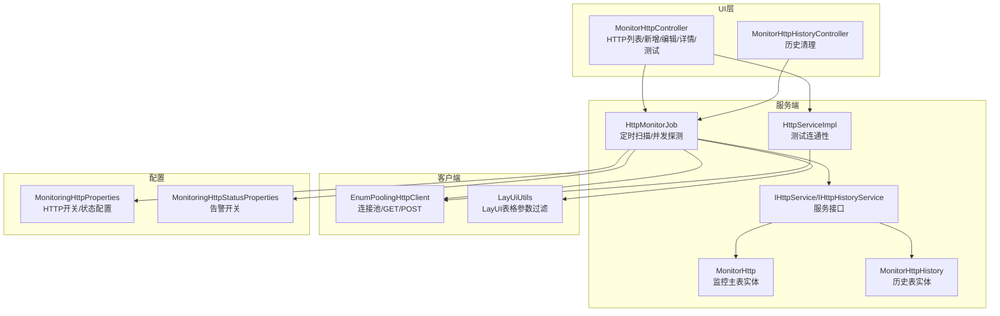
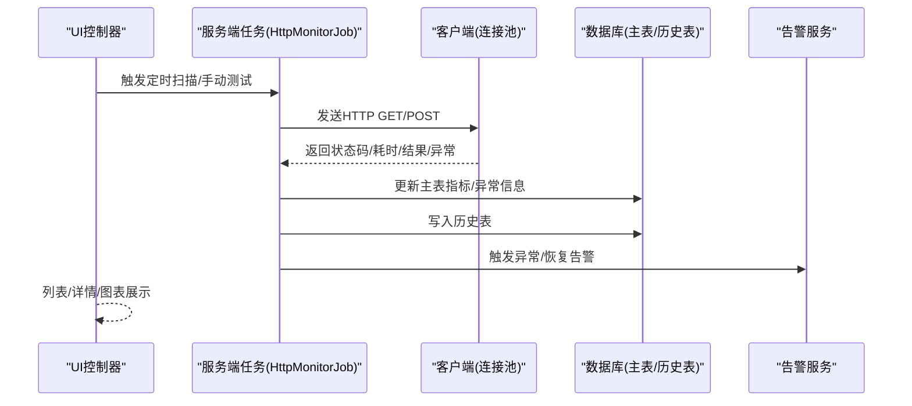
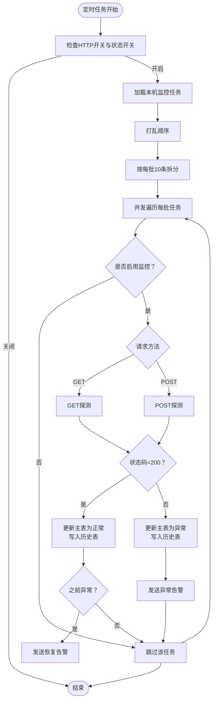
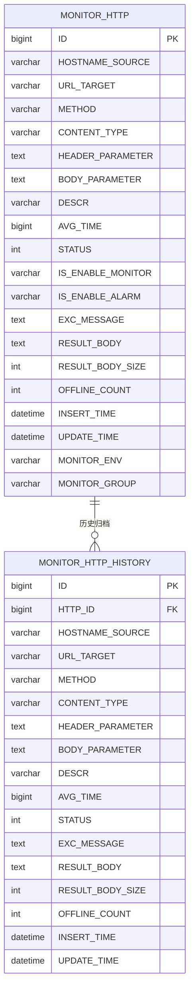
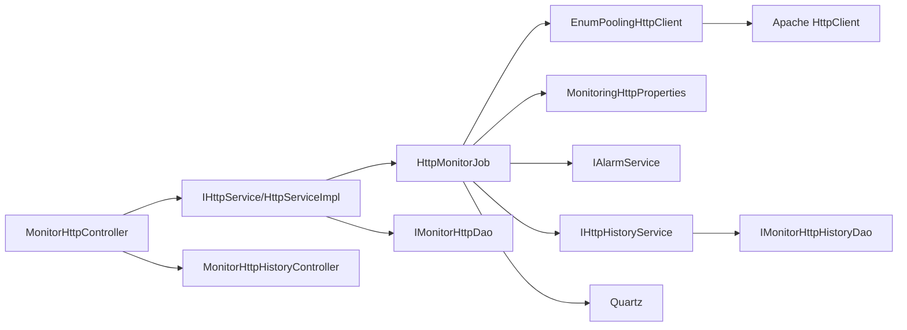

# HTTP监控模块

<cite>
**本文引用的文件**
- [MonitorHttpController.java](file://phoenix-ui/src/main/java/com/gitee/pifeng/monitoring/ui/business/web/controller/MonitorHttpController.java)
- [MonitorHttpHistoryController.java](file://phoenix-ui/src/main/java/com/gitee/pifeng/monitoring/ui/business/web/controller/MonitorHttpHistoryController.java)
- [HttpMonitorJob.java](file://phoenix-server/src/main/java/com/gitee/pifeng/monitoring/server/business/server/monitor/http/HttpMonitorJob.java)
- [HttpServiceImpl.java](file://phoenix-server/src/main/java/com/gitee/pifeng/monitoring/server/business/server/service/impl/HttpServiceImpl.java)
- [HttpHistoryServiceImpl.java](file://phoenix-server/src/main/java/com/gitee/pifeng/monitoring/server/business/server/service/impl/HttpHistoryServiceImpl.java)
- [IHttpService.java](file://phoenix-server/src/main/java/com/gitee/pifeng/monitoring/server/business/server/service/IHttpService.java)
- [IHttpHistoryService.java](file://phoenix-server/src/main/java/com/gitee/pifeng/monitoring/server/business/server/service/IHttpHistoryService.java)
- [MonitorHttp.java](file://phoenix-server/src/main/java/com/gitee/pifeng/monitoring/server/business/server/entity/MonitorHttp.java)
- [MonitorHttpHistory.java](file://phoenix-server/src/main/java/com/gitee/pifeng/monitoring/server/business/server/entity/MonitorHttpHistory.java)
- [MonitoringHttpProperties.java](file://phoenix-common/Phoenix-common-core/src/main/java/com/gitee/pifeng/monitoring/common/property/server/MonitoringHttpProperties.java)
- [MonitoringHttpStatusProperties.java](file://phoenix-common/Phoenix-common-core/src/main/java/com/gitee/pifeng/monitoring/common/property/server/MonitoringHttpStatusProperties.java)
- [EnumPoolingHttpClient.java](file://phoenix-client/phoenix-client-core/src/main/java/com/gitee/pifeng/monitoring/plug/core/EnumPoolingHttpClient.java)
- [LayUiUtils.java](file://phoenix-common/Phoenix-common-core/src/main/java/com/gitee/pifeng/monitoring/common/util/LayUiUtils.java)
</cite>

## 目录
1. [简介](#简介)
2. [项目结构](#项目结构)
3. [核心组件](#核心组件)
4. [架构总览](#架构总览)
5. [详细组件分析](#详细组件分析)
6. [依赖分析](#依赖分析)
7. [性能考虑](#性能考虑)
8. [故障排查指南](#故障排查指南)
9. [结论](#结论)
10. [附录](#附录)

## 简介
本文件面向Phoenix监控系统中的HTTP监控模块，围绕MonitorHttpController与MonitorHttpHistoryController两大UI控制器，系统梳理HTTP请求监控、响应时间统计、错误率分析、并发连接数等核心性能指标的采集机制、统计算法与图表展示逻辑；解释HTTP详情页面的请求链路追踪、慢查询分析与异常识别能力；覆盖监控配置管理（监控目标、采样频率、告警阈值）；并提供扩展指南，包括新增监控维度、自定义统计指标与集成APM系统的方案。

## 项目结构
HTTP监控模块横跨UI层、服务端与客户端三部分：
- UI层：负责HTTP监控配置、列表查询、详情页面、历史清理与测试连通性等交互。
- 服务端：负责定时扫描监控任务、发起HTTP探测、落库与历史归档、告警触发。
- 客户端：封装HTTP连接池与请求发送，统一GET/POST处理与计时。

**图表来源**
- [MonitorHttpController.java:1-412](file://phoenix-ui/src/main/java/com/gitee/pifeng/monitoring/ui/business/web/controller/MonitorHttpController.java#L1-L412)
- [MonitorHttpHistoryController.java](file://phoenix-ui/src/main/java/com/gitee/pifeng/monitoring/ui/business/web/controller/MonitorHttpHistoryController.java)
- [HttpMonitorJob.java:1-468](file://phoenix-server/src/main/java/com/gitee/pifeng/monitoring/server/business/server/monitor/http/HttpMonitorJob.java#L1-L468)
- [HttpServiceImpl.java:1-100](file://phoenix-server/src/main/java/com/gitee/pifeng/monitoring/server/business/server/service/impl/HttpServiceImpl.java#L1-L100)
- [IHttpService.java:1-33](file://phoenix-server/src/main/java/com/gitee/pifeng/monitoring/server/business/server/service/IHttpService.java#L1-L33)
- [IHttpHistoryService.java:1-30](file://phoenix-server/src/main/java/com/gitee/pifeng/monitoring/server/business/server/service/IHttpHistoryService.java#L1-L30)
- [MonitorHttp.java:1-147](file://phoenix-server/src/main/java/com/gitee/pifeng/monitoring/server/business/server/entity/MonitorHttp.java#L1-L147)
- [MonitorHttpHistory.java:1-114](file://phoenix-server/src/main/java/com/gitee/pifeng/monitoring/server/business/server/entity/MonitorHttpHistory.java#L1-L114)
- [MonitoringHttpProperties.java:1-30](file://phoenix-common/Phoenix-common-core/src/main/java/com/gitee/pifeng/monitoring/common/property/server/MonitoringHttpProperties.java#L1-L30)
- [MonitoringHttpStatusProperties.java:1-31](file://phoenix-common/Phoenix-common-core/src/main/java/com/gitee/pifeng/monitoring/common/property/server/MonitoringHttpStatusProperties.java#L1-L31)
- [EnumPoolingHttpClient.java:1-442](file://phoenix-client/phoenix-client-core/src/main/java/com/gitee/pifeng/monitoring/plug/core/EnumPoolingHttpClient.java#L1-L442)
- [LayUiUtils.java:1-98](file://phoenix-common/Phoenix-common-core/src/main/java/com/gitee/pifeng/monitoring/common/util/LayUiUtils.java#L1-L98)

**章节来源**
- [MonitorHttpController.java:1-412](file://phoenix-ui/src/main/java/com/gitee/pifeng/monitoring/ui/business/web/controller/MonitorHttpController.java#L1-L412)
- [MonitorHttpHistoryController.java](file://phoenix-ui/src/main/java/com/gitee/pifeng/monitoring/ui/business/web/controller/MonitorHttpHistoryController.java)
- [HttpMonitorJob.java:1-468](file://phoenix-server/src/main/java/com/gitee/pifeng/monitoring/server/business/server/monitor/http/HttpMonitorJob.java#L1-L468)
- [HttpServiceImpl.java:1-100](file://phoenix-server/src/main/java/com/gitee/pifeng/monitoring/server/business/server/service/impl/HttpServiceImpl.java#L1-L100)
- [IHttpService.java:1-33](file://phoenix-server/src/main/java/com/gitee/pifeng/monitoring/server/business/server/service/IHttpService.java#L1-L33)
- [IHttpHistoryService.java:1-30](file://phoenix-server/src/main/java/com/gitee/pifeng/monitoring/server/business/server/service/IHttpHistoryService.java#L1-L30)
- [MonitorHttp.java:1-147](file://phoenix-server/src/main/java/com/gitee/pifeng/monitoring/server/business/server/entity/MonitorHttp.java#L1-L147)
- [MonitorHttpHistory.java:1-114](file://phoenix-server/src/main/java/com/gitee/pifeng/monitoring/server/business/server/entity/MonitorHttpHistory.java#L1-L114)
- [MonitoringHttpProperties.java:1-30](file://phoenix-common/Phoenix-common-core/src/main/java/com/gitee/pifeng/monitoring/common/property/server/MonitoringHttpProperties.java#L1-L30)
- [MonitoringHttpStatusProperties.java:1-31](file://phoenix-common/Phoenix-common-core/src/main/java/com/gitee/pifeng/monitoring/common/property/server/MonitoringHttpStatusProperties.java#L1-L31)
- [EnumPoolingHttpClient.java:1-442](file://phoenix-client/phoenix-client-core/src/main/java/com/gitee/pifeng/monitoring/plug/core/EnumPoolingHttpClient.java#L1-L442)
- [LayUiUtils.java:1-98](file://phoenix-common/Phoenix-common-core/src/main/java/com/gitee/pifeng/monitoring/common/util/LayUiUtils.java#L1-L98)

## 核心组件
- MonitorHttpController：提供HTTP监控目标的增删改查、启停监控与告警、详情页跳转、平均时间页、测试连通性等功能。
- MonitorHttpHistoryController：提供HTTP监控历史数据清理表单与清理操作。
- HttpMonitorJob：定时扫描本地IP下的监控任务，按GET/POST分别探测，统计响应时间与状态，异常/恢复时落库与发告警，同时写入历史表。
- HttpServiceImpl：对外提供测试连通性接口，内部复用连接池执行GET/POST并更新数据库。
- 实体类：MonitorHttp（监控主表）、MonitorHttpHistory（历史表），承载指标字段（平均响应时间、状态、异常信息、离线次数、结果体与大小等）。
- 配置类：MonitoringHttpProperties、MonitoringHttpStatusProperties，控制HTTP监控总开关、状态监控开关与告警开关。
- 客户端工具：EnumPoolingHttpClient（连接池+GET/POST+计时），LayUiUtils（LayUI表格参数过滤与格式化）。

**章节来源**
- [MonitorHttpController.java:1-412](file://phoenix-ui/src/main/java/com/gitee/pifeng/monitoring/ui/business/web/controller/MonitorHttpController.java#L1-L412)
- [MonitorHttpHistoryController.java](file://phoenix-ui/src/main/java/com/gitee/pifeng/monitoring/ui/business/web/controller/MonitorHttpHistoryController.java)
- [HttpMonitorJob.java:1-468](file://phoenix-server/src/main/java/com/gitee/pifeng/monitoring/server/business/server/monitor/http/HttpMonitorJob.java#L1-L468)
- [HttpServiceImpl.java:1-100](file://phoenix-server/src/main/java/com/gitee/pifeng/monitoring/server/business/server/service/impl/HttpServiceImpl.java#L1-L100)
- [MonitorHttp.java:1-147](file://phoenix-server/src/main/java/com/gitee/pifeng/monitoring/server/business/server/entity/MonitorHttp.java#L1-L147)
- [MonitorHttpHistory.java:1-114](file://phoenix-server/src/main/java/com/gitee/pifeng/monitoring/server/business/server/entity/MonitorHttpHistory.java#L1-L114)
- [MonitoringHttpProperties.java:1-30](file://phoenix-common/Phoenix-common-core/src/main/java/com/gitee/pifeng/monitoring/common/property/server/MonitoringHttpProperties.java#L1-L30)
- [MonitoringHttpStatusProperties.java:1-31](file://phoenix-common/Phoenix-common-core/src/main/java/com/gitee/pifeng/monitoring/common/property/server/MonitoringHttpStatusProperties.java#L1-L31)
- [EnumPoolingHttpClient.java:1-442](file://phoenix-client/phoenix-client-core/src/main/java/com/gitee/pifeng/monitoring/plug/core/EnumPoolingHttpClient.java#L1-L442)
- [LayUiUtils.java:1-98](file://phoenix-common/Phoenix-common-core/src/main/java/com/gitee/pifeng/monitoring/common/util/LayUiUtils.java#L1-L98)

## 架构总览
HTTP监控采用“UI配置—服务端定时探测—客户端HTTP请求—数据库落库—历史归档—告警通知”的闭环流程。

**图表来源**
- [HttpMonitorJob.java:109-159](file://phoenix-server/src/main/java/com/gitee/pifeng/monitoring/server/business/server/monitor/http/HttpMonitorJob.java#L109-L159)
- [EnumPoolingHttpClient.java:285-366](file://phoenix-client/phoenix-client-core/src/main/java/com/gitee/pifeng/monitoring/plug/core/EnumPoolingHttpClient.java#L285-L366)
- [MonitorHttp.java:1-147](file://phoenix-server/src/main/java/com/gitee/pifeng/monitoring/server/business/server/entity/MonitorHttp.java#L1-L147)
- [MonitorHttpHistory.java:1-114](file://phoenix-server/src/main/java/com/gitee/pifeng/monitoring/server/business/server/entity/MonitorHttpHistory.java#L1-L114)

## 详细组件分析

### MonitorHttpController（HTTP监控UI控制器）
- 页面与交互
  - HTTP列表页：加载源IP、监控环境与分组，支持分页查询与筛选。
  - 新增/编辑HTTP监控：填充监控环境与分组下拉，提交后自动测试连通性。
  - 启停监控/启停告警：通过接口切换isEnableMonitor/isEnableAlarm。
  - 平均时间页：跳转至平均响应时间图表页。
  - HTTP详情页：跳转至监控详情页，包含请求链路、慢查询与异常识别入口。
  - 测试连通性：调用服务端测试接口，返回状态码或异常信息。
- 关键职责
  - 组织页面数据（源IP、环境、分组）。
  - 分页查询与条件筛选。
  - 权限控制与操作日志埋点。
- 与服务端协作
  - 调用HTTP服务接口进行测试与更新。
  - 传递监控目标（URL、方法、媒体类型、请求头/体参数）。

**章节来源**
- [MonitorHttpController.java:82-412](file://phoenix-ui/src/main/java/com/gitee/pifeng/monitoring/ui/business/web/controller/MonitorHttpController.java#L82-L412)

### MonitorHttpHistoryController（HTTP历史数据控制器）
- 功能
  - 提供HTTP监控历史数据清理表单页面。
  - 执行历史数据清理（按时间点批量删除，限制每次清理数量）。
- 设计要点
  - 清理策略：按插入时间升序分批删除，避免一次性锁表时间过长。
  - 与HttpHistoryServiceImpl配合完成DAO层删除。

**章节来源**
- [MonitorHttpHistoryController.java](file://phoenix-ui/src/main/java/com/gitee/pifeng/monitoring/ui/business/web/controller/MonitorHttpHistoryController.java)
- [HttpHistoryServiceImpl.java:32-40](file://phoenix-server/src/main/java/com/gitee/pifeng/monitoring/server/business/server/service/impl/HttpHistoryServiceImpl.java#L32-L40)

### HttpMonitorJob（HTTP监控定时任务）
- 定时扫描
  - 读取配置开关：HTTP总开关与HTTP状态开关。
  - 仅处理本机IP对应的监控任务。
  - 将监控任务打散为每批10条，使用线程池并发处理，提升吞吐。
- 探测逻辑
  - GET：调用连接池发送HTTP GET，循环尝试至状态码为200或达到阈值。
  - POST：根据媒体类型选择application/x-www-form-urlencoded或application/json，组装请求头与请求体。
  - 统计指标：状态码、平均响应时间、异常信息、结果体与大小。
- 状态更新与历史归档
  - 正常：清空异常信息，写入结果体与大小，更新状态与平均耗时。
  - 异常：记录异常信息，累计离线次数，更新状态与平均耗时。
  - 每次探测均写入历史表，保留完整请求上下文。
- 告警机制
  - 异常转“HTTP服务中断”，恢复转“HTTP服务恢复”。
  - 告警开关来自配置与监控项开关双重控制。
- 参数处理
  - 使用LayUiUtils过滤LayUI表格中选中的请求头/体参数。
  - 对JSON/表单两种媒体类型分别处理。

**图表来源**
- [HttpMonitorJob.java:109-159](file://phoenix-server/src/main/java/com/gitee/pifeng/monitoring/server/business/server/monitor/http/HttpMonitorJob.java#L109-L159)
- [HttpMonitorJob.java:170-226](file://phoenix-server/src/main/java/com/gitee/pifeng/monitoring/server/business/server/monitor/http/HttpMonitorJob.java#L170-L226)
- [HttpMonitorJob.java:237-277](file://phoenix-server/src/main/java/com/gitee/pifeng/monitoring/server/business/server/monitor/http/HttpMonitorJob.java#L237-L277)
- [HttpMonitorJob.java:291-332](file://phoenix-server/src/main/java/com/gitee/pifeng/monitoring/server/business/server/monitor/http/HttpMonitorJob.java#L291-L332)
- [HttpMonitorJob.java:346-382](file://phoenix-server/src/main/java/com/gitee/pifeng/monitoring/server/business/server/monitor/http/HttpMonitorJob.java#L346-L382)
- [HttpMonitorJob.java:396-465](file://phoenix-server/src/main/java/com/gitee/pifeng/monitoring/server/business/server/monitor/http/HttpMonitorJob.java#L396-L465)

**章节来源**
- [HttpMonitorJob.java:1-468](file://phoenix-server/src/main/java/com/gitee/pifeng/monitoring/server/business/server/monitor/http/HttpMonitorJob.java#L1-L468)
- [LayUiUtils.java:42-56](file://phoenix-common/Phoenix-common-core/src/main/java/com/gitee/pifeng/monitoring/common/util/LayUiUtils.java#L42-L56)

### HttpServiceImpl（HTTP测试服务）
- 能力
  - 对外提供测试连通性接口，内部根据方法类型选择GET/POST。
  - 执行后更新数据库中对应监控项的状态、平均耗时、结果体与异常信息。
- 与连接池协作
  - 复用EnumPoolingHttpClient的GET/POST能力，统一计时与异常捕获。

**章节来源**
- [HttpServiceImpl.java:44-97](file://phoenix-server/src/main/java/com/gitee/pifeng/monitoring/server/business/server/service/impl/HttpServiceImpl.java#L44-L97)
- [EnumPoolingHttpClient.java:383-439](file://phoenix-client/phoenix-client-core/src/main/java/com/gitee/pifeng/monitoring/plug/core/EnumPoolingHttpClient.java#L383-L439)

### 数据模型（MonitorHttp与MonitorHttpHistory）
- MonitorHttp（监控主表）
  - 关键指标字段：平均响应时间、状态、异常信息、结果体、结果体大小、离线次数、监控环境与分组等。
  - 控制字段：是否启用监控/告警。
- MonitorHttpHistory（历史表）
  - 与主表一致的请求上下文字段，用于历史归档与趋势分析。
  - 包含插入/更新时间，便于清理与审计。

**图表来源**
- [MonitorHttp.java:24-146](file://phoenix-server/src/main/java/com/gitee/pifeng/monitoring/server/business/server/entity/MonitorHttp.java#L24-L146)
- [MonitorHttpHistory.java:22-113](file://phoenix-server/src/main/java/com/gitee/pifeng/monitoring/server/business/server/entity/MonitorHttpHistory.java#L22-L113)

**章节来源**
- [MonitorHttp.java:1-147](file://phoenix-server/src/main/java/com/gitee/pifeng/monitoring/server/business/server/entity/MonitorHttp.java#L1-L147)
- [MonitorHttpHistory.java:1-114](file://phoenix-server/src/main/java/com/gitee/pifeng/monitoring/server/business/server/entity/MonitorHttpHistory.java#L1-L114)

### 配置管理
- MonitoringHttpProperties
  - enable：是否启用HTTP监控。
  - httpStatusProperties：HTTP状态监控配置。
- MonitoringHttpStatusProperties
  - enable：是否启用HTTP状态监控。
  - alarmEnable：是否启用告警。
- 采样频率与阈值
  - 采样频率：由定时任务调度周期决定（Quartz任务）。
  - 重试阈值：在探测循环中达到阈值或状态码为200为止。
- 告警阈值
  - 异常/恢复触发阈值由业务逻辑判定（异常转中断，之前异常转恢复时触发恢复告警）。

**章节来源**
- [MonitoringHttpProperties.java:18-30](file://phoenix-common/Phoenix-common-core/src/main/java/com/gitee/pifeng/monitoring/common/property/server/MonitoringHttpProperties.java#L18-L30)
- [MonitoringHttpStatusProperties.java:18-31](file://phoenix-common/Phoenix-common-core/src/main/java/com/gitee/pifeng/monitoring/common/property/server/MonitoringHttpStatusProperties.java#L18-L31)
- [HttpMonitorJob.java:198-206](file://phoenix-server/src/main/java/com/gitee/pifeng/monitoring/server/business/server/monitor/http/HttpMonitorJob.java#L198-L206)

### 图表展示与高级功能
- 平均响应时间页：基于历史表数据生成趋势图，支持按时间维度聚合。
- HTTP详情页：展示请求链路（请求方法、URL、媒体类型、请求头/体参数、结果体大小、异常信息）、慢查询分析（按平均耗时排序与阈值对比）、异常请求识别（状态码异常与异常信息聚合）。
- 历史清理：定期清理历史表，避免数据膨胀影响查询性能。

**章节来源**
- [MonitorHttpController.java:342-348](file://phoenix-ui/src/main/java/com/gitee/pifeng/monitoring/ui/business/web/controller/MonitorHttpController.java#L342-L348)
- [MonitorHttpController.java:385-390](file://phoenix-ui/src/main/java/com/gitee/pifeng/monitoring/ui/business/web/controller/MonitorHttpController.java#L385-L390)
- [HttpHistoryServiceImpl.java:34-40](file://phoenix-server/src/main/java/com/gitee/pifeng/monitoring/server/business/server/service/impl/HttpHistoryServiceImpl.java#L34-L40)

## 依赖分析
- 组件耦合
  - UI层依赖HTTP服务接口，间接依赖服务端任务与DAO层。
  - 服务端任务依赖连接池客户端、配置加载器、告警服务与历史服务。
  - DAO层依赖MyBatis-Plus，实体类映射数据库表。
- 外部依赖
  - Apache HttpClient连接池（连接数、超时、重试策略）。
  - Quartz定时框架（任务并发与禁并发执行）。
  - LayUI表格参数处理工具。

**图表来源**
- [MonitorHttpController.java:1-412](file://phoenix-ui/src/main/java/com/gitee/pifeng/monitoring/ui/business/web/controller/MonitorHttpController.java#L1-L412)
- [HttpServiceImpl.java:1-100](file://phoenix-server/src/main/java/com/gitee/pifeng/monitoring/server/business/server/service/impl/HttpServiceImpl.java#L1-L100)
- [HttpMonitorJob.java:1-468](file://phoenix-server/src/main/java/com/gitee/pifeng/monitoring/server/business/server/monitor/http/HttpMonitorJob.java#L1-L468)
- [EnumPoolingHttpClient.java:1-442](file://phoenix-client/phoenix-client-core/src/main/java/com/gitee/pifeng/monitoring/plug/core/EnumPoolingHttpClient.java#L1-L442)
- [MonitoringHttpProperties.java:1-30](file://phoenix-common/Phoenix-common-core/src/main/java/com/gitee/pifeng/monitoring/common/property/server/MonitoringHttpProperties.java#L1-L30)

**章节来源**
- [IHttpService.java:1-33](file://phoenix-server/src/main/java/com/gitee/pifeng/monitoring/server/business/server/service/IHttpService.java#L1-L33)
- [IHttpHistoryService.java:1-30](file://phoenix-server/src/main/java/com/gitee/pifeng/monitoring/server/business/server/service/IHttpHistoryService.java#L1-L30)

## 性能考虑
- 连接池配置
  - 最大连接数与每路由最大连接数已调优，满足高并发场景，避免连接池不足导致的超时。
  - 连接超时、套接字超时、连接获取超时合理设置，减少阻塞。
  - 空闲与过期连接定期回收，降低资源占用。
- 并发与批处理
  - 任务按每批10条并发处理，显著提升吞吐。
  - 历史清理分批删除，避免大事务锁表。
- 指标统计
  - 平均响应时间采用毫秒级计时，确保精度与可比性。
  - 离线次数与异常信息用于快速定位故障。
- 建议
  - 根据业务量动态调整连接池大小与批处理数量。
  - 对热点URL增加缓存策略（如结果体命中率低时谨慎缓存）。
  - 定期评估历史表清理策略，平衡存储与分析需求。

**章节来源**
- [EnumPoolingHttpClient.java:150-200](file://phoenix-client/phoenix-client-core/src/main/java/com/gitee/pifeng/monitoring/plug/core/EnumPoolingHttpClient.java#L150-L200)
- [HttpMonitorJob.java:127-154](file://phoenix-server/src/main/java/com/gitee/pifeng/monitoring/server/business/server/monitor/http/HttpMonitorJob.java#L127-L154)
- [HttpHistoryServiceImpl.java:34-40](file://phoenix-server/src/main/java/com/gitee/pifeng/monitoring/server/business/server/service/impl/HttpHistoryServiceImpl.java#L34-L40)

## 故障排查指南
- 常见问题
  - HTTP探测失败：检查URL可达性、证书与DNS解析、请求头/体参数格式。
  - 连接池耗尽：查看连接池配置与并发任务数，适当增大最大连接数。
  - 历史表增长过快：调整清理策略或保留周期。
  - 告警未触发：确认HTTP状态开关与监控项告警开关均已开启。
- 排查步骤
  - 使用UI的“测试HTTP连通性”功能快速验证。
  - 查看服务端日志中定时任务的异常堆栈。
  - 核对MonitorHttp与MonitorHttpHistory表中最新记录，确认状态码与异常信息。
  - 检查连接池健康状态与超时配置。
- 相关实现参考
  - 探测异常处理与默认耗时设定。
  - 告警发送逻辑与标题/消息拼装。
  - 历史表清理的SQL条件与分批策略。

**章节来源**
- [HttpServiceImpl.java:56-97](file://phoenix-server/src/main/java/com/gitee/pifeng/monitoring/server/business/server/service/impl/HttpServiceImpl.java#L56-L97)
- [HttpMonitorJob.java:221-226](file://phoenix-server/src/main/java/com/gitee/pifeng/monitoring/server/business/server/monitor/http/HttpMonitorJob.java#L221-L226)
- [HttpMonitorJob.java:396-465](file://phoenix-server/src/main/java/com/gitee/pifeng/monitoring/server/business/server/monitor/http/HttpMonitorJob.java#L396-L465)
- [HttpHistoryServiceImpl.java:34-40](file://phoenix-server/src/main/java/com/gitee/pifeng/monitoring/server/business/server/service/impl/HttpHistoryServiceImpl.java#L34-L40)

## 结论
HTTP监控模块通过UI配置、服务端定时探测、客户端连接池与数据库落库形成闭环，具备完善的指标采集、告警与历史归档能力。结合UI提供的详情与图表页面，可实现请求链路追踪、慢查询分析与异常识别。建议在生产环境中根据业务负载动态优化连接池与批处理策略，并持续完善历史数据治理与告警策略。

## 附录

### 扩展指南
- 新增监控维度
  - 在实体类中增加新字段（如业务标签、SLA阈值），并在UI表单与历史表同步扩展。
  - 在HttpMonitorJob中补充对应字段的统计与落库逻辑。
- 自定义统计指标
  - 在连接池返回Map中扩展指标（如重试次数、DNS解析耗时），并在服务端聚合。
  - 在UI侧新增图表维度与筛选条件。
- 集成APM系统
  - 在告警发送处扩展APM告警通道（如钉钉/企业微信/Webhook）。
  - 在历史表中保留traceId/spanId等链路信息，便于跨系统关联分析。
- 配置扩展
  - 新增配置项（如采样率、重试策略、连接池参数），通过配置加载器注入到任务与连接池初始化中。

**章节来源**
- [MonitorHttp.java:24-146](file://phoenix-server/src/main/java/com/gitee/pifeng/monitoring/server/business/server/entity/MonitorHttp.java#L24-L146)
- [MonitorHttpHistory.java:22-113](file://phoenix-server/src/main/java/com/gitee/pifeng/monitoring/server/business/server/entity/MonitorHttpHistory.java#L22-L113)
- [EnumPoolingHttpClient.java:126-200](file://phoenix-client/phoenix-client-core/src/main/java/com/gitee/pifeng/monitoring/plug/core/EnumPoolingHttpClient.java#L126-L200)
- [HttpMonitorJob.java:396-465](file://phoenix-server/src/main/java/com/gitee/pifeng/monitoring/server/business/server/monitor/http/HttpMonitorJob.java#L396-L465)