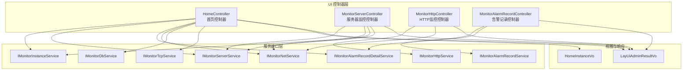
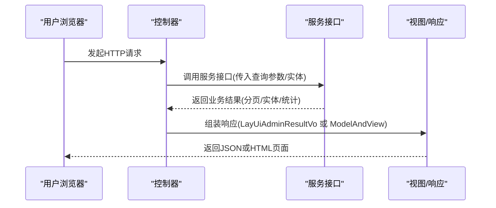
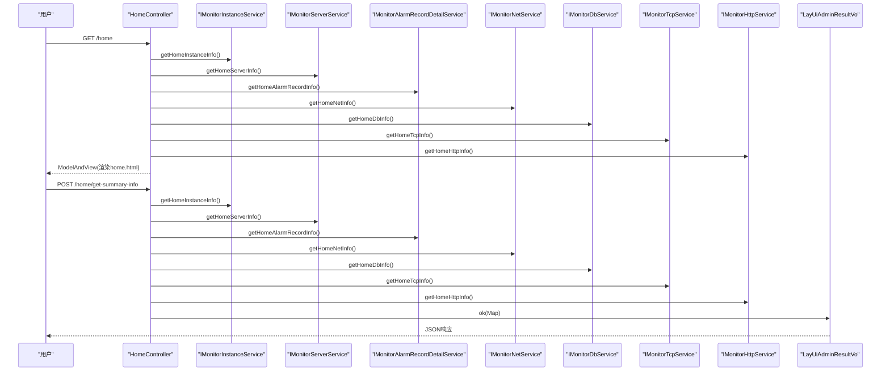
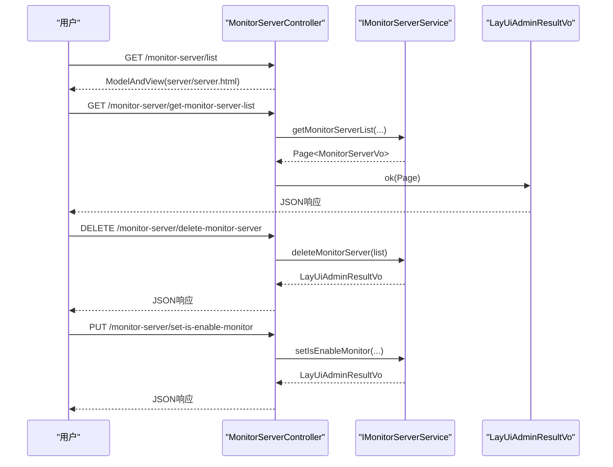
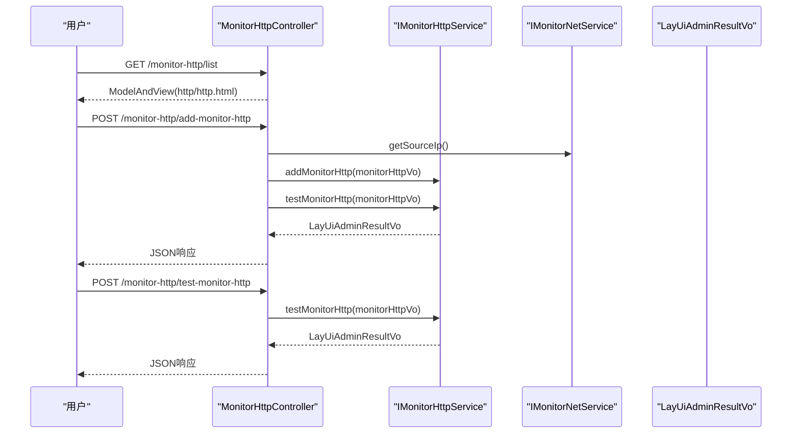
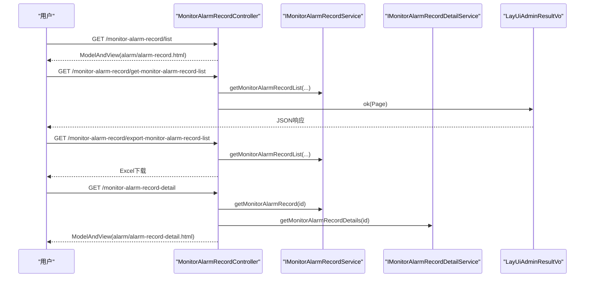

# 业务功能模块

<cite>
**本文引用的文件**
- [HomeController.java](file://phoenix-ui/src/main/java/com/gitee/pifeng/monitoring/ui/business/web/controller/HomeController.java)
- [MonitorServerController.java](file://phoenix-ui/src/main/java/com/gitee/pifeng/monitoring/ui/business/web/controller/MonitorServerController.java)
- [MonitorHttpController.java](file://phoenix-ui/src/main/java/com/gitee/pifeng/monitoring/ui/business/web/controller/MonitorHttpController.java)
- [MonitorAlarmRecordController.java](file://phoenix-ui/src/main/java/com/gitee/pifeng/monitoring/ui/business/web/controller/MonitorAlarmRecordController.java)
- [IMonitorInstanceService.java](file://phoenix-ui/src/main/java/com/gitee/pifeng/monitoring/ui/business/web/service/IMonitorInstanceService.java)
- [IMonitorServerService.java](file://phoenix-ui/src/main/java/com/gitee/pifeng/monitoring/ui/business/web/service/IMonitorServerService.java)
- [IMonitorHttpService.java](file://phoenix-ui/src/main/java/com/gitee/pifeng/monitoring/ui/business/web/service/IMonitorHttpService.java)
- [IMonitorAlarmRecordService.java](file://phoenix-ui/src/main/java/com/gitee/pifeng/monitoring/ui/business/web/service/IMonitorAlarmRecordService.java)
- [IMonitorAlarmRecordDetailService.java](file://phoenix-ui/src/main/java/com/gitee/pifeng/monitoring/ui/business/web/service/IMonitorAlarmRecordDetailService.java)
- [IMonitorNetService.java](file://phoenix-ui/src/main/java/com/gitee/pifeng/monitoring/ui/business/web/service/IMonitorNetService.java)
- [IMonitorDbService.java](file://phoenix-ui/src/main/java/com/gitee/pifeng/monitoring/ui/business/web/service/IMonitorDbService.java)
- [IMonitorTcpService.java](file://phoenix-ui/src/main/java/com/gitee/pifeng/monitoring/ui/business/web/service/IMonitorTcpService.java)
- [HomeInstanceVo.java](file://phoenix-ui/src/main/java/com/gitee/pifeng/monitoring/ui/business/web/vo/HomeInstanceVo.java)
- [LayUiAdminResultVo.java](file://phoenix-ui/src/main/java/com/gitee/pifeng/monitoring/ui/business/web/vo/LayUiAdminResultVo.java)
- [ServerDetailPageServerNetcardVo.java](file://phoenix-ui/src/main/java/com/gitee/pifeng/monitoring/ui/business/web/vo/ServerDetailPageServerNetcardVo.java)
- [HomeNetVo.java](file://phoenix-ui/src/main/java/com/gitee/pifeng/monitoring/ui/business/web/vo/HomeNetVo.java)
- [MonitorNetVo.java](file://phoenix-ui/src/main/java/com/gitee/pifeng/monitoring/ui/business/web/vo/MonitorNetVo.java)
- [MonitorServerNetcardServiceImpl.java](file://phoenix-ui/src/main/java/com/gitee/pifeng/monitoring/ui/business/web/service/impl/MonitorServerNetcardServiceImpl.java)
- [serverDetail.js](file://phoenix-ui/src/main/resources/static/modules/server/serverDetail.js)
</cite>

## 更新摘要
**所做更改**
- 更新了术语标准化相关内容，将'下载速度'和'上传速度'统一更新为'下载速率'和'上传速率'
- 修正了网络监控相关VO类和服务层实现中的术语一致性
- 更新了前端JavaScript中的显示文本，确保与后端术语保持一致

## 目录
1. [简介](#简介)
2. [项目结构](#项目结构)
3. [核心组件](#核心组件)
4. [架构总览](#架构总览)
5. [详细组件分析](#详细组件分析)
6. [依赖分析](#依赖分析)
7. [性能考虑](#性能考虑)
8. [故障排查指南](#故障排查指南)
9. [结论](#结论)
10. [附录](#附录)

## 简介
本文件面向UI端业务功能模块，聚焦四个核心控制器：HomeController首页控制器、MonitorServerController服务器监控控制器、MonitorHttpController HTTP监控控制器、MonitorAlarmRecordController告警记录控制器。文档从职责边界、数据流、与服务层交互模式、异常与安全控制、以及扩展建议等方面进行系统化阐述，帮助开发者快速理解与高效维护。

**更新** 本次更新重点关注术语标准化，确保'下载速率'和'上传速率'在前后端保持一致的表达方式。

## 项目结构
UI端控制器位于phoenix-ui模块的web控制器包内，围绕"首页""服务器""HTTP""告警记录"四大业务域提供页面跳转与数据接口；服务层接口位于web服务包内，统一抽象各监控维度的数据获取与业务处理；视图对象与通用响应体位于web VO与通用响应对象中。

**图表来源**
- [HomeController.java:30-208](file://phoenix-ui/src/main/java/com/gitee/pifeng/monitoring/ui/business/web/controller/HomeController.java#L30-L208)
- [MonitorServerController.java:43-368](file://phoenix-ui/src/main/java/com/gitee/pifeng/monitoring/ui/business/web/controller/MonitorServerController.java#L43-L368)
- [MonitorHttpController.java:47-412](file://phoenix-ui/src/main/java/com/gitee/pifeng/monitoring/ui/business/web/controller/MonitorHttpController.java#L47-L412)
- [MonitorAlarmRecordController.java:51-269](file://phoenix-ui/src/main/java/com/gitee/pifeng/monitoring/ui/business/web/controller/MonitorAlarmRecordController.java#L51-L269)

**章节来源**
- [HomeController.java:30-208](file://phoenix-ui/src/main/java/com/gitee/pifeng/monitoring/ui/business/web/controller/HomeController.java#L30-L208)
- [MonitorServerController.java:43-368](file://phoenix-ui/src/main/java/com/gitee/pifeng/monitoring/ui/business/web/controller/MonitorServerController.java#L43-L368)
- [MonitorHttpController.java:47-412](file://phoenix-ui/src/main/java/com/gitee/pifeng/monitoring/ui/business/web/controller/MonitorHttpController.java#L47-L412)
- [MonitorAlarmRecordController.java:51-269](file://phoenix-ui/src/main/java/com/gitee/pifeng/monitoring/ui/business/web/controller/MonitorAlarmRecordController.java#L51-L269)

## 核心组件
- 首页控制器（HomeController）
  - 职责：聚合首页仪表板所需数据，包括应用实例、服务器、网络、数据库、TCP、HTTP及告警统计，并提供摘要信息接口。
  - 关键接口：访问首页、获取摘要信息、最近7天告警统计、告警类型统计、告警结果统计、最新5条告警。
  - 数据来源：通过多个服务接口聚合HomeXxxVo对象，最终封装为LayUiAdminResultVo返回。

- 服务器监控控制器（MonitorServerController）
  - 职责：提供服务器列表查询、删除、清理历史、详情、编辑、开关监控/告警、按Map形式返回服务器信息等能力。
  - 关键接口：服务器列表、删除、清理历史、详情、编辑、开关监控/告警、按Map返回。
  - 安全控制：部分操作需具备"超级管理员"权限。

- HTTP监控控制器（MonitorHttpController）
  - 职责：提供HTTP监控目标的增删改查、连通性测试、平均时延页面、清理历史、详情等。
  - 关键接口：HTTP列表、删除、新增/编辑、开关监控/告警、测试连通性、详情、平均时延。
  - 数据准备：在新增/编辑时自动填充源IP。

- 告警记录控制器（MonitorAlarmRecordController）
  - 职责：提供告警记录列表查询、删除、清空、导出、详情查看等。
  - 关键接口：列表、删除、清空、导出、详情。
  - 扩展点：支持导出Excel并自定义样式。

**更新** 网络监控相关组件现已统一使用"下载速率"和"上传速率"术语，确保前后端表达一致性。

**章节来源**
- [HomeController.java:89-208](file://phoenix-ui/src/main/java/com/gitee/pifeng/monitoring/ui/business/web/controller/HomeController.java#L89-L208)
- [MonitorServerController.java:78-368](file://phoenix-ui/src/main/java/com/gitee/pifeng/monitoring/ui/business/web/controller/MonitorServerController.java#L78-L368)
- [MonitorHttpController.java:82-412](file://phoenix-ui/src/main/java/com/gitee/pifeng/monitoring/ui/business/web/controller/MonitorHttpController.java#L82-L412)
- [MonitorAlarmRecordController.java:74-269](file://phoenix-ui/src/main/java/com/gitee/pifeng/monitoring/ui/business/web/controller/MonitorAlarmRecordController.java#L74-L269)

## 架构总览
UI控制器通过Spring依赖注入持有服务接口，控制器方法接收请求参数，调用服务接口完成业务处理，最后以LayUiAdminResultVo封装响应返回。首页控制器还负责将多个维度的HomeXxxVo对象整合到ModelAndView中用于页面渲染。

**图表来源**
- [HomeController.java:89-140](file://phoenix-ui/src/main/java/com/gitee/pifeng/monitoring/ui/business/web/controller/HomeController.java#L89-L140)
- [MonitorServerController.java:128-145](file://phoenix-ui/src/main/java/com/gitee/pifeng/monitoring/ui/business/web/controller/MonitorServerController.java#L128-L145)
- [MonitorHttpController.java:130-147](file://phoenix-ui/src/main/java/com/gitee/pifeng/monitoring/ui/business/web/controller/MonitorHttpController.java#L130-L147)
- [MonitorAlarmRecordController.java:115-130](file://phoenix-ui/src/main/java/com/gitee/pifeng/monitoring/ui/business/web/controller/MonitorAlarmRecordController.java#L115-L130)

## 详细组件分析

### 首页控制器（HomeController）
- 业务职责
  - 页面入口：加载home.html，聚合应用实例、服务器、网络、数据库、TCP、HTTP与告警详情的HomeXxxVo。
  - 接口入口：提供摘要信息接口，一次性返回多维指标，便于前端首屏渲染。
  - 统计入口：提供最近7天告警统计、告警类型统计、告警结果统计、最新5条告警等。

- 数据流与处理
  - 依赖注入多个服务接口，分别调用其HomeXxxVo相关方法，组装Map后统一返回。
  - 统一使用LayUiAdminResultVo封装响应，code/msg/data三段式结构。

- 结果返回格式
  - LayUiAdminResultVo：包含code、msg、data字段，data为具体业务对象或Map。

- 安全与审计
  - 使用注解记录操作日志，便于审计追踪。

**图表来源**
- [HomeController.java:89-140](file://phoenix-ui/src/main/java/com/gitee/pifeng/monitoring/ui/business/web/controller/HomeController.java#L89-L140)
- [IMonitorInstanceService.java:32](file://phoenix-ui/src/main/java/com/gitee/pifeng/monitoring/ui/business/web/service/IMonitorInstanceService.java#L32)
- [IMonitorServerService.java:32](file://phoenix-ui/src/main/java/com/gitee/pifeng/monitoring/ui/business/web/service/IMonitorServerService.java#L32)
- [IMonitorAlarmRecordDetailService.java:30](file://phoenix-ui/src/main/java/com/gitee/pifeng/monitoring/ui/business/web/service/IMonitorAlarmRecordDetailService.java#L30)
- [IMonitorNetService.java:34](file://phoenix-ui/src/main/java/com/gitee/pifeng/monitoring/ui/business/web/service/IMonitorNetService.java#L34)
- [IMonitorDbService.java:121](file://phoenix-ui/src/main/java/com/gitee/pifeng/monitoring/ui/business/web/service/IMonitorDbService.java#L121)
- [IMonitorTcpService.java:1-200](file://phoenix-ui/src/main/java/com/gitee/pifeng/monitoring/ui/business/web/service/IMonitorTcpService.java#L1-L200)
- [IMonitorHttpService.java:121](file://phoenix-ui/src/main/java/com/gitee/pifeng/monitoring/ui/business/web/service/IMonitorHttpService.java#L121)
- [LayUiAdminResultVo.java:50-52](file://phoenix-ui/src/main/java/com/gitee/pifeng/monitoring/ui/business/web/vo/LayUiAdminResultVo.java#L50-L52)

**章节来源**
- [HomeController.java:89-208](file://phoenix-ui/src/main/java/com/gitee/pifeng/monitoring/ui/business/web/controller/HomeController.java#L89-L208)
- [IMonitorInstanceService.java:32](file://phoenix-ui/src/main/java/com/gitee/pifeng/monitoring/ui/business/web/service/IMonitorInstanceService.java#L32)
- [IMonitorServerService.java:32](file://phoenix-ui/src/main/java/com/gitee/pifeng/monitoring/ui/business/web/service/IMonitorServerService.java#L32)
- [IMonitorAlarmRecordDetailService.java:30](file://phoenix-ui/src/main/java/com/gitee/pifeng/monitoring/ui/business/web/service/IMonitorAlarmRecordDetailService.java#L30)
- [IMonitorNetService.java:34](file://phoenix-ui/src/main/java/com/gitee/pifeng/monitoring/ui/business/web/service/IMonitorNetService.java#L34)
- [IMonitorDbService.java:121](file://phoenix-ui/src/main/java/com/gitee/pifeng/monitoring/ui/business/web/service/IMonitorDbService.java#L121)
- [IMonitorHttpService.java:121](file://phoenix-ui/src/main/java/com/gitee/pifeng/monitoring/ui/business/web/service/IMonitorHttpService.java#L121)
- [LayUiAdminResultVo.java:20-85](file://phoenix-ui/src/main/java/com/gitee/pifeng/monitoring/ui/business/web/vo/LayUiAdminResultVo.java#L20-L85)

### 服务器监控控制器（MonitorServerController）
- 业务职责
  - 列表查询：支持按IP、名称、状态、环境、分组、系统、描述、监控/告警开关筛选。
  - 历史清理：按IP与时间清理历史数据。
  - 详情与编辑：提供详情页、编辑页，支持更新环境、分组、监控/告警开关。
  - 源IP辅助：提供服务器网卡地址列表供页面选择。

- 数据流与处理
  - 通过IMonitorServerService执行分页查询、删除、清理、编辑、开关设置、详情查询等。
  - 返回LayUiAdminResultVo，data为success/fail或分页结果。

- 安全控制
  - 删除、清理、编辑、开关监控/告警等操作需要"超级管理员"权限。

**图表来源**
- [MonitorServerController.java:78-145](file://phoenix-ui/src/main/java/com/gitee/pifeng/monitoring/ui/business/web/controller/MonitorServerController.java#L78-L145)
- [MonitorServerController.java:157-164](file://phoenix-ui/src/main/java/com/gitee/pifeng/monitoring/ui/business/web/controller/MonitorServerController.java#L157-L164)
- [MonitorServerController.java:308-321](file://phoenix-ui/src/main/java/com/gitee/pifeng/monitoring/ui/business/web/controller/MonitorServerController.java#L308-L321)
- [IMonitorServerService.java:54-57](file://phoenix-ui/src/main/java/com/gitee/pifeng/monitoring/ui/business/web/service/IMonitorServerService.java#L54-L57)
- [IMonitorServerService.java:69](file://phoenix-ui/src/main/java/com/gitee/pifeng/monitoring/ui/business/web/service/IMonitorServerService.java#L69)
- [IMonitorServerService.java:120](file://phoenix-ui/src/main/java/com/gitee/pifeng/monitoring/ui/business/web/service/IMonitorServerService.java#L120)

**章节来源**
- [MonitorServerController.java:78-368](file://phoenix-ui/src/main/java/com/gitee/pifeng/monitoring/ui/business/web/controller/MonitorServerController.java#L78-L368)
- [IMonitorServerService.java:21-160](file://phoenix-ui/src/main/java/com/gitee/pifeng/monitoring/ui/business/web/service/IMonitorServerService.java#L21-L160)

### HTTP监控控制器（MonitorHttpController）
- 业务职责
  - 列表查询：支持按来源主机、目标URL、方法、状态、环境、分组、描述、监控/告警开关筛选。
  - 连通性测试：在新增/编辑后自动测试HTTP可达性。
  - 平均时延与清理：提供平均时延页面与清理历史表单。
  - 源IP自动填充：在新增/编辑时自动设置来源主机名。

- 数据流与处理
  - 通过IMonitorHttpService执行列表、删除、新增、编辑、开关设置、测试连通性、详情查询等。
  - 通过IMonitorNetService获取源IP，确保测试一致性。

- 安全控制
  - 删除、新增/编辑、开关监控/告警等操作需要"超级管理员"权限。

**图表来源**
- [MonitorHttpController.java:82-217](file://phoenix-ui/src/main/java/com/gitee/pifeng/monitoring/ui/business/web/controller/MonitorHttpController.java#L82-L217)
- [MonitorHttpController.java:404-410](file://phoenix-ui/src/main/java/com/gitee/pifeng/monitoring/ui/business/web/controller/MonitorHttpController.java#L404-L410)
- [IMonitorHttpService.java:71](file://phoenix-ui/src/main/java/com/gitee/pifeng/monitoring/ui/business/web/service/IMonitorHttpService.java#L71)
- [IMonitorHttpService.java:135](file://phoenix-ui/src/main/java/com/gitee/pifeng/monitoring/ui/business/web/service/IMonitorHttpService.java#L135)
- [IMonitorNetService.java:133](file://phoenix-ui/src/main/java/com/gitee/pifeng/monitoring/ui/business/web/service/IMonitorNetService.java#L133)

**章节来源**
- [MonitorHttpController.java:82-412](file://phoenix-ui/src/main/java/com/gitee/pifeng/monitoring/ui/business/web/controller/MonitorHttpController.java#L82-L412)
- [IMonitorHttpService.java:22-150](file://phoenix-ui/src/main/java/com/gitee/pifeng/monitoring/ui/business/web/service/IMonitorHttpService.java#L22-L150)
- [IMonitorNetService.java:23-150](file://phoenix-ui/src/main/java/com/gitee/pifeng/monitoring/ui/business/web/service/IMonitorNetService.java#L23-L150)

### 告警记录控制器（MonitorAlarmRecordController）
- 业务职责
  - 列表查询：支持按类型、级别、方式、状态、标题、内容、未通知原因、记录日期筛选。
  - 删除与清空：支持批量删除与一键清空。
  - 导出：支持导出Excel，自定义样式与列宽。
  - 详情：查看告警记录及其明细。

- 数据流与处理
  - 通过IMonitorAlarmRecordService与IMonitorAlarmRecordDetailService执行查询、删除、清空、导出、详情查询等。
  - 导出时对内容进行截断与格式化，提升可读性。

**图表来源**
- [MonitorAlarmRecordController.java:74-130](file://phoenix-ui/src/main/java/com/gitee/pifeng/monitoring/ui/business/web/controller/MonitorAlarmRecordController.java#L74-L130)
- [MonitorAlarmRecordController.java:185-242](file://phoenix-ui/src/main/java/com/gitee/pifeng/monitoring/ui/business/web/controller/MonitorAlarmRecordController.java#L185-L242)
- [MonitorAlarmRecordController.java:254-266](file://phoenix-ui/src/main/java/com/gitee/pifeng/monitoring/ui/business/web/controller/MonitorAlarmRecordController.java#L254-L266)
- [IMonitorAlarmRecordService.java:40-42](file://phoenix-ui/src/main/java/com/gitee/pifeng/monitoring/ui/business/web/service/IMonitorAlarmRecordService.java#L40-L42)
- [IMonitorAlarmRecordDetailService.java:53](file://phoenix-ui/src/main/java/com/gitee/pifeng/monitoring/ui/business/web/service/IMonitorAlarmRecordDetailService.java#L53)

**章节来源**
- [MonitorAlarmRecordController.java:74-269](file://phoenix-ui/src/main/java/com/gitee/pifeng/monitoring/ui/business/web/controller/MonitorAlarmRecordController.java#L74-L269)
- [IMonitorAlarmRecordService.java:19-123](file://phoenix-ui/src/main/java/com/gitee/pifeng/monitoring/ui/business/web/service/IMonitorAlarmRecordService.java#L19-L123)
- [IMonitorAlarmRecordDetailService.java:19-56](file://phoenix-ui/src/main/java/com/gitee/pifeng/monitoring/ui/business/web/service/IMonitorAlarmRecordDetailService.java#L19-L56)

## 依赖分析
- 控制器与服务层
  - 控制器通过@Autowired注入服务接口，遵循面向接口编程与依赖倒置原则。
  - 服务接口统一返回LayUiAdminResultVo或分页对象，保证响应格式一致。

- 视图与响应
  - 首页控制器同时使用ModelAndView与LayUiAdminResultVo，兼顾页面渲染与接口调用。
  - HomeXxxVo作为轻量DTO承载首页聚合数据，避免跨层传递复杂实体。

- 安全与权限
  - 使用@PreAuthorize限制敏感操作权限，确保系统安全。

```mermaid
classDiagram
class HomeController {
+home()
+getSummaryInfo()
+getLast7DaysAlarmRecordStatistics()
+getAlarmRecordTypeStatistics()
+getAlarmRecordResultStatistics()
+getLast5AlarmRecord()
}
class MonitorServerController {
+list()
+getMonitorServerList()
+deleteMonitorServer()
+clearMonitorServerHistory()
+serverDetail()
+serverClear()
+editMonitorServerForm()
+editMonitorServer()
+setIsEnableMonitor()
+setIsEnableAlarm()
+getMonitorServer2Map()
}
class MonitorHttpController {
+list()
+getMonitorHttpList()
+deleteMonitorHttp()
+addMonitorHttp()
+editMonitorHttpForm()
+editMonitorHttp()
+setIsEnableMonitor()
+setIsEnableAlarm()
+avgTime()
+httpClear()
+httpDetail()
+testMonitorHttp()
}
class MonitorAlarmRecordController {
+list()
+getMonitorAlarmRecordList()
+deleteMonitorAlarmRecord()
+cleanupMonitorAlarmRecord()
+exportMonitorAlarmRecordList()
+monitorAlarmRecordDetail()
}
class IMonitorInstanceService
class IMonitorServerService
class IMonitorHttpService
class IMonitorAlarmRecordService
class IMonitorAlarmRecordDetailService
class IMonitorNetService
class IMonitorDbService
class IMonitorTcpService
class HomeInstanceVo
class LayUiAdminResultVo
HomeController --> IMonitorInstanceService
HomeController --> IMonitorServerService
HomeController --> IMonitorAlarmRecordDetailService
HomeController --> IMonitorNetService
HomeController --> IMonitorDbService
HomeController --> IMonitorTcpService
HomeController --> HomeInstanceVo
HomeController --> LayUiAdminResultVo
MonitorServerController --> IMonitorServerService
MonitorServerController --> IMonitorNetService
MonitorServerController --> IMonitorConfigService
MonitorServerController --> IMonitorEnvService
MonitorServerController --> IMonitorGroupService
MonitorServerController --> LayUiAdminResultVo
MonitorHttpController --> IMonitorHttpService
MonitorHttpController --> IMonitorNetService
MonitorHttpController --> IMonitorEnvService
MonitorHttpController --> IMonitorGroupService
MonitorHttpController --> LayUiAdminResultVo
MonitorAlarmRecordController --> IMonitorAlarmRecordService
MonitorAlarmRecordController --> IMonitorAlarmRecordDetailService
MonitorAlarmRecordController --> LayUiAdminResultVo
```

**图表来源**
- [HomeController.java:30-208](file://phoenix-ui/src/main/java/com/gitee/pifeng/monitoring/ui/business/web/controller/HomeController.java#L30-L208)
- [MonitorServerController.java:43-368](file://phoenix-ui/src/main/java/com/gitee/pifeng/monitoring/ui/business/web/controller/MonitorServerController.java#L43-L368)
- [MonitorHttpController.java:47-412](file://phoenix-ui/src/main/java/com/gitee/pifeng/monitoring/ui/business/web/controller/MonitorHttpController.java#L47-L412)
- [MonitorAlarmRecordController.java:51-269](file://phoenix-ui/src/main/java/com/gitee/pifeng/monitoring/ui/business/web/controller/MonitorAlarmRecordController.java#L51-L269)
- [IMonitorInstanceService.java:21-162](file://phoenix-ui/src/main/java/com/gitee/pifeng/monitoring/ui/business/web/service/IMonitorInstanceService.java#L21-L162)
- [IMonitorServerService.java:21-160](file://phoenix-ui/src/main/java/com/gitee/pifeng/monitoring/ui/business/web/service/IMonitorServerService.java#L21-L160)
- [IMonitorHttpService.java:22-150](file://phoenix-ui/src/main/java/com/gitee/pifeng/monitoring/ui/business/web/service/IMonitorHttpService.java#L22-L150)
- [IMonitorAlarmRecordService.java:19-123](file://phoenix-ui/src/main/java/com/gitee/pifeng/monitoring/ui/business/web/service/IMonitorAlarmRecordService.java#L19-L123)
- [IMonitorAlarmRecordDetailService.java:19-56](file://phoenix-ui/src/main/java/com/gitee/pifeng/monitoring/ui/business/web/service/IMonitorAlarmRecordDetailService.java#L19-L56)
- [IMonitorNetService.java:23-150](file://phoenix-ui/src/main/java/com/gitee/pifeng/monitoring/ui/business/web/service/IMonitorNetService.java#L23-L150)
- [IMonitorDbService.java:22-138](file://phoenix-ui/src/main/java/com/gitee/pifeng/monitoring/ui/business/web/service/IMonitorDbService.java#L22-L138)
- [HomeInstanceVo.java:25-43](file://phoenix-ui/src/main/java/com/gitee/pifeng/monitoring/ui/business/web/vo/HomeInstanceVo.java#L25-L43)
- [LayUiAdminResultVo.java:20-85](file://phoenix-ui/src/main/java/com/gitee/pifeng/monitoring/ui/business/web/vo/LayUiAdminResultVo.java#L20-L85)

**章节来源**
- [HomeController.java:30-208](file://phoenix-ui/src/main/java/com/gitee/pifeng/monitoring/ui/business/web/controller/HomeController.java#L30-L208)
- [MonitorServerController.java:43-368](file://phoenix-ui/src/main/java/com/gitee/pifeng/monitoring/ui/business/web/controller/MonitorServerController.java#L43-L368)
- [MonitorHttpController.java:47-412](file://phoenix-ui/src/main/java/com/gitee/pifeng/monitoring/ui/business/web/controller/MonitorHttpController.java#L47-L412)
- [MonitorAlarmRecordController.java:51-269](file://phoenix-ui/src/main/java/com/gitee/pifeng/monitoring/ui/business/web/controller/MonitorAlarmRecordController.java#L51-L269)

## 性能考虑
- 首页聚合接口
  - 将多维数据合并为一次响应，减少前端多次请求，提升首屏渲染效率。
  - 建议对高频统计接口增加缓存策略，降低数据库压力。

- 分页查询
  - 服务器、HTTP、告警记录等列表接口均采用分页，避免一次性加载大量数据。

- 响应封装
  - 统一使用LayUiAdminResultVo，便于前端统一处理与错误捕获。

**更新** 网络监控数据的术语标准化不影响性能，但提升了用户体验的一致性和准确性。

## 故障排查指南
- 常见问题定位
  - 权限不足：涉及@PreAuthorize的操作（如删除、编辑、开关监控/告警）需确认用户角色。
  - 参数缺失：列表查询需确保current与size必填，其他筛选参数可选。
  - 数据不存在：新增/编辑接口若返回"已存在"，需检查唯一约束或去重逻辑。

- 错误响应
  - 统一通过LayUiAdminResultVo封装，code为HTTP状态码，msg为提示信息，data为具体数据或异常对象。
  - 可通过fail静态方法构造失败响应，便于统一处理。

- 日志与审计
  - 控制器方法使用操作日志注解，便于追踪用户行为与问题定位。

**章节来源**
- [LayUiAdminResultVo.java:64-82](file://phoenix-ui/src/main/java/com/gitee/pifeng/monitoring/ui/business/web/vo/LayUiAdminResultVo.java#L64-L82)
- [MonitorServerController.java:159](file://phoenix-ui/src/main/java/com/gitee/pifeng/monitoring/ui/business/web/controller/MonitorServerController.java#L159)
- [MonitorHttpController.java:161](file://phoenix-ui/src/main/java/com/gitee/pifeng/monitoring/ui/business/web/controller/MonitorHttpController.java#L161)
- [MonitorAlarmRecordController.java:144](file://phoenix-ui/src/main/java/com/gitee/pifeng/monitoring/ui/business/web/controller/MonitorAlarmRecordController.java#L144)

## 结论
本文档系统梳理了UI端四个核心业务控制器的职责、数据流与与服务层的交互模式，并提供了扩展建议与排障指引。通过统一的响应封装与清晰的权限控制，该模块在保证易用性的同时，兼顾了可维护性与安全性。

**更新** 本次术语标准化更新确保了'下载速率'和'上传速率'在前后端的一致性表达，提升了系统的专业性和用户体验。

## 附录
- 扩展指南
  - 新增监控类型
    - 在服务层新增对应服务接口与实现，提供列表、删除、清理历史、详情、开关监控/告警等方法。
    - 在控制器层新增对应控制器，提供页面与接口，遵循现有命名与权限约定。
    - 在首页聚合处新增HomeXxxVo与聚合逻辑，保持首页数据完整性。
  - 自定义数据展示
    - 通过新增服务接口与控制器接口，返回LayUiAdminResultVo或ModelAndView，满足不同页面需求。
  - 集成第三方监控系统
    - 在服务层对接第三方API，统一返回格式并与现有服务接口保持一致。
    - 在控制器层提供相应页面与接口，确保权限控制与操作日志完整。

**更新** 术语标准化扩展指南
  - 网络监控术语统一
    - 所有网络监控相关的术语应使用"下载速率"和"上传速率"而非"下载速度"和"上传速度"。
    - 前端JavaScript中的显示文本应同步更新为"下载速率"和"上传速率"。
    - 服务层实现中的变量命名和注释也应保持一致的术语表达。

**章节来源**
- [ServerDetailPageServerNetcardVo.java:101-105](file://phoenix-ui/src/main/java/com/gitee/pifeng/monitoring/ui/business/web/vo/ServerDetailPageServerNetcardVo.java#L101-L105)
- [MonitorServerNetcardServiceImpl.java:71-74](file://phoenix-ui/src/main/java/com/gitee/pifeng/monitoring/ui/business/web/service/impl/MonitorServerNetcardServiceImpl.java#L71-L74)
- [serverDetail.js:974-977](file://phoenix-ui/src/main/resources/static/modules/server/serverDetail.js#L974-L977)