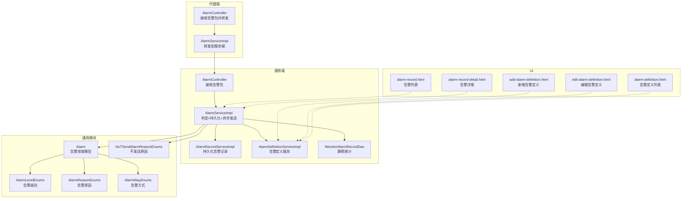
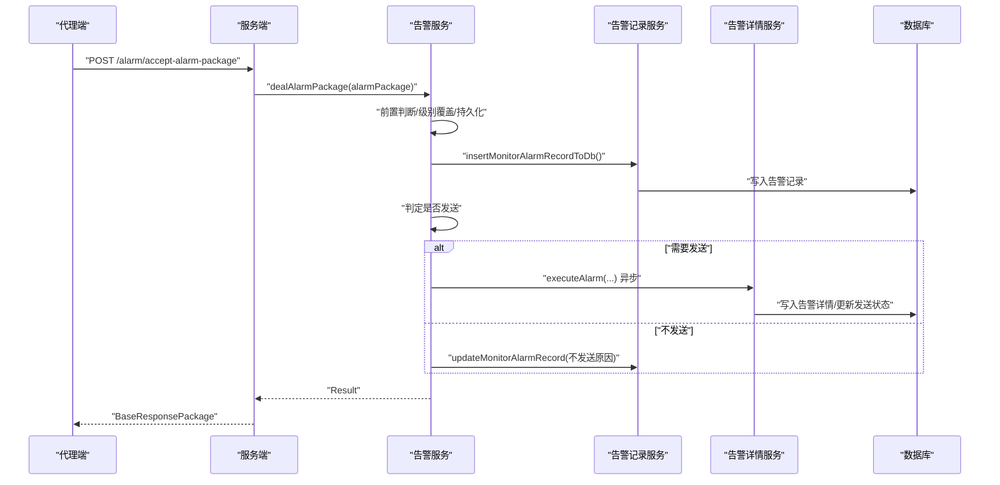
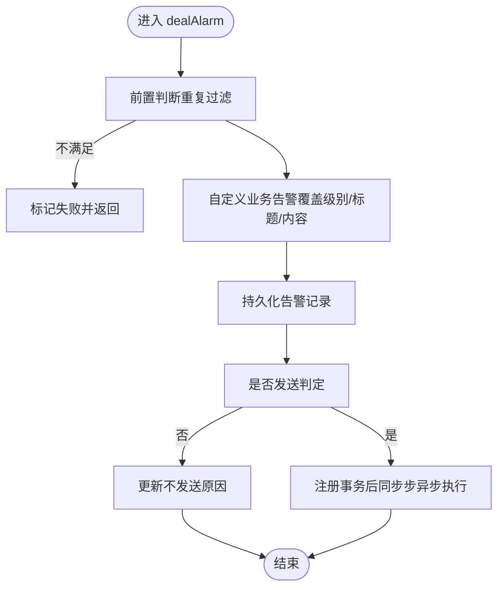
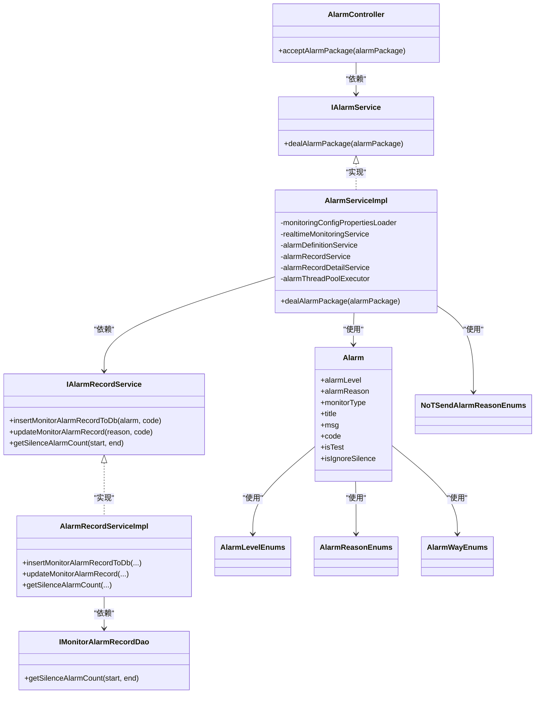
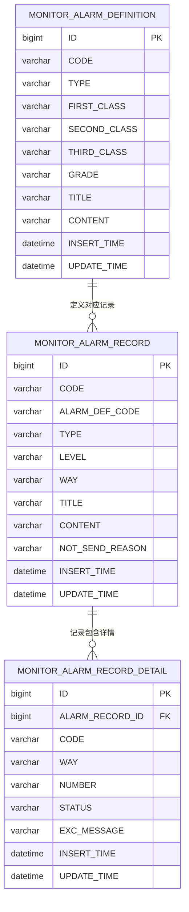

# 告警管理模块

<cite>
**本文引用的文件**
- [AlarmController.java](file://phoenix-server/src/main/java/com/gitee/pifeng/monitoring/server/business/server/controller/AlarmController.java)
- [Alarm.java](file://phoenix-common/src/main/java/com/gitee/pifeng/monitoring/common/domain/Alarm.java)
- [AlarmLevelEnums.java](file://phoenix-common/src/main/java/com/gitee/pifeng/monitoring/common/constant/alarm/AlarmLevelEnums.java)
- [AlarmReasonEnums.java](file://phoenix-common/src/main/java/com/gitee/pifeng/monitoring/common/constant/alarm/AlarmReasonEnums.java)
- [AlarmWayEnums.java](file://phoenix-common/src/main/java/com/gitee/pifeng/monitoring/common/constant/alarm/AlarmWayEnums.java)
- [AlarmServiceImpl.java](file://phoenix-server/src/main/java/com/gitee/pifeng/monitoring/server/business/server/service/impl/AlarmServiceImpl.java)
- [IAlarmService.java](file://phoenix-server/src/main/java/com/gitee/pifeng/monitoring/server/business/server/service/IAlarmService.java)
- [IAlarmRecordService.java](file://phoenix-server/src/main/java/com/gitee/pifeng/monitoring/server/business/server/service/IAlarmRecordService.java)
- [AlarmRecordServiceImpl.java](file://phoenix-server/src/main/java/com/gitee/pifeng/monitoring/server/business/server/service/impl/AlarmRecordServiceImpl.java)
- [IMonitorAlarmRecordDao.java](file://phoenix-server/src/main/java/com/gitee/pifeng/monitoring/server/business/server/dao/IMonitorAlarmRecordDao.java)
- [MonitorAlarmDefinition.java](file://phoenix-server/src/main/java/com/gitee/pifeng/monitoring/server/business/server/entity/MonitorAlarmDefinition.java)
- [MonitorAlarmRecord.java](file://phoenix-server/src/main/java/com/gitee/pifeng/monitoring/server/business/server/entity/MonitorAlarmRecord.java)
- [MonitorAlarmRecordDetail.java](file://phoenix-server/src/main/java/com/gitee/pifeng/monitoring/server/business/server/entity/MonitorAlarmRecordDetail.java)
- [NoTSendAlarmReasonEnums.java](file://phoenix-common/src/main/java/com/gitee/pifeng/monitoring/common/constant/alarm/NoTSendAlarmReasonEnums.java)
- [phoenix.sql](file://doc/数据库设计/sql/mysql/phoenix.sql)
- [AlarmController.java](file://phoenix-agent/src/main/java/com/gitee/pifeng/monitoring/agent/business/client/controller/AlarmController.java)
- [AlarmServiceImpl.java](file://phoenix-agent/src/main/java/com/gitee/pifeng/monitoring/agent/business/client/service/impl/AlarmServiceImpl.java)
- [alarm-record.html](file://phoenix-ui/src/main/resources/templates/alarm/alarm-record.html)
- [alarm-record-detail.html](file://phoenix-ui/src/main/resources/templates/alarm/alarm-record-detail.html)
- [add-alarm-definition.html](file://phoenix-ui/src/main/resources/templates/set/add-alarm-definition.html)
- [edit-alarm-definition.html](file://phoenix-ui/src/main/resources/templates/set/edit-alarm-definition.html)
- [alarm-definition.html](file://phoenix-ui/src/main/resources/templates/set/alarm-definition.html)
</cite>

## 目录
1. [简介](#简介)
2. [项目结构](#项目结构)
3. [核心组件](#核心组件)
4. [架构总览](#架构总览)
5. [组件详解](#组件详解)
6. [依赖关系分析](#依赖关系分析)
7. [性能考量](#性能考量)
8. [故障排查指南](#故障排查指南)
9. [结论](#结论)
10. [附录](#附录)

## 简介
本技术文档围绕告警管理模块展开，系统性阐述告警记录控制器与告警定义控制器的功能实现，覆盖告警记录查询、告警详情查看、告警规则配置、告警通知管理等核心能力。文档同时深入解析告警触发机制、告警级别分类、告警处理流程，并结合数据库模型与前端页面，给出告警页面功能说明、规则配置管理要点以及扩展指南（新增告警类型、自定义规则、集成第三方告警系统）。

## 项目结构
告警管理模块横跨三个子工程：
- 代理端（phoenix-agent）：负责采集与上报告警包，接收服务端下发的指令并转发。
- 服务端（phoenix-server）：负责接收告警包、判定是否发送、持久化记录、异步发送通知、维护告警定义与记录。
- 通用模块（phoenix-common）：提供告警领域模型、枚举、DTO、异常等公共能力。
- UI（phoenix-ui）：提供告警页面，包括告警列表、详情、告警定义的增删改查。

图表来源
- [AlarmController.java:1-78](file://phoenix-server/src/main/java/com/gitee/pifeng/monitoring/server/business/server/controller/AlarmController.java#L1-L78)
- [AlarmServiceImpl.java:1-304](file://phoenix-server/src/main/java/com/gitee/pifeng/monitoring/server/business/server/service/impl/AlarmServiceImpl.java#L1-L304)
- [AlarmRecordServiceImpl.java:1-120](file://phoenix-server/src/main/java/com/gitee/pifeng/monitoring/server/business/server/service/impl/AlarmRecordServiceImpl.java#L1-L120)
- [Alarm.java:1-117](file://phoenix-common/src/main/java/com/gitee/pifeng/monitoring/common/domain/Alarm.java#L1-L117)
- [AlarmLevelEnums.java:1-118](file://phoenix-common/src/main/java/com/gitee/pifeng/monitoring/common/constant/alarm/AlarmLevelEnums.java#L1-L118)
- [AlarmReasonEnums.java:1-34](file://phoenix-common/src/main/java/com/gitee/pifeng/monitoring/common/constant/alarm/AlarmReasonEnums.java#L1-L34)
- [AlarmWayEnums.java:1-94](file://phoenix-common/src/main/java/com/gitee/pifeng/monitoring/common/constant/alarm/AlarmWayEnums.java#L1-L94)
- [NoTSendAlarmReasonEnums.java:1-78](file://phoenix-common/src/main/java/com/gitee/pifeng/monitoring/common/constant/alarm/NoTSendAlarmReasonEnums.java#L1-L78)
- [alarm-record.html](file://phoenix-ui/src/main/resources/templates/alarm/alarm-record.html)
- [alarm-record-detail.html](file://phoenix-ui/src/main/resources/templates/alarm/alarm-record-detail.html)
- [add-alarm-definition.html](file://phoenix-ui/src/main/resources/templates/set/add-alarm-definition.html)
- [edit-alarm-definition.html](file://phoenix-ui/src/main/resources/templates/set/edit-alarm-definition.html)
- [alarm-definition.html](file://phoenix-ui/src/main/resources/templates/set/alarm-definition.html)

章节来源
- [AlarmController.java:1-78](file://phoenix-server/src/main/java/com/gitee/pifeng/monitoring/server/business/server/controller/AlarmController.java#L1-L78)
- [AlarmServiceImpl.java:1-304](file://phoenix-server/src/main/java/com/gitee/pifeng/monitoring/server/business/server/service/impl/AlarmServiceImpl.java#L1-L304)
- [AlarmRecordServiceImpl.java:1-120](file://phoenix-server/src/main/java/com/gitee/pifeng/monitoring/server/business/server/service/impl/AlarmRecordServiceImpl.java#L1-L120)
- [Alarm.java:1-117](file://phoenix-common/src/main/java/com/gitee/pifeng/monitoring/common/domain/Alarm.java#L1-L117)
- [AlarmLevelEnums.java:1-118](file://phoenix-common/src/main/java/com/gitee/pifeng/monitoring/common/constant/alarm/AlarmLevelEnums.java#L1-L118)
- [AlarmReasonEnums.java:1-34](file://phoenix-common/src/main/java/com/gitee/pifeng/monitoring/common/constant/alarm/AlarmReasonEnums.java#L1-L34)
- [AlarmWayEnums.java:1-94](file://phoenix-common/src/main/java/com/gitee/pifeng/monitoring/common/constant/alarm/AlarmWayEnums.java#L1-L94)
- [NoTSendAlarmReasonEnums.java:1-78](file://phoenix-common/src/main/java/com/gitee/pifeng/monitoring/common/constant/alarm/NoTSendAlarmReasonEnums.java#L1-L78)
- [alarm-record.html](file://phoenix-ui/src/main/resources/templates/alarm/alarm-record.html)
- [alarm-record-detail.html](file://phoenix-ui/src/main/resources/templates/alarm/alarm-record-detail.html)
- [add-alarm-definition.html](file://phoenix-ui/src/main/resources/templates/set/add-alarm-definition.html)
- [edit-alarm-definition.html](file://phoenix-ui/src/main/resources/templates/set/edit-alarm-definition.html)
- [alarm-definition.html](file://phoenix-ui/src/main/resources/templates/set/alarm-definition.html)

## 核心组件
- 告警记录控制器（服务端）：接收来自代理端或客户端的告警包，调用服务层处理并返回基础响应包。
- 告警服务实现：负责告警前置判断、级别与标题/内容覆盖、持久化、判定是否发送、异步发送通知。
- 告警记录服务：将告警记录写入数据库，支持静默期统计与更新不发送原因。
- 告警定义实体与DAO：存储告警定义（类型、级别、标题、内容等），提供查询能力。
- 告警领域模型与枚举：统一描述告警级别、原因、方式及不发送原因，支撑判定逻辑。
- UI 页面：提供告警列表、详情、告警定义的增删改查界面。

章节来源
- [AlarmController.java:1-78](file://phoenix-server/src/main/java/com/gitee/pifeng/monitoring/server/business/server/controller/AlarmController.java#L1-L78)
- [AlarmServiceImpl.java:1-304](file://phoenix-server/src/main/java/com/gitee/pifeng/monitoring/server/business/server/service/impl/AlarmServiceImpl.java#L1-L304)
- [AlarmRecordServiceImpl.java:1-120](file://phoenix-server/src/main/java/com/gitee/pifeng/monitoring/server/business/server/service/impl/AlarmRecordServiceImpl.java#L1-L120)
- [MonitorAlarmDefinition.java:1-95](file://phoenix-server/src/main/java/com/gitee/pifeng/monitoring/server/business/server/entity/MonitorAlarmDefinition.java#L1-L95)
- [MonitorAlarmRecord.java:1-93](file://phoenix-server/src/main/java/com/gitee/pifeng/monitoring/server/business/server/entity/MonitorAlarmRecord.java#L1-L93)
- [MonitorAlarmRecordDetail.java:1-84](file://phoenix-server/src/main/java/com/gitee/pifeng/monitoring/server/business/server/entity/MonitorAlarmRecordDetail.java#L1-L84)
- [Alarm.java:1-117](file://phoenix-common/src/main/java/com/gitee/pifeng/monitoring/common/domain/Alarm.java#L1-L117)
- [AlarmLevelEnums.java:1-118](file://phoenix-common/src/main/java/com/gitee/pifeng/monitoring/common/constant/alarm/AlarmLevelEnums.java#L1-L118)
- [AlarmReasonEnums.java:1-34](file://phoenix-common/src/main/java/com/gitee/pifeng/monitoring/common/constant/alarm/AlarmReasonEnums.java#L1-L34)
- [AlarmWayEnums.java:1-94](file://phoenix-common/src/main/java/com/gitee/pifeng/monitoring/common/constant/alarm/AlarmWayEnums.java#L1-L94)
- [NoTSendAlarmReasonEnums.java:1-78](file://phoenix-common/src/main/java/com/gitee/pifeng/monitoring/common/constant/alarm/NoTSendAlarmReasonEnums.java#L1-L78)

## 架构总览
告警管理采用“代理端上报—服务端判定—持久化—异步通知”的流水线式处理。代理端将告警包转发至服务端，服务端通过配置与实时监控判定是否发送，随后持久化记录并异步执行通知发送，确保主线程快速返回。

图表来源
- [AlarmController.java:59-75](file://phoenix-server/src/main/java/com/gitee/pifeng/monitoring/server/business/server/controller/AlarmController.java#L59-L75)
- [AlarmServiceImpl.java:86-170](file://phoenix-server/src/main/java/com/gitee/pifeng/monitoring/server/business/server/service/impl/AlarmServiceImpl.java#L86-L170)
- [AlarmRecordServiceImpl.java:51-80](file://phoenix-server/src/main/java/com/gitee/pifeng/monitoring/server/business/server/service/impl/AlarmRecordServiceImpl.java#L51-L80)
- [IAlarmRecordService.java:18-31](file://phoenix-server/src/main/java/com/gitee/pifeng/monitoring/server/business/server/service/IAlarmRecordService.java#L18-L31)
- [IAlarmRecordDetailService.java:15-32](file://phoenix-server/src/main/java/com/gitee/pifeng/monitoring/server/business/server/service/IAlarmRecordDetailService.java#L15-L32)

## 组件详解

### 告警记录控制器（服务端）
- 职责：接收代理端/客户端的告警包，调用服务层处理，构造基础响应包返回。
- 关键点：计时统计处理耗时，超过阈值输出告警日志；使用包构造器将结果封装为响应包。

章节来源
- [AlarmController.java:59-75](file://phoenix-server/src/main/java/com/gitee/pifeng/monitoring/server/business/server/controller/AlarmController.java#L59-L75)

### 告警服务实现（服务端）
- 前置判断：基于实时监控服务进行重复告警过滤。
- 自定义业务告警覆盖：若类型为自定义且提供告警编码，从告警定义表查询级别、标题、内容进行覆盖。
- 持久化：无论是否发送，先写入告警记录。
- 发送判定：综合告警开关、静默时段、测试消息、告警级别阈值、标题/内容完整性、告警方式配置等。
- 异步发送：事务完成后异步执行告警详情发送，避免阻塞主线程。

图表来源
- [AlarmServiceImpl.java:105-170](file://phoenix-server/src/main/java/com/gitee/pifeng/monitoring/server/business/server/service/impl/AlarmServiceImpl.java#L105-L170)
- [AlarmServiceImpl.java:206-284](file://phoenix-server/src/main/java/com/gitee/pifeng/monitoring/server/business/server/service/impl/AlarmServiceImpl.java#L206-L284)

章节来源
- [AlarmServiceImpl.java:86-170](file://phoenix-server/src/main/java/com/gitee/pifeng/monitoring/server/business/server/service/impl/AlarmServiceImpl.java#L86-L170)
- [AlarmServiceImpl.java:206-284](file://phoenix-server/src/main/java/com/gitee/pifeng/monitoring/server/business/server/service/impl/AlarmServiceImpl.java#L206-L284)

### 告警记录服务
- 功能：将告警记录写入数据库，返回主键ID；支持更新不发送原因；提供静默期告警数量统计。

章节来源
- [IAlarmRecordService.java:18-56](file://phoenix-server/src/main/java/com/gitee/pifeng/monitoring/server/business/server/service/IAlarmRecordService.java#L18-L56)
- [AlarmRecordServiceImpl.java:51-101](file://phoenix-server/src/main/java/com/gitee/pifeng/monitoring/server/business/server/service/impl/AlarmRecordServiceImpl.java#L51-L101)
- [IMonitorAlarmRecordDao.java:17-30](file://phoenix-server/src/main/java/com/gitee/pifeng/monitoring/server/business/server/dao/IMonitorAlarmRecordDao.java#L17-L30)

### 告警定义与记录实体
- 告警定义：存储告警类型、级别、编码、标题、内容等，用于自定义业务告警覆盖。
- 告警记录：存储告警代码、类型、级别、方式、标题、内容、不发送原因等。
- 告警记录详情：存储每次告警方式的发送状态、异常信息、时间戳等。

章节来源
- [MonitorAlarmDefinition.java:26-94](file://phoenix-server/src/main/java/com/gitee/pifeng/monitoring/server/business/server/entity/MonitorAlarmDefinition.java#L26-L94)
- [MonitorAlarmRecord.java:23-92](file://phoenix-server/src/main/java/com/gitee/pifeng/monitoring/server/business/server/entity/MonitorAlarmRecord.java#L23-L92)
- [MonitorAlarmRecordDetail.java:26-83](file://phoenix-server/src/main/java/com/gitee/pifeng/monitoring/server/business/server/entity/MonitorAlarmRecordDetail.java#L26-L83)

### 告警领域模型与枚举
- 告警模型：包含级别、原因、监控类型、字符集、测试标志、标题、内容、编码、被告警主体ID、是否无视静默等字段。
- 告警级别：提供级别比较与字符串转换。
- 告警原因：区分正常变异常、异常变正常、发现、忽略。
- 告警方式：短信、邮件等枚举及转换工具。
- 不发送原因：枚举化记录不发送的原因，便于统计与排查。

章节来源
- [Alarm.java:21-116](file://phoenix-common/src/main/java/com/gitee/pifeng/monitoring/common/domain/Alarm.java#L21-L116)
- [AlarmLevelEnums.java:13-117](file://phoenix-common/src/main/java/com/gitee/pifeng/monitoring/common/constant/alarm/AlarmLevelEnums.java#L13-L117)
- [AlarmReasonEnums.java:11-33](file://phoenix-common/src/main/java/com/gitee/pifeng/monitoring/common/constant/alarm/AlarmReasonEnums.java#L11-L33)
- [AlarmWayEnums.java:16-93](file://phoenix-common/src/main/java/com/gitee/pifeng/monitoring/common/constant/alarm/AlarmWayEnums.java#L16-L93)
- [NoTSendAlarmReasonEnums.java:21-56](file://phoenix-common/src/main/java/com/gitee/pifeng/monitoring/common/constant/alarm/NoTSendAlarmReasonEnums.java#L21-L56)

### 代理端告警处理
- 代理端控制器接收告警包，调用服务层将告警包转发至服务端。
- 服务层仅做转发，不参与判定与持久化。

章节来源
- [AlarmController.java:1-41](file://phoenix-agent/src/main/java/com/gitee/pifeng/monitoring/agent/business/client/controller/AlarmController.java#L1-L41)
- [AlarmServiceImpl.java:1-39](file://phoenix-agent/src/main/java/com/gitee/pifeng/monitoring/agent/business/client/service/impl/AlarmServiceImpl.java#L1-L39)

### UI 页面与功能
- 告警列表页：展示告警记录，支持筛选与分页。
- 告警详情页：展示告警详情与各方式发送状态。
- 告警定义页：支持新增、编辑、删除告警定义，配置类型、级别、标题、内容等。

章节来源
- [alarm-record.html](file://phoenix-ui/src/main/resources/templates/alarm/alarm-record.html)
- [alarm-record-detail.html](file://phoenix-ui/src/main/resources/templates/alarm/alarm-record-detail.html)
- [add-alarm-definition.html](file://phoenix-ui/src/main/resources/templates/set/add-alarm-definition.html)
- [edit-alarm-definition.html](file://phoenix-ui/src/main/resources/templates/set/edit-alarm-definition.html)
- [alarm-definition.html](file://phoenix-ui/src/main/resources/templates/set/alarm-definition.html)

## 依赖关系分析
- 控制器依赖服务接口，服务实现依赖配置加载器、实时监控服务、告警定义/记录服务、线程池。
- 告警记录服务依赖DAO进行持久化与统计。
- 告警模型与枚举被广泛使用，贯穿判定与持久化流程。
- UI 通过模板与后端交互，后端提供数据接口支撑页面展示。

图表来源
- [AlarmController.java:35-47](file://phoenix-server/src/main/java/com/gitee/pifeng/monitoring/server/business/server/controller/AlarmController.java#L35-L47)
- [IAlarmService.java:14-26](file://phoenix-server/src/main/java/com/gitee/pifeng/monitoring/server/business/server/service/IAlarmService.java#L14-L26)
- [AlarmServiceImpl.java:37-74](file://phoenix-server/src/main/java/com/gitee/pifeng/monitoring/server/business/server/service/impl/AlarmServiceImpl.java#L37-L74)
- [IAlarmRecordService.java:18-56](file://phoenix-server/src/main/java/com/gitee/pifeng/monitoring/server/business/server/service/IAlarmRecordService.java#L18-L56)
- [AlarmRecordServiceImpl.java:32-38](file://phoenix-server/src/main/java/com/gitee/pifeng/monitoring/server/business/server/service/impl/AlarmRecordServiceImpl.java#L32-L38)
- [IMonitorAlarmRecordDao.java:17-30](file://phoenix-server/src/main/java/com/gitee/pifeng/monitoring/server/business/server/dao/IMonitorAlarmRecordDao.java#L17-L30)
- [Alarm.java:21-116](file://phoenix-common/src/main/java/com/gitee/pifeng/monitoring/common/domain/Alarm.java#L21-L116)
- [AlarmLevelEnums.java:13-117](file://phoenix-common/src/main/java/com/gitee/pifeng/monitoring/common/constant/alarm/AlarmLevelEnums.java#L13-L117)
- [AlarmReasonEnums.java:11-33](file://phoenix-common/src/main/java/com/gitee/pifeng/monitoring/common/constant/alarm/AlarmReasonEnums.java#L11-L33)
- [AlarmWayEnums.java:16-93](file://phoenix-common/src/main/java/com/gitee/pifeng/monitoring/common/constant/alarm/AlarmWayEnums.java#L16-L93)
- [NoTSendAlarmReasonEnums.java:21-56](file://phoenix-common/src/main/java/com/gitee/pifeng/monitoring/common/constant/alarm/NoTSendAlarmReasonEnums.java#L21-L56)

## 性能考量
- 异步发送：通过线程池异步执行告警详情发送，避免阻塞主线程，提升吞吐。
- 事务后同步：在事务提交后再执行异步任务，保证数据一致性与处理原子性。
- 前置判断：重复告警过滤减少无效发送，降低系统负载。
- 日志计时：对处理耗时进行统计与告警，便于定位性能瓶颈。

章节来源
- [AlarmServiceImpl.java:160-192](file://phoenix-server/src/main/java/com/gitee/pifeng/monitoring/server/business/server/service/impl/AlarmServiceImpl.java#L160-L192)
- [AlarmController.java:64-74](file://phoenix-server/src/main/java/com/gitee/pifeng/monitoring/server/business/server/controller/AlarmController.java#L64-L74)

## 故障排查指南
- 常见不发送原因：
  - 告警开关关闭、静默时段、测试消息、级别不足、标题/内容为空、未配置告警方式。
- 排查步骤：
  - 查看告警记录表的“不发送原因”字段，确认具体原因。
  - 检查配置属性（告警开关、静默时段、告警级别阈值、告警方式）。
  - 核对自定义业务告警编码是否正确，数据库是否存在对应定义。
  - 关注异步发送线程池状态与异常日志。

章节来源
- [NoTSendAlarmReasonEnums.java:21-56](file://phoenix-common/src/main/java/com/gitee/pifeng/monitoring/common/constant/alarm/NoTSendAlarmReasonEnums.java#L21-L56)
- [AlarmRecordServiceImpl.java:92-101](file://phoenix-server/src/main/java/com/gitee/pifeng/monitoring/server/business/server/service/impl/AlarmRecordServiceImpl.java#L92-L101)
- [AlarmServiceImpl.java:206-284](file://phoenix-server/src/main/java/com/gitee/pifeng/monitoring/server/business/server/service/impl/AlarmServiceImpl.java#L206-L284)

## 结论
告警管理模块以清晰的职责划分与稳定的异步处理机制，实现了从告警上报、判定、持久化到通知发送的全链路闭环。通过统一的领域模型与枚举体系，保障了告警级别的可配置与可扩展；通过UI页面与数据库模型支撑，提供了完整的告警管理能力。建议在生产环境中重点关注配置校验、静默时段策略与异步线程池容量规划，以获得更佳的稳定性与性能表现。

## 附录

### 数据模型概览

图表来源
- [phoenix.sql:46-89](file://doc/数据库设计/sql/mysql/phoenix.sql#L46-L89)
- [MonitorAlarmDefinition.java:26-94](file://phoenix-server/src/main/java/com/gitee/pifeng/monitoring/server/business/server/entity/MonitorAlarmDefinition.java#L26-L94)
- [MonitorAlarmRecord.java:23-92](file://phoenix-server/src/main/java/com/gitee/pifeng/monitoring/server/business/server/entity/MonitorAlarmRecord.java#L23-L92)
- [MonitorAlarmRecordDetail.java:26-83](file://phoenix-server/src/main/java/com/gitee/pifeng/monitoring/server/business/server/entity/MonitorAlarmRecordDetail.java#L26-L83)

### 告警页面功能清单
- 告警列表页：展示告警记录，支持筛选与分页。
- 告警详情页：展示告警详情与各方式发送状态。
- 告警定义页：支持新增、编辑、删除告警定义，配置类型、级别、标题、内容等。

章节来源
- [alarm-record.html](file://phoenix-ui/src/main/resources/templates/alarm/alarm-record.html)
- [alarm-record-detail.html](file://phoenix-ui/src/main/resources/templates/alarm/alarm-record-detail.html)
- [add-alarm-definition.html](file://phoenix-ui/src/main/resources/templates/set/add-alarm-definition.html)
- [edit-alarm-definition.html](file://phoenix-ui/src/main/resources/templates/set/edit-alarm-definition.html)
- [alarm-definition.html](file://phoenix-ui/src/main/resources/templates/set/alarm-definition.html)

### 扩展指南
- 新增告警类型：
  - 在监控类型枚举中扩展类型，确保服务端判定与持久化逻辑兼容。
  - 在UI中完善对应页面与表单。
- 自定义告警规则：
  - 通过告警定义表配置编码、级别、标题、内容，服务端在自定义业务告警场景下自动覆盖。
- 集成第三方告警系统：
  - 在告警详情服务中扩展新的通知通道（如企业微信、钉钉、飞书等），实现多通道并行或择优发送。
  - 保持与现有“告警方式”枚举与数据库字段的兼容，避免破坏既有流程。

章节来源
- [AlarmWayEnums.java:16-93](file://phoenix-common/src/main/java/com/gitee/pifeng/monitoring/common/constant/alarm/AlarmWayEnums.java#L16-L93)
- [MonitorAlarmDefinition.java:26-94](file://phoenix-server/src/main/java/com/gitee/pifeng/monitoring/server/business/server/entity/MonitorAlarmDefinition.java#L26-L94)
- [IAlarmRecordDetailService.java:15-32](file://phoenix-server/src/main/java/com/gitee/pifeng/monitoring/server/business/server/service/IAlarmRecordDetailService.java#L15-L32)