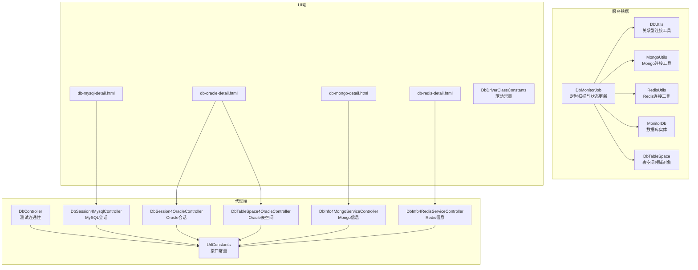
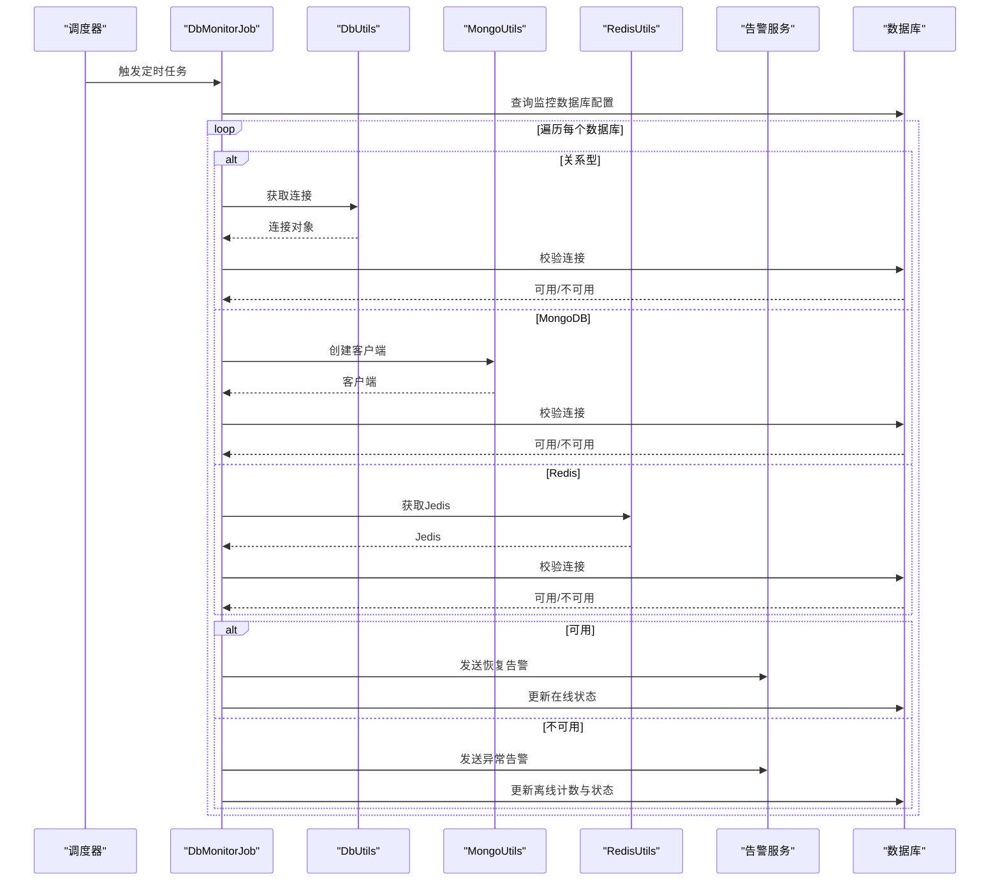
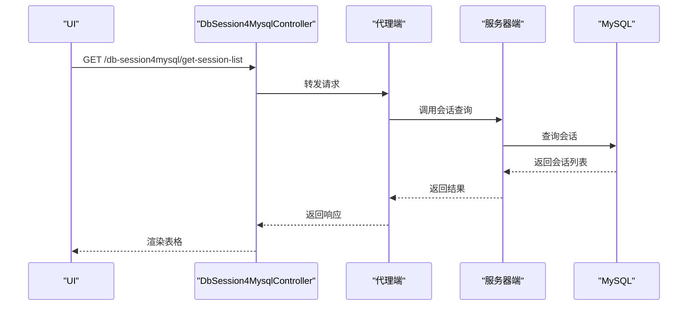
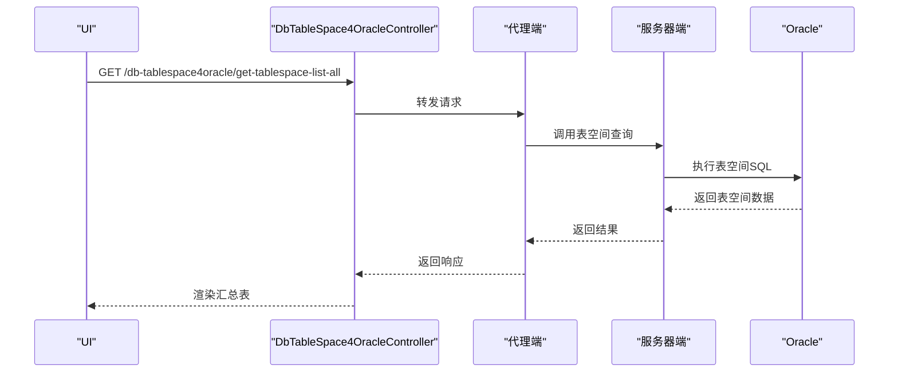
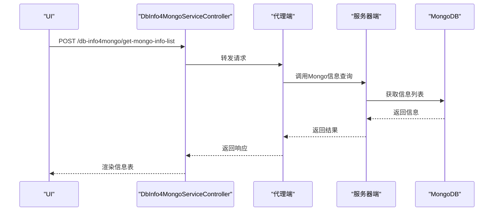
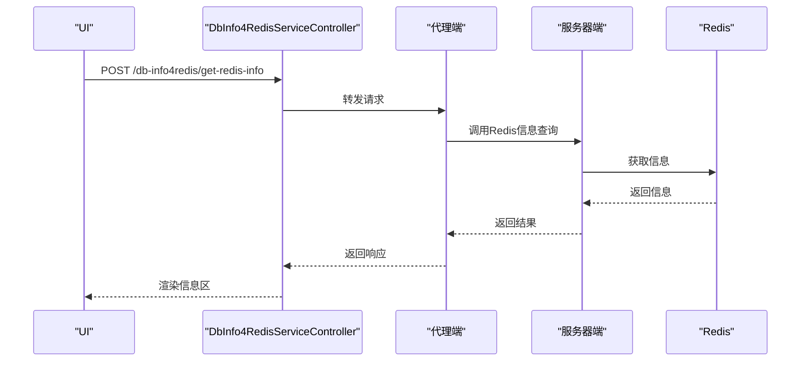
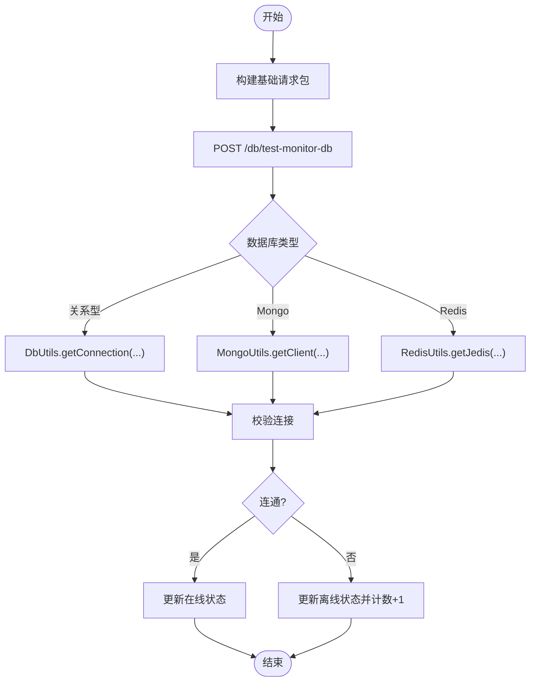
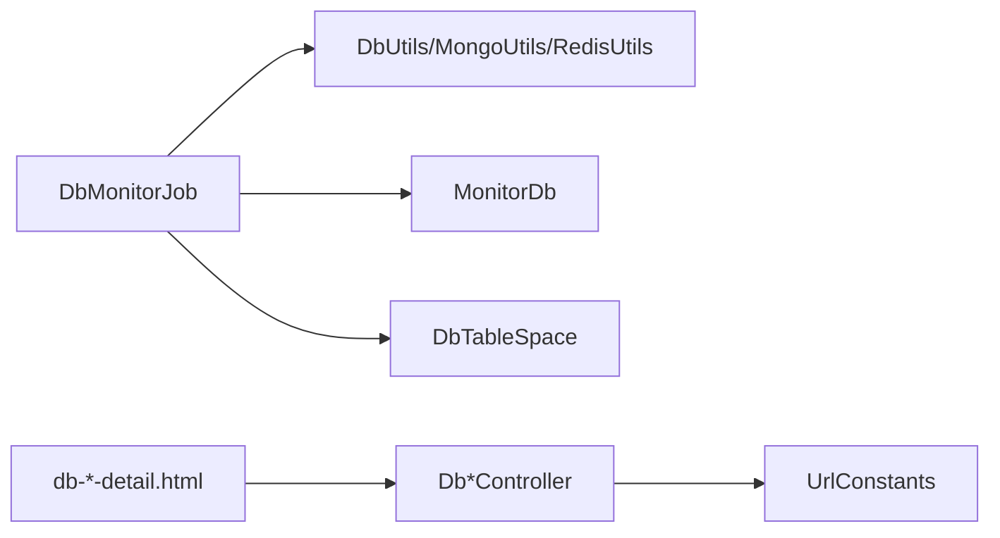

# 数据库监控模块

<cite>
**本文引用的文件**
- [DbMonitorJob.java](file://phoenix-server/src/main/java/com/gitee/pifeng/monitoring/server/business/server/monitor/db/DbMonitorJob.java)
- [DbUtils.java](file://phoenix-server/src/main/java/com/gitee/pifeng/monitoring/server/util/db/DbUtils.java)
- [MongoUtils.java](file://phoenix-server/src/main/java/com/gitee/pifeng/monitoring/server/util/db/MongoUtils.java)
- [RedisUtils.java](file://phoenix-server/src/main/java/com/gitee/pifeng/monitoring/server/util/db/RedisUtils.java)
- [MonitorDb.java](file://phoenix-server/src/main/java/com/gitee/pifeng/monitoring/server/business/server/entity/MonitorDb.java)
- [DbTableSpace.java](file://phoenix-server/src/main/java/com/gitee/pifeng/monitoring/server/business/server/domain/DbTableSpace.java)
- [Oracle.java](file://phoenix-common/phoenix-common-core/src/main/java/com/gitee/pifeng/monitoring/common/constant/sql/Oracle.java)
- [DbController.java](file://phoenix-agent/src/main/java/com/gitee/pifeng/monitoring/agent/business/client/controller/DbController.java)
- [DbSession4MysqlController.java](file://phoenix-agent/src/main/java/com/gitee/pifeng/monitoring/agent/business/client/controller/DbSession4MysqlController.java)
- [DbSession4OracleController.java](file://phoenix-agent/src/main/java/com/gitee/pifeng/monitoring/agent/business/client/controller/DbSession4OracleController.java)
- [DbTableSpace4OracleController.java](file://phoenix-agent/src/main/java/com/gitee/pifeng/monitoring/agent/business/client/controller/DbTableSpace4OracleController.java)
- [DbInfo4MongoServiceController.java](file://phoenix-agent/src/main/java/com/gitee/pifeng/monitoring/agent/business/client/controller/DbInfo4MongoServiceController.java)
- [DbInfo4RedisServiceController.java](file://phoenix-agent/src/main/java/com/gitee/pifeng/monitoring/agent/business/client/controller/DbInfo4RedisServiceController.java)
- [UrlConstants.java](file://phoenix-agent/src/main/java/com/gitee/pifeng/monitoring/agent/constant/UrlConstants.java)
- [DbDriverClassConstants.java](file://phoenix-ui/src/main/java/com/gitee/pifeng/monitoring/ui/constant/DbDriverClassConstants.java)
- [db-mysql-detail.html](file://phoenix-ui/src/main/resources/templates/db/db-mysql-detail.html)
- [db-oracle-detail.html](file://phoenix-ui/src/main/resources/templates/db/db-oracle-detail.html)
- [db-mongo-detail.html](file://phoenix-ui/src/main/resources/templates/db/db-mongo-detail.html)
- [db-redis-detail.html](file://phoenix-ui/src/main/resources/templates/db/db-redis-detail.html)
- [phoenix.sql](file://doc/数据库设计/sql/mysql/phoenix.sql)
- [MonitoringDbProperties.java](file://phoenix-common/phoenix-common-core/src/main/java/com/gitee/pifeng/monitoring/common/property/server/MonitoringDbProperties.java)
</cite>

## 目录
1. [简介](#简介)
2. [项目结构](#项目结构)
3. [核心组件](#核心组件)
4. [架构总览](#架构总览)
5. [详细组件分析](#详细组件分析)
6. [依赖分析](#依赖分析)
7. [性能考虑](#性能考虑)
8. [故障排查指南](#故障排查指南)
9. [结论](#结论)
10. [附录](#附录)

## 简介
本文件系统性梳理数据库监控模块的设计与实现，覆盖关系型数据库（MySQL、Oracle）、NoSQL（MongoDB）与缓存（Redis）的监控能力，包括连接状态监控、会话管理、表空间监控、性能指标采集与展示、配置与告警策略、以及扩展指南。文档面向开发与运维人员，既提供代码级分析，也给出可视化图表与实操建议。

## 项目结构
数据库监控模块由三部分组成：
- 服务器端（定时任务与工具类）：负责周期性扫描数据库、连接校验、告警触发与状态更新。
- 代理端（控制器）：对外暴露REST接口，供UI或客户端发起监控与管理操作。
- UI端（模板与权限）：提供数据库详情页与交互界面，按数据库类型动态加载对应模块。

**图表来源**
- [DbMonitorJob.java:101-156](file://phoenix-server/src/main/java/com/gitee/pifeng/monitoring/server/business/server/monitor/db/DbMonitorJob.java#L101-L156)
- [DbUtils.java:46-55](file://phoenix-server/src/main/java/com/gitee/pifeng/monitoring/server/util/db/DbUtils.java#L46-L55)
- [MongoUtils.java:41-77](file://phoenix-server/src/main/java/com/gitee/pifeng/monitoring/server/util/db/MongoUtils.java#L41-L77)
- [RedisUtils.java:44-80](file://phoenix-server/src/main/java/com/gitee/pifeng/monitoring/server/util/db/RedisUtils.java#L44-L80)
- [MonitorDb.java:26-68](file://phoenix-server/src/main/java/com/gitee/pifeng/monitoring/server/business/server/entity/MonitorDb.java#L26-L68)
- [DbTableSpace.java:22-54](file://phoenix-server/src/main/java/com/gitee/pifeng/monitoring/server/business/server/domain/DbTableSpace.java#L22-L54)
- [DbController.java:52-58](file://phoenix-agent/src/main/java/com/gitee/pifeng/monitoring/agent/business/client/controller/DbController.java#L52-L58)
- [DbSession4MysqlController.java:53-56](file://phoenix-agent/src/main/java/com/gitee/pifeng/monitoring/agent/business/client/controller/DbSession4MysqlController.java#L53-L56)
- [DbSession4OracleController.java:53-56](file://phoenix-agent/src/main/java/com/gitee/pifeng/monitoring/agent/business/client/controller/DbSession4OracleController.java#L53-L56)
- [DbTableSpace4OracleController.java:53-56](file://phoenix-agent/src/main/java/com/gitee/pifeng/monitoring/agent/business/client/controller/DbTableSpace4OracleController.java#L53-L56)
- [DbInfo4MongoServiceController.java:53-56](file://phoenix-agent/src/main/java/com/gitee/pifeng/monitoring/agent/business/client/controller/DbInfo4MongoServiceController.java#L53-L56)
- [DbInfo4RedisServiceController.java:55-58](file://phoenix-agent/src/main/java/com/gitee/pifeng/monitoring/agent/business/client/controller/DbInfo4RedisServiceController.java#L55-L58)
- [UrlConstants.java:90-126](file://phoenix-agent/src/main/java/com/gitee/pifeng/monitoring/agent/constant/UrlConstants.java#L90-L126)
- [db-mysql-detail.html:208-215](file://phoenix-ui/src/main/resources/templates/db/db-mysql-detail.html#L208-L215)
- [db-oracle-detail.html:225-234](file://phoenix-ui/src/main/resources/templates/db/db-oracle-detail.html#L225-L234)
- [db-mongo-detail.html:135-142](file://phoenix-ui/src/main/resources/templates/db/db-mongo-detail.html#L135-L142)
- [db-redis-detail.html:134-141](file://phoenix-ui/src/main/resources/templates/db/db-redis-detail.html#L134-L141)

**章节来源**
- [DbMonitorJob.java:101-156](file://phoenix-server/src/main/java/com/gitee/pifeng/monitoring/server/business/server/monitor/db/DbMonitorJob.java#L101-L156)
- [UrlConstants.java:90-126](file://phoenix-agent/src/main/java/com/gitee/pifeng/monitoring/agent/constant/UrlConstants.java#L90-L126)

## 核心组件
- 定时监控任务：周期扫描数据库配置表，按类型分别进行连接校验、状态更新与告警。
- 连接工具类：封装关系型、Mongo、Redis的连接获取与可用性检测。
- 实体与领域对象：数据库配置实体与表空间领域对象承载监控数据。
- 代理端控制器：统一暴露REST接口，支持会话查询/终止、表空间查询、信息获取等。
- UI详情页：按数据库类型动态加载对应模块，展示连接状态、概要信息与交互控件。

**章节来源**
- [DbMonitorJob.java:132-149](file://phoenix-server/src/main/java/com/gitee/pifeng/monitoring/server/business/server/monitor/db/DbMonitorJob.java#L132-L149)
- [DbUtils.java:46-55](file://phoenix-server/src/main/java/com/gitee/pifeng/monitoring/server/util/db/DbUtils.java#L46-L55)
- [MongoUtils.java:41-77](file://phoenix-server/src/main/java/com/gitee/pifeng/monitoring/server/util/db/MongoUtils.java#L41-L77)
- [RedisUtils.java:44-80](file://phoenix-server/src/main/java/com/gitee/pifeng/monitoring/server/util/db/RedisUtils.java#L44-L80)
- [MonitorDb.java:26-68](file://phoenix-server/src/main/java/com/gitee/pifeng/monitoring/server/business/server/entity/MonitorDb.java#L26-L68)
- [DbTableSpace.java:22-54](file://phoenix-server/src/main/java/com/gitee/pifeng/monitoring/server/business/server/domain/DbTableSpace.java#L22-L54)

## 架构总览
数据库监控采用“服务器端定时扫描 + 代理端接口 + UI交互”的三层架构。服务器端负责业务逻辑与告警，代理端负责对外服务，UI负责展示与交互。

**图表来源**
- [DbMonitorJob.java:101-156](file://phoenix-server/src/main/java/com/gitee/pifeng/monitoring/server/business/server/monitor/db/DbMonitorJob.java#L101-L156)
- [DbUtils.java:46-55](file://phoenix-server/src/main/java/com/gitee/pifeng/monitoring/server/util/db/DbUtils.java#L46-L55)
- [MongoUtils.java:60-77](file://phoenix-server/src/main/java/com/gitee/pifeng/monitoring/server/util/db/MongoUtils.java#L60-L77)
- [RedisUtils.java:69-80](file://phoenix-server/src/main/java/com/gitee/pifeng/monitoring/server/util/db/RedisUtils.java#L69-L80)

## 详细组件分析

### MySQL连接数监控
- 控制器职责：提供会话列表查询与会话终止能力，便于定位长事务与慢查询。
- 数据采集：通过代理端控制器转发请求到服务器端，服务器端根据数据库类型选择相应工具类进行连接校验。
- 展示逻辑：UI详情页在“会话管理”标签下渲染表格，支持筛选与批量结束会话。

**图表来源**
- [DbSession4MysqlController.java:53-56](file://phoenix-agent/src/main/java/com/gitee/pifeng/monitoring/agent/business/client/controller/DbSession4MysqlController.java#L53-L56)
- [UrlConstants.java:92-94](file://phoenix-agent/src/main/java/com/gitee/pifeng/monitoring/agent/constant/UrlConstants.java#L92-L94)
- [db-mysql-detail.html:208-215](file://phoenix-ui/src/main/resources/templates/db/db-mysql-detail.html#L208-L215)

**章节来源**
- [DbSession4MysqlController.java:53-74](file://phoenix-agent/src/main/java/com/gitee/pifeng/monitoring/agent/business/client/controller/DbSession4MysqlController.java#L53-L74)
- [db-mysql-detail.html:36-118](file://phoenix-ui/src/main/resources/templates/db/db-mysql-detail.html#L36-L118)

### Oracle表空间监控
- 控制器职责：提供按文件与汇总两种维度的表空间查询接口。
- 数据采集：服务器端定时任务对Oracle执行表空间查询SQL，计算使用率与剩余率，并在超过阈值时触发告警。
- 展示逻辑：UI详情页在“表空间”标签下分别渲染“按文件”与“汇总”两个表格。

**图表来源**
- [DbTableSpace4OracleController.java:71-74](file://phoenix-agent/src/main/java/com/gitee/pifeng/monitoring/agent/business/client/controller/DbTableSpace4OracleController.java#L71-L74)
- [UrlConstants.java:112-114](file://phoenix-agent/src/main/java/com/gitee/pifeng/monitoring/agent/constant/UrlConstants.java#L112-L114)
- [Oracle.java:87-106](file://phoenix-common/phoenix-common-core/src/main/java/com/gitee/pifeng/monitoring/common/constant/sql/Oracle.java#L87-L106)
- [db-oracle-detail.html:123-136](file://phoenix-ui/src/main/resources/templates/db/db-oracle-detail.html#L123-L136)

**章节来源**
- [DbTableSpace4OracleController.java:53-74](file://phoenix-agent/src/main/java/com/gitee/pifeng/monitoring/agent/business/client/controller/DbTableSpace4OracleController.java#L53-L74)
- [db-oracle-detail.html:123-136](file://phoenix-ui/src/main/resources/templates/db/db-oracle-detail.html#L123-L136)
- [DbTableSpace.java:22-54](file://phoenix-server/src/main/java/com/gitee/pifeng/monitoring/server/business/server/domain/DbTableSpace.java#L22-L54)

### MongoDB性能监控
- 控制器职责：提供Mongo信息列表查询接口，用于查看实例信息与运行状态。
- 数据采集：服务器端通过Mongo客户端执行listDatabaseNames以验证连通性。
- 展示逻辑：UI详情页在“信息”标签下渲染Mongo信息表格，并支持手动刷新。

**图表来源**
- [DbInfo4MongoServiceController.java:53-56](file://phoenix-agent/src/main/java/com/gitee/pifeng/monitoring/agent/business/client/controller/DbInfo4MongoServiceController.java#L53-L56)
- [UrlConstants.java:122-124](file://phoenix-agent/src/main/java/com/gitee/pifeng/monitoring/agent/constant/UrlConstants.java#L122-L124)
- [MongoUtils.java:60-77](file://phoenix-server/src/main/java/com/gitee/pifeng/monitoring/server/util/db/MongoUtils.java#L60-L77)
- [db-mongo-detail.html:36-52](file://phoenix-ui/src/main/resources/templates/db/db-mongo-detail.html#L36-L52)

**章节来源**
- [DbInfo4MongoServiceController.java:53-56](file://phoenix-agent/src/main/java/com/gitee/pifeng/monitoring/agent/business/client/controller/DbInfo4MongoServiceController.java#L53-L56)
- [MongoUtils.java:41-77](file://phoenix-server/src/main/java/com/gitee/pifeng/monitoring/server/util/db/MongoUtils.java#L41-L77)
- [db-mongo-detail.html:36-52](file://phoenix-ui/src/main/resources/templates/db/db-mongo-detail.html#L36-L52)

### Redis连接状态监控
- 控制器职责：提供Redis信息查询接口，用于查看实例状态与基本信息。
- 数据采集：服务器端通过Jedis执行ping命令以验证连通性。
- 展示逻辑：UI详情页在“信息”标签下渲染Redis主信息、键值信息与详细信息区域，并支持自动刷新开关。

**图表来源**
- [DbInfo4RedisServiceController.java:55-58](file://phoenix-agent/src/main/java/com/gitee/pifeng/monitoring/agent/business/client/controller/DbInfo4RedisServiceController.java#L55-L58)
- [UrlConstants.java:117-119](file://phoenix-agent/src/main/java/com/gitee/pifeng/monitoring/agent/constant/UrlConstants.java#L117-L119)
- [RedisUtils.java:69-80](file://phoenix-server/src/main/java/com/gitee/pifeng/monitoring/server/util/db/RedisUtils.java#L69-L80)
- [db-redis-detail.html:36-51](file://phoenix-ui/src/main/resources/templates/db/db-redis-detail.html#L36-L51)

**章节来源**
- [DbInfo4RedisServiceController.java:55-58](file://phoenix-agent/src/main/java/com/gitee/pifeng/monitoring/agent/business/client/controller/DbInfo4RedisServiceController.java#L55-L58)
- [RedisUtils.java:44-80](file://phoenix-server/src/main/java/com/gitee/pifeng/monitoring/server/util/db/RedisUtils.java#L44-L80)
- [db-redis-detail.html:36-51](file://phoenix-ui/src/main/resources/templates/db/db-redis-detail.html#L36-L51)

### 数据库详情页面的数据展示逻辑
- MySQL详情页：包含“会话管理”“概要”两个标签页，会话管理支持筛选与批量结束；概要展示连接名、URL、用户名、类型、驱动类、描述、状态、时间等字段。
- Oracle详情页：包含“会话管理”“表空间”“概要”三个标签页，会话管理支持筛选与批量结束；表空间展示按文件与汇总两张表；概要同上。
- MongoDB详情页：包含“信息”“概要”两个标签页，信息展示Mongo信息列表；概要同上。
- Redis详情页：包含“信息”“概要”两个标签页，信息展示主信息、键值信息与详细信息区域；概要同上。

**章节来源**
- [db-mysql-detail.html:36-196](file://phoenix-ui/src/main/resources/templates/db/db-mysql-detail.html#L36-L196)
- [db-oracle-detail.html:37-213](file://phoenix-ui/src/main/resources/templates/db/db-oracle-detail.html#L37-L213)
- [db-mongo-detail.html:36-123](file://phoenix-ui/src/main/resources/templates/db/db-mongo-detail.html#L36-L123)
- [db-redis-detail.html:36-122](file://phoenix-ui/src/main/resources/templates/db/db-redis-detail.html#L36-L122)

### 数据库配置管理与连接测试
- 配置项：数据库连接名、URL、用户名、密码、类型、驱动类、描述、在线状态、是否开启监控、是否开启告警等。
- 连接测试：代理端提供测试连通性接口，服务器端根据类型选择对应工具类进行连通性验证。

**图表来源**
- [DbController.java:52-58](file://phoenix-agent/src/main/java/com/gitee/pifeng/monitoring/agent/business/client/controller/DbController.java#L52-L58)
- [DbMonitorJob.java:132-149](file://phoenix-server/src/main/java/com/gitee/pifeng/monitoring/server/business/server/monitor/db/DbMonitorJob.java#L132-L149)
- [DbUtils.java:46-55](file://phoenix-server/src/main/java/com/gitee/pifeng/monitoring/server/util/db/DbUtils.java#L46-L55)
- [MongoUtils.java:41-77](file://phoenix-server/src/main/java/com/gitee/pifeng/monitoring/server/util/db/MongoUtils.java#L41-L77)
- [RedisUtils.java:44-80](file://phoenix-server/src/main/java/com/gitee/pifeng/monitoring/server/util/db/RedisUtils.java#L44-L80)

**章节来源**
- [DbController.java:52-58](file://phoenix-agent/src/main/java/com/gitee/pifeng/monitoring/agent/business/client/controller/DbController.java#L52-L58)
- [phoenix.sql:116-125](file://doc/数据库设计/sql/mysql/phoenix.sql#L116-L125)
- [MonitorDb.java:26-68](file://phoenix-server/src/main/java/com/gitee/pifeng/monitoring/server/business/server/entity/MonitorDb.java#L26-L68)

### 性能分析算法与阈值
- 连接阈值：服务器端在多次尝试后判定连通性，避免瞬时抖动导致误判。
- 表空间阈值：服务器端对表空间使用率进行比较，超过阈值即触发告警。
- 告警策略：区分“异常转正常”“正常转异常”，并携带数据库类型、URL、描述、环境、分组等上下文信息。

**章节来源**
- [DbMonitorJob.java:176-182](file://phoenix-server/src/main/java/com/gitee/pifeng/monitoring/server/business/server/monitor/db/DbMonitorJob.java#L176-L182)
- [DbMonitorJob.java:196-203](file://phoenix-server/src/main/java/com/gitee/pifeng/monitoring/server/business/server/monitor/db/DbMonitorJob.java#L196-L203)
- [MonitoringDbProperties.java:19-36](file://phoenix-common/phoenix-common-core/src/main/java/com/gitee/pifeng/monitoring/common/property/server/MonitoringDbProperties.java#L19-L36)

## 依赖分析
- 组件耦合：服务器端监控任务依赖工具类与数据库实体；代理端控制器依赖URL常量；UI模板依赖对应控制器模块。
- 外部依赖：关系型数据库连接使用简单数据源；MongoDB使用官方客户端；Redis使用Jedis；告警服务通过统一包构造器封装。

**图表来源**
- [DbMonitorJob.java:66-92](file://phoenix-server/src/main/java/com/gitee/pifeng/monitoring/server/business/server/monitor/db/DbMonitorJob.java#L66-L92)
- [UrlConstants.java:90-126](file://phoenix-agent/src/main/java/com/gitee/pifeng/monitoring/agent/constant/UrlConstants.java#L90-L126)
- [db-mysql-detail.html:208-215](file://phoenix-ui/src/main/resources/templates/db/db-mysql-detail.html#L208-L215)

**章节来源**
- [DbMonitorJob.java:66-92](file://phoenix-server/src/main/java/com/gitee/pifeng/monitoring/server/business/server/monitor/db/DbMonitorJob.java#L66-L92)
- [UrlConstants.java:90-126](file://phoenix-agent/src/main/java/com/gitee/pifeng/monitoring/agent/constant/UrlConstants.java#L90-L126)

## 性能考虑
- 并行处理：定时任务将数据库列表打散并分批提交线程池并发处理，提升整体吞吐。
- 连接复用：关系型数据库连接在使用后及时关闭，避免泄漏；Mongo与Redis在finally中确保关闭。
- 阈值重试：对瞬时失败进行阈值内重试，降低误报概率。
- UI交互：Redis详情页支持自动刷新开关，减少不必要的轮询压力。

**章节来源**
- [DbMonitorJob.java:118-151](file://phoenix-server/src/main/java/com/gitee/pifeng/monitoring/server/business/server/monitor/db/DbMonitorJob.java#L118-L151)
- [DbUtils.java:46-55](file://phoenix-server/src/main/java/com/gitee/pifeng/monitoring/server/util/db/DbUtils.java#L46-L55)
- [MongoUtils.java:88-92](file://phoenix-server/src/main/java/com/gitee/pifeng/monitoring/server/util/db/MongoUtils.java#L88-L92)
- [RedisUtils.java:91-95](file://phoenix-server/src/main/java/com/gitee/pifeng/monitoring/server/util/db/RedisUtils.java#L91-L95)
- [db-redis-detail.html:42-44](file://phoenix-ui/src/main/resources/templates/db/db-redis-detail.html#L42-L44)

## 故障排查指南
- 连接失败
  - 检查数据库URL、用户名、密码是否正确，确认驱动类与类型匹配。
  - 查看服务器端日志中“检查连接异常/与数据库建立连接异常”等错误信息。
- 告警未触发
  - 确认数据库配置中“是否开启告警”已启用，且监控任务处于启用状态。
  - 检查阈值设置是否合理，避免过高导致不触发。
- UI无法加载模块
  - 确认UI模板中按数据库类型动态引入了对应模块脚本。
  - 检查代理端控制器URL常量与实际接口是否一致。

**章节来源**
- [DbController.java:52-58](file://phoenix-agent/src/main/java/com/gitee/pifeng/monitoring/agent/business/client/controller/DbController.java#L52-L58)
- [DbMonitorJob.java:400-446](file://phoenix-server/src/main/java/com/gitee/pifeng/monitoring/server/business/server/monitor/db/DbMonitorJob.java#L400-L446)
- [db-mysql-detail.html:208-215](file://phoenix-ui/src/main/resources/templates/db/db-mysql-detail.html#L208-L215)

## 结论
该数据库监控模块通过统一的定时任务与工具类，实现了对MySQL、Oracle、MongoDB、Redis的连接状态监控与关键指标采集，并结合UI详情页提供直观的运维体验。模块具备良好的扩展性，可通过新增控制器与工具类快速支持新的数据库类型，同时保留完善的告警与配置管理能力。

## 附录

### 新增数据库类型支持步骤
- 服务器端
  - 新增连接工具类（参考关系型、Mongo、Redis工具类），实现连接获取与可用性检测。
  - 在监控任务中识别新类型并调用对应工具类。
- 代理端
  - 在URL常量中新增接口常量。
  - 新建控制器，提供查询/管理接口。
- UI端
  - 在详情页模板中按类型动态引入对应模块脚本。
  - 在数据库配置中补充驱动类常量。

**章节来源**
- [DbUtils.java:46-55](file://phoenix-server/src/main/java/com/gitee/pifeng/monitoring/server/util/db/DbUtils.java#L46-L55)
- [MongoUtils.java:41-77](file://phoenix-server/src/main/java/com/gitee/pifeng/monitoring/server/util/db/MongoUtils.java#L41-L77)
- [RedisUtils.java:44-80](file://phoenix-server/src/main/java/com/gitee/pifeng/monitoring/server/util/db/RedisUtils.java#L44-L80)
- [UrlConstants.java:90-126](file://phoenix-agent/src/main/java/com/gitee/pifeng/monitoring/agent/constant/UrlConstants.java#L90-L126)
- [DbDriverClassConstants.java:11-22](file://phoenix-ui/src/main/java/com/gitee/pifeng/monitoring/ui/constant/DbDriverClassConstants.java#L11-L22)