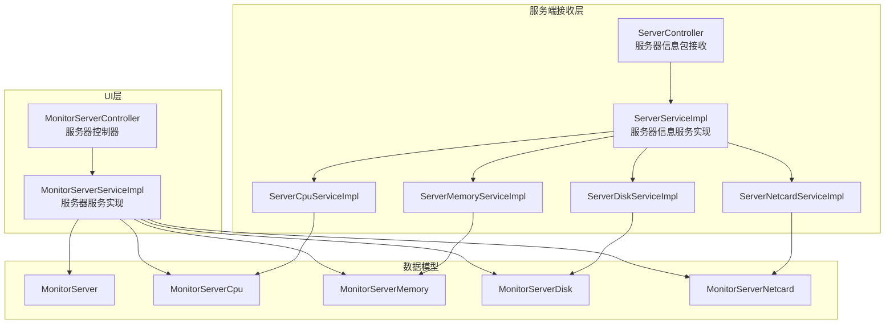
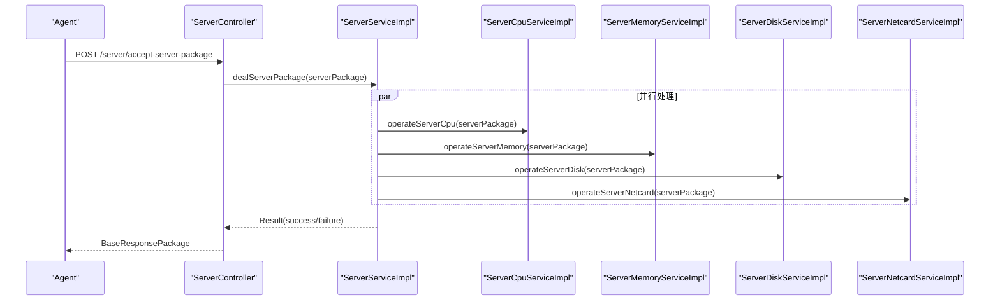
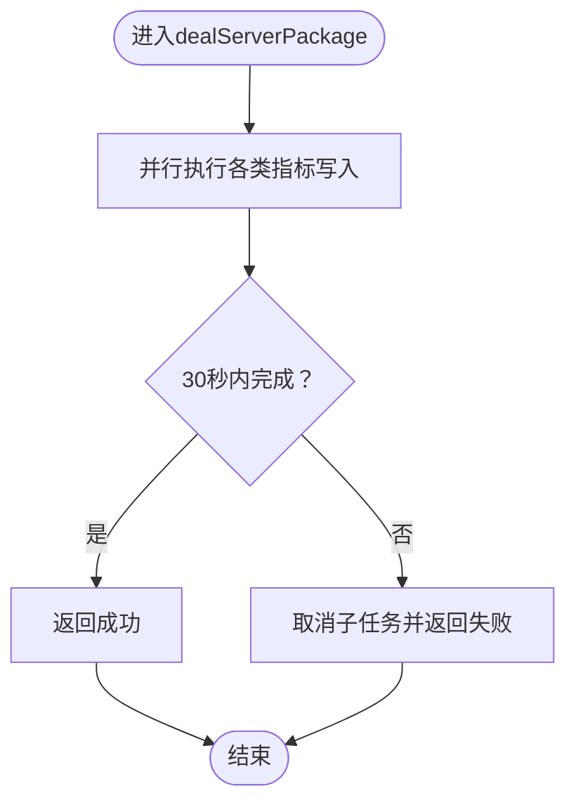
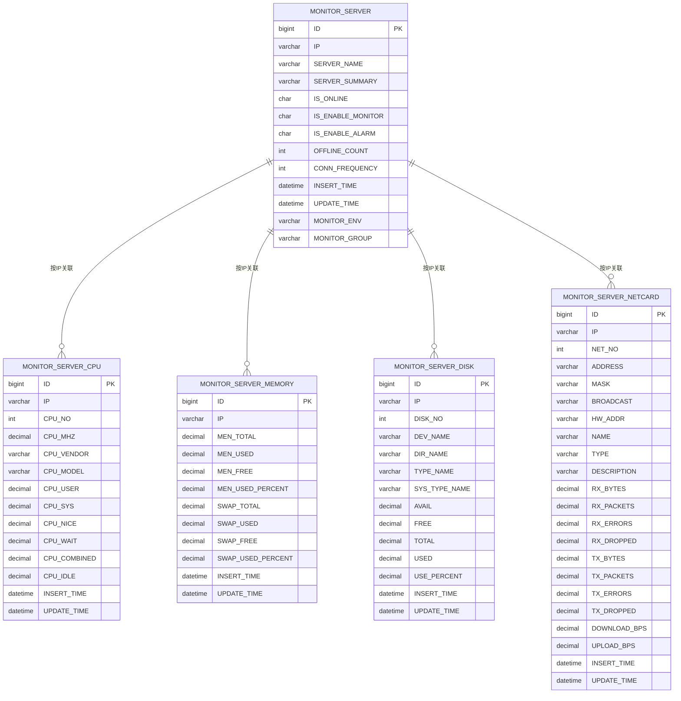
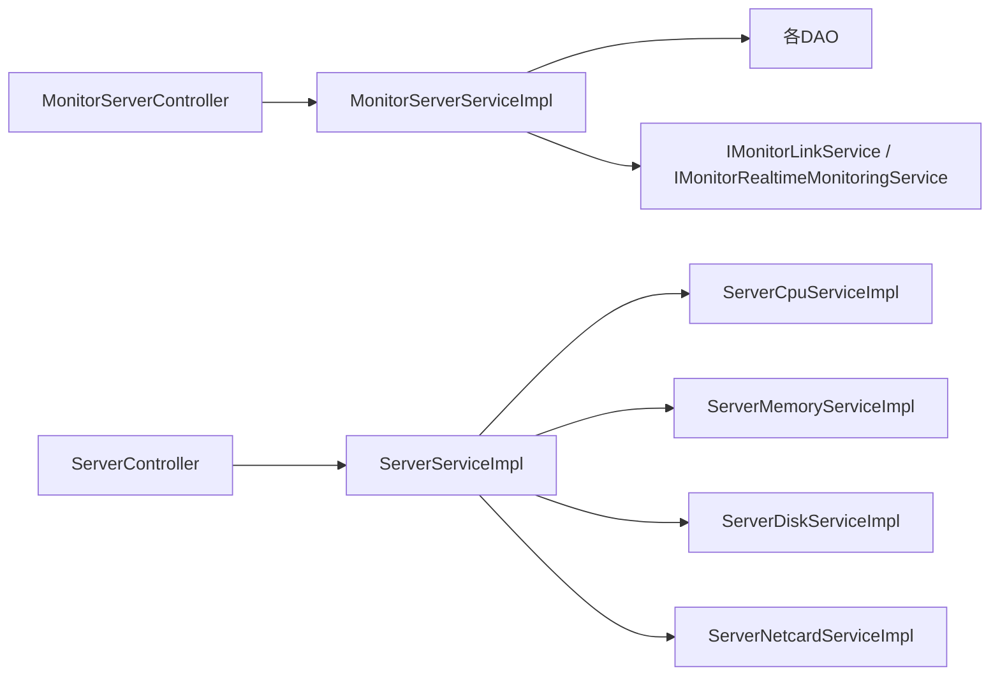

# 服务器监控模块

<cite>
**本文引用的文件**
- [MonitorServerController.java](file://phoenix-ui/src/main/java/com/gitee/pifeng/monitoring/ui/business/web/controller/MonitorServerController.java)
- [MonitorServerServiceImpl.java](file://phoenix-ui/src/main/java/com/gitee/pifeng/monitoring/ui/business/web/service/impl/MonitorServerServiceImpl.java)
- [ServerController.java](file://phoenix-server/src/main/java/com/gitee/pifeng/monitoring/server/business/server/controller/ServerController.java)
- [ServerServiceImpl.java](file://phoenix-server/src/main/java/com/gitee/pifeng/monitoring/server/business/server/service/impl/ServerServiceImpl.java)
- [ServerCpuServiceImpl.java](file://phoenix-server/src/main/java/com/gitee/pifeng/monitoring/server/business/server/service/impl/ServerCpuServiceImpl.java)
- [ServerMemoryServiceImpl.java](file://phoenix-server/src/main/java/com/gitee/pifeng/monitoring/server/business/server/service/impl/ServerMemoryServiceImpl.java)
- [ServerDiskServiceImpl.java](file://phoenix-server/src/main/java/com/gitee/pifeng/monitoring/server/business/server/service/impl/ServerDiskServiceImpl.java)
- [ServerNetcardServiceImpl.java](file://phoenix-server/src/main/java/com/gitee/pifeng/monitoring/server/business/server/service/impl/ServerNetcardServiceImpl.java)
- [MonitorServer.java](file://phoenix-ui/src/main/java/com/gitee/pifeng/monitoring/ui/business/web/entity/MonitorServer.java)
- [MonitorServerCpu.java](file://phoenix-server/src/main/java/com/gitee/pifeng/monitoring/server/business/server/entity/MonitorServerCpu.java)
- [MonitorServerMemory.java](file://phoenix-server/src/main/java/com/gitee/pifeng/monitoring/server/business/server/entity/MonitorServerMemory.java)
- [MonitorServerDisk.java](file://phoenix-server/src/main/java/com/gitee/pifeng/monitoring/server/business/server/entity/MonitorServerDisk.java)
- [MonitorServerNetcard.java](file://phoenix-server/src/main/java/com/gitee/pifeng/monitoring/server/business/server/entity/MonitorServerNetcard.java)
- [MonitoringServerProperties.java](file://phoenix-common/phoenix-common-core/src/main/java/com/gitee/pifeng/monitoring/common/property/server/MonitoringServerProperties.java)
- [Server.java](file://phoenix-common/phoenix-common-core/src/main/java/com/gitee/pifeng/monitoring/common/domain/Server.java)
</cite>

## 目录
1. [简介](#简介)
2. [项目结构](#项目结构)
3. [核心组件](#核心组件)
4. [架构总览](#架构总览)
5. [详细组件分析](#详细组件分析)
6. [依赖分析](#依赖分析)
7. [性能考虑](#性能考虑)
8. [故障排查指南](#故障排查指南)
9. [结论](#结论)
10. [附录](#附录)

## 简介
本文件面向Phoenix项目的“服务器监控模块”，围绕UI层控制器MonitorServerController与其在服务端的处理链路进行系统化技术文档梳理，覆盖以下主题：
- CPU使用率监控、内存使用情况、磁盘空间监控、网络流量统计等核心服务器资源监控功能
- 各监控指标的数据采集方式、计算公式、阈值设置与告警机制
- 服务器详情页面的数据展示逻辑（实时图表、历史趋势、性能对比）
- 服务器分组管理、批量操作、导出功能等高级特性
- 扩展指南：新增监控指标、自定义告警规则、集成第三方监控系统

## 项目结构
服务器监控模块由三层组成：
- UI层控制器：负责页面跳转、查询、批量操作、开关监控/告警、清理历史等
- 服务层：负责业务编排、DAO调用、数据格式化与返回
- 服务端接收层：负责接收Agent上报的ServerPackage，解析并并行写入各类监控表

**图表来源**
- [MonitorServerController.java:40-368](file://phoenix-ui/src/main/java/com/gitee/pifeng/monitoring/ui/business/web/controller/MonitorServerController.java#L40-L368)
- [MonitorServerServiceImpl.java:47-566](file://phoenix-ui/src/main/java/com/gitee/pifeng/monitoring/ui/business/web/service/impl/MonitorServerServiceImpl.java#L47-L566)
- [ServerController.java:31-77](file://phoenix-server/src/main/java/com/gitee/pifeng/monitoring/server/business/server/controller/ServerController.java#L31-L77)
- [ServerServiceImpl.java:35-345](file://phoenix-server/src/main/java/com/gitee/pifeng/monitoring/server/business/server/service/impl/ServerServiceImpl.java#L35-L345)
- [ServerCpuServiceImpl.java:28-96](file://phoenix-server/src/main/java/com/gitee/pifeng/monitoring/server/business/server/service/impl/ServerCpuServiceImpl.java#L28-L96)
- [ServerMemoryServiceImpl.java:24-80](file://phoenix-server/src/main/java/com/gitee/pifeng/monitoring/server/business/server/service/impl/ServerMemoryServiceImpl.java#L24-L80)
- [ServerDiskServiceImpl.java:28-96](file://phoenix-server/src/main/java/com/gitee/pifeng/monitoring/server/business/server/service/impl/ServerDiskServiceImpl.java#L28-L96)
- [ServerNetcardServiceImpl.java:28-108](file://phoenix-server/src/main/java/com/gitee/pifeng/monitoring/server/business/server/service/impl/ServerNetcardServiceImpl.java#L28-L108)

**章节来源**
- [MonitorServerController.java:40-368](file://phoenix-ui/src/main/java/com/gitee/pifeng/monitoring/ui/business/web/controller/MonitorServerController.java#L40-L368)
- [MonitorServerServiceImpl.java:47-566](file://phoenix-ui/src/main/java/com/gitee/pifeng/monitoring/ui/business/web/service/impl/MonitorServerServiceImpl.java#L47-L566)
- [ServerController.java:31-77](file://phoenix-server/src/main/java/com/gitee/pifeng/monitoring/server/business/server/controller/ServerController.java#L31-L77)
- [ServerServiceImpl.java:35-345](file://phoenix-server/src/main/java/com/gitee/pifeng/monitoring/server/business/server/service/impl/ServerServiceImpl.java#L35-L345)

## 核心组件
- UI控制器MonitorServerController
  - 页面入口：服务器列表、详情、编辑、清理表单
  - 查询接口：支持按IP、名称、在线状态、环境、分组、系统、描述、是否开启监控/告警等条件分页查询
  - 批量操作：删除服务器、设置是否开启监控/告警
  - 历史清理：按时间清理历史数据
  - 数据导出：提供服务器信息Map形式接口供前端使用
- 服务实现MonitorServerServiceImpl
  - 统计首页服务器概览（总数、Windows/Linux/其他、在线/离线/未知比例）
  - 分页查询与格式化（带宽单位换算、最后心跳时间）
  - 批量删除：级联删除服务器相关表及链路、实时监控数据
  - 历史清理：按IP与时间点清理CPU/内存/磁盘/网卡/进程/平均负载历史
  - 编辑服务器：更新环境、分组、监控/告警开关
  - 开关控制：动态设置监控/告警开关，关闭监控时同步置空在线状态
  - 服务器信息Map：统一输出服务器信息并格式化带宽
- 服务端接收ServerController
  - 接收Agent上报的ServerPackage，构造响应包并记录耗时
- 服务端处理ServerServiceImpl
  - 并行处理ServerPackage中的CPU/内存/磁盘/网卡/进程/平均负载等信息
  - 每类指标分别写入当前表与历史表
  - 超时控制与异常处理
- 指标服务实现
  - CPU：按CPU编号写入用户态、系统态、等待、组合、空闲等使用率
  - 内存：物理内存总量/使用/剩余及使用率，交换分区对应指标
  - 磁盘：设备名、挂载目录、类型、可用/总/已用及使用率
  - 网卡：地址、掩码、广播、MAC、名称、类型、描述；以及收发字节、丢包、错误、包数、上下行速率

**章节来源**
- [MonitorServerController.java:78-365](file://phoenix-ui/src/main/java/com/gitee/pifeng/monitoring/ui/business/web/controller/MonitorServerController.java#L78-L365)
- [MonitorServerServiceImpl.java:173-563](file://phoenix-ui/src/main/java/com/gitee/pifeng/monitoring/ui/business/web/service/impl/MonitorServerServiceImpl.java#L173-L563)
- [ServerController.java:59-74](file://phoenix-server/src/main/java/com/gitee/pifeng/monitoring/server/business/server/controller/ServerController.java#L59-L74)
- [ServerServiceImpl.java:189-247](file://phoenix-server/src/main/java/com/gitee/pifeng/monitoring/server/business/server/service/impl/ServerServiceImpl.java#L189-L247)
- [ServerCpuServiceImpl.java:41-93](file://phoenix-server/src/main/java/com/gitee/pifeng/monitoring/server/business/server/service/impl/ServerCpuServiceImpl.java#L41-L93)
- [ServerMemoryServiceImpl.java:37-77](file://phoenix-server/src/main/java/com/gitee/pifeng/monitoring/server/business/server/service/impl/ServerMemoryServiceImpl.java#L37-L77)
- [ServerDiskServiceImpl.java:41-93](file://phoenix-server/src/main/java/com/gitee/pifeng/monitoring/server/business/server/service/impl/ServerDiskServiceImpl.java#L41-L93)
- [ServerNetcardServiceImpl.java:41-105](file://phoenix-server/src/main/java/com/gitee/pifeng/monitoring/server/business/server/service/impl/ServerNetcardServiceImpl.java#L41-L105)

## 架构总览
服务器监控从Agent采集到UI展示的完整流程如下：

**图表来源**
- [ServerController.java:59-74](file://phoenix-server/src/main/java/com/gitee/pifeng/monitoring/server/business/server/controller/ServerController.java#L59-L74)
- [ServerServiceImpl.java:189-247](file://phoenix-server/src/main/java/com/gitee/pifeng/monitoring/server/business/server/service/impl/ServerServiceImpl.java#L189-L247)
- [ServerCpuServiceImpl.java:41-93](file://phoenix-server/src/main/java/com/gitee/pifeng/monitoring/server/business/server/service/impl/ServerCpuServiceImpl.java#L41-L93)
- [ServerMemoryServiceImpl.java:37-77](file://phoenix-server/src/main/java/com/gitee/pifeng/monitoring/server/business/server/service/impl/ServerMemoryServiceImpl.java#L37-L77)
- [ServerDiskServiceImpl.java:41-93](file://phoenix-server/src/main/java/com/gitee/pifeng/monitoring/server/business/server/service/impl/ServerDiskServiceImpl.java#L41-L93)
- [ServerNetcardServiceImpl.java:41-105](file://phoenix-server/src/main/java/com/gitee/pifeng/monitoring/server/business/server/service/impl/ServerNetcardServiceImpl.java#L41-L105)

## 详细组件分析

### MonitorServerController（UI层）
- 页面跳转
  - 列表页：加载监控配置、环境列表、分组列表
  - 详情页：传入服务器ID与IP，加载监控配置与网卡地址
  - 编辑页：加载环境与分组列表，回显服务器信息
  - 清理表单：传入IP，进入清理历史数据表单
- 查询接口
  - 支持多维过滤：IP、名称、在线状态、环境、分组、系统、描述、是否开启监控/告警
  - 返回分页结果，包含格式化后的带宽与最后心跳时间
- 批量与开关
  - 删除：批量删除服务器及其历史与关联数据
  - 设置监控/告警：按ID+IP更新开关，关闭监控时同步清空在线状态
- 历史清理
  - 按时间表达式计算清理起点，清理指定IP的历史记录
- 数据导出
  - 输出服务器信息Map，统一格式化带宽单位

**章节来源**
- [MonitorServerController.java:78-365](file://phoenix-ui/src/main/java/com/gitee/pifeng/monitoring/ui/business/web/controller/MonitorServerController.java#L78-L365)
- [MonitorServerServiceImpl.java:211-563](file://phoenix-ui/src/main/java/com/gitee/pifeng/monitoring/ui/business/web/service/impl/MonitorServerServiceImpl.java#L211-L563)

### MonitorServerServiceImpl（UI服务层）
- 首页统计：服务器类型分布、在线率
- 列表查询：构建查询条件，格式化带宽与最后心跳
- 批量删除：按IP批量删除服务器及其历史、链路、实时监控数据
- 历史清理：按IP与时间点清理CPU/内存/磁盘/网卡/进程/平均负载历史
- 编辑与开关：更新环境、分组、监控/告警开关
- 服务器信息Map：统一格式化带宽并输出

**章节来源**
- [MonitorServerServiceImpl.java:173-563](file://phoenix-ui/src/main/java/com/gitee/pifeng/monitoring/ui/business/web/service/impl/MonitorServerServiceImpl.java#L173-L563)

### ServerController（服务端接收）
- 接收Agent上报的ServerPackage，记录耗时并返回响应包
- 对耗时超过阈值进行告警日志输出

**章节来源**
- [ServerController.java:59-74](file://phoenix-server/src/main/java/com/gitee/pifeng/monitoring/server/business/server/controller/ServerController.java#L59-L74)

### ServerServiceImpl（服务端处理）
- 并行处理ServerPackage中的各类指标，分别写入当前表与历史表
- 超时控制（30秒），异常处理与取消子任务
- operateServer：首次入库默认开启监控与告警，后续仅更新时间

**图表来源**
- [ServerServiceImpl.java:189-247](file://phoenix-server/src/main/java/com/gitee/pifeng/monitoring/server/business/server/service/impl/ServerServiceImpl.java#L189-L247)

**章节来源**
- [ServerServiceImpl.java:189-342](file://phoenix-server/src/main/java/com/gitee/pifeng/monitoring/server/business/server/service/impl/ServerServiceImpl.java#L189-L342)

### 指标服务实现（CPU/内存/磁盘/网卡）
- CPU
  - 指标：主频、厂商、型号、用户态、系统态、nice、等待、组合、空闲
  - 存储：按CPU编号写入，不存在则插入，存在则更新
- 内存
  - 指标：物理内存总量/使用/剩余及使用率，交换分区对应指标
  - 存储：不存在则插入，存在则更新
- 磁盘
  - 指标：设备名、挂载目录、类型、系统类型、可用/总/已用及使用率
  - 存储：按磁盘编号写入，不存在则插入，存在则更新
- 网卡
  - 指标：地址、掩码、广播、MAC、名称、类型、描述；收发字节、丢包、错误、包数、上下行速率
  - 存储：按网卡编号写入，不存在则插入，存在则更新

**章节来源**
- [ServerCpuServiceImpl.java:41-93](file://phoenix-server/src/main/java/com/gitee/pifeng/monitoring/server/business/server/service/impl/ServerCpuServiceImpl.java#L41-L93)
- [ServerMemoryServiceImpl.java:37-77](file://phoenix-server/src/main/java/com/gitee/pifeng/monitoring/server/business/server/service/impl/ServerMemoryServiceImpl.java#L37-L77)
- [ServerDiskServiceImpl.java:41-93](file://phoenix-server/src/main/java/com/gitee/pifeng/monitoring/server/business/server/service/impl/ServerDiskServiceImpl.java#L41-L93)
- [ServerNetcardServiceImpl.java:41-105](file://phoenix-server/src/main/java/com/gitee/pifeng/monitoring/server/business/server/service/impl/ServerNetcardServiceImpl.java#L41-L105)

### 数据模型与映射
- 服务器基础表（UI/服务端通用）
  - 字段：ID、IP、服务器名、摘要、在线状态、监控/告警开关、离线次数、连接频率、新增/更新时间、环境、分组
- CPU/内存/磁盘/网卡实体
  - CPU：按编号存储多核指标
  - 内存：物理内存与交换分区指标
  - 磁盘：多分区指标
  - 网卡：多接口指标与流量统计

**图表来源**
- [MonitorServer.java:27-86](file://phoenix-ui/src/main/java/com/gitee/pifeng/monitoring/ui/business/web/entity/MonitorServer.java#L27-L86)
- [MonitorServerCpu.java:26-62](file://phoenix-server/src/main/java/com/gitee/pifeng/monitoring/server/business/server/entity/MonitorServerCpu.java#L26-L62)
- [MonitorServerMemory.java:26-62](file://phoenix-server/src/main/java/com/gitee/pifeng/monitoring/server/business/server/entity/MonitorServerMemory.java#L26-L62)
- [MonitorServerDisk.java:26-62](file://phoenix-server/src/main/java/com/gitee/pifeng/monitoring/server/business/server/entity/MonitorServerDisk.java#L26-L62)
- [MonitorServerNetcard.java:26-62](file://phoenix-server/src/main/java/com/gitee/pifeng/monitoring/server/business/server/entity/MonitorServerNetcard.java#L26-L62)

## 依赖分析
- 控制器与服务
  - MonitorServerController依赖IMonitorServerService、IMonitorConfigService、IMonitorEnvService、IMonitorGroupService
  - MonitorServerServiceImpl依赖各DAO与IMonitorLinkService、IMonitorRealtimeMonitoringService
- 服务端接收与处理
  - ServerController依赖IServerService与ServerPackageConstructor
  - ServerServiceImpl依赖各指标服务与DAO，使用线程池并行写入
- 数据模型
  - UI与服务端共享基础实体，指标实体独立于UI层

**图表来源**
- [MonitorServerController.java:48-67](file://phoenix-ui/src/main/java/com/gitee/pifeng/monitoring/ui/business/web/controller/MonitorServerController.java#L48-L67)
- [MonitorServerServiceImpl.java:64-150](file://phoenix-ui/src/main/java/com/gitee/pifeng/monitoring/ui/business/web/service/impl/MonitorServerServiceImpl.java#L64-L150)
- [ServerController.java:40-47](file://phoenix-server/src/main/java/com/gitee/pifeng/monitoring/server/business/server/controller/ServerController.java#L40-L47)
- [ServerServiceImpl.java:39-133](file://phoenix-server/src/main/java/com/gitee/pifeng/monitoring/server/business/server/service/impl/ServerServiceImpl.java#L39-L133)

**章节来源**
- [MonitorServerController.java:48-67](file://phoenix-ui/src/main/java/com/gitee/pifeng/monitoring/ui/business/web/controller/MonitorServerController.java#L48-L67)
- [MonitorServerServiceImpl.java:64-150](file://phoenix-ui/src/main/java/com/gitee/pifeng/monitoring/ui/business/web/service/impl/MonitorServerServiceImpl.java#L64-L150)
- [ServerController.java:40-47](file://phoenix-server/src/main/java/com/gitee/pifeng/monitoring/server/business/server/controller/ServerController.java#L40-L47)
- [ServerServiceImpl.java:39-133](file://phoenix-server/src/main/java/com/gitee/pifeng/monitoring/server/business/server/service/impl/ServerServiceImpl.java#L39-L133)

## 性能考虑
- 并行写入：服务端对CPU/内存/磁盘/网卡/进程/平均负载等指标采用CompletableFuture并行写入，显著提升吞吐
- 超时控制：并行任务设置30秒超时，避免阻塞与资源占用
- 事务策略：指标写入不使用事务以提升并发性能，对一致性要求相对较低
- 批量插入：CPU/磁盘/网卡等多实例指标采用批量保存，减少SQL往返
- 历史清理：按时间窗口分批删除，避免大事务锁表

**章节来源**
- [ServerServiceImpl.java:189-247](file://phoenix-server/src/main/java/com/gitee/pifeng/monitoring/server/business/server/service/impl/ServerServiceImpl.java#L189-L247)
- [ServerCpuServiceImpl.java:88-93](file://phoenix-server/src/main/java/com/gitee/pifeng/monitoring/server/business/server/service/impl/ServerCpuServiceImpl.java#L88-L93)
- [ServerDiskServiceImpl.java:88-93](file://phoenix-server/src/main/java/com/gitee/pifeng/monitoring/server/business/server/service/impl/ServerDiskServiceImpl.java#L88-L93)
- [ServerNetcardServiceImpl.java:99-105](file://phoenix-server/src/main/java/com/gitee/pifeng/monitoring/server/business/server/service/impl/ServerNetcardServiceImpl.java#L99-L105)

## 故障排查指南
- 接收耗时告警
  - 若处理服务器信息包耗时超过阈值，服务端会输出警告日志，需检查Agent采集频率与服务端线程池配置
- 并行处理失败
  - 超时或异常时会返回失败结果，检查指标服务实现与数据库写入性能
- 历史清理无效
  - 确认时间表达式解析与清理起点计算正确，确认IP与时间条件匹配
- 批量删除异常
  - 检查级联删除顺序与关联表是否存在，确保链路与实时监控数据一并清理

**章节来源**
- [ServerController.java:64-73](file://phoenix-server/src/main/java/com/gitee/pifeng/monitoring/server/business/server/controller/ServerController.java#L64-L73)
- [ServerServiceImpl.java:230-246](file://phoenix-server/src/main/java/com/gitee/pifeng/monitoring/server/business/server/service/impl/ServerServiceImpl.java#L230-L246)
- [MonitorServerServiceImpl.java:382-426](file://phoenix-ui/src/main/java/com/gitee/pifeng/monitoring/ui/business/web/service/impl/MonitorServerServiceImpl.java#L382-L426)

## 结论
服务器监控模块通过UI层控制器与服务层实现，结合服务端并行处理能力，实现了对CPU、内存、磁盘、网卡等核心指标的高效采集与持久化。模块提供了完善的分页查询、批量操作、历史清理与开关控制能力，并为扩展新指标与集成第三方监控系统预留了清晰的接口与数据模型。

## 附录

### 监控指标采集与计算说明
- CPU使用率
  - 来源：CPU用户态、系统态、等待、组合、空闲等百分比
  - 计算：组合=用户态+系统态+nice+等待；空闲为可用比率
- 内存使用率
  - 来源：物理内存总量、使用量、剩余量与使用率
  - 计算：使用率=使用量/总量
- 磁盘使用率
  - 来源：可用、总、已用与使用率
  - 计算：使用率=已用/总
- 网络流量
  - 来源：收发字节、丢包、错误、包数
  - 计算：上下行速率=字节差/时间间隔

**章节来源**
- [ServerCpuServiceImpl.java:62-73](file://phoenix-server/src/main/java/com/gitee/pifeng/monitoring/server/business/server/service/impl/ServerCpuServiceImpl.java#L62-L73)
- [ServerMemoryServiceImpl.java:54-63](file://phoenix-server/src/main/java/com/gitee/pifeng/monitoring/server/business/server/service/impl/ServerMemoryServiceImpl.java#L54-L63)
- [ServerDiskServiceImpl.java:62-73](file://phoenix-server/src/main/java/com/gitee/pifeng/monitoring/server/business/server/service/impl/ServerDiskServiceImpl.java#L62-L73)
- [ServerNetcardServiceImpl.java:63-85](file://phoenix-server/src/main/java/com/gitee/pifeng/monitoring/server/business/server/service/impl/ServerNetcardServiceImpl.java#L63-L85)

### 配置与扩展指南
- 配置项
  - 服务器监控开关与各子项配置：参考服务器配置属性类
- 新增监控指标
  - 在服务端新增指标实体与DAO，实现operateXxx方法并加入ServerServiceImpl的并行处理
  - 在UI层新增对应控制器与服务，提供查询与展示
- 自定义告警规则
  - 建议基于历史阈值与趋势分析，在UI层提供规则配置与触发机制
- 集成第三方监控系统
  - 可通过统一的ServerPackage结构扩展字段，或新增独立的接收端口与转换器

**章节来源**
- [MonitoringServerProperties.java:19-50](file://phoenix-common/phoenix-common-core/src/main/java/com/gitee/pifeng/monitoring/common/property/server/MonitoringServerProperties.java#L19-L50)
- [ServerServiceImpl.java:194-229](file://phoenix-server/src/main/java/com/gitee/pifeng/monitoring/server/business/server/service/impl/ServerServiceImpl.java#L194-L229)