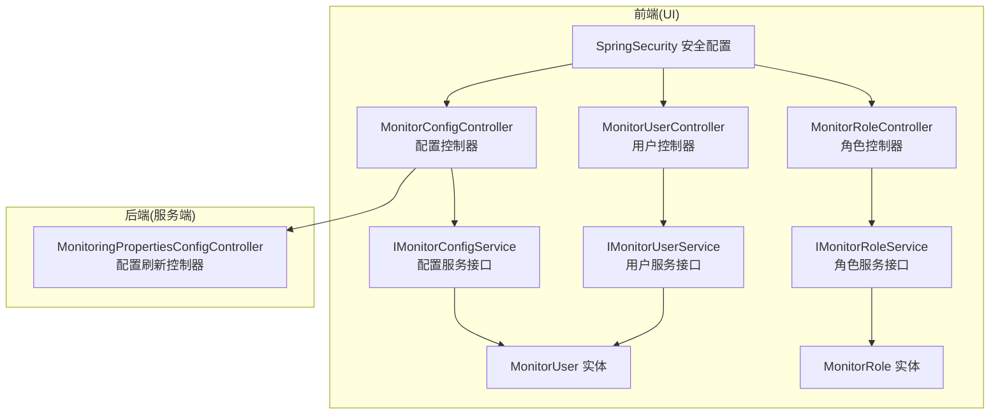
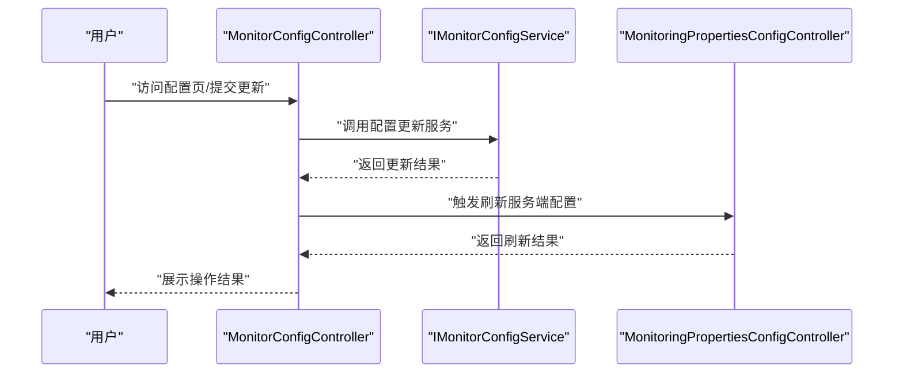
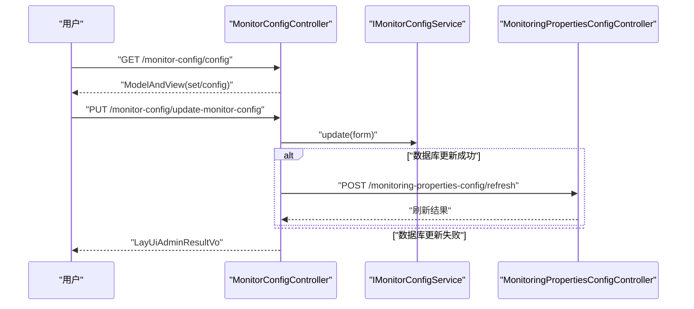
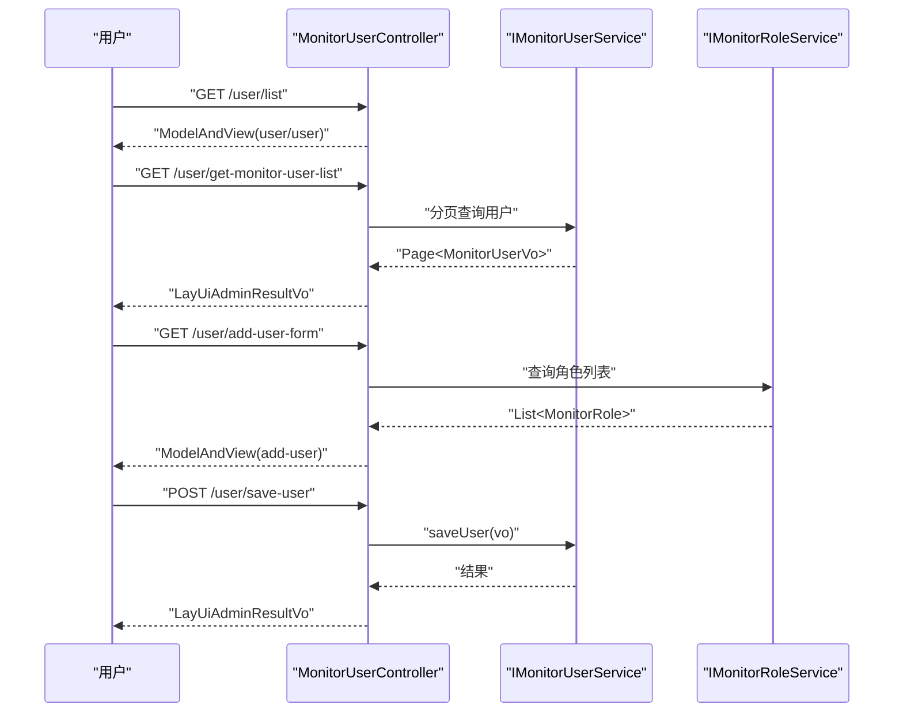
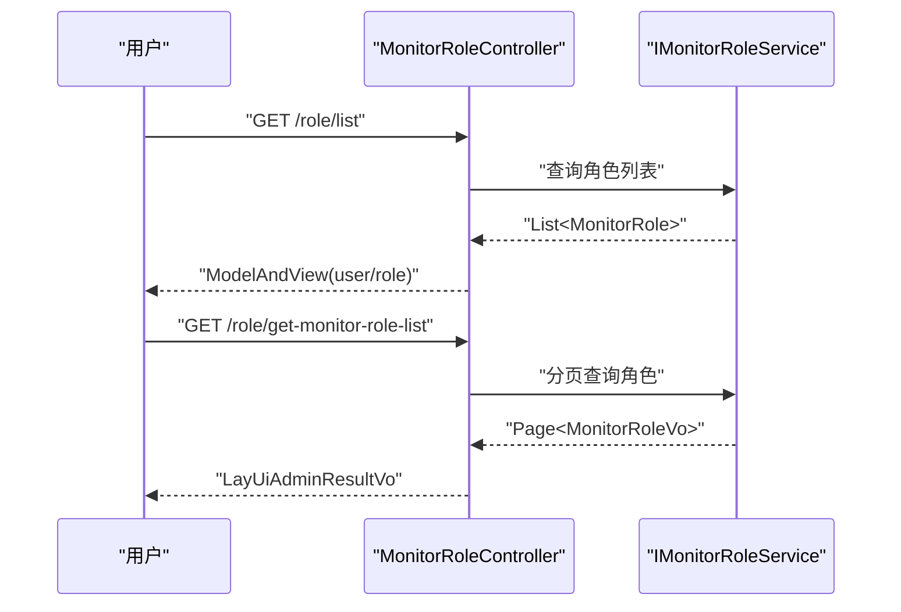
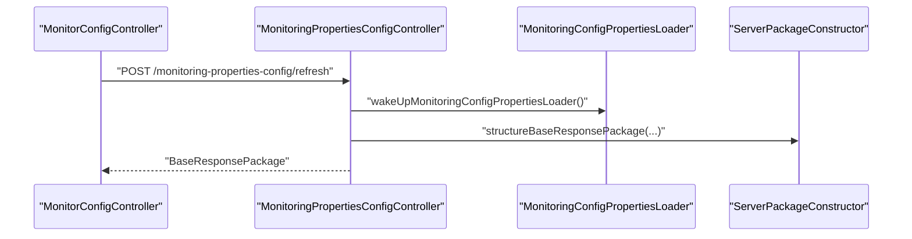
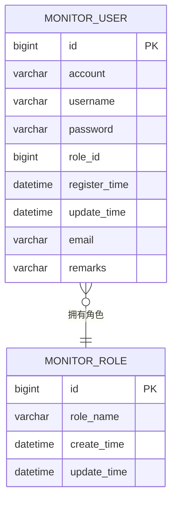
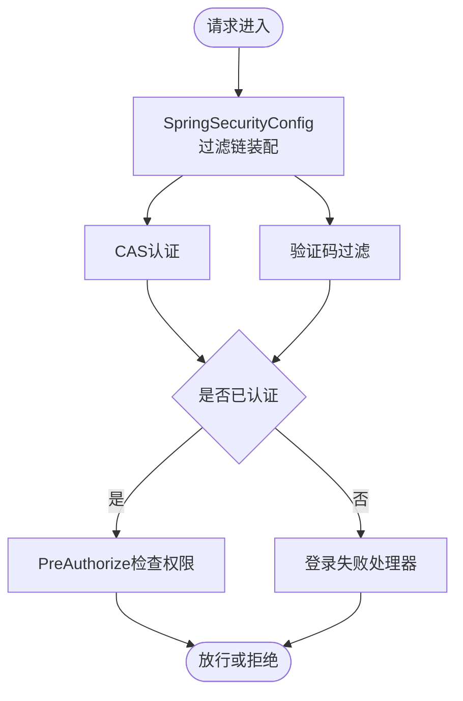
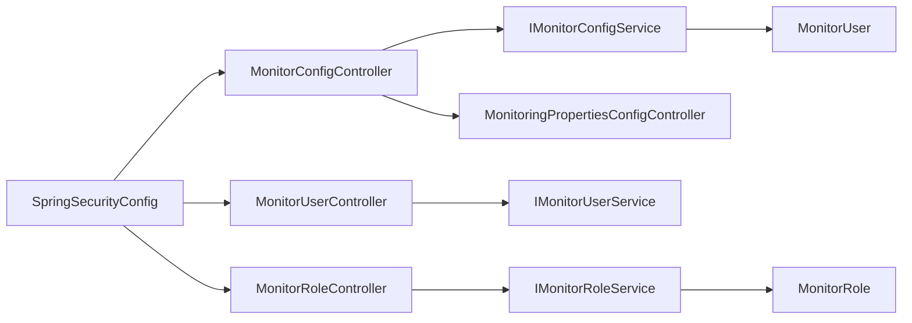

# 系统管理模块

<cite>
**本文引用的文件**
- [MonitorConfigController.java](file://phoenix-ui/src/main/java/com/gitee/pifeng/monitoring/ui/business/web/controller/MonitorConfigController.java)
- [MonitorUserController.java](file://phoenix-ui/src/main/java/com/gitee/pifeng/monitoring/ui/business/web/controller/MonitorUserController.java)
- [MonitorRoleController.java](file://phoenix-ui/src/main/java/com/gitee/pifeng/monitoring/ui/business/web/controller/MonitorRoleController.java)
- [MonitoringPropertiesConfigController.java](file://phoenix-server/src/main/java/com/gitee/pifeng/monitoring/server/business/server/controller/MonitoringPropertiesConfigController.java)
- [IMonitorConfigService.java](file://phoenix-ui/src/main/java/com/gitee/pifeng/monitoring/ui/business/web/service/IMonitorConfigService.java)
- [IMonitorUserService.java](file://phoenix-ui/src/main/java/com/gitee/pifeng/monitoring/ui/business/web/service/IMonitorUserService.java)
- [IMonitorRoleService.java](file://phoenix-ui/src/main/java/com/gitee/pifeng/monitoring/ui/business/web/service/IMonitorRoleService.java)
- [MonitorUser.java](file://phoenix-ui/src/main/java/com/gitee/pifeng/monitoring/ui/business/web/entity/MonitorUser.java)
- [MonitorRole.java](file://phoenix-ui/src/main/java/com/gitee/pifeng/monitoring/ui/business/web/entity/MonitorRole.java)
- [BaseWebSecurityConfigurerAdapter.java](file://phoenix-ui/src/main/java/com/gitee/pifeng/monitoring/ui/config/springsecurity/BaseWebSecurityConfigurerAdapter.java)
- [SpringSecurityConfig.java](file://phoenix-ui/src/main/java/com/gitee/pifeng/monitoring/ui/config/springsecurity/SpringSecurityConfig.java)
- [SpringSecurityAuthenticationFailureHandler.java](file://phoenix-ui/src/main/java/com/gitee/pifeng/monitoring/ui/config/springsecurity/SpringSecurityAuthenticationFailureHandler.java)
- [SpringSecurityAuthenticationProvider.java](file://phoenix-ui/src/main/java/com/gitee/pifeng/monitoring/ui/config/springsecurity/SpringSecurityAuthenticationProvider.java)
- [SpringSecurityCasConfig.java](file://phoenix-ui/src/main/java/com/gitee/pifeng/monitoring/ui/config/springsecurity/SpringSecurityCasConfig.java)
- [SpringSecurityVerificationCodeFilter.java](file://phoenix-ui/src/main/java/com/gitee/pifeng/monitoring/ui/config/springsecurity/SpringSecurityVerificationCodeFilter.java)
- [SpringSecurityWebAuthenticationDetails.java](file://phoenix-ui/src/main/java/com/gitee/pifeng/monitoring/ui/config/springsecurity/SpringSecurityWebAuthenticationDetails.java)
- [SpringSecurityWebAuthenticationDetailsSource.java](file://phoenix-ui/src/main/java/com/gitee/pifeng/monitoring/ui/config/springsecurity/SpringSecurityWebAuthenticationDetailsSource.java)
- [AuthProperties.java](file://phoenix-ui/src/main/java/com/gitee/pifeng/monitoring/ui/property/auth/AuthProperties.java)
- [AuthTypeEnums.java](file://phoenix-ui/src/main/java/com/gitee/pifeng/monitoring/ui/property/auth/AuthTypeEnums.java)
- [PhoenixProperties.java](file://phoenix-ui/src/main/java/com/gitee/pifeng/monitoring/ui/property/PhoenixProperties.java)
- [MonitoringUiDevConfig.java](file://phoenix-ui/src/main/java/com/gitee/pifeng/monitoring/ui/config/phoenix/MonitoringUiDevConfig.java)
- [MonitoringUiProdConfig.java](file://phoenix-ui/src/main/java/com/gitee/pifeng/monitoring/ui/config/phoenix/MonitoringUiProdConfig.java)
- [MybatisPlusConfig.java](file://phoenix-ui/src/main/java/com/gitee/pifeng/monitoring/ui/config/mybatisplus/MybatisPlusConfig.java)
- [OperateTypeConstants.java](file://phoenix-ui/src/main/java/com/gitee/pifeng/monitoring/ui/constant/OperateTypeConstants.java)
- [UiModuleConstants.java](file://phoenix-ui/src/main/java/com/gitee/pifeng/monitoring/ui/constant/UiModuleConstants.java)
- [UrlConstants.java](file://phoenix-ui/src/main/java/com/gitee/pifeng/monitoring/ui/constant/UrlConstants.java)
- [LayUiAdminResultVo.java](file://phoenix-ui/src/main/java/com/gitee/pifeng/monitoring/ui/business/web/vo/LayUiAdminResultVo.java)
- [MonitorConfigPageFormVo.java](file://phoenix-ui/src/main/java/com/gitee/pifeng/monitoring/ui/business/web/vo/MonitorConfigPageFormVo.java)
- [MonitorUserVo.java](file://phoenix-ui/src/main/java/com/gitee/pifeng/monitoring/ui/business/web/vo/MonitorUserVo.java)
- [MonitorRoleVo.java](file://phoenix-ui/src/main/java/com/gitee/pifeng/monitoring/ui/business/web/vo/MonitorRoleVo.java)
- [application.yml](file://phoenix-ui/src/main/resources/application.yml)
- [application-dev.yml](file://phoenix-ui/src/main/resources/application-dev.yml)
- [application-prod.yml](file://phoenix-ui/src/main/resources/application-prod.yml)
- [application.yml](file://phoenix-server/src/main/resources/application.yml)
- [application-dev.yml](file://phoenix-server/src/main/resources/application-dev.yml)
- [application-prod.yml](file://phoenix-server/src/main/resources/application-prod.yml)
- [application.yml](file://phoenix-agent/src/main/resources/application.yml)
- [application-dev.yml](file://phoenix-agent/src/main/resources/application-dev.yml)
- [application-prod.yml](file://phoenix-agent/src/main/resources/application-prod.yml)
</cite>

## 目录
1. [简介](#简介)
2. [项目结构](#项目结构)
3. [核心组件](#核心组件)
4. [架构总览](#架构总览)
5. [详细组件分析](#详细组件分析)
6. [依赖分析](#依赖分析)
7. [性能考虑](#性能考虑)
8. [故障排查指南](#故障排查指南)
9. [结论](#结论)
10. [附录](#附录)

## 简介
本文件面向系统管理模块，围绕系统配置控制器、环境管理控制器、用户管理控制器、角色管理控制器展开，系统性阐述以下能力与实现细节：
- 系统参数配置：配置项编辑、参数持久化、服务端动态刷新
- 监控环境管理：多环境配置、运行时切换与生效机制
- 用户权限控制：基于角色的权限模型、认证与授权流程
- 角色权限分配：角色列表、角色详情、权限绑定与变更
- 安全管理：密码策略、会话管理、审计日志
- 页面功能：配置页、用户列表、角色权限分配、操作日志查看
- 扩展指南：新增配置项、自定义权限模型、集成第三方认证（如LDAP）

## 项目结构
系统管理模块主要位于前端 UI 工程的 web 层，包含控制器、服务、实体、VO、常量与安全配置等。后端服务提供配置刷新接口，前端通过控制器调用后端接口以实现配置生效。

**图表来源**
- [MonitorConfigController.java:30-84](file://phoenix-ui/src/main/java/com/gitee/pifeng/monitoring/ui/business/web/controller/MonitorConfigController.java#L30-L84)
- [MonitorUserController.java:37-220](file://phoenix-ui/src/main/java/com/gitee/pifeng/monitoring/ui/business/web/controller/MonitorUserController.java#L37-L220)
- [MonitorRoleController.java:35-99](file://phoenix-ui/src/main/java/com/gitee/pifeng/monitoring/ui/business/web/controller/MonitorRoleController.java#L35-L99)
- [MonitoringPropertiesConfigController.java:30-75](file://phoenix-server/src/main/java/com/gitee/pifeng/monitoring/server/business/server/controller/MonitoringPropertiesConfigController.java#L30-L75)
- [IMonitorConfigService.java:18-48](file://phoenix-ui/src/main/java/com/gitee/pifeng/monitoring/ui/business/web/service/IMonitorConfigService.java#L18-L48)
- [IMonitorUserService.java:25-133](file://phoenix-ui/src/main/java/com/gitee/pifeng/monitoring/ui/business/web/service/IMonitorUserService.java#L25-L133)
- [IMonitorRoleService.java:16-32](file://phoenix-ui/src/main/java/com/gitee/pifeng/monitoring/ui/business/web/service/IMonitorRoleService.java#L16-L32)
- [MonitorUser.java:32-74](file://phoenix-ui/src/main/java/com/gitee/pifeng/monitoring/ui/business/web/entity/MonitorUser.java#L32-L74)
- [MonitorRole.java:32-54](file://phoenix-ui/src/main/java/com/gitee/pifeng/monitoring/ui/business/web/entity/MonitorRole.java#L32-L54)
- [SpringSecurityConfig.java](file://phoenix-ui/src/main/java/com/gitee/pifeng/monitoring/ui/config/springsecurity/SpringSecurityConfig.java)

**章节来源**
- [MonitorConfigController.java:30-84](file://phoenix-ui/src/main/java/com/gitee/pifeng/monitoring/ui/business/web/controller/MonitorConfigController.java#L30-L84)
- [MonitorUserController.java:37-220](file://phoenix-ui/src/main/java/com/gitee/pifeng/monitoring/ui/business/web/controller/MonitorUserController.java#L37-L220)
- [MonitorRoleController.java:35-99](file://phoenix-ui/src/main/java/com/gitee/pifeng/monitoring/ui/business/web/controller/MonitorRoleController.java#L35-L99)
- [MonitoringPropertiesConfigController.java:30-75](file://phoenix-server/src/main/java/com/gitee/pifeng/monitoring/server/business/server/controller/MonitoringPropertiesConfigController.java#L30-L75)

## 核心组件
- 配置控制器：负责“配置页”访问与“更新监控配置”的提交处理，具备操作审计与权限控制
- 用户控制器：负责用户列表、新增/编辑/删除用户，以及用户表单页面渲染
- 角色控制器：负责角色列表与查询分页
- 配置刷新控制器：负责接收前端触发，刷新服务端监控配置并返回结果
- 服务接口：抽象出配置、用户、角色的服务能力，便于替换实现
- 实体与VO：数据模型与表现层对象，支撑前后端交互
- 安全配置：基于Spring Security的认证与授权配置，支持CAS与验证码过滤

**章节来源**
- [MonitorConfigController.java:30-84](file://phoenix-ui/src/main/java/com/gitee/pifeng/monitoring/ui/business/web/controller/MonitorConfigController.java#L30-L84)
- [MonitorUserController.java:37-220](file://phoenix-ui/src/main/java/com/gitee/pifeng/monitoring/ui/business/web/controller/MonitorUserController.java#L37-L220)
- [MonitorRoleController.java:35-99](file://phoenix-ui/src/main/java/com/gitee/pifeng/monitoring/ui/business/web/controller/MonitorRoleController.java#L35-L99)
- [MonitoringPropertiesConfigController.java:30-75](file://phoenix-server/src/main/java/com/gitee/pifeng/monitoring/server/business/server/controller/MonitoringPropertiesConfigController.java#L30-L75)
- [IMonitorConfigService.java:18-48](file://phoenix-ui/src/main/java/com/gitee/pifeng/monitoring/ui/business/web/service/IMonitorConfigService.java#L18-L48)
- [IMonitorUserService.java:25-133](file://phoenix-ui/src/main/java/com/gitee/pifeng/monitoring/ui/business/web/service/IMonitorUserService.java#L25-L133)
- [IMonitorRoleService.java:16-32](file://phoenix-ui/src/main/java/com/gitee/pifeng/monitoring/ui/business/web/service/IMonitorRoleService.java#L16-L32)
- [MonitorUser.java:32-74](file://phoenix-ui/src/main/java/com/gitee/pifeng/monitoring/ui/business/web/entity/MonitorUser.java#L32-L74)
- [MonitorRole.java:32-54](file://phoenix-ui/src/main/java/com/gitee/pifeng/monitoring/ui/business/web/entity/MonitorRole.java#L32-L54)

## 架构总览
系统管理模块采用前后端分离架构，前端控制器负责页面渲染与业务交互，后端控制器负责配置刷新与数据持久化。安全框架统一拦截请求，执行认证与授权。

**图表来源**
- [MonitorConfigController.java:50-81](file://phoenix-ui/src/main/java/com/gitee/pifeng/monitoring/ui/business/web/controller/MonitorConfigController.java#L50-L81)
- [MonitoringPropertiesConfigController.java:60-72](file://phoenix-server/src/main/java/com/gitee/pifeng/monitoring/server/business/server/controller/MonitoringPropertiesConfigController.java#L60-L72)
- [IMonitorConfigService.java:29-45](file://phoenix-ui/src/main/java/com/gitee/pifeng/monitoring/ui/business/web/service/IMonitorConfigService.java#L29-L45)

## 详细组件分析

### 配置控制器（MonitorConfigController）
职责与流程
- 提供“配置页”访问接口，渲染配置页面并注入表单数据
- 提交“更新监控配置”，进行权限校验与操作审计
- 调用服务层完成数据库更新，并在必要时触发服务端配置刷新

关键点
- 权限注解：仅允许“超级管理员”执行更新
- 操作审计：记录页面访问与更新操作
- 返回值语义：根据数据库更新与服务端刷新结果返回不同状态码

**图表来源**
- [MonitorConfigController.java:50-81](file://phoenix-ui/src/main/java/com/gitee/pifeng/monitoring/ui/business/web/controller/MonitorConfigController.java#L50-L81)
- [MonitoringPropertiesConfigController.java:60-72](file://phoenix-server/src/main/java/com/gitee/pifeng/monitoring/server/business/server/controller/MonitoringPropertiesConfigController.java#L60-L72)
- [IMonitorConfigService.java:29-45](file://phoenix-ui/src/main/java/com/gitee/pifeng/monitoring/ui/business/web/service/IMonitorConfigService.java#L29-L45)

**章节来源**
- [MonitorConfigController.java:30-84](file://phoenix-ui/src/main/java/com/gitee/pifeng/monitoring/ui/business/web/controller/MonitorConfigController.java#L30-L84)
- [IMonitorConfigService.java:18-48](file://phoenix-ui/src/main/java/com/gitee/pifeng/monitoring/ui/business/web/service/IMonitorConfigService.java#L18-L48)

### 用户管理控制器（MonitorUserController）
职责与流程
- 用户列表页访问与分页查询
- 新增/编辑/删除用户的页面与提交处理
- 用户表单页面渲染，联动角色列表

关键点
- 权限注解：新增/编辑/删除均需“超级管理员”
- 操作审计：对新增、编辑、删除操作进行记录
- 表单转换：用户实体与VO之间的转换逻辑

**图表来源**
- [MonitorUserController.java:63-178](file://phoenix-ui/src/main/java/com/gitee/pifeng/monitoring/ui/business/web/controller/MonitorUserController.java#L63-L178)
- [IMonitorUserService.java:93-131](file://phoenix-ui/src/main/java/com/gitee/pifeng/monitoring/ui/business/web/service/IMonitorUserService.java#L93-L131)
- [IMonitorRoleService.java:16-31](file://phoenix-ui/src/main/java/com/gitee/pifeng/monitoring/ui/business/web/service/IMonitorRoleService.java#L16-L31)

**章节来源**
- [MonitorUserController.java:37-220](file://phoenix-ui/src/main/java/com/gitee/pifeng/monitoring/ui/business/web/controller/MonitorUserController.java#L37-L220)
- [IMonitorUserService.java:25-133](file://phoenix-ui/src/main/java/com/gitee/pifeng/monitoring/ui/business/web/service/IMonitorUserService.java#L25-L133)
- [IMonitorRoleService.java:16-32](file://phoenix-ui/src/main/java/com/gitee/pifeng/monitoring/ui/business/web/service/IMonitorRoleService.java#L16-L32)

### 角色管理控制器（MonitorRoleController）
职责与流程
- 角色列表页访问与角色分页查询
- 角色列表渲染，支持按角色ID筛选

关键点
- 角色列表与VO转换
- 分页查询接口

**图表来源**
- [MonitorRoleController.java:55-96](file://phoenix-ui/src/main/java/com/gitee/pifeng/monitoring/ui/business/web/controller/MonitorRoleController.java#L55-L96)
- [IMonitorRoleService.java:16-31](file://phoenix-ui/src/main/java/com/gitee/pifeng/monitoring/ui/business/web/service/IMonitorRoleService.java#L16-L31)

**章节来源**
- [MonitorRoleController.java:35-99](file://phoenix-ui/src/main/java/com/gitee/pifeng/monitoring/ui/business/web/controller/MonitorRoleController.java#L35-L99)
- [IMonitorRoleService.java:16-32](file://phoenix-ui/src/main/java/com/gitee/pifeng/monitoring/ui/business/web/service/IMonitorRoleService.java#L16-L32)

### 配置刷新控制器（MonitoringPropertiesConfigController）
职责与流程
- 接收前端触发，刷新监控配置属性
- 统计刷新耗时，超过阈值输出告警日志
- 返回标准响应包

关键点
- 刷新逻辑由配置加载器驱动
- 包构造器生成统一响应

**图表来源**
- [MonitoringPropertiesConfigController.java:60-72](file://phoenix-server/src/main/java/com/gitee/pifeng/monitoring/server/business/server/controller/MonitoringPropertiesConfigController.java#L60-L72)

**章节来源**
- [MonitoringPropertiesConfigController.java:30-75](file://phoenix-server/src/main/java/com/gitee/pifeng/monitoring/server/business/server/controller/MonitoringPropertiesConfigController.java#L30-L75)

### 数据模型与复杂度分析
- MonitorUser：用户实体，包含账号、用户名、密码、角色ID、邮箱、备注等字段，适合分页查询与条件过滤
- MonitorRole：角色实体，包含角色名称与时间戳字段，适合轻量级列表与分页
- 复杂度评估：分页查询基于数据库索引，典型查询复杂度 O(log n + k)，k 为分页条数

**图表来源**
- [MonitorUser.java:32-74](file://phoenix-ui/src/main/java/com/gitee/pifeng/monitoring/ui/business/web/entity/MonitorUser.java#L32-L74)
- [MonitorRole.java:32-54](file://phoenix-ui/src/main/java/com/gitee/pifeng/monitoring/ui/business/web/entity/MonitorRole.java#L32-L54)

**章节来源**
- [MonitorUser.java:32-74](file://phoenix-ui/src/main/java/com/gitee/pifeng/monitoring/ui/business/web/entity/MonitorUser.java#L32-L74)
- [MonitorRole.java:32-54](file://phoenix-ui/src/main/java/com/gitee/pifeng/monitoring/ui/business/web/entity/MonitorRole.java#L32-L54)

### 安全与认证授权
- 认证与授权：基于Spring Security，支持CAS认证与验证码过滤
- 权限模型：使用“超级管理员”角色作为系统管理操作的授权门槛
- 登录失败处理：提供专门的失败处理器
- 配置入口：安全配置类集中管理过滤链与认证提供者

**图表来源**
- [SpringSecurityConfig.java](file://phoenix-ui/src/main/java/com/gitee/pifeng/monitoring/ui/config/springsecurity/SpringSecurityConfig.java)
- [SpringSecurityAuthenticationFailureHandler.java](file://phoenix-ui/src/main/java/com/gitee/pifeng/monitoring/ui/config/springsecurity/SpringSecurityAuthenticationFailureHandler.java)
- [SpringSecurityAuthenticationProvider.java](file://phoenix-ui/src/main/java/com/gitee/pifeng/monitoring/ui/config/springsecurity/SpringSecurityAuthenticationProvider.java)
- [SpringSecurityCasConfig.java](file://phoenix-ui/src/main/java/com/gitee/pifeng/monitoring/ui/config/springsecurity/SpringSecurityCasConfig.java)
- [SpringSecurityVerificationCodeFilter.java](file://phoenix-ui/src/main/java/com/gitee/pifeng/monitoring/ui/config/springsecurity/SpringSecurityVerificationCodeFilter.java)
- [MonitorConfigController.java:77-77](file://phoenix-ui/src/main/java/com/gitee/pifeng/monitoring/ui/business/web/controller/MonitorConfigController.java#L77-L77)

**章节来源**
- [MonitorConfigController.java:77-77](file://phoenix-ui/src/main/java/com/gitee/pifeng/monitoring/ui/business/web/controller/MonitorConfigController.java#L77-L77)
- [SpringSecurityConfig.java](file://phoenix-ui/src/main/java/com/gitee/pifeng/monitoring/ui/config/springsecurity/SpringSecurityConfig.java)
- [SpringSecurityAuthenticationFailureHandler.java](file://phoenix-ui/src/main/java/com/gitee/pifeng/monitoring/ui/config/springsecurity/SpringSecurityAuthenticationFailureHandler.java)
- [SpringSecurityAuthenticationProvider.java](file://phoenix-ui/src/main/java/com/gitee/pifeng/monitoring/ui/config/springsecurity/SpringSecurityAuthenticationProvider.java)
- [SpringSecurityCasConfig.java](file://phoenix-ui/src/main/java/com/gitee/pifeng/monitoring/ui/config/springsecurity/SpringSecurityCasConfig.java)
- [SpringSecurityVerificationCodeFilter.java](file://phoenix-ui/src/main/java/com/gitee/pifeng/monitoring/ui/config/springsecurity/SpringSecurityVerificationCodeFilter.java)

## 依赖分析
- 控制器依赖服务接口，服务接口依赖实体与VO，形成清晰的分层
- 配置控制器通过服务端刷新控制器实现配置生效
- 安全配置类集中管理认证与授权，避免分散耦合

**图表来源**
- [MonitorConfigController.java:38-39](file://phoenix-ui/src/main/java/com/gitee/pifeng/monitoring/ui/business/web/controller/MonitorConfigController.java#L38-L39)
- [MonitorUserController.java:45-52](file://phoenix-ui/src/main/java/com/gitee/pifeng/monitoring/ui/business/web/controller/MonitorUserController.java#L45-L52)
- [MonitorRoleController.java:43-44](file://phoenix-ui/src/main/java/com/gitee/pifeng/monitoring/ui/business/web/controller/MonitorRoleController.java#L43-L44)
- [MonitoringPropertiesConfigController.java:40-46](file://phoenix-server/src/main/java/com/gitee/pifeng/monitoring/server/business/server/controller/MonitoringPropertiesConfigController.java#L40-L46)
- [SpringSecurityConfig.java](file://phoenix-ui/src/main/java/com/gitee/pifeng/monitoring/ui/config/springsecurity/SpringSecurityConfig.java)

**章节来源**
- [MonitorConfigController.java:38-39](file://phoenix-ui/src/main/java/com/gitee/pifeng/monitoring/ui/business/web/controller/MonitorConfigController.java#L38-L39)
- [MonitorUserController.java:45-52](file://phoenix-ui/src/main/java/com/gitee/pifeng/monitoring/ui/business/web/controller/MonitorUserController.java#L45-L52)
- [MonitorRoleController.java:43-44](file://phoenix-ui/src/main/java/com/gitee/pifeng/monitoring/ui/business/web/controller/MonitorRoleController.java#L43-L44)
- [MonitoringPropertiesConfigController.java:40-46](file://phoenix-server/src/main/java/com/gitee/pifeng/monitoring/server/business/server/controller/MonitoringPropertiesConfigController.java#L40-L46)
- [SpringSecurityConfig.java](file://phoenix-ui/src/main/java/com/gitee/pifeng/monitoring/ui/config/springsecurity/SpringSecurityConfig.java)

## 性能考虑
- 分页查询：用户与角色列表采用分页接口，建议结合数据库索引优化查询性能
- 刷新耗时：配置刷新控制器内置耗时统计，超过阈值会输出警告日志，便于定位性能瓶颈
- 响应格式：统一使用LayUiAdminResultVo与BaseResponsePackage，减少序列化开销

[本节为通用指导，无需具体文件分析]

## 故障排查指南
常见问题与定位思路
- 权限不足：检查“超级管理员”角色是否正确授予，确认PreAuthorize注解生效
- 配置未生效：确认前端已触发刷新接口，观察服务端日志中的耗时与警告
- 用户操作失败：核对用户账号唯一性、密码策略与角色ID有效性
- 登录失败：检查CAS配置与验证码过滤器设置

**章节来源**
- [MonitorConfigController.java:77-77](file://phoenix-ui/src/main/java/com/gitee/pifeng/monitoring/ui/business/web/controller/MonitorConfigController.java#L77-L77)
- [MonitoringPropertiesConfigController.java:67-70](file://phoenix-server/src/main/java/com/gitee/pifeng/monitoring/server/business/server/controller/MonitoringPropertiesConfigController.java#L67-L70)
- [SpringSecurityAuthenticationFailureHandler.java](file://phoenix-ui/src/main/java/com/gitee/pifeng/monitoring/ui/config/springsecurity/SpringSecurityAuthenticationFailureHandler.java)

## 结论
系统管理模块通过清晰的控制器-服务-实体分层，配合Spring Security认证授权体系，实现了配置管理、用户管理、角色管理与安全审计的完整闭环。配置刷新机制确保了参数变更的实时生效，权限注解与操作审计保障了系统的安全性与可追溯性。

[本节为总结性内容，无需具体文件分析]

## 附录

### 系统管理页面功能清单
- 配置项编辑：访问配置页、提交更新、触发服务端刷新
- 用户列表管理：分页查询、新增/编辑/删除用户
- 角色权限分配：角色列表、角色详情、权限绑定
- 操作日志查看：基于操作审计常量与日志记录

**章节来源**
- [MonitorConfigController.java:50-81](file://phoenix-ui/src/main/java/com/gitee/pifeng/monitoring/ui/business/web/controller/MonitorConfigController.java#L50-L81)
- [MonitorUserController.java:63-217](file://phoenix-ui/src/main/java/com/gitee/pifeng/monitoring/ui/business/web/controller/MonitorUserController.java#L63-L217)
- [MonitorRoleController.java:55-96](file://phoenix-ui/src/main/java/com/gitee/pifeng/monitoring/ui/business/web/controller/MonitorRoleController.java#L55-L96)
- [OperateTypeConstants.java](file://phoenix-ui/src/main/java/com/gitee/pifeng/monitoring/ui/constant/OperateTypeConstants.java)
- [UiModuleConstants.java](file://phoenix-ui/src/main/java/com/gitee/pifeng/monitoring/ui/constant/UiModuleConstants.java)

### 系统安全管理要点
- 密码策略：建议在用户服务中增加密码强度校验与历史密码限制
- 会话管理：结合Spring Security的会话策略，设置超时与并发控制
- 审计日志：统一使用操作审计注解与日志记录，覆盖关键操作

**章节来源**
- [IMonitorUserService.java:52-77](file://phoenix-ui/src/main/java/com/gitee/pifeng/monitoring/ui/business/web/service/IMonitorUserService.java#L52-L77)
- [SpringSecurityConfig.java](file://phoenix-ui/src/main/java/com/gitee/pifeng/monitoring/ui/config/springsecurity/SpringSecurityConfig.java)

### 扩展指南
- 新增配置项：在配置服务接口中扩展方法，前端控制器新增路由与页面，后端控制器暴露刷新接口
- 自定义权限模型：在安全配置类中扩展过滤链与认证提供者，新增角色与权限映射
- 集成LDAP认证：在安全配置中引入LDAP提供者，替换或补充现有认证链路

**章节来源**
- [IMonitorConfigService.java:29-45](file://phoenix-ui/src/main/java/com/gitee/pifeng/monitoring/ui/business/web/service/IMonitorConfigService.java#L29-L45)
- [MonitoringPropertiesConfigController.java:60-72](file://phoenix-server/src/main/java/com/gitee/pifeng/monitoring/server/business/server/controller/MonitoringPropertiesConfigController.java#L60-L72)
- [SpringSecurityConfig.java](file://phoenix-ui/src/main/java/com/gitee/pifeng/monitoring/ui/config/springsecurity/SpringSecurityConfig.java)
- [AuthProperties.java](file://phoenix-ui/src/main/java/com/gitee/pifeng/monitoring/ui/property/auth/AuthProperties.java)
- [AuthTypeEnums.java](file://phoenix-ui/src/main/java/com/gitee/pifeng/monitoring/ui/property/auth/AuthTypeEnums.java)

### 配置与环境管理
- 应用配置：通过application.yml与profile配置文件区分开发/生产环境
- 监控UI配置：提供UI专用的开发与生产配置类
- MyBatis Plus：提供分页与注入器配置，支撑用户与角色分页查询

**章节来源**
- [application.yml](file://phoenix-ui/src/main/resources/application.yml)
- [application-dev.yml](file://phoenix-ui/src/main/resources/application-dev.yml)
- [application-prod.yml](file://phoenix-ui/src/main/resources/application-prod.yml)
- [MonitoringUiDevConfig.java](file://phoenix-ui/src/main/java/com/gitee/pifeng/monitoring/ui/config/phoenix/MonitoringUiDevConfig.java)
- [MonitoringUiProdConfig.java](file://phoenix-ui/src/main/java/com/gitee/pifeng/monitoring/ui/config/phoenix/MonitoringUiProdConfig.java)
- [MybatisPlusConfig.java](file://phoenix-ui/src/main/java/com/gitee/pifeng/monitoring/ui/config/mybatisplus/MybatisPlusConfig.java)