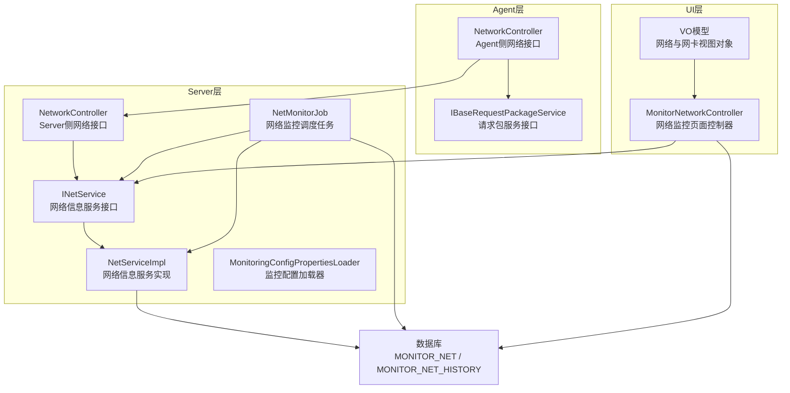
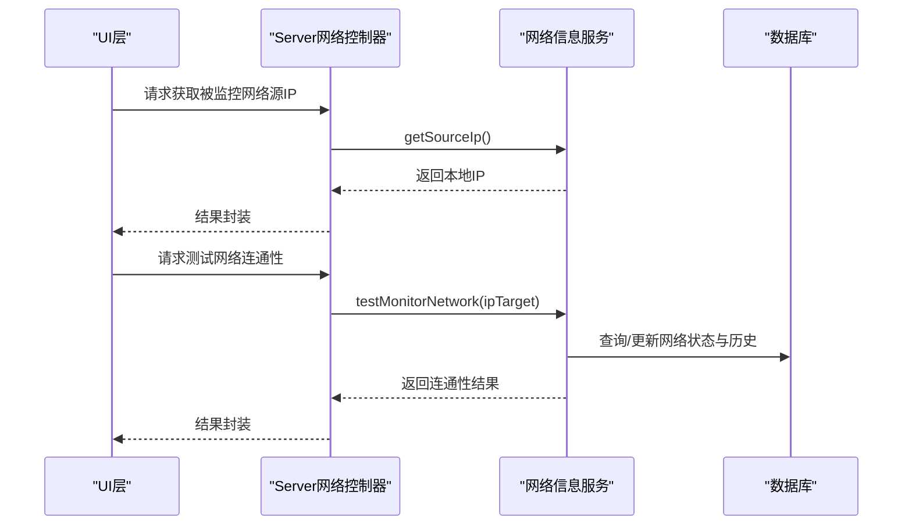
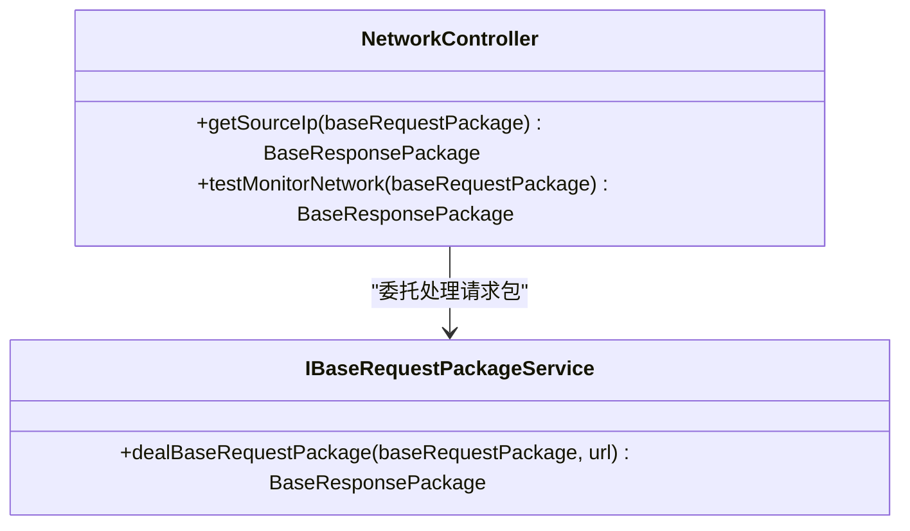
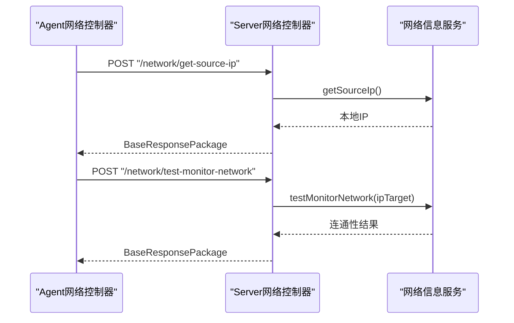
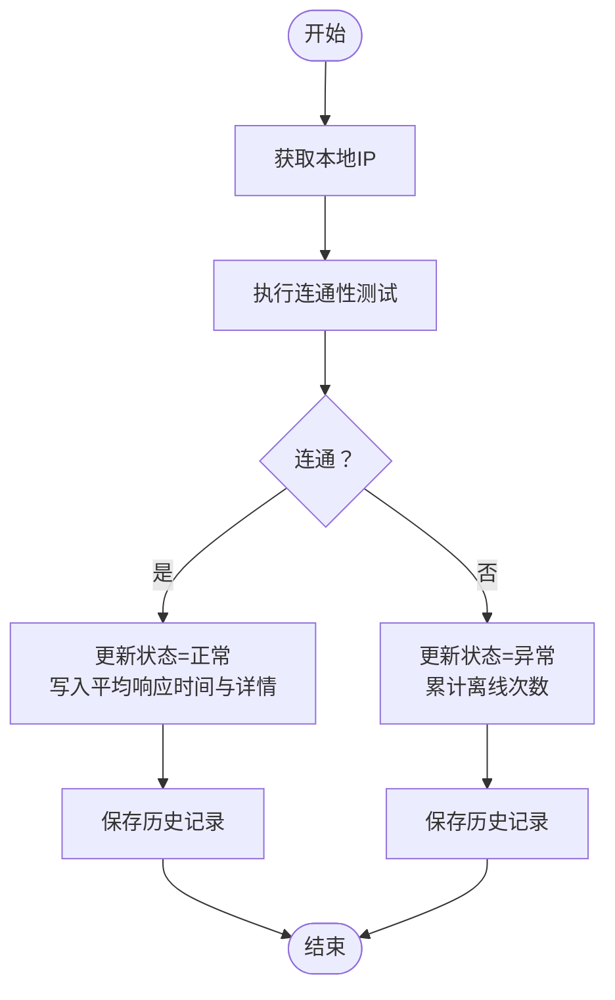
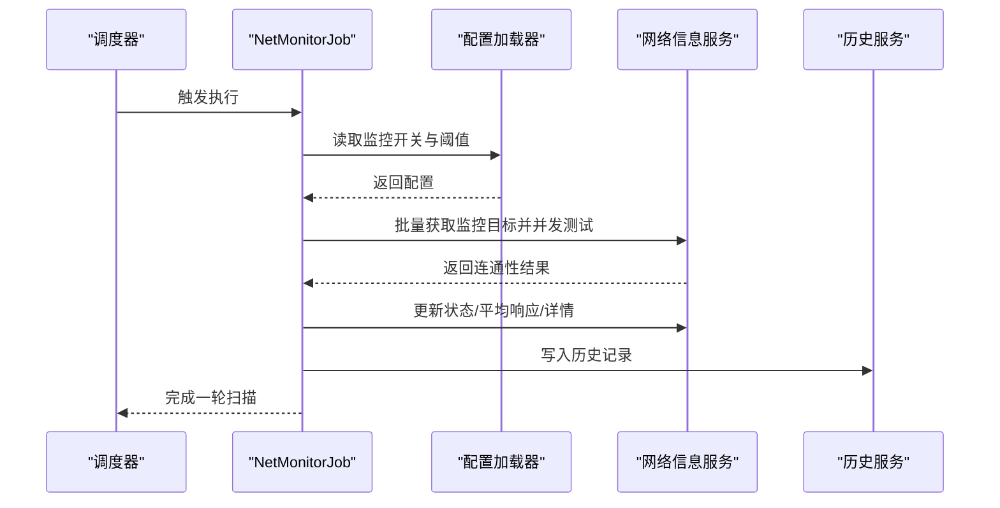
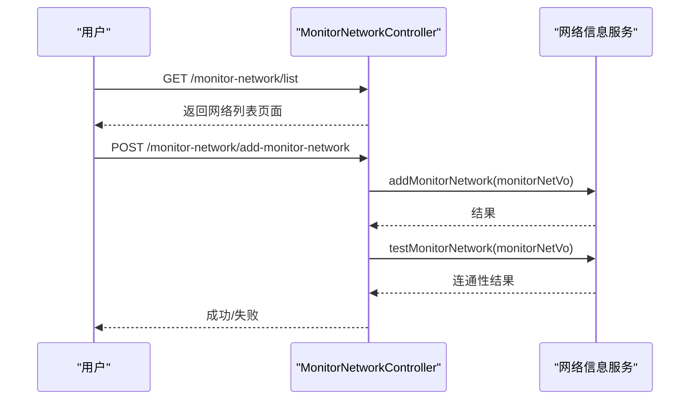
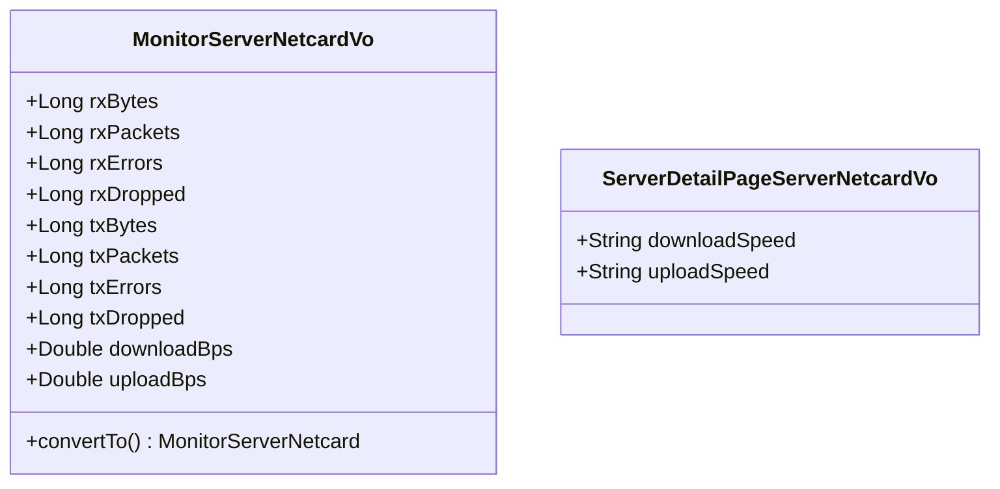
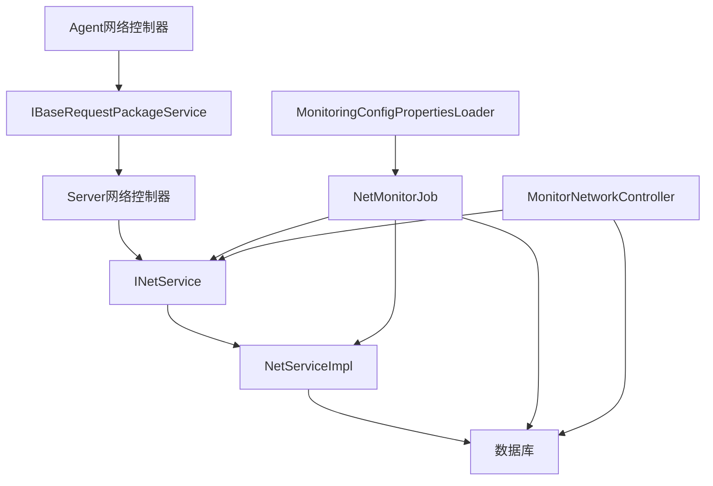

# 网络监控模块

<cite>
**本文引用的文件**
- [NetworkController.java](file://phoenix-agent/src/main/java/com/gitee/pifeng/monitoring/agent/business/client/controller/NetworkController.java)
- [IBaseRequestPackageService.java](file://phoenix-agent/src/main/java/com/gitee/pifeng/monitoring/agent/business/client/service/IBaseRequestPackageService.java)
- [NetworkController.java](file://phoenix-server/src/main/java/com/gitee/pifeng/monitoring/server/business/server/controller/NetworkController.java)
- [INetService.java](file://phoenix-server/src/main/java/com/gitee/pifeng/monitoring/server/business/server/service/INetService.java)
- [NetServiceImpl.java](file://phoenix-server/src/main/java/com/gitee/pifeng/monitoring/server/business/server/service/impl/NetServiceImpl.java)
- [NetMonitorJob.java](file://phoenix-server/src/main/java/com/gitee/pifeng/monitoring/server/business/server/monitor/net/NetMonitorJob.java)
- [MonitoringNetworkProperties.java](file://phoenix-common/phoenix-common-core/src/main/java/com/gitee/pifeng/monitoring/common/property/server/MonitoringNetworkProperties.java)
- [MonitoringNetworkStatusProperties.java](file://phoenix-common/phoenix-common-core/src/main/java/com/gitee/pifeng/monitoring/common/property/server/MonitoringNetworkStatusProperties.java)
- [MonitoringConfigPropertiesLoader.java](file://phoenix-server/src/main/java/com/gitee/pifeng/monitoring/server/business/server/core/MonitoringConfigPropertiesLoader.java)
- [MonitorNetworkController.java](file://phoenix-ui/src/main/java/com/gitee/pifeng/monitoring/ui/business/web/controller/MonitorNetworkController.java)
- [MonitorServerNetcardVo.java](file://phoenix-ui/src/main/java/com/gitee/pifeng/monitoring/ui/business/web/vo/MonitorServerNetcardVo.java)
- [ServerDetailPageServerNetcardVo.java](file://phoenix-ui/src/main/java/com/gitee/pifeng/monitoring/ui/business/web/vo/ServerDetailPageServerNetcardVo.java)
- [phoenix.sql](file://doc/数据库设计/sql/mysql/phoenix.sql)
</cite>

## 目录
1. [简介](#简介)
2. [项目结构](#项目结构)
3. [核心组件](#核心组件)
4. [架构总览](#架构总览)
5. [详细组件分析](#详细组件分析)
6. [依赖关系分析](#依赖关系分析)
7. [性能考量](#性能考量)
8. [故障排查指南](#故障排查指南)
9. [结论](#结论)
10. [附录](#附录)

## 简介
本技术文档围绕网络监控模块展开，系统性阐述网络流量监控、TCP连接状态监控、网络延迟分析与带宽使用率统计等核心网络性能监控指标的实现方式。文档覆盖数据采集机制、流量分析算法、连接状态跟踪、网络详情页面的高级功能（如流量趋势分析、连接拓扑展示、异常连接识别）、配置管理（监控目标设置、采样间隔调整、告警规则配置），并提供扩展指南（新增网络协议支持、自定义监控维度、集成网络性能分析工具）。

## 项目结构
网络监控模块在整体工程中采用三层分工：
- Agent层：负责采集被监控端的网络源IP、连通性测试等基础能力，并通过统一请求包进行服务端交互。
- Server层：负责网络连通性测试、状态更新、历史记录、告警触发与调度任务执行。
- UI层：提供网络监控配置、查询、编辑、清理历史、平均时间趋势查看等页面与接口。

图表来源
- [NetworkController.java:1-80](file://phoenix-agent/src/main/java/com/gitee/pifeng/monitoring/agent/business/client/controller/NetworkController.java#L1-L80)
- [IBaseRequestPackageService.java:1-30](file://phoenix-agent/src/main/java/com/gitee/pifeng/monitoring/agent/business/client/service/IBaseRequestPackageService.java#L1-L30)
- [NetworkController.java:1-109](file://phoenix-server/src/main/java/com/gitee/pifeng/monitoring/server/business/server/controller/NetworkController.java#L1-L109)
- [INetService.java:1-40](file://phoenix-server/src/main/java/com/gitee/pifeng/monitoring/server/business/server/service/INetService.java#L1-L40)
- [NetServiceImpl.java:1-78](file://phoenix-server/src/main/java/com/gitee/pifeng/monitoring/server/business/server/service/impl/NetServiceImpl.java#L1-L78)
- [NetMonitorJob.java:1-310](file://phoenix-server/src/main/java/com/gitee/pifeng/monitoring/server/business/server/monitor/net/NetMonitorJob.java#L1-L310)
- [MonitoringConfigPropertiesLoader.java:118-144](file://phoenix-server/src/main/java/com/gitee/pifeng/monitoring/server/business/server/core/MonitoringConfigPropertiesLoader.java#L118-L144)
- [MonitorNetworkController.java:1-373](file://phoenix-ui/src/main/java/com/gitee/pifeng/monitoring/ui/business/web/controller/MonitorNetworkController.java#L1-L373)
- [MonitorServerNetcardVo.java:86-130](file://phoenix-ui/src/main/java/com/gitee/pifeng/monitoring/ui/business/web/vo/MonitorServerNetcardVo.java#L86-L130)
- [ServerDetailPageServerNetcardVo.java:87-107](file://phoenix-ui/src/main/java/com/gitee/pifeng/monitoring/ui/business/web/vo/ServerDetailPageServerNetcardVo.java#L87-L107)

章节来源
- [NetworkController.java:1-80](file://phoenix-agent/src/main/java/com/gitee/pifeng/monitoring/agent/business/client/controller/NetworkController.java#L1-L80)
- [NetworkController.java:1-109](file://phoenix-server/src/main/java/com/gitee/pifeng/monitoring/server/business/server/controller/NetworkController.java#L1-L109)
- [MonitorNetworkController.java:1-373](file://phoenix-ui/src/main/java/com/gitee/pifeng/monitoring/ui/business/web/controller/MonitorNetworkController.java#L1-L373)

## 核心组件
- Agent网络控制器：提供“获取被监控网络源IP地址”和“测试网络连通性”的接口，通过统一请求包转发至Server层。
- Server网络控制器：封装Agent请求，调用网络信息服务，返回结果。
- 网络信息服务接口与实现：负责获取本地IP、执行连通性测试、更新状态与历史记录。
- 网络监控调度任务：周期扫描监控目标，批量并发测试连通性，更新状态、历史与告警。
- 监控配置加载器：集中加载网络监控开关、状态监控开关、告警开关及阈值等配置。
- UI网络控制器：提供网络监控列表、新增/编辑、启停监控与告警、清理历史、平均时间趋势等页面与接口。
- VO模型：用于网卡流量与服务器详情页的速度展示，支撑前端图表渲染。

章节来源
- [INetService.java:1-40](file://phoenix-server/src/main/java/com/gitee/pifeng/monitoring/server/business/server/service/INetService.java#L1-L40)
- [NetServiceImpl.java:1-78](file://phoenix-server/src/main/java/com/gitee/pifeng/monitoring/server/business/server/service/impl/NetServiceImpl.java#L1-L78)
- [NetMonitorJob.java:1-310](file://phoenix-server/src/main/java/com/gitee/pifeng/monitoring/server/business/server/monitor/net/NetMonitorJob.java#L1-L310)
- [MonitoringNetworkProperties.java:1-31](file://phoenix-common/phoenix-common-core/src/main/java/com/gitee/pifeng/monitoring/common/property/server/MonitoringNetworkProperties.java#L1-L31)
- [MonitoringNetworkStatusProperties.java:1-31](file://phoenix-common/phoenix-common-core/src/main/java/com/gitee/pifeng/monitoring/common/property/server/MonitoringNetworkStatusProperties.java#L1-L31)
- [MonitoringConfigPropertiesLoader.java:118-144](file://phoenix-server/src/main/java/com/gitee/pifeng/monitoring/server/business/server/core/MonitoringConfigPropertiesLoader.java#L118-L144)
- [MonitorNetworkController.java:1-373](file://phoenix-ui/src/main/java/com/gitee/pifeng/monitoring/ui/business/web/controller/MonitorNetworkController.java#L1-L373)
- [MonitorServerNetcardVo.java:86-130](file://phoenix-ui/src/main/java/com/gitee/pifeng/monitoring/ui/business/web/vo/MonitorServerNetcardVo.java#L86-L130)
- [ServerDetailPageServerNetcardVo.java:87-107](file://phoenix-ui/src/main/java/com/gitee/pifeng/monitoring/ui/business/web/vo/ServerDetailPageServerNetcardVo.java#L87-L107)

## 架构总览
网络监控模块遵循“Agent采集—Server处理—UI呈现”的分层架构。Agent负责与被监控端交互，Server负责业务逻辑与持久化，UI负责用户操作与可视化。

图表来源
- [NetworkController.java:64-106](file://phoenix-server/src/main/java/com/gitee/pifeng/monitoring/server/business/server/controller/NetworkController.java#L64-L106)
- [INetService.java:17-40](file://phoenix-server/src/main/java/com/gitee/pifeng/monitoring/server/business/server/service/INetService.java#L17-L40)
- [NetServiceImpl.java:52-76](file://phoenix-server/src/main/java/com/gitee/pifeng/monitoring/server/business/server/service/impl/NetServiceImpl.java#L52-L76)

## 详细组件分析

### Agent网络控制器
- 功能：提供“获取被监控网络源IP地址”和“测试网络连通性”两个接口，基于统一请求包转发到Server层。
- 关键点：通过IBaseRequestPackageService处理请求包，解耦Agent与Server通信细节。

图表来源
- [NetworkController.java:1-80](file://phoenix-agent/src/main/java/com/gitee/pifeng/monitoring/agent/business/client/controller/NetworkController.java#L1-L80)
- [IBaseRequestPackageService.java:1-30](file://phoenix-agent/src/main/java/com/gitee/pifeng/monitoring/agent/business/client/service/IBaseRequestPackageService.java#L1-L30)

章节来源
- [NetworkController.java:1-80](file://phoenix-agent/src/main/java/com/gitee/pifeng/monitoring/agent/business/client/controller/NetworkController.java#L1-L80)
- [IBaseRequestPackageService.java:1-30](file://phoenix-agent/src/main/java/com/gitee/pifeng/monitoring/agent/business/client/service/IBaseRequestPackageService.java#L1-L30)

### Server网络控制器
- 功能：封装Agent请求，调用网络信息服务，返回统一结果包；包含计时与慢查询告警。
- 性能：对耗时超过阈值的操作输出警告日志，便于定位性能瓶颈。

图表来源
- [NetworkController.java:64-106](file://phoenix-server/src/main/java/com/gitee/pifeng/monitoring/server/business/server/controller/NetworkController.java#L64-L106)
- [INetService.java:17-40](file://phoenix-server/src/main/java/com/gitee/pifeng/monitoring/server/business/server/service/INetService.java#L17-L40)

章节来源
- [NetworkController.java:1-109](file://phoenix-server/src/main/java/com/gitee/pifeng/monitoring/server/business/server/controller/NetworkController.java#L1-L109)

### 网络信息服务接口与实现
- 接口职责：提供获取本地IP、测试网络连通性、更新状态与历史记录的能力。
- 实现要点：使用工具类进行连通性检测，根据结果更新状态、平均响应时间、ping详情与更新时间；同时维护历史表记录。

图表来源
- [INetService.java:17-40](file://phoenix-server/src/main/java/com/gitee/pifeng/monitoring/server/business/server/service/INetService.java#L17-L40)
- [NetServiceImpl.java:52-76](file://phoenix-server/src/main/java/com/gitee/pifeng/monitoring/server/business/server/service/impl/NetServiceImpl.java#L52-L76)

章节来源
- [INetService.java:1-40](file://phoenix-server/src/main/java/com/gitee/pifeng/monitoring/server/business/server/service/INetService.java#L1-L40)
- [NetServiceImpl.java:1-78](file://phoenix-server/src/main/java/com/gitee/pifeng/monitoring/server/business/server/service/impl/NetServiceImpl.java#L1-L78)

### 网络监控调度任务
- 职责：周期扫描数据库中的网络监控目标，按批次并发执行连通性测试，更新状态与历史，并在状态变化时发送告警。
- 并发策略：打乱目标顺序，按固定大小切分为子列表，使用线程池并发处理，提升吞吐。
- 阈值重试：在配置阈值内多次尝试，确保抖动下的稳定性。
- 告警策略：仅在开启告警且目标允许告警时发送；状态从正常到异常或从异常到正常分别触发不同告警。

图表来源
- [NetMonitorJob.java:100-167](file://phoenix-server/src/main/java/com/gitee/pifeng/monitoring/server/business/server/monitor/net/NetMonitorJob.java#L100-L167)
- [MonitoringConfigPropertiesLoader.java:118-144](file://phoenix-server/src/main/java/com/gitee/pifeng/monitoring/server/business/server/core/MonitoringConfigPropertiesLoader.java#L118-L144)

章节来源
- [NetMonitorJob.java:1-310](file://phoenix-server/src/main/java/com/gitee/pifeng/monitoring/server/business/server/monitor/net/NetMonitorJob.java#L1-L310)
- [MonitoringConfigPropertiesLoader.java:118-144](file://phoenix-server/src/main/java/com/gitee/pifeng/monitoring/server/business/server/core/MonitoringConfigPropertiesLoader.java#L118-L144)

### UI网络监控页面控制器
- 功能：提供网络监控列表查询、新增/编辑、启停监控与告警、清理历史、平均时间趋势页面等。
- 交互：在新增/编辑后自动触发连通性测试，确保配置生效；支持按环境、分组、状态等条件筛选。

图表来源
- [MonitorNetworkController.java:74-136](file://phoenix-ui/src/main/java/com/gitee/pifeng/monitoring/ui/business/web/controller/MonitorNetworkController.java#L74-L136)
- [MonitorNetworkController.java:250-260](file://phoenix-ui/src/main/java/com/gitee/pifeng/monitoring/ui/business/web/controller/MonitorNetworkController.java#L250-L260)
- [MonitorNetworkController.java:364-370](file://phoenix-ui/src/main/java/com/gitee/pifeng/monitoring/ui/business/web/controller/MonitorNetworkController.java#L364-L370)

章节来源
- [MonitorNetworkController.java:1-373](file://phoenix-ui/src/main/java/com/gitee/pifeng/monitoring/ui/business/web/controller/MonitorNetworkController.java#L1-L373)

### 网络详情页面与网卡流量
- 网卡流量指标：接收/发送字节、包数、错误数、丢弃数、下载/上传速度等，用于流量趋势分析与带宽使用率统计。
- 服务器详情页：以字符串形式展示下载/上传速度，便于前端图表渲染与用户阅读。

图表来源
- [MonitorServerNetcardVo.java:86-130](file://phoenix-ui/src/main/java/com/gitee/pifeng/monitoring/ui/business/web/vo/MonitorServerNetcardVo.java#L86-L130)
- [ServerDetailPageServerNetcardVo.java:87-107](file://phoenix-ui/src/main/java/com/gitee/pifeng/monitoring/ui/business/web/vo/ServerDetailPageServerNetcardVo.java#L87-L107)

章节来源
- [MonitorServerNetcardVo.java:86-130](file://phoenix-ui/src/main/java/com/gitee/pifeng/monitoring/ui/business/web/vo/MonitorServerNetcardVo.java#L86-L130)
- [ServerDetailPageServerNetcardVo.java:87-107](file://phoenix-ui/src/main/java/com/gitee/pifeng/monitoring/ui/business/web/vo/ServerDetailPageServerNetcardVo.java#L87-L107)

## 依赖关系分析
- 组件耦合：Agent与Server通过统一请求包解耦；Server内部通过服务接口隔离实现；调度任务依赖配置加载器与服务接口。
- 外部依赖：数据库存储网络状态与历史；Quartz调度任务；线程池并发处理；告警服务发送告警。

图表来源
- [NetworkController.java:1-80](file://phoenix-agent/src/main/java/com/gitee/pifeng/monitoring/agent/business/client/controller/NetworkController.java#L1-L80)
- [NetworkController.java:1-109](file://phoenix-server/src/main/java/com/gitee/pifeng/monitoring/server/business/server/controller/NetworkController.java#L1-L109)
- [NetServiceImpl.java:1-78](file://phoenix-server/src/main/java/com/gitee/pifeng/monitoring/server/business/server/service/impl/NetServiceImpl.java#L1-L78)
- [NetMonitorJob.java:1-310](file://phoenix-server/src/main/java/com/gitee/pifeng/monitoring/server/business/server/monitor/net/NetMonitorJob.java#L1-L310)
- [MonitoringConfigPropertiesLoader.java:118-144](file://phoenix-server/src/main/java/com/gitee/pifeng/monitoring/server/business/server/core/MonitoringConfigPropertiesLoader.java#L118-L144)
- [MonitorNetworkController.java:1-373](file://phoenix-ui/src/main/java/com/gitee/pifeng/monitoring/ui/business/web/controller/MonitorNetworkController.java#L1-L373)

章节来源
- [NetMonitorJob.java:1-310](file://phoenix-server/src/main/java/com/gitee/pifeng/monitoring/server/business/server/monitor/net/NetMonitorJob.java#L1-L310)
- [MonitoringConfigPropertiesLoader.java:118-144](file://phoenix-server/src/main/java/com/gitee/pifeng/monitoring/server/business/server/core/MonitoringConfigPropertiesLoader.java#L118-L144)

## 性能考量
- 并发与批处理：调度任务将监控目标打乱并按固定大小切分，配合线程池并发处理，显著提升大规模目标的扫描效率。
- 重试与稳定性：在配置阈值内多次尝试连通性测试，降低瞬时网络波动带来的误判。
- 日志与计时：Server侧接口对耗时较长的操作输出警告日志，便于定位性能瓶颈。
- 历史写入：每次状态变更均写入历史表，避免频繁全量扫描带来的压力。

## 故障排查指南
- Agent无法获取Server响应：检查Agent与Server之间的网络连通性与端口开放情况；确认IBaseRequestPackageService代理链路正常。
- Server接口响应慢：关注慢查询日志，定位数据库查询与历史写入环节；评估线程池大小与批处理粒度。
- 调度任务未执行：确认监控开关与状态监控开关已启用；检查Quartz调度器与线程池配置。
- 告警未触发：确认告警开关与目标告警开关均已启用；核对告警内容与告警服务配置。
- UI页面异常：检查网络列表查询参数与权限控制；验证平均时间页面的数据加载逻辑。

章节来源
- [NetworkController.java:64-106](file://phoenix-server/src/main/java/com/gitee/pifeng/monitoring/server/business/server/controller/NetworkController.java#L64-L106)
- [NetMonitorJob.java:163-166](file://phoenix-server/src/main/java/com/gitee/pifeng/monitoring/server/business/server/monitor/net/NetMonitorJob.java#L163-L166)

## 结论
网络监控模块通过Agent采集、Server处理与UI呈现的分层设计，实现了对网络连通性、状态变化与历史趋势的全面监控。调度任务的并发优化与阈值重试机制提升了稳定性与性能。结合配置加载器与告警服务，系统具备完善的可配置性与可扩展性。后续可在协议扩展、监控维度定制与外部分析工具集成方面进一步增强。

## 附录

### 数据模型与字段说明
- 网络监控表（MONITOR_NET）与历史表（MONITOR_NET_HISTORY）：包含源IP、目标IP、描述、状态、平均响应时间、离线次数、ping详情、插入/更新时间等字段，支撑连通性测试与历史追踪。
- 网卡表（MONITOR_SERVER_NETCARD）与历史表（MONITOR_SERVER_NETCARD_HISTORY）：包含接收/发送字节、包数、错误数、丢弃数、下载/上传速度等字段，支撑流量趋势与带宽使用率统计。

章节来源
- [phoenix.sql:911-950](file://doc/数据库设计/sql/mysql/phoenix.sql#L911-L950)
- [phoenix.sql:941-1144](file://doc/数据库设计/sql/mysql/phoenix.sql#L941-L1144)