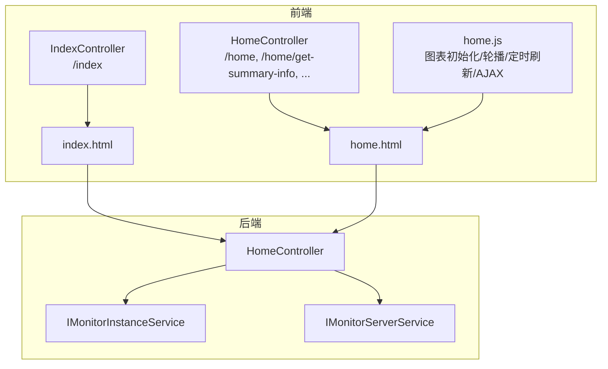
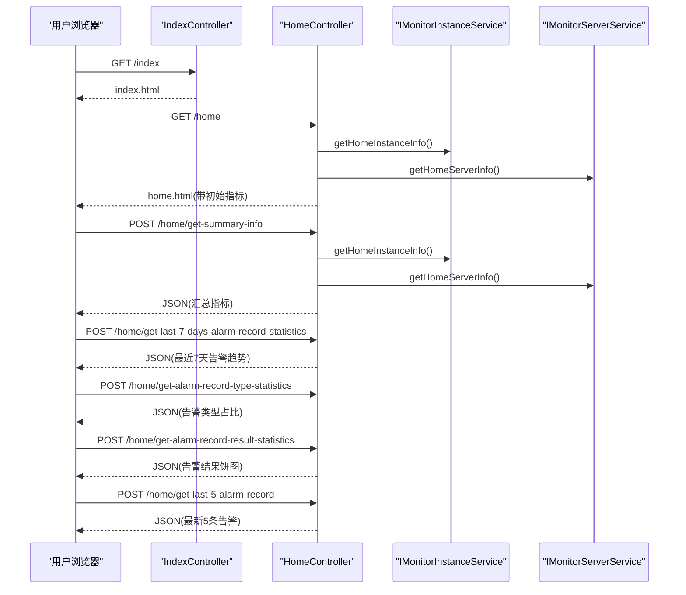
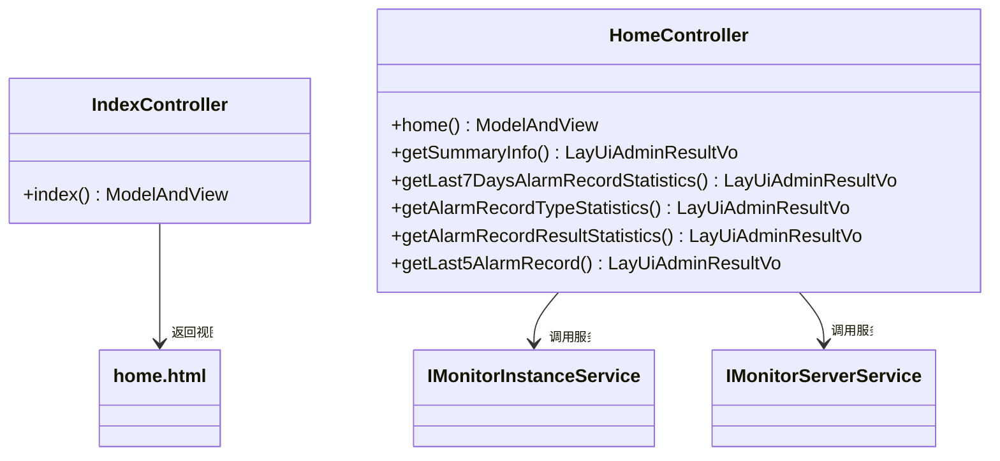
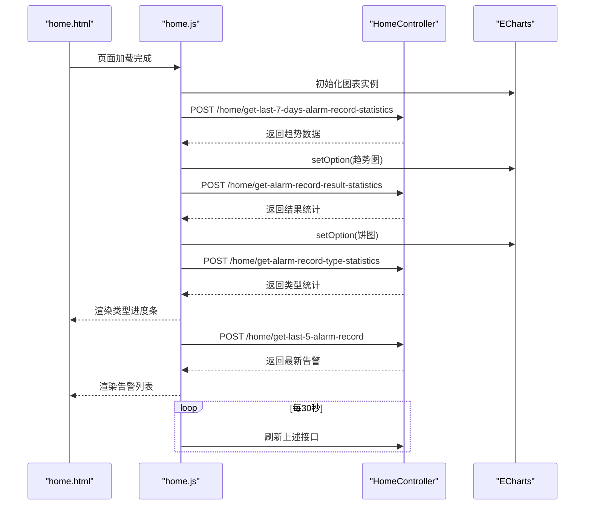
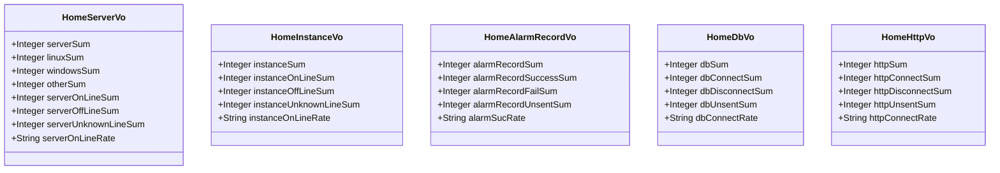
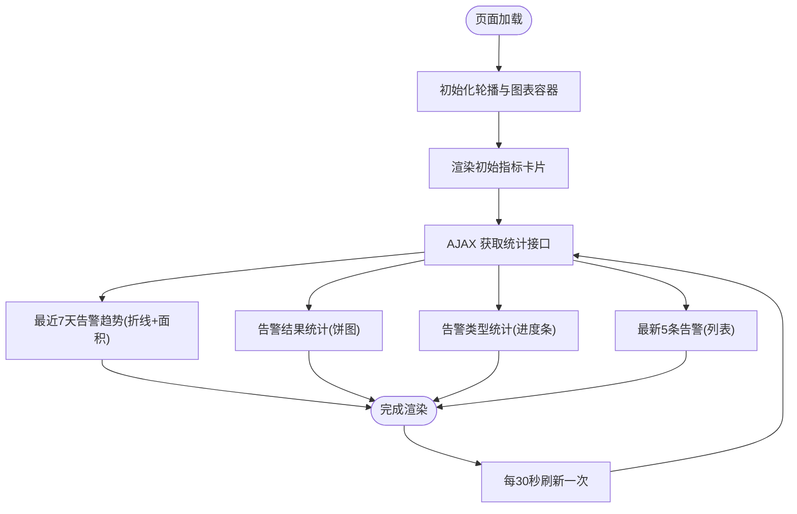
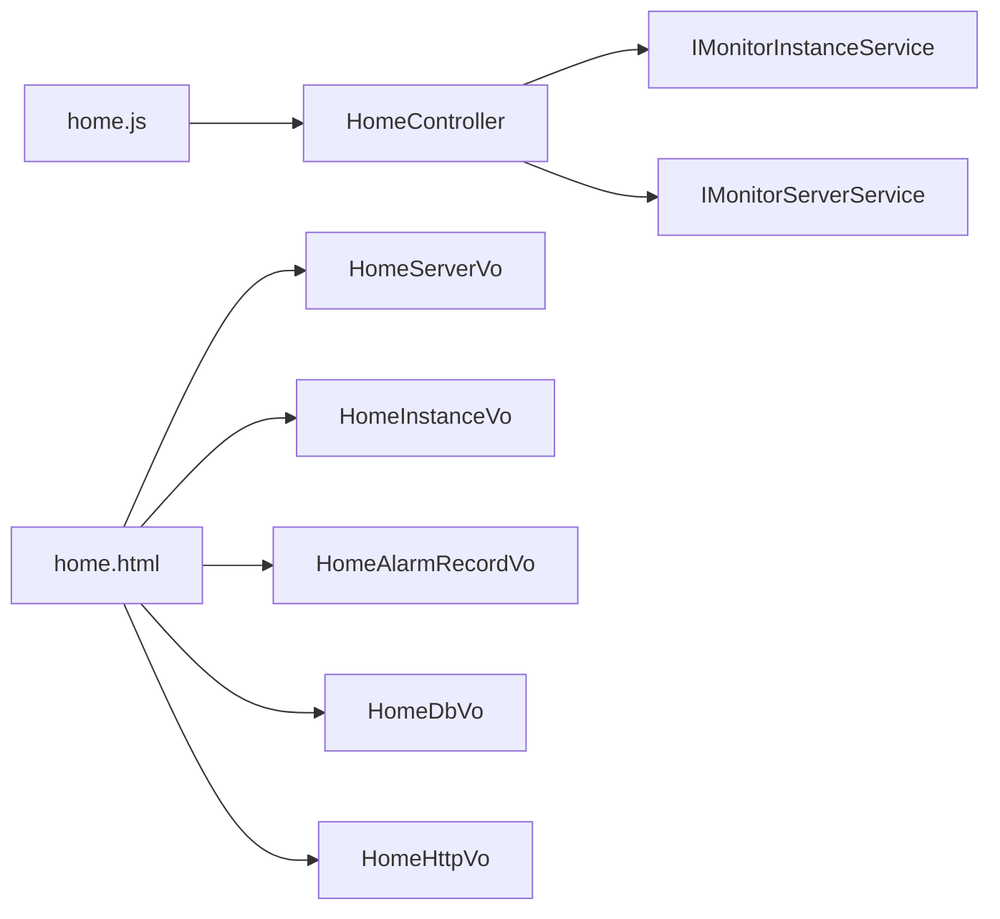

# 首页仪表板模块

<cite>
**本文引用的文件**
- [HomeController.java](file://phoenix-ui/src/main/java/com/gitee/pifeng/monitoring/ui/business/web/controller/HomeController.java)
- [IndexController.java](file://phoenix-ui/src/main/java/com/gitee/pifeng/monitoring/ui/business/web/controller/IndexController.java)
- [home.html](file://phoenix-ui/src/main/resources/templates/home.html)
- [home.js](file://phoenix-ui/src/main/resources/static/modules/home.js)
- [HomeServerVo.java](file://phoenix-ui/src/main/java/com/gitee/pifeng/monitoring/ui/business/web/vo/HomeServerVo.java)
- [HomeInstanceVo.java](file://phoenix-ui/src/main/java/com/gitee/pifeng/monitoring/ui/business/web/vo/HomeInstanceVo.java)
- [HomeAlarmRecordVo.java](file://phoenix-ui/src/main/java/com/gitee/pifeng/monitoring/ui/business/web/vo/HomeAlarmRecordVo.java)
- [HomeDbVo.java](file://phoenix-ui/src/main/java/com/gitee/pifeng/monitoring/ui/business/web/vo/HomeDbVo.java)
- [HomeHttpVo.java](file://phoenix-ui/src/main/java/com/gitee/pifeng/monitoring/ui/business/web/vo/HomeHttpVo.java)
- [IMonitorServerService.java](file://phoenix-ui/src/main/java/com/gitee/pifeng/monitoring/ui/business/web/service/IMonitorServerService.java)
- [IMonitorInstanceService.java](file://phoenix-ui/src/main/java/com/gitee/pifeng/monitoring/ui/business/web/service/IMonitorInstanceService.java)
</cite>

## 目录
1. [简介](#简介)
2. [项目结构](#项目结构)
3. [核心组件](#核心组件)
4. [架构总览](#架构总览)
5. [详细组件分析](#详细组件分析)
6. [依赖分析](#依赖分析)
7. [性能考虑](#性能考虑)
8. [故障排查指南](#故障排查指南)
9. [结论](#结论)
10. [附录](#附录)

## 简介
本文件为首页仪表板模块的技术文档，聚焦于 HomeController 与 IndexController 的核心职责，阐述首页数据聚合、实时监控概览与关键指标展示的业务逻辑与技术实现。文档覆盖以下主题：
- 首页数据聚合：服务器、应用实例、数据库、网络、TCP、HTTP、告警等关键指标的来源与聚合方式
- 实时监控概览：图表渲染、轮播切换、定时刷新机制
- 页面布局与响应式适配：基于 Layui 的卡片布局与 ECharts 图表的自适应
- 用户体验优化：图表主题、提示与交互细节
- 自定义配置扩展：指标选择、时间范围、图表样式等可扩展方向

## 项目结构
首页仪表板涉及前后端协作：
- 控制器层：IndexController 负责首页入口跳转；HomeController 负责首页数据聚合与接口
- 视图层：Thymeleaf 模板 home.html 提供页面骨架与占位
- 前端模块：home.js 负责图表初始化、轮播配置、定时刷新与 AJAX 请求
- VO 层：HomeServerVo、HomeInstanceVo、HomeAlarmRecordVo、HomeDbVo、HomeHttpVo 等承载首页指标数据

**图表来源**
- [IndexController.java:30-34](file://phoenix-ui/src/main/java/com/gitee/pifeng/monitoring/ui/business/web/controller/IndexController.java#L30-L34)
- [HomeController.java:90-109](file://phoenix-ui/src/main/java/com/gitee/pifeng/monitoring/ui/business/web/controller/HomeController.java#L90-L109)
- [home.html:32-342](file://phoenix-ui/src/main/resources/templates/home.html#L32-L342)
- [home.js:13-21](file://phoenix-ui/src/main/resources/static/modules/home.js#L13-L21)

**章节来源**
- [IndexController.java:30-34](file://phoenix-ui/src/main/java/com/gitee/pifeng/monitoring/ui/business/web/controller/IndexController.java#L30-L34)
- [HomeController.java:90-109](file://phoenix-ui/src/main/java/com/gitee/pifeng/monitoring/ui/business/web/controller/HomeController.java#L90-L109)
- [home.html:32-342](file://phoenix-ui/src/main/resources/templates/home.html#L32-L342)
- [home.js:13-21](file://phoenix-ui/src/main/resources/static/modules/home.js#L13-L21)

## 核心组件
- IndexController：提供首页入口视图，负责将请求转发到 index.html
- HomeController：
  - 页面加载：聚合首页各指标并填充 home.html
  - 接口能力：提供摘要信息、最近7天告警统计、告警类型统计、告警结果统计、最新5条告警等接口
- home.html：首页模板，包含指标卡片与统计轮播区域
- home.js：前端模块，负责图表初始化、轮播配置、窗口尺寸变化处理、定时刷新与 AJAX 请求

**章节来源**
- [IndexController.java:30-34](file://phoenix-ui/src/main/java/com/gitee/pifeng/monitoring/ui/business/web/controller/IndexController.java#L30-L34)
- [HomeController.java:90-109](file://phoenix-ui/src/main/java/com/gitee/pifeng/monitoring/ui/business/web/controller/HomeController.java#L90-L109)
- [home.html:32-342](file://phoenix-ui/src/main/resources/templates/home.html#L32-L342)
- [home.js:13-21](file://phoenix-ui/src/main/resources/static/modules/home.js#L13-L21)

## 架构总览
首页仪表板采用“控制器-服务-视图-前端模块”的分层架构：
- 控制器接收请求并调用服务层获取数据
- 服务层封装数据聚合逻辑（此处为 UI 层接口定义）
- 视图层通过 Thymeleaf 注入初始数据
- 前端模块在页面加载后通过 AJAX 动态拉取图表与最新数据，并定时刷新

**图表来源**
- [IndexController.java:30-34](file://phoenix-ui/src/main/java/com/gitee/pifeng/monitoring/ui/business/web/controller/IndexController.java#L30-L34)
- [HomeController.java:90-109](file://phoenix-ui/src/main/java/com/gitee/pifeng/monitoring/ui/business/web/controller/HomeController.java#L90-L109)
- [HomeController.java:120-205](file://phoenix-ui/src/main/java/com/gitee/pifeng/monitoring/ui/business/web/controller/HomeController.java#L120-L205)
- [IMonitorInstanceService.java:31-32](file://phoenix-ui/src/main/java/com/gitee/pifeng/monitoring/ui/business/web/service/IMonitorInstanceService.java#L31-L32)
- [IMonitorServerService.java:31-32](file://phoenix-ui/src/main/java/com/gitee/pifeng/monitoring/ui/business/web/service/IMonitorServerService.java#L31-L32)

## 详细组件分析

### 控制器层
- IndexController：提供 /index 入口，返回 index.html
- HomeController：
  - /home：构建 ModelAndView，注入服务器、应用实例、数据库、网络、TCP、HTTP、告警等指标
  - /home/get-summary-info：返回聚合指标字典，供前端动态更新卡片
  - 统计接口：最近7天告警趋势、告警类型统计、告警结果统计、最新5条告警

**图表来源**
- [IndexController.java:30-34](file://phoenix-ui/src/main/java/com/gitee/pifeng/monitoring/ui/business/web/controller/IndexController.java#L30-L34)
- [HomeController.java:90-205](file://phoenix-ui/src/main/java/com/gitee/pifeng/monitoring/ui/business/web/controller/HomeController.java#L90-L205)
- [IMonitorInstanceService.java:31-32](file://phoenix-ui/src/main/java/com/gitee/pifeng/monitoring/ui/business/web/service/IMonitorInstanceService.java#L31-L32)
- [IMonitorServerService.java:31-32](file://phoenix-ui/src/main/java/com/gitee/pifeng/monitoring/ui/business/web/service/IMonitorServerService.java#L31-L32)

**章节来源**
- [IndexController.java:30-34](file://phoenix-ui/src/main/java/com/gitee/pifeng/monitoring/ui/business/web/controller/IndexController.java#L30-L34)
- [HomeController.java:90-205](file://phoenix-ui/src/main/java/com/gitee/pifeng/monitoring/ui/business/web/controller/HomeController.java#L90-L205)

### 视图层与前端模块
- home.html：定义指标卡片与统计轮播区域，通过 Thymeleaf 注入初始数据
- home.js：
  - 初始化轮播与图表容器，设置自适应宽高
  - 基于 ECharts 渲染最近7天告警趋势（折线+面积）、告警结果（饼图）
  - 通过 AJAX 拉取统计数据与最新告警，每30秒刷新一次

**图表来源**
- [home.html:317-329](file://phoenix-ui/src/main/resources/templates/home.html#L317-L329)
- [home.js:13-21](file://phoenix-ui/src/main/resources/static/modules/home.js#L13-L21)
- [home.js:40-196](file://phoenix-ui/src/main/resources/static/modules/home.js#L40-L196)
- [home.js:198-326](file://phoenix-ui/src/main/resources/static/modules/home.js#L198-L326)
- [home.js:328-358](file://phoenix-ui/src/main/resources/static/modules/home.js#L328-L358)
- [home.js:544-564](file://phoenix-ui/src/main/resources/static/modules/home.js#L544-L564)

**章节来源**
- [home.html:317-329](file://phoenix-ui/src/main/resources/templates/home.html#L317-L329)
- [home.js:13-21](file://phoenix-ui/src/main/resources/static/modules/home.js#L13-L21)
- [home.js:40-196](file://phoenix-ui/src/main/resources/static/modules/home.js#L40-L196)
- [home.js:198-326](file://phoenix-ui/src/main/resources/static/modules/home.js#L198-L326)
- [home.js:328-358](file://phoenix-ui/src/main/resources/static/modules/home.js#L328-L358)
- [home.js:544-564](file://phoenix-ui/src/main/resources/static/modules/home.js#L544-L564)

### 数据模型与聚合
- HomeServerVo：服务器总量、在线/离线/未知数量与在线率
- HomeInstanceVo：应用实例总量、在线/离线/未知数量与在线率
- HomeAlarmRecordVo：告警总数、成功/失败/未发送数量与成功率
- HomeDbVo：数据库总量、正常/异常/未知数量与正常率
- HomeHttpVo：HTTP 总量、正常/异常/未知数量与正常率

这些 VO 对象作为 HomeController 的数据载体，用于页面初始渲染与 AJAX 返回。

**图表来源**
- [HomeServerVo.java:25-51](file://phoenix-ui/src/main/java/com/gitee/pifeng/monitoring/ui/business/web/vo/HomeServerVo.java#L25-L51)
- [HomeInstanceVo.java:25-42](file://phoenix-ui/src/main/java/com/gitee/pifeng/monitoring/ui/business/web/vo/HomeInstanceVo.java#L25-L42)
- [HomeAlarmRecordVo.java:25-42](file://phoenix-ui/src/main/java/com/gitee/pifeng/monitoring/ui/business/web/vo/HomeAlarmRecordVo.java#L25-L42)
- [HomeDbVo.java:25-42](file://phoenix-ui/src/main/java/com/gitee/pifeng/monitoring/ui/business/web/vo/HomeDbVo.java#L25-L42)
- [HomeHttpVo.java:25-41](file://phoenix-ui/src/main/java/com/gitee/pifeng/monitoring/ui/business/web/vo/HomeHttpVo.java#L25-L41)

**章节来源**
- [HomeServerVo.java:25-51](file://phoenix-ui/src/main/java/com/gitee/pifeng/monitoring/ui/business/web/vo/HomeServerVo.java#L25-L51)
- [HomeInstanceVo.java:25-42](file://phoenix-ui/src/main/java/com/gitee/pifeng/monitoring/ui/business/web/vo/HomeInstanceVo.java#L25-L42)
- [HomeAlarmRecordVo.java:25-42](file://phoenix-ui/src/main/java/com/gitee/pifeng/monitoring/ui/business/web/vo/HomeAlarmRecordVo.java#L25-L42)
- [HomeDbVo.java:25-42](file://phoenix-ui/src/main/java/com/gitee/pifeng/monitoring/ui/business/web/vo/HomeDbVo.java#L25-L42)
- [HomeHttpVo.java:25-41](file://phoenix-ui/src/main/java/com/gitee/pifeng/monitoring/ui/business/web/vo/HomeHttpVo.java#L25-L41)

### 数据聚合与图表渲染流程
- 聚合入口：HomeController 在 /home 中一次性获取所有指标并注入模板
- 动态刷新：home.js 定时调用多个统计接口，分别渲染趋势图、结果饼图与类型进度条
- 图表主题：使用 ECharts 的 infographic 主题，折线图采用平滑曲线与渐变填充，饼图采用径向渐变色

**图表来源**
- [home.js:13-21](file://phoenix-ui/src/main/resources/static/modules/home.js#L13-L21)
- [home.js:40-196](file://phoenix-ui/src/main/resources/static/modules/home.js#L40-L196)
- [home.js:198-326](file://phoenix-ui/src/main/resources/static/modules/home.js#L198-L326)
- [home.js:328-358](file://phoenix-ui/src/main/resources/static/modules/home.js#L328-L358)
- [home.js:544-564](file://phoenix-ui/src/main/resources/static/modules/home.js#L544-L564)

**章节来源**
- [home.js:13-21](file://phoenix-ui/src/main/resources/static/modules/home.js#L13-L21)
- [home.js:40-196](file://phoenix-ui/src/main/resources/static/modules/home.js#L40-L196)
- [home.js:198-326](file://phoenix-ui/src/main/resources/static/modules/home.js#L198-L326)
- [home.js:328-358](file://phoenix-ui/src/main/resources/static/modules/home.js#L328-L358)
- [home.js:544-564](file://phoenix-ui/src/main/resources/static/modules/home.js#L544-L564)

### 页面布局与响应式适配
- 使用 Layui 栅格系统，卡片按行排列，移动端自适应
- 统计轮播容器与图表容器在窗口 resize 时同步调整尺寸，确保图表自适应
- 回到顶部小部件提升滚动体验

**章节来源**
- [home.html:24-342](file://phoenix-ui/src/main/resources/templates/home.html#L24-L342)
- [home.js:31-38](file://phoenix-ui/src/main/resources/static/modules/home.js#L31-L38)

### 实时刷新机制
- 轮播自动播放与触屏点击切换
- 每30秒自动刷新：趋势图、结果统计、类型统计、最新告警与摘要信息
- 图表实例在窗口变化时自动 resize，避免渲染溢出

**章节来源**
- [home.js:13-21](file://phoenix-ui/src/main/resources/static/modules/home.js#L13-L21)
- [home.js:544-564](file://phoenix-ui/src/main/resources/static/modules/home.js#L544-L564)

## 依赖分析
- 控制器依赖服务接口：HomeController 通过注入的服务接口获取首页指标
- 前端依赖后端接口：home.js 通过统一的 base 地址调用 HomeController 暴露的接口
- 模板依赖 VO：home.html 通过 Thymeleaf 将 VO 字段渲染到页面

**图表来源**
- [HomeController.java:35-78](file://phoenix-ui/src/main/java/com/gitee/pifeng/monitoring/ui/business/web/controller/HomeController.java#L35-L78)
- [home.html:94-107](file://phoenix-ui/src/main/resources/templates/home.html#L94-L107)
- [home.js:361-542](file://phoenix-ui/src/main/resources/static/modules/home.js#L361-L542)

**章节来源**
- [HomeController.java:35-78](file://phoenix-ui/src/main/java/com/gitee/pifeng/monitoring/ui/business/web/controller/HomeController.java#L35-L78)
- [home.html:94-107](file://phoenix-ui/src/main/resources/templates/home.html#L94-L107)
- [home.js:361-542](file://phoenix-ui/src/main/resources/static/modules/home.js#L361-L542)

## 性能考虑
- 前端定时刷新频率：每30秒一次，建议根据监控规模与后端压力进行调节
- 图表渲染：折线图启用平滑曲线与渐变填充，建议在大数据量时考虑采样或分页
- 资源加载：ECharts 与 Layui 按需加载，减少首屏负担
- 响应式：容器尺寸随窗口变化自动调整，避免重绘抖动

[本节为通用指导，无需特定文件引用]

## 故障排查指南
- 接口返回错误：home.js 在 AJAX 错误回调中弹出系统错误提示，检查后端接口是否可达与 CSRF Token 是否正确传递
- 图表不显示：确认 ECharts 实例已初始化且容器尺寸有效；检查轮播与图表容器的宽高设置
- 数据不更新：确认定时刷新任务是否执行；检查后端服务接口是否正常返回数据

**章节来源**
- [home.js:192-195](file://phoenix-ui/src/main/resources/static/modules/home.js#L192-L195)
- [home.js:229-232](file://phoenix-ui/src/main/resources/static/modules/home.js#L229-L232)
- [home.js:323-325](file://phoenix-ui/src/main/resources/static/modules/home.js#L323-L325)
- [home.js:355-357](file://phoenix-ui/src/main/resources/static/modules/home.js#L355-L357)
- [home.js:538-541](file://phoenix-ui/src/main/resources/static/modules/home.js#L538-L541)

## 结论
首页仪表板模块通过清晰的控制器-服务-视图-前端模块分层，实现了关键指标的集中展示与实时更新。模板与前端模块配合，提供了良好的可视化与交互体验。后续可在接口层面增加时间范围选择、指标筛选与图表样式配置等扩展能力，进一步提升可定制性与可用性。

[本节为总结性内容，无需特定文件引用]

## 附录
- 自定义配置扩展建议
  - 指标选择：在 HomeController 增加参数控制返回的指标集合
  - 时间范围：为最近7天统计接口增加起止时间参数
  - 图表样式：通过 ECharts 主题与配置项扩展，支持更多图表类型与配色方案
  - 刷新策略：允许前端配置刷新间隔或手动刷新按钮

[本节为扩展建议，无需特定文件引用]