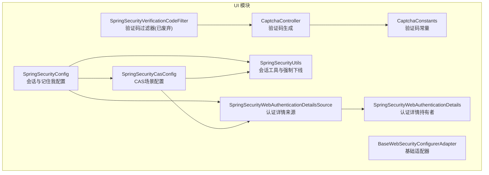
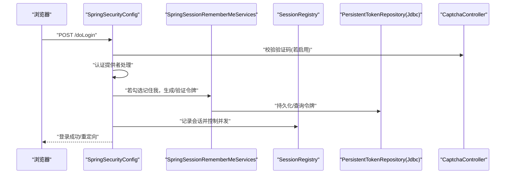
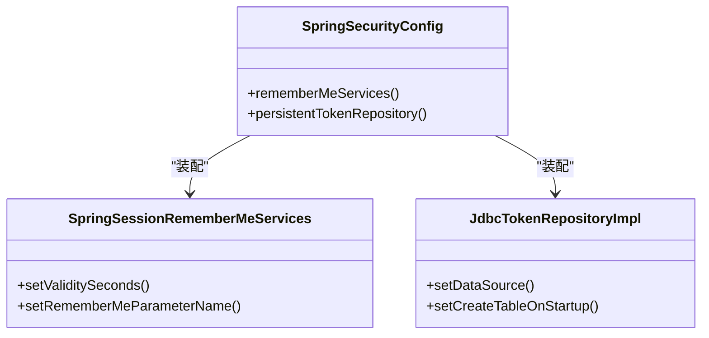
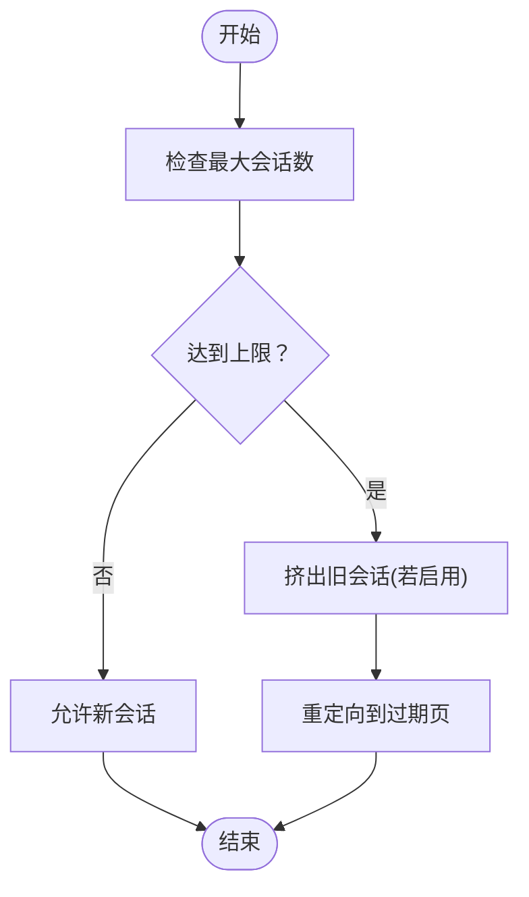
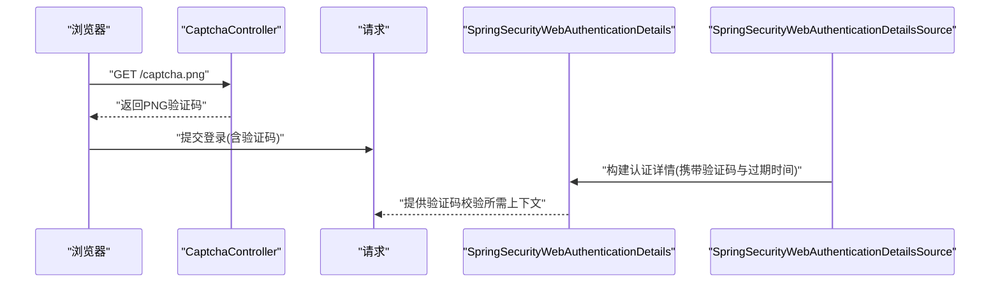
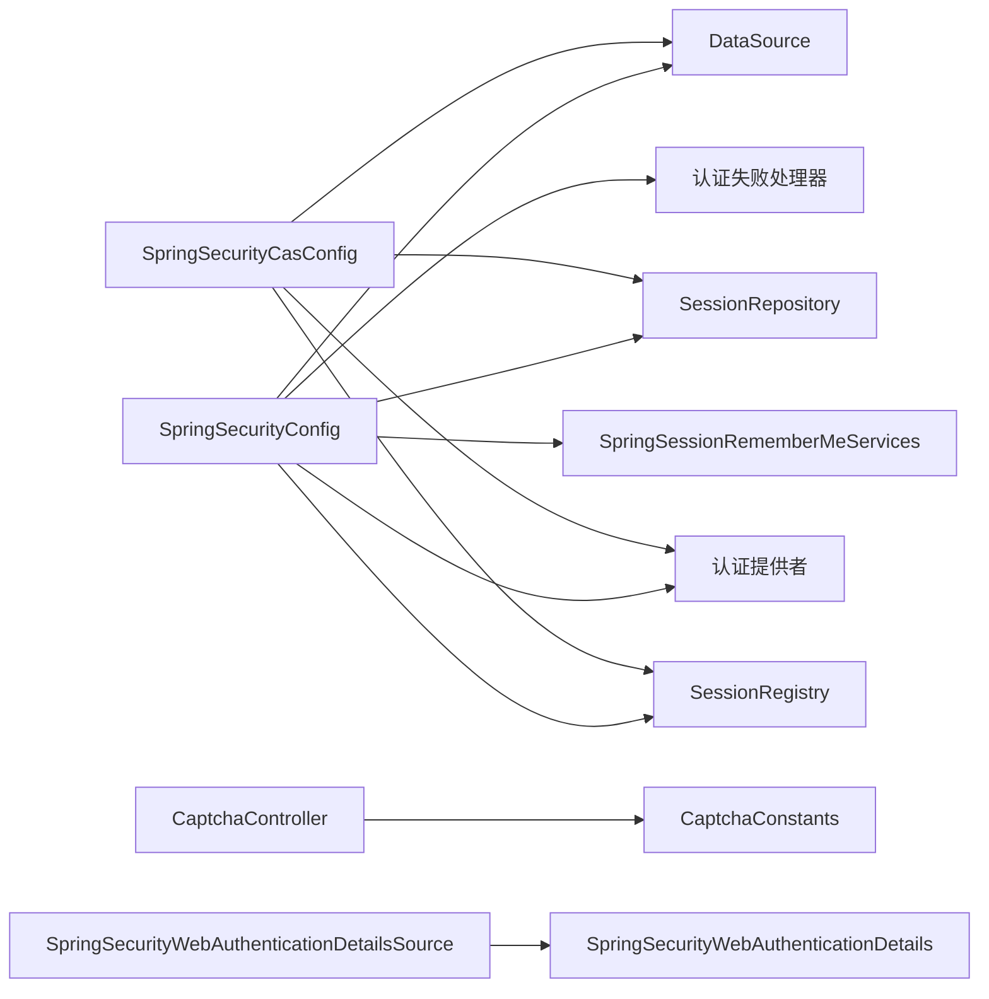

# 会话安全

<cite>
**本文引用的文件**   
- [SpringSecurityConfig.java](file://phoenix-ui/src/main/java/com/gitee/pifeng/monitoring/ui/config/springsecurity/SpringSecurityConfig.java)
- [SpringSecurityCasConfig.java](file://phoenix-ui/src/main/java/com/gitee/pifeng/monitoring/ui/config/springsecurity/SpringSecurityCasConfig.java)
- [BaseWebSecurityConfigurerAdapter.java](file://phoenix-ui/src/main/java/com/gitee/pifeng/monitoring/ui/config/springsecurity/BaseWebSecurityConfigurerAdapter.java)
- [SpringSecurityUtils.java](file://phoenix-ui/src/main/java/com/gitee/pifeng/monitoring/ui/util/SpringSecurityUtils.java)
- [CaptchaConstants.java](file://phoenix-ui/src/main/java/com/gitee/pifeng/monitoring/ui/constant/CaptchaConstants.java)
- [SpringSecurityVerificationCodeFilter.java](file://phoenix-ui/src/main/java/com/gitee/pifeng/monitoring/ui/config/springsecurity/SpringSecurityVerificationCodeFilter.java)
- [CaptchaController.java](file://phoenix-ui/src/main/java/com/gitee/pifeng/monitoring/ui/business/web/controller/CaptchaController.java)
- [SpringSecurityWebAuthenticationDetails.java](file://phoenix-ui/src/main/java/com/gitee/pifeng/monitoring/ui/config/springsecurity/SpringSecurityWebAuthenticationDetails.java)
- [SpringSecurityWebAuthenticationDetailsSource.java](file://phoenix-ui/src/main/java/com/gitee/pifeng/monitoring/ui/config/springsecurity/SpringSecurityWebAuthenticationDetailsSource.java)
</cite>

## 目录
1. [引言](#引言)
2. [项目结构](#项目结构)
3. [核心组件](#核心组件)
4. [架构总览](#架构总览)
5. [详细组件分析](#详细组件分析)
6. [依赖分析](#依赖分析)
7. [性能考虑](#性能考虑)
8. [故障排查指南](#故障排查指南)
9. [结论](#结论)
10. [附录](#附录)

## 引言
本文件聚焦于“会话安全部分”，围绕以下主题展开：SpringSessionRememberMeServices 的记住我机制（会话持久化、令牌生成与验证、会话超时管理、跨设备登录支持）、SessionRegistry 会话注册表（并发会话控制、会话数量限制、会话抢占处理、会话注销）、验证码安全机制（常量、生成算法、验证流程、防暴力破解策略）、会话安全配置（超时、强制下线、会话固定攻击防护、CSRF 防护）以及最佳实践（生命周期管理、会话数据保护、异常处理与监控）。文档以 Spring Session 与 Spring Security 的集成为核心，结合项目实际配置与实现，帮助读者快速理解并落地安全策略。

## 项目结构
本项目采用前后端分离架构，会话安全相关逻辑集中在 UI 模块的 Spring Security 配置与验证码模块中，配合 Spring Session JDBC 实现分布式会话存储与并发控制。

图表来源
- [SpringSecurityConfig.java:112-166](file://phoenix-ui/src/main/java/com/gitee/pifeng/monitoring/ui/config/springsecurity/SpringSecurityConfig.java#L112-L166)
- [SpringSecurityCasConfig.java:42-94](file://phoenix-ui/src/main/java/com/gitee/pifeng/monitoring/ui/config/springsecurity/SpringSecurityCasConfig.java#L42-L94)
- [SpringSecurityUtils.java:83-138](file://phoenix-ui/src/main/java/com/gitee/pifeng/monitoring/ui/util/SpringSecurityUtils.java#L83-L138)
- [CaptchaController.java:46-75](file://phoenix-ui/src/main/java/com/gitee/pifeng/monitoring/ui/business/web/controller/CaptchaController.java#L46-L75)
- [SpringSecurityVerificationCodeFilter.java:26-61](file://phoenix-ui/src/main/java/com/gitee/pifeng/monitoring/ui/config/springsecurity/SpringSecurityVerificationCodeFilter.java#L26-L61)
- [SpringSecurityWebAuthenticationDetailsSource.java:17-26](file://phoenix-ui/src/main/java/com/gitee/pifeng/monitoring/ui/config/springsecurity/SpringSecurityWebAuthenticationDetailsSource.java#L17-L26)
- [SpringSecurityWebAuthenticationDetails.java:20-50](file://phoenix-ui/src/main/java/com/gitee/pifeng/monitoring/ui/config/springsecurity/SpringSecurityWebAuthenticationDetails.java#L20-L50)
- [CaptchaConstants.java:11-23](file://phoenix-ui/src/main/java/com/gitee/pifeng/monitoring/ui/constant/CaptchaConstants.java#L11-L23)
- [BaseWebSecurityConfigurerAdapter.java:13-51](file://phoenix-ui/src/main/java/com/gitee/pifeng/monitoring/ui/config/springsecurity/BaseWebSecurityConfigurerAdapter.java#L13-L51)

章节来源
- [SpringSecurityConfig.java:112-166](file://phoenix-ui/src/main/java/com/gitee/pifeng/monitoring/ui/config/springsecurity/SpringSecurityConfig.java#L112-L166)
- [SpringSecurityCasConfig.java:42-94](file://phoenix-ui/src/main/java/com/gitee/pifeng/monitoring/ui/config/springsecurity/SpringSecurityCasConfig.java#L42-L94)
- [BaseWebSecurityConfigurerAdapter.java:13-51](file://phoenix-ui/src/main/java/com/gitee/pifeng/monitoring/ui/config/springsecurity/BaseWebSecurityConfigurerAdapter.java#L13-L51)

## 核心组件
- SpringSessionRememberMeServices：基于 Spring Session 的记住我服务，支持会话持久化、令牌有效期与参数名配置，并与 JDBC Token Repository 协同实现跨设备登录与会话恢复。
- SessionRegistry：通过 SpringSessionBackedSessionRegistry 与 SessionRepository 集成，实现集群环境下的并发会话控制、会话数量限制与抢占策略。
- 验证码体系：CaptchaController 生成图形验证码；CaptchaConstants 提供常量；SpringSecurityWebAuthenticationDetails 携带验证码信息；SpringSecurityWebAuthenticationDetailsSource 注入认证详情；SpringSecurityVerificationCodeFilter（已废弃）曾用于过滤器阶段校验。
- 会话工具：SpringSecurityUtils 提供当前用户获取、更新与强制下线能力，支持按用户或主体批量失效会话。
- 基础适配器：BaseWebSecurityConfigurerAdapter 统一忽略静态资源与健康端点，简化配置。

章节来源
- [SpringSecurityConfig.java:191-233](file://phoenix-ui/src/main/java/com/gitee/pifeng/monitoring/ui/config/springsecurity/SpringSecurityConfig.java#L191-L233)
- [SpringSecurityUtils.java:83-138](file://phoenix-ui/src/main/java/com/gitee/pifeng/monitoring/ui/util/SpringSecurityUtils.java#L83-L138)
- [CaptchaController.java:46-75](file://phoenix-ui/src/main/java/com/gitee/pifeng/monitoring/ui/business/web/controller/CaptchaController.java#L46-L75)
- [CaptchaConstants.java:11-23](file://phoenix-ui/src/main/java/com/gitee/pifeng/monitoring/ui/constant/CaptchaConstants.java#L11-L23)
- [SpringSecurityWebAuthenticationDetailsSource.java:17-26](file://phoenix-ui/src/main/java/com/gitee/pifeng/monitoring/ui/config/springsecurity/SpringSecurityWebAuthenticationDetailsSource.java#L17-L26)
- [SpringSecurityWebAuthenticationDetails.java:20-50](file://phoenix-ui/src/main/java/com/gitee/pifeng/monitoring/ui/config/springsecurity/SpringSecurityWebAuthenticationDetails.java#L20-L50)
- [SpringSecurityVerificationCodeFilter.java:26-61](file://phoenix-ui/src/main/java/com/gitee/pifeng/monitoring/ui/config/springsecurity/SpringSecurityVerificationCodeFilter.java#L26-L61)
- [BaseWebSecurityConfigurerAdapter.java:13-51](file://phoenix-ui/src/main/java/com/gitee/pifeng/monitoring/ui/config/springsecurity/BaseWebSecurityConfigurerAdapter.java#L13-L51)

## 架构总览
下图展示会话安全关键交互：登录认证、记住我、并发控制与验证码校验的整体流程。

图表来源
- [SpringSecurityConfig.java:112-166](file://phoenix-ui/src/main/java/com/gitee/pifeng/monitoring/ui/config/springsecurity/SpringSecurityConfig.java#L112-L166)
- [SpringSecurityConfig.java:191-233](file://phoenix-ui/src/main/java/com/gitee/pifeng/monitoring/ui/config/springsecurity/SpringSecurityConfig.java#L191-L233)
- [CaptchaController.java:46-75](file://phoenix-ui/src/main/java/com/gitee/pifeng/monitoring/ui/business/web/controller/CaptchaController.java#L46-L75)

## 详细组件分析

### SpringSessionRememberMeServices 与记住我机制
- 会话持久化：通过 JdbcTokenRepositoryImpl 将“记住我”令牌持久化至数据库表 persistent_logins，支持跨设备登录与会话恢复。
- 令牌有效期：默认有效期为 30 天，可通过 validitySeconds 配置调整。
- 参数名：remember-me 参数名可自定义，便于前端勾选与后端识别。
- 与 Spring Session 集成：使用 SpringSessionRememberMeServices，结合 SessionRepository 实现分布式环境下的令牌与会话一致性。

图表来源
- [SpringSecurityConfig.java:191-219](file://phoenix-ui/src/main/java/com/gitee/pifeng/monitoring/ui/config/springsecurity/SpringSecurityConfig.java#L191-L219)

章节来源
- [SpringSecurityConfig.java:191-219](file://phoenix-ui/src/main/java/com/gitee/pifeng/monitoring/ui/config/springsecurity/SpringSecurityConfig.java#L191-L219)

### SessionRegistry 并发会话控制
- 注册表实现：SpringSessionBackedSessionRegistry 与 SessionRepository 集成，统一管理集群环境下的会话。
- 并发策略：maximumSessions(-1) 表示不限制会话数；maxSessionsPreventsLogin(false) 表示达到上限时旧会话被挤出而非阻止新登录；expiredUrl 与 invalidSessionUrl 控制会话过期/超时后的跳转。
- 强制下线：SpringSecurityUtils 提供按用户或主体批量失效会话的能力，适用于风控与运维场景。

图表来源
- [SpringSecurityConfig.java:140-149](file://phoenix-ui/src/main/java/com/gitee/pifeng/monitoring/ui/config/springsecurity/SpringSecurityConfig.java#L140-L149)
- [SpringSecurityUtils.java:124-138](file://phoenix-ui/src/main/java/com/gitee/pifeng/monitoring/ui/util/SpringSecurityUtils.java#L124-L138)

章节来源
- [SpringSecurityConfig.java:140-149](file://phoenix-ui/src/main/java/com/gitee/pifeng/monitoring/ui/config/springsecurity/SpringSecurityConfig.java#L140-L149)
- [SpringSecurityUtils.java:83-138](file://phoenix-ui/src/main/java/com/gitee/pifeng/monitoring/ui/util/SpringSecurityUtils.java#L83-L138)

### 验证码安全机制
- 常量定义：CAPTCHA 与 CAPTCHA_EXPIRE_TIME 作为会话键，确保验证码与过期时间的统一管理。
- 生成算法：CaptchaController 使用 ShearCaptcha 并自定义四则运算生成器，返回 PNG 图片并禁用缓存。
- 验证流程：SpringSecurityWebAuthenticationDetails 持有验证码、保存的验证码对象与过期时间；SpringSecurityWebAuthenticationDetailsSource 注入认证详情；过滤器（已废弃）曾用于登录请求阶段校验，现由自定义认证流程替代。
- 防暴力破解：验证码过期时间短（1 分钟），每次登录后清理旧验证码，降低重放与暴力尝试风险。

图表来源
- [CaptchaController.java:46-75](file://phoenix-ui/src/main/java/com/gitee/pifeng/monitoring/ui/business/web/controller/CaptchaController.java#L46-L75)
- [SpringSecurityWebAuthenticationDetails.java:20-50](file://phoenix-ui/src/main/java/com/gitee/pifeng/monitoring/ui/config/springsecurity/SpringSecurityWebAuthenticationDetails.java#L20-L50)
- [SpringSecurityWebAuthenticationDetailsSource.java:17-26](file://phoenix-ui/src/main/java/com/gitee/pifeng/monitoring/ui/config/springsecurity/SpringSecurityWebAuthenticationDetailsSource.java#L17-L26)
- [CaptchaConstants.java:11-23](file://phoenix-ui/src/main/java/com/gitee/pifeng/monitoring/ui/constant/CaptchaConstants.java#L11-L23)

章节来源
- [CaptchaController.java:46-75](file://phoenix-ui/src/main/java/com/gitee/pifeng/monitoring/ui/business/web/controller/CaptchaController.java#L46-L75)
- [SpringSecurityWebAuthenticationDetails.java:20-50](file://phoenix-ui/src/main/java/com/gitee/pifeng/monitoring/ui/config/springsecurity/SpringSecurityWebAuthenticationDetails.java#L20-L50)
- [SpringSecurityWebAuthenticationDetailsSource.java:17-26](file://phoenix-ui/src/main/java/com/gitee/pifeng/monitoring/ui/config/springsecurity/SpringSecurityWebAuthenticationDetailsSource.java#L17-L26)
- [CaptchaConstants.java:11-23](file://phoenix-ui/src/main/java/com/gitee/pifeng/monitoring/ui/constant/CaptchaConstants.java#L11-L23)
- [SpringSecurityVerificationCodeFilter.java:26-61](file://phoenix-ui/src/main/java/com/gitee/pifeng/monitoring/ui/config/springsecurity/SpringSecurityVerificationCodeFilter.java#L26-L61)

### 会话安全配置要点
- 会话超时与无效跳转：invalidSessionUrl 指向带超时参数的登录页，便于前端提示。
- CSRF 防护：框架默认启用 CSRF，结合隐藏令牌与同源策略抵御跨站请求伪造。
- 会话固定攻击防护：Spring Security 默认启用会话固定攻击防护（Session Fixation Protection），建议保持默认。
- 退出登录：logout 清理会话并删除 SESSION/JSESSIONID/remember-me 等 Cookie，确保彻底登出。

章节来源
- [SpringSecurityConfig.java:140-165](file://phoenix-ui/src/main/java/com/gitee/pifeng/monitoring/ui/config/springsecurity/SpringSecurityConfig.java#L140-L165)

## 依赖分析
- SpringSecurityConfig 依赖 DataSource、SessionRepository、认证提供者与失败处理器，装配 RememberMeServices 与 SessionRegistry。
- SpringSecurityCasConfig 在 CAS 场景下同样装配 RememberMe 与 SessionRegistry，并增加 LogoutFilter。
- BaseWebSecurityConfigurerAdapter 统一忽略静态资源与健康端点，减少安全拦截开销。
- 验证码模块相互协作：CaptchaController 生成验证码并写入会话；认证详情来源注入验证码上下文；过滤器（已废弃）曾参与登录阶段校验。

图表来源
- [SpringSecurityConfig.java:44-51](file://phoenix-ui/src/main/java/com/gitee/pifeng/monitoring/ui/config/springsecurity/SpringSecurityConfig.java#L44-L51)
- [SpringSecurityCasConfig.java:50-57](file://phoenix-ui/src/main/java/com/gitee/pifeng/monitoring/ui/config/springsecurity/SpringSecurityCasConfig.java#L50-L57)
- [CaptchaController.java:46-75](file://phoenix-ui/src/main/java/com/gitee/pifeng/monitoring/ui/business/web/controller/CaptchaController.java#L46-L75)
- [CaptchaConstants.java:11-23](file://phoenix-ui/src/main/java/com/gitee/pifeng/monitoring/ui/constant/CaptchaConstants.java#L11-L23)
- [SpringSecurityWebAuthenticationDetailsSource.java:17-26](file://phoenix-ui/src/main/java/com/gitee/pifeng/monitoring/ui/config/springsecurity/SpringSecurityWebAuthenticationDetailsSource.java#L17-L26)
- [SpringSecurityWebAuthenticationDetails.java:20-50](file://phoenix-ui/src/main/java/com/gitee/pifeng/monitoring/ui/config/springsecurity/SpringSecurityWebAuthenticationDetails.java#L20-L50)

章节来源
- [SpringSecurityConfig.java:44-51](file://phoenix-ui/src/main/java/com/gitee/pifeng/monitoring/ui/config/springsecurity/SpringSecurityConfig.java#L44-L51)
- [SpringSecurityCasConfig.java:50-57](file://phoenix-ui/src/main/java/com/gitee/pifeng/monitoring/ui/config/springsecurity/SpringSecurityCasConfig.java#L50-L57)
- [BaseWebSecurityConfigurerAdapter.java:13-51](file://phoenix-ui/src/main/java/com/gitee/pifeng/monitoring/ui/config/springsecurity/BaseWebSecurityConfigurerAdapter.java#L13-L51)

## 性能考虑
- 会话存储：使用 Spring Session JDBC 存储，适合多实例部署；注意数据库连接池与索引优化，避免高并发下的锁争用。
- 记住我令牌：JDBC 持久化带来额外数据库 IO，建议合理设置有效期与清理策略，避免表膨胀。
- 验证码：生成与写入会话为轻量操作，但需避免频繁刷新导致的 GC 压力；建议前端懒加载与缓存策略。
- 并发控制：maximumSessions(-1) 不限制会话数，可能带来资源占用；如需限制，应结合业务场景调优并设置合理的抢占策略。

## 故障排查指南
- 登录验证码错误
  - 现象：登录失败且提示验证码错误。
  - 排查：确认 /captcha.png 是否正确生成；检查会话中 CAPTCHA 与 CAPTCHA_EXPIRE_TIME 是否存在且未过期；核对验证码输入是否匹配。
  - 参考路径：[验证码验证逻辑:72-97](file://phoenix-ui/src/main/java/com/gitee/pifeng/monitoring/ui/config/springsecurity/SpringSecurityVerificationCodeFilter.java#L72-L97)，[验证码生成与写入会话:46-75](file://phoenix-ui/src/main/java/com/gitee/pifeng/monitoring/ui/business/web/controller/CaptchaController.java#L46-L75)
- 记住我无法生效
  - 现象：勾选“记住我”后重启浏览器仍需登录。
  - 排查：确认 remember-me 参数名一致；检查 persistent_logins 表是否存在且可读写；核对 validitySeconds 设置。
  - 参考路径：[记住我配置:191-198](file://phoenix-ui/src/main/java/com/gitee/pifeng/monitoring/ui/config/springsecurity/SpringSecurityConfig.java#L191-L198)，[持久化仓库:211-219](file://phoenix-ui/src/main/java/com/gitee/pifeng/monitoring/ui/config/springsecurity/SpringSecurityConfig.java#L211-L219)
- 会话被挤出或无法登录
  - 现象：达到最大会话数后新登录被拒绝或旧会话被挤出。
  - 排查：检查 maximumSessions 与 maxSessionsPreventsLogin 配置；确认 expiredUrl 是否正确；必要时调低并发阈值或延长有效期。
  - 参考路径：[并发控制配置:140-149](file://phoenix-ui/src/main/java/com/gitee/pifeng/monitoring/ui/config/springsecurity/SpringSecurityConfig.java#L140-L149)
- 强制下线无效
  - 现象：调用强制下线接口后用户仍在其他设备登录。
  - 排查：确认传入的 principal 或用户 ID 正确；检查 SessionRegistry 中是否存在对应会话；确保 expiredUrl 对应的页面能正确刷新。
  - 参考路径：[强制下线工具:124-138](file://phoenix-ui/src/main/java/com/gitee/pifeng/monitoring/ui/util/SpringSecurityUtils.java#L124-L138)

章节来源
- [SpringSecurityVerificationCodeFilter.java:72-97](file://phoenix-ui/src/main/java/com/gitee/pifeng/monitoring/ui/config/springsecurity/SpringSecurityVerificationCodeFilter.java#L72-L97)
- [CaptchaController.java:46-75](file://phoenix-ui/src/main/java/com/gitee/pifeng/monitoring/ui/business/web/controller/CaptchaController.java#L46-L75)
- [SpringSecurityConfig.java:191-198](file://phoenix-ui/src/main/java/com/gitee/pifeng/monitoring/ui/config/springsecurity/SpringSecurityConfig.java#L191-L198)
- [SpringSecurityConfig.java:211-219](file://phoenix-ui/src/main/java/com/gitee/pifeng/monitoring/ui/config/springsecurity/SpringSecurityConfig.java#L211-L219)
- [SpringSecurityConfig.java:140-149](file://phoenix-ui/src/main/java/com/gitee/pifeng/monitoring/ui/config/springsecurity/SpringSecurityConfig.java#L140-L149)
- [SpringSecurityUtils.java:124-138](file://phoenix-ui/src/main/java/com/gitee/pifeng/monitoring/ui/util/SpringSecurityUtils.java#L124-L138)

## 结论
本项目通过 Spring Session 与 Spring Security 的深度整合，实现了可靠的会话安全体系：记住我令牌持久化与跨设备登录、基于 SessionRegistry 的并发控制与强制下线、验证码生成与校验的防暴力破解策略，以及默认启用的 CSRF 与会话固定攻击防护。建议在生产环境中根据业务规模调整并发阈值、有效期与清理策略，并持续监控会话与令牌状态，确保安全与性能的平衡。

## 附录
- 最佳实践清单
  - 会话生命周期：合理设置会话超时与记住我有效期，定期清理过期令牌与会话。
  - 会话数据保护：敏感会话数据避免明文存储，必要时进行加密或脱敏。
  - 异常处理：完善认证失败与验证码异常处理，提供友好的错误提示与日志追踪。
  - 监控与审计：记录会话创建、失效、挤出与强制下线事件，建立告警与回溯机制。
  - 配置建议：默认保留 CSRF 与会话固定防护；根据业务需要启用或调整并发策略；在 CAS 场景下确保 LogoutFilter 与会话注册表协同工作。