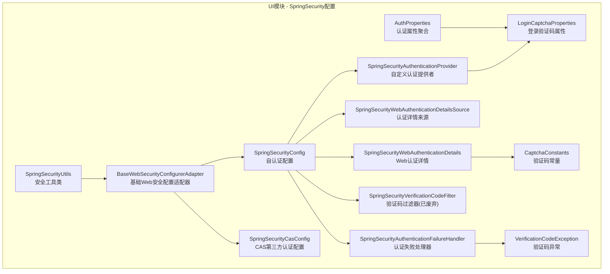
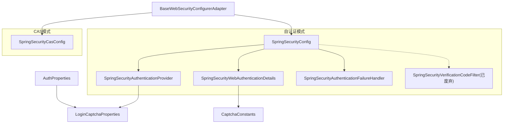
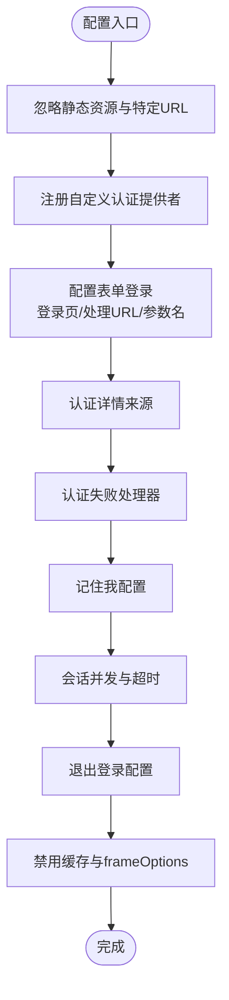
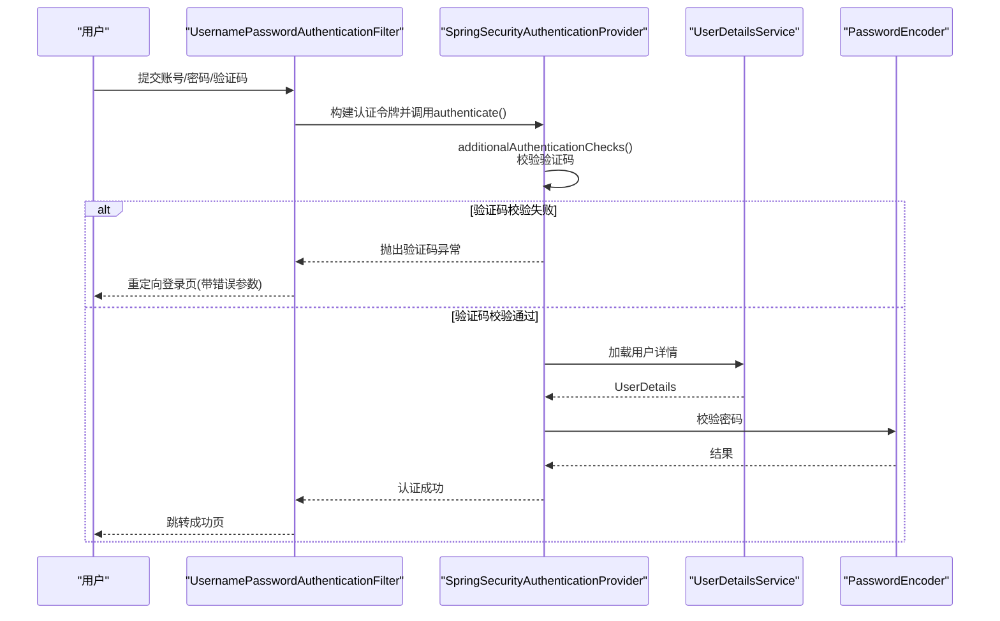
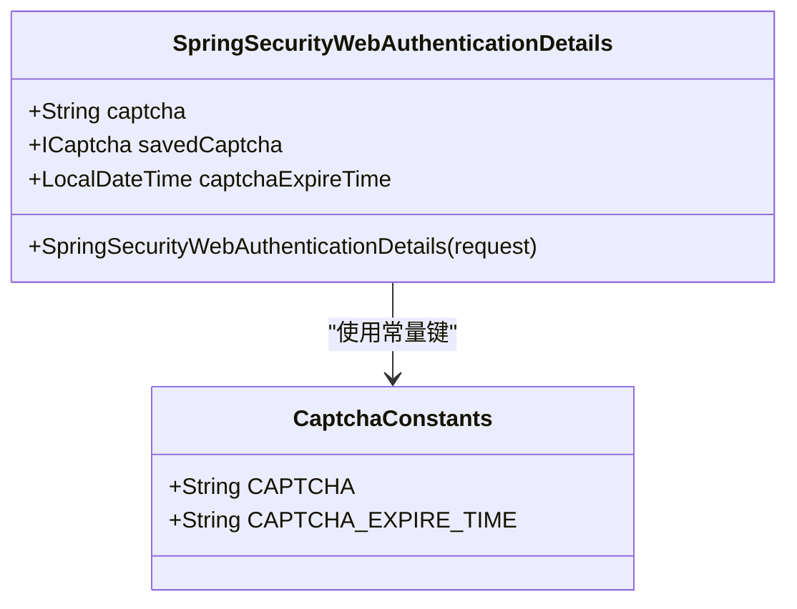
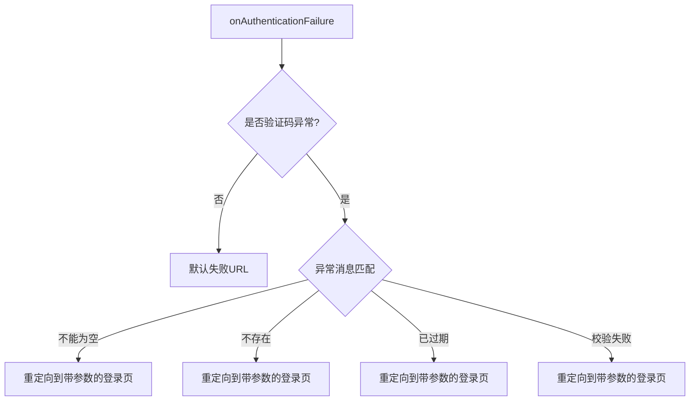
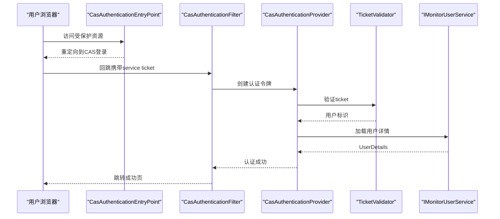
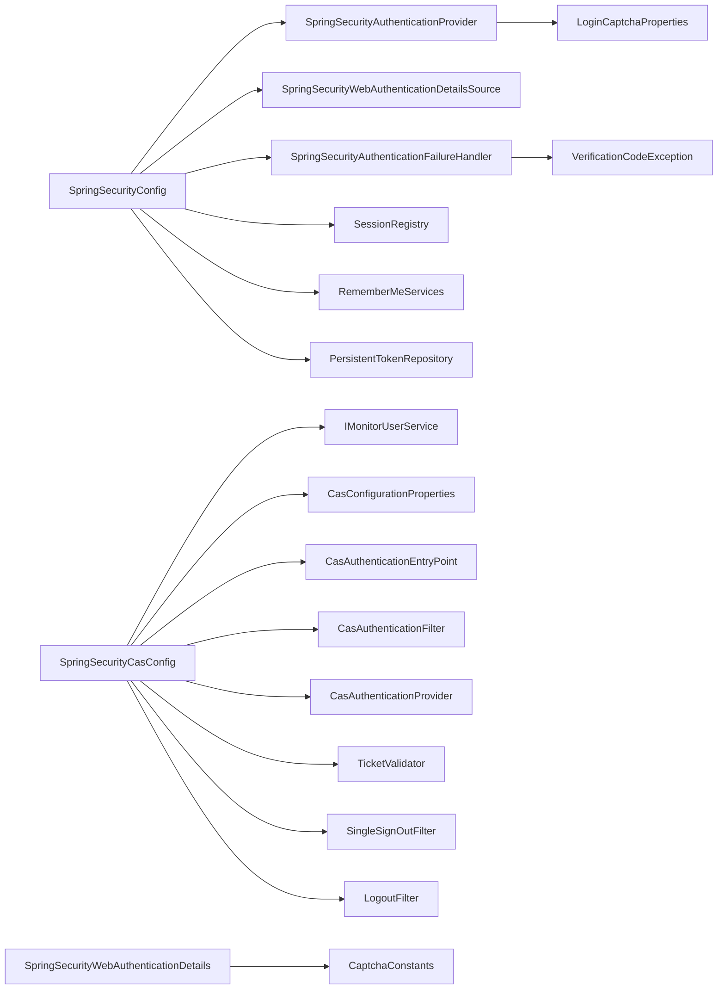

# 安全认证与权限控制

<cite>
**本文引用的文件**
- [SpringSecurityConfig.java](file://phoenix-ui/src/main/java/com/gitee/pifeng/monitoring/ui/config/springsecurity/SpringSecurityConfig.java)
- [SpringSecurityAuthenticationProvider.java](file://phoenix-ui/src/main/java/com/gitee/pifeng/monitoring/ui/config/springsecurity/SpringSecurityAuthenticationProvider.java)
- [SpringSecurityWebAuthenticationDetails.java](file://phoenix-ui/src/main/java/com/gitee/pifeng/monitoring/ui/config/springsecurity/SpringSecurityWebAuthenticationDetails.java)
- [SpringSecurityWebAuthenticationDetailsSource.java](file://phoenix-ui/src/main/java/com/gitee/pifeng/monitoring/ui/config/springsecurity/SpringSecurityWebAuthenticationDetailsSource.java)
- [SpringSecurityAuthenticationFailureHandler.java](file://phoenix-ui/src/main/java/com/gitee/pifeng/monitoring/ui/config/springsecurity/SpringSecurityAuthenticationFailureHandler.java)
- [SpringSecurityVerificationCodeFilter.java](file://phoenix-ui/src/main/java/com/gitee/pifeng/monitoring/ui/config/springsecurity/SpringSecurityVerificationCodeFilter.java)
- [SpringSecurityCasConfig.java](file://phoenix-ui/src/main/java/com/gitee/pifeng/monitoring/ui/config/springsecurity/SpringSecurityCasConfig.java)
- [BaseWebSecurityConfigurerAdapter.java](file://phoenix-ui/src/main/java/com/gitee/pifeng/monitoring/ui/config/springsecurity/BaseWebSecurityConfigurerAdapter.java)
- [AuthProperties.java](file://phoenix-ui/src/main/java/com/gitee/pifeng/monitoring/ui/property/auth/AuthProperties.java)
- [LoginCaptchaProperties.java](file://phoenix-ui/src/main/java/com/gitee/pifeng/monitoring/ui/property/auth/selfauth/LoginCaptchaProperties.java)
- [CaptchaConstants.java](file://phoenix-ui/src/main/java/com/gitee/pifeng/monitoring/ui/constant/CaptchaConstants.java)
- [VerificationCodeException.java](file://phoenix-ui/src/main/java/com/gitee/pifeng/monitoring/ui/exception/VerificationCodeException.java)
- [SpringSecurityUtils.java](file://phoenix-ui/src/main/java/com/gitee/pifeng/monitoring/ui/util/SpringSecurityUtils.java)
</cite>

## 目录
1. [简介](#简介)
2. [项目结构](#项目结构)
3. [核心组件](#核心组件)
4. [架构总览](#架构总览)
5. [详细组件分析](#详细组件分析)
6. [依赖分析](#依赖分析)
7. [性能考虑](#性能考虑)
8. [故障排查指南](#故障排查指南)
9. [结论](#结论)
10. [附录](#附录)

## 简介
本技术文档聚焦于Phoenix项目中“安全认证与权限控制”模块，围绕Spring Security在UI模块中的配置与扩展展开，系统性阐述以下内容：
- SpringSecurityConfig配置类的设计：认证管理器、密码编码器、会话管理策略、记住我、忽略资源与URL等。
- SpringSecurityAuthenticationProvider认证提供者的实现机制：用户名密码验证、账户状态检查、权限授予、验证码校验集成。
- SpringSecurityWebAuthenticationDetails在Web请求中的作用：用户详情获取、认证信息传递、安全上下文管理。
- AuthProperties认证属性配置：自定义认证、第三方认证（CAS）与验证码配置。
- 安全最佳实践：密码安全策略、会话超时管理、CSRF/XSS防护建议。

## 项目结构
该模块位于UI工程的springsecurity配置包内，采用条件化配置支持“自认证”和“CAS第三方认证”，并通过统一的基类适配器复用忽略资源与URL规则。

图表来源
- [BaseWebSecurityConfigurerAdapter.java:1-52](file://phoenix-ui/src/main/java/com/gitee/pifeng/monitoring/ui/config/springsecurity/BaseWebSecurityConfigurerAdapter.java#L1-L52)
- [SpringSecurityConfig.java:1-236](file://phoenix-ui/src/main/java/com/gitee/pifeng/monitoring/ui/config/springsecurity/SpringSecurityConfig.java#L1-L236)
- [SpringSecurityCasConfig.java:1-318](file://phoenix-ui/src/main/java/com/gitee/pifeng/monitoring/ui/config/springsecurity/SpringSecurityCasConfig.java#L1-L318)
- [SpringSecurityAuthenticationProvider.java:1-94](file://phoenix-ui/src/main/java/com/gitee/pifeng/monitoring/ui/config/springsecurity/SpringSecurityAuthenticationProvider.java#L1-L94)
- [SpringSecurityWebAuthenticationDetails.java:1-65](file://phoenix-ui/src/main/java/com/gitee/pifeng/monitoring/ui/config/springsecurity/SpringSecurityWebAuthenticationDetails.java#L1-L65)
- [SpringSecurityWebAuthenticationDetailsSource.java](file://phoenix-ui/src/main/java/com/gitee/pifeng/monitoring/ui/config/springsecurity/SpringSecurityWebAuthenticationDetailsSource.java)
- [SpringSecurityAuthenticationFailureHandler.java:1-67](file://phoenix-ui/src/main/java/com/gitee/pifeng/monitoring/ui/config/springsecurity/SpringSecurityAuthenticationFailureHandler.java#L1-L67)
- [SpringSecurityVerificationCodeFilter.java:1-100](file://phoenix-ui/src/main/java/com/gitee/pifeng/monitoring/ui/config/springsecurity/SpringSecurityVerificationCodeFilter.java#L1-L100)
- [AuthProperties.java:1-27](file://phoenix-ui/src/main/java/com/gitee/pifeng/monitoring/ui/property/auth/AuthProperties.java#L1-L27)
- [LoginCaptchaProperties.java:1-24](file://phoenix-ui/src/main/java/com/gitee/pifeng/monitoring/ui/property/auth/selfauth/LoginCaptchaProperties.java#L1-L24)
- [CaptchaConstants.java:1-24](file://phoenix-ui/src/main/java/com/gitee/pifeng/monitoring/ui/constant/CaptchaConstants.java#L1-L24)
- [VerificationCodeException.java:1-64](file://phoenix-ui/src/main/java/com/gitee/pifeng/monitoring/ui/exception/VerificationCodeException.java#L1-L64)
- [SpringSecurityUtils.java:1-141](file://phoenix-ui/src/main/java/com/gitee/pifeng/monitoring/ui/util/SpringSecurityUtils.java#L1-L141)

章节来源
- [SpringSecurityConfig.java:1-236](file://phoenix-ui/src/main/java/com/gitee/pifeng/monitoring/ui/config/springsecurity/SpringSecurityConfig.java#L1-L236)
- [SpringSecurityCasConfig.java:1-318](file://phoenix-ui/src/main/java/com/gitee/pifeng/monitoring/ui/config/springsecurity/SpringSecurityCasConfig.java#L1-L318)
- [BaseWebSecurityConfigurerAdapter.java:1-52](file://phoenix-ui/src/main/java/com/gitee/pifeng/monitoring/ui/config/springsecurity/BaseWebSecurityConfigurerAdapter.java#L1-L52)

## 核心组件
- 自定义认证配置类：负责忽略静态资源与特定URL、配置表单登录、验证码过滤器位置、记住我、会话并发与超时、退出登录、头禁用缓存与frameOptions等。
- 自定义认证提供者：继承DaoAuthenticationProvider，在additionalAuthenticationChecks中集成验证码校验逻辑，并委托父类完成密码校验。
- Web认证详情对象：从HTTP请求中提取验证码参数、从Session读取保存的验证码与过期时间，并在使用后清理Session，确保一次性使用。
- 认证失败处理器：根据验证码异常类型映射到登录页的不同错误参数，便于前端提示。
- 认证属性配置：聚合认证类型、自认证与第三方认证配置，支持CAS等扩展。
- 安全工具类：提供获取当前认证主体、更新安全上下文、按用户或主体强制下线等能力。

章节来源
- [SpringSecurityConfig.java:80-166](file://phoenix-ui/src/main/java/com/gitee/pifeng/monitoring/ui/config/springsecurity/SpringSecurityConfig.java#L80-L166)
- [SpringSecurityAuthenticationProvider.java:63-91](file://phoenix-ui/src/main/java/com/gitee/pifeng/monitoring/ui/config/springsecurity/SpringSecurityAuthenticationProvider.java#L63-L91)
- [SpringSecurityWebAuthenticationDetails.java:49-62](file://phoenix-ui/src/main/java/com/gitee/pifeng/monitoring/ui/config/springsecurity/SpringSecurityWebAuthenticationDetails.java#L49-L62)
- [SpringSecurityAuthenticationFailureHandler.java:38-64](file://phoenix-ui/src/main/java/com/gitee/pifeng/monitoring/ui/config/springsecurity/SpringSecurityAuthenticationFailureHandler.java#L38-L64)
- [AuthProperties.java:17-27](file://phoenix-ui/src/main/java/com/gitee/pifeng/monitoring/ui/property/auth/AuthProperties.java#L17-L27)
- [SpringSecurityUtils.java:47-81](file://phoenix-ui/src/main/java/com/gitee/pifeng/monitoring/ui/util/SpringSecurityUtils.java#L47-L81)

## 架构总览
下图展示了自认证与CAS两种模式的配置类如何基于同一基类适配器，分别承担Web安全配置、认证提供者、会话与记住我、以及异常与过滤器处理。

图表来源
- [BaseWebSecurityConfigurerAdapter.java:1-52](file://phoenix-ui/src/main/java/com/gitee/pifeng/monitoring/ui/config/springsecurity/BaseWebSecurityConfigurerAdapter.java#L1-L52)
- [SpringSecurityConfig.java:1-236](file://phoenix-ui/src/main/java/com/gitee/pifeng/monitoring/ui/config/springsecurity/SpringSecurityConfig.java#L1-L236)
- [SpringSecurityCasConfig.java:1-318](file://phoenix-ui/src/main/java/com/gitee/pifeng/monitoring/ui/config/springsecurity/SpringSecurityCasConfig.java#L1-L318)
- [SpringSecurityAuthenticationProvider.java:1-94](file://phoenix-ui/src/main/java/com/gitee/pifeng/monitoring/ui/config/springsecurity/SpringSecurityAuthenticationProvider.java#L1-L94)
- [SpringSecurityWebAuthenticationDetails.java:1-65](file://phoenix-ui/src/main/java/com/gitee/pifeng/monitoring/ui/config/springsecurity/SpringSecurityWebAuthenticationDetails.java#L1-L65)
- [SpringSecurityAuthenticationFailureHandler.java:1-67](file://phoenix-ui/src/main/java/com/gitee/pifeng/monitoring/ui/config/springsecurity/SpringSecurityAuthenticationFailureHandler.java#L1-L67)
- [SpringSecurityVerificationCodeFilter.java:1-100](file://phoenix-ui/src/main/java/com/gitee/pifeng/monitoring/ui/config/springsecurity/SpringSecurityVerificationCodeFilter.java#L1-L100)
- [AuthProperties.java:1-27](file://phoenix-ui/src/main/java/com/gitee/pifeng/monitoring/ui/property/auth/AuthProperties.java#L1-L27)
- [LoginCaptchaProperties.java:1-24](file://phoenix-ui/src/main/java/com/gitee/pifeng/monitoring/ui/property/auth/selfauth/LoginCaptchaProperties.java#L1-L24)
- [CaptchaConstants.java:1-24](file://phoenix-ui/src/main/java/com/gitee/pifeng/monitoring/ui/constant/CaptchaConstants.java#L1-L24)

## 详细组件分析

### SpringSecurityConfig：自认证配置类
- 忽略资源与URL：通过基类适配器提供的静态数组忽略静态资源与健康端点等。
- 认证提供者：注册自定义认证提供者，替代默认Provider。
- 表单登录：指定登录页、登录处理URL、用户名/密码参数名、认证详情来源、失败处理器、成功默认跳转。
- 验证码：注释中保留了将验证码过滤器插入UsernamePasswordAuthenticationFilter之前的配置点位，当前通过自定义Provider实现。
- 记住我：使用SpringSessionRememberMeServices，有效期约一个月。
- 会话管理：无效会话跳转、最大并发-1（不限制）、过期跳转、SessionRegistry由Spring Session提供。
- 退出登录：清理会话与Cookie、跳转至登出成功页。
- 头部策略：禁用缓存与frameOptions，允许嵌入iframe。

图表来源
- [SpringSecurityConfig.java:80-166](file://phoenix-ui/src/main/java/com/gitee/pifeng/monitoring/ui/config/springsecurity/SpringSecurityConfig.java#L80-L166)

章节来源
- [SpringSecurityConfig.java:80-166](file://phoenix-ui/src/main/java/com/gitee/pifeng/monitoring/ui/config/springsecurity/SpringSecurityConfig.java#L80-L166)

### SpringSecurityAuthenticationProvider：认证提供者实现
- 继承DaoAuthenticationProvider，使用UserDetailsService与PasswordEncoder完成标准认证流程。
- 在additionalAuthenticationChecks中集成验证码校验：
  - 从认证Details中读取前端传参验证码、Session保存的验证码与过期时间。
  - 校验空值、存在性、过期与匹配，失败则抛出验证码异常。
  - 成功后调用父类完成密码校验。
- 与登录验证码属性联动，支持开关与默认启用。

图表来源
- [SpringSecurityAuthenticationProvider.java:63-91](file://phoenix-ui/src/main/java/com/gitee/pifeng/monitoring/ui/config/springsecurity/SpringSecurityAuthenticationProvider.java#L63-L91)
- [SpringSecurityWebAuthenticationDetails.java:49-62](file://phoenix-ui/src/main/java/com/gitee/pifeng/monitoring/ui/config/springsecurity/SpringSecurityWebAuthenticationDetails.java#L49-L62)
- [VerificationCodeException.java:15-64](file://phoenix-ui/src/main/java/com/gitee/pifeng/monitoring/ui/exception/VerificationCodeException.java#L15-L64)

章节来源
- [SpringSecurityAuthenticationProvider.java:48-91](file://phoenix-ui/src/main/java/com/gitee/pifeng/monitoring/ui/config/springsecurity/SpringSecurityAuthenticationProvider.java#L48-L91)
- [LoginCaptchaProperties.java:14-24](file://phoenix-ui/src/main/java/com/gitee/pifeng/monitoring/ui/property/auth/selfauth/LoginCaptchaProperties.java#L14-L24)

### SpringSecurityWebAuthenticationDetails：Web认证详情
- 从请求参数读取验证码，从Session读取保存的验证码与过期时间。
- 使用后立即清理Session中的验证码与过期时间键，确保一次性使用。
- 作为认证Details传递给Provider，供additionalAuthenticationChecks使用。

图表来源
- [SpringSecurityWebAuthenticationDetails.java:21-62](file://phoenix-ui/src/main/java/com/gitee/pifeng/monitoring/ui/config/springsecurity/SpringSecurityWebAuthenticationDetails.java#L21-L62)
- [CaptchaConstants.java:11-24](file://phoenix-ui/src/main/java/com/gitee/pifeng/monitoring/ui/constant/CaptchaConstants.java#L11-L24)

章节来源
- [SpringSecurityWebAuthenticationDetails.java:49-62](file://phoenix-ui/src/main/java/com/gitee/pifeng/monitoring/ui/config/springsecurity/SpringSecurityWebAuthenticationDetails.java#L49-L62)

### SpringSecurityAuthenticationFailureHandler：认证失败处理器
- 继承SimpleUrlAuthenticationFailureHandler，根据验证码异常枚举映射到登录页不同查询参数，便于前端展示对应错误文案。

图表来源
- [SpringSecurityAuthenticationFailureHandler.java:38-64](file://phoenix-ui/src/main/java/com/gitee/pifeng/monitoring/ui/config/springsecurity/SpringSecurityAuthenticationFailureHandler.java#L38-L64)
- [VerificationCodeException.java:35-61](file://phoenix-ui/src/main/java/com/gitee/pifeng/monitoring/ui/exception/VerificationCodeException.java#L35-L61)

章节来源
- [SpringSecurityAuthenticationFailureHandler.java:38-64](file://phoenix-ui/src/main/java/com/gitee/pifeng/monitoring/ui/config/springsecurity/SpringSecurityAuthenticationFailureHandler.java#L38-L64)

### SpringSecurityVerificationCodeFilter：验证码过滤器（已废弃）
- 曾作为独立过滤器在登录请求上校验验证码，现已由自定义Provider接管，保留注释说明与实现逻辑。

章节来源
- [SpringSecurityVerificationCodeFilter.java:26-99](file://phoenix-ui/src/main/java/com/gitee/pifeng/monitoring/ui/config/springsecurity/SpringSecurityVerificationCodeFilter.java#L26-L99)

### SpringSecurityCasConfig：CAS第三方认证配置
- 基于CAS协议的认证入口、客户端信息、认证过滤器、认证提供者、票据验证器、单点登出与单点注销过滤器。
- 与自认证配置共享基类适配器，统一忽略资源与URL规则。
- 支持CAS与CAS3两种验证器类型选择。

图表来源
- [SpringSecurityCasConfig.java:114-143](file://phoenix-ui/src/main/java/com/gitee/pifeng/monitoring/ui/config/springsecurity/SpringSecurityCasConfig.java#L114-L143)
- [SpringSecurityCasConfig.java:192-222](file://phoenix-ui/src/main/java/com/gitee/pifeng/monitoring/ui/config/springsecurity/SpringSecurityCasConfig.java#L192-L222)

章节来源
- [SpringSecurityCasConfig.java:48-318](file://phoenix-ui/src/main/java/com/gitee/pifeng/monitoring/ui/config/springsecurity/SpringSecurityCasConfig.java#L48-L318)

### BaseWebSecurityConfigurerAdapter：基础适配器
- 提供忽略URL与静态资源的常量数组，供自认证与CAS配置类复用。

章节来源
- [BaseWebSecurityConfigurerAdapter.java:13-51](file://phoenix-ui/src/main/java/com/gitee/pifeng/monitoring/ui/config/springsecurity/BaseWebSecurityConfigurerAdapter.java#L13-L51)

### AuthProperties与登录验证码属性
- AuthProperties聚合认证类型与自认证、第三方认证子属性，支持通过配置切换认证模式。
- LoginCaptchaProperties控制登录验证码开关，默认启用。

章节来源
- [AuthProperties.java:17-27](file://phoenix-ui/src/main/java/com/gitee/pifeng/monitoring/ui/property/auth/AuthProperties.java#L17-L27)
- [LoginCaptchaProperties.java:14-24](file://phoenix-ui/src/main/java/com/gitee/pifeng/monitoring/ui/property/auth/selfauth/LoginCaptchaProperties.java#L14-L24)

### SpringSecurityUtils：安全上下文工具
- 获取当前认证主体、当前用户、更新安全上下文。
- 提供按用户ID或主体集合强制下线的能力（基于SessionRegistry）。

章节来源
- [SpringSecurityUtils.java:47-141](file://phoenix-ui/src/main/java/com/gitee/pifeng/monitoring/ui/util/SpringSecurityUtils.java#L47-L141)

## 依赖分析
- 自认证配置类依赖：
  - 自定义认证提供者、Web认证详情来源、认证失败处理器、会话注册表、记住我服务、持久化Token仓库。
- CAS配置类依赖：
  - 用户服务实现、CAS配置属性、CAS认证入口、认证过滤器、认证提供者、票据验证器、单点登出/注销过滤器。
- 公共依赖：
  - 基类适配器统一忽略资源与URL；验证码常量与异常类型贯穿Provider与失败处理器。

图表来源
- [SpringSecurityConfig.java:1-236](file://phoenix-ui/src/main/java/com/gitee/pifeng/monitoring/ui/config/springsecurity/SpringSecurityConfig.java#L1-L236)
- [SpringSecurityCasConfig.java:1-318](file://phoenix-ui/src/main/java/com/gitee/pifeng/monitoring/ui/config/springsecurity/SpringSecurityCasConfig.java#L1-L318)
- [SpringSecurityAuthenticationProvider.java:1-94](file://phoenix-ui/src/main/java/com/gitee/pifeng/monitoring/ui/config/springsecurity/SpringSecurityAuthenticationProvider.java#L1-L94)
- [SpringSecurityWebAuthenticationDetails.java:1-65](file://phoenix-ui/src/main/java/com/gitee/pifeng/monitoring/ui/config/springsecurity/SpringSecurityWebAuthenticationDetails.java#L1-L65)
- [SpringSecurityAuthenticationFailureHandler.java:1-67](file://phoenix-ui/src/main/java/com/gitee/pifeng/monitoring/ui/config/springsecurity/SpringSecurityAuthenticationFailureHandler.java#L1-L67)
- [LoginCaptchaProperties.java:1-24](file://phoenix-ui/src/main/java/com/gitee/pifeng/monitoring/ui/property/auth/selfauth/LoginCaptchaProperties.java#L1-L24)
- [CaptchaConstants.java:1-24](file://phoenix-ui/src/main/java/com/gitee/pifeng/monitoring/ui/constant/CaptchaConstants.java#L1-L24)
- [VerificationCodeException.java:1-64](file://phoenix-ui/src/main/java/com/gitee/pifeng/monitoring/ui/exception/VerificationCodeException.java#L1-L64)

章节来源
- [SpringSecurityConfig.java:44-51](file://phoenix-ui/src/main/java/com/gitee/pifeng/monitoring/ui/config/springsecurity/SpringSecurityConfig.java#L44-L51)
- [SpringSecurityCasConfig.java:50-69](file://phoenix-ui/src/main/java/com/gitee/pifeng/monitoring/ui/config/springsecurity/SpringSecurityCasConfig.java#L50-L69)

## 性能考虑
- 密码编码器：采用BCrypt，安全性高但计算成本较高，建议在生产环境保持默认强度，避免过度降低强度影响安全。
- 会话并发：当前配置最大并发-1（不限制），在高并发场景下应结合业务需求设置合理上限并开启“阻止新登录”策略，防止会话劫持风险。
- 记住我：默认有效期约一个月，建议结合业务安全策略调整有效期并定期轮换密钥。
- 验证码：一次性使用并清理Session，避免重复利用导致的安全问题；同时减少不必要的Session存储压力。
- 过滤器链：CAS模式下新增多个过滤器，注意与自认证模式的差异，避免重复过滤或顺序不当引发性能与安全问题。

## 故障排查指南
- 登录失败无提示：
  - 检查认证失败处理器是否正确映射验证码异常到登录页参数。
  - 确认验证码开关与Session中的验证码键是否存在且未过期。
- 验证码异常枚举映射：
  - 空值、不存在、过期、校验失败分别对应不同错误参数，核对异常消息与映射逻辑。
- 会话并发与超时：
  - 若出现“会话已过期”跳转，检查会话注册表与最大并发配置。
- CAS认证异常：
  - 核对CAS服务端URL、客户端服务URL、票据验证器类型与密钥配置。

章节来源
- [SpringSecurityAuthenticationFailureHandler.java:38-64](file://phoenix-ui/src/main/java/com/gitee/pifeng/monitoring/ui/config/springsecurity/SpringSecurityAuthenticationFailureHandler.java#L38-L64)
- [VerificationCodeException.java:35-61](file://phoenix-ui/src/main/java/com/gitee/pifeng/monitoring/ui/exception/VerificationCodeException.java#L35-L61)
- [SpringSecurityCasConfig.java:234-248](file://phoenix-ui/src/main/java/com/gitee/pifeng/monitoring/ui/config/springsecurity/SpringSecurityCasConfig.java#L234-L248)

## 结论
本模块通过“自认证”与“CAS第三方认证”两条路径，结合自定义认证提供者、Web认证详情、认证失败处理器与会话管理策略，构建了可扩展、可配置的安全体系。验证码校验与失败映射提升了登录阶段的安全性与用户体验。建议在生产环境中进一步完善CSRF/XSS防护、审计日志与权限细化策略，持续提升整体安全水平。

## 附录
- 安全最佳实践建议（通用指导，非代码实现）：
  - 密码安全策略：强制复杂度、定期更换、禁止历史密码、最小长度与字符集要求。
  - 会话超时管理：短超时+自动续期、并发登录限制、强制下线接口。
  - CSRF防护：启用Spring Security默认CSRF、同源策略、隐藏字段与校验。
  - XSS防护：输出编码、CSP策略、输入校验与白名单。
  - 审计与监控：登录/操作日志、异常告警、行为分析。