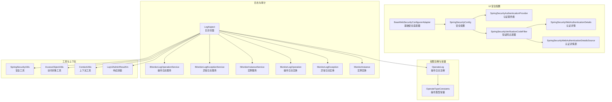
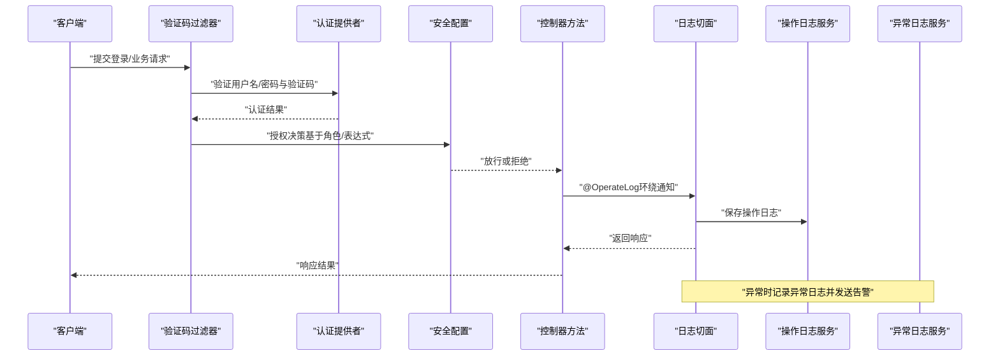
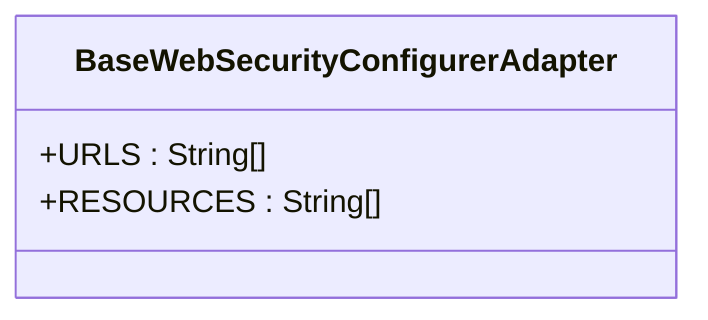
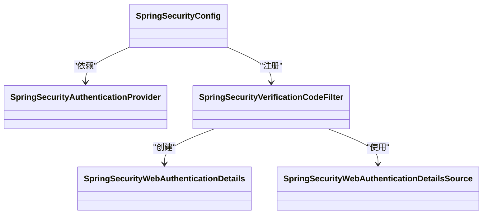
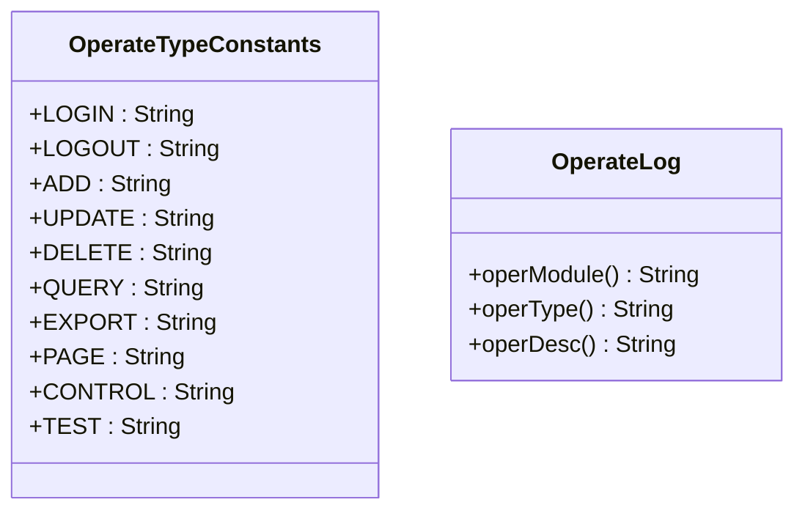
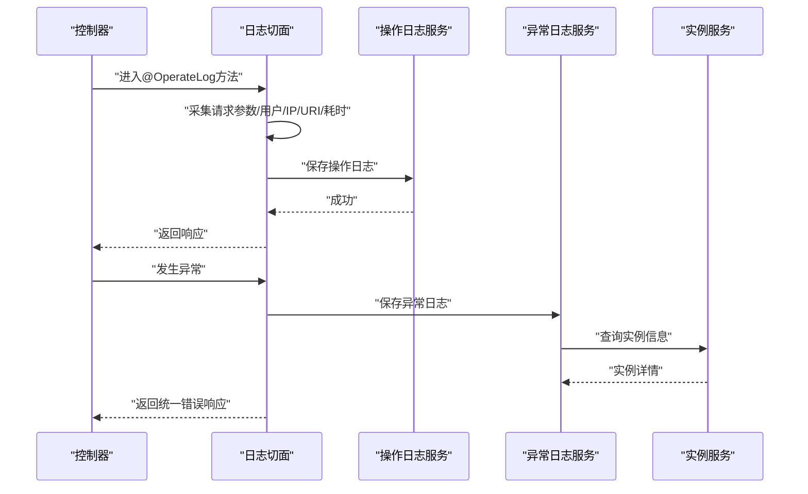
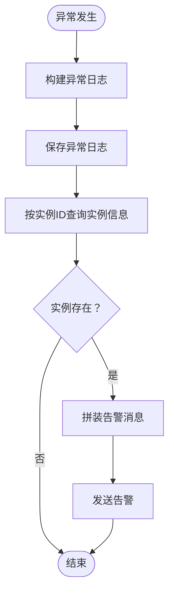
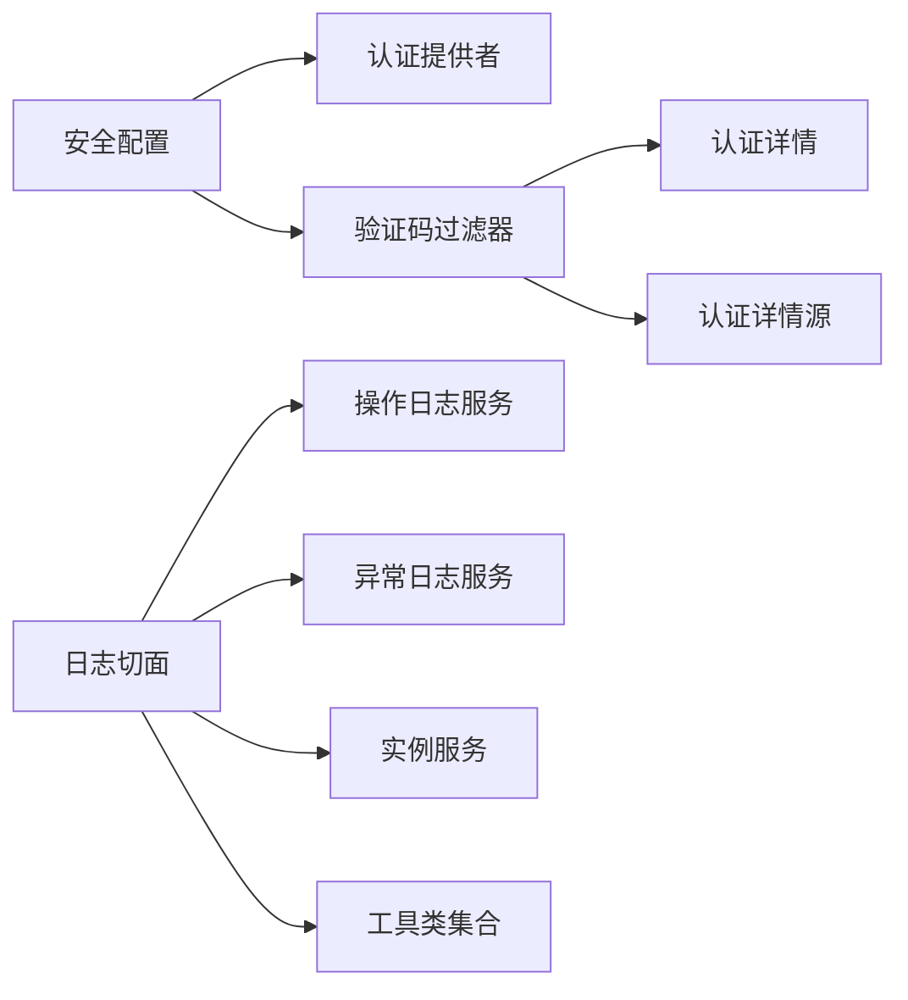

# 权限管理

<cite>
**本文引用的文件**
- [BaseWebSecurityConfigurerAdapter.java](file://phoenix-ui/src/main/java/com/gitee/pifeng/monitoring/ui/config/springsecurity/BaseWebSecurityConfigurerAdapter.java)
- [SpringSecurityConfig.java](file://phoenix-ui/src/main/java/com/gitee/pifeng/monitoring/ui/config/springsecurity/SpringSecurityConfig.java)
- [SpringSecurityAuthenticationProvider.java](file://phoenix-ui/src/main/java/com/gitee/pifeng/monitoring/ui/config/springsecurity/SpringSecurityAuthenticationProvider.java)
- [SpringSecurityVerificationCodeFilter.java](file://phoenix-ui/src/main/java/com/gitee/pifeng/monitoring/ui/config/springsecurity/SpringSecurityVerificationCodeFilter.java)
- [SpringSecurityWebAuthenticationDetails.java](file://phoenix-ui/src/main/java/com/gitee/pifeng/monitoring/ui/config/springsecurity/SpringSecurityWebAuthenticationDetails.java)
- [SpringSecurityWebAuthenticationDetailsSource.java](file://phoenix-ui/src/main/java/com/gitee/pifeng/monitoring/ui/config/springsecurity/SpringSecurityWebAuthenticationDetailsSource.java)
- [OperateTypeConstants.java](file://phoenix-ui/src/main/java/com/gitee/pifeng/monitoring/ui/constant/OperateTypeConstants.java)
- [OperateLog.java](file://phoenix-ui/src/main/java/com/gitee/pifeng/monitoring/ui/business/web/annotation/OperateLog.java)
- [LogAspect.java](file://phoenix-ui/src/main/java/com/gitee/pifeng/monitoring/ui/business/web/component/LogAspect.java)
- [IMonitorLogOperationService.java](file://phoenix-ui/src/main/java/com/gitee/pifeng/monitoring/ui/business/web/service/IMonitorLogOperationService.java)
- [IMonitorLogExceptionService.java](file://phoenix-ui/src/main/java/com/gitee/pifeng/monitoring/ui/business/web/service/IMonitorLogExceptionService.java)
- [IMonitorInstanceService.java](file://phoenix-ui/src/main/java/com/gitee/pifeng/monitoring/ui/business/web/service/IMonitorInstanceService.java)
- [SpringSecurityUtils.java](file://phoenix-ui/src/main/java/com/gitee/pifeng/monitoring/ui/util/SpringSecurityUtils.java)
- [AccessObjectUtils.java](file://phoenix-ui/src/main/java/com/gitee/pifeng/monitoring/common/web/util/AccessObjectUtils.java)
- [ContextUtils.java](file://phoenix-ui/src/main/java/com/gitee/pifeng/monitoring/common/web/util/ContextUtils.java)
- [MonitorLogOperation.java](file://phoenix-ui/src/main/java/com/gitee/pifeng/monitoring/ui/business/web/entity/MonitorLogOperation.java)
- [MonitorLogException.java](file://phoenix-ui/src/main/java/com/gitee/pifeng/monitoring/ui/business/web/entity/MonitorLogException.java)
- [MonitorInstance.java](file://phoenix-ui/src/main/java/com/gitee/pifeng/monitoring/ui/business/web/entity/MonitorInstance.java)
- [LayUiAdminResultVo.java](file://phoenix-ui/src/main/java/com/gitee/pifeng/monitoring/ui/business/web/vo/LayUiAdminResultVo.java)
- [ExceptionLogAspect.java](file://phoenix-server/src/main/java/com/gitee/pifeng/monitoring/server/business/server/component/ExceptionLogAspect.java)
</cite>

## 目录
1. [引言](#引言)
2. [项目结构](#项目结构)
3. [核心组件](#核心组件)
4. [架构总览](#架构总览)
5. [详细组件分析](#详细组件分析)
6. [依赖关系分析](#依赖关系分析)
7. [性能考量](#性能考量)
8. [故障排查指南](#故障排查指南)
9. [结论](#结论)
10. [附录](#附录)

## 引言
本技术文档聚焦于权限管理模块，围绕以下目标展开：深入解析基础安全配置适配器对HTTP安全、URL拦截与静态资源放行的策略；系统阐述方法级权限控制注解（如@PreAuthorize、@PostAuthorize）在RBAC与表达式权限中的应用；详解操作类型常量与操作日志注解及日志切面的实现，覆盖用户操作记录、权限访问审计与异常监控；最后给出权限管理最佳实践，包括最小权限原则、权限继承、权限缓存与失效处理等。

## 项目结构
权限管理相关代码主要位于UI工程的springsecurity配置包与web业务包中，同时配合通用工具类与实体服务层完成鉴权、日志与审计功能。

图表来源
- [BaseWebSecurityConfigurerAdapter.java:13-51](file://phoenix-ui/src/main/java/com/gitee/pifeng/monitoring/ui/config/springsecurity/BaseWebSecurityConfigurerAdapter.java#L13-L51)
- [SpringSecurityConfig.java](file://phoenix-ui/src/main/java/com/gitee/pifeng/monitoring/ui/config/springsecurity/SpringSecurityConfig.java)
- [SpringSecurityAuthenticationProvider.java](file://phoenix-ui/src/main/java/com/gitee/pifeng/monitoring/ui/config/springsecurity/SpringSecurityAuthenticationProvider.java)
- [SpringSecurityVerificationCodeFilter.java](file://phoenix-ui/src/main/java/com/gitee/pifeng/monitoring/ui/config/springsecurity/SpringSecurityVerificationCodeFilter.java)
- [SpringSecurityWebAuthenticationDetails.java](file://phoenix-ui/src/main/java/com/gitee/pifeng/monitoring/ui/config/springsecurity/SpringSecurityWebAuthenticationDetails.java)
- [SpringSecurityWebAuthenticationDetailsSource.java](file://phoenix-ui/src/main/java/com/gitee/pifeng/monitoring/ui/config/springsecurity/SpringSecurityWebAuthenticationDetailsSource.java)
- [OperateLog.java:13-51](file://phoenix-ui/src/main/java/com/gitee/pifeng/monitoring/ui/business/web/annotation/OperateLog.java#L13-L51)
- [OperateTypeConstants.java:11-63](file://phoenix-ui/src/main/java/com/gitee/pifeng/monitoring/ui/constant/OperateTypeConstants.java#L11-L63)
- [LogAspect.java:55-276](file://phoenix-ui/src/main/java/com/gitee/pifeng/monitoring/ui/business/web/component/LogAspect.java#L55-L276)
- [IMonitorLogOperationService.java](file://phoenix-ui/src/main/java/com/gitee/pifeng/monitoring/ui/business/web/service/IMonitorLogOperationService.java)
- [IMonitorLogExceptionService.java](file://phoenix-ui/src/main/java/com/gitee/pifeng/monitoring/ui/business/web/service/IMonitorLogExceptionService.java)
- [IMonitorInstanceService.java](file://phoenix-ui/src/main/java/com/gitee/pifeng/monitoring/ui/business/web/service/IMonitorInstanceService.java)
- [MonitorLogOperation.java](file://phoenix-ui/src/main/java/com/gitee/pifeng/monitoring/ui/business/web/entity/MonitorLogOperation.java)
- [MonitorLogException.java](file://phoenix-ui/src/main/java/com/gitee/pifeng/monitoring/ui/business/web/entity/MonitorLogException.java)
- [MonitorInstance.java](file://phoenix-ui/src/main/java/com/gitee/pifeng/monitoring/ui/business/web/entity/MonitorInstance.java)
- [SpringSecurityUtils.java](file://phoenix-ui/src/main/java/com/gitee/pifeng/monitoring/ui/util/SpringSecurityUtils.java)
- [AccessObjectUtils.java](file://phoenix-ui/src/main/java/com/gitee/pifeng/monitoring/common/web/util/AccessObjectUtils.java)
- [ContextUtils.java](file://phoenix-ui/src/main/java/com/gitee/pifeng/monitoring/common/web/util/ContextUtils.java)
- [LayUiAdminResultVo.java](file://phoenix-ui/src/main/java/com/gitee/pifeng/monitoring/ui/business/web/vo/LayUiAdminResultVo.java)

章节来源
- [BaseWebSecurityConfigurerAdapter.java:13-51](file://phoenix-ui/src/main/java/com/gitee/pifeng/monitoring/ui/config/springsecurity/BaseWebSecurityConfigurerAdapter.java#L13-L51)
- [SpringSecurityConfig.java](file://phoenix-ui/src/main/java/com/gitee/pifeng/monitoring/ui/config/springsecurity/SpringSecurityConfig.java)

## 核心组件
- 基础安全配置适配器：定义忽略的URL与静态资源路径，作为后续安全策略的基础。
- 安全配置与认证：整合认证提供者、验证码过滤器与认证详情组件，形成完整的登录与认证链路。
- 方法级权限注解：通过@PreAuthorize、@PostAuthorize等注解实现基于角色与表达式的权限控制。
- 操作类型常量与日志注解：统一操作类型语义，结合@OperateLog实现细粒度的操作审计。
- 日志切面：围绕操作日志与异常日志进行AOP切面处理，自动采集请求上下文并持久化。

章节来源
- [BaseWebSecurityConfigurerAdapter.java:18-49](file://phoenix-ui/src/main/java/com/gitee/pifeng/monitoring/ui/config/springsecurity/BaseWebSecurityConfigurerAdapter.java#L18-L49)
- [OperateTypeConstants.java:11-63](file://phoenix-ui/src/main/java/com/gitee/pifeng/monitoring/ui/constant/OperateTypeConstants.java#L11-L63)
- [OperateLog.java:13-51](file://phoenix-ui/src/main/java/com/gitee/pifeng/monitoring/ui/business/web/annotation/OperateLog.java#L13-L51)
- [LogAspect.java:86-180](file://phoenix-ui/src/main/java/com/gitee/pifeng/monitoring/ui/business/web/component/LogAspect.java#L86-L180)

## 架构总览
下图展示从HTTP请求到鉴权、权限控制与审计日志的完整流程：

图表来源
- [SpringSecurityVerificationCodeFilter.java](file://phoenix-ui/src/main/java/com/gitee/pifeng/monitoring/ui/config/springsecurity/SpringSecurityVerificationCodeFilter.java)
- [SpringSecurityAuthenticationProvider.java](file://phoenix-ui/src/main/java/com/gitee/pifeng/monitoring/ui/config/springsecurity/SpringSecurityAuthenticationProvider.java)
- [SpringSecurityConfig.java](file://phoenix-ui/src/main/java/com/gitee/pifeng/monitoring/ui/config/springsecurity/SpringSecurityConfig.java)
- [OperateLog.java:13-51](file://phoenix-ui/src/main/java/com/gitee/pifeng/monitoring/ui/business/web/annotation/OperateLog.java#L13-L51)
- [LogAspect.java:113-180](file://phoenix-ui/src/main/java/com/gitee/pifeng/monitoring/ui/business/web/component/LogAspect.java#L113-L180)

## 详细组件分析

### 基础安全配置适配器
- 忽略URL：关闭端点与健康端点无需鉴权。
- 静态资源放行：前端静态资源与druid监控页面无需鉴权。
- 扩展建议：在子类中重写相关配置以实现更细粒度的URL拦截与匿名访问策略。

图表来源
- [BaseWebSecurityConfigurerAdapter.java:18-49](file://phoenix-ui/src/main/java/com/gitee/pifeng/monitoring/ui/config/springsecurity/BaseWebSecurityConfigurerAdapter.java#L18-L49)

章节来源
- [BaseWebSecurityConfigurerAdapter.java:13-51](file://phoenix-ui/src/main/java/com/gitee/pifeng/monitoring/ui/config/springsecurity/BaseWebSecurityConfigurerAdapter.java#L13-L51)

### 安全配置与认证链路
- 认证提供者：负责校验用户凭据，支持自定义用户细节加载与密码编码策略。
- 验证码过滤器：在认证前拦截请求，校验图形验证码，防止暴力破解。
- 认证详情与详情源：扩展认证上下文，便于在切面与业务中获取附加信息。

图表来源
- [SpringSecurityConfig.java](file://phoenix-ui/src/main/java/com/gitee/pifeng/monitoring/ui/config/springsecurity/SpringSecurityConfig.java)
- [SpringSecurityAuthenticationProvider.java](file://phoenix-ui/src/main/java/com/gitee/pifeng/monitoring/ui/config/springsecurity/SpringSecurityAuthenticationProvider.java)
- [SpringSecurityVerificationCodeFilter.java](file://phoenix-ui/src/main/java/com/gitee/pifeng/monitoring/ui/config/springsecurity/SpringSecurityVerificationCodeFilter.java)
- [SpringSecurityWebAuthenticationDetails.java](file://phoenix-ui/src/main/java/com/gitee/pifeng/monitoring/ui/config/springsecurity/SpringSecurityWebAuthenticationDetails.java)
- [SpringSecurityWebAuthenticationDetailsSource.java](file://phoenix-ui/src/main/java/com/gitee/pifeng/monitoring/ui/config/springsecurity/SpringSecurityWebAuthenticationDetailsSource.java)

章节来源
- [SpringSecurityConfig.java](file://phoenix-ui/src/main/java/com/gitee/pifeng/monitoring/ui/config/springsecurity/SpringSecurityConfig.java)
- [SpringSecurityAuthenticationProvider.java](file://phoenix-ui/src/main/java/com/gitee/pifeng/monitoring/ui/config/springsecurity/SpringSecurityAuthenticationProvider.java)
- [SpringSecurityVerificationCodeFilter.java](file://phoenix-ui/src/main/java/com/gitee/pifeng/monitoring/ui/config/springsecurity/SpringSecurityVerificationCodeFilter.java)
- [SpringSecurityWebAuthenticationDetails.java](file://phoenix-ui/src/main/java/com/gitee/pifeng/monitoring/ui/config/springsecurity/SpringSecurityWebAuthenticationDetails.java)
- [SpringSecurityWebAuthenticationDetailsSource.java](file://phoenix-ui/src/main/java/com/gitee/pifeng/monitoring/ui/config/springsecurity/SpringSecurityWebAuthenticationDetailsSource.java)

### 方法级权限控制注解
- @PreAuthorize：在方法执行前根据角色或表达式判断是否允许访问。
- @PostAuthorize：在方法执行后对返回结果进行二次校验。
- RBAC与表达式权限：结合用户角色、资源标识与动态表达式实现灵活的权限判定。
- 动态权限判断：可结合上下文动态评估权限，适用于多租户或多组织场景。

章节来源
- [SpringSecurityConfig.java](file://phoenix-ui/src/main/java/com/gitee/pifeng/monitoring/ui/config/springsecurity/SpringSecurityConfig.java)

### 操作类型常量与操作日志注解
- 操作类型常量：统一“登录、退出登录、新增、更新、删除、查询、导出、访问页面、控制、测试”等语义，便于审计与统计。
- 操作日志注解：通过operModule、operType、operDesc定义操作模块、类型与描述，驱动日志切面自动采集。

图表来源
- [OperateTypeConstants.java:11-63](file://phoenix-ui/src/main/java/com/gitee/pifeng/monitoring/ui/constant/OperateTypeConstants.java#L11-L63)
- [OperateLog.java:13-51](file://phoenix-ui/src/main/java/com/gitee/pifeng/monitoring/ui/business/web/annotation/OperateLog.java#L13-L51)

章节来源
- [OperateTypeConstants.java:11-63](file://phoenix-ui/src/main/java/com/gitee/pifeng/monitoring/ui/constant/OperateTypeConstants.java#L11-L63)
- [OperateLog.java:13-51](file://phoenix-ui/src/main/java/com/gitee/pifeng/monitoring/ui/business/web/annotation/OperateLog.java#L13-L51)

### 日志切面与审计流程
- 操作日志切面：拦截带@OperateLog注解的方法，自动采集请求参数、用户信息、IP、URI、耗时，并持久化。
- 异常日志切面：拦截控制器异常，记录异常详情并发送告警，同时关联应用实例信息。
- 工具与上下文：通过SpringSecurityUtils、AccessObjectUtils、ContextUtils获取当前用户、客户端IP与请求上下文。

图表来源
- [LogAspect.java:113-180](file://phoenix-ui/src/main/java/com/gitee/pifeng/monitoring/ui/business/web/component/LogAspect.java#L113-L180)
- [LogAspect.java:192-274](file://phoenix-ui/src/main/java/com/gitee/pifeng/monitoring/ui/business/web/component/LogAspect.java#L192-L274)
- [IMonitorLogOperationService.java](file://phoenix-ui/src/main/java/com/gitee/pifeng/monitoring/ui/business/web/service/IMonitorLogOperationService.java)
- [IMonitorLogExceptionService.java](file://phoenix-ui/src/main/java/com/gitee/pifeng/monitoring/ui/business/web/service/IMonitorLogExceptionService.java)
- [IMonitorInstanceService.java](file://phoenix-ui/src/main/java/com/gitee/pifeng/monitoring/ui/business/web/service/IMonitorInstanceService.java)
- [SpringSecurityUtils.java](file://phoenix-ui/src/main/java/com/gitee/pifeng/monitoring/ui/util/SpringSecurityUtils.java)
- [AccessObjectUtils.java](file://phoenix-ui/src/main/java/com/gitee/pifeng/monitoring/common/web/util/AccessObjectUtils.java)
- [ContextUtils.java](file://phoenix-ui/src/main/java/com/gitee/pifeng/monitoring/common/web/util/ContextUtils.java)
- [LayUiAdminResultVo.java](file://phoenix-ui/src/main/java/com/gitee/pifeng/monitoring/ui/business/web/vo/LayUiAdminResultVo.java)

章节来源
- [LogAspect.java:55-276](file://phoenix-ui/src/main/java/com/gitee/pifeng/monitoring/ui/business/web/component/LogAspect.java#L55-L276)

### 异常监控与告警联动
- 异常日志切面：捕获控制器异常，构建异常日志并持久化。
- 实例关联与告警：根据实例ID查询实例信息，拼装告警消息并通过监控插件发送告警。

图表来源
- [LogAspect.java:192-274](file://phoenix-ui/src/main/java/com/gitee/pifeng/monitoring/ui/business/web/component/LogAspect.java#L192-L274)
- [IMonitorInstanceService.java](file://phoenix-ui/src/main/java/com/gitee/pifeng/monitoring/ui/business/web/service/IMonitorInstanceService.java)
- [MonitorInstance.java](file://phoenix-ui/src/main/java/com/gitee/pifeng/monitoring/ui/business/web/entity/MonitorInstance.java)

章节来源
- [LogAspect.java:192-274](file://phoenix-ui/src/main/java/com/gitee/pifeng/monitoring/ui/business/web/component/LogAspect.java#L192-L274)

## 依赖关系分析
- 组件内聚与耦合：安全配置与认证提供者耦合紧密；日志切面依赖多个服务与工具类，但通过接口隔离降低耦合。
- 外部依赖：日志切面依赖监控插件进行告警发送；实体与服务通过DAO层持久化至数据库。
- 循环依赖：当前结构未见循环依赖迹象，各模块职责清晰。

图表来源
- [SpringSecurityConfig.java](file://phoenix-ui/src/main/java/com/gitee/pifeng/monitoring/ui/config/springsecurity/SpringSecurityConfig.java)
- [SpringSecurityAuthenticationProvider.java](file://phoenix-ui/src/main/java/com/gitee/pifeng/monitoring/ui/config/springsecurity/SpringSecurityAuthenticationProvider.java)
- [SpringSecurityVerificationCodeFilter.java](file://phoenix-ui/src/main/java/com/gitee/pifeng/monitoring/ui/config/springsecurity/SpringSecurityVerificationCodeFilter.java)
- [LogAspect.java:55-276](file://phoenix-ui/src/main/java/com/gitee/pifeng/monitoring/ui/business/web/component/LogAspect.java#L55-L276)

章节来源
- [LogAspect.java:55-276](file://phoenix-ui/src/main/java/com/gitee/pifeng/monitoring/ui/business/web/component/LogAspect.java#L55-L276)

## 性能考量
- 静态资源放行：通过忽略静态资源减少不必要的鉴权开销。
- AOP切面成本：日志切面在方法前后执行，应避免在高频路径上记录过大的请求/响应体。
- 缓存与异步：实例信息与权限数据可引入缓存；异常告警可通过异步队列降低阻塞风险。
- 并发与线程池：异常告警与日志持久化建议使用独立线程池，避免影响主业务线程。

## 故障排查指南
- 登录失败：检查验证码过滤器是否正确拦截与校验；确认认证提供者是否正确加载用户详情。
- 权限不足：核对@PreAuthorize/@PostAuthorize表达式与用户角色映射；确认安全配置是否生效。
- 审计缺失：检查@OperateLog注解是否标注在目标方法；确认日志切面是否启用且服务实现可用。
- 异常未告警：确认异常日志切面是否拦截到控制器异常；检查实例服务是否能按实例ID查询到实例信息。

章节来源
- [SpringSecurityVerificationCodeFilter.java](file://phoenix-ui/src/main/java/com/gitee/pifeng/monitoring/ui/config/springsecurity/SpringSecurityVerificationCodeFilter.java)
- [SpringSecurityAuthenticationProvider.java](file://phoenix-ui/src/main/java/com/gitee/pifeng/monitoring/ui/config/springsecurity/SpringSecurityAuthenticationProvider.java)
- [LogAspect.java:113-180](file://phoenix-ui/src/main/java/com/gitee/pifeng/monitoring/ui/business/web/component/LogAspect.java#L113-L180)
- [LogAspect.java:192-274](file://phoenix-ui/src/main/java/com/gitee/pifeng/monitoring/ui/business/web/component/LogAspect.java#L192-L274)

## 结论
该权限管理模块以基础安全适配器为起点，结合认证提供者、验证码过滤器与安全配置，形成完整的鉴权链路；通过方法级权限注解实现RBAC与表达式权限控制；借助操作日志注解与日志切面实现全面的审计与异常监控。整体架构清晰、职责分离明确，具备良好的扩展性与可维护性。

## 附录
- 最小权限原则：仅授予完成任务所需的最小权限集，避免过度授权。
- 权限继承：在RBAC模型中合理设计角色层级，利用继承简化权限配置。
- 权限缓存：对常用权限与用户角色进行缓存，降低鉴权查询开销。
- 权限失效处理：结合会话超时与令牌刷新策略，确保权限状态一致性。