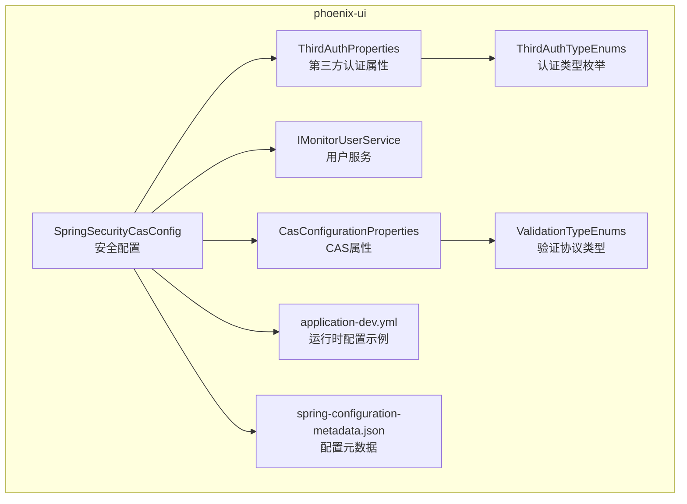
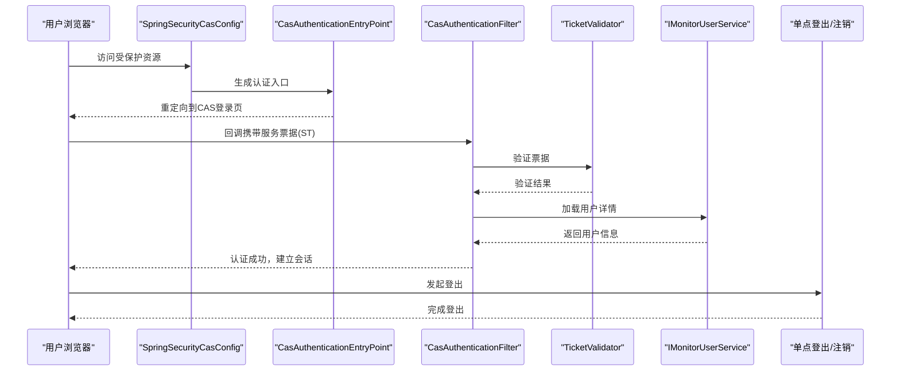
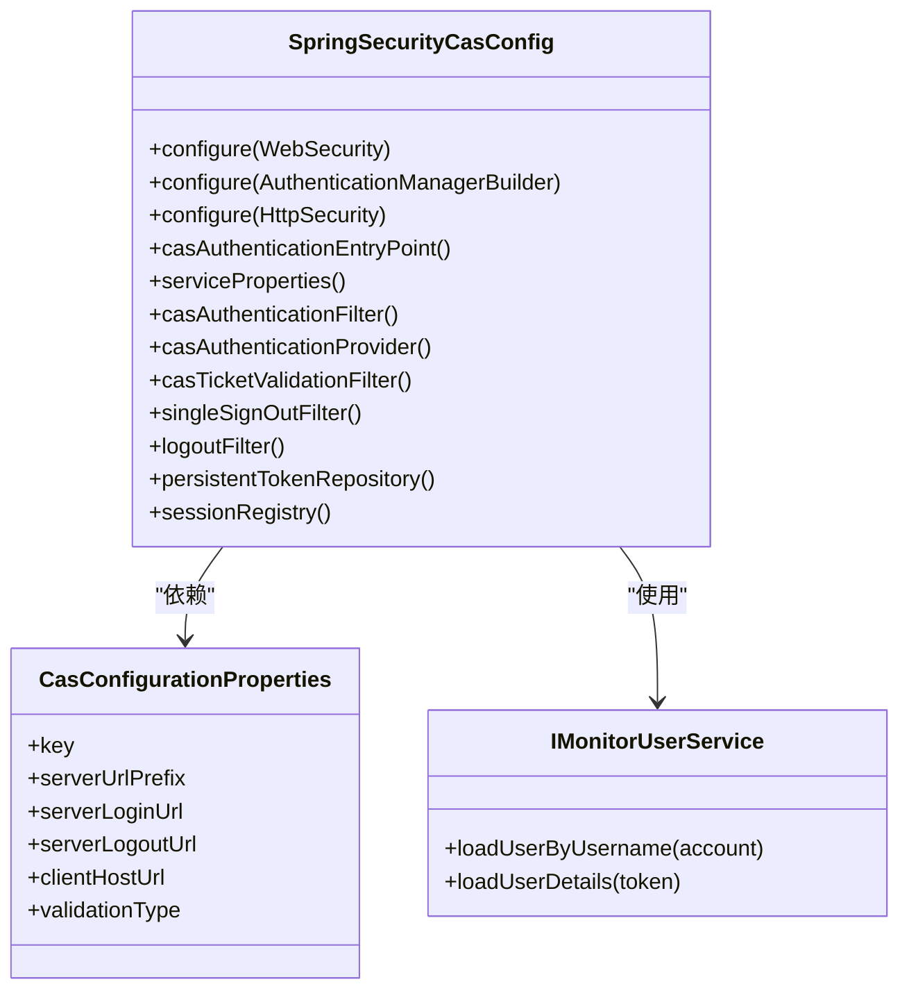
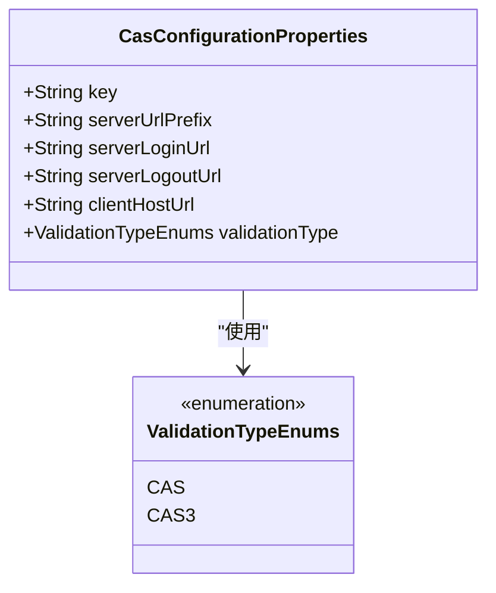
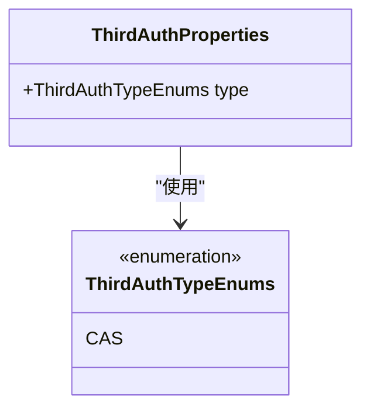
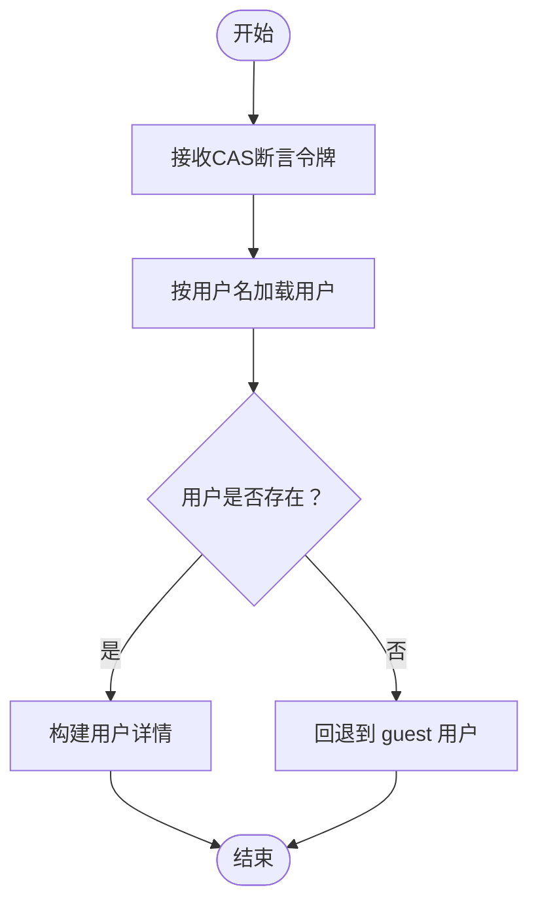
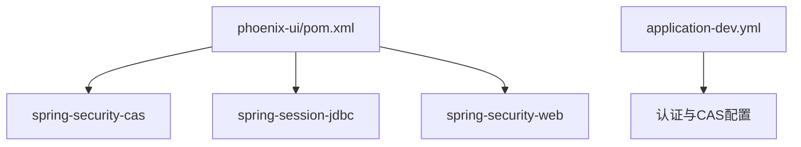

# 第三方认证

<cite>
**本文引用的文件**
- [SpringSecurityCasConfig.java](file://phoenix-ui/src/main/java/com/gitee/pifeng/monitoring/ui/config/springsecurity/SpringSecurityCasConfig.java)
- [CasConfigurationProperties.java](file://phoenix-ui/src/main/java/com/gitee/pifeng/monitoring/ui/property/auth/thirdauth/cas/CasConfigurationProperties.java)
- [ThirdAuthProperties.java](file://phoenix-ui/src/main/java/com/gitee/pifeng/monitoring/ui/property/auth/thirdauth/ThirdAuthProperties.java)
- [ThirdAuthTypeEnums.java](file://phoenix-ui/src/main/java/com/gitee/pifeng/monitoring/ui/property/auth/thirdauth/ThirdAuthTypeEnums.java)
- [ValidationTypeEnums.java](file://phoenix-ui/src/main/java/com/gitee/pifeng/monitoring/ui/property/auth/thirdauth/cas/ValidationTypeEnums.java)
- [application-dev.yml](file://phoenix-ui/src/main/resources/application-dev.yml)
- [spring-configuration-metadata.json](file://phoenix-ui/src/main/resources/META-INF/spring-configuration-metadata.json)
- [IMonitorUserService.java](file://phoenix-ui/src/main/java/com/gitee/pifeng/monitoring/ui/business/web/service/IMonitorUserService.java)
- [MonitorUserServiceImpl.java](file://phoenix-ui/src/main/java/com/gitee/pifeng/monitoring/ui/business/web/service/impl/MonitorUserServiceImpl.java)
- [pom.xml](file://phoenix-ui/pom.xml)
</cite>

## 目录
1. [简介](#简介)
2. [项目结构](#项目结构)
3. [核心组件](#核心组件)
4. [架构总览](#架构总览)
5. [详细组件分析](#详细组件分析)
6. [依赖分析](#依赖分析)
7. [性能考量](#性能考量)
8. [故障排查指南](#故障排查指南)
9. [结论](#结论)
10. [附录](#附录)

## 简介
本文件面向第三方认证模块，聚焦于基于 Spring Security 的 CAS 单点登录集成方案。内容涵盖：
- CAS 安全配置与认证流程（登录入口、过滤器、登出、票据验证）
- CAS 配置属性与第三方认证属性的定义与作用
- 集成步骤（服务注册、票据验证、用户信息同步、会话管理）
- 安全注意事项（票据安全传输、用户信息保护、会话劫持防护）

## 项目结构
第三方认证相关代码集中在 phoenix-ui 模块中，关键位置如下：
- 安全配置：config/springsecurity/SpringSecurityCasConfig.java
- CAS 属性：property/auth/thirdauth/cas/*.java
- 第三方认证属性：property/auth/thirdauth/*.java
- 运行时配置示例：resources/application-dev.yml
- 配置元数据：resources/META-INF/spring-configuration-metadata.json
- 用户服务（CAS 成功后的用户加载）：business/web/service/*.java
- 依赖声明：pom.xml

**图表来源**
- [SpringSecurityCasConfig.java:42-48](file://phoenix-ui/src/main/java/com/gitee/pifeng/monitoring/ui/config/springsecurity/SpringSecurityCasConfig.java#L42-L48)
- [CasConfigurationProperties.java:16-54](file://phoenix-ui/src/main/java/com/gitee/pifeng/monitoring/ui/property/auth/thirdauth/cas/CasConfigurationProperties.java#L16-L54)
- [ThirdAuthProperties.java:16-26](file://phoenix-ui/src/main/java/com/gitee/pifeng/monitoring/ui/property/auth/thirdauth/ThirdAuthProperties.java#L16-L26)
- [ThirdAuthTypeEnums.java:11-18](file://phoenix-ui/src/main/java/com/gitee/pifeng/monitoring/ui/property/auth/thirdauth/ThirdAuthTypeEnums.java#L11-L18)
- [ValidationTypeEnums.java:11-22](file://phoenix-ui/src/main/java/com/gitee/pifeng/monitoring/ui/property/auth/thirdauth/cas/ValidationTypeEnums.java#L11-L22)
- [application-dev.yml:31-49](file://phoenix-ui/src/main/resources/application-dev.yml#L31-L49)
- [spring-configuration-metadata.json:10-66](file://phoenix-ui/src/main/resources/META-INF/spring-configuration-metadata.json#L10-L66)

**章节来源**
- [SpringSecurityCasConfig.java:42-48](file://phoenix-ui/src/main/java/com/gitee/pifeng/monitoring/ui/config/springsecurity/SpringSecurityCasConfig.java#L42-L48)
- [application-dev.yml:31-49](file://phoenix-ui/src/main/resources/application-dev.yml#L31-L49)

## 核心组件
- SpringSecurityCasConfig：基于 Spring Security 的 CAS 配置类，负责：
  - 条件启用（仅当认证类型为 third 且第三方类型为 cas 时生效）
  - 认证入口、过滤器、登出、票据验证器、单点登出与单点注销过滤器、会话注册表、记住我持久化等
- CasConfigurationProperties：CAS 服务器与客户端相关配置项
- ThirdAuthProperties 与 ThirdAuthTypeEnums：第三方认证类型选择
- ValidationTypeEnums：CAS 协议验证类型（CAS/CAS3）
- IMonitorUserService 与 MonitorUserServiceImpl：CAS 认证成功后加载用户详情并完成用户信息同步

**章节来源**
- [SpringSecurityCasConfig.java:42-48](file://phoenix-ui/src/main/java/com/gitee/pifeng/monitoring/ui/config/springsecurity/SpringSecurityCasConfig.java#L42-L48)
- [CasConfigurationProperties.java:16-54](file://phoenix-ui/src/main/java/com/gitee/pifeng/monitoring/ui/property/auth/thirdauth/cas/CasConfigurationProperties.java#L16-L54)
- [ThirdAuthProperties.java:16-26](file://phoenix-ui/src/main/java/com/gitee/pifeng/monitoring/ui/property/auth/thirdauth/ThirdAuthProperties.java#L16-L26)
- [ThirdAuthTypeEnums.java:11-18](file://phoenix-ui/src/main/java/com/gitee/pifeng/monitoring/ui/property/auth/thirdauth/ThirdAuthTypeEnums.java#L11-L18)
- [ValidationTypeEnums.java:11-22](file://phoenix-ui/src/main/java/com/gitee/pifeng/monitoring/ui/property/auth/thirdauth/cas/ValidationTypeEnums.java#L11-L22)
- [IMonitorUserService.java:25-36](file://phoenix-ui/src/main/java/com/gitee/pifeng/monitoring/ui/business/web/service/IMonitorUserService.java#L25-L36)
- [MonitorUserServiceImpl.java:129-140](file://phoenix-ui/src/main/java/com/gitee/pifeng/monitoring/ui/business/web/service/impl/MonitorUserServiceImpl.java#L129-L140)

## 架构总览
CAS 单点登录在本项目中的工作流：
- 客户端访问受保护资源 → 触发认证入口 → 重定向至 CAS 登录页
- 用户在 CAS 登录成功后，CAS 返回服务票据（ST）给客户端
- 客户端使用 ST 向 CAS 验证票据有效性，验证通过后回调服务端
- 服务端通过 CasAuthenticationProvider 加载用户详情（IMonitorUserService），完成用户信息同步
- 建立会话并启用 JDBC Session 存储与会话注册表，支持单点注销与并发会话管理

**图表来源**
- [SpringSecurityCasConfig.java:114-143](file://phoenix-ui/src/main/java/com/gitee/pifeng/monitoring/ui/config/springsecurity/SpringSecurityCasConfig.java#L114-L143)
- [SpringSecurityCasConfig.java:154-161](file://phoenix-ui/src/main/java/com/gitee/pifeng/monitoring/ui/config/springsecurity/SpringSecurityCasConfig.java#L154-L161)
- [SpringSecurityCasConfig.java:192-198](file://phoenix-ui/src/main/java/com/gitee/pifeng/monitoring/ui/config/springsecurity/SpringSecurityCasConfig.java#L192-L198)
- [SpringSecurityCasConfig.java:233-248](file://phoenix-ui/src/main/java/com/gitee/pifeng/monitoring/ui/config/springsecurity/SpringSecurityCasConfig.java#L233-L248)
- [MonitorUserServiceImpl.java:129-140](file://phoenix-ui/src/main/java/com/gitee/pifeng/monitoring/ui/business/web/service/impl/MonitorUserServiceImpl.java#L129-L140)

## 详细组件分析

### SpringSecurityCasConfig 组件
职责与要点：
- 条件启用：仅当 phoenix.auth.type 为 third 且 phoenix.auth.third-auth.type 为 cas 时生效
- 认证入口：设置 CAS 登录入口 URL 与服务端点
- 服务端点：配置客户端服务 URL（/login）
- 认证过滤器：拦截 /login，使用 ServiceProperties 与 AuthenticationManager
- 认证提供者：注入 IMonitorUserService 实现用户详情加载
- 票据验证器：根据 ValidationTypeEnums 选择 CAS2.0 或 CAS3.0 验证器
- 单点登出：跳转至 CAS 登出 URL 并清理安全上下文
- 单点注销：接收 CAS 服务端注销通知，清理本地会话
- 会话管理：JDBC Session 存储与 SpringSessionBackedSessionRegistry

**图表来源**
- [SpringSecurityCasConfig.java:42-48](file://phoenix-ui/src/main/java/com/gitee/pifeng/monitoring/ui/config/springsecurity/SpringSecurityCasConfig.java#L42-L48)
- [SpringSecurityCasConfig.java:154-161](file://phoenix-ui/src/main/java/com/gitee/pifeng/monitoring/ui/config/springsecurity/SpringSecurityCasConfig.java#L154-L161)
- [SpringSecurityCasConfig.java:192-198](file://phoenix-ui/src/main/java/com/gitee/pifeng/monitoring/ui/config/springsecurity/SpringSecurityCasConfig.java#L192-L198)
- [SpringSecurityCasConfig.java:210-222](file://phoenix-ui/src/main/java/com/gitee/pifeng/monitoring/ui/config/springsecurity/SpringSecurityCasConfig.java#L210-L222)
- [SpringSecurityCasConfig.java:233-248](file://phoenix-ui/src/main/java/com/gitee/pifeng/monitoring/ui/config/springsecurity/SpringSecurityCasConfig.java#L233-L248)
- [SpringSecurityCasConfig.java:259-280](file://phoenix-ui/src/main/java/com/gitee/pifeng/monitoring/ui/config/springsecurity/SpringSecurityCasConfig.java#L259-L280)
- [SpringSecurityCasConfig.java:312-315](file://phoenix-ui/src/main/java/com/gitee/pifeng/monitoring/ui/config/springsecurity/SpringSecurityCasConfig.java#L312-L315)
- [CasConfigurationProperties.java:16-54](file://phoenix-ui/src/main/java/com/gitee/pifeng/monitoring/ui/property/auth/thirdauth/cas/CasConfigurationProperties.java#L16-L54)
- [IMonitorUserService.java:25-36](file://phoenix-ui/src/main/java/com/gitee/pifeng/monitoring/ui/business/web/service/IMonitorUserService.java#L25-L36)

**章节来源**
- [SpringSecurityCasConfig.java:81-143](file://phoenix-ui/src/main/java/com/gitee/pifeng/monitoring/ui/config/springsecurity/SpringSecurityCasConfig.java#L81-L143)
- [SpringSecurityCasConfig.java:154-161](file://phoenix-ui/src/main/java/com/gitee/pifeng/monitoring/ui/config/springsecurity/SpringSecurityCasConfig.java#L154-L161)
- [SpringSecurityCasConfig.java:192-198](file://phoenix-ui/src/main/java/com/gitee/pifeng/monitoring/ui/config/springsecurity/SpringSecurityCasConfig.java#L192-L198)
- [SpringSecurityCasConfig.java:210-222](file://phoenix-ui/src/main/java/com/gitee/pifeng/monitoring/ui/config/springsecurity/SpringSecurityCasConfig.java#L210-L222)
- [SpringSecurityCasConfig.java:233-248](file://phoenix-ui/src/main/java/com/gitee/pifeng/monitoring/ui/config/springsecurity/SpringSecurityCasConfig.java#L233-L248)
- [SpringSecurityCasConfig.java:259-280](file://phoenix-ui/src/main/java/com/gitee/pifeng/monitoring/ui/config/springsecurity/SpringSecurityCasConfig.java#L259-L280)
- [SpringSecurityCasConfig.java:293-301](file://phoenix-ui/src/main/java/com/gitee/pifeng/monitoring/ui/config/springsecurity/SpringSecurityCasConfig.java#L293-L301)
- [SpringSecurityCasConfig.java:312-315](file://phoenix-ui/src/main/java/com/gitee/pifeng/monitoring/ui/config/springsecurity/SpringSecurityCasConfig.java#L312-L315)

### CAS 配置属性（CasConfigurationProperties）
- 关键属性
  - key：认证提供者的密钥
  - serverUrlPrefix：CAS 服务端基础地址
  - serverLoginUrl：CAS 登录地址
  - serverLogoutUrl：CAS 登出地址
  - clientHostUrl：CAS 客户端主机地址
  - validationType：验证协议类型（CAS/CAS3）
- 默认值与约束
  - key 默认值为 "phoenix"
  - validationType 默认为 CAS3
  - serverUrlPrefix、serverLoginUrl、serverLogoutUrl、clientHostUrl 均为必填

**图表来源**
- [CasConfigurationProperties.java:16-54](file://phoenix-ui/src/main/java/com/gitee/pifeng/monitoring/ui/property/auth/thirdauth/cas/CasConfigurationProperties.java#L16-L54)
- [ValidationTypeEnums.java:11-22](file://phoenix-ui/src/main/java/com/gitee/pifeng/monitoring/ui/property/auth/thirdauth/cas/ValidationTypeEnums.java#L11-L22)

**章节来源**
- [CasConfigurationProperties.java:16-54](file://phoenix-ui/src/main/java/com/gitee/pifeng/monitoring/ui/property/auth/thirdauth/cas/CasConfigurationProperties.java#L16-L54)
- [ValidationTypeEnums.java:11-22](file://phoenix-ui/src/main/java/com/gitee/pifeng/monitoring/ui/property/auth/thirdauth/cas/ValidationTypeEnums.java#L11-L22)

### 第三方认证属性（ThirdAuthProperties 与 ThirdAuthTypeEnums）
- ThirdAuthProperties
  - prefix：phoenix.auth.third-auth
  - type：第三方认证类型枚举
- ThirdAuthTypeEnums
  - 当前支持：CAS

**图表来源**
- [ThirdAuthProperties.java:16-26](file://phoenix-ui/src/main/java/com/gitee/pifeng/monitoring/ui/property/auth/thirdauth/ThirdAuthProperties.java#L16-L26)
- [ThirdAuthTypeEnums.java:11-18](file://phoenix-ui/src/main/java/com/gitee/pifeng/monitoring/ui/property/auth/thirdauth/ThirdAuthTypeEnums.java#L11-L18)

**章节来源**
- [ThirdAuthProperties.java:16-26](file://phoenix-ui/src/main/java/com/gitee/pifeng/monitoring/ui/property/auth/thirdauth/ThirdAuthProperties.java#L16-L26)
- [ThirdAuthTypeEnums.java:11-18](file://phoenix-ui/src/main/java/com/gitee/pifeng/monitoring/ui/property/auth/thirdauth/ThirdAuthTypeEnums.java#L11-L18)

### 用户信息服务（IMonitorUserService 与 MonitorUserServiceImpl）
- IMonitorUserService
  - 继承 AuthenticationUserDetailsService<CasAssertionAuthenticationToken> 与 UserDetailsService
  - 提供按用户名加载用户与按 CAS 断言加载用户的能力
- MonitorUserServiceImpl
  - loadUserByUsername：从数据库查询用户并构建 UserDetails
  - loadUserDetails：CAS 成功后加载用户详情，若未找到则回退到 guest 用户

**图表来源**
- [IMonitorUserService.java:25-36](file://phoenix-ui/src/main/java/com/gitee/pifeng/monitoring/ui/business/web/service/IMonitorUserService.java#L25-L36)
- [MonitorUserServiceImpl.java:129-140](file://phoenix-ui/src/main/java/com/gitee/pifeng/monitoring/ui/business/web/service/impl/MonitorUserServiceImpl.java#L129-L140)

**章节来源**
- [IMonitorUserService.java:25-36](file://phoenix-ui/src/main/java/com/gitee/pifeng/monitoring/ui/business/web/service/IMonitorUserService.java#L25-L36)
- [MonitorUserServiceImpl.java:102-140](file://phoenix-ui/src/main/java/com/gitee/pifeng/monitoring/ui/business/web/service/impl/MonitorUserServiceImpl.java#L102-L140)

## 依赖分析
- Spring Security 与 CAS 集成依赖
  - spring-security-cas：提供 CAS 认证入口、过滤器、提供者、票据验证器等
  - spring-session-jdbc：启用 JDBC 会话存储
  - spring-security-web：提供安全过滤器链与登出、记住我等功能
- 运行时配置
  - application-dev.yml 中定义了认证类型、CAS 服务器与客户端地址、验证类型等

**图表来源**
- [pom.xml:54-68](file://phoenix-ui/pom.xml#L54-L68)
- [application-dev.yml:31-49](file://phoenix-ui/src/main/resources/application-dev.yml#L31-L49)

**章节来源**
- [pom.xml:54-68](file://phoenix-ui/pom.xml#L54-L68)
- [application-dev.yml:31-49](file://phoenix-ui/src/main/resources/application-dev.yml#L31-L49)

## 性能考量
- 票据验证器选择
  - CAS3 验证器通常具备更好的兼容性与扩展性，适合多数场景
- 会话存储
  - 使用 JDBC Session 存储可支持集群部署与跨节点会话共享
- 缓存与超时
  - 可结合应用层缓存与会话超时配置优化响应时间与资源占用
- 登录与登出路径
  - 明确的 /login 与 /logout 路径有助于前端与服务端协作，减少不必要的重定向开销

[本节为通用指导，不直接分析具体文件]

## 故障排查指南
- 认证未生效
  - 检查 phoenix.auth.type 与 phoenix.auth.third-auth.type 是否正确设置为 third 与 cas
  - 确认 ConditionalOnExpression 条件满足
- 登录失败或循环重定向
  - 核对 serverLoginUrl 与 clientHostUrl 的拼接是否正确
  - 确保 /login 与 ServiceProperties.service 地址一致
- 票据验证失败
  - 检查 serverUrlPrefix 与 validationType 配置
  - 确认 CAS 服务端与客户端时间同步
- 用户信息未同步
  - 确认 IMonitorUserService 正常加载用户详情
  - 若用户不存在，系统会回退到 guest 用户，请确认 guest 用户配置
- 单点登出无效
  - 检查 serverLogoutUrl 与客户端 /logout 路径
  - 确认 SingleSignOutFilter 与 LogoutFilter 的顺序与配置

**章节来源**
- [SpringSecurityCasConfig.java:46-48](file://phoenix-ui/src/main/java/com/gitee/pifeng/monitoring/ui/config/springsecurity/SpringSecurityCasConfig.java#L46-L48)
- [SpringSecurityCasConfig.java:154-161](file://phoenix-ui/src/main/java/com/gitee/pifeng/monitoring/ui/config/springsecurity/SpringSecurityCasConfig.java#L154-L161)
- [SpringSecurityCasConfig.java:192-198](file://phoenix-ui/src/main/java/com/gitee/pifeng/monitoring/ui/config/springsecurity/SpringSecurityCasConfig.java#L192-L198)
- [SpringSecurityCasConfig.java:233-248](file://phoenix-ui/src/main/java/com/gitee/pifeng/monitoring/ui/config/springsecurity/SpringSecurityCasConfig.java#L233-L248)
- [MonitorUserServiceImpl.java:129-140](file://phoenix-ui/src/main/java/com/gitee/pifeng/monitoring/ui/business/web/service/impl/MonitorUserServiceImpl.java#L129-L140)
- [application-dev.yml:31-49](file://phoenix-ui/src/main/resources/application-dev.yml#L31-L49)

## 结论
本模块通过 Spring Security 与 CAS 的深度集成，提供了完整的单点登录能力。其关键特性包括：
- 精准的条件启用机制，确保仅在第三方认证场景下加载 CAS 配置
- 清晰的认证入口、过滤器与登出流程，便于维护与扩展
- 灵活的票据验证器选择与 JDBC 会话存储，适配多环境部署
- 完整的用户信息服务，支持用户信息同步与回退策略

[本节为总结性内容，不直接分析具体文件]

## 附录

### CAS 认证集成步骤
- 服务注册
  - 在 CAS 服务端为本应用注册服务，配置回调地址为 clientHostUrl + "/login"
- 票据验证
  - 根据 validationType 选择 CAS2.0 或 CAS3.0 验证器
- 用户信息同步
  - IMonitorUserService 负责加载用户详情；如用户不存在，回退到 guest 用户
- 会话管理
  - 启用 JDBC Session 存储与 SpringSessionBackedSessionRegistry，支持并发会话与单点注销

**章节来源**
- [SpringSecurityCasConfig.java:154-161](file://phoenix-ui/src/main/java/com/gitee/pifeng/monitoring/ui/config/springsecurity/SpringSecurityCasConfig.java#L154-L161)
- [SpringSecurityCasConfig.java:192-198](file://phoenix-ui/src/main/java/com/gitee/pifeng/monitoring/ui/config/springsecurity/SpringSecurityCasConfig.java#L192-L198)
- [SpringSecurityCasConfig.java:233-248](file://phoenix-ui/src/main/java/com/gitee/pifeng/monitoring/ui/config/springsecurity/SpringSecurityCasConfig.java#L233-L248)
- [MonitorUserServiceImpl.java:129-140](file://phoenix-ui/src/main/java/com/gitee/pifeng/monitoring/ui/business/web/service/impl/MonitorUserServiceImpl.java#L129-L140)

### 配置属性一览
- phoenix.auth.type：认证类型（self/third）
- phoenix.auth.third-auth.type：第三方认证类型（cas）
- phoenix.auth.third-auth.cas.key：认证提供者密钥
- phoenix.auth.third-auth.cas.server-url-prefix：CAS 服务端基础地址
- phoenix.auth.third-auth.cas.server-login-url：CAS 登录地址
- phoenix.auth.third-auth.cas.server-logout-url：CAS 登出地址
- phoenix.auth.third-auth.cas.client-host-url：客户端主机地址
- phoenix.auth.third-auth.cas.validation-type：验证协议类型（CAS/CAS3）

**章节来源**
- [spring-configuration-metadata.json:10-66](file://phoenix-ui/src/main/resources/META-INF/spring-configuration-metadata.json#L10-L66)
- [application-dev.yml:31-49](file://phoenix-ui/src/main/resources/application-dev.yml#L31-L49)

### 安全考虑
- 票据安全传输
  - 使用 HTTPS 与 TLS，确保票据在传输过程中的机密性与完整性
- 用户信息保护
  - 严格限制用户详情的访问范围，避免敏感信息泄露
- 会话劫持防护
  - 启用 JDBC Session 存储与会话注册表，配合严格的会话超时与并发策略
- 登录与登出路径
  - 明确的 /login 与 /logout 路径，减少中间人攻击风险

[本节为通用指导，不直接分析具体文件]