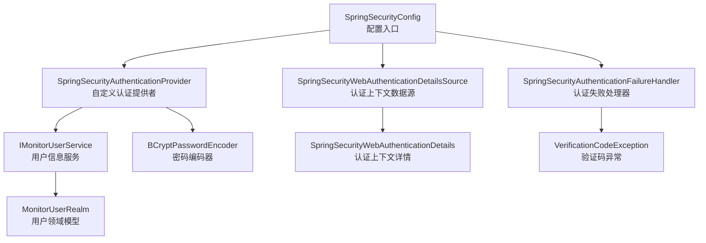
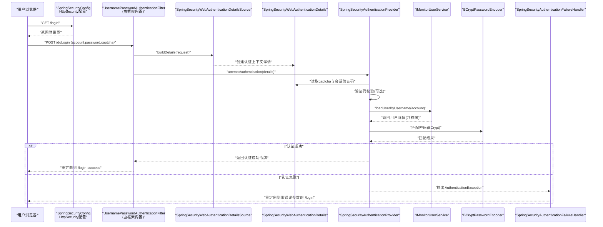
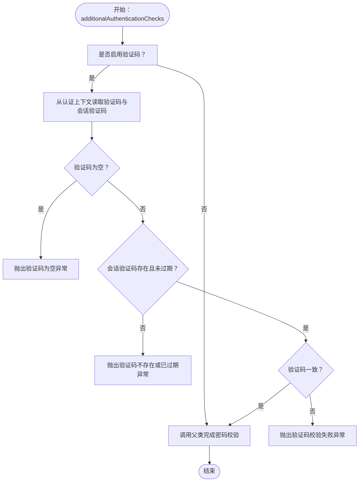
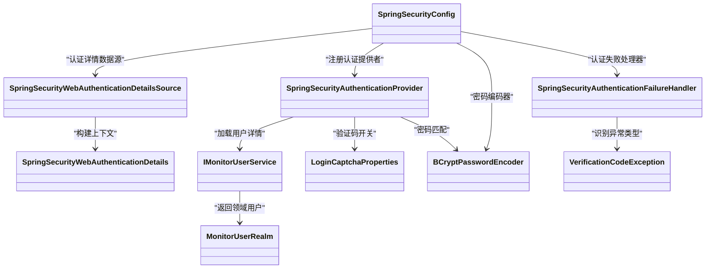

# 自定义认证

<cite>
**本文引用的文件**
- [SpringSecurityConfig.java](file://phoenix-ui/src/main/java/com/gitee/pifeng/monitoring/ui/config/springsecurity/SpringSecurityConfig.java)
- [SpringSecurityAuthenticationProvider.java](file://phoenix-ui/src/main/java/com/gitee/pifeng/monitoring/ui/config/springsecurity/SpringSecurityAuthenticationProvider.java)
- [SpringSecurityAuthenticationFailureHandler.java](file://phoenix-ui/src/main/java/com/gitee/pifeng/monitoring/ui/config/springsecurity/SpringSecurityAuthenticationFailureHandler.java)
- [SpringSecurityWebAuthenticationDetails.java](file://phoenix-ui/src/main/java/com/gitee/pifeng/monitoring/ui/config/springsecurity/SpringSecurityWebAuthenticationDetails.java)
- [SpringSecurityWebAuthenticationDetailsSource.java](file://phoenix-ui/src/main/java/com/gitee/pifeng/monitoring/ui/config/springsecurity/SpringSecurityWebAuthenticationDetailsSource.java)
- [BaseWebSecurityConfigurerAdapter.java](file://phoenix-ui/src/main/java/com/gitee/pifeng/monitoring/ui/config/springsecurity/BaseWebSecurityConfigurerAdapter.java)
- [SpringSecurityVerificationCodeFilter.java](file://phoenix-ui/src/main/java/com/gitee/pifeng/monitoring/ui/config/springsecurity/SpringSecurityVerificationCodeFilter.java)
- [CaptchaConstants.java](file://phoenix-ui/src/main/java/com/gitee/pifeng/monitoring/ui/constant/CaptchaConstants.java)
- [LoginCaptchaProperties.java](file://phoenix-ui/src/main/java/com/gitee/pifeng/monitoring/ui/property/auth/selfauth/LoginCaptchaProperties.java)
- [VerificationCodeException.java](file://phoenix-ui/src/main/java/com/gitee/pifeng/monitoring/ui/exception/VerificationCodeException.java)
- [IMonitorUserService.java](file://phoenix-ui/src/main/java/com/gitee/pifeng/monitoring/ui/business/web/service/IMonitorUserService.java)
- [MonitorUserRealm.java](file://phoenix-ui/src/main/java/com/gitee/pifeng/monitoring/ui/business/web/realm/MonitorUserRealm.java)
</cite>

## 目录
1. [简介](#简介)
2. [项目结构](#项目结构)
3. [核心组件](#核心组件)
4. [架构总览](#架构总览)
5. [详细组件分析](#详细组件分析)
6. [依赖关系分析](#依赖关系分析)
7. [性能考量](#性能考量)
8. [故障排查指南](#故障排查指南)
9. [结论](#结论)
10. [附录](#附录)

## 简介
本技术文档聚焦于Phoenix UI模块中的自定义认证与授权体系，围绕SpringSecurityConfig配置类、自定义认证提供者、认证失败处理器、Web认证上下文细节及其数据源展开，帮助读者全面理解从请求进入、验证码校验、密码匹配、账户状态检查、权限授予到异常处理的完整流程，并给出最佳实践与安全建议。

## 项目结构
自定义认证相关代码集中在UI模块的springsecurity包内，配合业务用户服务接口与领域模型共同构成认证闭环。关键文件如下：
- 配置层：SpringSecurityConfig、BaseWebSecurityConfigurerAdapter
- 认证提供者：SpringSecurityAuthenticationProvider
- Web认证上下文：SpringSecurityWebAuthenticationDetails、SpringSecurityWebAuthenticationDetailsSource
- 失败处理器：SpringSecurityAuthenticationFailureHandler
- 验证码与配置：CaptchaConstants、LoginCaptchaProperties、VerificationCodeException
- 用户服务与领域：IMonitorUserService、MonitorUserRealm

图表来源
- [SpringSecurityConfig.java:112-166](file://phoenix-ui/src/main/java/com/gitee/pifeng/monitoring/ui/config/springsecurity/SpringSecurityConfig.java#L112-L166)
- [SpringSecurityAuthenticationProvider.java:30-94](file://phoenix-ui/src/main/java/com/gitee/pifeng/monitoring/ui/config/springsecurity/SpringSecurityAuthenticationProvider.java#L30-L94)
- [SpringSecurityWebAuthenticationDetailsSource.java:19-27](file://phoenix-ui/src/main/java/com/gitee/pifeng/monitoring/ui/config/springsecurity/SpringSecurityWebAuthenticationDetailsSource.java#L19-L27)
- [SpringSecurityAuthenticationFailureHandler.java:25-67](file://phoenix-ui/src/main/java/com/gitee/pifeng/monitoring/ui/config/springsecurity/SpringSecurityAuthenticationFailureHandler.java#L25-L67)
- [IMonitorUserService.java:25-133](file://phoenix-ui/src/main/java/com/gitee/pifeng/monitoring/ui/business/web/service/IMonitorUserService.java#L25-L133)
- [MonitorUserRealm.java:19-91](file://phoenix-ui/src/main/java/com/gitee/pifeng/monitoring/ui/business/web/realm/MonitorUserRealm.java#L19-L91)

章节来源
- [SpringSecurityConfig.java:33-236](file://phoenix-ui/src/main/java/com/gitee/pifeng/monitoring/ui/config/springsecurity/SpringSecurityConfig.java#L33-L236)
- [BaseWebSecurityConfigurerAdapter.java:13-52](file://phoenix-ui/src/main/java/com/gitee/pifeng/monitoring/ui/config/springsecurity/BaseWebSecurityConfigurerAdapter.java#L13-L52)

## 核心组件
- SpringSecurityConfig：基于WebSecurityConfigurerAdapter的自定义安全配置，负责忽略静态资源、配置登录表单、记住我、会话管理、登出、头策略等；通过AuthenticationManagerBuilder注册自定义认证提供者；提供BCrypt密码编码器、持久化记住我令牌仓库、基于Spring Session的会话注册表。
- SpringSecurityAuthenticationProvider：继承DaoAuthenticationProvider，扩展额外的验证码校验逻辑，在父类完成用户名密码匹配与账户状态检查后执行。
- SpringSecurityAuthenticationFailureHandler：继承SimpleUrlAuthenticationFailureHandler，根据验证码异常类型动态拼接登录页查询参数，实现细粒度的错误提示与重定向。
- SpringSecurityWebAuthenticationDetails & SpringSecurityWebAuthenticationDetailsSource：前者封装请求中的验证码与会话验证码信息，后者构建认证上下文详情，供认证提供者读取。
- IMonitorUserService：提供UserDetailsService与CAS断言用户详情加载能力，返回包含权限集合的领域用户对象。
- MonitorUserRealm：承载用户ID、角色ID、邮箱等业务字段的领域模型，作为认证主体。

章节来源
- [SpringSecurityConfig.java:96-180](file://phoenix-ui/src/main/java/com/gitee/pifeng/monitoring/ui/config/springsecurity/SpringSecurityConfig.java#L96-L180)
- [SpringSecurityAuthenticationProvider.java:63-91](file://phoenix-ui/src/main/java/com/gitee/pifeng/monitoring/ui/config/springsecurity/SpringSecurityAuthenticationProvider.java#L63-L91)
- [SpringSecurityAuthenticationFailureHandler.java:38-64](file://phoenix-ui/src/main/java/com/gitee/pifeng/monitoring/ui/config/springsecurity/SpringSecurityAuthenticationFailureHandler.java#L38-L64)
- [SpringSecurityWebAuthenticationDetails.java:49-62](file://phoenix-ui/src/main/java/com/gitee/pifeng/monitoring/ui/config/springsecurity/SpringSecurityWebAuthenticationDetails.java#L49-L62)
- [SpringSecurityWebAuthenticationDetailsSource.java:21-24](file://phoenix-ui/src/main/java/com/gitee/pifeng/monitoring/ui/config/springsecurity/SpringSecurityWebAuthenticationDetailsSource.java#L21-L24)
- [IMonitorUserService.java:25-37](file://phoenix-ui/src/main/java/com/gitee/pifeng/monitoring/ui/business/web/service/IMonitorUserService.java#L25-L37)
- [MonitorUserRealm.java:79-89](file://phoenix-ui/src/main/java/com/gitee/pifeng/monitoring/ui/business/web/realm/MonitorUserRealm.java#L79-L89)

## 架构总览
下图展示登录认证的关键交互路径：请求进入、上下文构建、验证码校验、密码匹配、权限授予、失败处理与重定向。

图表来源
- [SpringSecurityConfig.java:112-166](file://phoenix-ui/src/main/java/com/gitee/pifeng/monitoring/ui/config/springsecurity/SpringSecurityConfig.java#L112-L166)
- [SpringSecurityWebAuthenticationDetailsSource.java:21-24](file://phoenix-ui/src/main/java/com/gitee/pifeng/monitoring/ui/config/springsecurity/SpringSecurityWebAuthenticationDetailsSource.java#L21-L24)
- [SpringSecurityWebAuthenticationDetails.java:49-62](file://phoenix-ui/src/main/java/com/gitee/pifeng/monitoring/ui/config/springsecurity/SpringSecurityWebAuthenticationDetails.java#L49-L62)
- [SpringSecurityAuthenticationProvider.java:63-91](file://phoenix-ui/src/main/java/com/gitee/pifeng/monitoring/ui/config/springsecurity/SpringSecurityAuthenticationProvider.java#L63-L91)
- [IMonitorUserService.java:25-37](file://phoenix-ui/src/main/java/com/gitee/pifeng/monitoring/ui/business/web/service/IMonitorUserService.java#L25-L37)
- [SpringSecurityAuthenticationFailureHandler.java:38-64](file://phoenix-ui/src/main/java/com/gitee/pifeng/monitoring/ui/config/springsecurity/SpringSecurityAuthenticationFailureHandler.java#L38-L64)

## 详细组件分析

### SpringSecurityConfig：自定义认证配置总览
- 忽略规则：静态资源与健康端点等路径直接放行，绕过所有安全过滤器。
- 认证提供者注册：通过AuthenticationManagerBuilder注入自定义认证提供者，替代默认DAO实现。
- 登录流程：指定登录页、登录处理URL、用户名/密码参数名、认证失败处理器、认证成功默认URL、认证详情数据源。
- 会话与记住我：启用Spring Session支持的JDBC会话存储，配置会话并发与过期策略；记住我使用SpringSessionRememberMeServices并设置有效期。
- 头部策略：禁用缓存与frameOptions，便于嵌入与调试。
- 密码编码器：提供BCryptPasswordEncoder Bean。
- 持久化记住我：使用JdbcTokenRepositoryImpl持久化token，可按需创建表。

章节来源
- [SpringSecurityConfig.java:80-180](file://phoenix-ui/src/main/java/com/gitee/pifeng/monitoring/ui/config/springsecurity/SpringSecurityConfig.java#L80-L180)
- [SpringSecurityConfig.java:112-166](file://phoenix-ui/src/main/java/com/gitee/pifeng/monitoring/ui/config/springsecurity/SpringSecurityConfig.java#L112-L166)
- [SpringSecurityConfig.java:177-233](file://phoenix-ui/src/main/java/com/gitee/pifeng/monitoring/ui/config/springsecurity/SpringSecurityConfig.java#L177-L233)

### SpringSecurityAuthenticationProvider：认证提供者实现机制
- 用户加载：委托IMonitorUserService加载用户详情，返回包含权限集合的领域用户对象。
- 额外校验：当启用登录验证码时，从认证上下文读取前端传入验证码与会话验证码，执行非空、存在性、过期与一致性校验，失败抛出VerificationCodeException。
- 密码匹配：调用父类DaoAuthenticationProvider的additionalAuthenticationChecks，内部使用BCryptPasswordEncoder进行密码比对与账户状态检查。
- 权限授予：用户详情中已包含权限集合，后续由Spring Security在认证后自动应用。

图表来源
- [SpringSecurityAuthenticationProvider.java:63-91](file://phoenix-ui/src/main/java/com/gitee/pifeng/monitoring/ui/config/springsecurity/SpringSecurityAuthenticationProvider.java#L63-L91)
- [VerificationCodeException.java:35-61](file://phoenix-ui/src/main/java/com/gitee/pifeng/monitoring/ui/exception/VerificationCodeException.java#L35-L61)

章节来源
- [SpringSecurityAuthenticationProvider.java:30-94](file://phoenix-ui/src/main/java/com/gitee/pifeng/monitoring/ui/config/springsecurity/SpringSecurityAuthenticationProvider.java#L30-L94)
- [IMonitorUserService.java:25-37](file://phoenix-ui/src/main/java/com/gitee/pifeng/monitoring/ui/business/web/service/IMonitorUserService.java#L25-L37)
- [MonitorUserRealm.java:79-89](file://phoenix-ui/src/main/java/com/gitee/pifeng/monitoring/ui/business/web/realm/MonitorUserRealm.java#L79-L89)

### SpringSecurityAuthenticationFailureHandler：认证失败处理器
- 功能：继承SimpleUrlAuthenticationFailureHandler，拦截认证异常，根据VerificationCodeException的具体枚举消息映射到登录页的不同查询参数，实现精准的错误提示与重定向。
- 适用场景：验证码相关错误、用户名或密码错误等统一处理。

章节来源
- [SpringSecurityAuthenticationFailureHandler.java:25-67](file://phoenix-ui/src/main/java/com/gitee/pifeng/monitoring/ui/config/springsecurity/SpringSecurityAuthenticationFailureHandler.java#L25-L67)
- [VerificationCodeException.java:35-61](file://phoenix-ui/src/main/java/com/gitee/pifeng/monitoring/ui/exception/VerificationCodeException.java#L35-L61)

### SpringSecurityWebAuthenticationDetails 与 SpringSecurityWebAuthenticationDetailsSource：Web认证上下文
- SpringSecurityWebAuthenticationDetailsSource：构建SpringSecurityWebAuthenticationDetails，将请求转换为认证上下文详情。
- SpringSecurityWebAuthenticationDetails：从请求参数与会话中提取验证码、会话验证码与过期时间，同时在读取后清理会话中的验证码与过期时间，确保一次性使用与安全性。
- 集成点：SpringSecurityConfig中通过authenticationDetailsSource注入该数据源，使认证提供者可在additionalAuthenticationChecks中读取验证码信息。

章节来源
- [SpringSecurityWebAuthenticationDetailsSource.java:19-27](file://phoenix-ui/src/main/java/com/gitee/pifeng/monitoring/ui/config/springsecurity/SpringSecurityWebAuthenticationDetailsSource.java#L19-L27)
- [SpringSecurityWebAuthenticationDetails.java:49-62](file://phoenix-ui/src/main/java/com/gitee/pifeng/monitoring/ui/config/springsecurity/SpringSecurityWebAuthenticationDetails.java#L49-L62)
- [SpringSecurityConfig.java:128-131](file://phoenix-ui/src/main/java/com/gitee/pifeng/monitoring/ui/config/springsecurity/SpringSecurityConfig.java#L128-L131)

### 验证码配置与常量
- LoginCaptchaProperties：通过配置前缀phoenix.auth.self-auth.login-captcha控制是否启用登录验证码，默认启用。
- CaptchaConstants：定义验证码参数名与会话键名，保证前后端与会话读写的一致性。
- 已废弃的过滤器：SpringSecurityVerificationCodeFilter提供早期基于过滤器的验证码校验方案，现已由自定义认证提供者接管，更加优雅与集中。

章节来源
- [LoginCaptchaProperties.java:14-23](file://phoenix-ui/src/main/java/com/gitee/pifeng/monitoring/ui/property/auth/selfauth/LoginCaptchaProperties.java#L14-L23)
- [CaptchaConstants.java:11-23](file://phoenix-ui/src/main/java/com/gitee/pifeng/monitoring/ui/constant/CaptchaConstants.java#L11-L23)
- [SpringSecurityVerificationCodeFilter.java:26-99](file://phoenix-ui/src/main/java/com/gitee/pifeng/monitoring/ui/config/springsecurity/SpringSecurityVerificationCodeFilter.java#L26-L99)

### 用户服务与领域模型
- IMonitorUserService：提供UserDetailsService与CAS断言用户详情加载能力，返回包含权限集合的领域用户对象，供认证提供者使用。
- MonitorUserRealm：在User基础上扩展业务字段（如ID、用户名、角色ID、邮箱、注册/更新时间、备注），作为认证主体与权限载体。

章节来源
- [IMonitorUserService.java:25-37](file://phoenix-ui/src/main/java/com/gitee/pifeng/monitoring/ui/business/web/service/IMonitorUserService.java#L25-L37)
- [MonitorUserRealm.java:79-89](file://phoenix-ui/src/main/java/com/gitee/pifeng/monitoring/ui/business/web/realm/MonitorUserRealm.java#L79-L89)

## 依赖关系分析
- SpringSecurityConfig依赖：
  - SpringSecurityAuthenticationProvider：注册自定义认证提供者
  - SpringSecurityWebAuthenticationDetailsSource：认证上下文数据源
  - SpringSecurityAuthenticationFailureHandler：失败处理器
  - DataSource：持久化记住我令牌
  - FindByIndexNameSessionRepository：Spring Session会话存储
- SpringSecurityAuthenticationProvider依赖：
  - IMonitorUserService：加载用户详情与权限
  - PasswordEncoder：密码匹配
  - LoginCaptchaProperties：验证码开关
- SpringSecurityWebAuthenticationDetailsSource依赖：
  - SpringSecurityWebAuthenticationDetails：构建上下文详情
- SpringSecurityAuthenticationFailureHandler依赖：
  - VerificationCodeException：识别验证码异常类型

图表来源
- [SpringSecurityConfig.java:96-180](file://phoenix-ui/src/main/java/com/gitee/pifeng/monitoring/ui/config/springsecurity/SpringSecurityConfig.java#L96-L180)
- [SpringSecurityAuthenticationProvider.java:30-94](file://phoenix-ui/src/main/java/com/gitee/pifeng/monitoring/ui/config/springsecurity/SpringSecurityAuthenticationProvider.java#L30-L94)
- [SpringSecurityWebAuthenticationDetailsSource.java:19-27](file://phoenix-ui/src/main/java/com/gitee/pifeng/monitoring/ui/config/springsecurity/SpringSecurityWebAuthenticationDetailsSource.java#L19-L27)
- [SpringSecurityAuthenticationFailureHandler.java:25-67](file://phoenix-ui/src/main/java/com/gitee/pifeng/monitoring/ui/config/springsecurity/SpringSecurityAuthenticationFailureHandler.java#L25-L67)
- [IMonitorUserService.java:25-37](file://phoenix-ui/src/main/java/com/gitee/pifeng/monitoring/ui/business/web/service/IMonitorUserService.java#L25-L37)
- [MonitorUserRealm.java:79-89](file://phoenix-ui/src/main/java/com/gitee/pifeng/monitoring/ui/business/web/realm/MonitorUserRealm.java#L79-L89)

## 性能考量
- 密码编码器：采用BCryptPasswordEncoder，具备抗彩虹表与自适应成本因子特性，推荐保持默认强度配置。
- 会话并发：通过SpringSessionBackedSessionRegistry与maximumSessions(-1)/maxSessionsPreventsLogin(false)策略，避免阻塞新会话登录，但需结合业务场景评估“旧会话被踢”策略。
- 记住我：使用SpringSessionRememberMeServices与JdbcTokenRepositoryImpl，兼顾可用性与安全性，注意定期清理过期token。
- 验证码：验证码仅在登录阶段校验，且读取后立即清理会话，降低内存占用与风险。

## 故障排查指南
- 验证码相关错误
  - 现象：登录页出现captchaCannotBeEmpty、captchaDoesNotExist、captchaHasExpired、captchaVerificationFailed等参数。
  - 排查：确认前端参数名与会话键名一致（CAPTCHA、CAPTCHA_EXPIRE_TIME）；检查验证码生成与过期时间逻辑；确认验证码在读取后被正确移除。
- 密码错误
  - 现象：登录失败，重定向至带error=true的登录页。
  - 排查：确认IMonitorUserService返回的用户详情与密码编码器一致；检查BCryptPasswordEncoder配置；核对用户状态（是否锁定、过期）。
- 会话并发与记住我
  - 现象：达到最大会话数或会话过期。
  - 排查：调整maximumSessions与maxSessionsPreventsLogin策略；检查rememberMe有效期与token清理策略。
- 过滤器链干扰
  - 现象：验证码校验重复或失效。
  - 排查：确认已使用自定义认证提供者而非废弃的过滤器方案；检查authenticationDetailsSource是否正确注入。

章节来源
- [SpringSecurityAuthenticationFailureHandler.java:38-64](file://phoenix-ui/src/main/java/com/gitee/pifeng/monitoring/ui/config/springsecurity/SpringSecurityAuthenticationFailureHandler.java#L38-L64)
- [SpringSecurityWebAuthenticationDetails.java:49-62](file://phoenix-ui/src/main/java/com/gitee/pifeng/monitoring/ui/config/springsecurity/SpringSecurityWebAuthenticationDetails.java#L49-L62)
- [SpringSecurityVerificationCodeFilter.java:26-99](file://phoenix-ui/src/main/java/com/gitee/pifeng/monitoring/ui/config/springsecurity/SpringSecurityVerificationCodeFilter.java#L26-L99)

## 结论
本自定义认证体系以SpringSecurityConfig为核心配置入口，通过SpringSecurityAuthenticationProvider实现“用户名+验证码+密码”的三段式校验，结合SpringSecurityWebAuthenticationDetails与DetailsSource在Web层采集上下文信息，最终由IMonitorUserService与BCryptPasswordEncoder完成用户加载与密码匹配。配合SpringSecurityAuthenticationFailureHandler实现细粒度错误反馈与重定向，形成一套可扩展、可维护、安全可控的认证方案。

## 附录
- 最佳实践与安全建议
  - 强制启用登录验证码（默认已启用），并确保验证码过期时间合理。
  - 使用BCryptPasswordEncoder并保持默认成本因子，避免弱密码与暴力破解。
  - 合理配置会话并发策略，避免阻塞登录；结合业务需求选择“旧会话被踢”策略。
  - 记住我功能应设置合理有效期，并使用JDBC持久化token以便统一管理。
  - 对静态资源与健康端点进行忽略放行，减少不必要的安全开销。
  - 将验证码校验逻辑收敛到认证提供者，避免分散在多个过滤器中，提升可维护性。