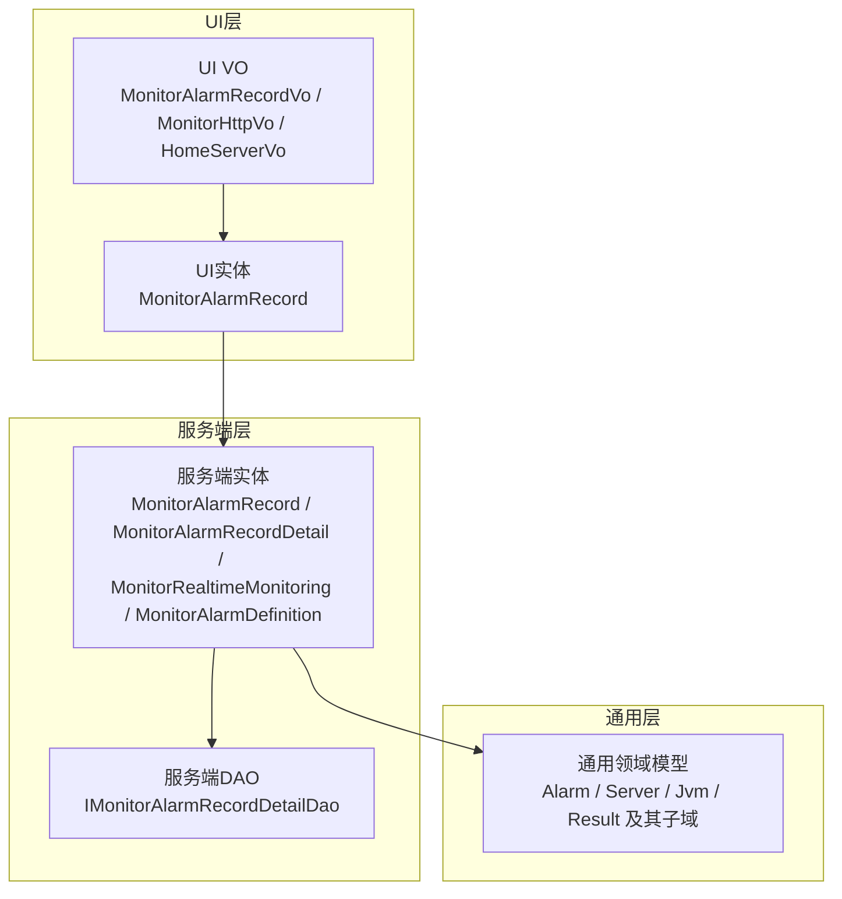
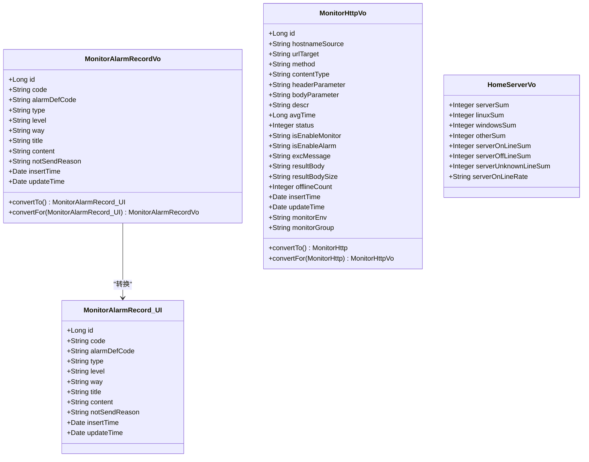
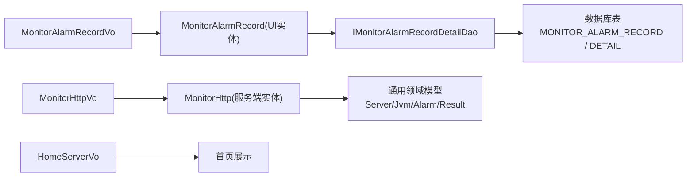

# 数据模型与实体

<cite>
**本文引用的文件**
- [MonitorAlarmRecord.java](file://phoenix-ui/src/main/java/com/gitee/pifeng/monitoring/ui/business/web/entity/MonitorAlarmRecord.java)
- [MonitorAlarmRecordVo.java](file://phoenix-ui/src/main/java/com/gitee/pifeng/monitoring/ui/business/web/vo/MonitorAlarmRecordVo.java)
- [MonitorHttpVo.java](file://phoenix-ui/src/main/java/com/gitee/pifeng/monitoring/ui/business/web/vo/MonitorHttpVo.java)
- [HomeServerVo.java](file://phoenix-ui/src/main/java/com/gitee/pifeng/monitoring/ui/business/web/vo/HomeServerVo.java)
- [MonitorAlarmRecord.java](file://phoenix-server/src/main/java/com/gitee/pifeng/monitoring/server/business/server/entity/MonitorAlarmRecord.java)
- [MonitorAlarmRecordDetail.java](file://phoenix-server/src/main/java/com/gitee/pifeng/monitoring/server/business/server/entity/MonitorAlarmRecordDetail.java)
- [IMonitorAlarmRecordDetailDao.java](file://phoenix-server/src/main/java/com/gitee/pifeng/monitoring/server/business/server/dao/IMonitorAlarmRecordDetailDao.java)
- [MonitorRealtimeMonitoring.java](file://phoenix-server/src/main/java/com/gitee/pifeng/monitoring/server/business/server/entity/MonitorRealtimeMonitoring.java)
- [MonitorAlarmDefinition.java](file://phoenix-server/src/main/java/com/gitee/pifeng/monitoring/server/business/server/entity/MonitorAlarmDefinition.java)
- [Alarm.java](file://phoenix-common/phoenix-common-core/src/main/java/com/gitee/pifeng/monitoring/common/domain/Alarm.java)
- [Server.java](file://phoenix-common/phoenix-common-core/src/main/java/com/gitee/pifeng/monitoring/common/domain/Server.java)
- [Jvm.java](file://phoenix-common/phoenix-common-core/src/main/java/com/gitee/pifeng/monitoring/common/domain/Jvm.java)
- [Result.java](file://phoenix-common/phoenix-common-core/src/main/java/com/gitee/pifeng/monitoring/common/domain/Result.java)
- [CpuDomain.java](file://phoenix-common/phoenix-common-core/src/main/java/com/gitee/pifeng/monitoring/common/domain/server/CpuDomain.java)
- [MemoryDomain.java](file://phoenix-common/phoenix-common-core/src/main/java/com/gitee/pifeng/monitoring/common/domain/server/MemoryDomain.java)
- [NetDomain.java](file://phoenix-common/phoenix-common-core/src/main/java/com/gitee/pifeng/monitoring/common/domain/server/NetDomain.java)
- [DiskDomain.java](file://phoenix-common/phoenix-common-core/src/main/java/com/gitee/pifeng/monitoring/common/domain/server/DiskDomain.java)
- [GpuDomain.java](file://phoenix-common/phoenix-common-core/src/main/java/com/gitee/pifeng/monitoring/common/domain/server/GpuDomain.java)
- [ClassLoadingDomain.java](file://phoenix-common/phoenix-common-core/src/main/java/com/gitee/pifeng/monitoring/common/domain/jvm/ClassLoadingDomain.java)
- [MemoryDomain.java](file://phoenix-common/phoenix-common-core/src/main/java/com/gitee/pifeng/monitoring/common/domain/jvm/MemoryDomain.java)
- [GarbageCollectorDomain.java](file://phoenix-common/phoenix-common-core/src/main/java/com/gitee/pifeng/monitoring/common/domain/jvm/GarbageCollectorDomain.java)
- [ThreadDomain.java](file://phoenix-common/phoenix-common-core/src/main/java/com/gitee/pifeng/monitoring/common/domain/jvm/ThreadDomain.java)
- [RuntimeDomain.java](file://phoenix-common/phoenix-common-core/src/main/java/com/gitee/pifeng/monitoring/common/domain/jvm/RuntimeDomain.java)
- [ISuperBean.java](file://phoenix-common/phoenix-common-core/src/main/java/com/gitee/pifeng/monitoring/common/inf/ISuperBean.java)
</cite>

## 目录
1. [简介](#简介)
2. [项目结构](#项目结构)
3. [核心组件](#核心组件)
4. [架构总览](#架构总览)
5. [详细组件分析](#详细组件分析)
6. [依赖分析](#依赖分析)
7. [性能考虑](#性能考虑)
8. [故障排查指南](#故障排查指南)
9. [结论](#结论)
10. [附录](#附录)

## 简介
本文件面向UI端数据模型与实体，系统性梳理监控实体类与VO值对象的设计与实现，覆盖以下主题：
- 监控实体类：MonitorServer服务器实体、MonitorHttp HTTP监控实体、MonitorAlarmRecord告警记录实体等核心数据模型的字段定义、数据类型、约束条件与业务含义。
- VO值对象：MonitorServerVo、MonitorHttpVo等用于前端展示的数据封装，包含转换逻辑与导出标注。
- ORM映射：MyBatis Plus注解使用、字段映射策略、主键生成策略等。
- 扩展指南：新增监控指标、自定义数据结构、数据验证规则等扩展方案。

## 项目结构
UI端数据模型主要位于phoenix-ui模块的entity与vo包中，同时与phoenix-server模块的实体以及phoenix-common模块的通用领域模型存在交互关系。整体采用“UI实体—UI VO—服务端实体—通用领域模型”的分层映射。

**图表来源**
- [MonitorAlarmRecord.java:1-82](file://phoenix-ui/src/main/java/com/gitee/pifeng/monitoring/ui/business/web/entity/MonitorAlarmRecord.java#L1-L82)
- [MonitorAlarmRecordVo.java:1-114](file://phoenix-ui/src/main/java/com/gitee/pifeng/monitoring/ui/business/web/vo/MonitorAlarmRecordVo.java#L1-L114)
- [MonitorHttpVo.java:1-131](file://phoenix-ui/src/main/java/com/gitee/pifeng/monitoring/ui/business/web/vo/MonitorHttpVo.java#L1-L131)
- [HomeServerVo.java:1-52](file://phoenix-ui/src/main/java/com/gitee/pifeng/monitoring/ui/business/web/vo/HomeServerVo.java#L1-L52)
- [MonitorAlarmRecord.java:1-62](file://phoenix-server/src/main/java/com/gitee/pifeng/monitoring/server/business/server/entity/MonitorAlarmRecord.java#L1-L62)
- [MonitorAlarmRecordDetail.java:1-61](file://phoenix-server/src/main/java/com/gitee/pifeng/monitoring/server/business/server/entity/MonitorAlarmRecordDetail.java#L1-L61)
- [IMonitorAlarmRecordDetailDao.java:1-16](file://phoenix-server/src/main/java/com/gitee/pifeng/monitoring/server/business/server/dao/IMonitorAlarmRecordDetailDao.java#L1-L16)
- [Alarm.java:1-200](file://phoenix-common/phoenix-common-core/src/main/java/com/gitee/pifeng/monitoring/common/domain/Alarm.java#L1-L200)
- [Server.java:1-200](file://phoenix-common/phoenix-common-core/src/main/java/com/gitee/pifeng/monitoring/common/domain/Server.java#L1-L200)
- [Jvm.java:1-200](file://phoenix-common/phoenix-common-core/src/main/java/com/gitee/pifeng/monitoring/common/domain/Jvm.java#L1-L200)

**章节来源**
- [MonitorAlarmRecord.java:1-82](file://phoenix-ui/src/main/java/com/gitee/pifeng/monitoring/ui/business/web/entity/MonitorAlarmRecord.java#L1-L82)
- [MonitorAlarmRecordVo.java:1-114](file://phoenix-ui/src/main/java/com/gitee/pifeng/monitoring/ui/business/web/vo/MonitorAlarmRecordVo.java#L1-L114)
- [MonitorHttpVo.java:1-131](file://phoenix-ui/src/main/java/com/gitee/pifeng/monitoring/ui/business/web/vo/MonitorHttpVo.java#L1-L131)
- [HomeServerVo.java:1-52](file://phoenix-ui/src/main/java/com/gitee/pifeng/monitoring/ui/business/web/vo/HomeServerVo.java#L1-L52)
- [MonitorAlarmRecord.java:1-62](file://phoenix-server/src/main/java/com/gitee/pifeng/monitoring/server/business/server/entity/MonitorAlarmRecord.java#L1-L62)
- [MonitorAlarmRecordDetail.java:1-61](file://phoenix-server/src/main/java/com/gitee/pifeng/monitoring/server/business/server/entity/MonitorAlarmRecordDetail.java#L1-L61)
- [IMonitorAlarmRecordDetailDao.java:1-16](file://phoenix-server/src/main/java/com/gitee/pifeng/monitoring/server/business/server/dao/IMonitorAlarmRecordDetailDao.java#L1-L16)
- [Alarm.java:1-200](file://phoenix-common/phoenix-common-core/src/main/java/com/gitee/pifeng/monitoring/common/domain/Alarm.java#L1-L200)
- [Server.java:1-200](file://phoenix-common/phoenix-common-core/src/main/java/com/gitee/pifeng/monitoring/common/domain/Server.java#L1-L200)
- [Jvm.java:1-200](file://phoenix-common/phoenix-common-core/src/main/java/com/gitee/pifeng/monitoring/common/domain/Jvm.java#L1-L200)

## 核心组件
本节聚焦UI端的核心数据模型与VO，说明其职责、字段与约束，并给出与服务端实体的映射关系。

- UI实体：MonitorAlarmRecord
  - 用途：承载告警记录在UI侧的持久化模型，用于与服务端交互及前端展示。
  - 关键字段：主键ID、告警代码、告警定义编码、告警类型、告警级别、告警方式、标题、内容、未发送原因、插入时间、更新时间。
  - 约束与注解：使用MyBatis Plus注解进行表映射与主键自增；对长整型ID使用JSON序列化为字符串避免精度丢失；字段均带有Swagger文档注解。
  - 业务含义：用于记录一次告警事件的元数据，便于查询、统计与导出。

- UI VO：MonitorAlarmRecordVo
  - 用途：面向前端展示与导出的值对象，包含Excel导出标注与日期格式化。
  - 转换方法：提供convertTo与convertFor方法，基于BeanUtils实现与UI实体的双向转换。
  - 字段映射：与UI实体字段一一对应，部分字段提供下拉替换映射（如告警类型、级别），便于前端显示与导出。

- UI VO：MonitorHttpVo
  - 用途：HTTP监控的前端展示值对象，包含请求来源、目标URL、方法、媒体类型、请求头/体、描述、平均响应时间、状态、监控开关、异常信息、结果内容与大小、离线次数、时间戳、监控环境与分组等。
  - 转换方法：提供convertTo与convertFor方法，支持与服务端MonitorHttp实体的转换。

- UI VO：HomeServerVo
  - 用途：首页服务器概览的聚合值对象，包含服务器总数、Linux/Windows/其他数量、在线/离线/未知数量与在线率。
  - 设计理念：以轻量聚合数据支撑首页仪表盘展示，减少多次查询与复杂计算。

**章节来源**
- [MonitorAlarmRecord.java:1-82](file://phoenix-ui/src/main/java/com/gitee/pifeng/monitoring/ui/business/web/entity/MonitorAlarmRecord.java#L1-L82)
- [MonitorAlarmRecordVo.java:1-114](file://phoenix-ui/src/main/java/com/gitee/pifeng/monitoring/ui/business/web/vo/MonitorAlarmRecordVo.java#L1-L114)
- [MonitorHttpVo.java:1-131](file://phoenix-ui/src/main/java/com/gitee/pifeng/monitoring/ui/business/web/vo/MonitorHttpVo.java#L1-L131)
- [HomeServerVo.java:1-52](file://phoenix-ui/src/main/java/com/gitee/pifeng/monitoring/ui/business/web/vo/HomeServerVo.java#L1-L52)

## 架构总览
UI端数据模型通过VO与实体解耦，VO负责前端展示与导出，实体负责持久化与跨模块交互。服务端实体与DAO进一步对接数据库，通用领域模型提供跨模块共享的业务语义。

**图表来源**
- [MonitorAlarmRecord.java:1-82](file://phoenix-ui/src/main/java/com/gitee/pifeng/monitoring/ui/business/web/entity/MonitorAlarmRecord.java#L1-L82)
- [MonitorAlarmRecordVo.java:1-114](file://phoenix-ui/src/main/java/com/gitee/pifeng/monitoring/ui/business/web/vo/MonitorAlarmRecordVo.java#L1-L114)
- [MonitorHttpVo.java:1-131](file://phoenix-ui/src/main/java/com/gitee/pifeng/monitoring/ui/business/web/vo/MonitorHttpVo.java#L1-L131)
- [HomeServerVo.java:1-52](file://phoenix-ui/src/main/java/com/gitee/pifeng/monitoring/ui/business/web/vo/HomeServerVo.java#L1-L52)

## 详细组件分析

### MonitorAlarmRecord 告警记录实体（UI侧）
- 表映射：@TableName("MONITOR_ALARM_RECORD")，字段通过@TableField映射到数据库列。
- 主键策略：@TableId(value = "ID", type = IdType.AUTO)，自增主键。
- JSON序列化：对长整型ID使用@JsonSerialize(using = ToStringSerializer.class)避免前后端精度问题。
- 字段约束：各字段均带有@Schema描述，便于接口文档生成与前端理解。
- 业务含义：记录一次告警事件的关键元数据，支持按类型、级别、方式、时间等维度查询与统计。

**章节来源**
- [MonitorAlarmRecord.java:1-82](file://phoenix-ui/src/main/java/com/gitee/pifeng/monitoring/ui/business/web/entity/MonitorAlarmRecord.java#L1-L82)

### MonitorAlarmRecordVo 告警记录视图对象（UI侧）
- Excel导出：使用@cn.afterturn.easypoi.excel.annotation.Excel标注，包含列名、排序与替换映射，提升导出可读性。
- 日期格式：使用@JsonFormat(pattern = "yyyy-MM-dd HH:mm:ss", timezone = "GMT+8")统一前端展示格式。
- 转换逻辑：convertTo与convertFor通过BeanUtils完成与UI实体的双向拷贝，保证VO与实体的一致性。
- 业务含义：面向前端展示与导出的轻量数据载体，屏蔽底层实体细节。

**章节来源**
- [MonitorAlarmRecordVo.java:1-114](file://phoenix-ui/src/main/java/com/gitee/pifeng/monitoring/ui/business/web/vo/MonitorAlarmRecordVo.java#L1-L114)

### MonitorHttpVo HTTP监控视图对象（UI侧）
- 字段覆盖：包含HTTP监控的来源、目标、方法、媒体类型、请求参数、描述、平均响应时间、状态、监控/告警开关、异常信息、结果内容与大小、离线次数、时间戳、监控环境与分组等。
- 转换逻辑：提供convertTo与convertFor，支持与服务端MonitorHttp实体的转换。
- 业务含义：用于HTTP监控项的前端展示与编辑，支撑用户配置与可视化分析。

**章节来源**
- [MonitorHttpVo.java:1-131](file://phoenix-ui/src/main/java/com/gitee/pifeng/monitoring/ui/business/web/vo/MonitorHttpVo.java#L1-L131)

### HomeServerVo 首页服务器概览（UI侧）
- 字段覆盖：服务器总数、Linux/Windows/其他数量、在线/离线/未知数量与在线率。
- 设计理念：以聚合数据支撑首页仪表盘，降低后端压力与前端渲染复杂度。

**章节来源**
- [HomeServerVo.java:1-52](file://phoenix-ui/src/main/java/com/gitee/pifeng/monitoring/ui/business/web/vo/HomeServerVo.java#L1-L52)

### 服务端实体与DAO（补充说明）
- MonitorAlarmRecord（服务端）：与UI实体字段一致，但可能包含更多内部字段或更新策略，例如@FieldStrategy.IGNORED用于特定字段的更新控制。
- MonitorAlarmRecordDetail（服务端）：告警记录详情，包含告警代码、方式、接收人、发送状态等。
- IMonitorAlarmRecordDetailDao（服务端）：继承BaseMapper，提供基础CRUD能力。
- MonitorRealtimeMonitoring（服务端）：实时监控表，记录监控类型、子类型、编号、告警主体ID、是否已发送告警、时间戳等。
- MonitorAlarmDefinition（服务端）：告警定义表，包含类型、分类、级别、编码等。

这些实体与DAO共同构成服务端对告警与监控数据的持久化与查询能力，UI VO通过服务端接口获取数据并进行展示。

**章节来源**
- [MonitorAlarmRecord.java:1-62](file://phoenix-server/src/main/java/com/gitee/pifeng/monitoring/server/business/server/entity/MonitorAlarmRecord.java#L1-L62)
- [MonitorAlarmRecordDetail.java:1-61](file://phoenix-server/src/main/java/com/gitee/pifeng/monitoring/server/business/server/entity/MonitorAlarmRecordDetail.java#L1-L61)
- [IMonitorAlarmRecordDetailDao.java:1-16](file://phoenix-server/src/main/java/com/gitee/pifeng/monitoring/server/business/server/dao/IMonitorAlarmRecordDetailDao.java#L1-L16)
- [MonitorRealtimeMonitoring.java:1-77](file://phoenix-server/src/main/java/com/gitee/pifeng/monitoring/server/business/server/entity/MonitorRealtimeMonitoring.java#L1-L77)
- [MonitorAlarmDefinition.java:1-67](file://phoenix-server/src/main/java/com/gitee/pifeng/monitoring/server/business/server/entity/MonitorAlarmDefinition.java#L1-L67)

### 通用领域模型（补充说明）
- Alarm：通用告警领域对象，提供告警相关属性与方法。
- Server：通用服务器领域对象，包含CPU、内存、网络、磁盘、GPU等子域。
- Jvm：通用JVM领域对象，包含类加载、内存、垃圾回收、线程、运行时等子域。
- Result：通用返回结果对象，用于统一接口返回结构。

这些通用模型为UI与服务端提供一致的业务语义，确保跨模块协作的稳定性。

**章节来源**
- [Alarm.java:1-200](file://phoenix-common/phoenix-common-core/src/main/java/com/gitee/pifeng/monitoring/common/domain/Alarm.java#L1-L200)
- [Server.java:1-200](file://phoenix-common/phoenix-common-core/src/main/java/com/gitee/pifeng/monitoring/common/domain/Server.java#L1-L200)
- [Jvm.java:1-200](file://phoenix-common/phoenix-common-core/src/main/java/com/gitee/pifeng/monitoring/common/domain/Jvm.java#L1-L200)
- [Result.java:1-200](file://phoenix-common/phoenix-common-core/src/main/java/com/gitee/pifeng/monitoring/common/domain/Result.java#L1-L200)
- [CpuDomain.java:1-200](file://phoenix-common/phoenix-common-core/src/main/java/com/gitee/pifeng/monitoring/common/domain/server/CpuDomain.java#L1-L200)
- [MemoryDomain.java:1-200](file://phoenix-common/phoenix-common-core/src/main/java/com/gitee/pifeng/monitoring/common/domain/server/MemoryDomain.java#L1-L200)
- [NetDomain.java:1-200](file://phoenix-common/phoenix-common-core/src/main/java/com/gitee/pifeng/monitoring/common/domain/server/NetDomain.java#L1-L200)
- [DiskDomain.java:1-200](file://phoenix-common/phoenix-common-core/src/main/java/com/gitee/pifeng/monitoring/common/domain/server/DiskDomain.java#L1-L200)
- [GpuDomain.java:1-200](file://phoenix-common/phoenix-common-core/src/main/java/com/gitee/pifeng/monitoring/common/domain/server/GpuDomain.java#L1-L200)
- [ClassLoadingDomain.java:1-200](file://phoenix-common/phoenix-common-core/src/main/java/com/gitee/pifeng/monitoring/common/domain/jvm/ClassLoadingDomain.java#L1-L200)
- [MemoryDomain.java:1-200](file://phoenix-common/phoenix-common-core/src/main/java/com/gitee/pifeng/monitoring/common/domain/jvm/MemoryDomain.java#L1-L200)
- [GarbageCollectorDomain.java:1-200](file://phoenix-common/phoenix-common-core/src/main/java/com/gitee/pifeng/monitoring/common/domain/jvm/GarbageCollectorDomain.java#L1-L200)
- [ThreadDomain.java:1-200](file://phoenix-common/phoenix-common-core/src/main/java/com/gitee/pifeng/monitoring/common/domain/jvm/ThreadDomain.java#L1-L200)
- [RuntimeDomain.java:1-200](file://phoenix-common/phoenix-common-core/src/main/java/com/gitee/pifeng/monitoring/common/domain/jvm/RuntimeDomain.java#L1-L200)

## 依赖分析
UI VO与实体之间的依赖关系清晰，VO作为UI侧的门面，通过转换方法与实体互通；服务端实体与DAO负责数据持久化；通用领域模型提供跨模块共享的业务语义。

**图表来源**
- [MonitorAlarmRecordVo.java:1-114](file://phoenix-ui/src/main/java/com/gitee/pifeng/monitoring/ui/business/web/vo/MonitorAlarmRecordVo.java#L1-L114)
- [MonitorAlarmRecord.java:1-82](file://phoenix-ui/src/main/java/com/gitee/pifeng/monitoring/ui/business/web/entity/MonitorAlarmRecord.java#L1-L82)
- [MonitorHttpVo.java:1-131](file://phoenix-ui/src/main/java/com/gitee/pifeng/monitoring/ui/business/web/vo/MonitorHttpVo.java#L1-L131)
- [IMonitorAlarmRecordDetailDao.java:1-16](file://phoenix-server/src/main/java/com/gitee/pifeng/monitoring/server/business/server/dao/IMonitorAlarmRecordDetailDao.java#L1-L16)
- [MonitorAlarmRecord.java:1-62](file://phoenix-server/src/main/java/com/gitee/pifeng/monitoring/server/business/server/entity/MonitorAlarmRecord.java#L1-L62)
- [MonitorAlarmRecordDetail.java:1-61](file://phoenix-server/src/main/java/com/gitee/pifeng/monitoring/server/business/server/entity/MonitorAlarmRecordDetail.java#L1-L61)
- [Alarm.java:1-200](file://phoenix-common/phoenix-common-core/src/main/java/com/gitee/pifeng/monitoring/common/domain/Alarm.java#L1-L200)
- [Server.java:1-200](file://phoenix-common/phoenix-common-core/src/main/java/com/gitee/pifeng/monitoring/common/domain/Server.java#L1-L200)
- [Jvm.java:1-200](file://phoenix-common/phoenix-common-core/src/main/java/com/gitee/pifeng/monitoring/common/domain/Jvm.java#L1-L200)
- [Result.java:1-200](file://phoenix-common/phoenix-common-core/src/main/java/com/gitee/pifeng/monitoring/common/domain/Result.java#L1-L200)

**章节来源**
- [MonitorAlarmRecordVo.java:1-114](file://phoenix-ui/src/main/java/com/gitee/pifeng/monitoring/ui/business/web/vo/MonitorAlarmRecordVo.java#L1-L114)
- [MonitorAlarmRecord.java:1-82](file://phoenix-ui/src/main/java/com/gitee/pifeng/monitoring/ui/business/web/entity/MonitorAlarmRecord.java#L1-L82)
- [MonitorHttpVo.java:1-131](file://phoenix-ui/src/main/java/com/gitee/pifeng/monitoring/ui/business/web/vo/MonitorHttpVo.java#L1-L131)
- [IMonitorAlarmRecordDetailDao.java:1-16](file://phoenix-server/src/main/java/com/gitee/pifeng/monitoring/server/business/server/dao/IMonitorAlarmRecordDetailDao.java#L1-L16)
- [MonitorAlarmRecord.java:1-62](file://phoenix-server/src/main/java/com/gitee/pifeng/monitoring/server/business/server/entity/MonitorAlarmRecord.java#L1-L62)
- [MonitorAlarmRecordDetail.java:1-61](file://phoenix-server/src/main/java/com/gitee/pifeng/monitoring/server/business/server/entity/MonitorAlarmRecordDetail.java#L1-L61)
- [Alarm.java:1-200](file://phoenix-common/phoenix-common-core/src/main/java/com/gitee/pifeng/monitoring/common/domain/Alarm.java#L1-L200)
- [Server.java:1-200](file://phoenix-common/phoenix-common-core/src/main/java/com/gitee/pifeng/monitoring/common/domain/Server.java#L1-L200)
- [Jvm.java:1-200](file://phoenix-common/phoenix-common-core/src/main/java/com/gitee/pifeng/monitoring/common/domain/Jvm.java#L1-L200)
- [Result.java:1-200](file://phoenix-common/phoenix-common-core/src/main/java/com/gitee/pifeng/monitoring/common/domain/Result.java#L1-L200)

## 性能考虑
- VO导出优化：使用Easypoi的Excel标注与统一日期格式，减少前端二次处理开销。
- JSON序列化：对长整型ID进行字符串序列化，避免大数精度问题，提升前后端一致性。
- 字段映射策略：服务端实体对敏感字段使用更新策略控制，避免误更新导致的性能与一致性问题。
- 聚合VO：HomeServerVo等聚合VO减少多次查询与复杂计算，提升首页渲染性能。

[本节为通用指导，无需列出具体文件来源]

## 故障排查指南
- VO与实体不一致：检查convertTo/convertFor方法是否遗漏字段或类型不匹配。
- 导出列名与格式异常：确认Excel标注与日期格式化注解是否正确配置。
- ID精度问题：确认是否对长整型ID使用字符串序列化。
- 数据库映射异常：核对@TableName与@TableField是否与数据库表结构一致。

**章节来源**
- [MonitorAlarmRecordVo.java:1-114](file://phoenix-ui/src/main/java/com/gitee/pifeng/monitoring/ui/business/web/vo/MonitorAlarmRecordVo.java#L1-L114)
- [MonitorHttpVo.java:1-131](file://phoenix-ui/src/main/java/com/gitee/pifeng/monitoring/ui/business/web/vo/MonitorHttpVo.java#L1-L131)
- [MonitorAlarmRecord.java:1-82](file://phoenix-ui/src/main/java/com/gitee/pifeng/monitoring/ui/business/web/entity/MonitorAlarmRecord.java#L1-L82)

## 结论
本文系统梳理了UI端数据模型与实体的设计与实现，明确了VO与实体的职责边界、字段定义与约束、ORM映射策略以及与服务端与通用领域的交互关系。通过标准化的转换方法与注解配置，确保了前端展示、导出与后端持久化的高一致性与可维护性。

[本节为总结性内容，无需列出具体文件来源]

## 附录

### ORM映射与注解要点
- 表映射：@TableName指定表名，@TableId/@TableField映射主键与字段。
- 主键策略：IdType.AUTO自增主键，适用于UI与服务端实体。
- JSON序列化：@JsonSerialize(using = ToStringSerializer.class)用于长整型ID。
- Swagger文档：@Schema提供字段描述，便于接口文档生成。
- Excel导出：@Excel提供列名、排序与替换映射，提升导出可读性。
- 更新策略：@FieldStrategy.IGNORED用于控制特定字段的更新行为。

**章节来源**
- [MonitorAlarmRecord.java:1-82](file://phoenix-ui/src/main/java/com/gitee/pifeng/monitoring/ui/business/web/entity/MonitorAlarmRecord.java#L1-L82)
- [MonitorAlarmRecordVo.java:1-114](file://phoenix-ui/src/main/java/com/gitee/pifeng/monitoring/ui/business/web/vo/MonitorAlarmRecordVo.java#L1-L114)
- [MonitorHttpVo.java:1-131](file://phoenix-ui/src/main/java/com/gitee/pifeng/monitoring/ui/business/web/vo/MonitorHttpVo.java#L1-L131)

### 扩展指南
- 新增监控指标：在UI VO中添加对应字段，使用@Excel与@Schema标注；在convertTo/convertFor中同步映射；在服务端实体中增加相应字段并完善DAO与SQL。
- 自定义数据结构：遵循ISuperBean接口约定，保持转换方法与字段一致性；确保JSON序列化与导出标注完整。
- 数据验证规则：结合Spring Validation或自定义校验器，在VO层增加校验注解，保证输入数据的合法性与一致性。

**章节来源**
- [ISuperBean.java:1-200](file://phoenix-common/phoenix-common-core/src/main/java/com/gitee/pifeng/monitoring/common/inf/ISuperBean.java#L1-L200)