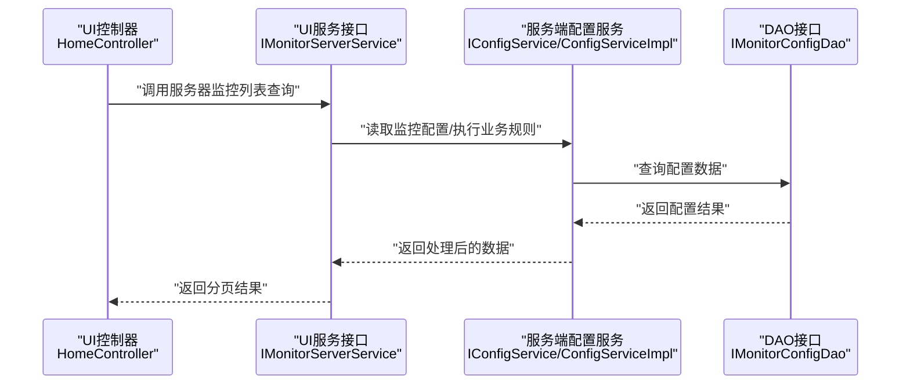

# 服务层与业务逻辑

<cite>
**本文引用的文件**
- [IMonitorServerService.java](file://phoenix-ui/src/main/java/com/gitee/pifeng/monitoring/ui/business/web/service/IMonitorServerService.java)
- [IMonitorHttpService.java](file://phoenix-ui/src/main/java/com/gitee/pifeng/monitoring/ui/business/web/service/IMonitorHttpService.java)
- [IMonitorAlarmRecordService.java](file://phoenix-ui/src/main/java/com/gitee/pifeng/monitoring/ui/business/web/service/IMonitorAlarmRecordService.java)
- [IMonitorAlarmRecordDetailService.java](file://phoenix-ui/src/main/java/com/gitee/pifeng/monitoring/ui/business/web/service/IMonitorAlarmRecordDetailService.java)
- [IMonitorNetService.java](file://phoenix-ui/src/main/java/com/gitee/pifeng/monitoring/ui/business/web/service/IMonitorNetService.java)
- [IMonitorDbService.java](file://phoenix-ui/src/main/java/com/gitee/pifeng/monitoring/ui/business/web/service/IMonitorDbService.java)
- [IMonitorTcpService.java](file://phoenix-ui/src/main/java/com/gitee/pifeng/monitoring/ui/business/web/service/IMonitorTcpService.java)
- [HomeController.java](file://phoenix-ui/src/main/java/com/gitee/pifeng/monitoring/ui/business/web/controller/HomeController.java)
- [IMonitorConfigDao.java](file://phoenix-server/src/main/java/com/gitee/pifeng/monitoring/server/business/server/dao/IMonitorConfigDao.java)
- [IConfigService.java](file://phoenix-server/src/main/java/com/gitee/pifeng/monitoring/server/business/server/service/IConfigService.java)
- [ConfigServiceImpl.java](file://phoenix-server/src/main/java/com/gitee/pifeng/monitoring/server/business/server/service/impl/ConfigServiceImpl.java)
- [AlarmRecordServiceImpl.java](file://phoenix-server/src/main/java/com/gitee/pifeng/monitoring/server/business/server/service/impl/AlarmRecordServiceImpl.java)
- [AlarmRecordDetailServiceImpl.java](file://phoenix-server/src/main/java/com/gitee/pifeng/monitoring/server/business/server/service/impl/AlarmRecordDetailServiceImpl.java)
- [AlarmDefinitionServiceImpl.java](file://phoenix-server/src/main/java/com/gitee/pifeng/monitoring/server/business/server/service/impl/AlarmDefinitionServiceImpl.java)
- [DbInfo4MongoServiceImpl.java](file://phoenix-server/src/main/java/com/gitee/pifeng/monitoring/server/business/server/service/impl/DbInfo4MongoServiceImpl.java)
- [DbInfo4RedisServiceImpl.java](file://phoenix-server/src/main/java/com/gitee/pifeng/monitoring/server/business/server/service/impl/DbInfo4RedisServiceImpl.java)
- [DbServiceImpl.java](file://phoenix-server/src/main/java/com/gitee/pifeng/monitoring/server/business/server/service/impl/DbServiceImpl.java)
- [DbSession4MysqlServiceImpl.java](file://phoenix-server/src/main/java/com/gitee/pifeng/monitoring/server/business/server/service/impl/DbSession4MysqlServiceImpl.java)
- [DbSession4OracleServiceImpl.java](file://phoenix-server/src/main/java/com/gitee/pifeng/monitoring/server/business/server/service/impl/DbSession4OracleServiceImpl.java)
- [DbTableSpace4OracleServiceImpl.java](file://phoenix-server/src/main/java/com/gitee/pifeng/monitoring/server/business/server/service/impl/DbTableSpace4OracleServiceImpl.java)
- [HeartbeatServiceImpl.java](file://phoenix-server/src/main/java/com/gitee/pifeng/monitoring/server/business/server/service/impl/HeartbeatServiceImpl.java)
- [HttpServiceImpl.java](file://phoenix-agent/src/main/java/com/gitee/pifeng/monitoring/agent/business/server/service/impl/HttpServiceImpl.java)
- [ServerServiceImpl.java](file://phoenix-agent/src/main/java/com/gitee/pifeng/monitoring/agent/business/server/service/impl/ServerServiceImpl.java)
- [JvmServiceImpl.java](file://phoenix-agent/src/main/java/com/gitee/pifeng/monitoring/agent/business/server/service/impl/JvmServiceImpl.java)
- [AlarmServiceImpl.java](file://phoenix-agent/src/main/java/com/gitee/pifeng/monitoring/agent/business/server/service/impl/AlarmServiceImpl.java)
- [BaseRequestPackageServiceImpl.java](file://phoenix-agent/src/main/java/com/gitee/pifeng/monitoring/agent/business/server/service/impl/BaseRequestPackageServiceImpl.java)
- [OfflineServiceImpl.java](file://phoenix-agent/src/main/java/com/gitee/pifeng/monitoring/agent/business/server/service/impl/OfflineServiceImpl.java)
- [HeartbeatServiceImpl.java](file://phoenix-agent/src/main/java/com/gitee/pifeng/monitoring/agent/business/server/service/impl/HeartbeatServiceImpl.java)
- [AlarmServiceImpl.java](file://phoenix-agent/src/main/java/com/gitee/pifeng/monitoring/agent/business/client/service/impl/AlarmServiceImpl.java)
- [BaseRequestPackageServiceImpl.java](file://phoenix-agent/src/main/java/com/gitee/pifeng/monitoring/agent/business/client/service/impl/BaseRequestPackageServiceImpl.java)
- [OfflineServiceImpl.java](file://phoenix-agent/src/main/java/com/gitee/pifeng/monitoring/agent/business/client/service/impl/OfflineServiceImpl.java)
- [ServerServiceImpl.java](file://phoenix-agent/src/main/java/com/gitee/pifeng/monitoring/agent/business/client/service/impl/ServerServiceImpl.java)
- [JvmServiceImpl.java](file://phoenix-agent/src/main/java/com/gitee/pifeng/monitoring/agent/business/client/service/impl/JvmServiceImpl.java)
- [HeartbeatServiceImpl.java](file://phoenix-agent/src/main/java/com/gitee/pifeng/monitoring/agent/business/client/service/impl/HeartbeatServiceImpl.java)
</cite>

## 目录
1. [引言](#引言)
2. [项目结构](#项目结构)
3. [核心组件](#核心组件)
4. [架构总览](#架构总览)
5. [详细组件分析](#详细组件分析)
6. [依赖分析](#依赖分析)
7. [性能考虑](#性能考虑)
8. [故障排查指南](#故障排查指南)
9. [结论](#结论)
10. [附录](#附录)

## 引言
本文件聚焦于Phoenix项目UI端服务层与业务逻辑，系统性梳理UI端控制器与服务层的职责边界、数据获取策略、业务规则校验、数据转换与异常处理流程，并结合服务层与数据访问层(MyBatis-Plus)的交互模式，总结事务管理、缓存与性能优化等企业级实践。同时，给出扩展机制与测试策略建议，帮助开发者在保持高内聚低耦合的前提下快速迭代新功能。

## 项目结构
Phoenix采用多模块架构，UI端位于phoenix-ui模块，服务层主要由若干接口与实现类组成，配合MyBatis-Plus的IService/ServiceImpl模式进行数据访问。UI端控制器通过@Autowired注入各服务接口，形成清晰的控制-服务-数据访问分层。

```mermaid
graph TB
subgraph "UI端(phoenix-ui)"
HC["HomeController<br/>控制器"]
SVC_S["IMonitorServerService<br/>服务器监控服务接口"]
SVC_H["IMonitorHttpService<br/>HTTP监控服务接口"]
SVC_AR["IMonitorAlarmRecordService<br/>告警记录服务接口"]
SVC_ARD["IMonitorAlarmRecordDetailService<br/>告警记录详情服务接口"]
SVC_NET["IMonitorNetService<br/>网络监控服务接口"]
SVC_DB["IMonitorDbService<br/>数据库监控服务接口"]
SVC_TCP["IMonitorTcpService<br/>TCP监控服务接口"]
end
subgraph "服务端(phoenix-server)"
DAO_CFG["IMonitorConfigDao<br/>配置DAO"]
SVC_CFG["IConfigService / ConfigServiceImpl<br/>配置服务"]
SVC_ALARM_R["AlarmRecordServiceImpl<br/>告警记录实现"]
SVC_ALARM_RD["AlarmRecordDetailServiceImpl<br/>告警记录详情实现"]
SVC_ALARM_DEF["AlarmDefinitionServiceImpl<br/>告警定义实现"]
SVC_DB_MONGO["DbInfo4MongoServiceImpl<br/>MongoDB信息实现"]
SVC_DB_REDIS["DbInfo4RedisServiceImpl<br/>Redis信息实现"]
SVC_DB_BASE["DbServiceImpl<br/>数据库通用实现"]
SVC_DB_MY["DbSession4MysqlServiceImpl<br/>MySQL会话实现"]
SVC_DB_ORA["DbSession4OracleServiceImpl<br/>Oracle会话实现"]
SVC_DB_TS["DbTableSpace4OracleServiceImpl<br/>Oracle表空间实现"]
SVC_HEART["HeartbeatServiceImpl<br/>心跳实现"]
end
subgraph "Agent端(phoenix-agent)"
SVC_A_HTTP["HttpServiceImpl<br/>HTTP采集实现"]
SVC_A_SRV["ServerServiceImpl<br/>服务器采集实现"]
SVC_A_JVM["JvmServiceImpl<br/>JVM采集实现"]
SVC_A_ALARM["AlarmServiceImpl<br/>告警实现"]
SVC_A_REQ["BaseRequestPackageServiceImpl<br/>请求包实现"]
SVC_A_OFF["OfflineServiceImpl<br/>离线实现"]
SVC_A_HEART["HeartbeatServiceImpl<br/>心跳实现"]
end
HC --> SVC_S
HC --> SVC_H
HC --> SVC_AR
HC --> SVC_ARD
HC --> SVC_NET
HC --> SVC_DB
HC --> SVC_TCP
SVC_S -.-> DAO_CFG
SVC_H -.-> DAO_CFG
SVC_AR -.-> DAO_CFG
SVC_ARD -.-> DAO_CFG
SVC_NET -.-> DAO_CFG
SVC_DB -.-> DAO_CFG
SVC_TCP -.-> DAO_CFG
SVC_CFG --> DAO_CFG
SVC_ALARM_R --> DAO_CFG
SVC_ALARM_RD --> DAO_CFG
SVC_ALARM_DEF --> DAO_CFG
SVC_DB_MONGO --> DAO_CFG
SVC_DB_REDIS --> DAO_CFG
SVC_DB_BASE --> DAO_CFG
SVC_DB_MY --> DAO_CFG
SVC_DB_ORA --> DAO_CFG
SVC_DB_TS --> DAO_CFG
SVC_HEART --> DAO_CFG
SVC_A_HTTP --> DAO_CFG
SVC_A_SRV --> DAO_CFG
SVC_A_JVM --> DAO_CFG
SVC_A_ALARM --> DAO_CFG
SVC_A_REQ --> DAO_CFG
SVC_A_OFF --> DAO_CFG
SVC_A_HEART --> DAO_CFG
```



图表来源
- [HomeController.java:42-94](file://phoenix-ui/src/main/java/com/gitee/pifeng/monitoring/ui/business/web/controller/HomeController.java#L42-L94)
- [IMonitorServerService.java:44-78](file://phoenix-ui/src/main/java/com/gitee/pifeng/monitoring/ui/business/web/service/IMonitorServerService.java#L44-L78)
- [IMonitorHttpService.java:39-75](file://phoenix-ui/src/main/java/com/gitee/pifeng/monitoring/ui/business/web/service/IMonitorHttpService.java#L39-L75)
- [IMonitorAlarmRecordService.java](file://phoenix-ui/src/main/java/com/gitee/pifeng/monitoring/ui/business/web/service/IMonitorAlarmRecordService.java)
- [IMonitorAlarmRecordDetailService.java](file://phoenix-ui/src/main/java/com/gitee/pifeng/monitoring/ui/business/web/service/IMonitorAlarmRecordDetailService.java)
- [IMonitorNetService.java](file://phoenix-ui/src/main/java/com/gitee/pifeng/monitoring/ui/business/web/service/IMonitorNetService.java)
- [IMonitorDbService.java](file://phoenix-ui/src/main/java/com/gitee/pifeng/monitoring/ui/business/web/service/IMonitorDbService.java)
- [IMonitorTcpService.java](file://phoenix-ui/src/main/java/com/gitee/pifeng/monitoring/ui/business/web/service/IMonitorTcpService.java)
- [IConfigService.java:1-15](file://phoenix-server/src/main/java/com/gitee/pifeng/monitoring/server/business/server/service/IConfigService.java#L1-L15)
- [ConfigServiceImpl.java:1-19](file://phoenix-server/src/main/java/com/gitee/pifeng/monitoring/server/business/server/service/impl/ConfigServiceImpl.java#L1-L19)
- [IMonitorConfigDao.java:1-15](file://phoenix-server/src/main/java/com/gitee/pifeng/monitoring/server/business/server/dao/IMonitorConfigDao.java#L1-L15)
- [AlarmRecordServiceImpl.java](file://phoenix-server/src/main/java/com/gitee/pifeng/monitoring/server/business/server/service/impl/AlarmRecordServiceImpl.java)
- [AlarmRecordDetailServiceImpl.java](file://phoenix-server/src/main/java/com/gitee/pifeng/monitoring/server/business/server/service/impl/AlarmRecordDetailServiceImpl.java)
- [AlarmDefinitionServiceImpl.java](file://phoenix-server/src/main/java/com/gitee/pifeng/monitoring/server/business/server/service/impl/AlarmDefinitionServiceImpl.java)
- [DbInfo4MongoServiceImpl.java](file://phoenix-server/src/main/java/com/gitee/pifeng/monitoring/server/business/server/service/impl/DbInfo4MongoServiceImpl.java)
- [DbInfo4RedisServiceImpl.java](file://phoenix-server/src/main/java/com/gitee/pifeng/monitoring/server/business/server/service/impl/DbInfo4RedisServiceImpl.java)
- [DbServiceImpl.java](file://phoenix-server/src/main/java/com/gitee/pifeng/monitoring/server/business/server/service/impl/DbServiceImpl.java)
- [DbSession4MysqlServiceImpl.java](file://phoenix-server/src/main/java/com/gitee/pifeng/monitoring/server/business/server/service/impl/DbSession4MysqlServiceImpl.java)
- [DbSession4OracleServiceImpl.java](file://phoenix-server/src/main/java/com/gitee/pifeng/monitoring/server/business/server/service/impl/DbSession4OracleServiceImpl.java)
- [DbTableSpace4OracleServiceImpl.java](file://phoenix-server/src/main/java/com/gitee/pifeng/monitoring/server/business/server/service/impl/DbTableSpace4OracleServiceImpl.java)
- [HeartbeatServiceImpl.java](file://phoenix-server/src/main/java/com/gitee/pifeng/monitoring/server/business/server/service/impl/HeartbeatServiceImpl.java)
- [HttpServiceImpl.java](file://phoenix-agent/src/main/java/com/gitee/pifeng/monitoring/agent/business/server/service/impl/HttpServiceImpl.java)
- [ServerServiceImpl.java](file://phoenix-agent/src/main/java/com/gitee/pifeng/monitoring/agent/business/server/service/impl/ServerServiceImpl.java)
- [JvmServiceImpl.java](file://phoenix-agent/src/main/java/com/gitee/pifeng/monitoring/agent/business/server/service/impl/JvmServiceImpl.java)
- [AlarmServiceImpl.java](file://phoenix-agent/src/main/java/com/gitee/pifeng/monitoring/agent/business/server/service/impl/AlarmServiceImpl.java)
- [BaseRequestPackageServiceImpl.java](file://phoenix-agent/src/main/java/com/gitee/pifeng/monitoring/agent/business/server/service/impl/BaseRequestPackageServiceImpl.java)
- [OfflineServiceImpl.java](file://phoenix-agent/src/main/java/com/gitee/pifeng/monitoring/agent/business/server/service/impl/OfflineServiceImpl.java)
- [HeartbeatServiceImpl.java](file://phoenix-agent/src/main/java/com/gitee/pifeng/monitoring/agent/business/server/service/impl/HeartbeatServiceImpl.java)
- [AlarmServiceImpl.java](file://phoenix-agent/src/main/java/com/gitee/pifeng/monitoring/agent/business/client/service/impl/AlarmServiceImpl.java)
- [BaseRequestPackageServiceImpl.java](file://phoenix-agent/src/main/java/com/gitee/pifeng/monitoring/agent/business/client/service/impl/BaseRequestPackageServiceImpl.java)
- [OfflineServiceImpl.java](file://phoenix-agent/src/main/java/com/gitee/pifeng/monitoring/agent/business/client/service/impl/OfflineServiceImpl.java)
- [ServerServiceImpl.java](file://phoenix-agent/src/main/java/com/gitee/pifeng/monitoring/agent/business/client/service/impl/ServerServiceImpl.java)
- [JvmServiceImpl.java](file://phoenix-agent/src/main/java/com/gitee/pifeng/monitoring/agent/business/client/service/impl/JvmServiceImpl.java)
- [HeartbeatServiceImpl.java](file://phoenix-agent/src/main/java/com/gitee/pifeng/monitoring/agent/business/client/service/impl/HeartbeatServiceImpl.java)

章节来源
- [HomeController.java:42-94](file://phoenix-ui/src/main/java/com/gitee/pifeng/monitoring/ui/business/web/controller/HomeController.java#L42-L94)

## 核心组件
本节聚焦UI端服务层的关键接口与实现，涵盖服务器监控、HTTP监控、告警记录、网络、数据库与TCP监控等模块的服务契约与典型实现。

- 服务器监控服务接口
  - 职责：提供服务器监控列表查询、删除、网卡地址获取等能力。
  - 关键方法：分页查询、批量删除、网卡地址获取等。
  - 参考路径：[IMonitorServerService.java:44-78](file://phoenix-ui/src/main/java/com/gitee/pifeng/monitoring/ui/business/web/service/IMonitorServerService.java#L44-L78)

- HTTP监控服务接口
  - 职责：提供HTTP监控目标的列表查询、删除、新增、编辑等能力。
  - 关键方法：分页查询、批量删除、新增、编辑等。
  - 参考路径：[IMonitorHttpService.java:39-75](file://phoenix-ui/src/main/java/com/gitee/pifeng/monitoring/ui/business/web/service/IMonitorHttpService.java#L39-L75)

- 告警记录与详情服务接口
  - 职责：提供告警记录与详情的数据查询、分页展示等。
  - 参考路径：
    - [IMonitorAlarmRecordService.java](file://phoenix-ui/src/main/java/com/gitee/pifeng/monitoring/ui/business/web/service/IMonitorAlarmRecordService.java)
    - [IMonitorAlarmRecordDetailService.java](file://phoenix-ui/src/main/java/com/gitee/pifeng/monitoring/ui/business/web/service/IMonitorAlarmRecordDetailService.java)

- 网络、数据库与TCP监控服务接口
  - 职责：提供网络、数据库、TCP监控目标的查询与管理能力。
  - 参考路径：
    - [IMonitorNetService.java](file://phoenix-ui/src/main/java/com/gitee/pifeng/monitoring/ui/business/web/service/IMonitorNetService.java)
    - [IMonitorDbService.java](file://phoenix-ui/src/main/java/com/gitee/pifeng/monitoring/ui/business/web/service/IMonitorDbService.java)
    - [IMonitorTcpService.java](file://phoenix-ui/src/main/java/com/gitee/pifeng/monitoring/ui/business/web/service/IMonitorTcpService.java)

- 配置服务（服务端）
  - 职责：基于MyBatis-Plus的IService/ServiceImpl模式，提供配置实体的CRUD能力。
  - 接口与实现参考：
    - [IConfigService.java:1-15](file://phoenix-server/src/main/java/com/gitee/pifeng/monitoring/server/business/server/service/IConfigService.java#L1-L15)
    - [ConfigServiceImpl.java:1-19](file://phoenix-server/src/main/java/com/gitee/pifeng/monitoring/server/business/server/service/impl/ConfigServiceImpl.java#L1-L19)
    - [IMonitorConfigDao.java:1-15](file://phoenix-server/src/main/java/com/gitee/pifeng/monitoring/server/business/server/dao/IMonitorConfigDao.java#L1-L15)

章节来源
- [IMonitorServerService.java:44-78](file://phoenix-ui/src/main/java/com/gitee/pifeng/monitoring/ui/business/web/service/IMonitorServerService.java#L44-L78)
- [IMonitorHttpService.java:39-75](file://phoenix-ui/src/main/java/com/gitee/pifeng/monitoring/ui/business/web/service/IMonitorHttpService.java#L39-L75)
- [IMonitorAlarmRecordService.java](file://phoenix-ui/src/main/java/com/gitee/pifeng/monitoring/ui/business/web/service/IMonitorAlarmRecordService.java)
- [IMonitorAlarmRecordDetailService.java](file://phoenix-ui/src/main/java/com/gitee/pifeng/monitoring/ui/business/web/service/IMonitorAlarmRecordDetailService.java)
- [IMonitorNetService.java](file://phoenix-ui/src/main/java/com/gitee/pifeng/monitoring/ui/business/web/service/IMonitorNetService.java)
- [IMonitorDbService.java](file://phoenix-ui/src/main/java/com/gitee/pifeng/monitoring/ui/business/web/service/IMonitorDbService.java)
- [IMonitorTcpService.java](file://phoenix-ui/src/main/java/com/gitee/pifeng/monitoring/ui/business/web/service/IMonitorTcpService.java)
- [IConfigService.java:1-15](file://phoenix-server/src/main/java/com/gitee/pifeng/monitoring/server/business/server/service/IConfigService.java#L1-L15)
- [ConfigServiceImpl.java:1-19](file://phoenix-server/src/main/java/com/gitee/pifeng/monitoring/server/business/server/service/impl/ConfigServiceImpl.java#L1-L19)
- [IMonitorConfigDao.java:1-15](file://phoenix-server/src/main/java/com/gitee/pifeng/monitoring/server/business/server/dao/IMonitorConfigDao.java#L1-L15)

## 架构总览
UI端控制器通过服务接口调用具体实现，服务层通常封装业务规则与数据转换，DAO层负责持久化操作。服务端与Agent端分别承担后端服务与采集代理的职责，形成“UI-服务-数据访问/采集”的分层架构。



图表来源
- [HomeController.java:42-94](file://phoenix-ui/src/main/java/com/gitee/pifeng/monitoring/ui/business/web/controller/HomeController.java#L42-L94)
- [IMonitorServerService.java:44-78](file://phoenix-ui/src/main/java/com/gitee/pifeng/monitoring/ui/business/web/service/IMonitorServerService.java#L44-L78)
- [IConfigService.java:1-15](file://phoenix-server/src/main/java/com/gitee/pifeng/monitoring/server/business/server/service/IConfigService.java#L1-L15)
- [ConfigServiceImpl.java:1-19](file://phoenix-server/src/main/java/com/gitee/pifeng/monitoring/server/business/server/service/impl/ConfigServiceImpl.java#L1-L19)
- [IMonitorConfigDao.java:1-15](file://phoenix-server/src/main/java/com/gitee/pifeng/monitoring/server/business/server/dao/IMonitorConfigDao.java#L1-L15)

## 详细组件分析

### 服务器监控服务（MonitorServerServiceImpl）
- 设计要点
  - 服务接口定义查询参数与返回类型，确保分页与过滤条件明确。
  - 实现类负责调用DAO或远程采集服务，组装VO并进行必要的数据转换。
  - 业务规则：根据在线状态、监控环境、分组、操作系统、描述、是否启用监控/告警等条件进行筛选。
- 数据流
  - 控制器 -> 服务接口 -> 服务实现 -> DAO/远程采集 -> VO组装 -> 控制器渲染。
- 错误处理
  - 对无效参数进行校验，捕获DAO异常并转换为统一响应。
- 性能优化
  - 合理设置分页大小，避免一次性加载过多数据；对高频查询建立索引。

章节来源
- [IMonitorServerService.java:44-78](file://phoenix-ui/src/main/java/com/gitee/pifeng/monitoring/ui/business/web/service/IMonitorServerService.java#L44-L78)

### HTTP监控服务（MonitorHttpServiceImpl）
- 设计要点
  - 支持按源主机名、目标URL、方法、状态码、监控环境/分组、描述、是否启用监控/告警等条件分页查询。
  - 新增/编辑/删除流程遵循幂等与一致性原则。
- 数据流
  - 控制器 -> 服务接口 -> 服务实现 -> DAO/远程采集 -> 统一结果包装 -> 控制器返回。
- 错误处理
  - 对重复添加进行拦截，返回存在标识；对删除失败进行回滚提示。
- 性能优化
  - 对URL与方法字段建立索引；对状态码与时间范围查询使用覆盖索引。

章节来源
- [IMonitorHttpService.java:39-75](file://phoenix-ui/src/main/java/com/gitee/pifeng/monitoring/ui/business/web/service/IMonitorHttpService.java#L39-L75)

### 告警记录服务（MonitorAlarmRecordServiceImpl）
- 设计要点
  - 提供告警记录与详情的查询能力，支持分页与过滤。
  - 详情服务用于展开单条告警的详细信息。
- 数据流
  - 控制器 -> 告警记录服务 -> 告警记录详情服务 -> DAO -> 结果组装。
- 错误处理
  - 对空结果与异常进行统一包装，便于前端展示。
- 性能优化
  - 对告警时间、级别、目标ID建立复合索引；对详情查询做懒加载。

章节来源
- [IMonitorAlarmRecordService.java](file://phoenix-ui/src/main/java/com/gitee/pifeng/monitoring/ui/business/web/service/IMonitorAlarmRecordService.java)
- [IMonitorAlarmRecordDetailService.java](file://phoenix-ui/src/main/java/com/gitee/pifeng/monitoring/ui/business/web/service/IMonitorAlarmRecordDetailService.java)

### 网络、数据库与TCP监控服务
- 设计要点
  - 网络监控：支持平均时延、连通性等指标查询。
  - 数据库监控：支持MySQL、Oracle、Redis、MongoDB等多类型信息查询。
  - TCP监控：支持平均时延、连接状态等指标查询。
- 数据流
  - 控制器 -> 服务接口 -> 服务实现 -> 适配不同DAO/远程采集 -> 统一结果。
- 错误处理
  - 对连接失败、超时、权限不足等情况进行分类处理与提示。
- 性能优化
  - 对常用查询字段建立索引；对慢查询进行日志与报警。

章节来源
- [IMonitorNetService.java](file://phoenix-ui/src/main/java/com/gitee/pifeng/monitoring/ui/business/web/service/IMonitorNetService.java)
- [IMonitorDbService.java](file://phoenix-ui/src/main/java/com/gitee/pifeng/monitoring/ui/business/web/service/IMonitorDbService.java)
- [IMonitorTcpService.java](file://phoenix-ui/src/main/java/com/gitee/pifeng/monitoring/ui/business/web/service/IMonitorTcpService.java)

### 服务端配置服务（ConfigServiceImpl）
- 设计要点
  - 基于MyBatis-Plus的IService/ServiceImpl模式，继承通用CRUD能力。
  - DAO接口继承BaseMapper，简化SQL映射。
- 数据流
  - 服务接口 -> 服务实现 -> DAO -> 数据库。
- 错误处理
  - 对空结果与异常进行统一包装，便于上层处理。
- 性能优化
  - 使用批量插入/更新；对热点配置进行缓存。

章节来源
- [IConfigService.java:1-15](file://phoenix-server/src/main/java/com/gitee/pifeng/monitoring/server/business/server/service/IConfigService.java#L1-L15)
- [ConfigServiceImpl.java:1-19](file://phoenix-server/src/main/java/com/gitee/pifeng/monitoring/server/business/server/service/impl/ConfigServiceImpl.java#L1-L19)
- [IMonitorConfigDao.java:1-15](file://phoenix-server/src/main/java/com/gitee/pifeng/monitoring/server/business/server/dao/IMonitorConfigDao.java#L1-L15)

### 告警记录与定义服务（AlarmRecordServiceImpl/AlarmRecordDetailServiceImpl/AlarmDefinitionServiceImpl）
- 设计要点
  - 告警记录：提供历史告警的查询与统计。
  - 告警详情：提供单条告警的详细信息与关联数据。
  - 告警定义：提供阈值、规则、通知策略等配置能力。
- 数据流
  - 控制器 -> 告警记录服务 -> 告警详情服务 -> DAO -> 结果组装。
- 错误处理
  - 对缺失数据与异常进行统一包装。
- 性能优化
  - 对告警时间、目标ID、级别建立索引；对详情查询做懒加载。

章节来源
- [AlarmRecordServiceImpl.java](file://phoenix-server/src/main/java/com/gitee/pifeng/monitoring/server/business/server/service/impl/AlarmRecordServiceImpl.java)
- [AlarmRecordDetailServiceImpl.java](file://phoenix-server/src/main/java/com/gitee/pifeng/monitoring/server/business/server/service/impl/AlarmRecordDetailServiceImpl.java)
- [AlarmDefinitionServiceImpl.java](file://phoenix-server/src/main/java/com/gitee/pifeng/monitoring/server/business/server/service/impl/AlarmDefinitionServiceImpl.java)

### 数据库信息与会话服务（DbInfo4MongoServiceImpl/DbInfo4RedisServiceImpl/DbServiceImpl/DbSession4MysqlServiceImpl/DbSession4OracleServiceImpl/DbTableSpace4OracleServiceImpl）
- 设计要点
  - 分别针对MongoDB、Redis、MySQL、Oracle等数据库提供信息查询与会话管理。
  - 表空间查询针对Oracle数据库提供专业指标。
- 数据流
  - 控制器 -> 服务接口 -> 服务实现 -> 远程采集/数据库直连 -> 结果组装。
- 错误处理
  - 对连接失败、权限不足、超时等进行分类处理。
- 性能优化
  - 对常用查询字段建立索引；对慢查询进行日志与报警。

章节来源
- [DbInfo4MongoServiceImpl.java](file://phoenix-server/src/main/java/com/gitee/pifeng/monitoring/server/business/server/service/impl/DbInfo4MongoServiceImpl.java)
- [DbInfo4RedisServiceImpl.java](file://phoenix-server/src/main/java/com/gitee/pifeng/monitoring/server/business/server/service/impl/DbInfo4RedisServiceImpl.java)
- [DbServiceImpl.java](file://phoenix-server/src/main/java/com/gitee/pifeng/monitoring/server/business/server/service/impl/DbServiceImpl.java)
- [DbSession4MysqlServiceImpl.java](file://phoenix-server/src/main/java/com/gitee/pifeng/monitoring/server/business/server/service/impl/DbSession4MysqlServiceImpl.java)
- [DbSession4OracleServiceImpl.java](file://phoenix-server/src/main/java/com/gitee/pifeng/monitoring/server/business/server/service/impl/DbSession4OracleServiceImpl.java)
- [DbTableSpace4OracleServiceImpl.java](file://phoenix-server/src/main/java/com/gitee/pifeng/monitoring/server/business/server/service/impl/DbTableSpace4OracleServiceImpl.java)

### Agent端采集服务（HttpServiceImpl/ServerServiceImpl/JvmServiceImpl/AlarmServiceImpl/BaseRequestPackageServiceImpl/OfflineServiceImpl/HeartbeatServiceImpl）
- 设计要点
  - Agent端负责从被监控实例采集数据，如HTTP、服务器、JVM、告警、心跳等。
  - 服务实现通常与远程通信、解析协议包、写入本地存储或转发至服务端。
- 数据流
  - Agent服务 -> 协议包构造/解析 -> 采集数据 -> 存储/转发 -> 服务端聚合。
- 错误处理
  - 对网络异常、协议错误、解析失败进行重试与降级。
- 性能优化
  - 使用线程池与异步处理；对频繁采集的任务进行去抖与合并。

章节来源
- [HttpServiceImpl.java](file://phoenix-agent/src/main/java/com/gitee/pifeng/monitoring/agent/business/server/service/impl/HttpServiceImpl.java)
- [ServerServiceImpl.java](file://phoenix-agent/src/main/java/com/gitee/pifeng/monitoring/agent/business/server/service/impl/ServerServiceImpl.java)
- [JvmServiceImpl.java](file://phoenix-agent/src/main/java/com/gitee/pifeng/monitoring/agent/business/server/service/impl/JvmServiceImpl.java)
- [AlarmServiceImpl.java](file://phoenix-agent/src/main/java/com/gitee/pifeng/monitoring/agent/business/server/service/impl/AlarmServiceImpl.java)
- [BaseRequestPackageServiceImpl.java](file://phoenix-agent/src/main/java/com/gitee/pifeng/monitoring/agent/business/server/service/impl/BaseRequestPackageServiceImpl.java)
- [OfflineServiceImpl.java](file://phoenix-agent/src/main/java/com/gitee/pifeng/monitoring/agent/business/server/service/impl/OfflineServiceImpl.java)
- [HeartbeatServiceImpl.java](file://phoenix-agent/src/main/java/com/gitee/pifeng/monitoring/agent/business/server/service/impl/HeartbeatServiceImpl.java)

## 依赖分析
- 控制器与服务层
  - HomeController通过@Autowired注入多个服务接口，体现松耦合与可替换性。
- 服务层与DAO层
  - 服务实现通常依赖DAO接口进行数据访问；服务端配置服务复用MyBatis-Plus通用能力。
- Agent端与服务端
  - Agent端负责采集，服务端负责聚合与持久化；两者通过协议包与DAO交互。

```mermaid
classDiagram
class HomeController {
+home()
+其他页面()
}
class IMonitorServerService
class IMonitorHttpService
class IMonitorAlarmRecordService
class IMonitorAlarmRecordDetailService
class IMonitorNetService
class IMonitorDbService
class IMonitorTcpService
class IConfigService
class ConfigServiceImpl
class IMonitorConfigDao
HomeController --> IMonitorServerService : "注入"
HomeController --> IMonitorHttpService : "注入"
HomeController --> IMonitorAlarmRecordService : "注入"
HomeController --> IMonitorAlarmRecordDetailService : "注入"
HomeController --> IMonitorNetService : "注入"
HomeController --> IMonitorDbService : "注入"
HomeController --> IMonitorTcpService : "注入"
IMonitorServerService -.-> IConfigService : "使用"
IMonitorHttpService -.-> IConfigService : "使用"
IMonitorAlarmRecordService -.-> IConfigService : "使用"
IMonitorAlarmRecordDetailService -.-> IConfigService : "使用"
IMonitorNetService -.-> IConfigService : "使用"
IMonitorDbService -.-> IConfigService : "使用"
IMonitorTcpService -.-> IConfigService : "使用"
IConfigService <|-- ConfigServiceImpl : "实现"
ConfigServiceImpl --> IMonitorConfigDao : "依赖"
```

图表来源
- [HomeController.java:42-94](file://phoenix-ui/src/main/java/com/gitee/pifeng/monitoring/ui/business/web/controller/HomeController.java#L42-L94)
- [IMonitorServerService.java:44-78](file://phoenix-ui/src/main/java/com/gitee/pifeng/monitoring/ui/business/web/service/IMonitorServerService.java#L44-L78)
- [IMonitorHttpService.java:39-75](file://phoenix-ui/src/main/java/com/gitee/pifeng/monitoring/ui/business/web/service/IMonitorHttpService.java#L39-L75)
- [IMonitorAlarmRecordService.java](file://phoenix-ui/src/main/java/com/gitee/pifeng/monitoring/ui/business/web/service/IMonitorAlarmRecordService.java)
- [IMonitorAlarmRecordDetailService.java](file://phoenix-ui/src/main/java/com/gitee/pifeng/monitoring/ui/business/web/service/IMonitorAlarmRecordDetailService.java)
- [IMonitorNetService.java](file://phoenix-ui/src/main/java/com/gitee/pifeng/monitoring/ui/business/web/service/IMonitorNetService.java)
- [IMonitorDbService.java](file://phoenix-ui/src/main/java/com/gitee/pifeng/monitoring/ui/business/web/service/IMonitorDbService.java)
- [IMonitorTcpService.java](file://phoenix-ui/src/main/java/com/gitee/pifeng/monitoring/ui/business/web/service/IMonitorTcpService.java)
- [IConfigService.java:1-15](file://phoenix-server/src/main/java/com/gitee/pifeng/monitoring/server/business/server/service/IConfigService.java#L1-L15)
- [ConfigServiceImpl.java:1-19](file://phoenix-server/src/main/java/com/gitee/pifeng/monitoring/server/business/server/service/impl/ConfigServiceImpl.java#L1-L19)
- [IMonitorConfigDao.java:1-15](file://phoenix-server/src/main/java/com/gitee/pifeng/monitoring/server/business/server/dao/IMonitorConfigDao.java#L1-L15)

章节来源
- [HomeController.java:42-94](file://phoenix-ui/src/main/java/com/gitee/pifeng/monitoring/ui/business/web/controller/HomeController.java#L42-L94)

## 性能考虑
- 分页与索引
  - 对高频查询字段（如时间、状态、目标ID）建立索引，避免全表扫描。
- 批量操作
  - 使用批量插入/更新减少往返次数；对大列表分批处理。
- 缓存策略
  - 对静态配置与热点数据进行缓存；设置合理的过期策略与失效策略。
- 异步与线程池
  - 对耗时操作采用异步处理与线程池管理，避免阻塞主线程。
- 监控与告警
  - 对慢查询、异常率、资源使用率进行监控与告警，及时发现性能瓶颈。

## 故障排查指南
- 参数校验
  - 对非法参数进行前置校验，返回明确的错误信息。
- 异常捕获
  - 在服务层捕获DAO与远程调用异常，进行分类处理与日志记录。
- 日志与追踪
  - 为关键流程添加日志与链路追踪，便于定位问题。
- 回滚与补偿
  - 对涉及多步骤的业务进行事务控制与补偿机制，确保一致性。

## 结论
UI端服务层通过清晰的接口与实现分离，结合服务端DAO与Agent端采集，形成了稳定高效的监控体系。遵循本文的业务规则、数据转换、异常处理与性能优化建议，可在保证系统稳定性的同时快速扩展新功能与集成第三方服务。

## 附录
- 测试策略建议
  - 单元测试：针对服务层方法编写Mock测试，覆盖正常与异常分支。
  - 集成测试：模拟控制器与服务层交互，验证端到端流程。
  - Mock测试：使用Mock框架模拟DAO与远程服务，隔离外部依赖。
  - 性能测试：对高频查询与批量操作进行压力测试，评估系统承载能力。