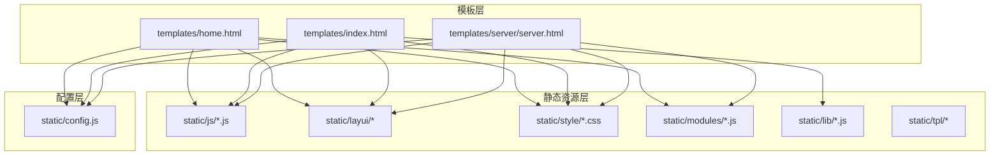
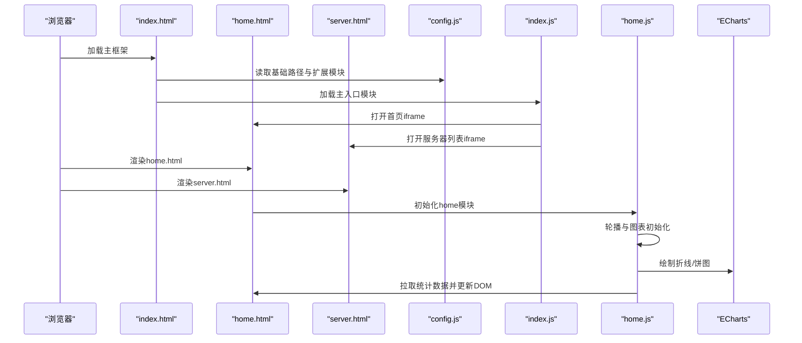
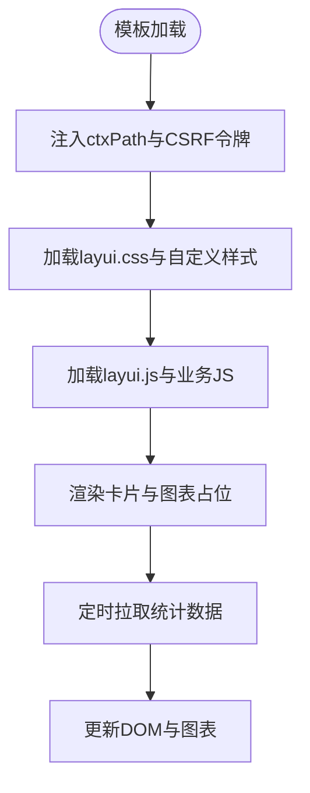
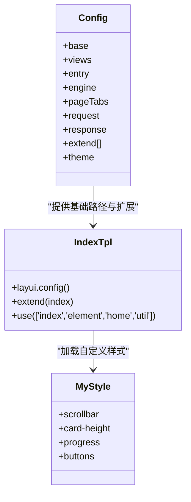
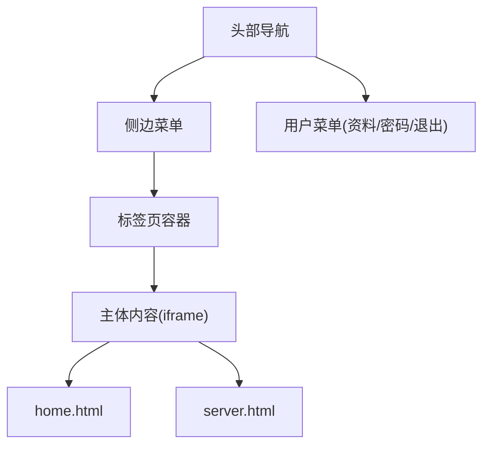
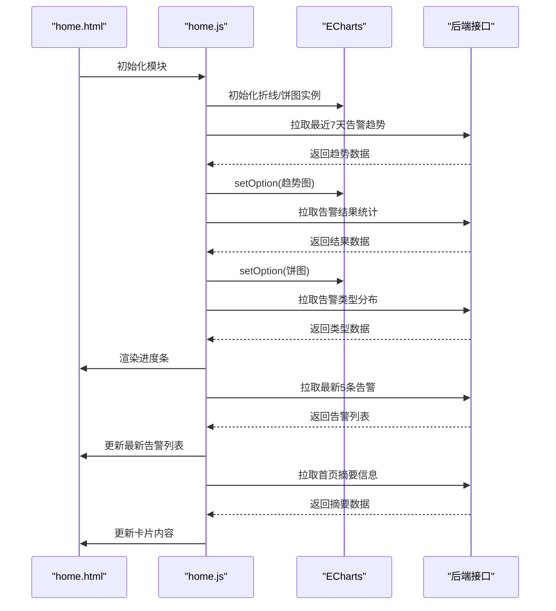
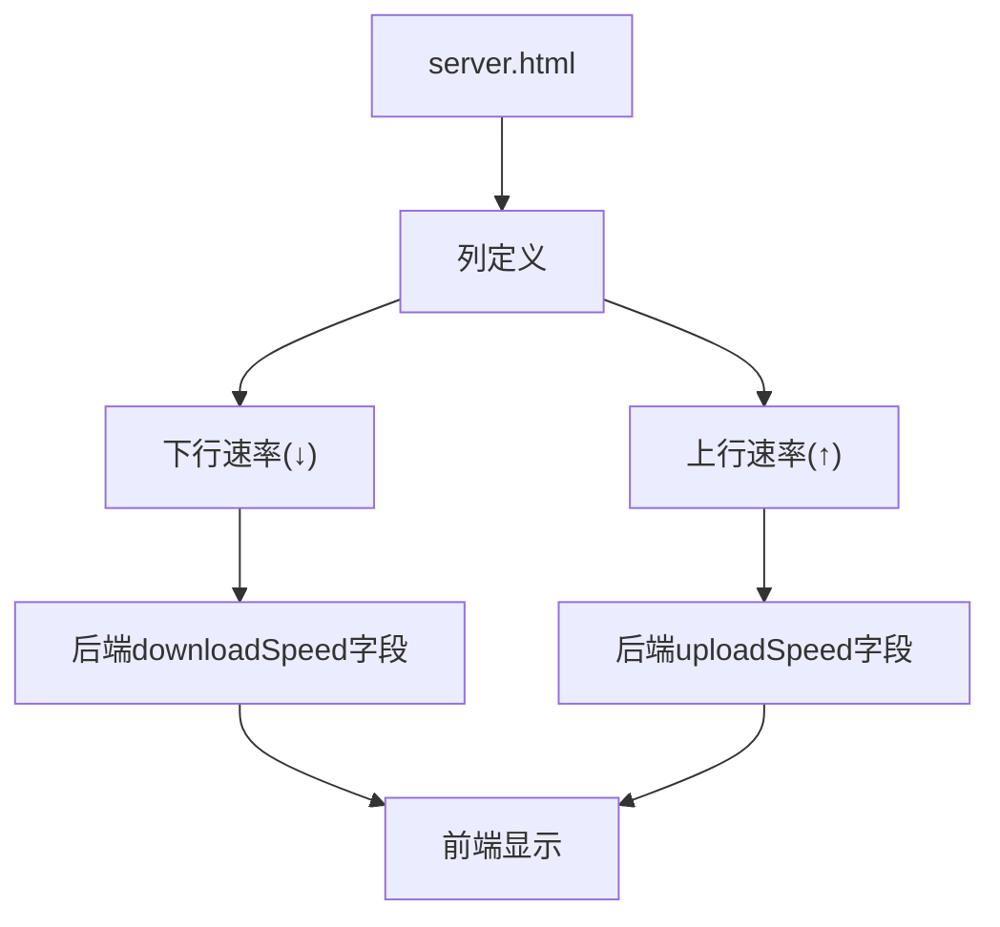
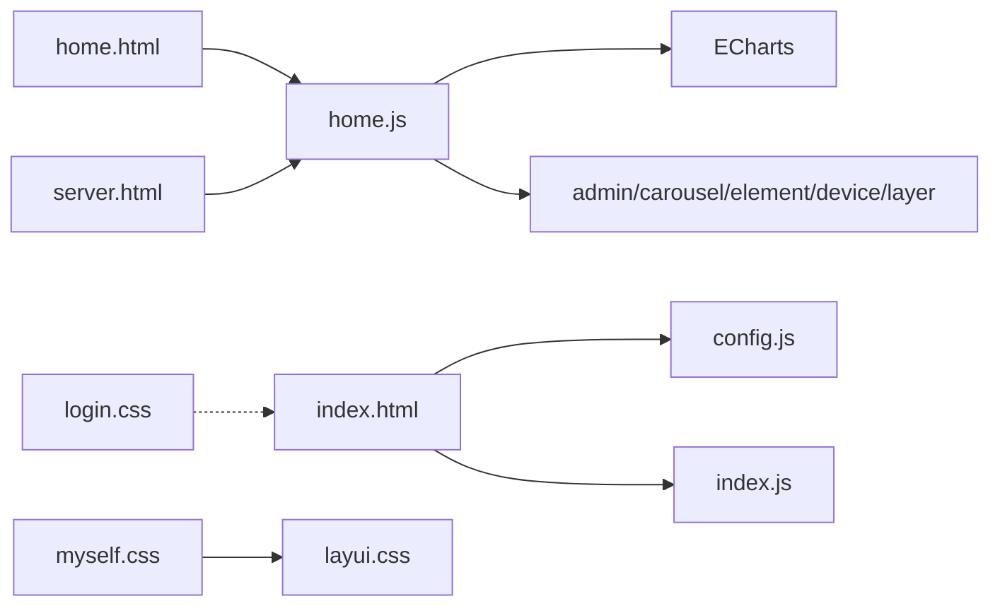

# 模板页面与前端资源

<cite>
**本文引用的文件**
- [home.html](file://phoenix-ui/src/main/resources/templates/home.html)
- [index.html](file://phoenix-ui/src/main/resources/templates/index.html)
- [server.html](file://phoenix-ui/src/main/resources/templates/server/server.html)
- [common.js](file://phoenix-ui/src/main/resources/static/js/common.js)
- [myself.css](file://phoenix-ui/src/main/resources/static/style/myself.css)
- [layui.css](file://phoenix-ui/src/main/resources/static/layui/css/layui.css)
- [index.js](file://phoenix-ui/src/main/resources/static/lib/index.js)
- [home.js](file://phoenix-ui/src/main/resources/static/modules/home.js)
- [config.js](file://phoenix-ui/src/main/resources/static/config.js)
- [login.css](file://phoenix-ui/src/main/resources/static/style/login.css)
</cite>

## 目录
1. [简介](#简介)
2. [项目结构](#项目结构)
3. [核心组件](#核心组件)
4. [架构总览](#架构总览)
5. [详细组件分析](#详细组件分析)
6. [依赖关系分析](#依赖关系分析)
7. [性能考量](#性能考量)
8. [故障排查指南](#故障排查指南)
9. [结论](#结论)
10. [附录](#附录)

## 简介
本文件面向Phoenix项目中的模板页面与前端资源，围绕Thymeleaf模板引擎在首页home.html与登录页index.html中的使用展开，系统梳理前端静态资源组织（JS、CSS、图片、字体）、Layui前端框架的集成与定制、页面布局（头部导航、侧边菜单、内容区、标签页、底部等），并总结响应式设计、浏览器兼容性、性能优化与可访问性等最佳实践。

## 项目结构
Phoenix前端资源主要位于phoenix-ui模块的resources目录下，采用"模板+静态资源"的分离方式：
- 模板层：templates目录存放Thymeleaf页面，如home.html、index.html等
- 静态资源层：static目录下按类别组织，包括js、layui、style、images、tpl、modules等
- 配置层：config.js集中定义Layui Admin的全局配置（视图路径、扩展模块、主题等）

图表来源
- [home.html](file://phoenix-ui/src/main/resources/templates/home.html)
- [index.html](file://phoenix-ui/src/main/resources/templates/index.html)
- [server.html](file://phoenix-ui/src/main/resources/templates/server/server.html)
- [config.js](file://phoenix-ui/src/main/resources/static/config.js)

章节来源
- [home.html](file://phoenix-ui/src/main/resources/templates/home.html)
- [index.html](file://phoenix-ui/src/main/resources/templates/index.html)
- [server.html](file://phoenix-ui/src/main/resources/templates/server/server.html)
- [config.js](file://phoenix-ui/src/main/resources/static/config.js)

## 核心组件
- Thymeleaf模板引擎：在模板中通过th:*指令绑定后端数据模型、拼接静态资源URL、注入CSRF令牌等
- Layui前端框架：提供UI组件、布局、主题、模块化加载与扩展机制
- 动态模块：home.js负责首页图表与数据刷新；index.js负责主框架的标签页打开、路由切换等
- 公共工具：common.js封装通用方法（合并单元格、校验、格式化、UUID等）
- 样式定制：myself.css覆盖Layui默认样式，适配业务需求；login.css用于登录页样式

章节来源
- [home.html](file://phoenix-ui/src/main/resources/templates/home.html)
- [index.html](file://phoenix-ui/src/main/resources/templates/index.html)
- [server.html](file://phoenix-ui/src/main/resources/templates/server/server.html)
- [common.js](file://phoenix-ui/src/main/resources/static/js/common.js)
- [myself.css](file://phoenix-ui/src/main/resources/static/style/myself.css)
- [layui.css](file://phoenix-ui/src/main/resources/static/layui/css/layui.css)
- [index.js](file://phoenix-ui/src/main/resources/static/lib/index.js)
- [home.js](file://phoenix-ui/src/main/resources/static/modules/home.js)
- [config.js](file://phoenix-ui/src/main/resources/static/config.js)
- [login.css](file://phoenix-ui/src/main/resources/static/style/login.css)

## 架构总览
前端整体采用"模板驱动 + 模块化加载"的架构：
- 模板通过Thymeleaf解析，注入上下文变量（如CSRF、ctxPath）
- Layui通过config.js配置基础路径与扩展模块，index.js作为主入口加载admin、view等模块
- 页面内容通过iframe嵌入各业务模板，配合标签页管理实现多页面无刷新切换
- 首页home.html通过home.js异步拉取统计数据，结合ECharts绘制可视化图表

图表来源
- [index.html](file://phoenix-ui/src/main/resources/templates/index.html)
- [home.html](file://phoenix-ui/src/main/resources/templates/home.html)
- [server.html](file://phoenix-ui/src/main/resources/templates/server/server.html)
- [config.js](file://phoenix-ui/src/main/resources/static/config.js)
- [index.js](file://phoenix-ui/src/main/resources/static/lib/index.js)
- [home.js](file://phoenix-ui/src/main/resources/static/modules/home.js)

## 详细组件分析

### Thymeleaf模板与CSRF集成
- 首页与登录页均引入Thymeleaf命名空间，通过th:href/@{}拼接静态资源路径，确保部署路径变化时仍能正确加载
- 登录页index.html在head中注入ctxPath与CSRF令牌，供后续JS使用
- 首页home.html同样注入ctxPath，配合CSRF令牌在AJAX请求中传递

图表来源
- [home.html](file://phoenix-ui/src/main/resources/templates/home.html)
- [index.html](file://phoenix-ui/src/main/resources/templates/index.html)

章节来源
- [home.html](file://phoenix-ui/src/main/resources/templates/home.html)
- [index.html](file://phoenix-ui/src/main/resources/templates/index.html)

### Layui集成与主题定制
- config.js集中定义基础路径base、视图目录views、默认入口entry、页面标签页开关pageTabs、响应字段response、扩展模块extend（如echarts、dropdown）以及主题theme配色方案
- index.html通过layui.config(base:)与extend配置，加载index.js主入口；index.js进一步加载admin、view等模块，实现标签页打开、路由切换等功能
- myself.css对Layui默认样式进行覆盖，如滚动条、卡片高度、进度条、按钮样式等，满足业务视觉规范

图表来源
- [config.js](file://phoenix-ui/src/main/resources/static/config.js)
- [index.html](file://phoenix-ui/src/main/resources/templates/index.html)
- [myself.css](file://phoenix-ui/src/main/resources/static/style/myself.css)

章节来源
- [config.js](file://phoenix-ui/src/main/resources/static/config.js)
- [index.html](file://phoenix-ui/src/main/resources/templates/index.html)
- [myself.css](file://phoenix-ui/src/main/resources/static/style/myself.css)

### 页面布局设计
- 头部导航：index.html定义左侧折叠/刷新、右侧用户菜单、主题切换、全屏、关于等入口
- 侧边菜单：index.html构建树形导航，支持权限控制（如超级管理员可见的配置管理、用户管理、日志、Druid、Knife4j等）
- 标签页：index.html提供多标签页容器，index.js负责新增/切换/关闭标签页，iframe承载具体页面
- 主体内容：iframe内加载home.html或其他业务模板
- 底部版权：login.css中定义登录页底部版权信息样式

图表来源
- [index.html](file://phoenix-ui/src/main/resources/templates/index.html)
- [login.css](file://phoenix-ui/src/main/resources/static/style/login.css)

章节来源
- [index.html](file://phoenix-ui/src/main/resources/templates/index.html)
- [login.css](file://phoenix-ui/src/main/resources/static/style/login.css)

### 首页home.html与home.js数据流
- 首页home.html通过Layui卡片布局展示服务器、应用、数据库、网络、TCP、HTTP等监控摘要，并提供告警统计轮播
- home.js初始化轮播与ECharts图表，定时向后端接口发起AJAX请求，拉取最近7天告警趋势、告警结果统计、告警类型分布、最新告警列表与首页摘要信息，动态更新DOM与图表
- 图表采用ECharts主题（infographic），支持响应式尺寸调整

图表来源
- [home.html](file://phoenix-ui/src/main/resources/templates/home.html)
- [home.js](file://phoenix-ui/src/main/resources/static/modules/home.js)

章节来源
- [home.html](file://phoenix-ui/src/main/resources/templates/home.html)
- [home.js](file://phoenix-ui/src/main/resources/static/modules/home.js)

### 服务器列表模板与速率列标题标准化
**更新** 服务器列表模板中的下行速率和上行速率列标题已从"下行带宽(↓)"和"上行带宽(↑)"标准化为"下行速率(↓)"和"上行速率(↑)"，确保表格显示与技术术语保持一致

- 服务器列表模板server.html在第222-230行定义了网络速率列，包含下行速率和上行速率两个字段
- 列标题使用"下行速率(↓)"和"上行速率(↑)"，与后端ServerDetailPageServerNetcardVo类中的downloadSpeed和uploadSpeed字段对应
- 这一标准化确保了监控界面中网络速率指标的准确表达，避免了"带宽"与"速率"概念混淆

图表来源
- [server.html](file://phoenix-ui/src/main/resources/templates/server/server.html)

章节来源
- [server.html](file://phoenix-ui/src/main/resources/templates/server/server.html)

### 前端静态资源组织与优化策略
- JS资源：common.js提供通用工具函数；index.js为主入口；home.js为首页业务模块；echarts系列用于图表；jquery/base64/md5/respond等按需引入
- CSS资源：layui.css为基础UI样式；myself.css为业务定制样式；login.css为登录页样式
- 图片与字体：通过相对路径引用，配合Thymeleaf的@{}确保部署一致性
- 优化建议：
  - 合理拆分与懒加载：将非首屏资源延迟加载，减少首屏阻塞
  - CDN与缓存：对第三方库（如jQuery、ECharts）考虑CDN，设置强缓存策略
  - 压缩与合并：生产环境启用压缩与合并，降低带宽占用
  - 资源指纹：为静态资源添加版本号或哈希，避免缓存问题

章节来源
- [common.js](file://phoenix-ui/src/main/resources/static/js/common.js)
- [myself.css](file://phoenix-ui/src/main/resources/static/style/myself.css)
- [layui.css](file://phoenix-ui/src/main/resources/static/layui/css/layui.css)
- [index.js](file://phoenix-ui/src/main/resources/static/lib/index.js)
- [home.js](file://phoenix-ui/src/main/resources/static/modules/home.js)
- [config.js](file://phoenix-ui/src/main/resources/static/config.js)

## 依赖关系分析
- 模板依赖：home.html、index.html与server.html均依赖config.js提供的基础路径与扩展模块；index.html还依赖index.js作为主入口
- 模块依赖：home.js依赖admin、carousel、element、device、layer等Layui模块；同时依赖ECharts进行可视化
- 样式依赖：myself.css覆盖Layui默认样式；login.css独立于Layui主题，专用于登录页

图表来源
- [index.html](file://phoenix-ui/src/main/resources/templates/index.html)
- [home.html](file://phoenix-ui/src/main/resources/templates/home.html)
- [server.html](file://phoenix-ui/src/main/resources/templates/server/server.html)
- [config.js](file://phoenix-ui/src/main/resources/static/config.js)
- [index.js](file://phoenix-ui/src/main/resources/static/lib/index.js)
- [home.js](file://phoenix-ui/src/main/resources/static/modules/home.js)
- [myself.css](file://phoenix-ui/src/main/resources/static/style/myself.css)
- [login.css](file://phoenix-ui/src/main/resources/static/style/login.css)

章节来源
- [index.html](file://phoenix-ui/src/main/resources/templates/index.html)
- [home.html](file://phoenix-ui/src/main/resources/templates/home.html)
- [server.html](file://phoenix-ui/src/main/resources/templates/server/server.html)
- [config.js](file://phoenix-ui/src/main/resources/static/config.js)
- [index.js](file://phoenix-ui/src/main/resources/static/lib/index.js)
- [home.js](file://phoenix-ui/src/main/resources/static/modules/home.js)
- [myself.css](file://phoenix-ui/src/main/resources/static/style/myself.css)
- [login.css](file://phoenix-ui/src/main/resources/static/style/login.css)

## 性能考量
- 资源加载：通过config.js统一管理base路径，避免硬编码导致的资源404；按需加载index.js与业务模块
- 图表性能：ECharts实例按需初始化，窗口resize时仅调整尺寸与重绘，避免重复创建
- 定时刷新：home.js采用定时器每30秒刷新一次数据，可根据业务负载调优频率
- 响应式与兼容：通过respond.js与html5.js提升低版本IE的兼容性；媒体查询适配移动端滚动条样式

## 故障排查指南
- CSRF相关问题：确认模板中已注入CSRF令牌并在AJAX请求头中携带；检查后端CSRF配置与拦截规则
- 资源路径问题：若出现静态资源404，检查config.js中的base路径与模板中的th:href/@{}拼接逻辑
- 图表不显示：确认ECharts库已正确加载且实例初始化时传入正确的DOM节点；检查resize事件处理
- 标签页无法切换：检查index.js中openTabsPage逻辑与iframe地址；确认后端接口返回格式符合response配置
- 速率显示异常：检查server.html中列标题与后端downloadSpeed/uploadSpeed字段映射关系

章节来源
- [home.html](file://phoenix-ui/src/main/resources/templates/home.html)
- [index.html](file://phoenix-ui/src/main/resources/templates/index.html)
- [server.html](file://phoenix-ui/src/main/resources/templates/server/server.html)
- [config.js](file://phoenix-ui/src/main/resources/static/config.js)
- [home.js](file://phoenix-ui/src/main/resources/static/modules/home.js)

## 结论
Phoenix项目通过Thymeleaf模板与Layui框架实现了清晰的页面结构与良好的交互体验。模板层与静态资源层分离，配合config.js集中配置与index.js主入口模块，使页面具备良好的可维护性与扩展性。首页home.js通过ECharts实现数据可视化，定时刷新机制保障信息实时性。服务器列表模板中的速率列标题标准化提升了监控界面的专业性和准确性。遵循本文的资源组织、兼容性与性能优化建议，可进一步提升前端质量与用户体验。

## 附录
- 最佳实践清单
  - 响应式设计：基于媒体查询适配移动端，确保滚动条与布局在不同屏幕下的表现一致
  - 浏览器兼容：保留respond.js与html5.js，针对低版本IE进行特性降级
  - 性能优化：启用静态资源压缩与合并、合理拆分与懒加载、设置合适的缓存策略
  - 可访问性：为交互元素提供语义化标签与键盘导航支持，确保高对比度与可读性
  - 安全性：严格校验与转义用户输入，确保CSRF防护与XSS防护措施到位
  - 术语标准化：保持监控指标术语的一致性，如"速率"而非"带宽"，确保技术表达准确性