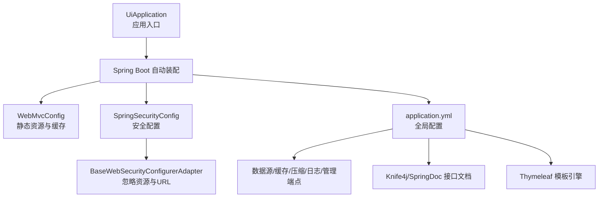
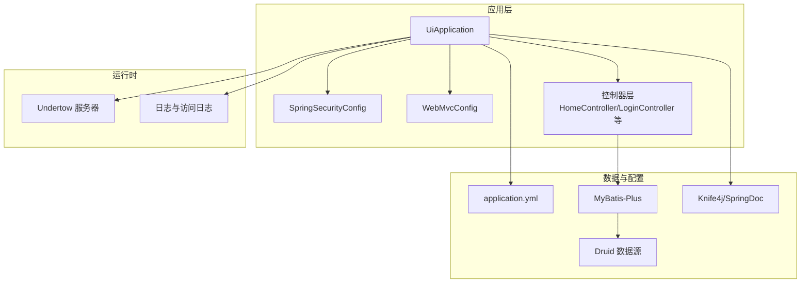
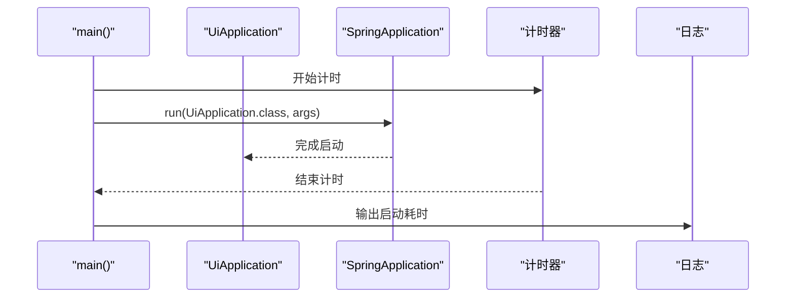
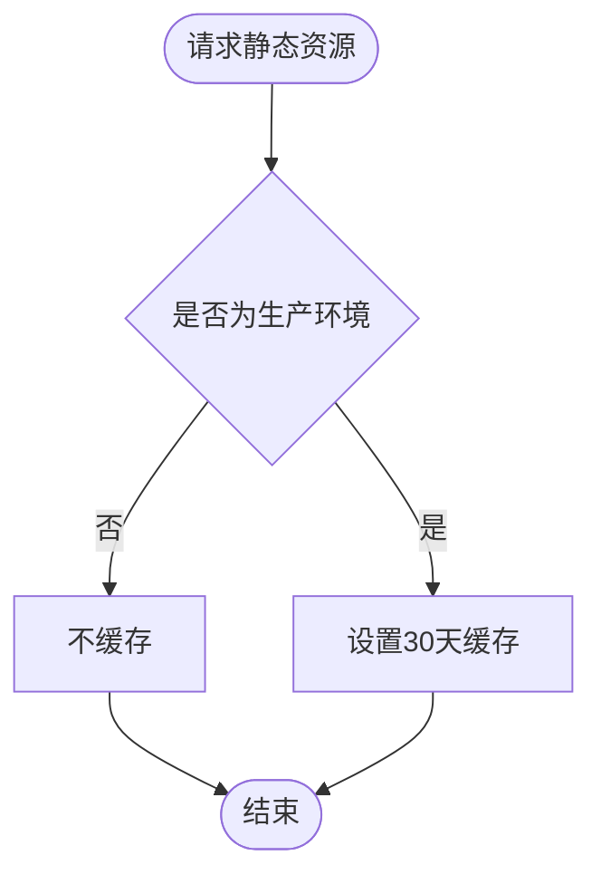
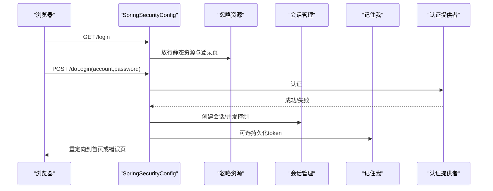
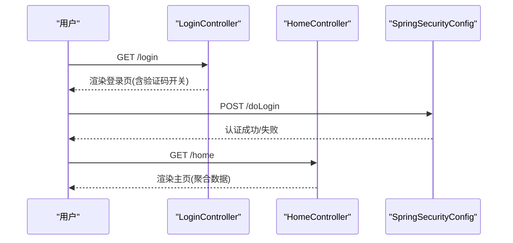
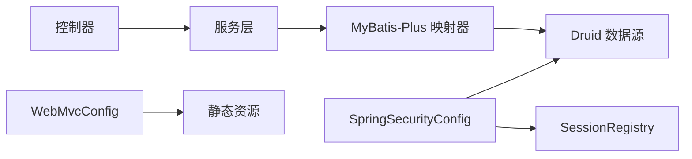

# 监控UI端模块

<cite>
**本文引用的文件**
- [UiApplication.java](file://phoenix-ui/src/main/java/com/gitee/pifeng/monitoring/ui/UiApplication.java)
- [application.yml](file://phoenix-ui/src/main/resources/application.yml)
- [WebMvcConfig.java](file://phoenix-ui/src/main/java/com/gitee/pifeng/monitoring/ui/config/WebMvcConfig.java)
- [SpringSecurityConfig.java](file://phoenix-ui/src/main/java/com/gitee/pifeng/monitoring/ui/config/springsecurity/SpringSecurityConfig.java)
- [BaseWebSecurityConfigurerAdapter.java](file://phoenix-ui/src/main/java/com/gitee/pifeng/monitoring/ui/config/springsecurity/BaseWebSecurityConfigurerAdapter.java)
- [SpringSecurityUtils.java](file://phoenix-ui/src/main/java/com/gitee/pifeng/monitoring/ui/util/SpringSecurityUtils.java)
- [UiModuleConstants.java](file://phoenix-ui/src/main/java/com/gitee/pifeng/monitoring/ui/constant/UiModuleConstants.java)
- [HomeController.java](file://phoenix-ui/src/main/java/com/gitee/pifeng/monitoring/ui/business/web/controller/HomeController.java)
- [LoginController.java](file://phoenix-ui/src/main/java/com/gitee/pifeng/monitoring/ui/business/web/controller/LoginController.java)
- [SelfAuthProperties.java](file://phoenix-ui/src/main/java/com/gitee/pifeng/monitoring/ui/property/auth/selfauth/SelfAuthProperties.java)
- [ThirdAuthProperties.java](file://phoenix-ui/src/main/java/com/gitee/pifeng/monitoring/ui/property/auth/thirdauth/ThirdAuthProperties.java)
</cite>

## 目录
1. [简介](#简介)
2. [项目结构](#项目结构)
3. [核心组件](#核心组件)
4. [架构总览](#架构总览)
5. [详细组件分析](#详细组件分析)
6. [依赖分析](#依赖分析)
7. [性能考虑](#性能考虑)
8. [故障排查指南](#故障排查指南)
9. [结论](#结论)
10. [附录](#附录)

## 简介
本技术文档面向监控UI端模块，系统性阐述其架构设计与实现细节，重点覆盖以下方面：
- 启动流程与核心配置：UiApplication启动、Spring Boot自动装配、 Undertow定制、缓存与事务等特性启用
- Spring MVC与静态资源：静态资源映射、缓存策略、开发/生产差异化配置
- Spring Security安全体系：基于表单登录、会话管理、记住我、会话并发控制、忽略资源与URL等
- 页面功能模块：主页仪表盘、服务器、应用实例、数据库、网络、TCP、HTTP、告警、配置管理、用户管理、日志、我的信息等
- 用户交互流程：登录认证、权限控制、数据展示、操作反馈与页面跳转
- 配置管理：主题、菜单权限、页面布局、国际化、认证方式（自建/第三方）等
- 扩展机制：新增监控视图、自定义图表、集成第三方前端框架
- 性能优化：静态资源优化、页面渲染优化、数据加载优化
- 部署与维护：前端构建、静态资源部署、浏览器兼容性

## 项目结构
UI端采用标准Spring Boot工程结构，核心代码位于com.gitee.pifeng.monitoring.ui包下，配置集中在resources/application.yml，静态资源与模板位于resources/static与resources/templates。

**图表来源**
- [UiApplication.java:1-49](file://phoenix-ui/src/main/java/com/gitee/pifeng/monitoring/ui/UiApplication.java#L1-L49)
- [WebMvcConfig.java:1-56](file://phoenix-ui/src/main/java/com/gitee/pifeng/monitoring/ui/config/WebMvcConfig.java#L1-L56)
- [SpringSecurityConfig.java:1-236](file://phoenix-ui/src/main/java/com/gitee/pifeng/monitoring/ui/config/springsecurity/SpringSecurityConfig.java#L1-L236)
- [BaseWebSecurityConfigurerAdapter.java:1-52](file://phoenix-ui/src/main/java/com/gitee/pifeng/monitoring/ui/config/springsecurity/BaseWebSecurityConfigurerAdapter.java#L1-L52)
- [application.yml:1-238](file://phoenix-ui/src/main/resources/application.yml#L1-L238)

**章节来源**
- [UiApplication.java:1-49](file://phoenix-ui/src/main/java/com/gitee/pifeng/monitoring/ui/UiApplication.java#L1-L49)
- [application.yml:1-238](file://phoenix-ui/src/main/resources/application.yml#L1-L238)

## 核心组件
- 应用入口与启动
  - UiApplication作为Spring Boot入口，启用重试、缓存、事务、AOP代理、组件扫描等特性，并继承自定制的Undertow工厂定制器，便于统一配置服务器行为
  - 启动计时与日志输出，便于评估启动耗时
- 配置中心
  - application.yml集中管理服务器、日志、Spring、数据源、MyBatis-Plus、管理端点、Knife4j/SpringDoc、Thymeleaf等配置
- 安全框架
  - SpringSecurityConfig基于表单登录，结合会话并发控制、记住我、忽略静态资源与特定URL、密码加密等
  - BaseWebSecurityConfigurerAdapter定义忽略资源与URL集合，供各环境共享
- MVC与静态资源
  - WebMvcConfig在生产环境配置静态资源缓存策略，避免重复下载，同时保留接口文档相关资源不缓存
- 工具与常量
  - SpringSecurityUtils提供当前用户上下文、更新认证、强制下线等能力
  - UiModuleConstants定义UI模块名称常量，用于操作日志与菜单标识

**章节来源**
- [UiApplication.java:19-46](file://phoenix-ui/src/main/java/com/gitee/pifeng/monitoring/ui/UiApplication.java#L19-L46)
- [application.yml:1-238](file://phoenix-ui/src/main/resources/application.yml#L1-L238)
- [SpringSecurityConfig.java:33-166](file://phoenix-ui/src/main/java/com/gitee/pifeng/monitoring/ui/config/springsecurity/SpringSecurityConfig.java#L33-L166)
- [BaseWebSecurityConfigurerAdapter.java:13-51](file://phoenix-ui/src/main/java/com/gitee/pifeng/monitoring/ui/config/springsecurity/BaseWebSecurityConfigurerAdapter.java#L13-L51)
- [WebMvcConfig.java:23-55](file://phoenix-ui/src/main/java/com/gitee/pifeng/monitoring/ui/config/WebMvcConfig.java#L23-L55)
- [SpringSecurityUtils.java:25-141](file://phoenix-ui/src/main/java/com/gitee/pifeng/monitoring/ui/util/SpringSecurityUtils.java#L25-L141)
- [UiModuleConstants.java:11-83](file://phoenix-ui/src/main/java/com/gitee/pifeng/monitoring/ui/constant/UiModuleConstants.java#L11-L83)

## 架构总览
UI端整体架构围绕“入口应用 + 安全框架 + MVC + 模板引擎 + 数据访问 + 配置中心”展开，采用Thymeleaf渲染页面，Spring Security保障访问安全，Knife4j/SpringDoc提供接口文档，Druid监控数据源与SQL。

**图表来源**
- [UiApplication.java:37-46](file://phoenix-ui/src/main/java/com/gitee/pifeng/monitoring/ui/UiApplication.java#L37-L46)
- [SpringSecurityConfig.java:39-166](file://phoenix-ui/src/main/java/com/gitee/pifeng/monitoring/ui/config/springsecurity/SpringSecurityConfig.java#L39-L166)
- [WebMvcConfig.java:35-52](file://phoenix-ui/src/main/java/com/gitee/pifeng/monitoring/ui/config/WebMvcConfig.java#L35-L52)
- [application.yml:84-152](file://phoenix-ui/src/main/resources/application.yml#L84-L152)

## 详细组件分析

### 启动流程与入口应用
- 启动入口：UiApplication.main()调用SpringApplication.run()，并使用计时器统计启动耗时
- 自定义服务器：继承自定制的Undertow工厂定制器，便于统一配置访问日志、优雅停机等
- 特性启用：重试、缓存、事务、AOP代理、组件扫描等，满足监控UI的高可用与可维护性需求

**图表来源**
- [UiApplication.java:39-46](file://phoenix-ui/src/main/java/com/gitee/pifeng/monitoring/ui/UiApplication.java#L39-L46)

**章节来源**
- [UiApplication.java:19-46](file://phoenix-ui/src/main/java/com/gitee/pifeng/monitoring/ui/UiApplication.java#L19-L46)

### Spring MVC与静态资源
- 生产环境静态资源缓存：WebMvcConfig在prod环境下对/**静态资源设置30天缓存，提升CDN与浏览器命中率
- 接口文档资源：保留/doc.html与/webjars/**不缓存，确保开发者工具与Swagger UI即时生效
- 开发环境：dev/profiles.active=- dev，便于热加载与快速迭代

**图表来源**
- [WebMvcConfig.java:23-55](file://phoenix-ui/src/main/java/com/gitee/pifeng/monitoring/ui/config/WebMvcConfig.java#L23-L55)

**章节来源**
- [WebMvcConfig.java:23-55](file://phoenix-ui/src/main/java/com/gitee/pifeng/monitoring/ui/config/WebMvcConfig.java#L23-L55)
- [application.yml:65-74](file://phoenix-ui/src/main/resources/application.yml#L65-L74)

### Spring Security 安全框架集成
- 表单登录：用户名/密码参数、登录页、处理路径、成功/失败回调
- 会话管理：超时跳转、最大会话数、并发登录控制、过期跳转
- 记住我：基于Spring Session的RememberMe服务，有效期约30天
- 忽略资源与URL：静态资源、健康检查、关机端点等免认证
- 密码加密：BCryptPasswordEncoder
- 并发会话：通过Spring Session + SessionRegistry实现

**图表来源**
- [SpringSecurityConfig.java:112-166](file://phoenix-ui/src/main/java/com/gitee/pifeng/monitoring/ui/config/springsecurity/SpringSecurityConfig.java#L112-L166)
- [BaseWebSecurityConfigurerAdapter.java:18-49](file://phoenix-ui/src/main/java/com/gitee/pifeng/monitoring/ui/config/springsecurity/BaseWebSecurityConfigurerAdapter.java#L18-L49)

**章节来源**
- [SpringSecurityConfig.java:33-236](file://phoenix-ui/src/main/java/com/gitee/pifeng/monitoring/ui/config/springsecurity/SpringSecurityConfig.java#L33-L236)
- [BaseWebSecurityConfigurerAdapter.java:13-51](file://phoenix-ui/src/main/java/com/gitee/pifeng/monitoring/ui/config/springsecurity/BaseWebSecurityConfigurerAdapter.java#L13-L51)
- [application.yml:14-27](file://phoenix-ui/src/main/resources/application.yml#L14-L27)

### 页面功能模块
- 主页仪表盘：聚合应用实例、服务器、网络、数据库、TCP、HTTP、告警等摘要信息
- 实时监控视图：按模块展示实时状态与趋势
- 历史数据分析：主页提供最近7天告警统计、告警类型/结果统计等
- 告警管理：告警记录、详情、统计
- 系统配置：环境、分组、告警定义等
- 用户管理：用户、角色
- 日志：操作日志、异常日志
- 我的：个人信息、修改密码

上述模块由HomeController与各业务控制器提供页面与接口支撑，使用Thymeleaf模板渲染，接口返回LayUiAdmin风格的结果对象。

**章节来源**
- [HomeController.java:90-207](file://phoenix-ui/src/main/java/com/gitee/pifeng/monitoring/ui/business/web/controller/HomeController.java#L90-L207)
- [UiModuleConstants.java:11-83](file://phoenix-ui/src/main/java/com/gitee/pifeng/monitoring/ui/constant/UiModuleConstants.java#L11-L83)

### 用户交互流程
- 登录认证：访问/login，根据配置决定是否启用验证码；提交/doLogin，成功后跳转/login-success并重定向至首页
- 权限控制：除登录页、验证码、静态资源外，其余请求均需认证；会话超时/过期跳转登录页
- 数据展示：主页通过/home与/home/get-summary-info等接口拉取聚合数据
- 操作反馈：接口统一返回LayUiAdmin风格结果对象，页面以表格、图表等形式展示

**图表来源**
- [LoginController.java:42-65](file://phoenix-ui/src/main/java/com/gitee/pifeng/monitoring/ui/business/web/controller/LoginController.java#L42-L65)
- [HomeController.java:90-140](file://phoenix-ui/src/main/java/com/gitee/pifeng/monitoring/ui/business/web/controller/HomeController.java#L90-L140)
- [SpringSecurityConfig.java:112-133](file://phoenix-ui/src/main/java/com/gitee/pifeng/monitoring/ui/config/springsecurity/SpringSecurityConfig.java#L112-L133)

**章节来源**
- [LoginController.java:22-84](file://phoenix-ui/src/main/java/com/gitee/pifeng/monitoring/ui/business/web/controller/LoginController.java#L22-L84)
- [HomeController.java:90-207](file://phoenix-ui/src/main/java/com/gitee/pifeng/monitoring/ui/business/web/controller/HomeController.java#L90-L207)

### 配置管理
- 主题与布局：静态样式与模板位于resources/static/style与resources/templates，可通过资源替换实现主题切换
- 菜单权限：通过UiModuleConstants中的模块常量与操作日志联动，结合权限注解实现方法级控制
- 国际化：Thymeleaf与前端模板未见显式多语言配置，如需国际化可在模板与静态资源层面扩展
- 认证方式：phoenix.auth.type控制自建/第三方认证；自建认证属性位于phoenix.auth.self-auth；第三方认证属性位于phoenix.auth.third-auth
- 接口文档：Knife4j与SpringDoc配置，支持调试与版本控制

**章节来源**
- [application.yml:204-238](file://phoenix-ui/src/main/resources/application.yml#L204-L238)
- [SelfAuthProperties.java:15-19](file://phoenix-ui/src/main/java/com/gitee/pifeng/monitoring/ui/property/auth/selfauth/SelfAuthProperties.java#L15-L19)
- [ThirdAuthProperties.java:16-26](file://phoenix-ui/src/main/java/com/gitee/pifeng/monitoring/ui/property/auth/thirdauth/ThirdAuthProperties.java#L16-L26)

### 扩展机制
- 新增监控视图：在business/web/controller下新增控制器，提供页面与接口；在resources/templates下新增HTML模板；在UiModuleConstants中补充模块常量
- 自定义图表：在resources/static/js中引入图表库（如ECharts），在模板中渲染数据
- 集成第三方前端框架：通过静态资源映射与模板渲染，遵循现有MVC与Thymeleaf约定

**章节来源**
- [UiModuleConstants.java:11-83](file://phoenix-ui/src/main/java/com/gitee/pifeng/monitoring/ui/constant/UiModuleConstants.java#L11-L83)
- [WebMvcConfig.java:35-52](file://phoenix-ui/src/main/java/com/gitee/pifeng/monitoring/ui/config/WebMvcConfig.java#L35-L52)

## 依赖分析
- 组件耦合
  - 控制器依赖服务层接口，服务层依赖数据访问层（MyBatis-Plus）
  - 安全配置依赖会话注册表与数据源，用于并发控制与记住我
  - MVC配置依赖生产/开发环境profile，影响静态资源缓存策略
- 外部依赖
  - Undertow服务器、Druid数据源、Caffeine缓存、Spring Session、Knife4j/SpringDoc

**图表来源**
- [SpringSecurityConfig.java:44-51](file://phoenix-ui/src/main/java/com/gitee/pifeng/monitoring/ui/config/springsecurity/SpringSecurityConfig.java#L44-L51)
- [WebMvcConfig.java:35-52](file://phoenix-ui/src/main/java/com/gitee/pifeng/monitoring/ui/config/WebMvcConfig.java#L35-L52)
- [application.yml:84-152](file://phoenix-ui/src/main/resources/application.yml#L84-L152)

**章节来源**
- [SpringSecurityConfig.java:33-236](file://phoenix-ui/src/main/java/com/gitee/pifeng/monitoring/ui/config/springsecurity/SpringSecurityConfig.java#L33-L236)
- [WebMvcConfig.java:23-55](file://phoenix-ui/src/main/java/com/gitee/pifeng/monitoring/ui/config/WebMvcConfig.java#L23-L55)
- [application.yml:154-185](file://phoenix-ui/src/main/resources/application.yml#L154-L185)

## 性能考虑
- 静态资源优化
  - 生产环境对静态资源设置长缓存，减少带宽与服务器压力
  - 接口文档资源不缓存，确保调试一致性
- 页面渲染优化
  - Thymeleaf模板按需渲染，避免过度计算
  - 主页接口聚合多源数据，减少多次往返
- 数据加载优化
  - 缓存策略：Caffeine缓存、MyBatis-Plus配置、Druid监控
  - 异步与超时：Spring MVC异步超时配置，避免阻塞
  - 压缩：Gzip压缩响应体，降低传输体积

**章节来源**
- [WebMvcConfig.java:35-52](file://phoenix-ui/src/main/java/com/gitee/pifeng/monitoring/ui/config/WebMvcConfig.java#L35-L52)
- [application.yml:46-56](file://phoenix-ui/src/main/resources/application.yml#L46-L56)
- [application.yml:8-13](file://phoenix-ui/src/main/resources/application.yml#L8-L13)
- [application.yml:47-50](file://phoenix-ui/src/main/resources/application.yml#L47-L50)

## 故障排查指南
- 登录失败/验证码问题
  - 检查登录页模板与验证码开关配置
  - 查看认证失败处理器日志定位原因
- 会话并发/过期
  - 检查maximumSessions与expiredUrl配置
  - 使用SpringSecurityUtils强制下线指定用户
- 静态资源404
  - 确认生产环境profile已启用WebMvcConfig
  - 检查静态资源路径与缓存策略
- 接口文档不可用
  - 确认Knife4j与SpringDoc配置正确，排除缓存影响

**章节来源**
- [LoginController.java:42-49](file://phoenix-ui/src/main/java/com/gitee/pifeng/monitoring/ui/business/web/controller/LoginController.java#L42-L49)
- [SpringSecurityConfig.java:140-148](file://phoenix-ui/src/main/java/com/gitee/pifeng/monitoring/ui/config/springsecurity/SpringSecurityConfig.java#L140-L148)
- [SpringSecurityUtils.java:93-138](file://phoenix-ui/src/main/java/com/gitee/pifeng/monitoring/ui/util/SpringSecurityUtils.java#L93-L138)
- [WebMvcConfig.java:45-52](file://phoenix-ui/src/main/java/com/gitee/pifeng/monitoring/ui/config/WebMvcConfig.java#L45-L52)
- [application.yml:204-238](file://phoenix-ui/src/main/resources/application.yml#L204-L238)

## 结论
监控UI端模块以Spring Boot为基础，结合Spring Security与Thymeleaf，提供了安全、可扩展、易维护的监控可视化平台。通过清晰的启动流程、完善的MVC与安全配置、模块化的页面功能与丰富的配置项，能够满足企业级监控系统的日常运维与管理需求。建议在后续版本中进一步完善国际化与主题切换能力，并持续优化数据加载与渲染性能。

## 附录
- 部署与维护
  - 前端构建：静态资源与模板打包发布
  - 静态资源部署：结合CDN与浏览器缓存策略
  - 浏览器兼容性：关注IE与旧版移动端支持，必要时引入polyfill
- 运维要点
  - 启动耗时监控：利用UiApplication计时日志
  - 访问日志：Undertow访问日志目录与模式配置
  - 管理端点：健康检查与关机端点仅本地暴露

**章节来源**
- [UiApplication.java:39-46](file://phoenix-ui/src/main/java/com/gitee/pifeng/monitoring/ui/UiApplication.java#L39-L46)
- [application.yml:14-27](file://phoenix-ui/src/main/resources/application.yml#L14-L27)
- [application.yml:188-202](file://phoenix-ui/src/main/resources/application.yml#L188-L202)